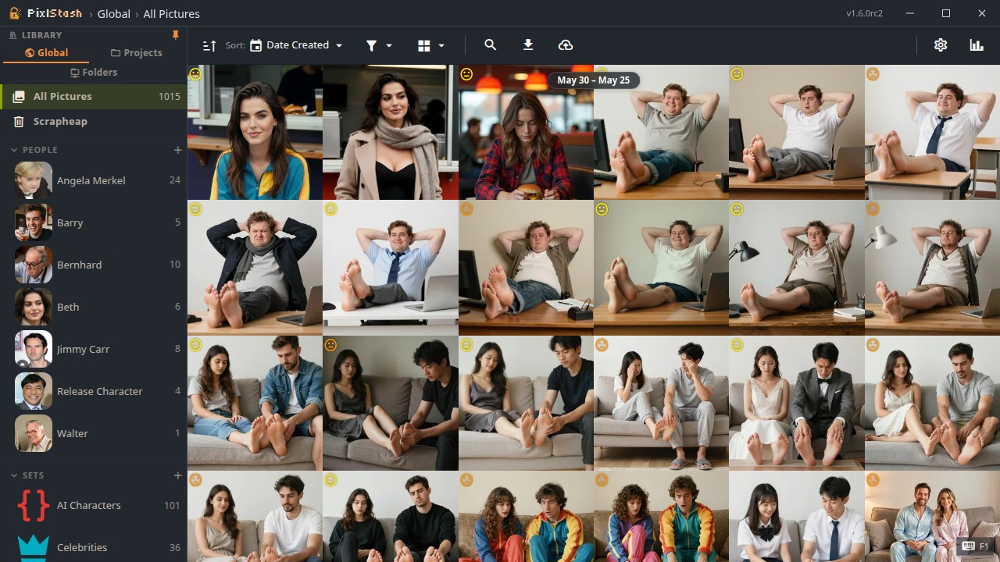

# PixlStash
<p align="center">
  
</p>

PixlStash is a local picture library server for organizing, filtering, and reviewing large image collections.

It provides:

- A browser-based interface
- Automatic tagging and image descriptions with selectable AI engines (including JoyCaption)
- Re-tag or regenerate descriptions for any selection directly from the context menu
- Instant grid loading — thumbnails appear immediately, metadata fills in asynchronously
- Fast metadata and tag filtering
- Smart score sorting
- Character and set organization
- Local storage of your library data
- API for integrating with other tools
- Simple keyboard shortcuts for scoring, selection, tagging, deletion and navigation.
- Integration with ComfyUI for running workflows on selected images within PixlStash.
- Plugin system for defining new filter operations that can be performed on a set of images.
- Sharing of pictures, picture sets, characters and projects.
- Persistent view URLs — bookmark or refresh any view and land exactly where you left off.

PixlStash runs on your machine and serves the UI at a local (or Internet-facing) web address.

## Install or try PixlStash

<p align="center">
  <a href="https://pixlstash.dev/install.html">
    
  </a>
  &nbsp;
  <a href="https://demo.pixlstash.dev?token=MWPcUXbn2pRCt-RKYsRsDnkaC6EANar794qXaLwlQwE">
    
  </a>
</p>

Detailed installation instructions on <a href="http://pixlstash.dev/install.html">pixlstash.dev</a>.


## First run and data location

On first run, PixlStash creates a user config directory and stores:

- Server config
- Database
- Imported media files

> **Model downloads:** On first startup, PixlStash automatically downloads the AI models required for tagging, captioning, and quality scoring. This includes several hundred MB of model weights. Downloads are stored in the platform user data directory:
>
> | OS | Path |
> |----|------|
> | **Linux** | `~/.local/share/pixlstash/downloaded_models/` |
> | **macOS** | `~/Library/Application Support/pixlstash/downloaded_models/` |
> | **Windows** | `%LOCALAPPDATA%\pixlstash\downloaded_models\` |
>
> An internet connection is required the first time the server starts. Subsequent starts use the cached models.

If you need to use a custom config path:

```bash
python -m pixlstash.app --server-config "C:\path\to\server-config.json"
```

## Server configuration

On first run, PixlStash generates a `server-config.json` file in the user config directory:

- **Linux / macOS:** `~/.config/pixlstash/server-config.json`
- **Windows:** `%LOCALAPPDATA%\pixlstash\server-config.json`

You can also supply a custom path with `--server-config <path>`.

On first run in an interactive terminal, PixlStash now launches a short setup wizard for:

- `image_root` (storage path)
- `port`
- `require_ssl` (HTTP/HTTPS)

Before the server starts, bootstrap also offers to set (or replace) the
initial username/password.

You can rerun the wizard at any time with:

```bash
python -m pixlstash.app --bootstrap
```

When rerunning the wizard, pressing Enter keeps existing values as defaults.

Edit the file and restart the server to apply changes.

### Network and port

| Key            | Default       | Description                                                                                                                                               |
| -------------- | ------------- | --------------------------------------------------------------------------------------------------------------------------------------------------------- |
| `host`         | `"localhost"` | Address the server binds to. Change to `"0.0.0.0"` to expose the server on the local network or internet.                                                 |
| `port`         | `9537`        | TCP port the server listens on.                                                                                                                           |
| `cors_origins` | `[]`          | Extra origins allowed to make credentialed cross-origin requests. `localhost`, `127.0.0.1`, and the server's own LAN IP are always permitted on any port. |
| `require_local_for_write` | `true` | When `true`, full login (username/password and ALL-scope tokens) is only permitted from local network addresses (RFC 1918 / loopback). READ-only share tokens are always accepted from any IP. Set to `false` to allow full login from any IP. |
| `trusted_proxies` | `[]` | List of proxy IP addresses whose `X-Forwarded-For` header should be trusted for real-client-IP detection. See [Sharing and remote access](#sharing-and-remote-access) below. |

At startup the server detects its own LAN IP and automatically allows it on any port. This means the Vite dev server works over LAN (`http://192.168.1.5:5173` → `http://192.168.1.5:9537`) without any extra configuration, as long as network access is enabled via `host`.

Use `cors_origins` only if you need to allow origins on a different machine entirely.

### Sharing and remote access

PixlStash supports read-only share tokens that let you give guests access to
a specific picture, picture set, character, or project without exposing your full
account. To safely share over the internet while keeping your login protected:

1. **Expose the server** — set `"host": "0.0.0.0"` and open/forward the port.
2. **Enable HTTPS** — set `"require_ssl": true` (strongly recommended whenever
   the server is internet-facing; see [SSL / HTTPS](#ssl--https) below).
3. **Keep `require_local_for_write: true`** (the default) — this ensures that
   full login is only possible from your local network or VPN. Share tokens
   (READ-only) continue to work from any IP.
4. **Create a share token** — in the PixlStash settings UI, create a READ-only
   token scoped to the resource you want to share. Copy the generated URL and
   send it to your guests.

#### If you run a reverse proxy (nginx, Caddy, Cloudflare Tunnel…)

When a proxy sits in front of PixlStash, `require_local_for_write` sees the
proxy's IP instead of the real client IP. You must tell PixlStash which proxy
addresses to trust so it reads the real IP from the `X-Forwarded-For` header:

| Scenario | `trusted_proxies` value |
|---|---|
| nginx/Caddy on the same machine | `["127.0.0.1"]` |
| Cloudflare Tunnel (cloudflared on same machine) | `["127.0.0.1"]` |
| Proxy on a different LAN machine | `["192.168.1.x"]` (the proxy's LAN IP) |

Example:
```json
{
  "host": "0.0.0.0",
  "require_ssl": true,
  "require_local_for_write": true,
  "trusted_proxies": ["127.0.0.1"]
}
```

> **Warning:** Only add addresses you control to `trusted_proxies`. Trusting an
> untrusted address allows that host to spoof any client IP, bypassing the local
> network restriction entirely.

### SSL / HTTPS

| Key               | Default                     | Description                                                                   |
| ----------------- | --------------------------- | ----------------------------------------------------------------------------- |
| `require_ssl`     | `false`                     | Enable HTTPS. When `true`, the server will use the key and certificate below. |
| `ssl_keyfile`     | `<config_dir>/ssl/key.pem`  | Path to the SSL private key file.                                             |
| `ssl_certfile`    | `<config_dir>/ssl/cert.pem` | Path to the SSL certificate file.                                             |
| `cookie_samesite` | `"Lax"`                     | `SameSite` attribute for session cookies (`"Lax"`, `"Strict"`, or `"None"`).  |
| `cookie_secure`   | `false`                     | Set the `Secure` flag on session cookies. Enable when serving over HTTPS.     |

When `require_ssl` is enabled and no certificate files exist at the configured
paths, PixlStash generates a **self-signed certificate** automatically. Browsers
will show a security warning for self-signed certs. To get a trusted certificate
without warnings, choose one of the options below.

#### Option A — Replace the auto-generated certificate with a real one

If you already have a certificate (e.g. from certbot or your DNS provider), drop
the files into the config directory and restart:

| OS | Default cert directory |
|----|------------------------|
| Linux / macOS | `~/.config/pixlstash/ssl/` |
| Windows | `%LOCALAPPDATA%\pixlstash\ssl\` |

Place your private key as `key.pem` and the full certificate chain as `cert.pem`,
or point `ssl_keyfile` / `ssl_certfile` at any paths you prefer.

To obtain a cert with **certbot** (requires port 80 reachable and a real domain):

```bash
certbot certonly --standalone -d pixlstash.example.com --email you@example.com
```

Then in `server-config.json`:

```json
{
  "require_ssl": true,
  "cookie_secure": true,
  "ssl_keyfile": "/etc/letsencrypt/live/pixlstash.example.com/privkey.pem",
  "ssl_certfile": "/etc/letsencrypt/live/pixlstash.example.com/fullchain.pem"
}
```

Certbot installs a systemd timer / cron job that renews automatically. The
`--standalone` renewal briefly needs port 80; use a
[pre/post hook](https://eff-certbot.readthedocs.io/en/latest/using.html#pre-and-post-validation-hooks)
to stop and restart PixlStash around the renewal if it is bound to port 80.

#### Option B — Caddy as a reverse proxy (automatic Let's Encrypt)

[Caddy](https://caddyserver.com/) provisions and renews a trusted TLS certificate
automatically whenever it proxies a request for a real domain. No manual cert
management required.

1. Install Caddy: `sudo apt install caddy` (or see [caddyserver.com](https://caddyserver.com/docs/install))
2. Create `/etc/caddy/Caddyfile`:
   ```
   pixlstash.example.com {
       reverse_proxy localhost:9537
   }
   ```
3. `sudo systemctl reload caddy`

PixlStash itself can stay on plain HTTP (`require_ssl: false`); Caddy terminates
TLS externally. Set `"trusted_proxies": ["127.0.0.1"]` in `server-config.json`
so that `require_local_for_write` correctly identifies the real client IP (see
[Sharing and remote access](#sharing-and-remote-access)).

#### Option C — Cloudflare Tunnel (no open port, no domain purchase required)

[Cloudflare Tunnel](https://developers.cloudflare.com/cloudflare-one/connections/connect-networks/)
routes traffic to PixlStash through Cloudflare's edge without opening any inbound
firewall ports. Cloudflare provides a free `*.trycloudflare.com` subdomain with a
valid TLS certificate, or you can use your own domain.

```bash
# Install cloudflared, then:
cloudflared tunnel --url http://localhost:9537
```

Cloudflare terminates TLS; PixlStash runs plain HTTP internally. As with Caddy,
set `"trusted_proxies": ["127.0.0.1"]` so local-write restrictions work correctly.

### Storage

| Key             | Default               | Description                                                                                                                  |
| --------------- | --------------------- | ---------------------------------------------------------------------------------------------------------------------------- |
| `image_root`    | `<config_dir>/images` | Directory where imported media files are stored.                                                                             |

Automatic import folders are stored in the database and managed via the
Import Folders UI/API, not in `server-config.json`.

### Processing

| Key                              | Default | Description                                          |
| -------------------------------- | ------- | ---------------------------------------------------- |
| `default_device`                 | `"cpu"` | Device used for AI processing (`"cpu"` or `"cuda"`). |
| `generate_thumbnails_on_startup` | `true`  | Generate missing thumbnails when the server starts.  |

To remove stale database records for missing source files at startup, run:

```bash
python -m pixlstash.app --cleanup-missing-pictures
```

### Logging

| Key         | Default                   | Description                                                  |
| ----------- | ------------------------- | ------------------------------------------------------------ |
| `log_level` | `"info"`                  | Log verbosity (`"debug"`, `"info"`, `"warning"`, `"error"`). |
| `log_file`  | `<config_dir>/server.log` | Path to the log file.                                        |

### Example config

```json
{
  "host": "localhost",
  "port": 9537,
  "log_level": "info",
  "require_ssl": false,
  "image_root": "/home/user/.config/pixlstash/images",
  "default_device": "cpu",
  "generate_thumbnails_on_startup": true
}
```

## Upgrade PixlStash

<p align="center">
  <a href="https://pixlstash.dev/upgrade.html">
    
  </a>
</p>

Detailed installation instructions on <a href="http://pixlstash.dev/upgrade.html">pixlstash.dev</a>.

## Installing plugins

PixlStash supports built-in plugins and user-created plugins.

### User plugin directory

Place your `.py` plugin files in the platform-specific user data directory. PixlStash logs the exact path on startup.

| OS | Path |
|----|------|
| **Linux** | `~/.local/share/pixlstash/image-plugins/user/` |
| **macOS** | `~/Library/Application Support/pixlstash/image-plugins/user/` |
| **Windows** | `%LOCALAPPDATA%\pixlstash\image-plugins\user\` |

### Writing a plugin

Use the template from `pixlstash/image_plugins/built-in/plugin_template.py` in the source repository as a starting point:

1. Create a new `.py` file in your user plugin directory.
2. Subclass `ImagePlugin`, set a unique `name` and `plugin_id`, and implement `run()`.
3. Restart PixlStash Server — plugins are loaded at startup.

`plugin_template.py` is ignored by plugin discovery and will not be loaded as a plugin.

### Plugin licensing

PixlStash backend core is GPL-3.0, but the plugin authoring API files
`pixlstash/image_plugins/base.py` and
`pixlstash/image_plugins/built-in/plugin_template.py` are MIT-licensed.

This means user plugins that only rely on that plugin API/template may use any
license chosen by the plugin author.

If a plugin copies substantial GPL backend code or depends directly on other
GPL-only backend internals, different obligations may apply.


## Troubleshooting

- If the page does not load, confirm the server process is running.
- If port `9537` is in use, set a different port in your server config file.
- If frontend assets are missing, rebuild frontend with `npm run build` and restart the server.
- **Mobile browsers:** the UI is designed for desktop. Mobile may work for basic browsing but is not a supported layout in 1.0.0.

## Docker Images

PixlStash maintains separate Dockerfiles:

- `Dockerfile`: CPU image
- `Dockerfile.gpu`: GPU image (NVIDIA CUDA)

Build locally:

```bash
# CPU
docker build -f Dockerfile -t pixlstash:cpu .

# GPU
docker build -f Dockerfile.gpu -t pixlstash:gpu .
```

Run locally:

```bash
# CPU
docker run --rm -p 9537:9537 -v pixlstash_data:/home/pixlstash pixlstash:cpu

# GPU
docker run --rm --gpus all -p 9537:9537 -v pixlstash_data:/home/pixlstash pixlstash:gpu
```

GitHub Actions uses the same split in `.github/workflows/docker-publish.yml`:

- CPU publish job builds from `Dockerfile`
- GPU publish job builds from `Dockerfile.gpu`

### GPU startup fails (`CUDAExecutionProvider` unavailable)

If startup reports that ONNX `CUDAExecutionProvider` is unavailable, you likely have CPU-only ONNX Runtime installed.

Fix your environment:

```bash
pip uninstall -y onnxruntime
pip install onnxruntime-gpu
```
It some cases you may have to uninstall onnxruntime-gpu and reinstall it.

Verify providers:

```bash
python -c "import onnxruntime as ort; print(ort.get_available_providers())"
```

Expected output should include `CUDAExecutionProvider`.

If you prefer CPU mode, set `"default_device": "cpu"` in `server-config.json`.

### Import Folders and Reference Folders in Docker

Because Docker containers have an isolated filesystem, folders on your host machine must be explicitly bind-mounted into the container before PixlStash can read them.

**Key restrictions:**

- **No folder browser.** The path browser is unavailable in Docker. You must type the host path manually in the folder editor.
- **Volume mount required before the folder becomes active.** When you add a new Import or Reference folder, PixlStash saves it with a `pending_mount` status. The folder will not scan or import until you restart the container with the corresponding `-v` mount in your `docker run` command.
- **Container restart needed for each new folder.** Adding a folder in the UI does not automatically mount it. You must stop and recreate the container with the new `-v` flag, then open PixlStash again.

**Workflow:**

1. Open the sidebar **Folders** tab and add a new Import or Reference folder.
2. Enter the **host path** (the path on your machine) and note the suggested **container path** (e.g. `/data/import/pictures-001` or `/data/ref/pictures-001`).
3. The editor shows a ready-to-copy `docker run` restart command that includes all current mounts. Copy and run it to recreate the container with the new mount.
4. After the container restarts, the folder status changes from `pending_mount` to active and scanning begins.

**Example** — adding a reference folder to an existing GPU container:

```bash
docker rm -f pixlstash-gpu 2>/dev/null || true
docker run -d \
  --runtime nvidia \
  -e HOME=/home/pixlstash \
  -e PIXLSTASH_HOST=0.0.0.0 \
  -p 9537:9537 \
  -v ~/Pictures/pixlstash:/home/pixlstash \
  -v '/home/you/Photos:/data/ref/pictures-001' \
  --name pixlstash-gpu \
  ghcr.io/pikselkroken/pixlstash:latest-gpu
```

Replace `/home/you/Photos` with your actual host path and adjust the container path index if you have multiple folders.

