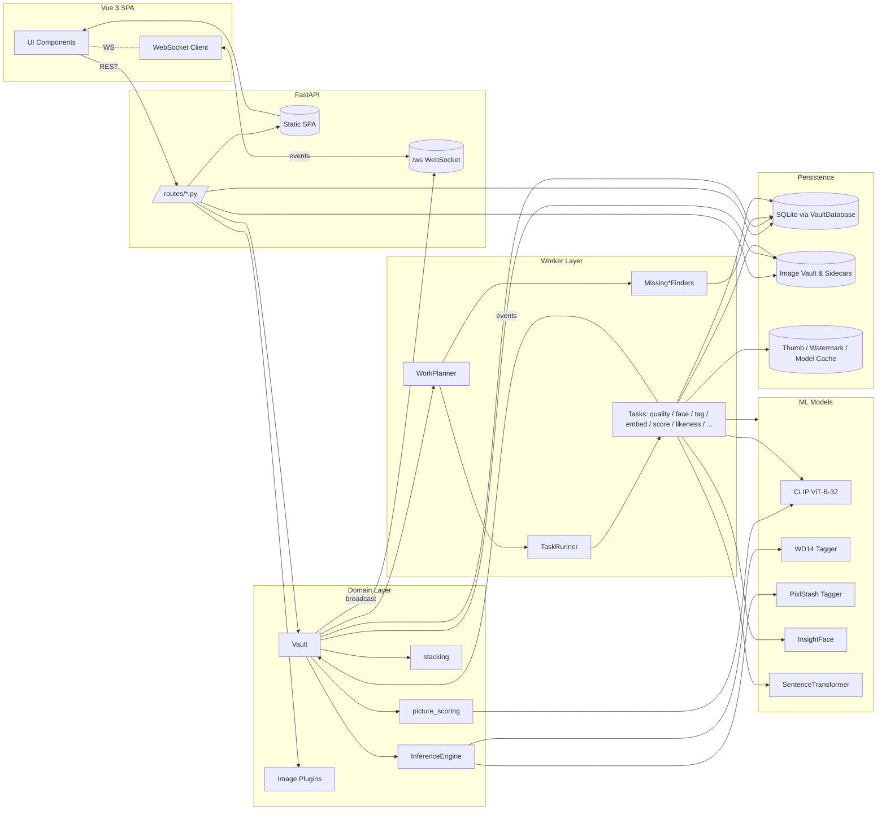
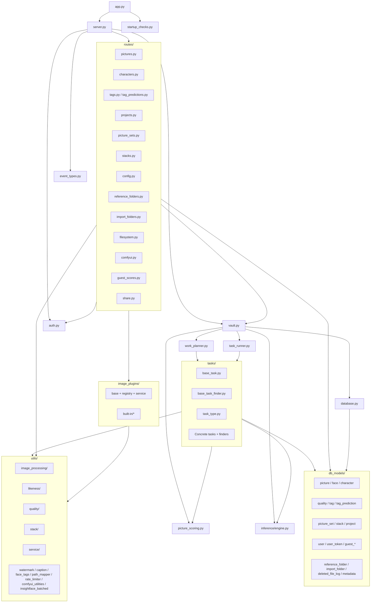
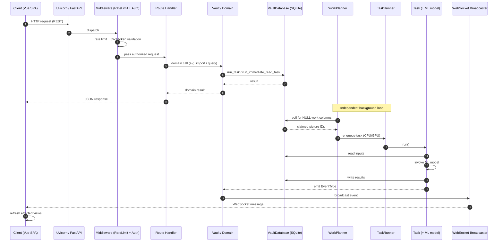

# PixlStash Backend Architecture

> Synthetic reference of the PixlStash backend. This document is the source of truth for Copilot and human contributors when reasoning about server-side code.
>
> Companion document: [docs/frontend_architecture.md](frontend_architecture.md)

---

## Table of Contents

1. [Project Tree](#1-project-tree)
2. [Architecture Overview](#2-architecture-overview)
3. [Frameworks, Runtime & Dependencies](#3-frameworks-runtime--dependencies)
4. [Top-Level Modules](#4-top-level-modules)
5. [Routes / HTTP API](#5-routes--http-api)
6. [Database Models](#6-database-models)
7. [Task System](#7-task-system)
8. [Image Plugins](#8-image-plugins)
9. [Tagger Plugins](#9-tagger-plugins)
10. [Utility Modules](#10-utility-modules)
11. [Alembic Migrations](#11-alembic-migrations)
12. [Storage Architecture](#12-storage-architecture)
13. [Server Lifecycle](#13-server-lifecycle)
14. [Frontend Integration](#14-frontend-integration)
15. [Authentication & Authorization](#15-authentication--authorization)
16. [Data Flow Pipeline](#16-data-flow-pipeline)
17. [Mermaid Diagrams](#17-mermaid-diagrams)
18. [Architectural Patterns](#18-architectural-patterns)

---

## 1. Project Tree

```
pixlstash/
├── __init__.py
├── app.py                            # CLI entry point
├── server.py                         # FastAPI app + lifespan
├── database.py                       # VaultDatabase (async-wrapped SQLite)
├── auth.py                           # AuthService, JWT, scoped tokens
├── task_runner.py                    # Threaded CPU/GPU task executor
├── work_planner.py                   # Polls finders, schedules work
├── vault.py                          # Top-level orchestrator
├── picture_scoring.py                # Smart score, character likeness
├── stacking.py                       # Picture stacking
├── worker_config.py                  # Concurrency / batch tuning
├── startup_checks.py                 # Disk / VRAM / SSL preflight
├── event_types.py                    # WebSocket EventType enum
├── pixl_logging.py                   # Uvicorn log config
├── image_loading_dataset_prepper.py  # Training dataset prep
├── alembic.ini
│
├── db_models/                        # SQLModel definitions
│   ├── picture.py                    # Picture, SortMechanism, LikenessParameter
│   ├── face.py                       # Face (bbox + 512-d embedding)
│   ├── character.py                  # Character
│   ├── quality.py                    # Quality (sharpness, contrast, …)
│   ├── tag.py                        # User-confirmed tags
│   ├── tag_prediction.py             # Model-predicted tags + confidence
│   ├── picture_likeness.py           # Pairwise image similarity
│   ├── picture_set.py                # Sets + membership
│   ├── picture_stack.py              # Stacks (duplicates / variants)
│   ├── picture_project.py            # Picture↔Project M-M
│   ├── project.py                    # Projects
│   ├── user.py                       # User + settings
│   ├── user_token.py                 # Scoped API tokens
│   ├── guest_session.py              # Public guest sessions
│   ├── guest_score.py                # Guest ratings
│   ├── reference_folder.py           # Anchor / reference folders
│   ├── import_folder.py              # Watched import folders
│   ├── deleted_file_log.py           # Deletion audit
│   └── metadata.py                   # Vault-level metadata
│
├── routes/                           # FastAPI routers
│   ├── pictures.py                   # CRUD, search, thumbnails, export/import
│   ├── characters.py                 # Character management + face assignment
│   ├── tags.py                       # Tags + bulk operations
│   ├── tag_predictions.py            # Confirm / reject predictions
│   ├── projects.py                   # Projects
│   ├── picture_sets.py               # Picture sets + membership
│   ├── stacks.py                     # Stacks
│   ├── config.py                     # User/server config + progress
│   ├── reference_folders.py          # Reference folders
│   ├── import_folders.py             # Watch folders
│   ├── filesystem.py                 # Directory browsing
│   ├── comfyui.py                    # ComfyUI workflow integration
│   ├── guest_scores.py               # Guest scoring
│   └── share.py                      # Public sharing endpoints
│
├── tasks/                            # Background tasks + finders
│   ├── base_task.py                  # BaseTask, TaskStatus, QueueType
│   ├── base_task_finder.py           # BaseTaskFinder + picture claim
│   ├── task_type.py                  # TaskType enum
│   ├── quality_task.py
│   ├── description_task.py
│   ├── text_embedding_task.py
│   ├── image_embedding_task.py
│   ├── face_extraction_task.py
│   ├── likeness_task.py
│   ├── likeness_parameters_task.py
│   ├── tag_task.py
│   ├── smart_score_task.py
│   ├── text_score_task.py
│   ├── comfyui_extraction_task.py
│   ├── watch_folder_import_task.py
│   ├── source_face_likeness_task.py
│   ├── missing_file_purge_task.py
│   ├── reference_folder_scan_task.py
│   └── missing_*_finder.py           # One finder per task type
│
├── image_plugins/                    # Image transformation plugins
│   ├── base.py                       # ImagePlugin ABC
│   ├── registry.py                   # Plugin discovery
│   ├── service.py                    # Batch application
│   └── built-in/
│       ├── brightness_contrast.py
│       ├── blur_sharpen.py
│       ├── colour_filter.py
│       ├── pixelate.py
│       ├── rotate.py
│       ├── scaling.py
│       └── plugin_template.py
│
├── tagger_plugins/                   # Tagger service classes (WD14, PixlStash, CLIP, SBert, Florence2)
│
├── utils/
│   ├── watermark.py
│   ├── caption_file_utils.py
│   ├── face_tags.py
│   ├── path_mapper.py
│   ├── host_path_utils.py
│   ├── reference_folder_watcher.py
│   ├── reference_folder_validator.py
│   ├── rate_limiter.py
│   ├── comfyui_utilities.py
│   ├── insightface_batched.py
│   ├── image_processing/             # image_utils, face_utils, video_utils
│   ├── likeness/                     # likeness_utils, likeness_parameter_utils
│   ├── quality/                      # quality_utils, smart_score_utils
│   ├── stack/                        # stack_utils
│   └── service/                      # path/export/serialization/caption/config utils
│
├── migrations/
│   ├── env.py
│   ├── script.py.mako
│   └── versions/                     # 0001_baseline … 0044_add_grid_sort_indexes
│
├── data/
│   ├── anchors/                      # builtin_good.npy, builtin_bad.npy
│   └── comfyui-workflows/built-in/
│
└── frontend/                         # Bundled Vue 3 dist (served at /)
```

---

## 2. Architecture Overview

PixlStash is a **single-process, async-first image vault** built on FastAPI. It combines:

- A **REST + WebSocket API** for the Vue 3 SPA
- A **threaded task runner** with separate CPU and GPU queues
- A **SQLite database** wrapped in an async work queue (`VaultDatabase`)
- A **ML pipeline** (CLIP, WD14, InsightFace, PixlStash tagger, SentenceTransformer)
- A **plugin system** for image transformations
- A **file vault** rooted at a configured `image_root` directory

The runtime is organised around three orthogonal layers:

| Layer | Component | Responsibility |
|-------|-----------|----------------|
| **API** | `server.py`, `routes/*` | HTTP / WebSocket handlers, request validation |
| **Domain** | `vault.py`, `inference/engine.py`, `picture_scoring.py`, `stacking.py` | Business logic, ML orchestration |
| **Workers** | `task_runner.py`, `work_planner.py`, `tasks/*` | Async background processing of new pictures |
| **Persistence** | `database.py`, `db_models/*`, `migrations/*` | Schema, queries, transactions |

Background processing is **data-driven**: each task type has a *finder* that queries the DB for rows with `NULL` work columns. The `WorkPlanner` polls finders, the `TaskRunner` executes tasks, and completion events trigger WebSocket broadcasts to update the UI.

---

## 3. Frameworks, Runtime & Dependencies

### Web & Server

| Component | Library | Notes |
|-----------|---------|-------|
| Web framework | **FastAPI** ≥ 0.135 | Async REST + WebSocket, auto OpenAPI |
| ASGI server | **Uvicorn** ≥ 0.41 | Lifespan hooks for startup/shutdown |
| Multipart | **python-multipart** | Image upload |
| Auth | **python-jose**, **passlib[bcrypt]**, **cryptography** | JWT + bcrypt |
| Rate limit | Custom middleware in `utils/rate_limiter.py` | IP-based throttling |

### Persistence

| Component | Library |
|-----------|---------|
| Database | **SQLite** (file-based) |
| ORM | **SQLModel** ≥ 0.0.37 (Pydantic + SQLAlchemy) |
| Migrations | **Alembic** ≥ 1.18 |

### ML Stack

| Capability | Library |
|------------|---------|
| Deep learning | **PyTorch** ≥ 2.10, **torchvision** ≥ 0.25 |
| Image-text embeddings | **open_clip_torch** ≥ 3.3 (CLIP ViT-B-32) |
| Model loading | **transformers** ≥ 5.3, **accelerate** ≥ 1.13 |
| Inference runtime | **onnxruntime** ≥ 1.24 |
| Face detection | **insightface** ≥ 0.7.3 |
| Text embeddings | **sentence_transformers** ≥ 5.2 |
| NLP | **spacy** ≥ 3.8 |
| Tensor utils | **einops** ≥ 0.8 |

### Image & Video

| Capability | Library |
|------------|---------|
| Image I/O | **Pillow** ≥ 12.1, **pillow-heif** |
| Computer vision | **opencv-python** ≥ 4.13 |
| EXIF | **piexif** |

### Math & System

| Capability | Library |
|------------|---------|
| Numerical | **NumPy** ≥ 2.4, **SciPy** ≥ 1.17 |
| Fuzzy matching | **rapidfuzz** ≥ 3.14 |
| File watching | **watchdog** ≥ 4.0 |
| HTTP client | **httpx** ≥ 0.28, **requests** |
| GPU monitor | **nvidia-ml-py** |
| Config dirs | **platformdirs** |
| Logging | **colorlog** |

**Python**: 3.10+

---

## 4. Top-Level Modules

| File | Responsibility |
|------|----------------|
| [pixlstash/app.py](../pixlstash/app.py) | CLI entry point (`pixlstash-server`). Parses arguments, runs startup checks, instantiates `Server`. |
| [pixlstash/server.py](../pixlstash/server.py) | Builds the FastAPI app, mounts routers, attaches WebSocket, registers lifespan (thumbnail pre-gen, cleanup, graceful shutdown). |
| [pixlstash/vault.py](../pixlstash/vault.py) | Top-level orchestrator. Owns `VaultDatabase`, `TaskRunner`, `InferenceEngine`. Bridges domain events to the WebSocket broadcaster. |
| [pixlstash/database.py](../pixlstash/database.py) | `VaultDatabase`: queues DB work on a single writer thread; serialises writes via mutex, allows parallel reads. Exposes `run_task` / `run_immediate_read_task`. |
| [pixlstash/auth.py](../pixlstash/auth.py) | `AuthService`: password + JWT + scoped tokens. Enforces resource-level permissions (picture / set / character / project). |
| [pixlstash/task_runner.py](../pixlstash/task_runner.py) | Threaded executor with separate CPU and GPU pools. Monitors VRAM, gates GPU-heavy tasks, drains queues at shutdown. |
| [pixlstash/work_planner.py](../pixlstash/work_planner.py) | Registers all `BaseTaskFinder`s, polls them in round-robin, enforces inflight limits and adaptive backoff. |
| [pixlstash/picture_scoring.py](../pixlstash/picture_scoring.py) | Smart-score computation, anchor embeddings, character likeness scoring. |
| [pixlstash/worker_config.py](../pixlstash/worker_config.py) | Global constants — `NUM_WORKERS`, per-task `*_MAX_INFLIGHT`, batch sizes. |
| [pixlstash/startup_checks.py](../pixlstash/startup_checks.py) | Preflight: disk space, VRAM, CUDA, SSL. May force CPU mode. |
| [pixlstash/event_types.py](../pixlstash/event_types.py) | `EventType` enum used by WebSocket event bus. |
| [pixlstash/pixl_logging.py](../pixlstash/pixl_logging.py) | Uvicorn log config + coloured formatter. |
| [pixlstash/stacking.py](../pixlstash/stacking.py) | Picture stacking (duplicates / variants). |
| [pixlstash/image_loading_dataset_prepper.py](../pixlstash/image_loading_dataset_prepper.py) | Dataset preparation utilities for offline training scripts. |

---

## 5. Routes / HTTP API

All routers are mounted under `/api/v1/` unless stated otherwise. Routers live in [pixlstash/routes/](../pixlstash/routes/).

### `pictures.py`
| Method | Path | Purpose |
|--------|------|---------|
| GET | `/pictures` | Filtered/paginated picture listing |
| GET | `/pictures/search` | Keyword + semantic search |
| GET | `/pictures/stats` | Aggregate stats |
| POST | `/pictures/import` | Upload images → create Pictures |
| GET | `/pictures/import/{task_id}/status` | Import progress |
| GET | `/pictures/export` | Start async ZIP export |
| GET | `/pictures/export/{task_id}/status` | Export progress |
| GET | `/pictures/export/{task_id}/download` | Download finished ZIP |
| GET | `/pictures/{id}/thumbnail` | Cached thumbnail |
| POST | `/pictures/thumbnails` | Batch thumbnails |
| GET | `/pictures/{id}/{ext}` | Serve original (optionally watermarked) |
| POST | `/pictures/{id}/plugin/{name}` | Run image plugin |
| PATCH | `/pictures/project` | Bulk assign to project |
| POST | `/pictures/scores` | Bulk apply user ratings |
| POST | `/pictures/{id}/face` | Create face record |
| DELETE | `/pictures/{id}/face/{index}` | Delete face |

### `characters.py`
List, create, update, delete characters; assign / unassign faces; fetch reference picture set; list pictures per character.

### `tags.py` / `tag_predictions.py`
Add/remove user tags; bulk clear; confirm or reject model-predicted tags (`TagPrediction` → `Tag`).

### `projects.py`, `picture_sets.py`, `stacks.py`
Standard CRUD; set/stack membership management; stack reordering.

### `config.py`
| Method | Path | Purpose |
|--------|------|---------|
| GET | `/config` | User settings |
| PATCH | `/config` | Update settings |
| POST | `/config/login` | Login (also `/login` at root) |
| GET | `/config/logout` | Logout |
| GET | `/config/progress` | Worker progress snapshot |
| GET | `/config/sort-mechanisms` | Available sort modes |

### `reference_folders.py`, `import_folders.py`, `filesystem.py`
CRUD for reference / import folders; filesystem browsing for picker dialogs.

### `comfyui.py`
List workflows; execute a workflow against a picture.

### `guest_scores.py`, `share.py`
Public guest scoring and shared-link endpoints.

### App-level routes (`server.py`)
| Method | Path | Purpose |
|--------|------|---------|
| GET | `/` | Vue SPA index |
| GET | `/version` | Server version |
| POST | `/login` | Login |
| GET | `/logout` | Logout |
| WS | `/ws` | Real-time event stream |
| GET | `/pictures/shared/{token}` | Public file serving |

---

## 6. Database Models

All models live in [pixlstash/db_models/](../pixlstash/db_models/).

### Core entities

```text
Picture
  id, file_path, pixel_sha, format, width, height,
  created_at, imported_at, score, smart_score, text_score,
  import_excluded, deleted, source_picture_id, stack_id,
  character_likeness, image_embedding (BLOB), text_embedding (BLOB),
  comfyui_models (JSON), comfyui_loras (JSON),
  watermark_seed, embed_watermark
  → faces, quality, tags, tag_predictions
  → likeness_a / likeness_b (PictureLikeness)
  → sets (M-M), projects (M-M), stack
```

```text
Face: id, picture_id, frame_index, face_index, character_id,
      bbox (JSON), features (512-d InsightFace BLOB)

Character: id, name, description, extra_metadata,
           reference_picture_set_id, project_id

Quality: id, picture_id, sharpness, edge_density, contrast,
         brightness, noise_level, colorfulness,
         luminance_entropy, dominant_hue

Tag: id, picture_id, tag
TagPrediction: id, picture_id, tag, confidence, model_version,
               status, predicted_at  (UNIQUE picture_id+tag)

PictureLikeness: picture_id_a, picture_id_b (a < b), likeness, metric
```

### Grouping & scoping

```text
PictureSet / PictureSetMember
PictureStack       (Picture.stack_id links members)
Project / PictureProjectMember
```

### Users & sharing

```text
User: id, username, password_hash, plus full settings block
      (sort, columns, theme, similarity_character, hidden_tags,
       smart_score_penalised_tags, wd14_tagger_enabled,
       custom_tagger_enabled, thresholds, watermark_image (BLOB), …)

UserToken: id, user_id, token_hash, scope (READ|WRITE),
           resource_type, resource_id, expires_at,
           include_attachments, include_description

GuestSession / GuestScore
```

### Filesystem-linked

```text
ReferenceFolder, ImportFolder, DeletedFileLog, Metadata
```

**Vector storage**: image and text embeddings are stored as `BLOB` columns on `Picture` (no external vector DB). Face features are stored on `Face`.

---

## 7. Task System

### Building blocks

- **`BaseTask`** (`tasks/base_task.py`) — abstract task. Declares `task_type`, `queue_type` (CPU/GPU), `priority`, `run()`.
- **`BaseTaskFinder`** (`tasks/base_task_finder.py`) — queries DB for missing work, claims picture IDs, builds task instances, releases claims in `on_task_complete()`.
- **`TaskType`** (`tasks/task_type.py`) — enum of all task types.
- **`TaskRunner`** — executes tasks from CPU and GPU queues. CPU queue is multi-threaded (`NUM_WORKERS` per `worker_config.py`); GPU queue is serialised to avoid CUDA contention.
- **`WorkPlanner`** — polls each finder, respects `*_MAX_INFLIGHT` limits, applies adaptive backoff when no work is found.

### Registered tasks

| Task | Queue | Finder | Purpose |
|------|-------|--------|---------|
| `FACE_EXTRACTION` | GPU | `MissingFaceExtractionFinder` | InsightFace detection + 512-d embedding |
| `QUALITY` | CPU | `MissingQualityFinder` | OpenCV quality metrics |
| `TAGGER` | GPU | `MissingTagFinder` | WD14 + PixlStash tagger |
| `DESCRIPTION` | GPU | `MissingDescriptionFinder` | Image caption generation |
| `TEXT_EMBEDDING` | GPU | `MissingTextEmbeddingFinder` | SentenceTransformer on captions |
| `IMAGE_EMBEDDING` | GPU | `MissingImageEmbeddingFinder` | CLIP image embedding |
| `LIKENESS` | GPU | `MissingLikenessFinder` | Pairwise CLIP similarity |
| `LIKENESS_PARAMETERS` | CPU | `MissingLikenessParametersFinder` | Per-character similarity params |
| `SMART_SCORE` | GPU | `MissingSmartScoreFinder` | Anchor-based heuristic score |
| `TEXT_SCORE` | CPU | `MissingTextScoreFinder` | MSER-based text-in-image score |
| `WATCH_FOLDERS` | CPU | `MissingWatchFolderImportFinder` | Ingest from watch folders |
| `COMFYUI_EXTRACTION` | CPU | `MissingComfyUIExtractionFinder` | Parse ComfyUI metadata |
| `SOURCE_FACE_LIKENESS` | GPU | `MissingSourceFaceLikenessCharacterFinder` | Face↔reference similarity |
| `MISSING_FILE_PURGE` | CPU | `MissingFilePurgeFinder` | Remove records for vanished files |
| `REFERENCE_FOLDER_SCAN` | CPU | `ReferenceFolderScanFinder` | Periodic reference-folder rescan |

**Re-processing**: setting a work column to `NULL` (e.g. via an Alembic migration) makes the corresponding finder pick the row up on the next pass — this is how data regenerations are triggered.

---

## 8. Image Plugins

Located in [pixlstash/image_plugins/](../pixlstash/image_plugins/).

- **`base.ImagePlugin`** — abstract base. Each plugin declares `name`, `display_name`, `parameter_schema()` and implements `run(images, parameters, progress_callback, error_callback)`.
- **`registry.PluginRegistry`** — discovers plugins (built-in + user-supplied), exposes lookup by name.
- **`service.apply_plugin_to_pictures`** — batch entry point invoked by `POST /pictures/{id}/plugin/{name}`; emits `PLUGIN_PROGRESS` events.

Built-in plugins: `brightness_contrast`, `blur_sharpen`, `colour_filter`, `pixelate`, `rotate`, `scaling`, plus `plugin_template.py` as a starter for custom plugins.

---

## 9. Tagger Plugins

Tagger service classes live in [pixlstash/tagger_plugins/](../pixlstash/tagger_plugins/). They are wired together by `InferenceEngine` ([pixlstash/inference/engine.py](../pixlstash/inference/engine.py)), which is the single dependency-injection root for all ML inference. Use `InferenceEngine.create(...)` as the factory entry point.

| Tagger | File | Model | Toggle | Threshold |
|--------|------|-------|--------|-----------|
| WD14 | `tagger_plugins/wd14.py` | `SmilingWolf/wd-convnext-tagger-v3` (HF) | `User.wd14_tagger_enabled` | `User.wd14_threshold` |
| PixlStash tagger | `tagger_plugins/pixlstash_tagger.py` | `PersonalJeebus/pixlvault-anomaly-tagger` (HF, pinned commit) | `User.custom_tagger_enabled` | `User.custom_tagger_threshold_offset` |

Both models support CUDA and CPU. Models are lazily loaded on first use and can be unloaded after idle to free VRAM unless `keep_models_in_memory` is set.

The `InferenceEngine` also exposes workflow accessor properties that wrap the tagger services:

| Property | Workflow class | Purpose |
|----------|---------------|---------|
| `tagging_workflow` | `inference/workflows/tagging.py` | WD14 + PixlStash tagger |
| `description_workflow` | `inference/workflows/description.py` | Florence-2 captions |
| `text_embedding_workflow` | `inference/workflows/text_embedding.py` | SentenceTransformer + CLIP text |
| `face_embedding_workflow` | `inference/workflows/face_embedding.py` | InsightFace 512-d embeddings |
| `clip_embedding_workflow` | `inference/workflows/clip_embedding.py` | CLIP image embeddings |

---

## 10. Utility Modules

| Module | Role |
|--------|------|
| [utils/watermark.py](../pixlstash/utils/watermark.py) | Seeded watermark rendering + cache |
| [utils/caption_file_utils.py](../pixlstash/utils/caption_file_utils.py) | Sidecar `.txt` caption I/O |
| [utils/face_tags.py](../pixlstash/utils/face_tags.py) | Face-derived tag helpers |
| [utils/path_mapper.py](../pixlstash/utils/path_mapper.py) | Host↔container path translation |
| [utils/host_path_utils.py](../pixlstash/utils/host_path_utils.py) | Host-aware path resolution |
| [utils/reference_folder_watcher.py](../pixlstash/utils/reference_folder_watcher.py) | watchdog-based folder monitoring |
| [utils/reference_folder_validator.py](../pixlstash/utils/reference_folder_validator.py) | Reference folder validation |
| [utils/rate_limiter.py](../pixlstash/utils/rate_limiter.py) | IP-based rate-limit middleware |
| [utils/comfyui_utilities.py](../pixlstash/utils/comfyui_utilities.py) | ComfyUI workflow parsing |
| [utils/insightface_batched.py](../pixlstash/utils/insightface_batched.py) | Batched InsightFace wrapper |
| utils/image_processing/ | `image_utils`, `face_utils`, `video_utils` |
| utils/likeness/ | `likeness_utils`, `likeness_parameter_utils` |
| utils/quality/ | `quality_utils`, `smart_score_utils` |
| utils/stack/ | `stack_utils` |
| utils/service/ | `path_utils`, `system_utils`, `export_utils`, `tag_prediction_utils`, `serialization_utils`, `caption_utils`, `config_utils` |

---

## 11. Alembic Migrations

- Baseline: `0001_baseline` calls `SQLModel.metadata.create_all()` for the full current schema.
- All subsequent migrations use conditional `add_column` (see [.github/copilot-instructions.md](../.github/copilot-instructions.md)) so they are safe on fresh DBs.
- `__all__` is declared at the top of each migration to silence static-analysis "unused" warnings.
- Data regenerations are triggered by `NULL`-resetting work columns — never by application logic in migrations.

Selected milestones:

| Rev | Change |
|-----|--------|
| 0001 | Baseline (SQLModel `create_all`) |
| 0002–0003 | `text_score`, original filename |
| 0004–0006 | ComfyUI fields, projects, attachment URL |
| 0009–0010 | Picture-project membership + uniqueness |
| 0013–0015 | `TagPrediction` + confidence |
| 0017–0019 | Anomaly uncertainty, pending character |
| 0020–0021 | `source_picture_id`, tagger enable flags |
| 0024–0026 | Deleted file log, reference folders, caption sync |
| 0028 | `smart_score` |
| 0030–0031 | Import folders supersede legacy watch folders |
| 0034 | Token scope columns |
| 0038–0040 | Watermark fields, move `text_score` to `Picture` |
| 0041–0044 | Guest scores, grid sort indexes |

---

## 12. Storage Architecture

### Image vault

```
{image_root}/
├── YYYY/MM/DD/
│   ├── {uuid}.{ext}           # Original
│   ├── {uuid}.json            # Sidecar metadata
│   └── .pixlstash/            # Per-picture caches
│       └── {uuid}.webp        # Thumbnail
├── comfyui-outputs/
└── reference-folders/         # If configured
```

- `pixel_sha` (SHA-256 of decoded pixels) is used for import deduplication.
- Watermarks are rendered on demand and cached in memory.

### Database

- File-based **SQLite** at `{platform_config_dir}/pixlstash/pixlstash.db`
  - Linux: `~/.config/pixlstash/`
  - macOS: `~/Library/Application Support/pixlstash/`
  - Windows: `%APPDATA%/pixlstash/`
- All writes are serialised through `VaultDatabase`'s task queue (single writer); reads run in parallel.

### Vector storage

- Embeddings (`image_embedding`, `text_embedding`, `Face.features`) are stored as `BLOB` columns.
- Similarity search is performed in-process via NumPy cosine similarity (no FAISS / external vector store).
- Smart scoring uses bundled CLIP anchors in [pixlstash/data/anchors/](../pixlstash/data/anchors/).

### Caches

| Cache | Location | Notes |
|-------|----------|-------|
| Thumbnails | Memory (LRU, ~128) + disk `.pixlstash/` | Pre-generated at startup |
| Watermarks | In-memory rendered images | Seed-keyed |
| Quality stats | In-memory (≈60 s TTL) | Used by aggregate endpoints |
| Models | `~/.cache/huggingface/` + VRAM | Lazy load, idle unload |

---

## 13. Server Lifecycle

1. `app.py:main()` parses CLI args and loads/creates the server config.
2. `StartupChecks().run()` validates disk space, VRAM, CUDA, SSL; may force CPU mode.
3. `Server.__init__()`:
   - Instantiates `Vault` (loads `image_root`, opens `VaultDatabase`, constructs `InferenceEngine` via `InferenceEngine.create(...)`).
   - Creates `TaskRunner` and registers all finders on the `WorkPlanner`.
   - Builds the FastAPI app, attaches middleware (CORS, rate limiter, auth), mounts routers and the SPA.
4. `uvicorn.run(api, …)` enters the **lifespan**:
   - Optional `_cleanup_missing_pictures()`.
   - Optional `_generate_missing_thumbnails()`.
   - `TaskRunner.start()` spawns CPU/GPU worker threads.
   - `WorkPlanner` begins polling finders.
5. On shutdown:
   - `Vault.close()` stops the planner and drains workers.
   - `VaultDatabase` flushes pending writes and closes connections.
   - WebSocket clients are disconnected.

---

## 14. Frontend Integration

- The built Vue SPA in [pixlstash/frontend/](../pixlstash/frontend/) is mounted at `/` via `StaticFiles`, with `index.html` as the SPA fallback for client-side routing.
- The frontend talks to the backend via REST (`/api/v1/*`) and a single WebSocket at `/ws`.
- WebSocket events come from [event_types.py](../pixlstash/event_types.py):
  - `CHANGED_PICTURES`, `PICTURE_IMPORTED`
  - `CHANGED_TAGS`, `CLEARED_TAGS`
  - `CHANGED_CHARACTERS`, `CHANGED_FACES`
  - `CHANGED_DESCRIPTIONS`
  - `QUALITY_UPDATED`
  - `PLUGIN_PROGRESS`
- Events are published from `Vault` whenever a task or domain operation completes; the broadcaster in `server.py` fans them out to all connected clients.

---

## 15. Authentication & Authorization

`AuthService` (in [auth.py](../pixlstash/auth.py)) provides:

- **Password login** (bcrypt-hashed) → JWT.
- **API tokens** (`UserToken`) with:
  - `scope`: `READ` or `WRITE`
  - Optional `resource_type` + `resource_id` restricting to one of: picture set, character, project
  - Optional flags: `include_attachments`, `include_description`
- **JWT** carried as `Authorization: Bearer <token>`.

Public paths (no auth):

```
/login, /logout, /check-session, /version,
/docs, /redoc, /openapi.json,
/assets/*, /favicon.ico, /Logo.png,
/pictures/shared/{token}, /share/*
```

---

## 16. Data Flow Pipeline

1. **Import** — `POST /pictures/import` writes files to `{image_root}/YYYY/MM/DD/{uuid}.ext`, creates `Picture` rows, emits `PICTURE_IMPORTED`.
2. **Discovery** — `WorkPlanner` polls finders; each finder queries for NULL work columns and claims picture IDs.
3. **Face extraction** *(GPU)* — InsightFace populates `Face` rows.
4. **Quality** *(CPU)* — OpenCV metrics → `Quality` row; emits `QUALITY_UPDATED`.
5. **Description** *(GPU)* — Caption text written to sidecar `.txt`; emits `CHANGED_DESCRIPTIONS`.
6. **Embeddings** *(GPU)* — CLIP image embedding + SentenceTransformer caption embedding stored as BLOBs on `Picture`.
7. **Tagging** *(GPU)* — WD14 + PixlStash tagger write `TagPrediction` rows; emits `CHANGED_TAGS`.
8. **Smart score** *(GPU)* — Combines image embedding, anchors, and penalised tags into `Picture.smart_score`.
9. **Likeness** — Pairwise CLIP similarity (`PictureLikeness`) + per-character likeness parameters.
10. **Character assignment** — User assigns faces to characters; `SOURCE_FACE_LIKENESS` populates face↔reference similarity.
11. **Serving** — API endpoints return filtered/sorted pictures, thumbnails (cached), and watermarked originals as needed. WebSocket events keep the SPA in sync.

Failure handling: if a task raises, its work column stays `NULL` so the corresponding finder will retry on the next pass. Most tasks are idempotent.

---

## 17. Mermaid Diagrams

### 17.1 Full backend data-flow



### 17.2 Module relationship



### 17.3 Request lifecycle



---

## 18. Architectural Patterns

1. **Task + Finder pattern** — every async work item has a paired finder that queries the DB for missing data and claims rows; results are written back and claims released.
2. **DB write serialisation** — `VaultDatabase` funnels all writes through a single task queue; reads run in parallel for throughput.
3. **CPU / GPU queue separation** — `TaskRunner` keeps GPU work single-threaded to avoid CUDA contention while keeping CPU work parallel.
4. **VRAM gating** — GPU-heavy tasks are blocked when free VRAM is below a threshold (`User.max_vram_gb`).
5. **Lazy ML loading** — models are loaded on first use and may be unloaded after idle, controlled by `keep_models_in_memory`.
6. **Event bus** — `EventType`-tagged broadcasts let the frontend stay reactive without polling.
7. **Embeddings in-database** — all vectors live in SQLite as `BLOB`s; similarity search is in-process NumPy.
8. **Plugin extensibility** — image plugins are discovered through `PluginRegistry`; new transformations drop into `image_plugins/built-in/` (or a user directory) and become available automatically.
9. **Conditional migrations** — Alembic migrations are safe on fresh DBs (column existence checks) and trigger data regeneration solely via `NULL` resets.
10. **Path mapping** — host vs. container paths are normalised through `path_mapper` / `host_path_utils`, allowing Docker deployments without changing the DB.

---

*Last updated: 2026-05-20. Update this document whenever architectural patterns, module boundaries, or integration contracts change.*
