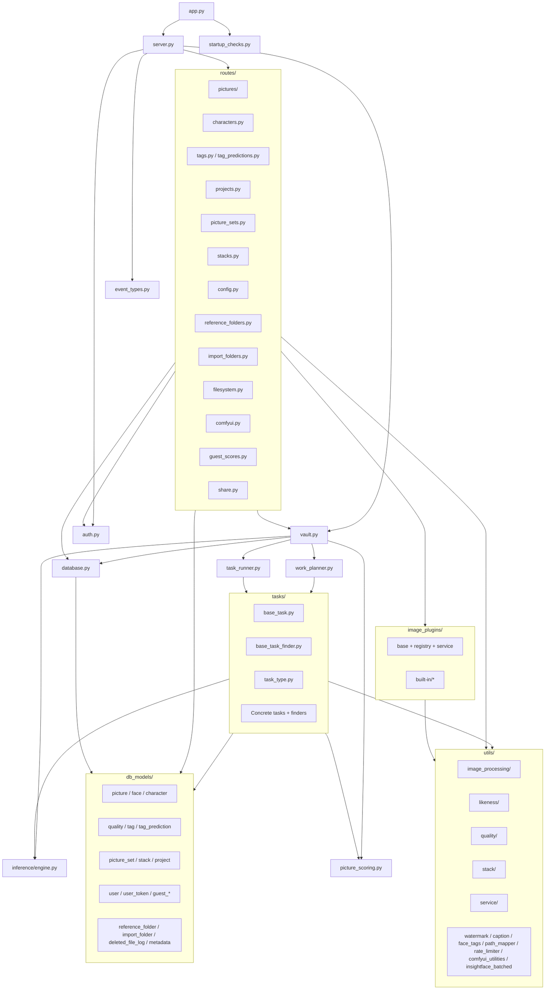
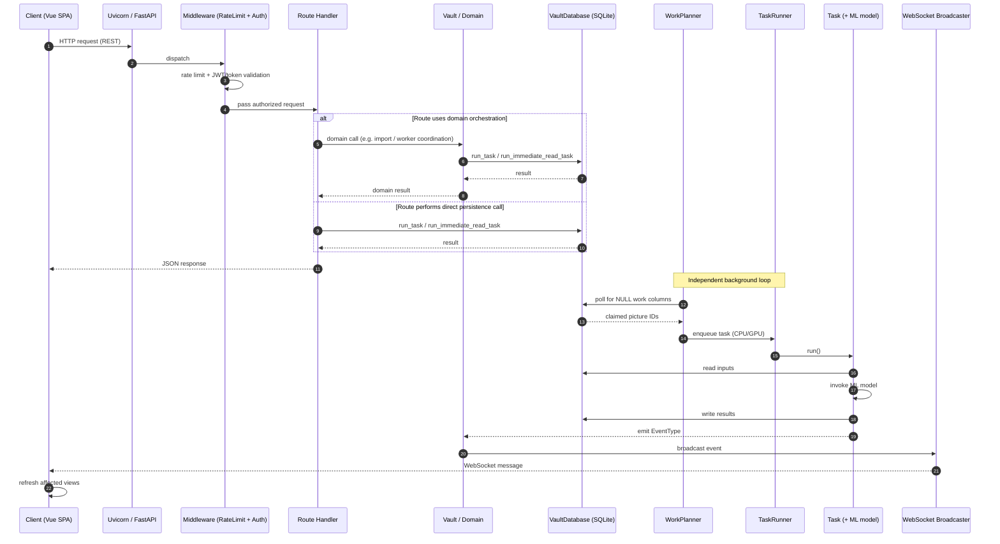

# PixlStash Backend Architecture

> Synthetic reference of the PixlStash backend. This document is the source of truth for both Copilot and human contributors when reasoning about server-side code.
>
> Companion documents: 

* Frontend: [docs/frontend_architecture.md](frontend_architecture.md)
* Integration: [docs/integration_architecture.md](integration_architecture.md)

---

## Table of Contents

1. [Project Tree](#1-project-tree)
2. [Architecture Overview](#2-architecture-overview)
3. [Frameworks, Runtime & Dependencies](#3-frameworks-runtime--dependencies)
4. [Top-Level Modules](#4-top-level-modules)
5. [Routes / HTTP API](#5-routes--http-api)
6. [Database Models](#6-database-models)
7. [Task System](#7-task-system)
8. [Image Plugins](#8-image-plugins)
9. [Tagger Plugins](#9-tagger-plugins)
10. [Services Layer](#10-services-layer)
11. [Utility Modules](#11-utility-modules)
12. [Alembic Migrations](#12-alembic-migrations)
13. [Storage Architecture](#13-storage-architecture)
14. [Server Lifecycle](#14-server-lifecycle)
15. [Frontend Integration](#15-frontend-integration)
16. [Authentication & Authorization](#16-authentication--authorization)
17. [Data Flow Pipeline](#17-data-flow-pipeline)
18. [Snapshots & Restore](#18-snapshots--restore)
19. [Mermaid Diagrams](#19-mermaid-diagrams)
20. [Architectural Patterns](#20-architectural-patterns)

---

## 1. Project Tree

```
pixlstash/
├── __init__.py
├── app.py                            # CLI entry point
├── server.py                         # FastAPI app + lifespan
├── database.py                       # VaultDatabase (threaded queue over SQLite)
├── auth.py                           # AuthService, JWT, scoped tokens
├── task_runner.py                    # Threaded CPU/GPU task executor
├── work_planner.py                   # Polls finders, schedules work
├── vault.py                          # Top-level orchestrator
├── picture_scoring.py                # Smart score, character likeness
├── stacking.py                       # Picture stacking
├── worker_config.py                  # Concurrency / batch tuning
├── startup_checks.py                 # Disk / VRAM / SSL preflight
├── event_types.py                    # WebSocket EventType enum
├── pixl_logging.py                   # Uvicorn log config
├── image_loading_dataset_prepper.py  # Training dataset prep
├── alembic.ini
│
├── db_models/                        # SQLModel definitions
│   ├── picture.py                    # Picture, SortMechanism, LikenessParameter
│   ├── face.py                       # Face (bbox + 512-d embedding)
│   ├── character.py                  # Character
│   ├── quality.py                    # Quality (sharpness, contrast, …)
│   ├── tag.py                        # User-confirmed tags
│   ├── tag_prediction.py             # Model-predicted tags + confidence
│   ├── picture_likeness.py           # Pairwise image similarity
│   ├── picture_set.py                # Sets + membership
│   ├── picture_stack.py              # Stacks (duplicates / variants)
│   ├── picture_project.py            # Picture↔Project M-M
│   ├── project.py                    # Projects
│   ├── user.py                       # User + settings
│   ├── user_token.py                 # Scoped API tokens
│   ├── guest_session.py              # Public guest sessions
│   ├── guest_score.py                # Guest ratings
│   ├── reference_folder.py           # Anchor / reference folders
│   ├── import_folder.py              # Watched import folders
│   ├── deleted_file_log.py           # Deletion audit
│   └── metadata.py                   # Vault-level metadata
│
├── routes/                           # FastAPI routers
│   ├── pictures/                     # CRUD, search, thumbnails, export/import
│   ├── characters.py                 # Character management + face assignment
│   ├── tags.py                       # Tags + bulk operations
│   ├── tag_predictions.py            # Confirm / reject predictions
│   ├── projects.py                   # Projects
│   ├── picture_sets.py               # Picture sets + membership
│   ├── stacks.py                     # Stacks
│   ├── config.py                     # User/server config + progress
│   ├── reference_folders.py          # Reference folders
│   ├── import_folders.py             # Watch folders
│   ├── filesystem.py                 # Directory browsing
│   ├── comfyui.py                    # ComfyUI workflow integration
│   ├── guest_scores.py               # Guest scoring
│   └── share.py                      # Public sharing endpoints
│
├── tasks/                            # Background tasks + finders
│   ├── base_task.py                  # BaseTask, TaskStatus, QueueType
│   ├── base_task_finder.py           # BaseTaskFinder + picture claim
│   ├── task_type.py                  # TaskType enum
│   ├── quality_task.py
│   ├── description_task.py
│   ├── text_embedding_task.py
│   ├── image_embedding_task.py
│   ├── face_extraction_task.py
│   ├── likeness_task.py
│   ├── likeness_parameters_task.py
│   ├── tag_task.py
│   ├── smart_score_task.py
│   ├── text_score_task.py
│   ├── comfyui_extraction_task.py
│   ├── watch_folder_import_task.py
│   ├── source_face_likeness_task.py
│   ├── missing_file_purge_task.py
│   ├── reference_folder_scan_task.py
│   └── missing_*_finder.py           # One finder per task type
│
├── image_plugins/                    # Image transformation plugins
│   ├── base.py                       # ImagePlugin ABC
│   ├── registry.py                   # Plugin discovery
│   ├── service.py                    # Batch application
│   └── built-in/
│       ├── brightness_contrast.py
│       ├── blur_sharpen.py
│       ├── colour_filter.py
│       ├── pixelate.py
│       ├── rotate.py
│       ├── scaling.py
│       └── plugin_template.py
│
├── tagger_plugins/                   # TaggerPlugin subclasses + registry (WD14, PixlStash tagger, Florence-2, JoyCaption)
│
├── services/                         # Business-logic extracted from route handlers
│   ├── config_service.py             # Hardware monitoring + import folder utilities
│   ├── plugin_service.py             # Image plugin orchestration + progress tracking
│   ├── share_service.py              # Share-token validation + watermark resolution
│   └── tag_prediction_service.py     # Confirm / reject / reset tag predictions
│
├── utils/
│   ├── watermark.py
│   ├── caption_file_utils.py
│   ├── face_tags.py
│   ├── path_mapper.py
│   ├── host_path_utils.py
│   ├── reference_folder_watcher.py
│   ├── reference_folder_validator.py
│   ├── rate_limiter.py
│   ├── comfyui_utilities.py
│   ├── insightface_batched.py
│   ├── image_processing/             # image_utils, face_utils, video_utils
│   ├── likeness/                     # likeness_utils, likeness_parameter_utils
│   ├── quality/                      # quality_utils, smart_score_utils
│   ├── stack/                        # stack_utils
│   └── service/                      # path/export/serialization/caption/config utils
│
├── migrations/
│   ├── env.py
│   ├── script.py.mako
│   └── versions/                     # Migration files for Alembic
│
├── data/
│   ├── anchors/                      # builtin_good.npy, builtin_bad.npy
│   └── comfyui-workflows/built-in/
│
└── frontend/                         # Bundled Vue 3 dist (served at /)
```

---

## 2. Architecture Overview

PixlStash is a **single-process image vault** built on FastAPI. Despite running on an ASGI server, most route handlers are synchronous and offload to background threads; "async" here means cooperative I/O for FastAPI/WebSockets, not an async stack end-to-end. It combines:

- A **REST + WebSocket API** for the Vue 3 frontend
- A **threaded task runner** with separate CPU and GPU queues
- A **SQLite database** wrapped in a threaded work queue (`VaultDatabase`) — a single dedicated writer thread serialises mutations while reads can bypass the queue via `run_immediate_read_task` meant for interactive tasks that needs a quick response
- A **ML pipeline** (CLIP, WD14, InsightFace, PixlStash tagger, SentenceTransformer)
- A **plugin system** for image transformations
- A **file vault** rooted at a configured `image_root` directory

The runtime is organised around five layers:

| Layer | Component | Responsibility |
|-------|-----------|----------------|
| **API** | `server.py`, `routes/*` | HTTP / WebSocket handlers, request validation |
| **Services** | `services/*` | Focused business-logic modules extracted from route handlers when they grew too large; not a formal service tier — `vault.py`, `picture_scoring.py`, and `stacking.py` are the real domain layer |
| **Domain** | `vault.py`, `inference/engine.py`, `picture_scoring.py`, `stacking.py` | Core orchestration: vault lifecycle, ML engine, scoring, stacking |
| **Workers** | `task_runner.py`, `work_planner.py`, `tasks/*` | Async background processing of new pictures |
| **Persistence** | `database.py`, `db_models/*`, `migrations/*` | Schema, queries, transactions |

Background processing is **data-driven**: each task type has a *finder* that queries the DB for rows with `NULL` work columns. The `WorkPlanner` polls finders, the `TaskRunner` executes tasks, and completion events trigger WebSocket broadcasts to update the UI.

---

## 3. Frameworks, Runtime & Dependencies

### Web & Server

| Component | Library | Notes |
|-----------|---------|-------|
| Web framework | **FastAPI** ≥ 0.135 | Async REST + WebSocket, auto OpenAPI |
| ASGI server | **Uvicorn** ≥ 0.41 | Lifespan hooks for startup/shutdown |
| Multipart | **python-multipart** | Image upload |
| Auth | **python-jose**, **passlib[bcrypt]**, **cryptography** | JWT + bcrypt |
| Rate limit | Custom middleware in `utils/rate_limiter.py` | IP-based throttling |

### Persistence

| Component | Library |
|-----------|---------|
| Database | **SQLite** (file-based) |
| ORM | **SQLModel** ≥ 0.0.37 (Pydantic + SQLAlchemy) |
| Migrations | **Alembic** ≥ 1.18 |

### ML Stack

| Capability | Library |
|------------|---------|
| Deep learning | **PyTorch** ≥ 2.10, **torchvision** ≥ 0.25 |
| Image-text embeddings | **open_clip_torch** ≥ 3.3 (CLIP ViT-B-32) |
| Model loading | **transformers** ≥ 5.3, **accelerate** ≥ 1.13 |
| Inference runtime | **onnxruntime** ≥ 1.24 |
| Face detection | **insightface** ≥ 0.7.3 |
| Text embeddings | **sentence_transformers** ≥ 5.2 |
| NLP | **spacy** ≥ 3.8 |
| Tensor utils | **einops** ≥ 0.8 |

### Image & Video

| Capability | Library |
|------------|---------|
| Image I/O | **Pillow** ≥ 12.1, **pillow-heif** |
| Computer vision | **opencv-python** ≥ 4.13 |
| EXIF | **piexif** |

### Math & System

| Capability | Library |
|------------|---------|
| Numerical | **NumPy** ≥ 2.4, **SciPy** ≥ 1.17 |
| Fuzzy matching | **rapidfuzz** ≥ 3.14 |
| File watching | **watchdog** ≥ 4.0 |
| HTTP client | **httpx** ≥ 0.28, **requests** |
| GPU monitor | **nvidia-ml-py** |
| Config dirs | **platformdirs** |
| Logging | **colorlog** |

**Python**: 3.10+

---

## 4. Top-Level Modules

| File | Responsibility |
|------|----------------|
| [pixlstash/app.py](../pixlstash/app.py) | CLI entry point (`pixlstash-server`). Parses arguments, runs startup checks, instantiates `Server`. |
| [pixlstash/server.py](../pixlstash/server.py) | Builds the FastAPI app, mounts routers, attaches WebSocket, registers lifespan (thumbnail pre-gen, cleanup, graceful shutdown). |
| [pixlstash/vault.py](../pixlstash/vault.py) | Top-level orchestrator. Owns `VaultDatabase`, `TaskRunner`, and `WorkPlanner`; lazily creates `InferenceEngine` on demand. Bridges domain events to the WebSocket broadcaster. |
| [pixlstash/database.py](../pixlstash/database.py) | `VaultDatabase`: queues DB work on a single writer thread; serialises writes via mutex, allows parallel reads. Exposes `run_task` / `run_immediate_read_task`. |
| [pixlstash/auth.py](../pixlstash/auth.py) | `AuthService`: password + JWT + scoped tokens. Enforces resource-level permissions (picture / set / character / project). |
| [pixlstash/task_runner.py](../pixlstash/task_runner.py) | Threaded executor with separate CPU and GPU pools. Monitors VRAM, gates GPU-heavy tasks, drains queues at shutdown. |
| [pixlstash/work_planner.py](../pixlstash/work_planner.py) | Registers all `BaseTaskFinder`s, polls them in round-robin, enforces inflight limits and adaptive backoff. |
| [pixlstash/picture_scoring.py](../pixlstash/picture_scoring.py) | Smart-score computation (anchor-based heuristic combining image embedding, CLIP anchors, a CLIP-IQA objective quality probe, and a calibrated anomaly penalty — confidence × precision, noisy-OR within tag families — see [`utils/quality/anomaly_penalty.py`](../pixlstash/utils/quality/anomaly_penalty.py) and [`docs/reviews/2026-06-smart-score-calibrated-anomaly-plan.md`](reviews/2026-06-smart-score-calibrated-anomaly-plan.md)) and character likeness scoring (face↔reference similarity via InsightFace embeddings). These are distinct features sharing one module; candidates for future separation. |
| [pixlstash/worker_config.py](../pixlstash/worker_config.py) | Global constants — `NUM_WORKERS`, per-task `*_MAX_INFLIGHT`, batch sizes. |
| [pixlstash/startup_checks.py](../pixlstash/startup_checks.py) | Preflight: disk space, VRAM, CUDA, SSL. May force CPU mode. |
| [pixlstash/event_types.py](../pixlstash/event_types.py) | `EventType` enum used by WebSocket event bus. |
| [pixlstash/pixl_logging.py](../pixlstash/pixl_logging.py) | Uvicorn log config + coloured formatter. |
| [pixlstash/stacking.py](../pixlstash/stacking.py) | Picture stacking (duplicates / variants). |
| [pixlstash/image_loading_dataset_prepper.py](../pixlstash/image_loading_dataset_prepper.py) | Dataset preparation utilities for offline training scripts. |

---

## 5. Routes / HTTP API

All routers are mounted under `/api/v1/` unless stated otherwise. Routers live in [pixlstash/routes/](../pixlstash/routes/).

### `pictures/` package

Key endpoints (see the auto-generated index below for the full set):

| Method | Path | Purpose |
|--------|------|---------|
| GET | `/pictures` | Filtered/paginated picture listing |
| GET | `/pictures/search` | Keyword + semantic search |
| GET | `/pictures/stats` | Aggregate stats |
| POST | `/pictures/import` | Upload images → create Pictures |
| GET | `/pictures/import/{task_id}/status` | Import progress |
| GET | `/pictures/export` | Start async ZIP export |
| GET | `/pictures/export/{task_id}/status` | Export progress |
| GET | `/pictures/export/{task_id}/download` | Download finished ZIP |
| GET | `/pictures/{id}/thumbnail` | Cached thumbnail |
| POST | `/pictures/thumbnails` | Batch thumbnails |
| GET | `/pictures/{id}/{ext}` | Serve original (optionally watermarked) |
| POST | `/pictures/{id}/plugin/{name}` | Run image plugin |
| PATCH | `/pictures/project` | Bulk assign to project |
| POST | `/pictures/scores` | Bulk apply user ratings |
| POST | `/pictures/{id}/face` | Create face record |
| DELETE | `/pictures/{id}/face/{index}` | Delete face |
| POST | `/pictures/likeness-search` | Reverse-image likeness search |

### `characters.py`
List, create, update, delete characters; assign / unassign faces; fetch reference picture set; list pictures per character.

**Project-membership reconciliation:** when a character's (or picture set's) `project_id` changes, the handler reconciles its pictures' `PictureProjectMember` rows: each picture is added to the new project and removed from the old one. Removal is *reference-aware* — a picture stays in the old project if another character or picture set still assigned to that project anchors it there (see `picture_referenced_by_project` in [`routes/_helpers.py`](../pixlstash/routes/_helpers.py)). When the entity leaves all projects, each picture's scalar `Picture.project_id` pointer falls back to any remaining membership. The same logic lives in `picture_sets.py::update_picture_set`.

### `tags.py` / `tag_predictions.py`
Add/remove user tags; bulk clear; confirm or reject model-predicted tags (`TagPrediction` → `Tag`).

### `projects.py`, `picture_sets.py`, `stacks.py`
Standard CRUD; set/stack membership management; stack reordering.

### `config.py`
| Method | Path | Purpose |
|--------|------|---------|
| GET | `/config` | User settings |
| PATCH | `/config` | Update settings |
| POST | `/config/login` | Login (also `/login` at root) |
| GET | `/config/logout` | Logout |
| GET | `/config/progress` | Worker progress snapshot |
| GET | `/config/sort-mechanisms` | Available sort modes |

### `reference_folders.py`, `import_folders.py`, `filesystem.py`
CRUD for reference / import folders; filesystem browsing for picker dialogs.

### `comfyui.py`
List workflows; execute a workflow against a picture.

### `guest_scores.py`, `share.py`
Public guest scoring and shared-link endpoints.

### App-level routes (`server.py`)
| Method | Path | Purpose |
|--------|------|---------|
| GET | `/` | Vue SPA index |
| GET | `/version` | Server version |
| GET | `/favicon.ico` | SPA favicon |
| POST | `/api/v1/login` | Login |
| GET | `/api/v1/login` | Registration status check |
| POST | `/api/v1/logout` | Logout |
| GET | `/api/v1/check-session` | Session / scope discovery |
| GET | `/api/v1/network/info` | LAN address info |
| GET | `/api/v1/protected` | Auth probe |
| WS  | `/api/v1/ws/updates` | Real-time event stream (broadcast) |
| WS  | `/api/v1/ws/comfyui` | ComfyUI progress passthrough (in `routes/comfyui.py`) |
| GET | `/share/{token_slug}` | Public token-embedded picture serving |
| GET | `/{full_path:path}` | SPA fallback (serves `index.html`) |

### Complete route index

> Auto-generated from `server.api.openapi()`. Regenerate with `python scripts/render_backend_architecture.py`.

<!-- AUTOGEN:start name="routes" -->
| Method | Path                                                                          | Tags            | Summary                                               |
| ------ | ----------------------------------------------------------------------------- | --------------- | ----------------------------------------------------- |
| GET    | /api/v1/characters                                                            | characters      | List characters                                       |
| POST   | /api/v1/characters                                                            | characters      | Create character                                      |
| POST   | /api/v1/characters/likeness-search                                            | characters      | Search characters by face likeness                    |
| POST   | /api/v1/characters/membership                                                 | characters      | Batch character membership lookup                     |
| POST   | /api/v1/characters/{character_id}/faces                                       | characters      | Assign faces to character                             |
| DELETE | /api/v1/characters/{character_id}/faces                                       | characters      | Unassign faces from character                         |
| PATCH  | /api/v1/characters/{id}                                                       | characters      | Update character                                      |
| DELETE | /api/v1/characters/{id}                                                       | characters      | Delete character                                      |
| GET    | /api/v1/characters/{id}                                                       | characters      | Get character by id                                   |
| GET    | /api/v1/characters/{id}/reference_pictures                                    | characters      | List reference pictures                               |
| GET    | /api/v1/characters/{id}/summary                                               | characters      | Get character category summary                        |
| GET    | /api/v1/characters/{id}/{field}                                               | characters      | Get character field                                   |
| GET    | /api/v1/check-session                                                         | auth            | Check Session                                         |
| GET    | /api/v1/login                                                                 | auth            | Check Registration                                    |
| POST   | /api/v1/login                                                                 | auth            | Login                                                 |
| POST   | /api/v1/logout                                                                | auth            | Logout                                                |
| GET    | /api/v1/picture_sets                                                          | picture_sets    | List picture sets                                     |
| POST   | /api/v1/picture_sets                                                          | picture_sets    | Create picture set                                    |
| POST   | /api/v1/picture_sets/membership                                               | picture_sets    | Batch set membership lookup                           |
| GET    | /api/v1/picture_sets/{id}                                                     | picture_sets    | Get picture set                                       |
| PATCH  | /api/v1/picture_sets/{id}                                                     | picture_sets    | Update picture set                                    |
| DELETE | /api/v1/picture_sets/{id}                                                     | picture_sets    | Delete picture set                                    |
| GET    | /api/v1/picture_sets/{id}/members                                             | picture_sets    | List picture set members                              |
| POST   | /api/v1/picture_sets/{id}/members                                             | picture_sets    | Bulk add pictures to set                              |
| PUT    | /api/v1/picture_sets/{id}/members                                             | picture_sets    | Bulk replace picture set members                      |
| POST   | /api/v1/picture_sets/{id}/members/{picture_id}                                | picture_sets    | Add picture to set                                    |
| DELETE | /api/v1/picture_sets/{id}/members/{picture_id}                                | picture_sets    | Remove picture from set                               |
| GET    | /api/v1/picture_sets/{id}/thumbnail                                           | picture_sets    | Get picture set thumbnail                             |
| GET    | /api/v1/pictures                                                              | pictures        | List pictures                                         |
| POST   | /api/v1/pictures/apply-scores                                                 | pictures        | Batch apply manual scores                             |
| POST   | /api/v1/pictures/character_likeness/batch                                     | pictures        | Batch picture character likeness                      |
| GET    | /api/v1/pictures/count                                                        | pictures        | Total picture count for a listing filter              |
| GET    | /api/v1/pictures/export                                                       | pictures        | Start picture export job                              |
| GET    | /api/v1/pictures/export/download/{task_id}                                    | pictures        | Download completed export                             |
| GET    | /api/v1/pictures/export/status                                                | pictures        | Get export job status                                 |
| POST   | /api/v1/pictures/face-search                                                  | pictures        | Search by face likeness                               |
| POST   | /api/v1/pictures/import                                                       | pictures        | Import media files                                    |
| GET    | /api/v1/pictures/import/status                                                | pictures        | Get import job status                                 |
| POST   | /api/v1/pictures/impossible-tags/clear                                        | tags            | Bulk-clear impossible tags                            |
| POST   | /api/v1/pictures/impossible-tags/restore                                      | tags            | Undo a bulk impossible-tags clear                     |
| POST   | /api/v1/pictures/likeness-search                                              | pictures        | Search by image likeness                              |
| PATCH  | /api/v1/pictures/project                                                      | pictures        | Set project for pictures                              |
| POST   | /api/v1/pictures/score_character_likeness                                     | pictures        | Score uploaded images by character likeness           |
| DELETE | /api/v1/pictures/scrapheap                                                    | pictures        | Permanently delete scrapheap pictures                 |
| POST   | /api/v1/pictures/scrapheap/restore                                            | pictures        | Restore deleted pictures                              |
| GET    | /api/v1/pictures/search                                                       | pictures        | Search pictures by text                               |
| GET    | /api/v1/pictures/stream                                                       | pictures        | Stream pictures in batches                            |
| POST   | /api/v1/pictures/tags/bulk_fetch                                              | tags            | Fetch tags for multiple pictures                      |
| POST   | /api/v1/pictures/thumbnails                                                   | pictures        | Get batch thumbnail metadata                          |
| GET    | /api/v1/pictures/thumbnails/{id}.webp                                         | pictures        | Get picture thumbnail image                           |
| PATCH  | /api/v1/pictures/{id}                                                         | pictures        | Patch picture fields                                  |
| DELETE | /api/v1/pictures/{id}                                                         | pictures        | Move picture to scrapheap                             |
| GET    | /api/v1/pictures/{id}.{ext}                                                   | pictures        | Get original picture file                             |
| GET    | /api/v1/pictures/{id}/metadata                                                | pictures        | Get picture metadata                                  |
| POST   | /api/v1/pictures/{id}/tags                                                    | tags            | Add tag to picture                                    |
| GET    | /api/v1/pictures/{id}/tags                                                    | tags            | List picture tags                                     |
| DELETE | /api/v1/pictures/{id}/tags                                                    | tags            | Clear all tags on picture                             |
| POST   | /api/v1/pictures/{id}/tags/remove_all                                         | tags            | Remove tag everywhere on picture                      |
| DELETE | /api/v1/pictures/{id}/tags/{tag_id}                                           | tags            | Remove picture tag                                    |
| GET    | /api/v1/pictures/{picture_id}/stack                                           | stacks          | Get picture's stack                                   |
| GET    | /api/v1/projects                                                              | projects        | List all projects                                     |
| POST   | /api/v1/projects                                                              | projects        | Create a project                                      |
| POST   | /api/v1/projects/membership                                                   | projects        | Batch project membership lookup                       |
| GET    | /api/v1/projects/{id_or_name}                                                 | projects        | Get a project by ID or name                           |
| GET    | /api/v1/projects/{id_or_name}/picture_sets                                    | projects        | List picture sets for a project                       |
| PUT    | /api/v1/projects/{project_id}                                                 | projects        | Update a project                                      |
| DELETE | /api/v1/projects/{project_id}                                                 | projects        | Delete a project                                      |
| GET    | /api/v1/projects/{project_id}/attachments                                     | projects        | List attachments for a project                        |
| POST   | /api/v1/projects/{project_id}/attachments                                     | projects        | Upload an attachment to a project                     |
| POST   | /api/v1/projects/{project_id}/attachments/url                                 | projects        | Add a URL bookmark to a project                       |
| GET    | /api/v1/projects/{project_id}/attachments/{attachment_id}                     | projects        | Download a project attachment                         |
| DELETE | /api/v1/projects/{project_id}/attachments/{attachment_id}                     | projects        | Delete a project attachment                           |
| GET    | /api/v1/projects/{project_id}/export                                          | projects        | Export project as ZIP                                 |
| GET    | /api/v1/projects/{project_id}/summary                                         | projects        | Get project picture count                             |
| GET    | /api/v1/projects/{project_name}/characters/{character_name}                   | characters      | Get character by project name and character name      |
| GET    | /api/v1/projects/{project_name}/picture_sets/{picture_set_name}               | picture_sets    | Get picture set by project name and set name          |
| GET    | /api/v1/snapshots                                                             | snapshots       | List Snapshots                                        |
| POST   | /api/v1/snapshots                                                             | snapshots       | Create Snapshot                                       |
| GET    | /api/v1/snapshots/status                                                      | snapshots       | Snapshots Status                                      |
| PATCH  | /api/v1/snapshots/{snapshot_id}                                               | snapshots       | Rename Snapshot                                       |
| DELETE | /api/v1/snapshots/{snapshot_id}                                               | snapshots       | Delete Snapshot                                       |
| POST   | /api/v1/snapshots/{snapshot_id}/hash-compare                                  | snapshots       | Hash Compare                                          |
| POST   | /api/v1/snapshots/{snapshot_id}/restore                                       | snapshots       | Restore Snapshot                                      |
| POST   | /api/v1/snapshots/{snapshot_id}/restore/batch                                 | snapshots       | Restore Batch                                         |
| GET    | /api/v1/snapshots/{snapshot_id}/restore/preview                               | snapshots       | Preview Full Restore                                  |
| POST   | /api/v1/snapshots/{snapshot_id}/restore/preview/batch                         | snapshots       | Preview Batch Restore                                 |
| POST   | /api/v1/snapshots/{snapshot_id}/restore/{resource_type}/{resource_id}         | snapshots       | Restore Resource                                      |
| GET    | /api/v1/snapshots/{snapshot_id}/restore/{resource_type}/{resource_id}/preview | snapshots       | Preview Resource Restore                              |
| GET    | /api/v1/sort_mechanisms                                                       | pictures        | List picture sort mechanisms                          |
| POST   | /api/v1/stacks                                                                | stacks          | Create stack                                          |
| GET    | /api/v1/stacks/{stack_id}                                                     | stacks          | Get stack details                                     |
| POST   | /api/v1/stacks/{stack_id}/members                                             | stacks          | Add stack members                                     |
| DELETE | /api/v1/stacks/{stack_id}/members                                             | stacks          | Remove stack members                                  |
| PATCH  | /api/v1/stacks/{stack_id}/members/{picture_id}                                | stacks          | Set member position                                   |
| PATCH  | /api/v1/stacks/{stack_id}/order                                               | stacks          | Reorder stack                                         |
| GET    | /api/v1/stacks/{stack_id}/pictures                                            | stacks          | List pictures in stack                                |
| GET    | /api/v1/tag_suggestions                                                       | tag_suggestions | List ranked tag-fix suggestions                       |
| POST   | /api/v1/tag_suggestions/bulk-accept                                           | tag_suggestions | Resolve all confident suggestions for a tag           |
| POST   | /api/v1/tag_suggestions/bulk-reopen                                           | tag_suggestions | Batch-undo a bulk accept                              |
| POST   | /api/v1/tag_suggestions/scan                                                  | tag_suggestions | Scan a tag for near-neighbour label disagreements     |
| GET    | /api/v1/tag_suggestions/summary                                               | tag_suggestions | Per-tag suggestion counts                             |
| POST   | /api/v1/tag_suggestions/{suggestion_id}/accept                                | tag_suggestions | Accept a tag-fix suggestion                           |
| POST   | /api/v1/tag_suggestions/{suggestion_id}/dismiss                               | tag_suggestions | Dismiss a tag-fix suggestion                          |
| POST   | /api/v1/tag_suggestions/{suggestion_id}/fix-twin                              | tag_suggestions | Resolve a suggestion in the twin's favour             |
| POST   | /api/v1/tag_suggestions/{suggestion_id}/reopen                                | tag_suggestions | Reopen (undo) a reviewed suggestion                   |
| POST   | /api/v1/tag_suggestions/{suggestion_id}/swap                                  | tag_suggestions | Swap a pair's labels (both were wrong, opposite ways) |
| POST   | /api/v1/tagger-runs                                                           | tagger_runs     | Ingest a tagger evaluation run from PixlTagger        |
| GET    | /api/v1/tagger-runs                                                           | tagger_runs     | List ingested tagger runs (newest first)              |
| GET    | /api/v1/tags                                                                  | tags            | List all tags                                         |
| GET    | /version                                                                      | server          | Read Version                                          |
| WS     | /api/v1/ws/updates                                                            | config          | Real-time event stream                                |
| WS     | /api/v1/ws/comfyui                                                            | comfyui         | ComfyUI workflow progress                             |
<!-- AUTOGEN:end name="routes" -->

---

## 6. Database Models

All models live in [pixlstash/db_models/](../pixlstash/db_models/).

### Core entities

```text
Picture
  id, file_path, pixel_sha, format, width, height,
  created_at, imported_at, score, smart_score, text_score,
  import_excluded, deleted, source_picture_id, stack_id,
  character_likeness, image_embedding (BLOB), text_embedding (BLOB),
  comfyui_models (JSON), comfyui_loras (JSON),
  watermark_seed, embed_watermark
  → faces, quality, tags, tag_predictions
  → likeness_a / likeness_b (PictureLikeness)
  → sets (M-M), projects (M-M), stack
```

```text
Face: id, picture_id, frame_index, face_index, character_id,
      bbox (JSON), features (512-d InsightFace BLOB)

Character: id, name, description, extra_metadata,
           reference_picture_set_id, project_id

Quality: id, picture_id, sharpness, edge_density, contrast,
         brightness, noise_level, colorfulness,
         luminance_entropy, dominant_hue

Tag: id, picture_id, tag
TagPrediction: id, picture_id, tag, confidence, model_version,
               status, predicted_at  (UNIQUE picture_id+tag)

PictureLikeness: picture_id_a, picture_id_b (a < b), likeness, metric
```

### Grouping & scoping

```text
PictureSet / PictureSetMember
PictureStack       (Picture.stack_id links members)
Project / PictureProjectMember
```

### Users & sharing

```text
User: id, username, password_hash, plus full settings block
      (sort, columns, theme, similarity_character, hidden_tags,
       smart_score_penalised_tags, tagger_settings (JSON),
       keep_models_in_memory, max_vram_gb, watermark_image (BLOB), …)

UserToken: id, user_id, token_hash, scope (ALL|READ),
           resource_type, resource_id, expires_at,
           include_attachments, include_description

GuestSession / GuestScore
```

### Filesystem-linked

```text
ReferenceFolder, ImportFolder, DeletedFileLog, Metadata
```

**Vector storage**: image and text embeddings are stored as `BLOB` columns on `Picture` (no external vector DB). Face features are stored on `Face`.

---

## 7. Task System

### Building blocks

- **`BaseTask`** (`tasks/base_task.py`) — abstract task. Declares `task_type`, `queue_type` (CPU/GPU), `priority`, `run()`.
- **`BaseTaskFinder`** (`tasks/base_task_finder.py`) — queries DB for missing work, claims picture IDs, builds task instances, releases claims in `on_task_complete()`.
- **`TaskType`** (`tasks/task_type.py`) — enum of all task types.
- **`TaskRunner`** — executes tasks from CPU and GPU queues. CPU queue is multi-threaded (`NUM_WORKERS` per `worker_config.py`); GPU queue is serialised to avoid CUDA contention.
- **`WorkPlanner`** — polls each finder, respects `*_MAX_INFLIGHT` limits, applies adaptive backoff when no work is found.

### Registered tasks

| Task | Queue | Finder | Purpose |
|------|-------|--------|---------|
| `FACE_EXTRACTION` | GPU | `MissingFaceExtractionFinder` | InsightFace detection + 512-d embedding |
| `QUALITY` | CPU | `MissingQualityFinder` | OpenCV quality metrics |
| `TAGGER` | GPU | `MissingTagFinder` | All enabled tag plugins (union) |
| `TAG_PREDICTION_BACKFILL` | GPU | `MissingTagPredictionFinder` | Recover `tag_prediction` rows for pictures with tags but no predictions (runs the PixlStash tagger for raw scores only; never re-tags). Gated on the PixlStash tagger being active; depends on `FACE_EXTRACTION` + `TAGGER` so live work runs first. |
| `DESCRIPTION` | GPU | `MissingDescriptionFinder` | Image caption generation |
| `TEXT_EMBEDDING` | GPU | `MissingTextEmbeddingFinder` | SentenceTransformer on captions |
| `IMAGE_EMBEDDING` | GPU | `MissingImageEmbeddingFinder` | CLIP image embedding |
| `LIKENESS` | GPU | `MissingLikenessFinder` | Pairwise CLIP similarity |
| `LIKENESS_PARAMETERS` | CPU | `MissingLikenessParametersFinder` | Per-character similarity params |
| `SMART_SCORE` | GPU | `MissingSmartScoreFinder` | Anchor-based heuristic score |
| `TEXT_SCORE` | CPU | `MissingTextScoreFinder` | MSER-based text-in-image score |
| `WATCH_FOLDERS` | CPU | `MissingWatchFolderImportFinder` | Ingest from watch folders |
| `COMFYUI_EXTRACTION` | CPU | `MissingComfyUIExtractionFinder` | Parse ComfyUI metadata |
| `SOURCE_FACE_LIKENESS` | GPU | `MissingSourceFaceLikenessCharacterFinder` | Face↔reference similarity |
| `MISSING_FILE_PURGE` | CPU | `MissingFilePurgeFinder` | Remove records for vanished files |
| `REFERENCE_FOLDER_SCAN` | CPU | `ReferenceFolderScanFinder` | Periodic reference-folder rescan |

**Re-processing**: setting a work column to `NULL` (e.g. via an Alembic migration) makes the corresponding finder pick the row up on the next pass — this is how data regenerations are triggered.

---

## 8. Image Plugins

Located in [pixlstash/image_plugins/](../pixlstash/image_plugins/).

- **`base.ImagePlugin`** — abstract base. Each plugin declares `name`, `display_name`, `parameter_schema()` and implements `run(images, parameters, progress_callback, error_callback)`.
- **`registry.PluginRegistry`** — discovers plugins (built-in + user-supplied), exposes lookup by name.
- **`service.apply_plugin_to_pictures`** — batch entry point invoked by `POST /pictures/{id}/plugin/{name}`; emits `PLUGIN_PROGRESS` events.

Built-in plugins: `brightness_contrast`, `blur_sharpen`, `colour_filter`, `pixelate`, `rotate`, `scaling`, plus `plugin_template.py` as a starter for custom plugins.

---

## 9. Tagger Plugins

All taggers and captioners are implemented as `TaggerPlugin` subclasses ([pixlstash/tagger_plugins/base.py](../pixlstash/tagger_plugins/base.py)). Plugins are managed by `TaggerPluginManager` ([pixlstash/tagger_plugins/registry.py](../pixlstash/tagger_plugins/registry.py)), the process-wide singleton accessed via `get_tagger_plugin_manager()`. If a plugin module fails to import (e.g. a missing optional dependency), the registry logs a warning and skips it — the rest of the app boots normally.

| Plugin name | Class | File | Capability | Notes |
|-------------|-------|------|------------|-------|
| `wd14` | `WD14Plugin` | `tagger_plugins/wd14.py` | Tags | `SmilingWolf/wd-convnext-tagger-v3` ONNX |
| `pixlstash_tagger` | `PixlStashTaggerPlugin` | `tagger_plugins/pixlstash_tagger.py` | Tags | `PersonalJeebus/pixlvault-anomaly-tagger` (HF, pinned) |
| `florence2` | `Florence2Plugin` | `tagger_plugins/florence2.py` | Descriptions | Florence-2 captions |
| `joycaption` | `JoyCaptionPlugin` | `tagger_plugins/joycaption.py` | Tags + Descriptions | LLaVA-style LLM; `bitsandbytes` optional dep |

### `TaggerPlugin` ABC

Every plugin declares:
- **Class attributes**: `name`, `display_name`, `description`, `supports_tags`, `supports_descriptions`, `requires_download`, `default_enabled`.
- **`parameter_schema()`** — list of JSON-serialisable parameter definitions (same shape as `ImagePlugin.parameter_schema()`).
- **Lifecycle**: `needs_download()`, `download()`, `init(parameters)`, `unload()`, `is_loaded()`.
- **Inference**: `tag_images(...)` (when `supports_tags`) returns `{path: list[TagResult]}`; `generate_descriptions(...)` (when `supports_descriptions`) returns `{path: caption_str}`. `TagResult` carries `tag` and `confidence` (may be `None` for LLM-based plugins).
- **VRAM hints**: `estimated_vram_mb()`, `effective_batch_size()`.

### `tagger_settings` JSON column

User plugin preferences are stored in a single `User.tagger_settings` JSON column:

```json
{
  "active_description_plugin": "florence2",
  "plugins": {
    "wd14":             {"enabled": false, "params": {"threshold": 0.85}},
    "pixlstash_tagger": {"enabled": true,  "params": {"threshold_offset": 0.0}},
    "florence2":        {                   "params": {"max_new_tokens": 120, "fast_mode": false}}
  }
}
```

- **Tag plugins** carry an `enabled` flag; outputs union across all enabled plugins (max confidence wins).
- **Description plugins** are selected via the single `active_description_plugin` value (radio-select). Florence-2 is the fallback if the configured plugin is unavailable.
- Missing entries are filled with per-plugin defaults on every serialise; unknown plugin names are preserved on read for downgrade safety.
- Written exclusively through `PATCH /users/me/config` (`tagger_settings` key); `user_settings_utils._apply_tagger_settings_patch` validates all plugin names and parameter names against the live registry.

All models support CUDA and CPU. Models are lazily loaded on first `init()` call and can be unloaded after idle to free VRAM unless `keep_models_in_memory` is set.

The `InferenceEngine` also exposes workflow accessor properties that wrap the tagger services:

| Property | Workflow class | Purpose |
|----------|---------------|---------|
| `tagging_workflow` | `inference/workflows/tagging.py` | All enabled tag plugins (union) |
| `description_workflow` | `inference/workflows/description.py` | Active description plugin (Florence-2 fallback) |
| `text_embedding_workflow` | `inference/workflows/text_embedding.py` | SentenceTransformer + CLIP text |
| `face_embedding_workflow` | `inference/workflows/face_embedding.py` | InsightFace 512-d embeddings |
| `clip_embedding_workflow` | `inference/workflows/clip_embedding.py` | CLIP image embeddings |

---

## 10. Services Layer

Modules in [pixlstash/services/](../pixlstash/services/) contain business logic that has been extracted from route handlers to keep those handlers thin. Unlike `utils/`, which provides stateless helpers, service modules may perform DB access and emit domain events.

| Module | Role |
|--------|------|
| [services/_filter_helpers.py](../pixlstash/services/_filter_helpers.py) | Shared SQL filter helpers (`normalize_set_mode`, `collect_set_filter_ids`, `project_membership_exists_clause`). Lives in `services/` to avoid a circular import between `routes/pictures/` and `services/picture_stats.py`; it is a utility module, not a service in the domain sense |
| [services/config_service.py](../pixlstash/services/config_service.py) | Hardware monitoring (CPU, RAM, GPU via `psutil` / `pynvml`) and import-folder path resolution; extracted from `routes/config.py` |
| [services/picture_stats.py](../pixlstash/services/picture_stats.py) | Aggregation queries for `GET /pictures/stats`; accepts a `PictureStatsParams` dataclass and returns the stats dict; used by `routes/pictures/_misc.py` |
| [services/plugin_service.py](../pixlstash/services/plugin_service.py) | Plugin listing and async orchestration for `POST /pictures/plugins/{name}`; emits `PLUGIN_PROGRESS` WebSocket events; used by `routes/pictures/_misc.py` |
| [services/share_service.py](../pixlstash/services/share_service.py) | Validates picture share tokens (`UserToken`), resolves shared pictures, and returns the correct watermark bytes (custom or default) |
| [services/tag_prediction_service.py](../pixlstash/services/tag_prediction_service.py) | Confirm, reject, delete, and reset tag predictions; encapsulates the `TagPrediction` → `Tag` promotion logic used by `routes/tag_predictions.py` |
| [services/impossible_tag_clear_service.py](../pixlstash/services/impossible_tag_clear_service.py) | Bulk-clear the filter-implied wrong tags for the human-reviewed "Impossible tags" grid selection (recording a human NEG per removed tag), plus the symmetric undo; used by the impossible-tags routes |

### 10.1 DB access rule for services (enforced in CI)

A service function must take an explicit **`session: Session`** and do its DB work on that pre-opened session — the `*_in_session(session, ...)` pattern. **Services must not call `vault.db.run_task` / `vault.db.run_immediate_read_task` directly**; only `Vault` (and the thin per-service wrapper that bridges a route to the DB worker) owns the work-queue. This is rule 3 of the refactoring guardrails (see [docs/ideas/codebase-refactoring.md](ideas/codebase-refactoring.md) §3) and keeps `services/` from degrading into a second DB layer.

The canonical shape — copy a sibling such as [`snapshot_service.py`](../pixlstash/services/snapshot_service.py) or [`restore_service.py`](../pixlstash/services/restore_service.py):

- Pure, testable **`*_in_session(session, ...)`** functions hold all the logic.
- A thin **vault wrapper** (`def do_x(vault, ...)`) does nothing but `vault.db.run_task(x_in_session, ...)` and shape the return.

This rule is enforced by **`tests/test_architecture_guardrails.py::test_services_no_direct_db_calls`**, which fails CI on any `vault.db.run_*` call in `pixlstash/services/`. The test carries a small **allowlist** of transitional files that still keep the `vault.db.run_task` call inside their wrapper. **If you add or move a service file that contains such a wrapper, you must add it to that allowlist in the same change, with a one-line justification** — otherwise the guardrail fails (this is exactly how the impossible-tags clear service first broke CI). The allowlist is meant to shrink as files migrate fully behind `Vault` methods; do not grow it without cause.

---

## 11. Utility Modules

| Module | Role |
|--------|------|
| [utils/watermark.py](../pixlstash/utils/watermark.py) | Seeded watermark rendering + cache |
| [utils/caption_file_utils.py](../pixlstash/utils/caption_file_utils.py) | Sidecar `.txt` caption I/O |
| [utils/face_tags.py](../pixlstash/utils/face_tags.py) | Face-derived tag helpers |
| [utils/path_mapper.py](../pixlstash/utils/path_mapper.py) | Host↔container path translation |
| [utils/host_path_utils.py](../pixlstash/utils/host_path_utils.py) | Host-aware path resolution |
| [utils/reference_folder_watcher.py](../pixlstash/utils/reference_folder_watcher.py) | watchdog-based folder monitoring |
| [utils/reference_folder_validator.py](../pixlstash/utils/reference_folder_validator.py) | Reference folder validation |
| [utils/rate_limiter.py](../pixlstash/utils/rate_limiter.py) | IP-based rate-limit middleware |
| [utils/request_origin.py](../pixlstash/utils/request_origin.py) | `OriginClientMiddleware` — captures the per-tab `X-Client-Id` for the real-time event envelope (see §15) |
| [utils/comfyui_utilities.py](../pixlstash/utils/comfyui_utilities.py) | ComfyUI workflow parsing |
| [utils/insightface_batched.py](../pixlstash/utils/insightface_batched.py) | Batched InsightFace wrapper |
| utils/image_processing/ | `image_utils`, `face_utils`, `video_utils` |
| utils/likeness/ | `likeness_utils`, `likeness_parameter_utils` |
| utils/quality/ | `quality_utils`, `smart_score_utils` |
| utils/stack/ | `stack_utils` |
| utils/service/ | `path_utils`, `system_utils`, `export_utils`, `tag_prediction_utils`, `serialization_utils`, `caption_utils`, `user_settings_utils` |

---

## 12. Alembic Migrations

- Baseline: `0001_baseline` calls `SQLModel.metadata.create_all()` for the full current schema.
- All subsequent migrations use conditional `add_column` (see [.github/copilot-instructions.md](../.github/copilot-instructions.md)) so they are safe on fresh DBs.
- `__all__` is declared at the top of each migration to silence static-analysis "unused" warnings.
- Data regenerations are triggered by `NULL`-resetting work columns — never by application logic in migrations.

Selected milestones:

| Rev | Change |
|-----|--------|
| 0001 | Baseline (SQLModel `create_all`) |
| 0002–0003 | `text_score`, original filename |
| 0004–0006 | ComfyUI fields, projects, attachment URL |
| 0009–0010 | Picture-project membership + uniqueness |
| 0013–0015 | `TagPrediction` + confidence |
| 0017–0019 | Anomaly uncertainty, pending character |
| 0020–0021 | `source_picture_id`, tagger enable flags |
| 0024–0026 | Deleted file log, reference folders, caption sync |
| 0028 | `smart_score` |
| 0030–0031 | Import folders supersede legacy watch folders |
| 0034 | Token scope columns |
| 0038–0040 | Watermark fields, move `text_score` to `Picture` |
| 0041–0044 | Guest scores, grid sort indexes |

---

## 13. Storage Architecture

### Image vault

```
{image_root}/
├── YYYY/MM/DD/
│   ├── {uuid}.{ext}           # Original
│   ├── {uuid}.json            # Sidecar metadata
│   └── .pixlstash/            # Per-picture caches
│       └── {uuid}.webp        # Thumbnail
├── comfyui-outputs/
└── reference-folders/         # If configured
```

- `pixel_sha` (SHA-256 of decoded pixels) is used for import deduplication.
- Watermarks are rendered on demand and cached in memory.

### Database

- File-based **SQLite** at `{image_root}/vault.db`
- All writes are serialised through `VaultDatabase`'s task queue (single writer); reads run in parallel.

### Vector storage

- Embeddings (`image_embedding`, `text_embedding`, `Face.features`) are stored as `BLOB` columns.
- Similarity search is performed in-process via NumPy cosine similarity (no FAISS / external vector store).
- Smart scoring uses bundled CLIP anchors in [pixlstash/data/anchors/](../pixlstash/data/anchors/).

### Caches

| Cache | Location | Notes |
|-------|----------|-------|
| Thumbnails | Memory (LRU, ~128) + disk `.pixlstash/` | Pre-generated at startup |
| Watermarks | In-memory rendered images | Seed-keyed |
| Quality stats | In-memory (≈60 s TTL) | Used by aggregate endpoints |
| Models | `~/.cache/huggingface/` + VRAM | Lazy load, idle unload |

---

## 14. Server Lifecycle

1. `app.py:main()` parses CLI args and loads/creates the server config.
2. `StartupChecks().run()` validates disk space, VRAM, CUDA, SSL; may force CPU mode.
3. `Server.__init__()`:
    - Instantiates `Vault` (loads `image_root`, opens `VaultDatabase`, creates `TaskRunner`, registers finders, and starts `TaskRunner` + `WorkPlanner`).
    - Applies user-configured model/runtime settings (`keep_models_in_memory`, VRAM cap, tagger toggles/thresholds) to `Vault`.
   - Builds the FastAPI app, attaches middleware (CORS, rate limiter, auth), mounts routers and the SPA.
4. `uvicorn.run(api, …)` enters the **lifespan**:
   - Optional `_cleanup_missing_pictures()`.
   - Optional `_generate_missing_thumbnails()`.
    - Logs server readiness and serves requests.
5. `InferenceEngine` is created lazily (first task flow that needs it, e.g. via `Vault.get_worker_future(...)`, or explicitly via `Vault.ensure_ready()`).
6. On shutdown:
   - `Vault.close()` stops the planner and drains workers.
   - `VaultDatabase` flushes pending writes and closes connections.
   - WebSocket clients are disconnected.

---

## 15. Frontend Integration

- The built Vue SPA in [pixlstash/frontend/](../pixlstash/frontend/) is mounted at `/` via `StaticFiles`, with `index.html` as the SPA fallback for client-side routing.
- The frontend talks to the backend via REST (`/api/v1/*`) and a primary WebSocket at `/api/v1/ws/updates`. A second WebSocket at `/api/v1/ws/comfyui` carries ComfyUI workflow progress.
- All `EventType` values in [event_types.py](../pixlstash/event_types.py) are emitted internally by `Vault`, but only a subset is forwarded to WebSocket clients by the broadcaster in `server.py` (see `_should_send_ws_update`). The table below is auto-generated from the source:

<!-- AUTOGEN:start name="events" -->
| Event                  | WebSocket   |
| ---------------------- | ----------- |
| `CHANGED_PICTURES`     | ✓ broadcast |
| `PICTURE_IMPORTED`     | ✓ broadcast |
| `PLUGIN_PROGRESS`      | ✓ broadcast |
| `CHANGED_TAGS`         | ✓ broadcast |
| `CHANGED_CHARACTERS`   | ✓ broadcast |
| `CHANGED_DESCRIPTIONS` | ✓ broadcast |
| `CHANGED_FACES`        | ✓ broadcast |
| `QUALITY_UPDATED`      | ✗ internal  |
| `CLEARED_TAGS`         | ✓ broadcast |
| `SNAPSHOT_CREATED`     | ✗ internal  |
| `SNAPSHOT_DELETED`     | ✗ internal  |
| `RESTORE_STARTED`      | ✗ internal  |
| `RESTORE_COMPLETED`    | ✗ internal  |
| `RESTORE_FAILED`       | ✗ internal  |
<!-- AUTOGEN:end name="events" -->

- Events are published from `Vault` whenever a task or domain operation completes; the broadcaster in `server.py` fans the filtered subset out to **owner-level** connected clients (see WebSocket authentication below).

### Origin-aware event envelope

`_broadcast_ws_event` stamps every event with a uniform envelope — `source` (`"ui"`/`"external"`, default `"external"`), `origin_client_id` (default `None`), and an optional `change_kind` — via the `_source_from` / `_origin_from` / `_change_kind_from` / `_picture_ids_from` helpers. The full wire contract lives in [integration_architecture.md §8](integration_architecture.md#8-real-time-event-contract); the backend-side rules are:

- **`OriginClientMiddleware`** ([utils/request_origin.py](../pixlstash/utils/request_origin.py)) reads the per-tab `X-Client-Id` header (≤200 chars, oversized **dropped not truncated**) into `request.state.origin_client_id` and an `origin_client_id_var` contextvar.
- **Threading caveat (load-bearing).** The contextvar is valid **only on the request's own task**. The attribution-critical emits — import (`run_in_executor`), plugin service — fire on **detached worker threads** where the contextvar is dead. So those call sites capture the origin synchronously at request entry and carry it explicitly in the event `data` dict, and the broadcaster reads `source`/`origin_client_id` **from `data` only — never from the contextvar**. Synchronous in-request emits (PATCH/DELETE on pictures, tags, characters, project, apply-scores, scrapheap) take `request: Request` and pass `origin_client_id` (plus `change_kind="removed"` on deletes) into `data`. Background emitters inherit the `external`/`None` defaults.
- **In-app ComfyUI generation is a deliberate exception.** It is UI-initiated but completes **asynchronously** on a detached worker after the request returns, so there is no optimistic client-side copy to suppress. `_process_comfyui_outputs` ([routes/comfyui.py](../pixlstash/routes/comfyui.py)) emits a **single** `PICTURE_IMPORTED` with `source: "ui"`, `change_kind: "added"`, and **no origin echo** (`origin_client_id` omitted) — so **every** owner tab, including the initiating one, does a slick in-place insert (`handleForeignUi` → `insertGridImagesById`) rather than the originator suppressing its own echo. It does **not** fire a second `CHANGED_PICTURES` broadcast (the field-scoped `Missing*Finder` events emit their own targeted events later), and already-existing re-imports (`duplicate_ids`) get no event. The runner therefore captures and threads no `origin_client_id` at all.
- **Security.** `X-Client-Id` / `origin_client_id` is attacker-controllable and used **only** for frontend echo-matching — **never** for authorization or scoping. It is length-capped and not logged at INFO; the stream stays owner-only. See [docs/reviews/feature-slick-grid-updates.md](reviews/feature-slick-grid-updates.md).

### WebSocket authentication

The HTTP auth middleware runs only for the `http` ASGI scope, so the WebSocket routes authenticate themselves **before** `accept()` (otherwise any reachable client — including a cross-site page, since the browser auto-attaches the session cookie — could subscribe):

- `AuthService.authenticate_websocket(ws)` mirrors the HTTP paths (cookie session = owner; `?token=` honoured for READ scope only; `Bearer` header for any scope) and returns `WebSocketAuth(user_id, is_owner)` or `None`.
- `AuthService.is_websocket_origin_allowed(ws, ...)` rejects cross-site handshakes (CSWSH): a present `Origin` must be same-origin (`Origin` host == `Host`) or in the configured CORS allow-list; a missing `Origin` (non-browser client) still has to pass the auth check.
- `/ws/updates`: rejects (`close(1008)`) unauthenticated or foreign-Origin handshakes. The global vault-activity stream is **owner-only** — a resource-scoped / READ token may connect but `_broadcast_ws_event` never delivers it events outside its grant.
- `/ws/comfyui`: requires an authenticated **owner** before proxying; the previous unauthenticated fallback to `DEFAULT_COMFYUI_URL` is removed.

---

## 16. Authentication & Authorization

`AuthService` (in [auth.py](../pixlstash/auth.py)) provides:

- **Password login** (bcrypt-hashed) → JWT.
- **API tokens** (`UserToken`) with:
  - `scope`: `ALL` (full owner) or `READ`
  - Optional `resource_type` + `resource_id` restricting to one of: picture set, character, project, or single picture — **only on a `READ` token.** An `ALL`+`resource_type` token is refused at mint and rejected fail-closed by the middleware (see §16.2 item 4 / §16.3).
  - Optional flags: `include_attachments`, `include_description`
- **JWT** carried as `Authorization: Bearer <token>`.

Public paths (no auth) — defined as `AUTH_EXCLUDED_PATHS` / `AUTH_EXCLUDED_PREFIXES` in [auth.py](../pixlstash/auth.py) and matched both with and without the `/api/v1` prefix:

```
Exact:    /, /login, /logout, /check-session, /version,
          /docs, /scalar, /openapi.json, /docs/oauth2-redirect,
          /favicon.ico, /Logo.png, /Empty.png, /EmptyTrash.png
Prefix:   /assets/, /share/, /docs/
```

In addition, `READ`-scoped tokens are blocked from non-GET methods (except a small `READ_SAFE_POST_PATHS` allowlist) and from a `READ_BLOCKED_GET_PATHS` set covering user config and filesystem browsing.

### 16.1 Endpoint scope enforcement (HARD REQUIREMENT)

**Every endpoint that returns or mutates per-object / per-resource data MUST enforce the scoping system before it returns any resource-derived data.** This is a hard, deny-by-default requirement, not a guideline. It is here because `GET /pictures/{id}/character_likeness` shipped with no object-level check while every sibling read handler had one (the R2 finding in `docs/reviews/v1.5.1-security-signoff.md`), the latest recurrence of a BOLA class this codebase has now seen three times.

**The chokepoint.** `enforce_picture_scope(server, request, picture_id)` in [`pixlstash/routes/pictures/_helpers.py`](../pixlstash/routes/pictures/_helpers.py) is the single fail-closed gate for picture-scoped routes. It reads `request.state.token_scope`:

- `token_scope is None` (unscoped / owner token) → returns immediately, full access.
- scoped to `picture_set` / `character` / `project` / `picture` → checks membership of `picture_id` and raises **403** if the picture is out of scope.
- any other (unrecognised) `resource_type` → raises **403**. It denies routes/scopes it doesn't recognise instead of letting them through.

Do not reimplement this logic per handler; call the chokepoint.

**The only two acceptable states for a new data endpoint.** Exactly one of these must hold, as a recorded decision:

1. **It calls the chokepoint.** For a picture-scoped route, that means `request: Request` in the signature plus `enforce_picture_scope(server, request, pic_id)` called *immediately after parsing the id, before any DB read, branch, or return*, so it covers **all** return paths uniformly. Never thread the check into individual `return` statements — a handler with several early returns (e.g. the `character_id=UNASSIGNED` branch) is unscoped on every path the check doesn't sit in front of.
2. **It is explicitly and deliberately scope-exempt** — added to `READ_BLOCKED_GET_PATHS` / a `READ_SAFE_POST_PATHS` entry in [`auth.py`](../pixlstash/auth.py), or documented as genuinely public — **with a written justification and a named reviewer sign-off.**

An endpoint in **neither** state is a bug, not a judgement call. There is no "I forgot" state; unscoped-by-omission is exactly what produced R2.

**Copy-this pattern.** `get_picture`, `get_picture_metadata`, and `get_picture_field` in [`pixlstash/routes/pictures/_crud.py`](../pixlstash/routes/pictures/_crud.py) are the reference implementations: take `request: Request`, parse the id, call `enforce_picture_scope(server, request, id)`, then proceed. A new handler that doesn't match that shape is wrong.

**Review gate.** This extends the coverage-matrix discipline in `CLAUDE.md` / `.github/copilot-instructions.md` (§ *Security & authorization review process*); it does not replace it. Arithmetic completeness, independent adversarial sign-off, and tests in both directions (out-of-scope blocked **and** in-scope still works) still apply. Any PR that adds or alters an endpoint must record the scope decision for that route in its review: which state (1 or 2) it is in, and where the check or exemption lives. The coverage matrix must have **no empty cell** for the new route, or the PR does not merge.

### 16.2 Aspirational: centralised authorization chokepoint (NOT YET IMPLEMENTED — target state)

> **This subsection describes a target architecture that does not exist in the code today.** It is the agreed long-term direction, not a description of current behaviour. As of this writing the system works exactly as §16.1 describes: authorization is **per-handler opt-in**, and the only thing preventing an unscoped endpoint is a human (or this doc) remembering to add the check. Do not read §16.2 as "how PixlStash authorizes requests." Read it as "where we are taking it." Until it ships, §16.1 is law.

**Why the current model is structurally unsafe.** The auth middleware in [`auth.py`](../pixlstash/auth.py) *authenticates* (resolves the principal, populates `request.state.token_scope` / `request.state.matched_token`) and blocks methods/paths (`READ_BLOCKED_GET_PATHS`, the non-GET block for READ tokens, the `READ_SAFE_POST_PATHS` allowlist), then calls the route. It does **not** object-authorize. Object-level access (does *this* token reach *this* picture) is enforced only if the individual handler calls `enforce_picture_scope` / `fetch_scope_allowed_picture_ids`. So a new handler that returns per-object data and forgets the call is **unscoped by default** — it leaks. That is the BOLA-by-omission class, and it has recurred at least three times in v1.5.1 alone (`/pictures/{id}/{field}`, `/stacks/{id}/pictures`, the `character_id=UNASSIGNED` branch) plus R1 `/comfyui/pictures/{id}/workflow` and R2 `/pictures/{id}/character_likeness`. Per-handler opt-in guarantees the class recurs; only structure stops it.

**Target architecture: deny-by-default, enforced centrally.** Move object authorization out of the handlers and into one chokepoint that every data route passes through, so omission denies instead of leaks:

1. **Central enforcement point.** A single mechanism (an authorization middleware after authentication, or a mandatory FastAPI dependency wired into every data router) resolves the resource id from the route — path params (`picture_id`, `id`), and for batch/list routes the relevant body/query ids — and runs the membership check before the handler body executes. **An unrecognised route combined with a scoped token is denied, not allowed through.** The default answer for "is this principal allowed this object?" is *no* unless a declaration says otherwise.
2. **Every route declares its requirement in one place — no empty cells.** Each route states, in a single registry/table, its resource type and scope requirement, or is explicitly marked `public` or `owner-only`. This turns the §16.1 / review "coverage matrix has no empty cell" rule from a manual judgement into a machine fact: a **startup assertion or a CI test enumerates all mounted routes and fails the build if any data route is undeclared.** A reviewer forgetting a cell can no longer ship; the boot/CI step is the backstop.
3. **The existing helpers become the implementation the chokepoint calls.** `enforce_picture_scope` (in [`routes/pictures/_helpers.py`](../pixlstash/routes/pictures/_helpers.py)) and `fetch_scope_allowed_picture_ids` (in [`utils/service/filter_helpers.py`](../pixlstash/utils/service/filter_helpers.py)) stay as the membership logic — set / character / project / single-picture resolution and the fail-closed 403 on an unrecognised `resource_type`. What changes is *who calls them*: the chokepoint guarantees they run, rather than each handler remembering to invoke them. This also resolves the **guard-duplication** debt — the `getattr(request.state, "token_scope", None)` + resource-type ladder is currently inlined across ~five files; consolidating it into the chokepoint's single call site removes the copies.
4. **The `ALL`+`resource_type` token footgun — already closed, ahead of the rest of this work.** Historically an `ALL`-scope token carrying a `resource_type` produced `token_scope = None` (the middleware only builds a `TokenScope` when `scope != "ALL"`, see `auth.py` around the `request.state.token_scope = TokenScope(...)` assignment), so `enforce_picture_scope` treated it as a full-owner request and **every BOLA guard was bypassed.** It was never reachable by the share-token UI (which only mints `scope=READ` for resource-scoped tokens), but it was a latent hole. It is now shut at two layers, independently of the central chokepoint: `create_token` **refuses to mint** `ALL`+`resource_type` (400), and the auth middleware **fail-closed-rejects** any already-existing row of that shape — legacy, snapshot-restored, or hand-forged — with a 403 *before the route runs* (the `ALL`+`resource_type` guard alongside the `request.state.matched_token` assignment in `auth.py`). The centralisation work below subsumes this as a special case but no longer needs to *fix* it. Regression tests: `tests/test_read_token_security.py::TestAllScopeResourceTokenRejected` (the mint ban) and `tests/test_snapshots_auth.py` (request-time rejection of a forged row).

**Migration path (incremental, not a big-bang rewrite).**

1. Build the route-declaration registry and the startup/CI assertion **first, in report-only mode** — enumerate every data route, list the undeclared ones, and treat that list as the backlog. This is the coverage matrix, generated rather than hand-maintained.
2. Back-fill declarations for existing routes to match their current §16.1 state (state 1 = scoped via the chokepoint helpers; state 2 = explicitly exempt with the recorded justification). Reconcile against the live audit findings in `docs/reviews/bulk-token-scoping.md` and `docs/reviews/v1.5.1-security-signoff.md` so nothing already known is mis-declared.
3. Introduce the central chokepoint behind the declarations and have it call the existing helpers; keep the per-handler calls until the chokepoint is proven equivalent (tests in both directions, per §16.1), then remove the now-redundant inline calls.
4. ~~Close the `ALL`+`resource_type` footgun~~ (**done** — see item 4 above) and delete the duplicated `token_scope` ladder.
5. Flip the startup/CI assertion from report-only to **fail-closed**: an undeclared data route fails the build.

**Done-criteria (how we know it is real, not just documented).**

- A newly added handler that returns per-object data and declares nothing is **rejected by default at runtime** (denied, not leaked), and **does not pass CI** (the route-declaration assertion fails the build), with **no authorization code required inside the handler** for it to be safe.
- Removing a handler's inline scope call does not open a hole, because the chokepoint enforces it regardless.
- **✅ already met** — An `ALL`+`resource_type` token can no longer bypass object scope (closed independently of the chokepoint; see item 4).
- The `token_scope` ladder exists in exactly one place.

Until all of the above is true, this is target state. **§16.1 remains the binding rule and the hard requirement still applies to every new endpoint.** New authorization work should move toward this central model rather than adding more per-handler opt-in checks; any new per-handler check is debt against this direction and should be flagged as such in review.

### 16.3 Owner-only filesystem-capability endpoints (accepted risk, fix before multi-user)

**The class.** A set of endpoints does not return per-object data; they let the caller drive the **server process's own filesystem authority** — reading, walking, and writing host paths, restarting the process, opening a folder in the host OS file manager. These are operator capabilities, not user capabilities:

- [`reference_folders.py`](../pixlstash/routes/reference_folders.py) — create / update / delete reference folders (`folder`, `host_path`), `GET /reference-folders/detect-sidecars` (walks a client-supplied path), sidecar write-back, `restart_server`, `open_reference_folder`.
- [`import_folders.py`](../pixlstash/routes/import_folders.py) — create / update / delete import folders.
- [`filesystem.py`](../pixlstash/routes/filesystem.py) — `GET /filesystem/browse` (enumerates a client-supplied host path).

**Current gate.** Every one of these is gated with `require_user_id` (authentication only); none uses `require_unscoped_owner`, so they do not themselves verify that the caller is *unscoped*. A plain `ALL` token leaves `token_scope = None` (the middleware builds a `TokenScope` only for non-`ALL` tokens — the `if matched_token.scope != "ALL"` branch in [`auth.py`](../pixlstash/auth.py)) and is treated as owner-equivalent here, which is correct: `ALL == owner` (below). The danger *used* to be that an `ALL`+`resource_type` token **masqueraded** as that plain-owner shape — it also left `token_scope = None` — letting a nominally "restricted" token drive filesystem authority. That vector (the §16.2 item 4 footgun, applied to owner-only operations rather than picture-scoped reads) is now **closed**: `create_token` refuses to mint it and the middleware fail-closed-rejects any already-existing row before these handlers run. The correct *explicit* gate for this class is still `require_unscoped_owner` (it consults `request.state.matched_token.resource_type`), already used by [`snapshots.py`](../pixlstash/routes/snapshots.py) and [`config.py`](../pixlstash/routes/config.py); moving to it (below) is still wanted as defense in depth, but it is no longer closing an open hole.

**Why this is accepted today (single-owner).** The exposure is bounded to effectively nil in the current single-owner product:

- `READ`-scope tokens — the only tokens the share UI mints for non-owners — are **fully blocked** from this class: writes are rejected by the middleware, `detect-sidecars` and `filesystem/browse` are in `READ_BLOCKED_GET_PATHS`, and the list endpoints return empty for any scoped token.
- `ALL`-scope tokens can only be minted by the owner (`create_token` refuses scoped callers, `auth.py:900`) and are necessarily unrestricted (an `ALL`+`resource_type` token can no longer be minted or used — see §16.2 item 4), and `require_local_for_write` (default on) blocks `ALL` tokens from non-local IPs. So a remote caller is blocked and the only `ALL`-token holder is the owner / the owner's own devices: `ALL == owner == operator` holds, and giving the operator filesystem access grants nothing they don't already have on their own box.
- The path/write operations are further constrained by the system-directory blocklist ([`reference_folder_validator.py`](../pixlstash/utils/reference_folder_validator.py)) and sidecar-suffix validation (`reference_folders.py:_validate_sidecar_suffix`).

**Requirement before multi-user (binding).** That equivalence dies the moment a second, non-owner principal can hold a token reaching these endpoints. **Before either of the following ships, this whole class MUST move from `require_user_id` → `require_unscoped_owner`, and subsequently → an explicit admin/operator role:**

- multi-user support, or
- any feature that issues an `ALL`-scope token to anyone other than the owner. (A *resource-restricted* `ALL` token is no longer a possible shape — refused at mint, rejected at the middleware, §16.2 item 4 — so the only `ALL` token that can be issued is a full-owner one; issuing *that* to a non-owner is the trigger.)

Treat it as a hard release-blocker for multi-user, in the spirit of the §16.1 hard requirement. The fix is small and is correct even single-user (a pure tightening), so it may be done opportunistically sooner. The three CodeQL `py/path-injection` alerts on `detect-sidecars` (#42/#43/#44) are the same boundary seen from the path-traversal side: dismiss them with a reference to this subsection rather than bolt on path-confinement, because confinement is not the real boundary — owner-gating is.

**CSO sign-off (accepted risk).** Deferral approved for the single-owner product. Severity today: **LOW** (no non-owner principal exists; READ tokens blocked; remote `ALL` blocked by `require_local_for_write`). Severity at multi-user without the fix: **HIGH** (broken access control / CWE-22, OWASP A01 — a delegate could read or modify host filesystem config and restart the server). Compensating controls: `require_local_for_write`, READ-token blocking, owner-only token minting, `ALL`+`resource_type` tokens refused at mint and rejected fail-closed by the middleware, path blocklist + suffix validation. Owner: backend / auth maintainer. Revisit: **mandatory at the start of multi-user work, and immediately if any non-owner `ALL`-token issuance lands first.**

---

## 17. Data Flow Pipeline

1. **Import** — `POST /pictures/import` writes files to `{image_root}/YYYY/MM/DD/{uuid}.ext`, creates `Picture` rows, emits `PICTURE_IMPORTED`.
2. **Discovery** — `WorkPlanner` polls finders; each finder queries for NULL work columns and claims picture IDs.
3. **Face extraction** *(GPU)* — InsightFace populates `Face` rows.
4. **Quality** *(CPU)* — OpenCV metrics → `Quality` row; emits `QUALITY_UPDATED` internally (used to invalidate server stats cache; not currently pushed to WS clients).
5. **Description** *(GPU)* — Caption text written to sidecar `.txt`; emits `CHANGED_DESCRIPTIONS` internally (not currently pushed to WS clients).
6. **Embeddings** *(GPU)* — CLIP image embedding + SentenceTransformer caption embedding stored as BLOBs on `Picture`.
7. **Tagging** *(GPU)* — WD14 + PixlStash tagger write `TagPrediction` rows; emits `CHANGED_TAGS`.
8. **Smart score** *(GPU)* — Combines image embedding, anchors, and penalised tags into `Picture.smart_score`.
9. **Likeness** — Pairwise CLIP similarity (`PictureLikeness`) + per-character likeness parameters.
10. **Character assignment** — User assigns faces to characters; `SOURCE_FACE_LIKENESS` populates face↔reference similarity.
11. **Serving** — API endpoints return filtered/sorted pictures, thumbnails (cached), and watermarked originals as needed. WebSocket events keep the SPA in sync.

Failure handling: if a task raises, its work column stays `NULL` so the corresponding finder will retry on the next pass. Most tasks are idempotent.

---

## 18. Snapshots & Restore

### 18.1 Overview

The Snapshots & Restore subsystem provides two user-facing capabilities:

1. **Snapshots** — full SQLite snapshots used as restore points.
2. **Restore** — mechanisms to roll back the live DB to a snapshot, either wholesale (file swap) or per-resource (upsert).

### 18.2 Snapshots

**Model** — `pixlstash/db_models/snapshot.py` (`__tablename__ = "snapshot"`)

**Service** — `pixlstash/services/snapshot_service.py`

A snapshot is a full copy of the live SQLite database taken via `VACUUM INTO`, then **zstd-compressed** at rest (`pixlstash/utils/snapshot_compression.py`). Stored at:

```
<vault_root>/snapshots/YYYY/MM/DD/<uuid>.sqlite.zst   (legacy snapshots: <uuid>.sqlite)
<vault_root>/snapshots/YYYY/MM/DD/<uuid>.manifest.json
<vault_root>/snapshots/YYYY/MM/DD/<uuid>.hashes.json   (per-picture metadata_hash map)
```

Before compression, only the **live pipeline-state tables** (`picturelikeness` / `picturelikenessqueue` / `picturelikenessfrontier`) are emptied — the restore path reconstructs those from the live DB. The expensive GPU-regenerated blobs (CLIP image/text embeddings, InsightFace face features) and derived scores are **kept**, so a restore comes back fully populated without a re-embedding pass. zstd gives roughly a 3× reduction on embedding-heavy snapshots, which is what makes keeping the blobs affordable. SQLite cannot query a compressed file in place, so a snapshot is treated as an archive: it is decompressed to a scratch `.sqlite` only when actually read (restore / preview), via `materialize_snapshot()`.

The manifest JSON contains: `picture_count`, `picture_ids`, `picture_set_count`, `project_count`, `character_count`, `schema_version`. A complete `{picture_id: metadata_hash}` map is written to a **separate** `<uuid>.hashes.json` sidecar (not the manifest, so the snapshot-list endpoint — which parses every manifest for its small counts — never reads the multi-MB hash blob). The hash sidecar lets the interactive restore preview / hash-compare read per-picture hashes from an uncompressed file, so it never has to decompress the archive.

**Retention policy:**

| Tier | Count kept | How created |
|---|---|---|
| `DAILY` | 7 most recent | GFS schedule (see below) |
| `WEEKLY` | 4 most recent | GFS schedule (one per ISO week) |
| `MONTHLY` | 12 most recent | GFS schedule (one per calendar month) |
| `OPPORTUNISTIC` | 5 most recent | Safety snapshot before `restore_full` |
| `MANUAL` | unbounded | User-triggered via `POST /snapshots` (never pruned) |

`EnsureGfsSnapshotFinder` (`pixlstash/tasks/ensure_gfs_snapshot_finder.py`)
drives the Grandfather-Father-Son schedule: each 5-minute check schedules **at
most one** snapshot, of the highest tier currently *due* — `MONTHLY` if the
calendar month has none, else `WEEKLY` if the ISO week has no weekly-or-higher,
else `DAILY` if today has no automatic snapshot at all. Because a higher tier
fills the lower slots (a monthly counts as this week's weekly and today's
daily), an aligned boundary day yields a single monthly rather than three
near-identical snapshots. `_apply_gfs_retention` then prunes each tier to its
keep count independently. The whole schedule is gated by the
`daily_snapshots` server-config switch (`Vault.daily_snapshots_enabled`).

### 18.3 `metadata_hash`

Every `Picture` row carries a `metadata_hash` column — a SHA-256 fingerprint of its user-visible columns plus its tag list. The hash is recomputed by an `after_flush` hook (`_after_flush_hash_updater` in `database.py`) on any write that mutates a picture or its tags/faces, using a Core SQL `UPDATE` so the change commits with the same transaction without re-firing the hook.

The hash is used to:

- Power the snapshot **identical-state detection** in the UI (a snapshot whose pictures all match the live state is grayed out in the restore menu).
- Drive the **per-picture hash-compare** preview that highlights which pictures will and won't actually change on restore.

For new (compressed) snapshots the per-picture hashes are captured into the `<uuid>.hashes.json` sidecar at creation time, so `compare_hashes` reads them directly (`load_picture_hashes`) without decompressing the archive. The in-place file backfill (`_backfill_snapshot`) remains only for legacy uncompressed snapshots that predate the sidecar.

### 18.4 RestoreService

**Service** — `pixlstash/services/restore_service.py`

| Method | Behaviour |
|---|---|
| `restore_full(snapshot_id, dry_run=False)` | Upgrades snapshot schema, checks for missing files, swaps live DB. Returns `RestoreReport`. |
| `restore_resource(snapshot_id, resource_type, resource_id)` | Upserts one resource (picture, picture_set, or character) from the snapshot into the live DB. |
| `restore_batch(snapshot_id, resources)` | Per-resource restore for a list of `{type, id}` pairs. |
| `compare_hashes(snapshot_id, picture_ids)` | Returns per-picture hash equality so the UI can show which pictures changed. |
| `preview_full(snapshot_id)` | Dry-run diff. Classifies every picture across the whole vault via `metadata_hash` (revert / recreate / delete / missing-file / unchanged) and lists **only the changed** resources (capped at 200), so the preview spends its budget on what actually changes rather than the first 200 rows. Scans only id/path/hash columns — the retained embeddings are never loaded for the full set. |

Full restore takes an `OPPORTUNISTIC` safety snapshot first, pauses the `WorkPlanner`, **decompresses** the archive to a scratch file and alembic-upgrades it (`_upgrade_snapshot_schema` → `materialize_snapshot`), disposes the current SQLAlchemy engine, swaps the upgraded snapshot over the live DB path, re-creates the engine, drops `Picture` rows whose files are missing, and resumes the planner. `RESTORE_STARTED` / `RESTORE_COMPLETED` events are broadcast. Derived columns (`smart_score`, `text_score`, `text_embedding`, `image_embedding`) are **no longer** NULL-reset — snapshots now carry these blobs, so the swapped-in DB is already populated and the WorkPlanner has nothing to regenerate (only genuinely-NULL rows get picked up). The snapshot index itself is re-inserted after the swap so newer snapshots aren't hidden by restoring an older one. A non-blocking `_restore_lock` rejects concurrent restores with `RestoreInProgressError`.

### 18.5 API Endpoints (snapshots tag)

| Method | Path | Description |
|---|---|---|
| `GET` | `/api/v1/snapshots` | List all snapshots. |
| `GET` | `/api/v1/snapshots/status` | Active restore job status. |
| `POST` | `/api/v1/snapshots` | Create a MANUAL snapshot. |
| `PATCH` | `/api/v1/snapshots/{id}` | Update a snapshot's label. |
| `DELETE` | `/api/v1/snapshots/{id}` | Delete a snapshot and its files. |
| `GET` | `/api/v1/snapshots/{id}/restore/preview` | Dry-run preview for full restore. |
| `POST` | `/api/v1/snapshots/{id}/restore` | Full restore (body: `dry_run`). |
| `POST` | `/api/v1/snapshots/{id}/restore/batch` | Batch per-resource restore. |
| `POST` | `/api/v1/snapshots/{id}/restore/{type}/{id}` | Per-resource restore. |
| `POST` | `/api/v1/snapshots/{id}/hash-compare` | Hash-compare for the per-picture preview. |

All snapshot routes require `auth.require_unscoped_owner` — scoped tokens are rejected.

---

## 19. Mermaid Diagrams

### 18.1 Full backend data-flow


### 18.2 Module relationship



### 18.3 Request lifecycle



---

## 20. Architectural Patterns

1. **Task + Finder pattern** — every async work item has a paired finder that queries the DB for missing data and claims rows; results are written back and claims released.
2. **DB write serialisation** — `VaultDatabase` funnels all writes through a single task queue; reads run in parallel for throughput.
3. **CPU / GPU queue separation** — `TaskRunner` keeps GPU work single-threaded to avoid CUDA contention while keeping CPU work parallel.
4. **VRAM gating** — GPU-heavy tasks are blocked when free VRAM is below a threshold (`User.max_vram_gb`).
5. **Lazy ML loading** — models are loaded on first use and may be unloaded after idle, controlled by `keep_models_in_memory`.
6. **Event bus** — `EventType`-tagged broadcasts let the frontend stay reactive without polling.
7. **Embeddings in-database** — all vectors live in SQLite as `BLOB`s; similarity search is in-process NumPy.
8. **Plugin extensibility** — image plugins are discovered through `PluginRegistry`; new transformations drop into `image_plugins/built-in/` (or a user directory) and become available automatically.
9. **Conditional migrations** — Alembic migrations are safe on fresh DBs (column existence checks) and trigger data regeneration solely via `NULL` resets.
10. **Path mapping** — host vs. container paths are normalised through `path_mapper` / `host_path_utils`, allowing Docker deployments without changing the DB.
11. **Router factory / server closure** — every route module exports `create_router(server) -> APIRouter`. Route handlers are closures defined inside this factory, capturing `server` (and thus `vault`, `db`, auth, etc.) from the outer scope. This avoids global state and makes the dependency graph explicit. New route modules must follow this pattern.

---

*Last updated: 2026-05-26. Update this document whenever architectural patterns, module boundaries, or integration contracts change.*

### Known drift / cleanup notes

