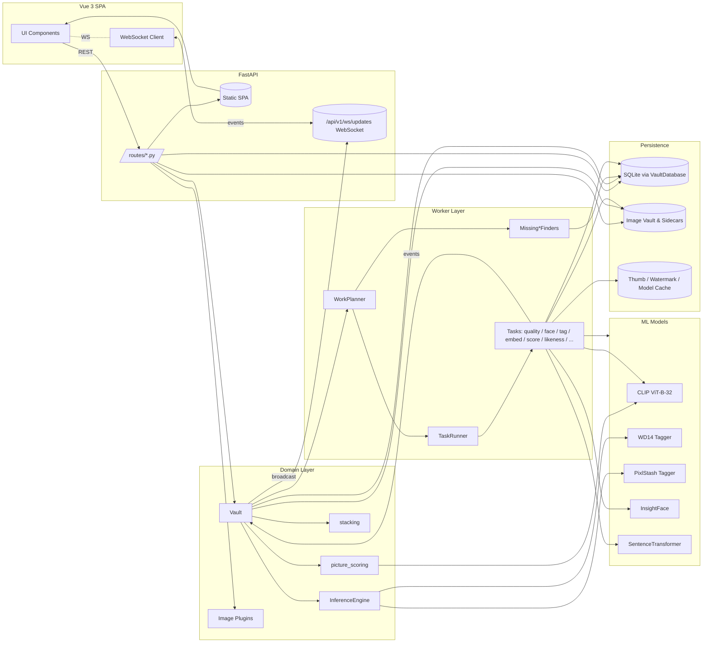
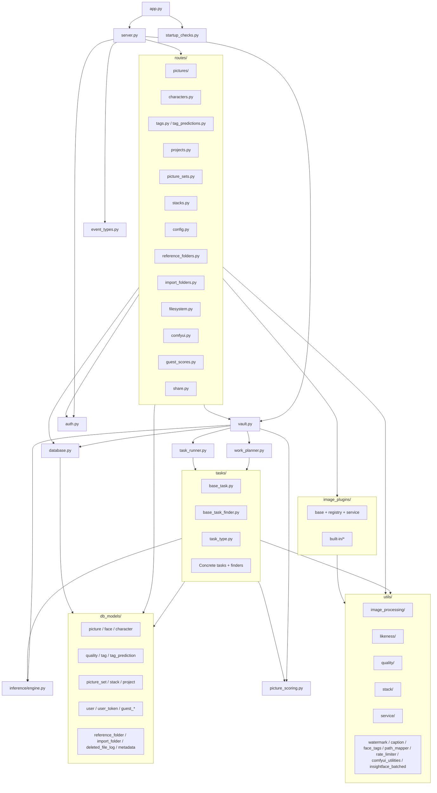
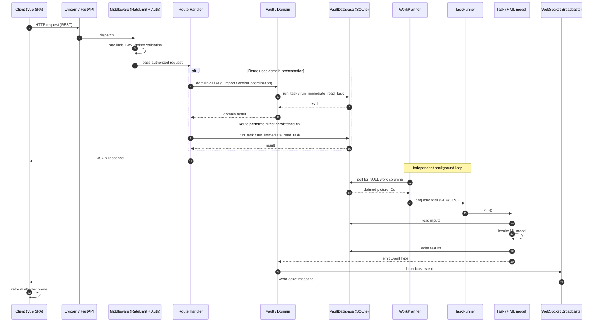

# PixlStash Backend Architecture

> Synthetic reference of the PixlStash backend. This document is the source of truth for both Copilot and human contributors when reasoning about server-side code.
>
> Companion documents: 

* Frontend: [docs/frontend_architecture.md](frontend_architecture.md)
* Integration: [docs/integration_architecture.md](integration_architecture.md)

---

## Table of Contents

1. [Project Tree](#1-project-tree)
2. [Architecture Overview](#2-architecture-overview)
3. [Frameworks, Runtime & Dependencies](#3-frameworks-runtime--dependencies)
4. [Top-Level Modules](#4-top-level-modules)
5. [Routes / HTTP API](#5-routes--http-api)
6. [Database Models](#6-database-models)
7. [Task System](#7-task-system)
8. [Image Plugins](#8-image-plugins)
9. [Tagger Plugins](#9-tagger-plugins)
10. [Services Layer](#10-services-layer)
11. [Utility Modules](#11-utility-modules)
12. [Alembic Migrations](#12-alembic-migrations)
13. [Storage Architecture](#13-storage-architecture)
14. [Server Lifecycle](#14-server-lifecycle)
15. [Frontend Integration](#15-frontend-integration)
16. [Authentication & Authorization](#16-authentication--authorization)
17. [Data Flow Pipeline](#17-data-flow-pipeline)
18. [Snapshots & Restore](#18-snapshots--restore)
19. [Mermaid Diagrams](#19-mermaid-diagrams)
20. [Architectural Patterns](#20-architectural-patterns)

---

## 1. Project Tree

```
pixlstash/
├── __init__.py
├── app.py                            # CLI entry point
├── server.py                         # FastAPI app + lifespan
├── database.py                       # VaultDatabase (threaded queue over SQLite)
├── auth.py                           # AuthService, JWT, scoped tokens
├── task_runner.py                    # Threaded CPU/GPU task executor
├── work_planner.py                   # Polls finders, schedules work
├── vault.py                          # Top-level orchestrator
├── picture_scoring.py                # Back-compat shim → re-exports pixlstash.scoring.*
├── stacking.py                       # Picture stacking
├── worker_config.py                  # Concurrency / batch tuning
├── startup_checks.py                 # Disk / VRAM / SSL preflight
├── event_types.py                    # WebSocket EventType enum
├── pixl_logging.py                   # Uvicorn log config
├── image_loading_dataset_prepper.py  # Training dataset prep
├── alembic.ini
│
├── db_models/                        # SQLModel definitions
│   ├── picture.py                    # Picture, SortMechanism, LikenessParameter
│   ├── face.py                       # Face (bbox + 512-d embedding)
│   ├── character.py                  # Character
│   ├── quality.py                    # Quality (sharpness, contrast, …)
│   ├── tag.py                        # User-confirmed tags
│   ├── tag_prediction.py             # Model-predicted tags + confidence
│   ├── tag_health.py                 # Per-tag health board cache
│   ├── tag_suggestion.py             # Suspected label fixes (review queue)
│   ├── tagger_run.py                 # Tagger eval runs pushed from PixlTagger
│   ├── review.py                     # Tag review sessions + item decisions
│   ├── detection.py                  # Florence-2 object detections
│   ├── snapshot.py                   # Vault snapshots (GFS retention)
│   ├── picture_likeness.py           # Pairwise image similarity
│   ├── picture_set.py                # Sets + membership
│   ├── picture_stack.py              # Stacks (duplicates / variants)
│   ├── picture_project.py            # Picture↔Project M-M
│   ├── project.py                    # Projects
│   ├── user.py                       # User + settings
│   ├── user_token.py                 # Scoped API tokens
│   ├── guest_session.py              # Public guest sessions
│   ├── guest_score.py                # Guest ratings
│   ├── reference_folder.py           # Anchor / reference folders
│   ├── import_folder.py              # Watched import folders
│   ├── deleted_file_log.py           # Deletion audit
│   └── metadata.py                   # Vault-level metadata
│
├── routes/                           # FastAPI routers
│   ├── pictures/                     # CRUD, search, thumbnails, export/import
│   ├── characters.py                 # Character management + face assignment
│   ├── tags.py                       # Tags + bulk operations
│   ├── tag_predictions.py            # Confirm / reject predictions
│   ├── projects.py                   # Projects
│   ├── picture_sets.py               # Picture sets + membership
│   ├── stacks.py                     # Stacks
│   ├── config.py                     # User/server config + progress
│   ├── reference_folders.py          # Reference folders
│   ├── import_folders.py             # Watch folders
│   ├── filesystem.py                 # Directory browsing
│   ├── comfyui.py                    # ComfyUI workflow integration
│   ├── guest_scores.py               # Guest scoring
│   └── share.py                      # Public sharing endpoints
│
├── tasks/                            # Background tasks + finders
│   ├── base_task.py                  # BaseTask, TaskStatus, QueueType
│   ├── base_task_finder.py           # BaseTaskFinder + picture claim
│   ├── task_type.py                  # TaskType enum
│   ├── quality_task.py
│   ├── description_task.py
│   ├── text_embedding_task.py
│   ├── image_embedding_task.py
│   ├── face_extraction_task.py
│   ├── likeness_task.py
│   ├── likeness_parameters_task.py
│   ├── tag_task.py
│   ├── smart_score_task.py
│   ├── text_score_task.py
│   ├── comfyui_extraction_task.py
│   ├── watch_folder_import_task.py
│   ├── source_face_likeness_task.py
│   ├── missing_file_purge_task.py
│   ├── reference_folder_scan_task.py
│   └── missing_*_finder.py           # One finder per task type
│
├── image_plugins/                    # Image transformation plugins
│   ├── base.py                       # ImagePlugin ABC
│   ├── registry.py                   # Plugin discovery
│   ├── service.py                    # Batch application
│   └── built-in/
│       ├── brightness_contrast.py
│       ├── blur_sharpen.py
│       ├── colour_filter.py
│       ├── pixelate.py
│       ├── rotate.py
│       ├── scaling.py
│       └── plugin_template.py
│
├── tagger_plugins/                   # TaggerPlugin subclasses + registry (WD14, PixlStash tagger, Florence-2, JoyCaption)
│
├── inference/                        # ML engine + model lifecycle
│   ├── engine.py                     # InferenceEngine (captioning, detection, embeddings)
│   ├── model_lifecycle.py            # Model load/unload management
│   ├── vram_budget.py                # VRAM budgeting
│   └── workflows/                    # tagging, description, text/clip/face embedding
│
├── scoring/                          # Picture scoring (split out of picture_scoring.py)
│   ├── smart_score.py                # Anchor-based smart-score heuristic + anomaly penalty
│   └── character_likeness.py         # Face↔reference likeness scoring
│
├── services/                         # Business-logic extracted from route handlers
│   ├── config_service.py             # Hardware monitoring + import folder utilities
│   ├── plugin_service.py             # Image plugin orchestration + progress tracking
│   ├── share_service.py              # Share-token validation + watermark resolution
│   └── tag_prediction_service.py     # Confirm / reject / reset tag predictions
│
├── utils/
│   ├── watermark.py
│   ├── caption_file_utils.py
│   ├── face_tags.py
│   ├── path_mapper.py
│   ├── path_utils.py                    # resolve_path_within (moved out of service/)
│   ├── serialization_utils.py           # safe_model_dict (moved out of service/)
│   ├── system_utils.py                  # default_max_vram_gb (moved out of service/)
│   ├── host_path_utils.py
│   ├── reference_folder_watcher.py
│   ├── reference_folder_validator.py
│   ├── rate_limiter.py
│   ├── comfyui_utilities.py
│   ├── insightface_batched.py
│   ├── image_processing/             # image_utils, face_utils, video_utils
│   ├── likeness/                     # likeness_utils, likeness_parameter_utils
│   ├── quality/                      # quality_utils, smart_score_utils
│   ├── stack/                        # stack_utils
│   └── service/                      # path/export/serialization/caption/config utils
│
├── migrations/
│   ├── env.py
│   ├── script.py.mako
│   └── versions/                     # Migration files for Alembic
│
├── data/
│   ├── anchors/                      # builtin_good.npy, builtin_bad.npy
│   └── comfyui-workflows/built-in/
│
└── frontend/                         # Bundled Vue 3 dist (served at /)
```

---

## 2. Architecture Overview

PixlStash is a **single-process image vault** built on FastAPI. Despite running on an ASGI server, most route handlers are synchronous and offload to background threads; "async" here means cooperative I/O for FastAPI/WebSockets, not an async stack end-to-end. It combines:

- A **REST + WebSocket API** for the Vue 3 frontend
- A **threaded task runner** with separate CPU and GPU queues
- A **SQLite database** wrapped in a threaded work queue (`VaultDatabase`) — a single dedicated writer thread serialises mutations while reads can bypass the queue via `run_immediate_read_task` meant for interactive tasks that needs a quick response
- A **ML pipeline** (CLIP, WD14, InsightFace, PixlStash tagger, SentenceTransformer)
- A **plugin system** for image transformations
- A **file vault** rooted at a configured `image_root` directory

The runtime is organised around five layers:

| Layer | Component | Responsibility |
|-------|-----------|----------------|
| **API** | `server.py`, `routes/*` | HTTP / WebSocket handlers, request validation |
| **Services** | `services/*` | Focused business-logic modules extracted from route handlers when they grew too large; not a formal service tier — `vault.py`, `picture_scoring.py`, and `stacking.py` are the real domain layer |
| **Domain** | `vault.py`, `inference/engine.py`, `picture_scoring.py`, `stacking.py` | Core orchestration: vault lifecycle, ML engine, scoring, stacking |
| **Workers** | `task_runner.py`, `work_planner.py`, `tasks/*` | Async background processing of new pictures |
| **Persistence** | `database.py`, `db_models/*`, `migrations/*` | Schema, queries, transactions |

Background processing is **data-driven**: each task type has a *finder* that queries the DB for rows with `NULL` work columns. The `WorkPlanner` polls finders, the `TaskRunner` executes tasks, and completion events trigger WebSocket broadcasts to update the UI.

---

## 3. Frameworks, Runtime & Dependencies

### Web & Server

| Component | Library | Notes |
|-----------|---------|-------|
| Web framework | **FastAPI** ≥ 0.135 | Async REST + WebSocket, auto OpenAPI |
| ASGI server | **Uvicorn** ≥ 0.41 | Lifespan hooks for startup/shutdown |
| Multipart | **python-multipart** | Image upload |
| Auth | **python-jose**, **passlib[bcrypt]**, **cryptography** | JWT + bcrypt |
| Rate limit | Custom middleware in `utils/rate_limiter.py` | IP-based throttling |

### Persistence

| Component | Library |
|-----------|---------|
| Database | **SQLite** (file-based) |
| ORM | **SQLModel** ≥ 0.0.37 (Pydantic + SQLAlchemy) |
| Migrations | **Alembic** ≥ 1.18 |

### ML Stack

| Capability | Library |
|------------|---------|
| Deep learning | **PyTorch** ≥ 2.10, **torchvision** ≥ 0.25 |
| Image-text embeddings | **open_clip_torch** ≥ 3.3 (CLIP ViT-B-32) |
| Model loading | **transformers** ≥ 5.3, **accelerate** ≥ 1.13 |
| Inference runtime | **onnxruntime** ≥ 1.24 |
| Face detection | **insightface** ≥ 0.7.3 |
| Text embeddings | **sentence_transformers** ≥ 5.2 |
| NLP | **spacy** ≥ 3.8 |
| Tensor utils | **einops** ≥ 0.8 |

### Image & Video

| Capability | Library |
|------------|---------|
| Image I/O | **Pillow** ≥ 12.1, **pillow-heif** |
| Computer vision | **opencv-python** ≥ 4.13 |
| EXIF | **piexif** |

### Math & System

| Capability | Library |
|------------|---------|
| Numerical | **NumPy** ≥ 2.4, **SciPy** ≥ 1.17 |
| Fuzzy matching | **rapidfuzz** ≥ 3.14 |
| File watching | **watchdog** ≥ 4.0 |
| HTTP client | **httpx** ≥ 0.28, **requests** |
| GPU monitor | **nvidia-ml-py** |
| Config dirs | **platformdirs** |
| Logging | **colorlog** |

**Python**: 3.10+

---

## 4. Top-Level Modules

| File | Responsibility |
|------|----------------|
| [pixlstash/app.py](../pixlstash/app.py) | CLI entry point (`pixlstash-server`). Parses arguments, runs startup checks, instantiates `Server`. |
| [pixlstash/server.py](../pixlstash/server.py) | Builds the FastAPI app, mounts routers, attaches WebSocket, registers lifespan (thumbnail pre-gen, cleanup, graceful shutdown). |
| [pixlstash/vault.py](../pixlstash/vault.py) | Top-level orchestrator. Owns `VaultDatabase`, `TaskRunner`, and `WorkPlanner`; lazily creates `InferenceEngine` on demand. Bridges domain events to the WebSocket broadcaster. |
| [pixlstash/database.py](../pixlstash/database.py) | `VaultDatabase`: queues DB work on a single writer thread; serialises writes via mutex, allows parallel reads. Exposes `run_task` / `run_immediate_read_task`. |
| [pixlstash/auth.py](../pixlstash/auth.py) | `AuthService`: password + JWT + scoped tokens. Enforces resource-level permissions (picture / set / character / project). |
| [pixlstash/task_runner.py](../pixlstash/task_runner.py) | Threaded executor with separate CPU and GPU pools. Monitors VRAM, gates GPU-heavy tasks, drains queues at shutdown. |
| [pixlstash/work_planner.py](../pixlstash/work_planner.py) | Registers all `BaseTaskFinder`s, polls them in round-robin, enforces inflight limits and adaptive backoff. |
| [pixlstash/picture_scoring.py](../pixlstash/picture_scoring.py) | Smart-score computation (anchor-based heuristic combining image embedding, CLIP anchors, a CLIP-IQA objective quality probe, and a calibrated anomaly penalty — per-tag severity × confidence × precision, where confidence is graded *relative to that tag's acceptance threshold* (normalised onto `[threshold, 1]` before the `CONF_POWER` exponent, so a barely-accepted detection costs `EVIDENCE_FLOOR` of full severity for every tag regardless of where its gate sits, and full confidence is unchanged), noisy-OR over merge-alias duplicates only, then rank-decayed accumulation across distinct defects so defect *count* escalates the penalty; the raw score is soft-compressed rather than hard-clipped at the bottom so heavily penalised pictures stay ordered instead of tying at 1.0. Per-tag severity comes from the **user's** `User.smart_score_penalised_tags` (resolved per scoring session by `resolve_penalised_tag_weights`; `DEFAULT_SMART_SCORE_PENALIZED_TAGS` is only the seed/fallback, and a tag absent from the user's table is not penalised at all), and only predictions clearing the tagger's per-label acceptance threshold are charged — human POS/NEG decisions are honoured regardless of confidence. See [`utils/quality/anomaly_penalty.py`](../pixlstash/utils/quality/anomaly_penalty.py), [`utils/service/anomaly_thresholds.py`](../pixlstash/utils/service/anomaly_thresholds.py) and [`docs/reviews/2026-06-smart-score-calibrated-anomaly-plan.md`](reviews/2026-06-smart-score-calibrated-anomaly-plan.md)) and character likeness scoring (face↔reference similarity via InsightFace embeddings). These two distinct features have been split into `scoring/smart_score.py` and `scoring/character_likeness.py`; `picture_scoring.py` remains as a thin back-compat re-export shim. |
| [pixlstash/worker_config.py](../pixlstash/worker_config.py) | Global constants — `NUM_WORKERS`, per-task `*_MAX_INFLIGHT`, batch sizes. |
| [pixlstash/startup_checks.py](../pixlstash/startup_checks.py) | Preflight: disk space, VRAM, CUDA, SSL. May force CPU mode. |
| [pixlstash/event_types.py](../pixlstash/event_types.py) | `EventType` enum used by WebSocket event bus. |
| [pixlstash/pixl_logging.py](../pixlstash/pixl_logging.py) | Uvicorn log config + coloured formatter. |
| [pixlstash/stacking.py](../pixlstash/stacking.py) | Picture stacking (duplicates / variants). |
| [pixlstash/image_loading_dataset_prepper.py](../pixlstash/image_loading_dataset_prepper.py) | Dataset preparation utilities for offline training scripts. |

---

## 5. Routes / HTTP API

All routers are mounted under `/api/v1/` unless stated otherwise. Routers live in [pixlstash/routes/](../pixlstash/routes/).

### `pictures/` package

Key endpoints (see the auto-generated index below for the full set):

| Method | Path | Purpose |
|--------|------|---------|
| GET | `/pictures` | Filtered/paginated picture listing |
| GET | `/pictures/search` | Keyword + semantic search |
| GET | `/pictures/stats` | Aggregate stats |
| POST | `/pictures/import` | Upload images → create Pictures (one-shot) |
| GET | `/pictures/import/status?task_id=…` | Import progress |
| POST | `/pictures/import/staging` | Open an async streaming-import session (#459) |
| POST | `/pictures/import/staging/{staging_id}/files` | Stream files into a staging session (unsafe window) |
| POST | `/pictures/import/staging/{staging_id}/commit` | Safe handoff → background `PictureImportTask` |
| DELETE | `/pictures/import/staging/{staging_id}` | Cancel an uncommitted staging session |
| GET | `/pictures/import/staging/{staging_id}/status` | Staging + background-import progress |
| GET | `/pictures/export` | Start async ZIP export |
| GET | `/pictures/export/status?task_id=…` | Export progress |
| GET | `/pictures/export/download/{task_id}` | Download finished ZIP |
| GET | `/pictures/thumbnails/{id}.webp` | Cached thumbnail |
| POST | `/pictures/thumbnails` | Batch thumbnails |
| GET | `/pictures/{id}.{ext}` | Serve original (optionally watermarked) |
| POST | `/pictures/{id}/plugin/{name}` | Run image plugin |
| PATCH | `/pictures/project` | Bulk assign to project |
| POST | `/pictures/scores` | Bulk apply user ratings |
| POST | `/pictures/{id}/face` | Create face record |
| DELETE | `/pictures/{id}/face/{index}` | Delete face |
| POST | `/pictures/detect` | Queue object detection (Segment) for a batch; optional `prompt` for open-vocab grounding |
| GET | `/pictures/{id}/detections` | Stored detection boxes for a picture (registered before the `/{id}/{field}` catch-all) |
| POST | `/pictures/likeness-search` | Reverse-image likeness search |

### `characters.py`
List, create, update, delete characters; fetch reference picture set; list pictures per character. Face assign / unassign lives in the adjacent [`characters_faces.py`](../pixlstash/routes/characters_faces.py) module (same `create_router(server)` factory, mounted next to the characters router), keeping this module focused on character CRUD and search.

**Project-membership reconciliation:** when a character's (or picture set's) `project_id` changes, the handler reconciles its pictures' `PictureProjectMember` rows: each picture is added to the new project and removed from the old one. Removal is *reference-aware* — a picture stays in the old project if another character or picture set still assigned to that project anchors it there (see `picture_referenced_by_project` in [`routes/_helpers.py`](../pixlstash/routes/_helpers.py)). When the entity leaves all projects, each picture's scalar `Picture.project_id` pointer falls back to any remaining membership. This logic is a single shared implementation, `reconcile_entity_project_change` in [`services/project_membership_service.py`](../pixlstash/services/project_membership_service.py); both `patch_character` and `picture_sets.py::update_picture_set` call it. Each caller keeps only what genuinely differs by entity kind: how member pictures are derived (characters resolve faces and expand to stacks; sets read their explicit members), when to reconcile (characters on project change only; sets also on an idempotent same-project re-assign that repairs drift), and how the "did anything change" signal is interpreted.

### `tags.py` / `tag_predictions.py`
Add/remove user tags; bulk clear; confirm or reject model-predicted tags (`TagPrediction` → `Tag`).

### `projects.py`, `picture_sets.py`, `stacks.py`
Standard CRUD; set/stack membership management; stack reordering.

### `config.py`
| Method | Path | Purpose |
|--------|------|---------|
| GET | `/config` | User settings |
| PATCH | `/config` | Update settings |
| POST | `/config/login` | Login (also `/login` at root) |
| GET | `/config/logout` | Logout |
| GET | `/config/progress` | Worker progress snapshot |
| GET | `/config/sort-mechanisms` | Available sort modes |
| GET | `/server-config/scrapheap-retention` | Scrapheap auto-purge window (`scrapheap_retention_days`, `scrapheap_retention_reduced_at`, `scrapheap_retention_choices`, `scrapheap_retention_grace_days`) |
| PATCH | `/server-config/scrapheap-retention` | Set the window (30/60/90/120 or `null` = Never). Persists to `server-config.json`; stamps `scrapheap_retention_reduced_at` only on a *reduction*. Purges nothing synchronously. |
| GET | `/server-config/scrapheap-retention/impact` | Preview a retention reduction: `would_purge_count` (excludes protected + locked; evaluated at the grace floor so it never understates) + `first_purge_at`. Pure read — applies nothing, stamps nothing, purges nothing. `0` when `days` is not lower than the current window |

### `reference_folders.py`, `import_folders.py`, `filesystem.py`
CRUD for reference / import folders; filesystem browsing for picker dialogs.

### `comfyui.py`
List workflows; execute a workflow against a picture.

### `guest_scores.py`, `share.py`
Public guest scoring and shared-link endpoints.

### App-level routes (`server.py`)
| Method | Path | Purpose |
|--------|------|---------|
| GET | `/` | Vue SPA index |
| GET | `/version` | Server version |
| GET | `/favicon.ico` | SPA favicon |
| POST | `/api/v1/login` | Login |
| GET | `/api/v1/login` | Registration status check |
| POST | `/api/v1/logout` | Logout |
| GET | `/api/v1/check-session` | Session / scope discovery |
| GET | `/api/v1/network/info` | LAN address info |
| GET | `/api/v1/protected` | Auth probe |
| WS  | `/api/v1/ws/updates` | Real-time event stream (broadcast) |
| WS  | `/api/v1/ws/comfyui` | ComfyUI progress passthrough (in `routes/comfyui.py`) |
| GET | `/share/{token_slug}` | Public token-embedded picture serving |
| GET | `/{full_path:path}` | SPA fallback (serves `index.html`) |

### Complete route index

> Auto-generated from `server.api.openapi()`. Regenerate with `python scripts/render_backend_architecture.py`.

<!-- AUTOGEN:start name="routes" -->
| Method | Path                                                                          | Tags            | Summary                                                    |
| ------ | ----------------------------------------------------------------------------- | --------------- | ---------------------------------------------------------- |
| GET    | /api/v1/characters                                                            | characters      | List characters                                            |
| POST   | /api/v1/characters                                                            | characters      | Create character                                           |
| POST   | /api/v1/characters/likeness-search                                            | characters      | Search characters by face likeness                         |
| POST   | /api/v1/characters/membership                                                 | characters      | Batch character membership lookup                          |
| POST   | /api/v1/characters/{character_id}/faces                                       | characters      | Assign faces to character                                  |
| DELETE | /api/v1/characters/{character_id}/faces                                       | characters      | Unassign faces from character                              |
| PATCH  | /api/v1/characters/{id}                                                       | characters      | Update character                                           |
| DELETE | /api/v1/characters/{id}                                                       | characters      | Delete character                                           |
| GET    | /api/v1/characters/{id}                                                       | characters      | Get character by id                                        |
| GET    | /api/v1/characters/{id}/reference_pictures                                    | characters      | List reference pictures                                    |
| GET    | /api/v1/characters/{id}/summary                                               | characters      | Get character category summary                             |
| GET    | /api/v1/characters/{id}/{field}                                               | characters      | Get character field                                        |
| GET    | /api/v1/check-session                                                         | auth            | Check Session                                              |
| GET    | /api/v1/login                                                                 | auth            | Check Registration                                         |
| POST   | /api/v1/login                                                                 | auth            | Login                                                      |
| POST   | /api/v1/logout                                                                | auth            | Logout                                                     |
| GET    | /api/v1/picture_sets                                                          | picture_sets    | List picture sets                                          |
| POST   | /api/v1/picture_sets                                                          | picture_sets    | Create picture set                                         |
| GET    | /api/v1/picture_sets/locked-members                                           | picture_sets    | List locked sets and their frozen pictures                 |
| POST   | /api/v1/picture_sets/membership                                               | picture_sets    | Batch set membership lookup                                |
| GET    | /api/v1/picture_sets/{id}                                                     | picture_sets    | Get picture set                                            |
| PATCH  | /api/v1/picture_sets/{id}                                                     | picture_sets    | Update picture set                                         |
| DELETE | /api/v1/picture_sets/{id}                                                     | picture_sets    | Delete picture set                                         |
| GET    | /api/v1/picture_sets/{id}/members                                             | picture_sets    | List picture set members                                   |
| POST   | /api/v1/picture_sets/{id}/members                                             | picture_sets    | Bulk add pictures to set                                   |
| PUT    | /api/v1/picture_sets/{id}/members                                             | picture_sets    | Bulk replace picture set members                           |
| POST   | /api/v1/picture_sets/{id}/members/{picture_id}                                | picture_sets    | Add picture to set                                         |
| DELETE | /api/v1/picture_sets/{id}/members/{picture_id}                                | picture_sets    | Remove picture from set                                    |
| GET    | /api/v1/picture_sets/{id}/thumbnail                                           | picture_sets    | Get picture set thumbnail                                  |
| DELETE | /api/v1/pictures                                                              | pictures        | Bulk move pictures to scrapheap                            |
| GET    | /api/v1/pictures                                                              | pictures        | List pictures                                              |
| POST   | /api/v1/pictures/apply-scores                                                 | pictures        | Batch apply manual scores                                  |
| POST   | /api/v1/pictures/character_likeness/batch                                     | pictures        | Batch picture character likeness                           |
| GET    | /api/v1/pictures/count                                                        | pictures        | Total picture count for a listing filter                   |
| POST   | /api/v1/pictures/detect                                                       | pictures        | Detect objects in pictures                                 |
| GET    | /api/v1/pictures/export                                                       | pictures        | Start picture export job                                   |
| GET    | /api/v1/pictures/export/download/{task_id}                                    | pictures        | Download completed export                                  |
| GET    | /api/v1/pictures/export/status                                                | pictures        | Get export job status                                      |
| POST   | /api/v1/pictures/face-search                                                  | pictures        | Search by face likeness                                    |
| POST   | /api/v1/pictures/import                                                       | pictures        | Import media files                                         |
| POST   | /api/v1/pictures/import/staging                                               | pictures        | Open an async import staging session                       |
| DELETE | /api/v1/pictures/import/staging/{staging_id}                                  | pictures        | Cancel a staging session                                   |
| POST   | /api/v1/pictures/import/staging/{staging_id}/commit                           | pictures        | Hand off a staging session to the background import        |
| POST   | /api/v1/pictures/import/staging/{staging_id}/files                            | pictures        | Stream files into a staging session                        |
| GET    | /api/v1/pictures/import/staging/{staging_id}/status                           | pictures        | Get async import staging status                            |
| GET    | /api/v1/pictures/import/status                                                | pictures        | Get import job status                                      |
| POST   | /api/v1/pictures/impossible-tags/clear                                        | tags            | Bulk-clear impossible tags                                 |
| POST   | /api/v1/pictures/impossible-tags/restore                                      | tags            | Undo a bulk impossible-tags clear                          |
| POST   | /api/v1/pictures/likeness-search                                              | pictures        | Search by image likeness                                   |
| PATCH  | /api/v1/pictures/project                                                      | pictures        | Set project for pictures                                   |
| POST   | /api/v1/pictures/score_character_likeness                                     | pictures        | Score uploaded images by character likeness                |
| DELETE | /api/v1/pictures/scrapheap                                                    | pictures        | Permanently delete scrapheap pictures                      |
| POST   | /api/v1/pictures/scrapheap/delete-preview                                     | pictures        | Preview a scrapheap delete-forever                         |
| POST   | /api/v1/pictures/scrapheap/restore                                            | pictures        | Restore deleted pictures                                   |
| GET    | /api/v1/pictures/search                                                       | pictures        | Search pictures by text                                    |
| GET    | /api/v1/pictures/stream                                                       | pictures        | Stream pictures in batches                                 |
| POST   | /api/v1/pictures/tags/bulk_fetch                                              | tags            | Fetch tags for multiple pictures                           |
| POST   | /api/v1/pictures/thumbnails                                                   | pictures        | Get batch thumbnail metadata                               |
| GET    | /api/v1/pictures/thumbnails/{id}.webp                                         | pictures        | Get picture thumbnail image                                |
| PATCH  | /api/v1/pictures/{id}                                                         | pictures        | Patch picture fields                                       |
| DELETE | /api/v1/pictures/{id}                                                         | pictures        | Move picture to scrapheap                                  |
| GET    | /api/v1/pictures/{id}.{ext}                                                   | pictures        | Get original picture file                                  |
| GET    | /api/v1/pictures/{id}/anomaly_region                                          | pictures        | Locate an anomaly region                                   |
| GET    | /api/v1/pictures/{id}/detections                                              | pictures        | Get picture detections                                     |
| GET    | /api/v1/pictures/{id}/metadata                                                | pictures        | Get picture metadata                                       |
| POST   | /api/v1/pictures/{id}/tags                                                    | tags            | Add tag to picture                                         |
| GET    | /api/v1/pictures/{id}/tags                                                    | tags            | List picture tags                                          |
| DELETE | /api/v1/pictures/{id}/tags                                                    | tags            | Clear all tags on picture                                  |
| POST   | /api/v1/pictures/{id}/tags/remove_all                                         | tags            | Remove tag everywhere on picture                           |
| DELETE | /api/v1/pictures/{id}/tags/{tag_id}                                           | tags            | Remove picture tag                                         |
| GET    | /api/v1/pictures/{picture_id}/stack                                           | stacks          | Get picture's stack                                        |
| GET    | /api/v1/projects                                                              | projects        | List all projects                                          |
| POST   | /api/v1/projects                                                              | projects        | Create a project                                           |
| POST   | /api/v1/projects/membership                                                   | projects        | Batch project membership lookup                            |
| GET    | /api/v1/projects/{id_or_name}                                                 | projects        | Get a project by ID or name                                |
| GET    | /api/v1/projects/{id_or_name}/picture_sets                                    | projects        | List picture sets for a project                            |
| PUT    | /api/v1/projects/{project_id}                                                 | projects        | Update a project                                           |
| DELETE | /api/v1/projects/{project_id}                                                 | projects        | Delete a project                                           |
| GET    | /api/v1/projects/{project_id}/attachments                                     | projects        | List attachments for a project                             |
| POST   | /api/v1/projects/{project_id}/attachments                                     | projects        | Upload an attachment to a project                          |
| POST   | /api/v1/projects/{project_id}/attachments/url                                 | projects        | Add a URL bookmark to a project                            |
| GET    | /api/v1/projects/{project_id}/attachments/{attachment_id}                     | projects        | Download a project attachment                              |
| DELETE | /api/v1/projects/{project_id}/attachments/{attachment_id}                     | projects        | Delete a project attachment                                |
| GET    | /api/v1/projects/{project_id}/export                                          | projects        | Export project as ZIP                                      |
| GET    | /api/v1/projects/{project_id}/summary                                         | projects        | Get project picture count                                  |
| GET    | /api/v1/projects/{project_name}/characters/{character_name}                   | characters      | Get character by project name and character name           |
| GET    | /api/v1/projects/{project_name}/picture_sets/{picture_set_name}               | picture_sets    | Get picture set by project name and set name               |
| POST   | /api/v1/reviews                                                               | reviews         | Create a review session for one tag                        |
| GET    | /api/v1/reviews                                                               | reviews         | List review sessions                                       |
| DELETE | /api/v1/reviews                                                               | reviews         | Bulk-delete review sessions by status (clear all archived) |
| GET    | /api/v1/reviews/preview                                                       | reviews         | Preview a review's coverage before creating it             |
| GET    | /api/v1/reviews/{review_id}                                                   | reviews         | Get one review's detail                                    |
| DELETE | /api/v1/reviews/{review_id}                                                   | reviews         | Delete one review session                                  |
| POST   | /api/v1/reviews/{review_id}/abort                                             | reviews         | Abort a review (discard the session)                       |
| POST   | /api/v1/reviews/{review_id}/archive                                           | reviews         | Archive a review (completed)                               |
| POST   | /api/v1/reviews/{review_id}/refresh                                           | reviews         | Re-scan a review append-only                               |
| GET    | /api/v1/reviews/{review_id}/suggestions                                       | reviews         | List a review's ranked queue                               |
| GET    | /api/v1/snapshots                                                             | snapshots       | List Snapshots                                             |
| POST   | /api/v1/snapshots                                                             | snapshots       | Create Snapshot                                            |
| GET    | /api/v1/snapshots/status                                                      | snapshots       | Snapshots Status                                           |
| PATCH  | /api/v1/snapshots/{snapshot_id}                                               | snapshots       | Rename Snapshot                                            |
| DELETE | /api/v1/snapshots/{snapshot_id}                                               | snapshots       | Delete Snapshot                                            |
| POST   | /api/v1/snapshots/{snapshot_id}/hash-compare                                  | snapshots       | Hash Compare                                               |
| POST   | /api/v1/snapshots/{snapshot_id}/restore                                       | snapshots       | Restore Snapshot                                           |
| POST   | /api/v1/snapshots/{snapshot_id}/restore/batch                                 | snapshots       | Restore Batch                                              |
| GET    | /api/v1/snapshots/{snapshot_id}/restore/preview                               | snapshots       | Preview Full Restore                                       |
| POST   | /api/v1/snapshots/{snapshot_id}/restore/preview/batch                         | snapshots       | Preview Batch Restore                                      |
| POST   | /api/v1/snapshots/{snapshot_id}/restore/{resource_type}/{resource_id}         | snapshots       | Restore Resource                                           |
| GET    | /api/v1/snapshots/{snapshot_id}/restore/{resource_type}/{resource_id}/preview | snapshots       | Preview Resource Restore                                   |
| GET    | /api/v1/sort_mechanisms                                                       | pictures        | List picture sort mechanisms                               |
| POST   | /api/v1/stacks                                                                | stacks          | Create stack                                               |
| GET    | /api/v1/stacks/{stack_id}                                                     | stacks          | Get stack details                                          |
| POST   | /api/v1/stacks/{stack_id}/members                                             | stacks          | Add stack members                                          |
| DELETE | /api/v1/stacks/{stack_id}/members                                             | stacks          | Remove stack members                                       |
| PATCH  | /api/v1/stacks/{stack_id}/members/{picture_id}                                | stacks          | Set member position                                        |
| PATCH  | /api/v1/stacks/{stack_id}/order                                               | stacks          | Reorder stack                                              |
| GET    | /api/v1/stacks/{stack_id}/pictures                                            | stacks          | List pictures in stack                                     |
| GET    | /api/v1/tag_health                                                            | tag_health      | Tag health board rows                                      |
| POST   | /api/v1/tag_health/rebuild                                                    | tag_health      | Rebuild the tag health cache                               |
| GET    | /api/v1/tag_suggestions                                                       | tag_suggestions | List ranked tag-fix suggestions                            |
| POST   | /api/v1/tag_suggestions/bulk-accept                                           | tag_suggestions | Resolve all confident suggestions for a tag                |
| POST   | /api/v1/tag_suggestions/bulk-reopen                                           | tag_suggestions | Batch-undo a bulk accept                                   |
| POST   | /api/v1/tag_suggestions/scan                                                  | tag_suggestions | Scan a tag for near-neighbour label disagreements          |
| POST   | /api/v1/tag_suggestions/{suggestion_id}/accept                                | tag_suggestions | Accept a tag-fix suggestion                                |
| POST   | /api/v1/tag_suggestions/{suggestion_id}/dismiss                               | tag_suggestions | Dismiss a tag-fix suggestion                               |
| POST   | /api/v1/tag_suggestions/{suggestion_id}/fix-twin                              | tag_suggestions | Resolve a suggestion in the twin's favour                  |
| POST   | /api/v1/tag_suggestions/{suggestion_id}/reopen                                | tag_suggestions | Reopen (undo) a reviewed suggestion                        |
| POST   | /api/v1/tag_suggestions/{suggestion_id}/skip                                  | tag_suggestions | Skip a tag-fix suggestion (no decision)                    |
| POST   | /api/v1/tag_suggestions/{suggestion_id}/swap                                  | tag_suggestions | Swap a pair's labels (both were wrong, opposite ways)      |
| POST   | /api/v1/tagger-runs                                                           | tagger_runs     | Ingest a tagger evaluation run from PixlTagger             |
| GET    | /api/v1/tagger-runs                                                           | tagger_runs     | List ingested tagger runs (newest first)                   |
| GET    | /api/v1/tags                                                                  | tags            | List all tags                                              |
| GET    | /version                                                                      | server          | Read Version                                               |
| WS     | /api/v1/ws/updates                                                            | config          | Real-time event stream                                     |
| WS     | /api/v1/ws/comfyui                                                            | comfyui         | ComfyUI workflow progress                                  |
<!-- AUTOGEN:end name="routes" -->

---

## 6. Database Models

All models live in [pixlstash/db_models/](../pixlstash/db_models/).

### Core entities

```text
Picture
  id, file_path, pixel_sha, format, width, height,
  created_at, imported_at, score, smart_score, text_score,
  import_excluded, deleted, deleted_at, source_picture_id, stack_id,
  character_likeness, image_embedding (BLOB), text_embedding (BLOB),
  comfyui_models (JSON), comfyui_loras (JSON),
  watermark_seed, embed_watermark
  → faces, quality, tags, tag_predictions
  → likeness_a / likeness_b (PictureLikeness)
  → sets (M-M), projects (M-M), stack
```

```text
Face: id, picture_id, frame_index, face_index, character_id,
      bbox (JSON), features (512-d InsightFace BLOB)

Detection: id, picture_id, frame_index, detection_index,
           label (open-vocab, indexed), bbox (JSON pixel xyxy),
           score (nullable — Florence emits none), source
           (e.g. "florence2:od"), attributes (JSON escape-hatch)
           (UNIQUE picture_id+frame_index+detection_index)
           → object-detection boxes, user-triggered (Segment); the
             Picture.detections relationship cascades on delete

Character: id, name, description, extra_metadata,
           reference_picture_set_id, project_id

Quality: id, picture_id, sharpness, edge_density, contrast,
         brightness, noise_level, colorfulness,
         luminance_entropy, dominant_hue

Tag: id, picture_id, tag
TagPrediction: id, picture_id, tag, confidence, model_version,
               status, predicted_at  (UNIQUE picture_id+tag)

PictureLikeness: picture_id_a, picture_id_b (a < b), likeness, metric
```

### Grouping & scoping

```text
PictureSet / PictureSetMember
PictureStack       (Picture.stack_id links members)
Project / PictureProjectMember
```

### Users & sharing

```text
User: id, username, password_hash, plus full settings block
      (sort, columns, theme, similarity_character, hidden_tags,
       smart_score_penalised_tags, tagger_settings (JSON),
       keep_models_in_memory, max_vram_gb, watermark_image (BLOB), …)

UserToken: id, user_id, token_hash, scope (ALL|READ),
           resource_type, resource_id, expires_at,
           include_attachments, include_description

GuestSession / GuestScore
```

### Tag review & health

```text
TagHealth: id, tag (unique), est_wrong, est_missing,
           est_wrong_adj, est_missing_adj, mismatch, verified_pct,
           boundary_pct, overturn_rate, model_disputes, has_model,
           last_reviewed_at, computed_at
           → per-tag health board cache (rebuilt in the background)

TagSuggestion: id, picture_id, tag, direction ("add"|"remove"),
               source, score, reason, twin_picture_id, twin_sim,
               review_id, neighbors (JSON), status, created_at,
               reviewed_at, prior_review_id/status/reviewed_at
               (suspected label fixes in the review queue)

Review: id, tag, project_id, set_id, character_id, status
        (OPEN|ARCHIVED|ABORTED), scanned, found, prev_reviewed,
        created_at, refreshed_at, receipt_snapshot
        (one review session = one tag + a frozen scope + one scan)

TaggerRun: id, run (unique), model_version, verdict, recommend,
           accepted, anomaly_macro_f1, report (JSON), created_at
           (tagger eval runs pushed from PixlTagger)
```

### Filesystem-linked

```text
ReferenceFolder, ImportFolder, DeletedFileLog, Metadata

Snapshot: id, kind, created_at, relative_path,
          manifest_relative_path, byte_size, picture_count,
          schema_version, label   (vault snapshots, GFS retention)
```

**Vector storage**: image and text embeddings are stored as `BLOB` columns on `Picture` (no external vector DB). Face features are stored on `Face`.

---

## 7. Task System

### Building blocks

- **`BaseTask`** (`tasks/base_task.py`) — abstract task. Declares `task_type`, `queue_type` (CPU/GPU), `priority`, `run()`.
- **`BaseTaskFinder`** (`tasks/base_task_finder.py`) — queries DB for missing work, claims picture IDs, builds task instances, releases claims in `on_task_complete()`.
- **`TaskType`** (`tasks/task_type.py`) — enum of all task types.
- **`TaskRunner`** — executes tasks from CPU and GPU queues. CPU queue is multi-threaded (`NUM_WORKERS` per `worker_config.py`); GPU queue is serialised to avoid CUDA contention.
- **`WorkPlanner`** — polls each finder, respects `*_MAX_INFLIGHT` limits, applies adaptive backoff when no work is found.

### Registered tasks

| Task | Queue | Finder | Purpose |
|------|-------|--------|---------|
| `FACE_EXTRACTION` | GPU | `MissingFaceExtractionFinder` | InsightFace detection + 512-d embedding |
| `FACE_MODEL_REFRESH` | GPU | `MissingFaceModelRefreshFinder` | Re-embed `Face` rows in place when `insightface_model_pack` changes (selects faces whose `model_pack` differs from the configured pack, preserving `character_id`). `depends_on=[FACE_EXTRACTION]` so brand-new pictures are never starved by a pack-refresh sweep. Registered in `vault.py`. |
| `QUALITY` | CPU | `MissingQualityFinder` | OpenCV quality metrics |
| `TAGGER` | GPU | `MissingTagFinder` | All enabled tag plugins (union) |
| `TAG_PREDICTION_BACKFILL` | GPU | `MissingTagPredictionFinder` | Recover `tag_prediction` rows for pictures with tags but no predictions (runs the PixlStash tagger for raw scores only; never re-tags). Gated on the PixlStash tagger being active; depends on `FACE_EXTRACTION` + `TAGGER` so live work runs first. |
| `DESCRIPTION` | GPU | `MissingDescriptionFinder` | Image caption generation |
| `TEXT_EMBEDDING` | GPU | `MissingTextEmbeddingFinder` | SentenceTransformer on captions |
| `IMAGE_EMBEDDING` | GPU | `MissingImageEmbeddingFinder` | CLIP image embedding |
| `LIKENESS` | GPU | `MissingLikenessFinder` | Pairwise CLIP similarity |
| `LIKENESS_PARAMETERS` | CPU | `MissingLikenessParametersFinder` | Per-character similarity params |
| `SMART_SCORE` | GPU | `MissingSmartScoreFinder` | Anchor-based heuristic score. Takes a full `Vault` (not just `database`) so it can resolve the tagger's per-label acceptance thresholds for the anomaly penalty, and is therefore registered in `vault.py` rather than `WorkPlanner.work_finders()` — same reason as `GFS_SNAPSHOT` and `TAG_HEALTH_AUTO_REBUILD`. |
| `TEXT_SCORE` | CPU | `MissingTextScoreFinder` | MSER-based text-in-image score |
| `WATCH_FOLDERS` | CPU | `MissingWatchFolderImportFinder` | Ingest from watch folders |
| `COMFYUI_EXTRACTION` | CPU | `MissingComfyUIExtractionFinder` | Parse ComfyUI metadata |
| `SOURCE_FACE_LIKENESS` | GPU | `MissingSourceFaceLikenessCharacterFinder` | Face↔reference similarity |
| `MISSING_FILE_PURGE` | CPU | `MissingFilePurgeFinder` | Remove records for vanished files |
| `REFERENCE_FOLDER_SCAN` | CPU | `ReferenceFolderScanFinder` | Periodic reference-folder rescan |
| `DETECTION` | GPU | _(none — user-triggered)_ | Florence-2 object detection / phrase grounding → `Detection` rows. Enqueued by `POST /pictures/detect` (the Segment action); HIGH priority, no WorkFinder. Reuses the captioning Florence-2 model via `InferenceEngine.detect_objects`. |
| `PICTURE_IMPORT` | CPU | _(none — user-triggered)_ | Async streaming-staging import (#459). Finishes a committed staging session server-side (the *safe* window): hashes, de-dupes by `pixel_sha` (incl. intra-batch), ingests each staged file, inserts `Picture` rows with a pending-tag sentinel, then removes the staging dir. Enqueued by `POST /pictures/import/staging/{id}/commit`; HIGH priority, no WorkFinder. Live progress via the worker-progress snapshot (`_total_count`/`_processed_count`), completion emits `CHANGED_PICTURES` + `PICTURE_IMPORTED`. |
| `GFS_SNAPSHOT` | CPU | `EnsureGfsSnapshotFinder` | Drives the Grandfather-Father-Son automatic snapshot schedule: at most one snapshot per check (every 5 minutes), of the highest tier that is due (`MONTHLY` / `WEEKLY` / `DAILY`). Retention prunes each tier independently (7 daily / 4 weekly / 12 monthly). Registered in `vault.py`. |
| `SCRAPHEAP_RETENTION_PURGE` | CPU | `ScrapheapRetentionPurgeFinder` | Scrapheap auto-purge. Every 15 minutes, selects UNPROTECTED, UNLOCKED soft-deleted pictures whose deadline has passed and permanently destroys them through the ONE destruction path, `scrapheap_service.purge_scrapheap_pictures(..., include_protected=False)`. **Deadline = `max(deleted_at + scrapheap_retention_days, scrapheap_retention_reduced_at + 1 day)`** — the second term is a FLOOR measured from the last window *lowering*, not a per-picture extension, so after a reduction nothing is purgeable for a day regardless of age. (Measuring the grace from `deleted_at` would only help the `[days, days+1)` band, leaving `Never -> 30` free to wipe a long-lived scrapheap on the next sweep.) The deadline and the locked-set freeze are enforced **twice** — in the finder's candidate query and again by a `RetentionGuard` inside `build_purge_plan`, which re-derives them from the row's current `deleted_at` (the task runs at LOW priority, so a restore/re-delete in between is a real TOCTOU). Locked-set members (directly, or via a live stack sibling) are skipped and reported, never raised — on **every** path: `build_purge_plan` enforces the freeze unconditionally, so the manual `DELETE /pictures/scrapheap` cannot destroy one either, at either `include_protected` value (returned as `skipped_locked`). `POST /pictures/scrapheap/delete-preview` reports `locked_count` / `protected_count` / `unprotected_count` as three DISJOINT buckets summing to `total_count`, keyed on which action destroys the row — locked classified FIRST (the opposite of `auto_purge_exempt_reason`, where protected wins) because the preview answers "what will this button destroy?" and must lead with the binding blocker, while the badge answers "why is this kept?" and leads with the permanent reason. The candidate query evaluates the deadline in SQL — `deleted = TRUE AND deleted_at <= now - retention_days`, keyset-paginated on `(deleted_at, id)` so `ix_picture_deleted_at` is actually used (ordering by `id` instead made SQLite walk every scrapheap row via `ix_picture_deleted`: 1.23 ms/page vs 0.08 ms/page on a 200k library with a 20k scrapheap) — and returns early without scanning at all while `now < reduced_at + grace`, since no row can be due inside the floor. The lock lookup is chunked; the lock lookup is chunked to `LOCK_QUERY_CHUNK` ids so a large scrapheap cannot hit the 999-variable limit of SQLite < 3.32 and silently disable the sweep. The scrapheap listing applies the SAME two exemptions through the same helpers, exposing `purge_at` / `auto_purge_exempt` / `auto_purge_exempt_reason` (`"protected"` | `"locked"` | `null`; protected wins when both apply), so the countdown the UI renders can never disagree with what the sweep will do. Full restore and per-resource restore both re-stamp `deleted_at = now()` on restored scrapheap rows, so restoring an old snapshot cannot hand the sweep an already-expired deadline. Protected reference-folder originals (`allow_delete_file=False`) are exempt from any timer and are excluded from the candidate query — only the consent-gated manual delete-forever (`include_protected=true`) can destroy them. `scrapheap_retention_days=null` ("Never") disables the finder entirely, and a config save NEVER purges synchronously. Registered in `vault.py`. |
| `TAG_HEALTH_AUTO_REBUILD` | CPU | `TagHealthAutoRebuildFinder` | Checks `tag_health_service.is_stale` at most every 5 minutes (`AUTO_REBUILD_CHECK_INTERVAL_S`); when stale and no rebuild is running, dispatches through the same idempotent `start_rebuild` path `POST /tag_health/rebuild` uses. Closes the loop so `GET /tag_health`'s `stale` flag (new pictures / `TaggerRun`s / reviewed `TagSuggestion`s since the cache's `computed_at`) self-heals without a manual click. |

**Re-processing**: setting a work column to `NULL` (e.g. via an Alembic migration) makes the corresponding finder pick the row up on the next pass — this is how data regenerations are triggered.

**User-triggered tasks** (e.g. `DETECTION`) have no finder: they are enqueued directly from a route in response to a user action and replace prior rows on re-run rather than being gated on a `NULL` column.

---

## 8. Image Plugins

Located in [pixlstash/image_plugins/](../pixlstash/image_plugins/).

- **`base.ImagePlugin`** — abstract base. Each plugin declares `name`, `display_name`, `parameter_schema()` and implements `run(images, parameters, progress_callback, error_callback)`.
- **`registry.PluginRegistry`** — discovers plugins (built-in + user-supplied), exposes lookup by name.
- **`service.apply_plugin_to_pictures`** — batch entry point invoked by `POST /pictures/{id}/plugin/{name}`; emits `PLUGIN_PROGRESS` events.

Built-in plugins: `brightness_contrast`, `blur_sharpen`, `colour_filter`, `pixelate`, `rotate`, `scaling`, plus `plugin_template.py` as a starter for custom plugins.

---

## 9. Tagger Plugins

All taggers and captioners are implemented as `TaggerPlugin` subclasses ([pixlstash/tagger_plugins/base.py](../pixlstash/tagger_plugins/base.py)). Plugins are managed by `TaggerPluginManager` ([pixlstash/tagger_plugins/registry.py](../pixlstash/tagger_plugins/registry.py)), the process-wide singleton accessed via `get_tagger_plugin_manager()`. If a plugin module fails to import (e.g. a missing optional dependency), the registry logs a warning and skips it — the rest of the app boots normally.

| Plugin name | Class | File | Capability | Notes |
|-------------|-------|------|------------|-------|
| `wd14` | `WD14Plugin` | `tagger_plugins/wd14.py` | Tags | `SmilingWolf/wd-convnext-tagger-v3` ONNX |
| `pixlstash_tagger` | `PixlStashTaggerPlugin` | `tagger_plugins/pixlstash_tagger.py` | Tags | `PersonalJeebus/pixlvault-anomaly-tagger` (HF, pinned) |
| `florence2` | `Florence2Plugin` | `tagger_plugins/florence2.py` | Descriptions | Florence-2 captions |
| `joycaption` | `JoyCaptionPlugin` | `tagger_plugins/joycaption.py` | Tags + Descriptions | LLaVA-style LLM; `bitsandbytes` optional dep |

### `TaggerPlugin` ABC

Every plugin declares:
- **Class attributes**: `name`, `display_name`, `description`, `supports_tags`, `supports_descriptions`, `requires_download`, `default_enabled`.
- **`parameter_schema()`** — list of JSON-serialisable parameter definitions (same shape as `ImagePlugin.parameter_schema()`).
- **Lifecycle**: `needs_download()`, `download()`, `init(parameters)`, `unload()`, `is_loaded()`.
- **Inference**: `tag_images(...)` (when `supports_tags`) returns `{path: list[TagResult]}`; `generate_descriptions(...)` (when `supports_descriptions`) returns `{path: caption_str}`. `TagResult` carries `tag` and `confidence` (may be `None` for LLM-based plugins).
- **VRAM hints**: `estimated_vram_mb()`, `effective_batch_size()`.

### `tagger_settings` JSON column

User plugin preferences are stored in a single `User.tagger_settings` JSON column:

```json
{
  "active_description_plugin": "florence2",
  "plugins": {
    "wd14":             {"enabled": false, "params": {"threshold": 0.85}},
    "pixlstash_tagger": {"enabled": true,  "params": {"threshold_offset": 0.0}},
    "florence2":        {                   "params": {"max_new_tokens": 120, "fast_mode": false}}
  }
}
```

- **Tag plugins** carry an `enabled` flag; outputs union across all enabled plugins (max confidence wins).
- **Description plugins** are selected via the single `active_description_plugin` value (radio-select). Florence-2 is the fallback if the configured plugin is unavailable.
- Missing entries are filled with per-plugin defaults on every serialise; unknown plugin names are preserved on read for downgrade safety.
- Written exclusively through `PATCH /users/me/config` (`tagger_settings` key); `user_settings_utils._apply_tagger_settings_patch` validates all plugin names and parameter names against the live registry.

All models support CUDA and CPU. Models are lazily loaded on first `init()` call and can be unloaded after idle to free VRAM unless `keep_models_in_memory` is set.

The `InferenceEngine` also exposes workflow accessor properties that wrap the tagger services:

| Property | Workflow class | Purpose |
|----------|---------------|---------|
| `tagging_workflow` | `inference/workflows/tagging.py` | All enabled tag plugins (union) |
| `description_workflow` | `inference/workflows/description.py` | Active description plugin (Florence-2 fallback) |
| `text_embedding_workflow` | `inference/workflows/text_embedding.py` | SentenceTransformer + CLIP text |
| `face_embedding_workflow` | `inference/workflows/face_embedding.py` | InsightFace 512-d embeddings |
| `clip_embedding_workflow` | `inference/workflows/clip_embedding.py` | CLIP image embeddings |

---

## 10. Services Layer

Modules in [pixlstash/services/](../pixlstash/services/) contain business logic that has been extracted from route handlers to keep those handlers thin. Unlike `utils/`, which provides stateless helpers, service modules may perform DB access and emit domain events.

| Module | Role |
|--------|------|
| [utils/service/filter_helpers.py](../pixlstash/utils/service/filter_helpers.py) | Shared SQL filter helpers (`normalize_set_mode`, `collect_set_filter_ids`, `project_membership_exists_clause`). Lives under `utils/service/` (not `services/`); it is a stateless utility module, not a service in the domain sense |
| [utils/service/picture_stats.py](../pixlstash/utils/service/picture_stats.py) | Aggregation queries for `GET /pictures/stats`; accepts a `PictureStatsParams` dataclass and returns the stats dict; used by `routes/pictures/_misc.py`. Lives under `utils/service/`, not `services/` |
| [services/config_service.py](../pixlstash/services/config_service.py) | Hardware monitoring (CPU, RAM, GPU via `psutil` / `pynvml`) and import-folder path resolution; extracted from `routes/config.py` |
| [services/picture_service.py](../pixlstash/services/picture_service.py) | DB-layer helpers for single-picture reads from route handlers; accept a `Database` (`vault.db`) and delegate session management to it |
| [services/search_query_service.py](../pixlstash/services/search_query_service.py) | DB-layer helpers for face-search and likeness-search queries; same `Database`-delegating pattern as `picture_service.py` |
| [services/plugin_service.py](../pixlstash/services/plugin_service.py) | Plugin listing and async orchestration for `POST /pictures/plugins/{name}`; emits `PLUGIN_PROGRESS` WebSocket events; used by `routes/pictures/_misc.py` |
| [services/share_service.py](../pixlstash/services/share_service.py) | Validates picture share tokens (`UserToken`), resolves shared pictures, and returns the correct watermark bytes (custom or default) |
| [services/stack_membership.py](../pixlstash/services/stack_membership.py) | Stack-atomic project & set membership helpers — keeps every member of a stack sharing the same project (`PictureProjectMember` / `Picture.project_id`) and set (`PictureSetMember`) membership |
| [services/set_lock_service.py](../pixlstash/services/set_lock_service.py) | Single source of truth for picture-set lock enforcement: a `PictureSet` with `locked=True` is a hard whole-set freeze (set-level and member-level protections) |
| [services/scrapheap_service.py](../pixlstash/services/scrapheap_service.py) | **The single permanent-destruction path for scrapheap pictures** plus the retention policy maths. Both the manual `DELETE /pictures/scrapheap` handler and the scheduled `ScrapheapRetentionPurgeTask` call `purge_scrapheap_pictures`; there is deliberately no second destruction path. Also owns `compute_purge_at` / the reduction-grace rule, the `scrapheap_retention_*` server-config read/write, and the permanent-deletion ledger's only `True -> False` correction — bounded to the `path_sha`s the same purge wrote, so it can never retract an earlier purge's genuine deletion at a reused path |
| [services/snapshot_service.py](../pixlstash/services/snapshot_service.py) | Snapshot creation (SQLite `VACUUM INTO` + JSON manifest + `Snapshot` row), listing, and GFS-style retention pruning (see §18) |
| [services/restore_service.py](../pixlstash/services/restore_service.py) | Full-database and per-resource (picture / picture_set / project / character) restore from a snapshot; runs `alembic upgrade head` on the snapshot first (see §18) |
| [services/tag_prediction_service.py](../pixlstash/services/tag_prediction_service.py) | Confirm, reject, delete, and reset tag predictions; encapsulates the `TagPrediction` → `Tag` promotion logic used by `routes/tag_predictions.py` |
| [services/tagger_run_service.py](../pixlstash/services/tagger_run_service.py) | System-of-record DB side for tagger evaluation runs pushed from PixlTagger: upsert a posted report on the run name and list stored runs for the stats panel |
| [services/tag_health_service.py](../pixlstash/services/tag_health_service.py) | Tag health board cache — computes one `TagHealth` row per tag from indexed SQL over `tag_prediction` / `tag` / `tag_suggestion` / `picture` plus stored `PictureLikeness` pairs; rebuilt in the background |
| [services/tag_suggestion_service.py](../pixlstash/services/tag_suggestion_service.py) | Human half of the tag-suggestion review queue: list ranked suspects and apply (write through to `Tag`) or dismiss them |
| [services/tag_scan_service.py](../pixlstash/services/tag_scan_service.py) | On-demand near-neighbour tag scan — finds one tag's suspects and appends them; reuses the shared `knn_disagreement_with_neighbors` kernel so CLI and UI can't drift |
| [services/review_service.py](../pixlstash/services/review_service.py) | Service layer for review sessions (one tag + a frozen scope + one scan's results): create, scan-once, append-only refresh, archive/abort, and per-item decisions |
| [services/impossible_tag_scan_service.py](../pixlstash/services/impossible_tag_scan_service.py) | On-demand impossible-tag scan — (re)builds the cleanup queue for person-tags that are impossible on a picture with no detectable face; sibling of `tag_scan_service.py` |
| [services/impossible_tag_clear_service.py](../pixlstash/services/impossible_tag_clear_service.py) | Bulk-clear the filter-implied wrong tags for the human-reviewed "Impossible tags" grid selection (recording a human NEG per removed tag), plus the symmetric undo; used by the impossible-tags routes |

### 10.1 DB access rule for services (enforced in CI)

A service function must take an explicit **`session: Session`** and do its DB work on that pre-opened session — the `*_in_session(session, ...)` pattern. **Services must not call `vault.db.run_task` / `vault.db.run_immediate_read_task` directly**; only `Vault` (and the thin per-service wrapper that bridges a route to the DB worker) owns the work-queue. This is rule 3 of the refactoring guardrails (see [docs/ideas/codebase-refactoring.md](ideas/codebase-refactoring.md) §3) and keeps `services/` from degrading into a second DB layer.

The canonical shape — copy a sibling such as [`snapshot_service.py`](../pixlstash/services/snapshot_service.py) or [`restore_service.py`](../pixlstash/services/restore_service.py):

- Pure, testable **`*_in_session(session, ...)`** functions hold all the logic.
- A thin **vault wrapper** (`def do_x(vault, ...)`) does nothing but `vault.db.run_task(x_in_session, ...)` and shape the return.

This rule is enforced by **`tests/test_architecture_guardrails.py::test_services_no_direct_db_calls`**, which fails CI on any `vault.db.run_*` call in `pixlstash/services/`. The test carries a small **allowlist** of transitional files that still keep the `vault.db.run_task` call inside their wrapper. **If you add or move a service file that contains such a wrapper, you must add it to that allowlist in the same change, with a one-line justification** — otherwise the guardrail fails (this is exactly how the impossible-tags clear service first broke CI). The allowlist is meant to shrink as files migrate fully behind `Vault` methods; do not grow it without cause.

---

## 11. Utility Modules

| Module | Role |
|--------|------|
| [utils/watermark.py](../pixlstash/utils/watermark.py) | Seeded watermark rendering + cache |
| [utils/caption_file_utils.py](../pixlstash/utils/caption_file_utils.py) | Sidecar `.txt` caption I/O |
| [utils/face_tags.py](../pixlstash/utils/face_tags.py) | Face-derived tag helpers |
| [utils/path_mapper.py](../pixlstash/utils/path_mapper.py) | Host↔container path translation |
| [utils/host_path_utils.py](../pixlstash/utils/host_path_utils.py) | Host-aware path resolution |
| [utils/reference_folder_watcher.py](../pixlstash/utils/reference_folder_watcher.py) | watchdog-based folder monitoring |
| [utils/reference_folder_validator.py](../pixlstash/utils/reference_folder_validator.py) | Reference folder validation |
| [utils/rate_limiter.py](../pixlstash/utils/rate_limiter.py) | IP-based rate-limit middleware |
| [utils/request_origin.py](../pixlstash/utils/request_origin.py) | `OriginClientMiddleware` — captures the per-tab `X-Client-Id` for the real-time event envelope (see §15) |
| [utils/comfyui_utilities.py](../pixlstash/utils/comfyui_utilities.py) | ComfyUI workflow parsing |
| [utils/insightface_batched.py](../pixlstash/utils/insightface_batched.py) | Batched InsightFace wrapper |
| utils/image_processing/ | `image_utils`, `face_utils`, `video_utils` |
| utils/likeness/ | `likeness_utils`, `likeness_parameter_utils` |
| utils/quality/ | `quality_utils`, `smart_score_utils` |
| utils/stack/ | `stack_utils` |
| utils/service/ | `path_utils`, `system_utils`, `export_utils`, `tag_prediction_utils`, `serialization_utils`, `caption_utils`, `user_settings_utils` |

---

## 12. Alembic Migrations

- Baseline: `0001_baseline` calls `SQLModel.metadata.create_all()` for the full current schema.
- All subsequent migrations use conditional `add_column` (see [.github/copilot-instructions.md](../.github/copilot-instructions.md)) so they are safe on fresh DBs.
- `__all__` is declared at the top of each migration to silence static-analysis "unused" warnings.
- Data regenerations are triggered by `NULL`-resetting work columns — never by application logic in migrations.

Selected milestones:

| Rev | Change |
|-----|--------|
| 0001 | Baseline (SQLModel `create_all`) |
| 0002–0003 | `text_score`, original filename |
| 0004–0006 | ComfyUI fields, projects, attachment URL |
| 0009–0010 | Picture-project membership + uniqueness |
| 0013–0015 | `TagPrediction` + confidence |
| 0017–0019 | Anomaly uncertainty, pending character |
| 0020–0021 | `source_picture_id`, tagger enable flags |
| 0024–0026 | Deleted file log, reference folders, caption sync |
| 0028 | `smart_score` |
| 0030–0031 | Import folders supersede legacy watch folders |
| 0034 | Token scope columns |
| 0038–0040 | Watermark fields, move `text_score` to `Picture` |
| 0041–0044 | Guest scores, grid sort indexes |
| 0045 | Tagger settings JSON column |
| 0049 | Vault snapshots table |
| 0053 | Face model pack tracking |
| 0057 | Split caption sidecars |
| 0058–0059 | Tag suggestions + tagger runs (PixlTagger eval history) |
| 0061 | Florence-2 detections |
| 0065 | Review sessions |
| 0066–0067 | Tag health board (+ precision-adjusted estimates) |
| 0068–0070 | Tag-review scoring subsystem: picture splits, eval slices, freeze eligibility *(removed by 0071)* |
| 0071 | Remove the tag-review accuracy/scoring subsystem (drops `picture_split`, `tag_eval_slice*`, `eval_*` TagHealth columns) |
| 0072 | Review receipt snapshot + suggestion prior-decision fields |
| 0073 | Picture-set lock (`PictureSet.locked`) |
| 0074–0075 | Tag-health recompute (exclude human decisions) + ground truth |
| 0076 | `smart_score` NULL-reset after the anomaly-penalty overhaul |
| 0077–0079 | Deletion/retention plumbing: `deleted_file_log.file_removed` to disambiguate the ledger (0077), `reference_folder.pending_reimport` re-import signal (0078), `picture.deleted_at` scrapheap retention clock (0079) |
| 0080–0082 | Thumbnails: dimensions + `user.thumbnail_mode` for justified layout (0080), single-bitmap square-crop — adds the square-crop rectangle and drops the original-space crop columns (0081), `user.thumbnail_size_level` unified grid size (0082) |

Current head: `0082_add_thumbnail_size_level`.

---

## 13. Storage Architecture

### Image vault

```
{image_root}/
├── YYYY/MM/DD/
│   ├── {uuid}.{ext}           # Original
│   ├── {uuid}.json            # Sidecar metadata
│   └── .pixlstash/            # Per-picture caches
│       └── {uuid}.webp        # Thumbnail
├── comfyui-outputs/
└── reference-folders/         # If configured
```

- `pixel_sha` (SHA-256 of decoded pixels) is used for import deduplication.
- Watermarks are rendered on demand and cached in memory.

### Database

- File-based **SQLite** at `{image_root}/vault.db`
- All writes are serialised through `VaultDatabase`'s task queue (single writer); reads run in parallel.

### Vector storage

- Embeddings (`image_embedding`, `text_embedding`, `Face.features`) are stored as `BLOB` columns.
- Similarity search is performed in-process via NumPy cosine similarity (no FAISS / external vector store).
- Smart scoring uses bundled CLIP anchors in [pixlstash/data/anchors/](../pixlstash/data/anchors/).

### Caches

| Cache | Location | Notes |
|-------|----------|-------|
| Thumbnails | Memory (LRU, ~128) + disk `.pixlstash/` | Pre-generated at startup |
| Watermarks | In-memory rendered images | Seed-keyed |
| Quality stats | In-memory (≈60 s TTL) | Used by aggregate endpoints |
| Models | `~/.cache/huggingface/` + VRAM | Lazy load, idle unload |

---

## 14. Server Lifecycle

1. `app.py:main()` parses CLI args and loads/creates the server config.
2. `StartupChecks().run()` validates disk space, VRAM, CUDA, SSL; may force CPU mode.
3. `Server.__init__()`:
    - Instantiates `Vault` (loads `image_root`, opens `VaultDatabase`, creates `TaskRunner`, registers finders, and starts `TaskRunner` + `WorkPlanner`).
    - Applies user-configured model/runtime settings (`keep_models_in_memory`, VRAM cap, tagger toggles/thresholds) to `Vault`.
   - Builds the FastAPI app, attaches middleware (CORS, rate limiter, auth), mounts routers and the SPA.
4. `uvicorn.run(api, …)` enters the **lifespan**:
   - Optional `_cleanup_missing_pictures()`.
   - Optional `_generate_missing_thumbnails()`.
    - Logs server readiness and serves requests.
5. `InferenceEngine` is created lazily (first task flow that needs it, e.g. via `Vault.get_worker_future(...)`, or explicitly via `Vault.ensure_ready()`).
6. On shutdown:
   - `Vault.close()` stops the planner and drains workers.
   - `VaultDatabase` flushes pending writes and closes connections.
   - WebSocket clients are disconnected.

---

## 15. Frontend Integration

- The built Vue SPA in [pixlstash/frontend/](../pixlstash/frontend/) is mounted at `/` via `StaticFiles`, with `index.html` as the SPA fallback for client-side routing.
- The frontend talks to the backend via REST (`/api/v1/*`) and a primary WebSocket at `/api/v1/ws/updates`. A second WebSocket at `/api/v1/ws/comfyui` carries ComfyUI workflow progress.
- All `EventType` values in [event_types.py](../pixlstash/event_types.py) are emitted internally by `Vault`, but only a subset is forwarded to WebSocket clients by the broadcaster in `server.py` (see `_should_send_ws_update`). The table below is auto-generated from the source:

<!-- AUTOGEN:start name="events" -->
| Event                  | WebSocket   |
| ---------------------- | ----------- |
| `CHANGED_PICTURES`     | ✓ broadcast |
| `PICTURE_IMPORTED`     | ✓ broadcast |
| `PLUGIN_PROGRESS`      | ✓ broadcast |
| `CHANGED_TAGS`         | ✓ broadcast |
| `CHANGED_CHARACTERS`   | ✓ broadcast |
| `CHANGED_DESCRIPTIONS` | ✓ broadcast |
| `CHANGED_FACES`        | ✓ broadcast |
| `QUALITY_UPDATED`      | ✗ internal  |
| `CLEARED_TAGS`         | ✓ broadcast |
| `SNAPSHOT_CREATED`     | ✗ internal  |
| `SNAPSHOT_DELETED`     | ✗ internal  |
| `RESTORE_STARTED`      | ✗ internal  |
| `RESTORE_COMPLETED`    | ✗ internal  |
| `RESTORE_FAILED`       | ✗ internal  |
<!-- AUTOGEN:end name="events" -->

- Events are published from `Vault` whenever a task or domain operation completes; the broadcaster in `server.py` fans the filtered subset out to **owner-level** connected clients (see WebSocket authentication below).

### Origin-aware event envelope

`_broadcast_ws_event` stamps every event with a uniform envelope — `source` (`"ui"`/`"external"`, default `"external"`), `origin_client_id` (default `None`), and an optional `change_kind` — via the `_source_from` / `_origin_from` / `_change_kind_from` / `_picture_ids_from` helpers. The full wire contract lives in [integration_architecture.md §8](integration_architecture.md#8-real-time-event-contract); the backend-side rules are:

- **`OriginClientMiddleware`** ([utils/request_origin.py](../pixlstash/utils/request_origin.py)) reads the per-tab `X-Client-Id` header (≤200 chars, oversized **dropped not truncated**) into `request.state.origin_client_id` and an `origin_client_id_var` contextvar.
- **Threading caveat (load-bearing).** The contextvar is valid **only on the request's own task**. The attribution-critical emits — import (`run_in_executor`), plugin service — fire on **detached worker threads** where the contextvar is dead. So those call sites capture the origin synchronously at request entry and carry it explicitly in the event `data` dict, and the broadcaster reads `source`/`origin_client_id` **from `data` only — never from the contextvar**. Synchronous in-request emits (PATCH/DELETE on pictures, tags, characters, project, apply-scores, scrapheap) take `request: Request` and pass `origin_client_id` (plus `change_kind="removed"` on deletes) into `data`. Background emitters inherit the `external`/`None` defaults.
- **In-app ComfyUI generation is a deliberate exception.** It is UI-initiated but completes **asynchronously** on a detached worker after the request returns, so there is no optimistic client-side copy to suppress. `_process_comfyui_outputs` ([routes/comfyui.py](../pixlstash/routes/comfyui.py)) emits a **single** `PICTURE_IMPORTED` with `source: "ui"`, `change_kind: "added"`, and **no origin echo** (`origin_client_id` omitted) — so **every** owner tab, including the initiating one, does a slick in-place insert (`handleForeignUi` → `insertGridImagesById`) rather than the originator suppressing its own echo. It does **not** fire a second `CHANGED_PICTURES` broadcast (the field-scoped `Missing*Finder` events emit their own targeted events later), and already-existing re-imports (`duplicate_ids`) get no event. The runner therefore captures and threads no `origin_client_id` at all.
- **Security.** `X-Client-Id` / `origin_client_id` is attacker-controllable and used **only** for frontend echo-matching — **never** for authorization or scoping. It is length-capped and not logged at INFO; the stream stays owner-only. See [docs/reviews/feature-slick-grid-updates.md](reviews/feature-slick-grid-updates.md).

#### Aspirational: centralised origin-stamping chokepoint (NOT YET IMPLEMENTED — target state)

> **This subsection describes a target architecture that does not exist in the code today.** As of this writing, origin threading is **per-handler opt-in**: each mutating handler must remember to read `getattr(request.state, "origin_client_id", None)` and put it into the event `data` dict. The only thing stopping a self-pill (issue #499) is a human remembering to do that at every emit site. This is the same failure shape as the per-handler authorization opt-in described in §16.1/§16.2: correctness by remembering, not by construction.

**Why this keeps recurring.** The grid-refresh cleanup (`docs/reviews/2026-06-grid-refresh-cleanup-plan.md`) found ~12 user-reachable emit sites that dropped `origin_client_id`, each producing a "pill on the user's own change". They were fixed by threading origin in by hand (Phase 6), but the next new mutating endpoint will reintroduce the bug exactly the same way — by omission. An emit site that *forgets* origin is structurally indistinguishable from a genuine background emit (both default to `source:"external"`, `origin_client_id:None`), so the broadcaster cannot tell a bug from a legitimate external event.

**Target architecture: stamp origin centrally, so an emit site is correct by omission.** Move origin attribution out of the call sites and into one place that the request already flows through:

1. **The broadcaster (or a thin wrapper around `vault.notify`) stamps `origin_client_id` from request context automatically** for any emit that happens on, or is causally tied to, an in-flight request. The load-bearing constraint stays the same as today: the broadcaster runs on `self._ws_loop`, a different task than the request, so the contextvar is dead there. The central stamp must therefore capture the origin **at `notify()` call time on the request's own task** (where `origin_client_id_var` is live) and attach it to the event before it is handed to the WS loop — rather than each handler hand-copying it into `data`.
2. **Detached-worker emits (import `run_in_executor`, plugin service, ComfyUI) remain explicit.** They already fire on threads where the contextvar is dead and there is no request to read; they pass origin (or deliberately omit it, as ComfyUI does) in `data`. The central stamp must **not** overwrite an origin already present in `data`, so these deliberate cases keep working. Precedence: explicit `data` value wins; central stamp fills only the gap.
3. **Background/finder emits stay origin-less by construction** — they run with no request on the stack, so the central stamp finds nothing to attach and the `external`/`None` defaults apply, which is correct.
4. **A startup/CI assertion is the backstop.** Mirroring the §16.2 "no undeclared data route" check: enumerate the mutating emit sites (or assert at the wrapper) that any synchronous in-request `CHANGED_*` / `PICTURE_IMPORTED` emit carries a non-defaulted origin unless the route is explicitly declared origin-exempt. This turns "every user-reachable emit carries origin" from a manual review cell into a machine fact.

**Migration path** (same shape as §16.2): (a) land the central stamp behind the existing explicit threading, capturing origin at `notify()` time without removing the per-handler dict entries; (b) verify equivalence with the Phase 2 WS-sniffer specs (own-origin echo suppressed, external still pills) in both directions; (c) only then remove the now-redundant per-handler `origin_client_id` plumbing. Until it ships, **threading origin into every user-reachable emit site by hand is the binding rule**, and any new mutating emit that omits it is a self-pill bug, not a judgement call. New work should steer toward the central stamp rather than adding more per-handler opt-in plumbing.

### WebSocket authentication

The HTTP auth middleware runs only for the `http` ASGI scope, so the WebSocket routes authenticate themselves **before** `accept()` (otherwise any reachable client — including a cross-site page, since the browser auto-attaches the session cookie — could subscribe):

- `AuthService.authenticate_websocket(ws)` mirrors the HTTP paths (cookie session = owner; `?token=` honoured for READ scope only; `Bearer` header for any scope) and returns `WebSocketAuth(user_id, is_owner)` or `None`.
- `AuthService.is_websocket_origin_allowed(ws, ...)` rejects cross-site handshakes (CSWSH): a present `Origin` must be same-origin (`Origin` host == `Host`) or in the configured CORS allow-list; a missing `Origin` (non-browser client) still has to pass the auth check.
- `/ws/updates`: rejects (`close(1008)`) unauthenticated or foreign-Origin handshakes. The global vault-activity stream is **owner-only** — a resource-scoped / READ token may connect but `_broadcast_ws_event` never delivers it events outside its grant.
- `/ws/comfyui`: requires an authenticated **owner** before proxying; the previous unauthenticated fallback to `DEFAULT_COMFYUI_URL` is removed.

---

## 16. Authentication & Authorization

`AuthService` (in [auth.py](../pixlstash/auth.py)) provides:

- **Password login** (bcrypt-hashed) → JWT.
- **API tokens** (`UserToken`) with:
  - `scope`: `ALL` (full owner) or `READ`
  - Optional `resource_type` + `resource_id` restricting to one of: picture set, character, project, or single picture — **only on a `READ` token.** An `ALL`+`resource_type` token is refused at mint and rejected fail-closed by the middleware (see §16.2 item 4 / §16.3).
  - Optional flags: `include_attachments`, `include_description`
- **JWT** carried as `Authorization: Bearer <token>`.
- **First-owner claiming** (setting the empty owner account's initial username/password) happens by exactly one of two paths, both fail-closed:
  1. **Loopback-only interactive claim** — the first `/login` (or first `change_password` on a passwordless account) is gated by `_require_loopback_for_registration`, which pins the claim to loopback (not `is_local_ip` — the whole LAN must not be able to race for the account). The IP guard is deliberately never relaxed: under Docker's userland proxy every client appears as the bridge-gateway IP, so IP carries no operator-vs-attacker signal there. When rejected with `PIXLSTASH_IN_DOCKER=1` the 403 detail points the operator at path 2.
  2. **Env-provisioned claim at startup** — `AuthService.claim_owner_from_env()`, called once from `Server.__init__` (the single startup chokepoint for every launch mode), claims a still-unclaimed account from `PIXLSTASH_INITIAL_USERNAME`/`PIXLSTASH_INITIAL_PASSWORD` before the server accepts requests. It **never modifies an already-claimed account** (stale env vars on restart are ignored with a log), requires both vars, and applies the same bcrypt 72-byte cap plus the login endpoint's 8-char floor. This is the supported Docker first-run path.

Public paths (no auth) — defined as `AUTH_EXCLUDED_PATHS` / `AUTH_EXCLUDED_PREFIXES` in [auth.py](../pixlstash/auth.py) and matched both with and without the `/api/v1` prefix:

```
Exact:    /, /login, /logout, /check-session, /version,
          /docs, /scalar, /openapi.json, /docs/oauth2-redirect,
          /favicon.ico, /Logo.png, /Empty.png, /EmptyTrash.png
Prefix:   /assets/, /share/, /docs/
```

In addition, `READ`-scoped tokens are blocked from non-GET methods (except a small `READ_SAFE_POST_PATHS` allowlist) and from a `READ_BLOCKED_GET_PATHS` set covering user config and filesystem browsing.

### 16.1 Endpoint scope enforcement — declare your route in the registry (SHIPPED)

**Every endpoint that returns or mutates per-object / per-resource data is authorized by the centralised authz gate before the handler runs.** Object authorization is no longer per-handler opt-in: as of the backend authz refactor an endpoint is safe *by omission* — forgetting to think about authorization yields a denied request and a red build, never a leak. This is what finally closes the BOLA-by-omission class that recurred through v1.5.1 (`GET /pictures/{id}/character_likeness`, R2 in `docs/reviews/v1.5.1-security-signoff.md`, and its siblings).

**How it works.** `AuthzGate` ([`pixlstash/authz/gate.py`](../pixlstash/authz/gate.py)) is a single router-level FastAPI dependency mounted on every `include_router` call in [`server.py`](../pixlstash/server.py). It runs after authentication (the middleware has populated `request.state.token_scope`) and before the handler body. It looks up the route's declared `AccessPolicy` in the registry ([`pixlstash/authz/registry.py`](../pixlstash/authz/registry.py)) and enforces it, delegating to the membership helpers in [`pixlstash/authz/membership.py`](../pixlstash/authz/membership.py) (`enforce_picture_scope` / set / character / project) and to `AuthService.require_unscoped_owner` for the owner classes. The single home for the `token_scope` ladder is now `authz/membership.py`. See §16.2 for the full design; the gate ships enforcing (`AUTHZ_GATE_ENFORCING = True`), with report-only available as a one-line rollback.

**What a new endpoint must do: declare its route in the registry — nothing else.** The only required action is to add a `(method, effective_path)` → `RoutePolicy(AccessPolicy.…)` entry to `ROUTE_POLICIES`. The closed `AccessPolicy` enum (`PUBLIC` / `ANY_TOKEN` / `PICTURE_SCOPED` / `SET_SCOPED` / `CHARACTER_SCOPED` / `PROJECT_SCOPED` / `SCOPED_LIST` / `OWNER_ONLY` / `LOCAL_OWNER_ONLY` / `LOOPBACK_OWNER_ONLY`) is the whole vocabulary.

- **Do NOT put authorization code in the handler.** No inline `enforce_picture_scope`, `require_unscoped_owner`, or `token_scope` ladder — the gate owns object authorization on every return path by construction. Copy a *sibling route's declaration*, not a per-handler check.
- **An undeclared data route is denied at runtime (403) and fails the build.** The startup assertion (`AuthzGate.enforce_startup`) aborts boot and the CI guardrail (`tests/test_architecture_guardrails.py::test_all_routes_declare_access_policy`) goes red on any undeclared route. There is no "I forgot" state.
- `PUBLIC` / `LOCAL_OWNER_ONLY` / `LOOPBACK_OWNER_ONLY` declarations require a machine-checked `justification=`. Exemptions are recorded decisions, not blanks.
- The coverage matrix (`docs/reviews/authz-coverage-matrix.md`) *is* the registry. Both-direction tests (out-of-scope 403 **and** in-scope 200) and independent adversarial sign-off still apply per `CLAUDE.md` / `.github/copilot-instructions.md` (§ *Security & authorization review process*).

**Residual inline exception — 4 name-derived routes.** Four `*_SCOPED` routes resolve their object id from a *name* rather than a numeric path id: `GET /projects/{project_name}/characters/{character_name}`, `GET /projects/{project_name}/picture_sets/{picture_set_name}`, `GET /projects/{id_or_name}`, and `GET /projects/{id_or_name}/picture_sets`. The gate cannot resolve name→id without duplicating each handler's own int-or-name lookup — a gate/handler divergence risk, the exact defect this refactor exists to kill. These carry `resolved_inline=True` in the registry and KEEP their inline `_require_scope_allows_{character,picture_set,project}` check as the live enforcement. This is the only place an inline object check remains; it retires when a shared name→id resolver exists. (Two aggregate-summary handlers, `get_characters_summary` and `get_project_summary`, also retain a small inline `ALL`/`UNASSIGNED` guard that doubles as input validation; the gate independently fails those closed for a scoped token, so the inline guard is defence-in-depth, not the sole enforcement.)

### 16.2 Centralised authorization chokepoint (SHIPPED — the authz gate)

> **This subsection describes how PixlStash authorizes requests today.** The centralised deny-by-default gate shipped in the backend authz refactor (Phase 1, `pixlstash/authz/`). Authorization is no longer per-handler opt-in: object authorization runs in one router-level chokepoint, every route declares its `AccessPolicy` in a single registry, and an undeclared data route fails boot and CI. The migration path and done-criteria below are recorded as **completed** for history. §16.1 is the practical "what a new endpoint must do" summary of this design.

**Why the current model is structurally unsafe.** The auth middleware in [`auth.py`](../pixlstash/auth.py) *authenticates* (resolves the principal, populates `request.state.token_scope` / `request.state.matched_token`) and blocks methods/paths (`READ_BLOCKED_GET_PATHS`, the non-GET block for READ tokens, the `READ_SAFE_POST_PATHS` allowlist), then calls the route. It does **not** object-authorize. Object-level access (does *this* token reach *this* picture) is enforced only if the individual handler calls `enforce_picture_scope` / `fetch_scope_allowed_picture_ids`. So a new handler that returns per-object data and forgets the call is **unscoped by default** — it leaks. That is the BOLA-by-omission class, and it has recurred at least three times in v1.5.1 alone (`/pictures/{id}/{field}`, `/stacks/{id}/pictures`, the `character_id=UNASSIGNED` branch) plus R1 `/comfyui/pictures/{id}/workflow` and R2 `/pictures/{id}/character_likeness`. Per-handler opt-in guarantees the class recurs; only structure stops it.

**Target architecture: deny-by-default, enforced centrally.** Move object authorization out of the handlers and into one chokepoint that every data route passes through, so omission denies instead of leaks:

1. **Central enforcement point.** A single mechanism (an authorization middleware after authentication, or a mandatory FastAPI dependency wired into every data router) resolves the resource id from the route — path params (`picture_id`, `id`), and for batch/list routes the relevant body/query ids — and runs the membership check before the handler body executes. **An unrecognised route combined with a scoped token is denied, not allowed through.** The default answer for "is this principal allowed this object?" is *no* unless a declaration says otherwise.
2. **Every route declares its requirement in one place — no empty cells.** Each route states, in a single registry/table, its resource type and scope requirement, or is explicitly marked `public` or `owner-only`. This turns the §16.1 / review "coverage matrix has no empty cell" rule from a manual judgement into a machine fact: a **startup assertion or a CI test enumerates all mounted routes and fails the build if any data route is undeclared.** A reviewer forgetting a cell can no longer ship; the boot/CI step is the backstop.
3. **The existing helpers become the implementation the chokepoint calls.** `enforce_picture_scope` (in [`routes/pictures/_helpers.py`](../pixlstash/routes/pictures/_helpers.py)) and `fetch_scope_allowed_picture_ids` (in [`utils/service/filter_helpers.py`](../pixlstash/utils/service/filter_helpers.py)) stay as the membership logic — set / character / project / single-picture resolution and the fail-closed 403 on an unrecognised `resource_type`. What changes is *who calls them*: the chokepoint guarantees they run, rather than each handler remembering to invoke them. This also resolves the **guard-duplication** debt — the `getattr(request.state, "token_scope", None)` + resource-type ladder is currently inlined across ~five files; consolidating it into the chokepoint's single call site removes the copies.
4. **The `ALL`+`resource_type` token footgun — already closed, ahead of the rest of this work.** Historically an `ALL`-scope token carrying a `resource_type` produced `token_scope = None` (the middleware only builds a `TokenScope` when `scope != "ALL"`, see `auth.py` around the `request.state.token_scope = TokenScope(...)` assignment), so `enforce_picture_scope` treated it as a full-owner request and **every BOLA guard was bypassed.** It was never reachable by the share-token UI (which only mints `scope=READ` for resource-scoped tokens), but it was a latent hole. It is now shut at two layers, independently of the central chokepoint: `create_token` **refuses to mint** `ALL`+`resource_type` (400), and the auth middleware **fail-closed-rejects** any already-existing row of that shape — legacy, snapshot-restored, or hand-forged — with a 403 *before the route runs* (the `ALL`+`resource_type` guard alongside the `request.state.matched_token` assignment in `auth.py`). The centralisation work below subsumes this as a special case but no longer needs to *fix* it. Regression tests: `tests/test_read_token_security.py::TestAllScopeResourceTokenRejected` (the mint ban) and `tests/test_snapshots_auth.py` (request-time rejection of a forged row).

**Migration path (completed, incremental — not a big-bang rewrite).**

1. **✅ done** — Built the route-declaration registry (`authz/registry.py`) and the startup/CI assertion in report-only mode, enumerating every data route.
2. **✅ done** — Back-filled declarations for all 207 routes to match their current §16.1 state, reconciled against the audit findings in `docs/reviews/bulk-token-scoping.md` / `v1.5.1-security-signoff.md` and recorded in `docs/reviews/authz-coverage-matrix.md`.
3. **✅ done** — Introduced the central chokepoint (`authz/gate.py`) behind the declarations, calling the relocated helpers (`authz/membership.py`); proved equivalent with both-direction tests (`tests/test_authz_gate_step3.py` / `test_authz_gate_step4.py`), then removed the now-redundant per-handler `enforce_picture_scope` / `require_unscoped_owner` / `require_user_id` / `_require_scope_allows_*` calls (Step 5). The 4 name-derived routes keep their inline check (§16.1 residual exception).
4. **✅ done** — Closed the `ALL`+`resource_type` footgun (item 4 above) and collapsed the duplicated `token_scope` ladder into the single `authz/membership.py` home.
5. **✅ done** — Flipped the startup assertion + CI guardrail to **fail-closed** (`AUTHZ_GATE_ENFORCING = True`): an undeclared data route is 403 at runtime and a boot failure + red CI. The constant is the one-line per-release rollback (flip to `False` for report-only).

**Conditionally-mounted routes (`CONDITIONALLY_MOUNTED_ROUTES`, added 2026-07-23).** The gate resolves declarations against the routes *actually mounted at startup*, and treats a declaration matching no mounted route as a **dead declaration** — which also aborts boot, so registry rot cannot accumulate. That creates a genuine conflict for a router mounted behind a config flag: declaring it aborts the default configuration (declaration present, route absent), and not declaring it aborts the flagged configuration (route present, undeclared). A static registry cannot satisfy both. `routes/test_hooks.py` (mounted only when `enable_test_hooks` is true) hit exactly this and left the Playwright e2e backend unable to boot at all.

`CONDITIONALLY_MOUNTED_ROUTES` in `authz/registry.py` resolves it, and its blast radius is deliberately **absence-only**:

- It is subtracted from the `dead` computation **only** (`gate.py`). It **cannot admit an undeclared route** — `undeclared` is computed from the mounted set against the registry and never consults the waiver. *Verified adversarially:* an always-mounted route placed in the waiver set with its declaration deleted was still reported `undeclared` and still aborted boot.
- It **cannot weaken the policy** when the route *is* mounted — the declared `AccessPolicy` is enforced normally.
- It **cannot smuggle coverage**: an import-time `RuntimeError` requires every member to also appear in `ROUTE_POLICIES`. It is an *absence* waiver, not a *coverage* waiver.

The one accepted cost is rot in the other direction: if a listed route's module were deleted outright, the declaration would linger without being flagged. Accepted as low risk (a stale declaration maps onto no route object and grants nothing). **Keep the set tiny and justified** — it currently has exactly one member, matching the single conditional `include_router` in `server.py`. Any change to this set is a change to the deny-by-default chokepoint and requires independent adversarial sign-off per the CLAUDE.md review process.

**Done-criteria (met).**

- ✅ A newly added handler that returns per-object data and declares nothing is **rejected by default at runtime** (403) and **does not pass CI** (the route-declaration guardrail fails the build), with **no authorization code required inside the handler** for it to be safe.
- ✅ Removing a handler's inline scope call does not open a hole — the gate enforces it regardless (proven by the negative-test suites running with the gate as the only enforcement).
- ✅ An `ALL`+`resource_type` token can no longer bypass object scope (closed independently of the chokepoint; see item 4).
- ✅ The `token_scope` ladder exists in exactly one place (`authz/membership.py`).

**§16.1 is the binding rule for every new endpoint: declare its route in the registry.** New authorization work extends the central model (a new `AccessPolicy`, an `id_resolver`, a registry entry) rather than adding per-handler opt-in checks; any new inline object check is debt against this direction and should be flagged in review.

### 16.3 Owner-only filesystem-capability endpoints (accepted risk, fix before multi-user)

**The class.** A set of endpoints does not return per-object data; they let the caller drive the **server process's own filesystem authority** — reading, walking, and writing host paths, restarting the process, opening a folder in the host OS file manager. These are operator capabilities, not user capabilities:

- [`reference_folders.py`](../pixlstash/routes/reference_folders.py) — create / update / delete reference folders (`folder`, `host_path`), `GET /reference-folders/detect-sidecars` (walks a client-supplied path), sidecar write-back, `restart_server`, `open_reference_folder`.
- [`import_folders.py`](../pixlstash/routes/import_folders.py) — create / update / delete import folders.
- [`filesystem.py`](../pixlstash/routes/filesystem.py) — `GET /filesystem/browse` (enumerates a client-supplied host path).

**Current gate.** Every one of these is gated with `require_user_id` (authentication only); none uses `require_unscoped_owner`, so they do not themselves verify that the caller is *unscoped*. A plain `ALL` token leaves `token_scope = None` (the middleware builds a `TokenScope` only for non-`ALL` tokens — the `if matched_token.scope != "ALL"` branch in [`auth.py`](../pixlstash/auth.py)) and is treated as owner-equivalent here, which is correct: `ALL == owner` (below). The danger *used* to be that an `ALL`+`resource_type` token **masqueraded** as that plain-owner shape — it also left `token_scope = None` — letting a nominally "restricted" token drive filesystem authority. That vector (the §16.2 item 4 footgun, applied to owner-only operations rather than picture-scoped reads) is now **closed**: `create_token` refuses to mint it and the middleware fail-closed-rejects any already-existing row before these handlers run. The correct *explicit* gate for this class is still `require_unscoped_owner` (it consults `request.state.matched_token.resource_type`), already used by [`snapshots.py`](../pixlstash/routes/snapshots.py) and [`config.py`](../pixlstash/routes/config.py); moving to it (below) is still wanted as defense in depth, but it is no longer closing an open hole.

**Why this is accepted today (single-owner).** The exposure is bounded to effectively nil in the current single-owner product:

- `READ`-scope tokens — the only tokens the share UI mints for non-owners — are **fully blocked** from this class: writes are rejected by the middleware, `detect-sidecars` and `filesystem/browse` are in `READ_BLOCKED_GET_PATHS`, and the list endpoints return empty for any scoped token.
- `ALL`-scope tokens can only be minted by the owner (`create_token` refuses scoped callers, `auth.py:900`) and are necessarily unrestricted (an `ALL`+`resource_type` token can no longer be minted or used — see §16.2 item 4), and `require_local_for_write` (default on) blocks `ALL` tokens from non-local IPs. So a remote caller is blocked and the only `ALL`-token holder is the owner / the owner's own devices: `ALL == owner == operator` holds, and giving the operator filesystem access grants nothing they don't already have on their own box.
- The path/write operations are further constrained by the system-directory blocklist ([`reference_folder_validator.py`](../pixlstash/utils/reference_folder_validator.py)) and sidecar-suffix validation (`reference_folders.py:_validate_sidecar_suffix`).

**Requirement before multi-user (binding).** That equivalence dies the moment a second, non-owner principal can hold a token reaching these endpoints. **Before either of the following ships, this whole class MUST move from `require_user_id` → `require_unscoped_owner`, and subsequently → an explicit admin/operator role:**

- multi-user support, or
- any feature that issues an `ALL`-scope token to anyone other than the owner. (A *resource-restricted* `ALL` token is no longer a possible shape — refused at mint, rejected at the middleware, §16.2 item 4 — so the only `ALL` token that can be issued is a full-owner one; issuing *that* to a non-owner is the trigger.)

Treat it as a hard release-blocker for multi-user, in the spirit of the §16.1 hard requirement. The fix is small and is correct even single-user (a pure tightening), so it may be done opportunistically sooner. The three CodeQL `py/path-injection` alerts on `detect-sidecars` (#42/#43/#44) are the same boundary seen from the path-traversal side: dismiss them with a reference to this subsection rather than bolt on path-confinement, because confinement is not the real boundary — owner-gating is.

**CSO sign-off (accepted risk).** Deferral approved for the single-owner product. Severity today: **LOW** (no non-owner principal exists; READ tokens blocked; remote `ALL` blocked by `require_local_for_write`). Severity at multi-user without the fix: **HIGH** (broken access control / CWE-22, OWASP A01 — a delegate could read or modify host filesystem config and restart the server). Compensating controls: `require_local_for_write`, READ-token blocking, owner-only token minting, `ALL`+`resource_type` tokens refused at mint and rejected fail-closed by the middleware, path blocklist + suffix validation. Owner: backend / auth maintainer. Revisit: **mandatory at the start of multi-user work, and immediately if any non-owner `ALL`-token issuance lands first.**

#### 16.3.1 Decided access design (three-lens CSO/Principal/CEO ruling, 2026-07-21)

The authz refactor (§16.2) moved this class off `require_user_id` and onto declared `AccessPolicy` tiers in `pixlstash/authz/registry.py`. The host-capability routes split into two tiers. **This is now live:** the gate ships enforcing (`AUTHZ_GATE_ENFORCING = True`), the inline `require_user_id` / `require_unscoped_owner` calls on these routes were removed (Step 5), and the gate's `LOCAL_OWNER_ONLY` / `LOOPBACK_OWNER_ONLY` tiers are the sole enforcement. Both-direction tests: `tests/test_authz_host_capability_16_3.py`.

- **`LOCAL_OWNER_ONLY` (13 routes) — filesystem / folder authority.** Browse, import-folder and reference-folder create/update/delete, relocate/move-pictures, sidecar metadata import + export, and `filesystem/browse`/`folders`. Enforcement: unscoped owner **and** a local client. Non-owners are excluded either way (READ tokens blocked, `ALL`-token minting is owner-only), so this tier only ever governs the owner's own reach.
  - **Locality now counts Tailscale.** The locality check uses a scoped predicate `is_local_or_tailscale_ip` (in `auth.py`) = loopback ∪ RFC1918 ∪ **Tailscale CGNAT `100.64.0.0/10`** (RFC 6598) ∪ Tailscale ULA `fd7a:115c:a1e0::/48`. The shared `is_local_ip` treats `100.64.0.0/10` as *non-local* (it is neither loopback nor RFC1918-private), so a Tailscale-over-IPv4 owner was falsely denied; the scoped predicate fixes that **without** widening `is_local_ip`, which also backs `_require_local_for_write`, the middleware remote-`ALL`-token block, and the HTTPS-skip carve-out — coupling Tailscale into those is an unrelated remote-login decision the debate refused.
  - **Dedicated flag `allow_remote_host_ops` (default `false`).** When `true`, a genuinely remote authenticated **owner** may reach these 13 routes. It is deliberately **not** `require_local_for_write` (the debate refused to couple remote-login risk with remote-host-ops risk). When denied, the gate raises a loud 403 whose message **names `allow_remote_host_ops`** as the setting that enables it.
- **`LOOPBACK_OWNER_ONLY` (4 routes) — host-shell red line (hard).** `POST /server/restart`, `POST /reference-folders/{folder_id}/open`, `POST /pictures/{id}/open-location`, and `POST /server-config/open` drive the server process's own shell (restart / open a folder, file location, or the config path in the host OS file manager). All four spawn a host GUI process via the byte-identical `_open_in_os` mechanism (`os.startfile` / `open` / `xdg-open`). These move to a tier **stricter** than `LOCAL_OWNER_ONLY`: `is_loopback_ip` only (127.0.0.0/8 + ::1) — **not** RFC1918, **not** Tailscale. `allow_remote_host_ops` **never** loosens them; the enforcement branch does not consult the flag at all, so they are unreachable from any non-loopback host regardless of config. `LOOPBACK_OWNER_ONLY` is a new, deliberate member of the otherwise-closed `AccessPolicy` enum (principal ruling: closed-enum extension, added to `policy.py` + tests).
  - **`server-config/open` was a sibling hole (CSO Condition 1, 2026-07-21).** It shipped `owner_only` with **no** locality check despite being the same host-GUI spawn as the other three; a remote owner could open the config path in the server's file browser. Reclassifying it here corrects the tier arithmetic: the original §16.3 host-capability set was 16 routes (13 `local_owner_only` + 3 `loopback_owner_only`); folding in this 17th route makes the host-capability locality total **17 = 13 local + 4 loopback** *(as of 2026-07-21; superseded — see the 2026-07-23 update immediately below, now **18 = 13 local + 5 loopback**)* (and drops `owner_only` from 76 to 75).

  - **Updated 2026-07-23 — the locality total is now `18 = 13 local + 5 loopback`.** `POST /api/v1/test-hooks/ws-event` was added as the 5th `loopback_owner_only` route. It calls `vault.notify` with a caller-supplied payload, i.e. it synthesises arbitrary grid WebSocket events broadcast to **every connected client** (up to 500 per call) — authority over *other* clients' state, not over the caller's own data, which is the characteristic the loopback tier exists for. `LOOPBACK` rather than `LOCAL_OWNER_ONLY` specifically so that `allow_remote_host_ops` — a **filesystem**-operations flag — can never expose a test hook. The router mounts only under `enable_test_hooks`, which only `frontend/e2e/serve_e2e_backend.py` sets. Independently CSO-certified 2026-07-23 (loopback owner 200; LAN / Tailscale CGNAT / public all 403 *even with* `allow_remote_host_ops=true`).

    **Scope of that guarantee (do not over-read it).** Loopback enforcement inherits the pre-existing proxy caveat in CSO Condition 2 below, shared with the other four loopback routes: a reverse proxy that sets no `X-Forwarded-For`, or passes an inbound one through, can make a remote caller resolve to loopback. So the correct claim is that safety depends on the flag being off **or** the proxy being configured correctly — *not* that it stops depending on the flag entirely. Container port-mapping is **not** a bypass (Docker bridge / slirp present `172.17.x` / `10.0.2.x`, which are not loopback).

**Correction to the historical claim.** The compensating-control line above ("remote `ALL` blocked by `require_local_for_write`") overstates the protection for this class as it stood. The `_require_local_for_write` **method** runs only at `/login` (`auth.py` — password-login path), not per-request on these handlers; the genuine per-request control was the middleware's separate remote-`ALL`-**token** block. A remote **cookie** owner session was therefore *not* locality-gated on these endpoints at all — the exact gap the `LOCAL_OWNER_ONLY` retarget closes (a remote cookie owner is now locality-checked, and the 3 red-line routes are loopback-only).

**Reverse-proxy hardening (required).** Behind a reverse proxy the locality gate depends entirely on `trusted_proxies` being correct:
- **`trusted_proxies` unset (empty) behind a proxy → silent FALSE-ALLOW.** Every client appears to arrive from the proxy's (private) IP, so the locality gate and `require_local_for_write` treat *all* remote callers as local. This is the dangerous default.
- **`trusted_proxies` set correctly → the owner's real public IP is surfaced** (a genuinely remote owner is a *false-deny* without `allow_remote_host_ops`, which is the safe direction).
- Therefore a reverse proxy MUST be added to `trusted_proxies` **and** MUST be configured to **strip inbound `X-Forwarded-For`** so a client cannot spoof a local IP. Startup emits a warning for the risky config (`host=0.0.0.0` with `trusted_proxies` empty, and separately whenever `allow_remote_host_ops=true`) — see `startup_checks.py`.

**Loopback-tier same-host-proxy assumption (CSO Condition 2, 2026-07-21).** The `LOOPBACK_OWNER_ONLY` red line assumes there is **no same-host reverse proxy forwarding to the backend over loopback**. A hardened deployment that binds the backend to `127.0.0.1` behind a same-host nginx is the edge case: the proxy's connection to the backend *originates from loopback*, so a proxied remote client would arrive with a loopback peer IP and satisfy even the loopback tier — silently defeating the red line. An operator running that topology **MUST** set `trusted_proxies` (to the proxy's address) so the gate resolves the real client IP from `X-Forwarded-For` instead of the loopback hop; the proxy must still strip inbound `X-Forwarded-For`. The startup warning is intentionally scoped to `host=0.0.0.0` and does **not** fire on this same-host case, because it is indistinguishable at config-load time from the ordinary pure-loopback desktop deployment (backend on `127.0.0.1`, no proxy) — firing there would be a false positive on the most common, safe configuration. This assumption is therefore documented as an operator responsibility rather than enforced by a runtime check.

---

## 17. Data Flow Pipeline

1. **Import** — `POST /pictures/import` writes files to `{image_root}/YYYY/MM/DD/{uuid}.ext`, creates `Picture` rows, emits `PICTURE_IMPORTED`.
2. **Discovery** — `WorkPlanner` polls finders; each finder queries for NULL work columns and claims picture IDs.
3. **Face extraction** *(GPU)* — InsightFace populates `Face` rows.
4. **Quality** *(CPU)* — OpenCV metrics → `Quality` row; emits `QUALITY_UPDATED` internally (used to invalidate server stats cache; not currently pushed to WS clients).
5. **Description** *(GPU)* — Caption text written to sidecar `.txt`; emits `CHANGED_DESCRIPTIONS` internally (not currently pushed to WS clients).
6. **Embeddings** *(GPU)* — CLIP image embedding + SentenceTransformer caption embedding stored as BLOBs on `Picture`.
7. **Tagging** *(GPU)* — WD14 + PixlStash tagger write `TagPrediction` rows; emits `CHANGED_TAGS`.
8. **Smart score** *(GPU)* — Combines image embedding, anchors, and penalised tags into `Picture.smart_score`.
9. **Likeness** — Pairwise CLIP similarity (`PictureLikeness`) + per-character likeness parameters.
10. **Character assignment** — User assigns faces to characters; `SOURCE_FACE_LIKENESS` populates face↔reference similarity.
11. **Serving** — API endpoints return filtered/sorted pictures, thumbnails (cached), and watermarked originals as needed. WebSocket events keep the SPA in sync.

Failure handling: if a task raises, its work column stays `NULL` so the corresponding finder will retry on the next pass. Most tasks are idempotent.

---

## 18. Snapshots & Restore

### 18.1 Overview

The Snapshots & Restore subsystem provides two user-facing capabilities:

1. **Snapshots** — full SQLite snapshots used as restore points.
2. **Restore** — mechanisms to roll back the live DB to a snapshot, either wholesale (file swap) or per-resource (upsert).

### 18.2 Snapshots

**Model** — `pixlstash/db_models/snapshot.py` (`__tablename__ = "snapshot"`)

**Service** — `pixlstash/services/snapshot_service.py`

A snapshot is a full copy of the live SQLite database taken via `VACUUM INTO`, then **zstd-compressed** at rest (`pixlstash/utils/snapshot_compression.py`). Stored at:

```
<vault_root>/snapshots/YYYY/MM/DD/<uuid>.sqlite.zst   (legacy snapshots: <uuid>.sqlite)
<vault_root>/snapshots/YYYY/MM/DD/<uuid>.manifest.json
<vault_root>/snapshots/YYYY/MM/DD/<uuid>.hashes.json   (per-picture metadata_hash map)
```

Before compression, only the **live pipeline-state tables** (`picturelikeness` / `picturelikenessqueue` / `picturelikenessfrontier`) are emptied — the restore path reconstructs those from the live DB. The expensive GPU-regenerated blobs (CLIP image/text embeddings, InsightFace face features) and derived scores are **kept**, so a restore comes back fully populated without a re-embedding pass. zstd gives roughly a 3× reduction on embedding-heavy snapshots, which is what makes keeping the blobs affordable. SQLite cannot query a compressed file in place, so a snapshot is treated as an archive: it is decompressed to a scratch `.sqlite` only when actually read (restore / preview), via `materialize_snapshot()`.

The manifest JSON contains: `picture_count`, `picture_ids`, `picture_set_count`, `project_count`, `character_count`, `schema_version`. A complete `{picture_id: metadata_hash}` map is written to a **separate** `<uuid>.hashes.json` sidecar (not the manifest, so the snapshot-list endpoint — which parses every manifest for its small counts — never reads the multi-MB hash blob). The hash sidecar lets the interactive restore preview / hash-compare read per-picture hashes from an uncompressed file, so it never has to decompress the archive.

**Retention policy:**

| Tier | Count kept | How created |
|---|---|---|
| `DAILY` | 7 most recent | GFS schedule (see below) |
| `WEEKLY` | 4 most recent | GFS schedule (one per ISO week) |
| `MONTHLY` | 12 most recent | GFS schedule (one per calendar month) |
| `OPPORTUNISTIC` | 5 most recent | Safety snapshot before `restore_full` |
| `MANUAL` | unbounded | User-triggered via `POST /snapshots` (never pruned) |

`EnsureGfsSnapshotFinder` (`pixlstash/tasks/ensure_gfs_snapshot_finder.py`)
drives the Grandfather-Father-Son schedule: each 5-minute check schedules **at
most one** snapshot, of the highest tier currently *due* — `MONTHLY` if the
calendar month has none, else `WEEKLY` if the ISO week has no weekly-or-higher,
else `DAILY` if today has no automatic snapshot at all. Because a higher tier
fills the lower slots (a monthly counts as this week's weekly and today's
daily), an aligned boundary day yields a single monthly rather than three
near-identical snapshots. `_apply_gfs_retention` then prunes each tier to its
keep count independently. The whole schedule is gated by the
`daily_snapshots` server-config switch (`Vault.daily_snapshots_enabled`).

### 18.3 `metadata_hash`

Every `Picture` row carries a `metadata_hash` column — a SHA-256 fingerprint of its user-visible columns plus its tag list. The hash is recomputed by an `after_flush` hook (`_after_flush_hash_updater` in `database.py`) on any write that mutates a picture or its tags/faces, using a Core SQL `UPDATE` so the change commits with the same transaction without re-firing the hook.

The hash is used to:

- Power the snapshot **identical-state detection** in the UI (a snapshot whose pictures all match the live state is grayed out in the restore menu).
- Drive the **per-picture hash-compare** preview that highlights which pictures will and won't actually change on restore.

For new (compressed) snapshots the per-picture hashes are captured into the `<uuid>.hashes.json` sidecar at creation time, so `compare_hashes` reads them directly (`load_picture_hashes`) without decompressing the archive. The in-place file backfill (`_backfill_snapshot`) remains only for legacy uncompressed snapshots that predate the sidecar.

Whether such a legacy file needs upgrading is decided by **schema currency, not by probing for a column**: `_snapshot_schema_is_current` compares the snapshot's stamped `alembic_version` against `ScriptDirectory.get_heads()` and any snapshot that is unstamped, behind, or at an unrecognised revision is alembic-upgraded to head first (`_upgrade_snapshot_schema`, via a temp copy that atomically replaces the original). A single-column sniff is not sufficient — a snapshot can carry `metadata_hash` and still predate later columns such as `tags_file`, and computing a hash loads the **whole** `Picture` entity, so any query against a behind-head file fails with `no such column`.

### 18.4 RestoreService

**Service** — `pixlstash/services/restore_service.py`

| Method | Behaviour |
|---|---|
| `restore_full(snapshot_id, dry_run=False)` | Upgrades snapshot schema, checks for missing files, swaps live DB. Returns `RestoreReport`. |
| `restore_resource(snapshot_id, resource_type, resource_id)` | Upserts one resource (picture, picture_set, or character) from the snapshot into the live DB. |
| `restore_batch(snapshot_id, resources)` | Per-resource restore for a list of `{type, id}` pairs. |
| `compare_hashes(snapshot_id, picture_ids)` | Returns per-picture hash equality so the UI can show which pictures changed. |
| `preview_full(snapshot_id)` | Dry-run diff. Classifies every picture across the whole vault via `metadata_hash` (revert / recreate / delete / missing-file / unchanged) and lists **only the changed** resources (capped at 200), so the preview spends its budget on what actually changes rather than the first 200 rows. Scans only id/path/hash columns — the retained embeddings are never loaded for the full set. |

Full restore takes an `OPPORTUNISTIC` safety snapshot first, pauses the `WorkPlanner`, **decompresses** the archive to a scratch file and alembic-upgrades it (`_upgrade_snapshot_schema` → `materialize_snapshot`), disposes the current SQLAlchemy engine, swaps the upgraded snapshot over the live DB path, re-creates the engine, drops `Picture` rows whose files are missing, and resumes the planner. `RESTORE_STARTED` / `RESTORE_COMPLETED` events are broadcast. Derived columns (`smart_score`, `text_score`, `text_embedding`, `image_embedding`) are **no longer** NULL-reset — snapshots now carry these blobs, so the swapped-in DB is already populated and the WorkPlanner has nothing to regenerate (only genuinely-NULL rows get picked up). The snapshot index itself is re-inserted after the swap so newer snapshots aren't hidden by restoring an older one. A non-blocking `_restore_lock` rejects concurrent restores with `RestoreInProgressError`.

### 18.5 API Endpoints (snapshots tag)

| Method | Path | Description |
|---|---|---|
| `GET` | `/api/v1/snapshots` | List all snapshots. |
| `GET` | `/api/v1/snapshots/status` | Active restore job status. |
| `POST` | `/api/v1/snapshots` | Create a MANUAL snapshot. |
| `PATCH` | `/api/v1/snapshots/{id}` | Update a snapshot's label. |
| `DELETE` | `/api/v1/snapshots/{id}` | Delete a snapshot and its files. |
| `GET` | `/api/v1/snapshots/{id}/restore/preview` | Dry-run preview for full restore. |
| `POST` | `/api/v1/snapshots/{id}/restore` | Full restore (body: `dry_run`). |
| `POST` | `/api/v1/snapshots/{id}/restore/batch` | Batch per-resource restore. |
| `POST` | `/api/v1/snapshots/{id}/restore/{type}/{id}` | Per-resource restore. |
| `POST` | `/api/v1/snapshots/{id}/hash-compare` | Hash-compare for the per-picture preview. |

All snapshot routes require `auth.require_unscoped_owner` — scoped tokens are rejected.

### 18.6 Permanent-deletion ledger (`deleted_file_log`)

`deleted_file_log` (`db_models/deleted_file_log.py`) is not a block-list that hides files forever — it is the record *restore* consults so it never resurrects content the user permanently deleted. A row keys on `path_sha` (SHA-256 of the picture's vault/absolute path — never cleartext) plus an optional `pixel_sha`, and carries a `file_removed` flag:

- **`file_removed=True`** — a genuine hard delete: the on-disk file is gone. `restore_service._load_deleted_file_index` returns only these rows, so restore drops/never resurrects them. Pre-migration rows default to `True`.
- **`file_removed=False`** — the picture was removed from the library but its file was deliberately **kept** on disk (a protected reference-folder picture, `allow_delete_file=False`). Its content is *not* gone, so restore must **not** treat it as a permanent deletion. The row exists only so the routine scanner does not auto re-import that path.

Two writers create rows — the scrapheap purge (`routes/pictures/_crud.py::delete_rows`) and the missing-file purge (`tasks/missing_file_purge_task.py`). Both **dedup by `path_sha`**, and on a genuine hard delete they **upgrade** an existing `file_removed=False` row to `True` (they never downgrade `True`→`False`), so a kept path that is later truly purged is recorded truthfully rather than relying solely on restore's ledger-independent missing-file pass.

**Explicit re-import overrides the ledger; a routine sync does not.** The reference-folder scanner (`tasks/reference_folder_scan_task.py`) normally skips any disk path present in the ledger — no fully-automatic re-import of a removed-but-kept file. The override fires **iff** a dedicated one-shot signal is set: `reference_folder.pending_reimport` (migration `0078_add_reference_folder_pending_reimport`, default `False`). That flag is written `True` in exactly one place — the deliberate folder-add endpoint `create_reference_folder` (`routes/reference_folders.py`); **no** routine path (sync-toggle, rename, relocate, mount-recovery, the filesystem watcher, or a periodic re-scan) ever sets it. On an explicit re-import the scanner re-imports files found on disk and **clears** their matching ledger rows so restore can resurface them, then clears `pending_reimport` in the same transaction that completes the scan (one-shot; a mount_error exit leaves it set so the intent survives until a real scan consumes it). This replaces an earlier `last_scanned IS NULL` + no-pictures heuristic that the watcher (it resets `last_scanned`) could spoof — closing the edge where an already-emptied folder whose `last_scanned` was reset would have auto-resurfaced removed-but-kept files. **Invariant:** the override only ever clears rows for paths drawn from `disk_paths` (files actually present on disk), so genuinely-gone content — absent on disk, `file_removed=True` — is never in the disk set, is never cleared, and stays permanently guarded by restore.

---

## 19. Mermaid Diagrams

### 18.1 Full backend data-flow


```mermaid
flowchart LR
    subgraph Client["Vue 3 SPA"]
        UI[UI Components]
        WSClient[WebSocket Client]
    end

    subgraph API["FastAPI"]
        Routes[/"routes/*.py"/]
        WS[("/api/v1/ws/updates WebSocket")]
        Static[(Static SPA)]
    end

    subgraph Domain["Domain Layer"]
        Vault[Vault]
        Engine[InferenceEngine]
        Scoring[picture_scoring]
        Stacking[stacking]
        Plugins[Image Plugins]
    end

    subgraph Workers["Worker Layer"]
        Planner[WorkPlanner]
        Runner[TaskRunner]
        Finders[Missing*Finders]
        Tasks[Tasks: quality / face / tag / embed / score / likeness / ...]
    end

    subgraph Persistence["Persistence"]
        DB[(SQLite via VaultDatabase)]
        FS[(Image Vault & Sidecars)]
        Cache[(Thumb / Watermark / Model Cache)]
    end

    subgraph ML["ML Models"]
        CLIP[CLIP ViT-B-32]
        WD14[WD14 Tagger]
        PixlStash[PixlStash Tagger]
        Insight[InsightFace]
        ST[SentenceTransformer]
    end

    UI -->|REST| Routes
    UI -. WS .- WSClient
    WSClient <-->|events| WS
    Routes --> Vault
    Routes --> Plugins
    Routes --> DB
    Routes --> FS

    Vault --> DB
    Vault --> FS
    Vault --> Engine
    Vault --> Scoring
    Vault --> Stacking
    Vault --> Planner

    Planner --> Finders
    Finders --> DB
    Planner --> Runner
    Runner --> Tasks
    Tasks --> DB
    Tasks --> FS
    Tasks --> Cache
    Tasks --> ML
    Engine --> WD14
    Engine --> PixlStash
    Scoring --> CLIP
    Tasks --> CLIP
    Tasks --> Insight
    Tasks --> ST

    Tasks -- events --> Vault
    Vault -- broadcast --> WS
    Routes --> Static
    Static --> UI
```

### 18.2 Module relationship


```mermaid
flowchart TB
    App[app.py]
    Server[server.py]
    VaultMod[vault.py]
    DBMod[database.py]
    Auth[auth.py]
    Runner[task_runner.py]
    Planner[work_planner.py]
    Engine[inference/engine.py]
    Scoring[picture_scoring.py]
    StartCheck[startup_checks.py]
    Events[event_types.py]

    subgraph Routers["routes/"]
        R1[pictures/]
        R2[characters.py]
        R3[tags.py / tag_predictions.py]
        R4[projects.py]
        R5[picture_sets.py]
        R6[stacks.py]
        R7[config.py]
        R8[reference_folders.py]
        R9[import_folders.py]
        R10[filesystem.py]
        R11[comfyui.py]
        R12[guest_scores.py]
        R13[share.py]
    end

    subgraph Tasks["tasks/"]
        BT[base_task.py]
        BF[base_task_finder.py]
        TT[task_type.py]
        Concrete[Concrete tasks + finders]
    end

    subgraph Models["db_models/"]
        M1[picture / face / character]
        M2[quality / tag / tag_prediction]
        M3[picture_set / stack / project]
        M4[user / user_token / guest_*]
        M5[reference_folder / import_folder / deleted_file_log / metadata]
    end

    subgraph Utils["utils/"]
        U1[image_processing/]
        U2[likeness/]
        U3[quality/]
        U4[stack/]
        U5[service/]
        U6[watermark / caption / face_tags / path_mapper / rate_limiter / comfyui_utilities / insightface_batched]
    end

    subgraph Plugins["image_plugins/"]
        P1[base + registry + service]
        P2[built-in/*]
    end

    App --> StartCheck
    App --> Server
    Server --> VaultMod
    Server --> Auth
    Server --> Routers
    Server --> Events

    VaultMod --> DBMod
    VaultMod --> Runner
    VaultMod --> Planner
    VaultMod --> Engine
    VaultMod --> Scoring

    Planner --> Tasks
    Runner --> Tasks
    Tasks --> Models
    Tasks --> Utils
    Tasks --> Engine
    Tasks --> Scoring

    Routers --> VaultMod
    Routers --> DBMod
    Routers --> Auth
    Routers --> Models
    Routers --> Plugins
    Routers --> Utils

    DBMod --> Models
    Plugins --> Utils
```

### 18.3 Request lifecycle


```mermaid
sequenceDiagram
    autonumber
    participant C as Client (Vue SPA)
    participant U as Uvicorn / FastAPI
    participant MW as Middleware (RateLimit + Auth)
    participant R as Route Handler
    participant V as Vault / Domain
    participant DB as VaultDatabase (SQLite)
    participant WP as WorkPlanner
    participant TR as TaskRunner
    participant T as Task (+ ML model)
    participant WS as WebSocket Broadcaster

    C->>U: HTTP request (REST)
    U->>MW: dispatch
    MW->>MW: rate limit + JWT/token validation
    MW->>R: pass authorized request
    alt Route uses domain orchestration
        R->>V: domain call (e.g. import / worker coordination)
        V->>DB: run_task / run_immediate_read_task
        DB-->>V: result
        V-->>R: domain result
    else Route performs direct persistence call
        R->>DB: run_task / run_immediate_read_task
        DB-->>R: result
    end
    R-->>C: JSON response

    Note over WP,TR: Independent background loop
    WP->>DB: poll for NULL work columns
    DB-->>WP: claimed picture IDs
    WP->>TR: enqueue task (CPU/GPU)
    TR->>T: run()
    T->>DB: read inputs
    T->>T: invoke ML model
    T->>DB: write results
    T-->>V: emit EventType
    V->>WS: broadcast event
    WS-->>C: WebSocket message
    C->>C: refresh affected views
```

---

## 20. Architectural Patterns

1. **Task + Finder pattern** — every async work item has a paired finder that queries the DB for missing data and claims rows; results are written back and claims released.
2. **DB write serialisation** — `VaultDatabase` funnels all writes through a single task queue; reads run in parallel for throughput.
3. **CPU / GPU queue separation** — `TaskRunner` keeps GPU work single-threaded to avoid CUDA contention while keeping CPU work parallel.
4. **VRAM gating** — GPU-heavy tasks are blocked when free VRAM is below a threshold (`User.max_vram_gb`).
5. **Lazy ML loading** — models are loaded on first use and may be unloaded after idle, controlled by `keep_models_in_memory`.
6. **Event bus** — `EventType`-tagged broadcasts let the frontend stay reactive without polling.
7. **Embeddings in-database** — all vectors live in SQLite as `BLOB`s; similarity search is in-process NumPy.
8. **Plugin extensibility** — image plugins are discovered through `PluginRegistry`; new transformations drop into `image_plugins/built-in/` (or a user directory) and become available automatically.
9. **Conditional migrations** — Alembic migrations are safe on fresh DBs (column existence checks) and trigger data regeneration solely via `NULL` resets.
10. **Path mapping** — host vs. container paths are normalised through `path_mapper` / `host_path_utils`, allowing Docker deployments without changing the DB.
11. **Router factory / server closure** — every route module exports `create_router(server) -> APIRouter`. Route handlers are closures defined inside this factory, capturing `server` (and thus `vault`, `db`, auth, etc.) from the outer scope. This avoids global state and makes the dependency graph explicit. New route modules must follow this pattern.

---

*Last updated: 2026-07-19. Update this document whenever architectural patterns, module boundaries, or integration contracts change.*

### Known drift / cleanup notes

