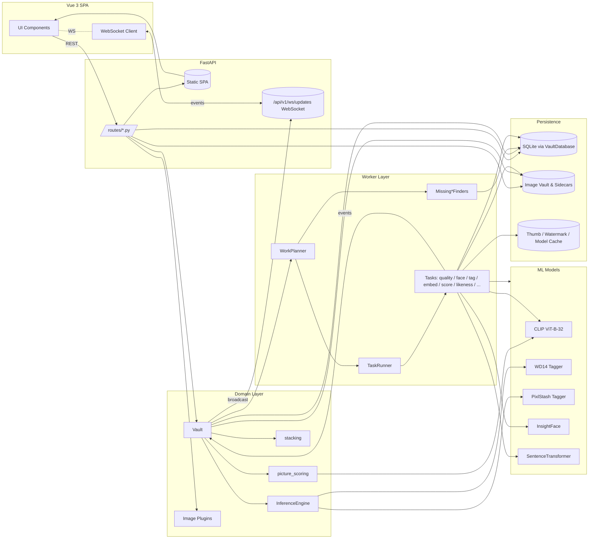
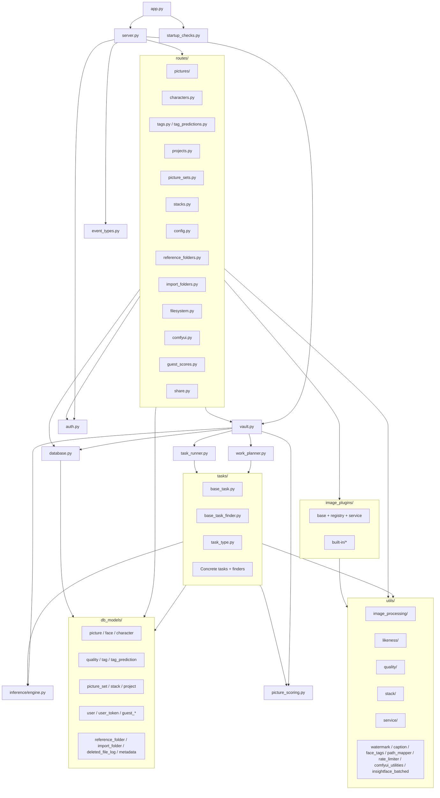
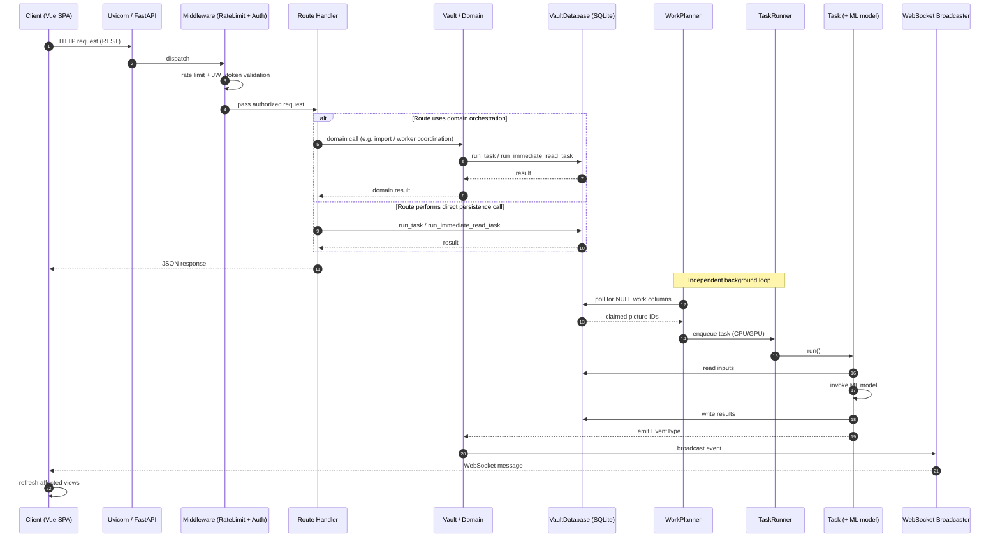

# PixlStash Backend Architecture

> Synthetic reference of the PixlStash backend. This document is the source of truth for both Copilot and human contributors when reasoning about server-side code.
>
> Companion documents: 

* Frontend: [docs/frontend_architecture.md](frontend_architecture.md)
* Integration: [docs/integration_architecture.md](integration_architecture.md)

---

## Table of Contents

1. [Project Tree](#1-project-tree)
2. [Architecture Overview](#2-architecture-overview)
3. [Frameworks, Runtime & Dependencies](#3-frameworks-runtime--dependencies)
4. [Top-Level Modules](#4-top-level-modules)
5. [Routes / HTTP API](#5-routes--http-api)
6. [Database Models](#6-database-models)
7. [Task System](#7-task-system)
8. [Image Plugins](#8-image-plugins)
9. [Tagger Plugins](#9-tagger-plugins)
10. [Services Layer](#10-services-layer)
11. [Utility Modules](#11-utility-modules)
12. [Alembic Migrations](#12-alembic-migrations)
13. [Storage Architecture](#13-storage-architecture)
14. [Server Lifecycle](#14-server-lifecycle)
15. [Frontend Integration](#15-frontend-integration)
16. [Authentication & Authorization](#16-authentication--authorization)
17. [Data Flow Pipeline](#17-data-flow-pipeline)
18. [Snapshots & Restore](#18-snapshots--restore)
19. [Mermaid Diagrams](#19-mermaid-diagrams)
20. [Architectural Patterns](#20-architectural-patterns)
21. [Operation Log](#21-operation-log--undoredo-and-the-audit-trail-dam-12)

---

## 1. Project Tree

```
pixlstash/
├── __init__.py
├── app.py                            # CLI entry point
├── server.py                         # FastAPI app + lifespan
├── database.py                       # VaultDatabase (threaded queue over SQLite)
├── auth.py                           # AuthService, JWT, scoped tokens
├── task_runner.py                    # Threaded CPU/GPU task executor
├── work_planner.py                   # Polls finders, schedules work
├── vault.py                          # Top-level orchestrator
├── picture_scoring.py                # Back-compat shim → re-exports pixlstash.scoring.*
├── stacking.py                       # Picture stacking
├── worker_config.py                  # Concurrency / batch tuning
├── startup_checks.py                 # Disk / VRAM / SSL preflight
├── event_types.py                    # WebSocket EventType enum
├── pixl_logging.py                   # Uvicorn log config
├── image_loading_dataset_prepper.py  # Training dataset prep
├── alembic.ini
│
├── db_models/                        # SQLModel definitions
│   ├── picture.py                    # Picture, SortMechanism, LikenessParameter
│   ├── face.py                       # Face (bbox + 512-d embedding)
│   ├── character.py                  # Character
│   ├── quality.py                    # Quality (sharpness, contrast, …)
│   ├── tag.py                        # User-confirmed tags
│   ├── tag_prediction.py             # Model-predicted tags + confidence
│   ├── tag_health.py                 # Per-tag health board cache
│   ├── tag_suggestion.py             # Suspected label fixes (review queue)
│   ├── tagger_run.py                 # Tagger eval runs pushed from PixlTagger
│   ├── review.py                     # Tag review sessions + item decisions
│   ├── detection.py                  # Florence-2 object detections
│   ├── snapshot.py                   # Vault snapshots (GFS retention)
│   ├── picture_likeness.py           # Pairwise image similarity
│   ├── picture_set.py                # Sets + membership
│   ├── picture_stack.py              # Stacks (duplicates / variants)
│   ├── picture_project.py            # Picture↔Project M-M
│   ├── project.py                    # Projects
│   ├── user.py                       # User + settings
│   ├── user_token.py                 # Scoped API tokens
│   ├── guest_session.py              # Public guest sessions
│   ├── guest_score.py                # Guest ratings
│   ├── reference_folder.py           # Anchor / reference folders
│   ├── import_folder.py              # Watched import folders
│   ├── deleted_file_log.py           # Deletion audit
│   └── metadata.py                   # Vault-level metadata
│
├── routes/                           # FastAPI routers
│   ├── pictures/                     # CRUD, search, thumbnails, export/import
│   ├── characters.py                 # Character management + face assignment
│   ├── tags.py                       # Tags + bulk operations
│   ├── tag_predictions.py            # Confirm / reject predictions
│   ├── projects.py                   # Projects
│   ├── picture_sets.py               # Picture sets + membership
│   ├── stacks.py                     # Stacks
│   ├── dedup.py                      # Duplicate queue, counts, scan, verdicts + sweep dry run
│   ├── config.py                     # User/server config + progress
│   ├── reference_folders.py          # Reference folders
│   ├── import_folders.py             # Watch folders
│   ├── filesystem.py                 # Directory browsing
│   ├── comfyui.py                    # ComfyUI workflow integration
│   ├── guest_scores.py               # Guest scoring
│   └── share.py                      # Public sharing endpoints
│
├── tasks/                            # Background tasks + finders
│   ├── base_task.py                  # BaseTask, TaskStatus, QueueType
│   ├── base_task_finder.py           # BaseTaskFinder + picture claim
│   ├── task_type.py                  # TaskType enum
│   ├── quality_task.py
│   ├── description_task.py
│   ├── text_embedding_task.py
│   ├── image_embedding_task.py
│   ├── face_extraction_task.py
│   ├── likeness_task.py
│   ├── likeness_parameters_task.py
│   ├── tag_task.py
│   ├── smart_score_task.py
│   ├── text_score_task.py
│   ├── comfyui_extraction_task.py
│   ├── watch_folder_import_task.py
│   ├── source_face_likeness_task.py
│   ├── missing_file_purge_task.py
│   ├── reference_folder_scan_task.py
│   └── missing_*_finder.py           # One finder per task type
│
├── image_plugins/                    # Image transformation plugins
│   ├── base.py                       # ImagePlugin ABC
│   ├── registry.py                   # Plugin discovery
│   ├── service.py                    # Batch application
│   └── built-in/
│       ├── brightness_contrast.py
│       ├── blur_sharpen.py
│       ├── colour_filter.py
│       ├── pixelate.py
│       ├── rotate.py
│       ├── scaling.py
│       └── plugin_template.py
│
├── tagger_plugins/                   # TaggerPlugin subclasses + registry (WD14, PixlStash tagger, Florence-2, JoyCaption)
│
├── inference/                        # ML engine + model lifecycle
│   ├── engine.py                     # InferenceEngine (captioning, detection, embeddings)
│   ├── model_lifecycle.py            # Model load/unload management
│   ├── vram_budget.py                # VRAM budgeting
│   └── workflows/                    # tagging, description, text/clip/face embedding
│
├── scoring/                          # Picture scoring (split out of picture_scoring.py)
│   ├── smart_score.py                # Anchor-based smart-score heuristic + anomaly penalty
│   └── character_likeness.py         # Face↔reference likeness scoring
│
├── services/                         # Business-logic extracted from route handlers
│   ├── config_service.py             # Hardware monitoring + import folder utilities
│   ├── dedup_sweep_service.py        # Vault-wide near-duplicate sweep planner (read-only)
│   ├── dedup_tier_service.py         # Tiered detection, tier policy, cover + evidence (§22)
│   ├── dedup_verdict_service.py      # Stack / keep-separate verdicts + metadata union (§22)
│   ├── plugin_service.py             # Image plugin orchestration + progress tracking
│   ├── share_service.py              # Share-token validation + watermark resolution
│   └── tag_prediction_service.py     # Confirm / reject / reset tag predictions
│
├── utils/
│   ├── watermark.py
│   ├── caption_file_utils.py
│   ├── face_tags.py
│   ├── path_mapper.py
│   ├── path_utils.py                    # resolve_path_within (moved out of service/)
│   ├── serialization_utils.py           # safe_model_dict (moved out of service/)
│   ├── system_utils.py                  # default_max_vram_gb (moved out of service/)
│   ├── host_path_utils.py
│   ├── reference_folder_watcher.py
│   ├── reference_folder_validator.py
│   ├── rate_limiter.py
│   ├── comfyui_utilities.py
│   ├── insightface_batched.py
│   ├── image_processing/             # image_utils, face_utils, video_utils
│   ├── likeness/                     # likeness_utils, likeness_parameter_utils
│   ├── quality/                      # quality_utils, smart_score_utils
│   ├── stack/                        # stack_utils
│   └── service/                      # path/export/serialization/caption/config utils
│
├── migrations/
│   ├── env.py
│   ├── script.py.mako
│   └── versions/                     # Migration files for Alembic
│
├── data/
│   ├── anchors/                      # builtin_good.npy, builtin_bad.npy
│   └── comfyui-workflows/built-in/
│
└── frontend/                         # Bundled Vue 3 dist (served at /)
```

---

## 2. Architecture Overview

PixlStash is a **single-process image vault** built on FastAPI. Despite running on an ASGI server, most route handlers are synchronous and offload to background threads; "async" here means cooperative I/O for FastAPI/WebSockets, not an async stack end-to-end. It combines:

- A **REST + WebSocket API** for the Vue 3 frontend
- A **threaded task runner** with separate CPU and GPU queues
- A **SQLite database** wrapped in a threaded work queue (`VaultDatabase`) — a single dedicated writer thread serialises mutations while reads can bypass the queue via `run_immediate_read_task` meant for interactive tasks that needs a quick response
- A **ML pipeline** (CLIP, WD14, InsightFace, PixlStash tagger, SentenceTransformer)
- A **plugin system** for image transformations
- A **file vault** rooted at a configured `image_root` directory

The runtime is organised around five layers:

| Layer | Component | Responsibility |
|-------|-----------|----------------|
| **API** | `server.py`, `routes/*` | HTTP / WebSocket handlers, request validation |
| **Services** | `services/*` | Focused business-logic modules extracted from route handlers when they grew too large; not a formal service tier — `vault.py`, `picture_scoring.py`, and `stacking.py` are the real domain layer |
| **Domain** | `vault.py`, `inference/engine.py`, `picture_scoring.py`, `stacking.py` | Core orchestration: vault lifecycle, ML engine, scoring, stacking |
| **Workers** | `task_runner.py`, `work_planner.py`, `tasks/*` | Async background processing of new pictures |
| **Persistence** | `database.py`, `db_models/*`, `migrations/*` | Schema, queries, transactions |

Background processing is **data-driven**: each task type has a *finder* that queries the DB for rows with `NULL` work columns. The `WorkPlanner` polls finders, the `TaskRunner` executes tasks, and completion events trigger WebSocket broadcasts to update the UI.

---

## 3. Frameworks, Runtime & Dependencies

### Web & Server

| Component | Library | Notes |
|-----------|---------|-------|
| Web framework | **FastAPI** ≥ 0.135 | Async REST + WebSocket, auto OpenAPI |
| ASGI server | **Uvicorn** ≥ 0.41 | Lifespan hooks for startup/shutdown |
| Multipart | **python-multipart** | Image upload |
| Auth | **python-jose**, **passlib[bcrypt]**, **cryptography** | JWT + bcrypt |
| Rate limit | Custom middleware in `utils/rate_limiter.py` | IP-based throttling |

### Persistence

| Component | Library |
|-----------|---------|
| Database | **SQLite** (file-based) |
| ORM | **SQLModel** ≥ 0.0.37 (Pydantic + SQLAlchemy) |
| Migrations | **Alembic** ≥ 1.18 |

### ML Stack

| Capability | Library |
|------------|---------|
| Deep learning | **PyTorch** ≥ 2.10, **torchvision** ≥ 0.25 |
| Image-text embeddings | **open_clip_torch** ≥ 3.3 (CLIP ViT-B-32) |
| Model loading | **transformers** ≥ 5.3, **accelerate** ≥ 1.13 |
| Inference runtime | **onnxruntime** ≥ 1.24 |
| Face detection | **insightface** ≥ 0.7.3 |
| Text embeddings | **sentence_transformers** ≥ 5.2 |
| NLP | **spacy** ≥ 3.8 |
| Tensor utils | **einops** ≥ 0.8 |

### Image & Video

| Capability | Library |
|------------|---------|
| Image I/O | **Pillow** ≥ 12.1, **pillow-heif** |
| Computer vision | **opencv-python** ≥ 4.13 |
| EXIF | **piexif** |

### Math & System

| Capability | Library |
|------------|---------|
| Numerical | **NumPy** ≥ 2.4, **SciPy** ≥ 1.17 |
| Fuzzy matching | **rapidfuzz** ≥ 3.14 |
| File watching | **watchdog** ≥ 4.0 |
| HTTP client | **httpx** ≥ 0.28, **requests** |
| GPU monitor | **nvidia-ml-py** |
| Config dirs | **platformdirs** |
| Logging | **colorlog** |

**Python**: 3.10+

---

## 4. Top-Level Modules

| File | Responsibility |
|------|----------------|
| [pixlstash/app.py](../pixlstash/app.py) | CLI entry point (`pixlstash-server`). Parses arguments, runs startup checks, instantiates `Server`. |
| [pixlstash/server.py](../pixlstash/server.py) | Builds the FastAPI app, mounts routers, attaches WebSocket, registers lifespan (thumbnail pre-gen, cleanup, graceful shutdown). |
| [pixlstash/vault.py](../pixlstash/vault.py) | Top-level orchestrator. Owns `VaultDatabase`, `TaskRunner`, and `WorkPlanner`; lazily creates `InferenceEngine` on demand. Bridges domain events to the WebSocket broadcaster. |
| [pixlstash/database.py](../pixlstash/database.py) | `VaultDatabase`: queues DB work on a single writer thread; serialises writes via mutex, allows parallel reads. Exposes `run_task` / `run_immediate_read_task`. |
| [pixlstash/auth.py](../pixlstash/auth.py) | `AuthService`: password + JWT + scoped tokens. Enforces resource-level permissions (picture / set / character / project). |
| [pixlstash/task_runner.py](../pixlstash/task_runner.py) | Threaded executor with separate CPU and GPU pools. Monitors VRAM, gates GPU-heavy tasks, drains queues at shutdown. |
| [pixlstash/work_planner.py](../pixlstash/work_planner.py) | Registers all `BaseTaskFinder`s, polls them in round-robin, enforces inflight limits and adaptive backoff. |
| [pixlstash/picture_scoring.py](../pixlstash/picture_scoring.py) | Smart-score computation (anchor-based heuristic combining image embedding, CLIP anchors, a CLIP-IQA objective quality probe, and a calibrated anomaly penalty — per-tag severity × confidence × precision, where confidence is graded *relative to that tag's acceptance threshold* (normalised onto `[threshold, 1]` before the `CONF_POWER` exponent, so a barely-accepted detection costs `EVIDENCE_FLOOR` of full severity for every tag regardless of where its gate sits, and full confidence is unchanged), noisy-OR over merge-alias duplicates only, then rank-decayed accumulation across distinct defects so defect *count* escalates the penalty; the raw score is soft-compressed rather than hard-clipped at the bottom so heavily penalised pictures stay ordered instead of tying at 1.0. Per-tag severity comes from the **user's** `User.smart_score_penalised_tags` (resolved per scoring session by `resolve_penalised_tag_weights`; `DEFAULT_SMART_SCORE_PENALIZED_TAGS` is only the seed/fallback, and a tag absent from the user's table is not penalised at all), and a **model** prediction is charged only when the defect is genuinely visible in the picture's tag list: it must clear the tagger's per-label acceptance threshold **and** have a matching `Tag` row. The threshold alone used to stand in for both, but `TagPredictionBackfillTask` writes predictions against a picture's *existing* tag set and deliberately never writes a `Tag` row, and a stale-model prediction re-graded against a newer meta.json's lower threshold can clear a gate it never cleared when it was written; either way the picture was penalised for a defect that appears nowhere in the UI. Human POS/NEG decisions are honoured regardless of confidence *and* of tag membership: a human POS counts with no `Tag` row, a human NEG suppresses while the tag is still applied. The applied-tag check is applied unconditionally rather than inside the threshold branch, which is what puts tag membership into `anomaly_state_signature` (it reads with `apply_thresholds=None`) and so makes adding or removing an anomaly tag invalidate the cached score. See [`utils/quality/anomaly_penalty.py`](../pixlstash/utils/quality/anomaly_penalty.py), [`utils/service/anomaly_thresholds.py`](../pixlstash/utils/service/anomaly_thresholds.py) and [`docs/reviews/2026-06-smart-score-calibrated-anomaly-plan.md`](reviews/2026-06-smart-score-calibrated-anomaly-plan.md)) and character likeness scoring (face↔reference similarity via InsightFace embeddings). These two distinct features have been split into `scoring/smart_score.py` and `scoring/character_likeness.py`; `picture_scoring.py` remains as a thin back-compat re-export shim. |
| [pixlstash/worker_config.py](../pixlstash/worker_config.py) | Global constants — `NUM_WORKERS`, per-task `*_MAX_INFLIGHT`, batch sizes. |
| [pixlstash/startup_checks.py](../pixlstash/startup_checks.py) | Preflight: disk space, VRAM, CUDA, SSL. May force CPU mode. |
| [pixlstash/event_types.py](../pixlstash/event_types.py) | `EventType` enum used by WebSocket event bus. |
| [pixlstash/pixl_logging.py](../pixlstash/pixl_logging.py) | Uvicorn log config + coloured formatter. |
| [pixlstash/stacking.py](../pixlstash/stacking.py) | Picture stacking (duplicates / variants). |
| [pixlstash/image_loading_dataset_prepper.py](../pixlstash/image_loading_dataset_prepper.py) | Dataset preparation utilities for offline training scripts. |

---

## 5. Routes / HTTP API

All routers are mounted under `/api/v1/` unless stated otherwise. Routers live in [pixlstash/routes/](../pixlstash/routes/).

### `pictures/` package

Key endpoints (see the auto-generated index below for the full set):

| Method | Path | Purpose |
|--------|------|---------|
| GET | `/pictures` | Filtered/paginated picture listing |
| GET | `/pictures/search` | Keyword + semantic search |
| GET | `/pictures/stats` | Aggregate stats (see the `score_agreement` note below) |
| POST | `/pictures/import` | Upload images → create Pictures (one-shot) |
| GET | `/pictures/import/status?task_id=…` | Import progress |
| POST | `/pictures/import/staging` | Open an async streaming-import session (#459) |
| POST | `/pictures/import/staging/{staging_id}/files` | Stream files into a staging session (unsafe window) |
| POST | `/pictures/import/staging/{staging_id}/commit` | Safe handoff → background `PictureImportTask` |
| DELETE | `/pictures/import/staging/{staging_id}` | Cancel an uncommitted staging session |
| GET | `/pictures/import/staging/{staging_id}/status` | Staging + background-import progress |
| GET | `/pictures/export` | Start async ZIP export |
| GET | `/pictures/export/status?task_id=…` | Export progress |
| GET | `/pictures/export/download/{task_id}` | Download finished ZIP |
| GET | `/pictures/thumbnails/{id}.webp` | Cached thumbnail |
| POST | `/pictures/thumbnails` | Batch thumbnails |
| GET | `/pictures/{id}.{ext}` | Serve original (optionally watermarked) |
| POST | `/pictures/{id}/plugin/{name}` | Run image plugin |
| PATCH | `/pictures/project` | Bulk assign to project |
| POST | `/pictures/scores` | Bulk apply user ratings |
| POST | `/pictures/{id}/face` | Create face record |
| DELETE | `/pictures/{id}/face/{index}` | Delete face |
| POST | `/pictures/detect` | Queue object detection (Segment) for a batch; optional `prompt` for open-vocab grounding |
| GET | `/pictures/{id}/detections` | Stored detection boxes for a picture (registered before the `/{id}/{field}` catch-all) |
| POST | `/pictures/likeness-search` | Reverse-image likeness search |
| POST | `/pictures/face-search` | Face-likeness search (see below) |
| POST | `/pictures/scrapheap/delete-preview` | What a delete-forever would destroy + the `confirm_token` the delete requires |
| DELETE | `/pictures/scrapheap` | **The one irreversible endpoint.** Requires `confirm_token` |

**Delete-forever needs a server-side confirmation (`confirm_token`).** The type-to-confirm dialog is a *client* control and proves nothing to the server: `DELETE /pictures/scrapheap` with an empty body used to destroy the entire scrapheap and its files with no server-side intent check at all. There is no CSRF token anywhere, and CORS admits **any** `localhost`/LAN-IP *port* with credentials (§6 of `integration_architecture.md`), so a page served on another local port could drive the owner's own session straight into it.

`POST /pictures/scrapheap/delete-preview` now mints a `confirm_token` alongside the counts, and `DELETE /pictures/scrapheap` refuses without a matching one — **400** when it is missing, **409** when it is unknown, already spent, older than `CONFIRM_TOKEN_TTL_SECONDS` (5 min), or was minted for a different selection. Nothing is destroyed on a refusal. The token is a `secrets.token_urlsafe(32)` value held in `ScrapheapDeleteConfirmations` (`services/scrapheap_service.py`, one instance per server, thread-safe, in-memory by design — losing them on restart is correct), bound to the *selection fingerprint* (`"ALL"` or the sorted ids) and **not** to `include_protected`, because one preview drives both dialog buttons and already reports exactly what each destroys.

Echoing the preview's `total_count` was considered and rejected as the primary control: a small integer is stable and enumerable, and ordinary concurrent scrapheaping would make it fail spuriously. A required custom header was rejected too — a DELETE with a JSON body already preflights, and `allow_headers=["*"]` lets the preflight pass for every origin the regex admits.

**This is an intent control, not an authorization control.** Authorization for both routes stays with the AuthzGate (`OWNER_ONLY` in `authz/registry.py`, §16.1); no per-handler scope check was added and none should be. The unattended retention sweep calls `purge_scrapheap_pictures` directly and needs no confirmation — the gate is on the HTTP endpoint, which is where the CSRF exposure is.

**`POST /pictures/face-search` — one query, four sources.** The query embeddings come from uploaded files, `source_picture_id`, `source_face_id`, or `source_character_id` (exactly one; more than one is a 400). `source_character_id` resolves through `select_reference_faces_for_character` — **the same selection the character-likeness sort and the picture-id branch of `POST /characters/{id}/faces` use**. Deriving it by any other rule would let the search rank pictures against one set of references while the assignment it feeds picks the winning face against another. It defaults `combine` to `max` (a character's ~10 references are the same person years and angles apart, so their mean is nobody and a good match to one reference must not be averaged away); every other source still defaults to `mean`.

`exclude_character_id` drops pictures that already contain a face assigned to that character. Paired with `source_character_id` it is what makes the result set the *un-assigned* candidates, so a caller can put its length on a button without over-promising — the assignment endpoint would skip those rows anyway and report them as `already_assigned_ids`. It is subtracted from the fetched candidates rather than intersected into `filter_candidate_ids`, because `None` there means "unrestricted" and has no set to subtract from.

**`include_reference_scores` adds `reference_likeness`** to every match: the winning face's similarity to each query embedding, in query order, from which `likeness` is the `combine`. It exists because the combine is lossy in the one direction the UI needs: with `combine=max` a candidate that resembles one reference perfectly outranks one that resembles all of them well, and `likeness` cannot tell those apart. Keeping the un-combined row is what lets a caller ask *how many* references a match satisfies, and it costs no extra work: `_score_best_faces` already has the whole `(F, Q)` similarity matrix and simply carries the winning row out with the score. Off by default (it is Q floats per row over up to 500 rows), rounded to 4 decimals, and consumed by the frontend's reference-agreement slider, which cuts client-side precisely so the knob costs no round trip.

Each match reports the **`face_id` that produced its score**, so a caller assigning the results does not repeat the comparison. Scoring combines across queries **per face** and only then takes the max over a picture's faces: the reverse order lets different faces satisfy different queries, which makes `combine=min` mean something other than its documented "must match all query images", and leaves no single face to name as the winner. For a single query embedding the two orders are identical. The comparison is one matmul over every candidate face rather than a per-picture Python loop, and **faces whose embedding width differs from the query's are skipped with a warning** — a vault that has been through a `FaceModelRefreshTask` holds two widths, and a cosine between them is not a similarity.

Authorization is unchanged: the route is already declared `SCOPED_LIST` in `authz/registry.py` and scope-filters its ids through `fetch_scope_allowed_picture_ids`, which still holds for the character source (`tests/test_likeness_and_face_search.py::test_face_search_by_character_still_scope_filters_for_a_share_token` asserts both directions). Note the route is in `READ_SAFE_POST_PATHS`, so share tokens do reach it.

**`score_agreement` (stats section, `include=picture`).** Cross-tabulates the user's star rating against the smart score for the stats sidebar's agreement heatmap. Shape: `{cells: [{score, bucket, count}] (dense, all 20), rated, pairs, total, pearson, spearman, tau_b}`.

- **Unrated means both `NULL` and `0`**, matching `score_distribution` (which labels NULL "Unscored" and omits 0) and the smart-score anchor query's `score > 0`. `rated` counts every rated picture; `pairs` counts the plottable subset that also has a smart score, so a rating awaiting its first smart-score computation is still reported as rated rather than silently dropped from the coverage line.
- **One query serves both the cells and the coefficient.** It groups by `(score, smart_score * 100 cast to int)`, so `tau_b` keeps essentially all of the continuous variable's resolution while the four display buckets are summed from the same rows. The number and the grid can therefore never disagree.
- **Three coefficients, all from the same rows.** `pearson` (straight-line, assumes evenly spaced stars), `spearman` (rank, mid-ranked so the five-level rating axis shares ties rather than inventing an order) and `tau_b` (the strictest tie correction, since nearly every pair ties on the rating axis). The sidebar shows Pearson and Spearman; tau-b stays in the payload. All three are `null` below `AGREEMENT_MIN_PAIRS` (20) and whenever one variable is constant, because a vanishing denominator means "no variance", not "no relationship", and must never be reported as 0.
- **`_agreement_scope` deliberately drops `min_score` / `max_score` / `smart_score_bucket`** while honouring every other filter and scope. A cell click sets exactly those three, so a self-filtering matrix would collapse to the clicked cell and strand the user with no way to reach a neighbour. The rebuild is skipped entirely when none of the three is active. This self-exclusion is what `tests/test_score_agreement_stats.py` guards hardest.

### `characters.py`
List, create, update, delete characters; fetch reference picture set; list pictures per character. Face assign / unassign lives in the adjacent [`characters_faces.py`](../pixlstash/routes/characters_faces.py) module (same `create_router(server)` factory, mounted next to the characters router), keeping this module focused on character CRUD and search.

**Project-membership reconciliation:** when a character's (or picture set's) `project_id` changes, the handler reconciles its pictures' `PictureProjectMember` rows: each picture is added to the new project and removed from the old one. Removal is *reference-aware* — a picture stays in the old project if another character or picture set still assigned to that project anchors it there (see `picture_referenced_by_project` in [`routes/_helpers.py`](../pixlstash/routes/_helpers.py)). When the entity leaves all projects, each picture's scalar `Picture.project_id` pointer falls back to any remaining membership. This logic is a single shared implementation, `reconcile_entity_project_change` in [`services/project_membership_service.py`](../pixlstash/services/project_membership_service.py); both `patch_character` and `picture_sets.py::update_picture_set` call it. Each caller keeps only what genuinely differs by entity kind: how member pictures are derived (characters resolve faces and expand to stacks; sets read their explicit members), when to reconcile (characters on project change only; sets also on an idempotent same-project re-assign that repairs drift), and how the "did anything change" signal is interpreted.

### `tags.py` / `tag_predictions.py`
Add/remove user tags; bulk clear; confirm or reject model-predicted tags (`TagPrediction` → `Tag`).

### `projects.py`, `picture_sets.py`, `stacks.py`
Standard CRUD; set/stack membership management; stack reordering.

### `dedup.py`
The vault-wide near-duplicate sweep, **dry run only** (v1.9 Lane E). `GET /dedup/sweep/policy` returns the server's default confidence policy plus the bounds and closed vocabularies a client should build its controls from; `POST /dedup/sweep/dry-run` resolves every near-duplicate group in the vault under a supplied policy and returns the plan behind "N groups auto-collapse, M need review". Both are `owner_only` (a vault-wide aggregate cannot be narrowed to a share token's scope without leaking out-of-scope counts — the same reasoning as `tag_health`), and neither writes anything. All logic lives in [services/dedup_sweep_service.py](../pixlstash/services/dedup_sweep_service.py); the handlers only translate the request body into a `SweepPolicy` and serialise the `SweepReport`. Execution (applying a plan) and the auto-at-import policy are later work; the dry-run planner already accepts an optional `operation_batch_id` so a future apply step can correlate a plan with the operation-log batch that undoes it.

The same module also serves the **v1.9 tiered Duplicates queue** — `GET /dedup/policy`, `GET /dedup/groups`, `POST /dedup/counts`, `POST /dedup/scan`, `POST /dedup/verdicts/{stack,keep-separate,reopen}` and `POST /dedup/auto-stack`. Every one of them is `owner_only` for the same reasoning plus, for the verdict routes, the fact that they mutate stacks across arbitrary pictures. Detection lives in [services/dedup_tier_service.py](../pixlstash/services/dedup_tier_service.py) and verdicts in [services/dedup_verdict_service.py](../pixlstash/services/dedup_verdict_service.py); the handlers only build a `TierPolicy` / `DedupScope` (a bad one is a 400, never a silent retune) and call a service wrapper. See §22 for the tiers, the hash decision, the bucket design, the cover formula and the verdict memory, and `docs/integration_architecture.md` §19 for the request/response contract.

### `config.py`
| Method | Path | Purpose |
|--------|------|---------|
| GET | `/config` | User settings |
| PATCH | `/config` | Update settings |
| POST | `/config/login` | Login (also `/login` at root) |
| GET | `/config/logout` | Logout |
| GET | `/config/progress` | Worker progress snapshot |
| GET | `/config/sort-mechanisms` | Available sort modes |
| GET | `/server-config/scrapheap-retention` | Scrapheap auto-purge window (`scrapheap_retention_days`, `scrapheap_retention_reduced_at`, `scrapheap_retention_choices`, `scrapheap_retention_grace_days`). `null` days = Never, and that is the **shipped default** |
| PATCH | `/server-config/scrapheap-retention` | Set the window (30/60/90/120 or `null` = Never). The ONLY writer of `scrapheap_retention_days`, which is why an absent key reliably means "never chosen". Persists to `server-config.json`; stamps `scrapheap_retention_reduced_at` only on a *reduction* (turning auto-purge on counts as one). Purges nothing synchronously. |
| GET | `/server-config/scrapheap-retention/impact` | Preview a retention reduction: `would_purge_count` (excludes protected + locked; evaluated at the grace floor so it never understates) + `first_purge_at`. Pure read — applies nothing, stamps nothing, purges nothing. `0` when `days` is not lower than the current window |

### `reference_folders.py`, `import_folders.py`, `filesystem.py`
CRUD for reference / import folders; filesystem browsing for picker dialogs.

### `comfyui.py`
List workflows; execute a workflow against a picture; replay the workflow a picture carries.

**Two chunks, one of them executable.** A ComfyUI-generated PNG embeds *both* a `workflow` chunk (the UI node graph, for reopening in the editor) and a `prompt` chunk (the resolved API-format graph the server actually executed). Only the `prompt` chunk is submittable to `POST /prompt`.

- `find_comfy_workflow` (`utils/comfyui_utilities.py`) reads the **UI** chunk and drives display only (`GET /comfyui/pictures/{id}/workflow`, the overlay's workflow inspector, the `ComfyUIExtractionTask` backfill). As a lowest-priority display fallback it also accepts the `prompt` chunk (issue #628): PixlStash-generated PNGs deliberately embed **nothing** in the `workflow` chunk — `_submit_comfyui_prompt` must not put the API graph there, because the ComfyUI frontend feeds that chunk to `loadGraphData` unguarded on drag-in — so ComfyUI's own `prompt` chunk is the only displayable graph such files carry. A genuine UI `workflow` chunk always wins over the fallback, and `is_comfy_workflow` filters out plain-text `prompt` values from other tools.
- `find_comfy_api_prompt` reads the **`prompt`** chunk and is the only source for anything that runs. It has **no fallback to the UI graph and performs no UI→API conversion**: converting means re-resolving widget values, links, muted/bypassed nodes and subgraph expansion exactly as the ComfyUI frontend does, and a near-miss yields a graph that runs and silently generates something else. Absent an executable `prompt` chunk the honest answer is "no executable workflow embedded".

**Remix routes (v1.9).** `GET /comfyui/pictures/{picture_id}/recipe` reports whether a picture carries a replayable recipe and pre-flights it against the user's ComfyUI (see `services/comfyui_recipe_service.py`, §10). `POST /comfyui/run_recipe` replays it with fresh or pinned seeds into the source's stack; it **re-extracts the graph from the file server-side on every call and never accepts a client-supplied graph**, so the authz gate's `PICTURE_SCOPED` declaration on the source picture is the complete access control for it. Both refuse honestly rather than silently no-op: a graph with no seed input would re-generate a byte-identical image that the importer dedupes on `pixel_sha` and emits no event for, so the user would see literally nothing happen.

**The replayed graph is untrusted input (review finding R3, CWE-829).** It is authored by whoever made the image file, not by the owner, and PixlStash's premise is importing images from elsewhere: an attractive PNG from a model site can carry any API-format graph, and replaying it executes it on the owner's ComfyUI, bounded only by which node packs are installed. `sanitize_prompt_graph` is a **shape** filter (it drops non-node entries), not a capability filter, and there is deliberately no node-class allowlist — one would break every legitimate custom pack. The owner is therefore the trust anchor, and three controls make that a decision rather than an accident:

1. **Disclosure.** The recipe response carries `node_classes` — the distinct `class_type` list, from `collect_node_classes` — so the confirm dialog can name what will run. It is read from the file, so it is populated **even when the pre-flight could not run**, which is exactly the case where the owner has nothing else to judge by. A node *count* is not an answer to "what will this run".
2. **Fail closed on an uninspected graph.** `preflight_prompt` degrading to `unchecked_preflight` keeps `ok: True` because the only fact known is that the check did not run — so `run_recipe` refuses `preflight.checked is False` with a 400 unless the request carries `allow_unchecked: true`, the owner's explicit acknowledgement, which is logged with the node classes. **The refusal is enforced here, not only in the dialog**; a UI-only gate is not a gate. This is the one control that is a hard gate, and it is deliberately reserved for the rare case: gating the common ones is what turns an acknowledgement into a reflex.
3. **Provenance.** `_picture_source_origin` reports `source_is_imported` / `source_label` so the dialog can warn that the embedded workflow came from outside. There is no provenance column; the signal is the three fields only ever written on an *inbound* path (`reference_folder_id`, `import_source_folder`, `original_file_name`), all of which PixlStash's own ComfyUI import leaves NULL. The label names the route in ("Watched folder"), never the filesystem path. It is advisory only and fails toward "not imported" — it informs, it does not gate.

**Seed ranges differ by route.** `run_t2i` / `run_i2i` validate a fixed seed to 32 bits; `run_recipe` allows the full 64-bit range ComfyUI's core samplers declare, because the shipped `Flux2-Klein-Image-Edit` template's own `noise_seed` is `432262096973502` and a 32-bit check would reject reproducing our own built-in's default.

### `guest_scores.py`, `share.py`
Public guest scoring and shared-link endpoints.

### App-level routes (`server.py`)
| Method | Path | Purpose |
|--------|------|---------|
| GET | `/` | Vue SPA index |
| GET | `/version` | Server version |
| GET | `/favicon.ico` | SPA favicon |
| POST | `/api/v1/login` | Login |
| GET | `/api/v1/login` | Registration status check |
| POST | `/api/v1/logout` | Logout |
| GET | `/api/v1/check-session` | Session / scope discovery |
| GET | `/api/v1/network/info` | LAN address info |
| GET | `/api/v1/protected` | Auth probe |
| WS  | `/api/v1/ws/updates` | Real-time event stream (broadcast) |
| WS  | `/api/v1/ws/comfyui` | ComfyUI progress passthrough (in `routes/comfyui.py`) |
| GET | `/share/{token_slug}` | Public token-embedded picture serving |
| GET | `/{full_path:path}` | SPA fallback (serves `index.html`) |

### Complete route index

> Auto-generated from `server.api.openapi()`. Regenerate with `python scripts/render_backend_architecture.py`.

<!-- AUTOGEN:start name="routes" -->
| Method | Path                                                                          | Tags            | Summary                                                    |
| ------ | ----------------------------------------------------------------------------- | --------------- | ---------------------------------------------------------- |
| GET    | /api/v1/characters                                                            | characters      | List characters                                            |
| POST   | /api/v1/characters                                                            | characters      | Create character                                           |
| POST   | /api/v1/characters/likeness-search                                            | characters      | Search characters by face likeness                         |
| POST   | /api/v1/characters/membership                                                 | characters      | Batch character membership lookup                          |
| POST   | /api/v1/characters/{character_id}/faces                                       | characters      | Assign faces to character                                  |
| DELETE | /api/v1/characters/{character_id}/faces                                       | characters      | Unassign faces from character                              |
| PATCH  | /api/v1/characters/{id}                                                       | characters      | Update character                                           |
| DELETE | /api/v1/characters/{id}                                                       | characters      | Delete character                                           |
| GET    | /api/v1/characters/{id}                                                       | characters      | Get character by id                                        |
| GET    | /api/v1/characters/{id}/reference_pictures                                    | characters      | List reference pictures                                    |
| GET    | /api/v1/characters/{id}/summary                                               | characters      | Get character category summary                             |
| GET    | /api/v1/characters/{id}/{field}                                               | characters      | Get character field                                        |
| GET    | /api/v1/check-session                                                         | auth            | Check Session                                              |
| POST   | /api/v1/dedup/auto-stack                                                      | dedup           | Bulk auto-stack the exact tier                             |
| POST   | /api/v1/dedup/counts                                                          | dedup           | Live duplicate counts, global and scoped                   |
| GET    | /api/v1/dedup/groups                                                          | dedup           | One page of the duplicate queue                            |
| GET    | /api/v1/dedup/policy                                                          | dedup           | Duplicate detection tier defaults                          |
| POST   | /api/v1/dedup/scan                                                            | dedup           | Queue a duplicate scan                                     |
| POST   | /api/v1/dedup/sweep/dry-run                                                   | dedup           | Plan a vault-wide near-duplicate sweep                     |
| GET    | /api/v1/dedup/sweep/policy                                                    | dedup           | Near-duplicate sweep policy defaults                       |
| POST   | /api/v1/dedup/verdicts/keep-separate                                          | dedup           | Record that a group is not duplicates                      |
| POST   | /api/v1/dedup/verdicts/reopen                                                 | dedup           | Return a decided group to the queue                        |
| POST   | /api/v1/dedup/verdicts/stack                                                  | dedup           | Stack a duplicate group                                    |
| GET    | /api/v1/login                                                                 | auth            | Check Registration                                         |
| POST   | /api/v1/login                                                                 | auth            | Login                                                      |
| POST   | /api/v1/logout                                                                | auth            | Logout                                                     |
| GET    | /api/v1/operations                                                            | operations      | List recorded operations (newest first)                    |
| POST   | /api/v1/operations/batches/{batch_id}/undo                                    | operations      | Undo one whole bulk action by its batch id                 |
| POST   | /api/v1/operations/redo                                                       | operations      | Re-apply the most recently undone operation                |
| POST   | /api/v1/operations/undo                                                       | operations      | Undo the newest reversible operation                       |
| GET    | /api/v1/operations/undo-state                                                 | operations      | What undo and redo would do next                           |
| GET    | /api/v1/operations/{operation_id}                                             | operations      | Get one operation including its before/after state         |
| POST   | /api/v1/operations/{operation_id}/undo                                        | operations      | Undo one specific operation (and its batch)                |
| GET    | /api/v1/picture_sets                                                          | picture_sets    | List picture sets                                          |
| POST   | /api/v1/picture_sets                                                          | picture_sets    | Create picture set                                         |
| GET    | /api/v1/picture_sets/locked-members                                           | picture_sets    | List locked sets and their frozen pictures                 |
| POST   | /api/v1/picture_sets/membership                                               | picture_sets    | Batch set membership lookup                                |
| GET    | /api/v1/picture_sets/{id}                                                     | picture_sets    | Get picture set                                            |
| PATCH  | /api/v1/picture_sets/{id}                                                     | picture_sets    | Update picture set                                         |
| DELETE | /api/v1/picture_sets/{id}                                                     | picture_sets    | Delete picture set                                         |
| GET    | /api/v1/picture_sets/{id}/members                                             | picture_sets    | List picture set members                                   |
| POST   | /api/v1/picture_sets/{id}/members                                             | picture_sets    | Bulk add pictures to set                                   |
| PUT    | /api/v1/picture_sets/{id}/members                                             | picture_sets    | Bulk replace picture set members                           |
| POST   | /api/v1/picture_sets/{id}/members/{picture_id}                                | picture_sets    | Add picture to set                                         |
| DELETE | /api/v1/picture_sets/{id}/members/{picture_id}                                | picture_sets    | Remove picture from set                                    |
| GET    | /api/v1/picture_sets/{id}/thumbnail                                           | picture_sets    | Get picture set thumbnail                                  |
| DELETE | /api/v1/pictures                                                              | pictures        | Bulk move pictures to scrapheap                            |
| GET    | /api/v1/pictures                                                              | pictures        | List pictures                                              |
| POST   | /api/v1/pictures/apply-scores                                                 | pictures        | Batch apply manual scores                                  |
| POST   | /api/v1/pictures/character_likeness/batch                                     | pictures        | Batch picture character likeness                           |
| GET    | /api/v1/pictures/count                                                        | pictures        | Total picture count for a listing filter                   |
| POST   | /api/v1/pictures/detect                                                       | pictures        | Detect objects in pictures                                 |
| GET    | /api/v1/pictures/export                                                       | pictures        | Start picture export job                                   |
| GET    | /api/v1/pictures/export/download/{task_id}                                    | pictures        | Download completed export                                  |
| GET    | /api/v1/pictures/export/status                                                | pictures        | Get export job status                                      |
| POST   | /api/v1/pictures/face-search                                                  | pictures        | Search by face likeness                                    |
| POST   | /api/v1/pictures/import                                                       | pictures        | Import media files                                         |
| POST   | /api/v1/pictures/import/staging                                               | pictures        | Open an async import staging session                       |
| DELETE | /api/v1/pictures/import/staging/{staging_id}                                  | pictures        | Cancel a staging session                                   |
| POST   | /api/v1/pictures/import/staging/{staging_id}/commit                           | pictures        | Hand off a staging session to the background import        |
| POST   | /api/v1/pictures/import/staging/{staging_id}/files                            | pictures        | Stream files into a staging session                        |
| GET    | /api/v1/pictures/import/staging/{staging_id}/status                           | pictures        | Get async import staging status                            |
| GET    | /api/v1/pictures/import/status                                                | pictures        | Get import job status                                      |
| POST   | /api/v1/pictures/impossible-tags/clear                                        | tags            | Bulk-clear impossible tags                                 |
| POST   | /api/v1/pictures/impossible-tags/restore                                      | tags            | Undo a bulk impossible-tags clear                          |
| POST   | /api/v1/pictures/likeness-search                                              | pictures        | Search by image likeness                                   |
| PATCH  | /api/v1/pictures/project                                                      | pictures        | Set project for pictures                                   |
| POST   | /api/v1/pictures/score_character_likeness                                     | pictures        | Score uploaded images by character likeness                |
| DELETE | /api/v1/pictures/scrapheap                                                    | pictures        | Permanently delete scrapheap pictures                      |
| POST   | /api/v1/pictures/scrapheap/delete-preview                                     | pictures        | Preview a scrapheap delete-forever                         |
| POST   | /api/v1/pictures/scrapheap/restore                                            | pictures        | Restore deleted pictures                                   |
| GET    | /api/v1/pictures/search                                                       | pictures        | Search pictures by text                                    |
| GET    | /api/v1/pictures/stream                                                       | pictures        | Stream pictures in batches                                 |
| POST   | /api/v1/pictures/tags/bulk_fetch                                              | tags            | Fetch tags for multiple pictures                           |
| POST   | /api/v1/pictures/thumbnails                                                   | pictures        | Get batch thumbnail metadata                               |
| GET    | /api/v1/pictures/thumbnails/{id}.webp                                         | pictures        | Get picture thumbnail image                                |
| PATCH  | /api/v1/pictures/{id}                                                         | pictures        | Patch picture fields                                       |
| DELETE | /api/v1/pictures/{id}                                                         | pictures        | Move picture to scrapheap                                  |
| GET    | /api/v1/pictures/{id}.{ext}                                                   | pictures        | Get original picture file                                  |
| GET    | /api/v1/pictures/{id}/anomaly_region                                          | pictures        | Locate an anomaly region                                   |
| GET    | /api/v1/pictures/{id}/detections                                              | pictures        | Get picture detections                                     |
| GET    | /api/v1/pictures/{id}/metadata                                                | pictures        | Get picture metadata                                       |
| POST   | /api/v1/pictures/{id}/tags                                                    | tags            | Add tag to picture                                         |
| GET    | /api/v1/pictures/{id}/tags                                                    | tags            | List picture tags                                          |
| DELETE | /api/v1/pictures/{id}/tags                                                    | tags            | Clear all tags on picture                                  |
| POST   | /api/v1/pictures/{id}/tags/remove_all                                         | tags            | Remove tag everywhere on picture                           |
| DELETE | /api/v1/pictures/{id}/tags/{tag_id}                                           | tags            | Remove picture tag                                         |
| GET    | /api/v1/pictures/{picture_id}/stack                                           | stacks          | Get picture's stack                                        |
| GET    | /api/v1/projects                                                              | projects        | List all projects                                          |
| POST   | /api/v1/projects                                                              | projects        | Create a project                                           |
| POST   | /api/v1/projects/membership                                                   | projects        | Batch project membership lookup                            |
| GET    | /api/v1/projects/{id_or_name}                                                 | projects        | Get a project by ID or name                                |
| GET    | /api/v1/projects/{id_or_name}/picture_sets                                    | projects        | List picture sets for a project                            |
| PUT    | /api/v1/projects/{project_id}                                                 | projects        | Update a project                                           |
| DELETE | /api/v1/projects/{project_id}                                                 | projects        | Delete a project                                           |
| GET    | /api/v1/projects/{project_id}/attachments                                     | projects        | List attachments for a project                             |
| POST   | /api/v1/projects/{project_id}/attachments                                     | projects        | Upload an attachment to a project                          |
| POST   | /api/v1/projects/{project_id}/attachments/url                                 | projects        | Add a URL bookmark to a project                            |
| GET    | /api/v1/projects/{project_id}/attachments/{attachment_id}                     | projects        | Download a project attachment                              |
| DELETE | /api/v1/projects/{project_id}/attachments/{attachment_id}                     | projects        | Delete a project attachment                                |
| GET    | /api/v1/projects/{project_id}/export                                          | projects        | Export project as ZIP                                      |
| GET    | /api/v1/projects/{project_id}/summary                                         | projects        | Get project picture count                                  |
| GET    | /api/v1/projects/{project_name}/characters/{character_name}                   | characters      | Get character by project name and character name           |
| GET    | /api/v1/projects/{project_name}/picture_sets/{picture_set_name}               | picture_sets    | Get picture set by project name and set name               |
| POST   | /api/v1/reviews                                                               | reviews         | Create a review session for one tag                        |
| GET    | /api/v1/reviews                                                               | reviews         | List review sessions                                       |
| DELETE | /api/v1/reviews                                                               | reviews         | Bulk-delete review sessions by status (clear all archived) |
| GET    | /api/v1/reviews/preview                                                       | reviews         | Preview a review's coverage before creating it             |
| GET    | /api/v1/reviews/{review_id}                                                   | reviews         | Get one review's detail                                    |
| DELETE | /api/v1/reviews/{review_id}                                                   | reviews         | Delete one review session                                  |
| POST   | /api/v1/reviews/{review_id}/abort                                             | reviews         | Abort a review (discard the session)                       |
| POST   | /api/v1/reviews/{review_id}/archive                                           | reviews         | Archive a review (completed)                               |
| POST   | /api/v1/reviews/{review_id}/refresh                                           | reviews         | Re-scan a review append-only                               |
| GET    | /api/v1/reviews/{review_id}/suggestions                                       | reviews         | List a review's ranked queue                               |
| GET    | /api/v1/snapshots                                                             | snapshots       | List Snapshots                                             |
| POST   | /api/v1/snapshots                                                             | snapshots       | Create Snapshot                                            |
| GET    | /api/v1/snapshots/status                                                      | snapshots       | Snapshots Status                                           |
| PATCH  | /api/v1/snapshots/{snapshot_id}                                               | snapshots       | Rename Snapshot                                            |
| DELETE | /api/v1/snapshots/{snapshot_id}                                               | snapshots       | Delete Snapshot                                            |
| POST   | /api/v1/snapshots/{snapshot_id}/hash-compare                                  | snapshots       | Hash Compare                                               |
| POST   | /api/v1/snapshots/{snapshot_id}/restore                                       | snapshots       | Restore Snapshot                                           |
| POST   | /api/v1/snapshots/{snapshot_id}/restore/batch                                 | snapshots       | Restore Batch                                              |
| GET    | /api/v1/snapshots/{snapshot_id}/restore/preview                               | snapshots       | Preview Full Restore                                       |
| POST   | /api/v1/snapshots/{snapshot_id}/restore/preview/batch                         | snapshots       | Preview Batch Restore                                      |
| POST   | /api/v1/snapshots/{snapshot_id}/restore/{resource_type}/{resource_id}         | snapshots       | Restore Resource                                           |
| GET    | /api/v1/snapshots/{snapshot_id}/restore/{resource_type}/{resource_id}/preview | snapshots       | Preview Resource Restore                                   |
| GET    | /api/v1/sort_mechanisms                                                       | pictures        | List picture sort mechanisms                               |
| POST   | /api/v1/stacks                                                                | stacks          | Create stack                                               |
| GET    | /api/v1/stacks/{stack_id}                                                     | stacks          | Get stack details                                          |
| POST   | /api/v1/stacks/{stack_id}/members                                             | stacks          | Add stack members                                          |
| DELETE | /api/v1/stacks/{stack_id}/members                                             | stacks          | Remove stack members                                       |
| PATCH  | /api/v1/stacks/{stack_id}/members/{picture_id}                                | stacks          | Set member position                                        |
| PATCH  | /api/v1/stacks/{stack_id}/order                                               | stacks          | Reorder stack                                              |
| GET    | /api/v1/stacks/{stack_id}/pictures                                            | stacks          | List pictures in stack                                     |
| GET    | /api/v1/tag_health                                                            | tag_health      | Tag health board rows                                      |
| POST   | /api/v1/tag_health/rebuild                                                    | tag_health      | Rebuild the tag health cache                               |
| GET    | /api/v1/tag_suggestions                                                       | tag_suggestions | List ranked tag-fix suggestions                            |
| POST   | /api/v1/tag_suggestions/bulk-accept                                           | tag_suggestions | Resolve all confident suggestions for a tag                |
| POST   | /api/v1/tag_suggestions/bulk-reopen                                           | tag_suggestions | Batch-undo a bulk accept                                   |
| POST   | /api/v1/tag_suggestions/scan                                                  | tag_suggestions | Scan a tag for near-neighbour label disagreements          |
| POST   | /api/v1/tag_suggestions/{suggestion_id}/accept                                | tag_suggestions | Accept a tag-fix suggestion                                |
| POST   | /api/v1/tag_suggestions/{suggestion_id}/dismiss                               | tag_suggestions | Dismiss a tag-fix suggestion                               |
| POST   | /api/v1/tag_suggestions/{suggestion_id}/fix-twin                              | tag_suggestions | Resolve a suggestion in the twin's favour                  |
| POST   | /api/v1/tag_suggestions/{suggestion_id}/reopen                                | tag_suggestions | Reopen (undo) a reviewed suggestion                        |
| POST   | /api/v1/tag_suggestions/{suggestion_id}/skip                                  | tag_suggestions | Skip a tag-fix suggestion (no decision)                    |
| POST   | /api/v1/tag_suggestions/{suggestion_id}/swap                                  | tag_suggestions | Swap a pair's labels (both were wrong, opposite ways)      |
| POST   | /api/v1/tagger-runs                                                           | tagger_runs     | Ingest a tagger evaluation run from PixlTagger             |
| GET    | /api/v1/tagger-runs                                                           | tagger_runs     | List ingested tagger runs (newest first)                   |
| GET    | /api/v1/tags                                                                  | tags            | List all tags                                              |
| GET    | /version                                                                      | server          | Read Version                                               |
| WS     | /api/v1/ws/updates                                                            | config          | Real-time event stream                                     |
| WS     | /api/v1/ws/comfyui                                                            | comfyui         | ComfyUI workflow progress                                  |
<!-- AUTOGEN:end name="routes" -->

---

## 6. Database Models

All models live in [pixlstash/db_models/](../pixlstash/db_models/).

### Core entities

```text
Picture
  id, file_path, pixel_sha, format, width, height,
  created_at, imported_at, score, smart_score, text_score,
  import_excluded, deleted, deleted_at, source_picture_id, stack_id,
  character_likeness, image_embedding (BLOB), text_embedding (BLOB),
  comfyui_models (JSON), comfyui_loras (JSON),
  watermark_seed, embed_watermark
  → faces, quality, tags, tag_predictions
  → likeness_a / likeness_b (PictureLikeness)
  → sets (M-M), projects (M-M), stack
```

```text
Face: id, picture_id, frame_index, face_index, character_id,
      bbox (JSON), features (512-d InsightFace BLOB)

Detection: id, picture_id, frame_index, detection_index,
           label (open-vocab, indexed), bbox (JSON pixel xyxy),
           score (nullable — Florence emits none), source
           (e.g. "florence2:od"), attributes (JSON escape-hatch)
           (UNIQUE picture_id+frame_index+detection_index)
           → object-detection boxes, user-triggered (Segment); the
             Picture.detections relationship cascades on delete

Character: id, name, description, extra_metadata,
           reference_picture_set_id, project_id

Quality: id, picture_id, sharpness, edge_density, contrast,
         brightness, noise_level, colorfulness,
         luminance_entropy, dominant_hue

Tag: id, picture_id, tag
TagPrediction: id, picture_id, tag, confidence, model_version,
               status, predicted_at  (UNIQUE picture_id+tag)

PictureLikeness: picture_id_a, picture_id_b (a < b), likeness, metric
```

### Grouping & scoping

```text
PictureSet / PictureSetMember
PictureStack       (Picture.stack_id links members)
Project / PictureProjectMember
CharacterProjectMember     (character ↔ project, many-to-many)
PictureSetProjectMember    (picture set ↔ project, many-to-many)
```

**Multi-project characters and picture sets (issue #125, v1.9).** A character or
picture set may belong to **several** projects. The join tables above are the read
model; the scalar `Character.project_id` / `PictureSet.project_id` foreign keys
stay, holding the entity's **primary** project (lowest member project id, or
`NULL`). The contract is **write both, read the join**:

- **Write:** only `services/project_membership_service.py::set_character_projects`
  / `set_picture_set_projects` may change membership. They write the join rows and
  re-derive the scalar pointer together. Assigning the FK directly is a bug — the
  entity becomes invisible to every project-scoped read and authorization check.
  Member pictures follow via `reconcile_entity_projects_change` (the multi-project
  generalisation of `reconcile_entity_project_change`, which is now a shim).
- **Write-propagation:** every path that adds a picture to an entity (set member
  add / bulk add / bulk replace, face assignment, the import task's set and
  character drop targets) must anchor it in **all** the entity's projects, via
  `picture_set_project_ids` / `character_project_ids` +
  `reconcile_entity_projects_change`. Reading the scalar FK there joins the
  picture to the primary project only, so a secondary project's token is 403'd on
  a picture its set legitimately shares (finding R2,
  `docs/reviews/v1.9-authz-signoff.md`).
- **Read:** use the correlated predicates in
  [`db_models/entity_project.py`](../pixlstash/db_models/entity_project.py) —
  `character_in_project` / `character_in_no_project` /
  `picture_set_in_project` / `picture_set_in_no_project` — never
  `Character.project_id == pid`, which only matches the primary project.
- **API:** `project_ids` (a list) is the new field on character / picture-set
  reads and on `POST`/`PATCH` payloads; the legacy scalar `project_id` is still
  accepted on write and still returned on read. `project_ids` wins when both are
  sent. No routes were added.
- **Serialisation is scope-narrowed.** `project_ids` is membership metadata about
  *other* projects, not part of the granted object, so every site that serialises
  it intersects it with `visible_project_ids(server, request)`
  (`utils/service/filter_helpers.py`) — same ladder as
  `fetch_scope_allowed_set_ids`: a project token sees only its own id, a
  character / set / picture token sees `[]`, the owner sees everything (finding
  R1, `docs/reviews/v1.9-authz-signoff.md`).
- The FK is retired by a post-1.12 cleanup, not here; migration
  `0087_add_entity_project_membership` is purely additive and backfills the join
  from the existing FKs.

### Users & sharing

```text
User: id, username, password_hash, plus full settings block
      (sort, columns, theme, similarity_character, hidden_tags,
       smart_score_penalised_tags, tagger_settings (JSON),
       keep_models_in_memory, max_vram_gb, watermark_image (BLOB), …)

UserToken: id, public_id (opaque, unique, never reused — §12.2),
           user_id, token_hash, scope (ALL|READ),
           resource_type, resource_id, expires_at,
           include_attachments, include_description

GuestSession / GuestScore
```

### Tag review & health

```text
TagHealth: id, tag (unique), est_wrong, est_missing,
           est_wrong_adj, est_missing_adj, mismatch, verified_pct,
           boundary_pct, overturn_rate, model_disputes, has_model,
           last_reviewed_at, computed_at
           → per-tag health board cache (rebuilt in the background)

TagSuggestion: id, picture_id, tag, direction ("add"|"remove"),
               source, score, reason, twin_picture_id, twin_sim,
               review_id, neighbors (JSON), status, created_at,
               reviewed_at, prior_review_id/status/reviewed_at
               (suspected label fixes in the review queue)

Review: id, tag, project_id, set_id, character_id, status
        (OPEN|ARCHIVED|ABORTED), scanned, found, prev_reviewed,
        created_at, refreshed_at, receipt_snapshot
        (one review session = one tag + a frozen scope + one scan)

TaggerRun: id, run (unique), model_version, verdict, recommend,
           accepted, anomaly_macro_f1, report (JSON), created_at
           (tagger eval runs pushed from PixlTagger)
```

### Operation log (append-only)

```text
Operation: id, batch_id, created_at, actor, op_type, target_type,
           target_ids (JSON list[int]), target_count,
           before_state (JSON {picture_id: {facet: value}}),
           after_state (same shape), source, origin_client_id,
           undoable, status (applied|undone|superseded), undone_at,
           summary
           (one recorded change; undo restores before_state, redo
            restores after_state — see §21)
```

### Filesystem-linked

```text
ReferenceFolder, ImportFolder, DeletedFileLog, Metadata

Snapshot: id, kind, created_at, relative_path,
          manifest_relative_path, byte_size, picture_count,
          schema_version, label   (vault snapshots, GFS retention)
```

**Vector storage**: image and text embeddings are stored as `BLOB` columns on `Picture` (no external vector DB). Face features are stored on `Face`.

---

## 7. Task System

### Building blocks

- **`BaseTask`** (`tasks/base_task.py`) — abstract task. Declares `task_type`, `queue_type` (CPU/GPU), `priority`, `run()`.
- **`BaseTaskFinder`** (`tasks/base_task_finder.py`) — queries DB for missing work, claims picture IDs, builds task instances, releases claims in `on_task_complete()`.
- **`TaskType`** (`tasks/task_type.py`) — enum of all task types.
- **`TaskRunner`** — executes tasks from CPU and GPU queues. CPU queue is multi-threaded (`NUM_WORKERS` per `worker_config.py`); GPU queue is serialised to avoid CUDA contention.
- **`WorkPlanner`** — polls each finder, respects `*_MAX_INFLIGHT` limits, applies adaptive backoff when no work is found.

### Registered tasks

| Task | Queue | Finder | Purpose |
|------|-------|--------|---------|
| `FACE_EXTRACTION` | GPU | `MissingFaceExtractionFinder` | InsightFace detection + 512-d embedding |
| `FACE_MODEL_REFRESH` | GPU | `MissingFaceModelRefreshFinder` | Re-embed `Face` rows in place when `insightface_model_pack` changes (selects faces whose `model_pack` differs from the configured pack, preserving `character_id`). `depends_on=[FACE_EXTRACTION]` so brand-new pictures are never starved by a pack-refresh sweep. Registered in `vault.py`. |
| `QUALITY` | CPU | `MissingQualityFinder` | OpenCV quality metrics |
| `TAGGER` | GPU | `MissingTagFinder` | All enabled tag plugins (union) |
| `TAG_PREDICTION_BACKFILL` | GPU | `MissingTagPredictionFinder` | Recover `tag_prediction` rows for pictures with tags but no predictions (runs the PixlStash tagger for raw scores only; never re-tags). Gated on the PixlStash tagger being active; depends on `FACE_EXTRACTION` + `TAGGER` so live work runs first. |
| `DESCRIPTION` | GPU | `MissingDescriptionFinder` | Image caption generation |
| `TEXT_EMBEDDING` | GPU | `MissingTextEmbeddingFinder` | SentenceTransformer on captions |
| `IMAGE_EMBEDDING` | GPU | `MissingImageEmbeddingFinder` | CLIP image embedding |
| `LIKENESS` | GPU | `MissingLikenessFinder` | Pairwise CLIP similarity |
| `LIKENESS_PARAMETERS` | CPU | `MissingLikenessParametersFinder` | Per-character similarity params |
| `SMART_SCORE` | GPU | `MissingSmartScoreFinder` | Anchor-based heuristic score. Takes a full `Vault` (not just `database`) so it can resolve the tagger's per-label acceptance thresholds for the anomaly penalty, and is therefore registered in `vault.py` rather than `WorkPlanner.work_finders()` — same reason as `GFS_SNAPSHOT` and `TAG_HEALTH_AUTO_REBUILD`. |
| `TEXT_SCORE` | CPU | `MissingTextScoreFinder` | MSER-based text-in-image score |
| `WATCH_FOLDERS` | CPU | `MissingWatchFolderImportFinder` | Ingest from watch folders |
| `COMFYUI_EXTRACTION` | CPU | `MissingComfyUIExtractionFinder` | Parse ComfyUI metadata |
| `SOURCE_FACE_LIKENESS` | GPU | `MissingSourceFaceLikenessCharacterFinder` | Face↔reference similarity |
| `MISSING_FILE_PURGE` | CPU | `MissingFilePurgeFinder` | Remove records for vanished files |
| `REFERENCE_FOLDER_SCAN` | CPU | `ReferenceFolderScanFinder` | Periodic reference-folder rescan |
| `DETECTION` | GPU | _(none — user-triggered)_ | Florence-2 object detection / phrase grounding → `Detection` rows. Enqueued by `POST /pictures/detect` (the Segment action); HIGH priority, no WorkFinder. Reuses the captioning Florence-2 model via `InferenceEngine.detect_objects`. |
| `PICTURE_IMPORT` | CPU | _(none — user-triggered)_ | Async streaming-staging import (#459). Finishes a committed staging session server-side (the *safe* window): hashes, de-dupes by `pixel_sha` (incl. intra-batch), ingests each staged file, inserts `Picture` rows with a pending-tag sentinel, then removes the staging dir. Enqueued by `POST /pictures/import/staging/{id}/commit`; HIGH priority, no WorkFinder. Live progress via the worker-progress snapshot (`_total_count`/`_processed_count`), completion emits `CHANGED_PICTURES` + `PICTURE_IMPORTED`. |
| `GFS_SNAPSHOT` | CPU | `EnsureGfsSnapshotFinder` | Drives the Grandfather-Father-Son automatic snapshot schedule: at most one snapshot per check (every 5 minutes), of the highest tier that is due (`MONTHLY` / `WEEKLY` / `DAILY`). Retention prunes each tier independently (7 daily / 4 weekly / 12 monthly). Registered in `vault.py`. |
| `SCRAPHEAP_RETENTION_PURGE` | CPU | `ScrapheapRetentionPurgeFinder` | Scrapheap auto-purge. Every 15 minutes, selects UNPROTECTED, UNLOCKED soft-deleted pictures whose deadline has passed and permanently destroys them through the ONE destruction path, `scrapheap_service.purge_scrapheap_pictures(..., include_protected=False)`. **Deadline = `max(deleted_at + scrapheap_retention_days, scrapheap_retention_reduced_at + 1 day)`** — the second term is a FLOOR measured from the last window *lowering*, not a per-picture extension, so after a reduction nothing is purgeable for a day regardless of age. (Measuring the grace from `deleted_at` would only help the `[days, days+1)` band, leaving `Never -> 30` free to wipe a long-lived scrapheap on the next sweep.) The deadline and the locked-set freeze are enforced **twice** — in the finder's candidate query and again by a `RetentionGuard` inside `build_purge_plan`, which re-derives them from the row's current `deleted_at` (the task runs at LOW priority, so a restore/re-delete in between is a real TOCTOU). Locked-set members (directly, or via a live stack sibling) are skipped and reported, never raised — on **every** path: `build_purge_plan` enforces the freeze unconditionally, so the manual `DELETE /pictures/scrapheap` cannot destroy one either, at either `include_protected` value (returned as `skipped_locked`). `POST /pictures/scrapheap/delete-preview` reports `locked_count` / `protected_count` / `unprotected_count` as three DISJOINT buckets summing to `total_count`, keyed on which action destroys the row — locked classified FIRST (the opposite of `auto_purge_exempt_reason`, where protected wins) because the preview answers "what will this button destroy?" and must lead with the binding blocker, while the badge answers "why is this kept?" and leads with the permanent reason. The candidate query evaluates the deadline in SQL — `deleted = TRUE AND deleted_at <= now - retention_days`, keyset-paginated on `(deleted_at, id)` so `ix_picture_deleted_at` is actually used (ordering by `id` instead made SQLite walk every scrapheap row via `ix_picture_deleted`: 1.23 ms/page vs 0.08 ms/page on a 200k library with a 20k scrapheap) — and returns early without scanning at all while `now < reduced_at + grace`, since no row can be due inside the floor. The lock lookup is chunked; the lock lookup is chunked to `LOCK_QUERY_CHUNK` ids so a large scrapheap cannot hit the 999-variable limit of SQLite < 3.32 and silently disable the sweep. The scrapheap listing applies the SAME two exemptions through the same helpers, exposing `purge_at` / `auto_purge_exempt` / `auto_purge_exempt_reason` (`"protected"` | `"locked"` | `null`; protected wins when both apply), so the countdown the UI renders can never disagree with what the sweep will do. Full restore and per-resource restore both re-stamp `deleted_at = now()` on restored scrapheap rows, so restoring an old snapshot cannot hand the sweep an already-expired deadline. Protected reference-folder originals (`allow_delete_file=False`) are exempt from any timer and are excluded from the candidate query — only the consent-gated manual delete-forever (`include_protected=true`) can destroy them. `scrapheap_retention_days=null` ("Never") disables the finder entirely, and a config save NEVER purges synchronously. **`null` is the DEFAULT (`scrapheap_service.DEFAULT_RETENTION_DAYS`): auto-purge is opt-in.** An unattended path that removes files from disk must be one the user switched on, so an install that has never saved a window — a fresh install, or one upgraded from a release without the setting — is never on the clock; an unparseable stored value also resolves to Never rather than to a window. The server-config key is written *only* by `apply_retention_config` (i.e. by an explicit PATCH), so "key absent" reliably means "never chosen" and an existing explicit choice, including an explicit `30`, survives the upgrade untouched. Because the default is Never (an infinite window), **turning auto-purge on is a *reduction*** and therefore earns both the grace floor and the `/impact` confirm — the switch-on is the one change that can expose an entire long-lived scrapheap at once. Registered in `vault.py`. |
| `TAG_HEALTH_AUTO_REBUILD` | CPU | `TagHealthAutoRebuildFinder` | Checks `tag_health_service.is_stale` at most every 5 minutes (`AUTO_REBUILD_CHECK_INTERVAL_S`); when stale and no rebuild is running, dispatches through the same idempotent `start_rebuild` path `POST /tag_health/rebuild` uses. Closes the loop so `GET /tag_health`'s `stale` flag (new pictures / `TaggerRun`s / reviewed `TagSuggestion`s since the cache's `computed_at`) self-heals without a manual click. |

**Re-processing**: setting a work column to `NULL` (e.g. via an Alembic migration) makes the corresponding finder pick the row up on the next pass — this is how data regenerations are triggered.

**User-triggered tasks** (e.g. `DETECTION`) have no finder: they are enqueued directly from a route in response to a user action and replace prior rows on re-run rather than being gated on a `NULL` column.

---

## 8. Image Plugins

Located in [pixlstash/image_plugins/](../pixlstash/image_plugins/).

- **`base.ImagePlugin`** — abstract base. Each plugin declares `name`, `display_name`, `parameter_schema()` and implements `run(images, parameters, progress_callback, error_callback)`.
- **`registry.PluginRegistry`** — discovers plugins (built-in + user-supplied), exposes lookup by name.
- **`service.apply_plugin_to_pictures`** — batch entry point invoked by `POST /pictures/{id}/plugin/{name}`; emits `PLUGIN_PROGRESS` events.

Built-in plugins: `brightness_contrast`, `blur_sharpen`, `colour_filter`, `pixelate`, `rotate`, `scaling`, plus `plugin_template.py` as a starter for custom plugins.

---

## 9. Tagger Plugins

All taggers and captioners are implemented as `TaggerPlugin` subclasses ([pixlstash/tagger_plugins/base.py](../pixlstash/tagger_plugins/base.py)). Plugins are managed by `TaggerPluginManager` ([pixlstash/tagger_plugins/registry.py](../pixlstash/tagger_plugins/registry.py)), the process-wide singleton accessed via `get_tagger_plugin_manager()`. If a plugin module fails to import (e.g. a missing optional dependency), the registry logs a warning and skips it — the rest of the app boots normally.

| Plugin name | Class | File | Capability | Notes |
|-------------|-------|------|------------|-------|
| `wd14` | `WD14Plugin` | `tagger_plugins/wd14.py` | Tags | `SmilingWolf/wd-convnext-tagger-v3` ONNX |
| `pixlstash_tagger` | `PixlStashTaggerPlugin` | `tagger_plugins/pixlstash_tagger.py` | Tags | `PersonalJeebus/pixlvault-anomaly-tagger` (HF, pinned) |
| `florence2` | `Florence2Plugin` | `tagger_plugins/florence2.py` | Descriptions | Florence-2 captions **and** the Segment action's detector — see the variant note below |
| `joycaption` | `JoyCaptionPlugin` | `tagger_plugins/joycaption.py` | Tags + Descriptions | LLaVA-style LLM; `bitsandbytes` optional dep |

#### Florence-2 checkpoint selection (issue #512)

`Florence2Service` is shared between captioning and object detection (the Segment action), so **one setting drives both** — `model_variant` in the plugin's `parameter_schema`, a `select` over `FLORENCE_MODEL_VARIANTS` (`base`, default, and `large-ft`). Loading two variants side by side would double the VRAM for no benefit, so this is deliberate rather than a limitation.

Three things have to move together, and the tests in `tests/test_florence_model_variant.py` pin each:

- **The revision follows the variant.** Every entry pins a HuggingFace commit; an unpinned ref is a silent supply-chain change.
- **The VRAM figure follows the variant** (`Florence2Service.base_vram_mb`, ~900 MB base vs ~2.6 GB large-ft). A constant pinned to base would under-count the gate and spill.
- **The variant is applied at one chokepoint**, `InferenceEngine.ensure_captioning_ready()`, not only in `Florence2Plugin.init()` — `DescriptionWorkflow` and `detect_objects` reach the service directly and never run the plugin's `init`. Switching variants unloads the resident checkpoint so the next load picks up the new one.

No migration is needed: the value is read from `tagger_settings` with a `base` fallback, so existing installs are unchanged.

### `TaggerPlugin` ABC

Every plugin declares:
- **Class attributes**: `name`, `display_name`, `description`, `supports_tags`, `supports_descriptions`, `requires_download`, `default_enabled`.
- **`parameter_schema()`** — list of JSON-serialisable parameter definitions (same shape as `ImagePlugin.parameter_schema()`).
- **Lifecycle**: `needs_download()`, `download()`, `init(parameters)`, `unload()`, `is_loaded()`.
- **Inference**: `tag_images(...)` (when `supports_tags`) returns `{path: list[TagResult]}`; `generate_descriptions(...)` (when `supports_descriptions`) returns `{path: caption_str}`. `TagResult` carries `tag` and `confidence` (may be `None` for LLM-based plugins).
- **VRAM hints**: `estimated_vram_mb()`, `effective_batch_size()`.

### `tagger_settings` JSON column

User plugin preferences are stored in a single `User.tagger_settings` JSON column:

```json
{
  "active_description_plugin": "florence2",
  "plugins": {
    "wd14":             {"enabled": false, "params": {"threshold": 0.85}},
    "pixlstash_tagger": {"enabled": true,  "params": {"threshold_offset": 0.0}},
    "florence2":        {                   "params": {"max_new_tokens": 120, "fast_mode": false}}
  }
}
```

- **Tag plugins** carry an `enabled` flag; outputs union across all enabled plugins (max confidence wins).
- **Description plugins** are selected via the single `active_description_plugin` value (radio-select). Florence-2 is the fallback if the configured plugin is unavailable.
- Missing entries are filled with per-plugin defaults on every serialise; unknown plugin names are preserved on read for downgrade safety.
- Written exclusively through `PATCH /users/me/config` (`tagger_settings` key); `user_settings_utils._apply_tagger_settings_patch` validates all plugin names and parameter names against the live registry.

All models support CUDA and CPU. Models are lazily loaded on first `init()` call and can be unloaded after idle to free VRAM unless `keep_models_in_memory` is set.

The `InferenceEngine` also exposes workflow accessor properties that wrap the tagger services:

| Property | Workflow class | Purpose |
|----------|---------------|---------|
| `tagging_workflow` | `inference/workflows/tagging.py` | All enabled tag plugins (union) |
| `description_workflow` | `inference/workflows/description.py` | Active description plugin (Florence-2 fallback) |
| `text_embedding_workflow` | `inference/workflows/text_embedding.py` | SentenceTransformer + CLIP text |
| `face_embedding_workflow` | `inference/workflows/face_embedding.py` | InsightFace 512-d embeddings |
| `clip_embedding_workflow` | `inference/workflows/clip_embedding.py` | CLIP image embeddings |

---

## 10. Services Layer

Modules in [pixlstash/services/](../pixlstash/services/) contain business logic that has been extracted from route handlers to keep those handlers thin. Unlike `utils/`, which provides stateless helpers, service modules may perform DB access and emit domain events.

| Module | Role |
|--------|------|
| [utils/service/filter_helpers.py](../pixlstash/utils/service/filter_helpers.py) | Shared SQL filter helpers (`normalize_set_mode`, `collect_set_filter_ids`, `project_membership_exists_clause`). Lives under `utils/service/` (not `services/`); it is a stateless utility module, not a service in the domain sense |
| [utils/service/picture_stats.py](../pixlstash/utils/service/picture_stats.py) | Aggregation queries for `GET /pictures/stats`; accepts a `PictureStatsParams` dataclass and returns the stats dict; used by `routes/pictures/_misc.py`. Lives under `utils/service/`, not `services/`. Includes `score_agreement` (see below) |
| [services/config_service.py](../pixlstash/services/config_service.py) | Hardware monitoring (CPU, RAM, GPU via `psutil` / `pynvml`) and import-folder path resolution; extracted from `routes/config.py` |
| [services/picture_service.py](../pixlstash/services/picture_service.py) | DB-layer helpers for single-picture reads from route handlers; accept a `Database` (`vault.db`) and delegate session management to it |
| [services/search_query_service.py](../pixlstash/services/search_query_service.py) | DB-layer helpers for face-search and likeness-search queries; same `Database`-delegating pattern as `picture_service.py` |
| [services/plugin_service.py](../pixlstash/services/plugin_service.py) | Plugin listing and async orchestration for `POST /pictures/plugins/{name}`; emits `PLUGIN_PROGRESS` WebSocket events; used by `routes/pictures/_misc.py` |
| [services/share_service.py](../pixlstash/services/share_service.py) | Validates picture share tokens (`UserToken`), resolves shared pictures, and returns the correct watermark bytes (custom or default) |
| [services/stack_membership.py](../pixlstash/services/stack_membership.py) | Stack-atomic project & set membership helpers — keeps every member of a stack sharing the same project (`PictureProjectMember` / `Picture.project_id`) and set (`PictureSetMember`) membership |
| [services/set_lock_service.py](../pixlstash/services/set_lock_service.py) | Single source of truth for picture-set lock enforcement: a `PictureSet` with `locked=True` is a hard whole-set freeze (set-level and member-level protections) |
| [services/scrapheap_service.py](../pixlstash/services/scrapheap_service.py) | **The single permanent-destruction path for scrapheap pictures** plus the retention policy maths. Both the manual `DELETE /pictures/scrapheap` handler and the scheduled `ScrapheapRetentionPurgeTask` call `purge_scrapheap_pictures`; there is deliberately no second destruction path. Also owns `compute_purge_at` / the reduction-grace rule, the `scrapheap_retention_*` server-config read/write, the delete-forever `confirm_token` store (`ScrapheapDeleteConfirmations`, §5), and the permanent-deletion ledger's only `True -> False` correction — bounded to the `path_sha`s the same purge wrote, so it can never retract an earlier purge's genuine deletion at a reused path.<br><br>**Selection, planning and deletion run in ONE DB-queue submission (`plan_and_purge_in_session`), and `purge_rows_in_session` re-checks `deleted` where it deletes.** The purge used to be four separate submissions — fetch the scrapheap rows, fetch the protected folder ids, look up the locks, then `DELETE ... WHERE id IN (...)` with no `deleted` predicate. Writes are serialised on a single DB worker thread, so a `POST /pictures/scrapheap/restore` submitted between those steps ran *between* them: the ids went live again and the final delete-by-id destroyed the rescued rows, removed their files from disk, and wrote `file_removed=True` ledger entries so even a snapshot restore dropped them. (The lock lookup was worse — it ran on the caller's thread via `run_immediate_read_task`, so a set locked afterwards was not seen at all.) The single task closes the window; the `deleted` re-check is the half that holds regardless of how the work is scheduled, and it also covers the automatic sweep. Ids that left the scrapheap get no ledger row, are not deleted, have their file removal dropped, and are logged + reported as `skipped_restored` — never silently discarded |
| [services/comfyui_recipe_service.py](../pixlstash/services/comfyui_recipe_service.py) | Remix recipe replay (§5 `comfyui.py`): fetches ComfyUI's `GET /object_info`, pre-flights an embedded API prompt graph against it (missing node classes / model filenames / input images, and whether anything writes an image), detects patchable seed inputs by ComfyUI's own `control_after_generate` flag rather than a class allowlist, and renders `POST /prompt`'s structured `node_errors` as one sentence. **The governing rule is that a check that could not run reports as *unchecked*, never as passing and never as missing** — a spurious "missing model" blocks a run that would have worked |
| [services/dedup_sweep_service.py](../pixlstash/services/dedup_sweep_service.py) | **Vault-wide near-duplicate sweep planner (read-only).** Promotes the client-side, selection-scoped "Stack groups" grid maneuver into a library-wide service. Streams the `PictureLikeness` edge table in keyset-paginated pages and folds each edge into a **union-find forest** (peak memory: two ints per picture, versus the `GET /pictures/likeness-groups` endpoint's full adjacency dict), accumulating each component's min/max likeness on its root so the weakest link of a transitive chain is known in one pass. A `SweepPolicy` parameter object (candidate threshold, the higher auto-resolve threshold, smart-score margin, group-size ceiling, cross-stack disposition, listing cap) splits every group into `auto_collapse` and `needs_review`, and every review group carries machine-readable reason codes.<br><br>**Non-destructive by construction:** every outcome is additive (`create_stack` / `add_to_stack` / `merge_stacks`), the module opens no write task, and a dry run mutates no row. Groups spanning several existing stacks — which the shipped client silently skips — are a first-class `merge_stacks` proposal naming the target stack and the stacks folded into it. Keeper selection reuses the shipped stack order (score → smart score → recency → id); the one deliberate divergence from `routes/stacks.py::_stack_order_key` is that it reads the **stored** `Picture.smart_score` (a vault-wide sweep cannot afford a live batch recompute), and a picture with no stored smart score is reported as an ambiguous keeper rather than ranked at zero |
| [services/snapshot_service.py](../pixlstash/services/snapshot_service.py) | Snapshot creation (SQLite `VACUUM INTO` + JSON manifest + `Snapshot` row), listing, and GFS-style retention pruning (see §18) |
| [services/restore_service.py](../pixlstash/services/restore_service.py) | Full-database and per-resource (picture / picture_set / project / character) restore from a snapshot; runs `alembic upgrade head` on the snapshot first (see §18) |
| [services/tag_prediction_service.py](../pixlstash/services/tag_prediction_service.py) | Confirm, reject, delete, and reset tag predictions; encapsulates the `TagPrediction` → `Tag` promotion logic used by `routes/tag_predictions.py` |
| [services/tagger_run_service.py](../pixlstash/services/tagger_run_service.py) | System-of-record DB side for tagger evaluation runs pushed from PixlTagger: upsert a posted report on the run name and list stored runs for the stats panel |
| [services/tag_health_service.py](../pixlstash/services/tag_health_service.py) | Tag health board cache — computes one `TagHealth` row per tag from indexed SQL over `tag_prediction` / `tag` / `tag_suggestion` / `picture` plus stored `PictureLikeness` pairs; rebuilt in the background |
| [services/tag_suggestion_service.py](../pixlstash/services/tag_suggestion_service.py) | Human half of the tag-suggestion review queue: list ranked suspects and apply (write through to `Tag`) or dismiss them |
| [services/tag_scan_service.py](../pixlstash/services/tag_scan_service.py) | On-demand near-neighbour tag scan — finds one tag's suspects and appends them; reuses the shared `knn_disagreement_with_neighbors` kernel so CLI and UI can't drift |
| [services/review_service.py](../pixlstash/services/review_service.py) | Service layer for review sessions (one tag + a frozen scope + one scan's results): create, scan-once, append-only refresh, archive/abort, and per-item decisions |
| [services/impossible_tag_scan_service.py](../pixlstash/services/impossible_tag_scan_service.py) | On-demand impossible-tag scan — (re)builds the cleanup queue for person-tags that are impossible on a picture with no detectable face; sibling of `tag_scan_service.py` |
| [services/operation_log_service.py](../pixlstash/services/operation_log_service.py) | The operation log (§21): snapshots the reversible metadata facets of the affected pictures before and after a mutation, records the diff as one append-only `Operation` row (with a batch id when it is part of a bulk action), and applies a recorded state back for undo/redo. `run_recorded_metadata_task` is the wrapper mutation sites call instead of `vault.db.run_task`, so capture, mutation and recording share one queued task |
| [services/impossible_tag_clear_service.py](../pixlstash/services/impossible_tag_clear_service.py) | Bulk-clear the filter-implied wrong tags for the human-reviewed "Impossible tags" grid selection (recording a human NEG per removed tag), plus the symmetric undo; used by the impossible-tags routes |

### 10.1 DB access rule for services (enforced in CI)

A service function must take an explicit **`session: Session`** and do its DB work on that pre-opened session — the `*_in_session(session, ...)` pattern. **Services must not call `vault.db.run_task` / `vault.db.run_immediate_read_task` directly**; only `Vault` (and the thin per-service wrapper that bridges a route to the DB worker) owns the work-queue. This is rule 3 of the refactoring guardrails (see [docs/ideas/codebase-refactoring.md](ideas/codebase-refactoring.md) §3) and keeps `services/` from degrading into a second DB layer.

The canonical shape — copy a sibling such as [`snapshot_service.py`](../pixlstash/services/snapshot_service.py) or [`restore_service.py`](../pixlstash/services/restore_service.py):

- Pure, testable **`*_in_session(session, ...)`** functions hold all the logic.
- A thin **vault wrapper** (`def do_x(vault, ...)`) does nothing but `vault.db.run_task(x_in_session, ...)` and shape the return.

This rule is enforced by **`tests/test_architecture_guardrails.py::test_services_no_direct_db_calls`**, which fails CI on any `vault.db.run_*` call in `pixlstash/services/`. The test carries a small **allowlist** of transitional files that still keep the `vault.db.run_task` call inside their wrapper. **If you add or move a service file that contains such a wrapper, you must add it to that allowlist in the same change, with a one-line justification** — otherwise the guardrail fails (this is exactly how the impossible-tags clear service first broke CI). The allowlist is meant to shrink as files migrate fully behind `Vault` methods; do not grow it without cause.

---

## 11. Utility Modules

| Module | Role |
|--------|------|
| [utils/watermark.py](../pixlstash/utils/watermark.py) | Seeded watermark rendering + cache |
| [utils/caption_file_utils.py](../pixlstash/utils/caption_file_utils.py) | Sidecar `.txt` caption I/O |
| [utils/face_tags.py](../pixlstash/utils/face_tags.py) | Face-derived tag helpers |
| [utils/path_mapper.py](../pixlstash/utils/path_mapper.py) | Host↔container path translation |
| [utils/host_path_utils.py](../pixlstash/utils/host_path_utils.py) | Host-aware path resolution |
| [utils/reference_folder_watcher.py](../pixlstash/utils/reference_folder_watcher.py) | watchdog-based folder monitoring |
| [utils/reference_folder_validator.py](../pixlstash/utils/reference_folder_validator.py) | Reference folder validation |
| [utils/rate_limiter.py](../pixlstash/utils/rate_limiter.py) | IP-based rate-limit middleware |
| [utils/request_origin.py](../pixlstash/utils/request_origin.py) | `OriginClientMiddleware` — captures the per-tab `X-Client-Id` for the real-time event envelope (see §15) |
| [utils/comfyui_utilities.py](../pixlstash/utils/comfyui_utilities.py) | ComfyUI workflow parsing |
| [utils/insightface_batched.py](../pixlstash/utils/insightface_batched.py) | Batched InsightFace wrapper |
| utils/image_processing/ | `image_utils`, `face_utils`, `video_utils` |
| utils/likeness/ | `likeness_utils`, `likeness_parameter_utils` |
| utils/quality/ | `quality_utils`, `smart_score_utils` |
| utils/stack/ | `stack_utils` |
| utils/service/ | `path_utils`, `system_utils`, `export_utils`, `tag_prediction_utils`, `serialization_utils`, `caption_utils`, `user_settings_utils` |

---

## 12. Alembic Migrations

- Baseline: `0001_baseline` calls `SQLModel.metadata.create_all()` for the full current schema.
- All subsequent migrations use conditional `add_column` (see [.github/copilot-instructions.md](../.github/copilot-instructions.md)) so they are safe on fresh DBs.
- `__all__` is declared at the top of each migration to silence static-analysis "unused" warnings.
- Data regenerations are triggered by `NULL`-resetting work columns — never by application logic in migrations.

Selected milestones:

| Rev | Change |
|-----|--------|
| 0001 | Baseline (SQLModel `create_all`) |
| 0002–0003 | `text_score`, original filename |
| 0004–0006 | ComfyUI fields, projects, attachment URL |
| 0009–0010 | Picture-project membership + uniqueness |
| 0013–0015 | `TagPrediction` + confidence |
| 0017–0019 | Anomaly uncertainty, pending character |
| 0020–0021 | `source_picture_id`, tagger enable flags |
| 0024–0026 | Deleted file log, reference folders, caption sync |
| 0028 | `smart_score` |
| 0030–0031 | Import folders supersede legacy watch folders |
| 0034 | Token scope columns |
| 0038–0040 | Watermark fields, move `text_score` to `Picture` |
| 0041–0044 | Guest scores, grid sort indexes |
| 0045 | Tagger settings JSON column |
| 0049 | Vault snapshots table |
| 0053 | Face model pack tracking |
| 0057 | Split caption sidecars |
| 0058–0059 | Tag suggestions + tagger runs (PixlTagger eval history) |
| 0061 | Florence-2 detections |
| 0065 | Review sessions |
| 0066–0067 | Tag health board (+ precision-adjusted estimates) |
| 0068–0070 | Tag-review scoring subsystem: picture splits, eval slices, freeze eligibility *(removed by 0071)* |
| 0071 | Remove the tag-review accuracy/scoring subsystem (drops `picture_split`, `tag_eval_slice*`, `eval_*` TagHealth columns) |
| 0072 | Review receipt snapshot + suggestion prior-decision fields |
| 0073 | Picture-set lock (`PictureSet.locked`) |
| 0074–0075 | Tag-health recompute (exclude human decisions) + ground truth |
| 0076 | `smart_score` NULL-reset after the anomaly-penalty overhaul |
| 0077–0079 | Deletion/retention plumbing: `deleted_file_log.file_removed` to disambiguate the ledger (0077), `reference_folder.pending_reimport` re-import signal (0078), `picture.deleted_at` scrapheap retention clock (0079) |
| 0080, 0082 | Thumbnails: single-bitmap schema — stored bitmap dimensions, the face-weighted square-crop rectangle and `user.thumbnail_mode` for the justified layout (0080), `user.thumbnail_size_level` unified grid size (0082). There is no 0081: its square-crop schema was folded into 0080 before v1.8.0 shipped, so the revision number is skipped |

| 0083 | Scoped `smart_score` NULL-reset for pictures penalised by an anomaly prediction with no matching `Tag` row |

| 0084 | Library-wide `smart_score` NULL-reset after rebalancing the positive weights |

| 0085 | `smart_score` NULL-reset after restoring the built-in anchors |

| 0086_reissue_api_tokens | Clears every `usertoken` row, then `guest_score` and `guest_session` (child first — both reference a token id, and SQLite reuses the lowest free integer primary key), and NULLs `user.public_url` / `user.comfyui_url` so replacement tokens and generated pictures are not sent to a stale address. Shipped in v1.8.1 alongside the sign-in fix in §16: neither the login rule nor the session-to-token link can reach a token row that already exists, so the rows are reissued instead. Data-only |

| 0086_add_operation_log | Append-only `operation` table — the operation log / undo-redo substrate (§21), carrying `batch_id` from day one |

| 0087 | `characterprojectmember` / `picturesetprojectmember` join tables — many-to-many characters and picture sets across projects (#125). Additive: the scalar `project_id` FKs stay and stay populated as the primary project, and the migration backfills one join row per existing assignment |

| 0088 | `dedupgroup` / `dedupgroupmember` / `dedupverdict` / `dedupscan` — the tiered Duplicates queue cache, verdict memory and scan progress (§22.6). Additive, and deliberately no `NULL` reset: tier 1 reuses the existing `pixel_sha` column and the runtime `MissingPixelShaFinder` backfills rows where it is `NULL` (§22.1) |

| 0089 | `dedupverdict.reopen_batch_id` — the undo-of-clear correlation key (§22.6). Additive and schema-only; NULL on every existing row is correct |

| 0090 | `usertoken.public_id` — a stable, never-reused identity for a token (#666, see §12.2). Additive: add the column, backfill every row with `lower(hex(randomblob(16)))`, then add the unique index. Existing tokens keep their integer ids, hashes, foreign key and all three pre-existing indexes |

Current head: `0090_add_usertoken_public_id`.

### 12.1 Two revisions numbered 0086, and why the chain was spliced

`0086_reissue_api_tokens` (v1.8.1, from `main`) and `0086_add_operation_log` (1.9 only) were written against `0085` on separate branches, so merging v1.8.1 into the 1.9 line left the chain with **two heads**. It was resolved by re-pointing `0086_add_operation_log.down_revision` at `0086_reissue_api_tokens`, giving the single chain `0085 → 0086_reissue_api_tokens → 0086_add_operation_log → 0087 → 0088 → 0089`.

The splice went that way round because **`0086_reissue_api_tokens` has already run on released v1.8.1 databases**, which are stamped with exactly that identifier. Changing its id or its parent would strand them. `0086_add_operation_log` is unreleased 1.9-only work, so it is the safe side to move. This is the `main`-branch rule in [CLAUDE.md](../CLAUDE.md) applied to a merge: the revision that shipped is immovable.

**Consequence for existing 1.9 development databases.** Alembic only walks *forward* from a database's current revision. A vault that already took the pre-merge path (`0085 → 0086_add_operation_log → … → 0089`) is downstream of the splice, so `alembic upgrade head` is a no-op for it and **it never runs the token clear** — it keeps whatever tokens it had, including any minted through the escalation §16 closes. There is no second reissue migration for this by design (adding one would clear tokens again on every up-to-date install, including v1.8.1 users who have already made replacements). The fix is operational, for dev vaults only:

```
alembic stamp 0085_recompute_smart_score_restored_builtin_anchors
alembic upgrade head
```

Replaying `0086_add_operation_log` through `0090` is safe because all of them are guarded (they inspect existing tables / columns / indexes before creating anything, and 0090's backfill is `WHERE public_id IS NULL`), so the second pass is a no-op. `tests/test_migrations.py::test_a_pre_splice_dev_database_is_recovered_by_stamping_back_to_0085` is the check on that claim, `::test_0090_replay_does_not_reissue_existing_public_ids` is the check for 0090 specifically, and `::test_the_migration_chain_has_exactly_one_head` pins the splice itself.

### 12.2 `usertoken.public_id` — why the token table was *not* rebuilt (0090, #666)

`usertoken.id` is declared `id: int = Field(default=None, primary_key=True)`, which SQLite emits as a plain `INTEGER PRIMARY KEY` — a rowid alias with no `AUTOINCREMENT`. SQLite hands out the lowest free value, so **a deleted token's id is reissued to the next token created**: with tokens 1–5 present, deleting all five and creating one more yields id 1 again. Anything holding that id then names a *different* token than the one it was given, silently. That is fail-open, and it is what 0090 closes.

The fix is an additive column, `public_id`: 128 bits of randomness as lowercase hex (`new_token_public_id` in `db_models/user_token.py`), unique, generated per row and never reissued. A stale reference to it resolves to the same token or to nothing — never to a different one.

**`AUTOINCREMENT` was considered and rejected.** It makes ids monotonic only *within one database file*: its high-water mark lives in `sqlite_sequence`, which is inside the database and is therefore replaced wholesale by a full restore, so a restored older snapshot would go on to reissue ids that in-memory state still remembers — the case §18.5 is actually about. It also cannot be added in place, so it would have meant a create/copy/drop/rename rebuild of `usertoken`, re-declaring the `user_id` foreign key and re-creating `ix_usertoken_user_id`, `ix_usertoken_token_hash` and `ix_usertoken_token_prefix` (a dropped table takes its indexes with it silently; losing the prefix index would deoptimise the token lookup path rather than fail visibly). The additive column avoids all of it, and `tests/test_migrations.py::test_0090_backfills_public_id_without_disturbing_existing_tokens` asserts the foreign key and all three indexes are still there afterwards.

**Why three statements rather than one.** SQLite rejects `ALTER TABLE … ADD COLUMN … UNIQUE` outright ("Cannot add a UNIQUE column"), and it rejects a NOT NULL column whose default is a non-constant expression. So the migration adds the column plain, backfills it in one set-based `UPDATE … SET public_id = lower(hex(randomblob(16))) WHERE public_id IS NULL`, and creates the unique index last. No Python loop, no application logic in the migration. The column stays **nullable** because making it NOT NULL afterwards would again require a rebuild; uniqueness carries the guarantee, and every row the application writes gets a value from the model's default factory. `_do_login` refuses to mint a session for a token with a NULL `public_id` (only reachable on a database that never ran 0090) rather than link the session to a reusable integer.

**Scope.** `public_id` is used by the in-memory session-to-token maps in `AuthService` (§16.5) — the place where a reference outlives the row and the fail-open case lives. `guest_session.token_id` and `guest_score.token_id` deliberately stay on the integer foreign key: their cascade handles the ordinary case, `0086_reissue_api_tokens` and the restore path clear both tables outright, and widening the change to them is extra surface for no additional guarantee today. The REST API also keeps exposing the integer id (`GET`/`DELETE /users/me/token/{id}`); it is a short-lived handle within one request, not a stored reference.

---

## 13. Storage Architecture

### Image vault

```
{image_root}/
├── YYYY/MM/DD/
│   ├── {uuid}.{ext}           # Original
│   ├── {uuid}.json            # Sidecar metadata
│   └── .pixlstash/            # Per-picture caches
│       └── {uuid}.webp        # Thumbnail
├── comfyui-outputs/
└── reference-folders/         # If configured
```

- `pixel_sha` (indexed) is used for import deduplication and for §22's tier-1 exact-duplicate detection. It is a **SHA-256 over the file's bytes** (not over decoded pixels, despite the name), and it is **sampled** above 128 KiB: `ImageUtils._calculate_sha256_digest` digests 8 chunks of 8 KiB spread across the file rather than every byte. Anything comparing on it should pair it with `size_bytes` — see §22.1.
- Watermarks are rendered on demand and cached in memory.

### Database

- File-based **SQLite** at `{image_root}/vault.db`
- All writes are serialised through `VaultDatabase`'s task queue (single writer); reads run in parallel.

#### Engine and connection settings

The engine is built once in `VaultDatabase.__init__` (`database.py`) and rebuilt by the restore path after a live-DB swap (`services/restore/full_restore.py`). **Both must stay identical** — they share the `SQLITE_BUSY_TIMEOUT_S` constant and the `init_database` connect listener, so a setting added in one place applies to both. A restore that left the rebuilt engine better configured than the startup engine was a real bug (#651).

| Setting | Value | Where | Why |
|---|---|---|---|
| Pool | `QueuePool size=5, max_overflow=10, pool_timeout=30` | SQLAlchemy default (not overridden) | Up to **15** concurrent connections, shared by the Starlette threadpool (handlers are plain `def`), the WorkPlanner finders, the TaskRunner workers and the writer thread. |
| `connect_args={"timeout": …}` | `SQLITE_BUSY_TIMEOUT_S = 30` | `create_engine` | sqlite3 turns this into `PRAGMA busy_timeout`. Its 5 s default is shorter than a background task's write transaction, so readers hit "database is locked" instead of waiting. |
| `journal_mode` | `WAL` | `init_database` | Readers do not block the single writer. |
| `synchronous` | `NORMAL` | `init_database` | Safe with WAL; avoids an fsync per commit. |
| `foreign_keys` | `ON` | `init_database` | SQLite defaults FK enforcement off. Relied on by e.g. `review_service`. |
| `cache_size` | `SQLITE_CACHE_SIZE_KIB = -16384` (16 MiB) | `init_database` | SQLite's 2 MiB default holds almost nothing of a multi-GB vault, so the hot finder queries evict the pages the API endpoints need. **Per connection**: a single index scan fills it, so worst case is ~15 × 16 MiB of resident page cache. |

Deliberately **not** set:

- **`mmap_size`** — SQLite's memory-mapped I/O turns an I/O error into a `SIGBUS` that kills the process rather than a catchable `SQLITE_IOERR`, and is documented as unsafe on filesystems without coherent `mmap`. `image_root` is user-chosen and is frequently a NAS mount. The restore path also `os.replace()`s the live DB file underneath the engine, which is exactly the hazard mapped pages do not tolerate.
- **`temp_store=MEMORY`** — measured on a 905 MB dev vault it was 24–29 % *slower* for a large temp b-tree (Linux keeps the unlinked temp file in page cache anyway, so `MEMORY` only adds allocator overhead) and made no measurable difference at the sizes PixlStash endpoints actually produce. `cache_size` does **not** bound an in-memory temp database, so it also removes the only ceiling on a runaway sort.

Settings are asserted against real pooled connections in `tests/test_database_engine_config.py`.

### Vector storage

- Embeddings (`image_embedding`, `text_embedding`, `Face.features`) are stored as `BLOB` columns.
- Similarity search is performed in-process via NumPy cosine similarity (no FAISS / external vector store).
- Smart scoring uses bundled CLIP anchors in [pixlstash/data/anchors/](../pixlstash/data/anchors/).

### Caches

| Cache | Location | Notes |
|-------|----------|-------|
| Thumbnails | Memory (LRU, ~128) + disk `.pixlstash/` | Pre-generated at startup |
| Watermarks | In-memory rendered images | Seed-keyed |
| Quality stats | In-memory (≈60 s TTL) | Used by aggregate endpoints |
| Models | `~/.cache/huggingface/` + VRAM | Lazy load, idle unload |

---

## 14. Server Lifecycle

1. `app.py:main()` parses CLI args and loads/creates the server config.
2. `StartupChecks().run()` validates disk space, VRAM, CUDA, SSL; may force CPU mode.
3. `Server.__init__()`:
    - Instantiates `Vault` (loads `image_root`, opens `VaultDatabase`, creates `TaskRunner`, registers finders, and starts `TaskRunner` + `WorkPlanner`).
    - Applies user-configured model/runtime settings (`keep_models_in_memory`, VRAM cap, tagger toggles/thresholds) to `Vault`.
   - Builds the FastAPI app, attaches middleware (CORS, rate limiter, auth), mounts routers and the SPA.
4. `uvicorn.run(api, …)` enters the **lifespan**:
   - Optional `_cleanup_missing_pictures()`.
   - Optional `_generate_missing_thumbnails()`.
    - Logs server readiness and serves requests.
5. `InferenceEngine` is created lazily (first task flow that needs it, e.g. via `Vault.get_worker_future(...)`, or explicitly via `Vault.ensure_ready()`).
6. On shutdown:
   - `Vault.close()` stops the planner and drains workers.
   - `VaultDatabase` flushes pending writes and closes connections.
   - WebSocket clients are disconnected.

---

## 15. Frontend Integration

- The built Vue SPA in [pixlstash/frontend/](../pixlstash/frontend/) is mounted at `/` via `StaticFiles`, with `index.html` as the SPA fallback for client-side routing.
- The frontend talks to the backend via REST (`/api/v1/*`) and a primary WebSocket at `/api/v1/ws/updates`. A second WebSocket at `/api/v1/ws/comfyui` carries ComfyUI workflow progress.
- All `EventType` values in [event_types.py](../pixlstash/event_types.py) are emitted internally by `Vault`, but only a subset is forwarded to WebSocket clients by the broadcaster in `server.py` (see `_should_send_ws_update`). The table below is auto-generated from the source:

<!-- AUTOGEN:start name="events" -->
| Event                  | WebSocket   |
| ---------------------- | ----------- |
| `CHANGED_PICTURES`     | ✓ broadcast |
| `PICTURE_IMPORTED`     | ✓ broadcast |
| `PLUGIN_PROGRESS`      | ✓ broadcast |
| `CHANGED_TAGS`         | ✓ broadcast |
| `CHANGED_CHARACTERS`   | ✓ broadcast |
| `CHANGED_DESCRIPTIONS` | ✓ broadcast |
| `CHANGED_FACES`        | ✓ broadcast |
| `QUALITY_UPDATED`      | ✗ internal  |
| `CLEARED_TAGS`         | ✓ broadcast |
| `SNAPSHOT_CREATED`     | ✗ internal  |
| `SNAPSHOT_DELETED`     | ✗ internal  |
| `RESTORE_STARTED`      | ✗ internal  |
| `RESTORE_COMPLETED`    | ✗ internal  |
| `RESTORE_FAILED`       | ✗ internal  |
<!-- AUTOGEN:end name="events" -->

- Events are published from `Vault` whenever a task or domain operation completes; the broadcaster in `server.py` fans the filtered subset out to **owner-level** connected clients (see WebSocket authentication below).

### Origin-aware event envelope

`_broadcast_ws_event` stamps every event with a uniform envelope — `source` (`"ui"`/`"external"`, default `"external"`), `origin_client_id` (default `None`), and an optional `change_kind` — via the `_source_from` / `_origin_from` / `_change_kind_from` / `_picture_ids_from` helpers. The full wire contract lives in [integration_architecture.md §8](integration_architecture.md#8-real-time-event-contract); the backend-side rules are:

- **`OriginClientMiddleware`** ([utils/request_origin.py](../pixlstash/utils/request_origin.py)) reads the per-tab `X-Client-Id` header (≤200 chars, oversized **dropped not truncated**) into `request.state.origin_client_id` and an `origin_client_id_var` contextvar.
- **Threading caveat (load-bearing).** The contextvar is valid **only on the request's own task**. The attribution-critical emits — import (`run_in_executor`), plugin service — fire on **detached worker threads** where the contextvar is dead. So those call sites capture the origin synchronously at request entry and carry it explicitly in the event `data` dict, and the broadcaster reads `source`/`origin_client_id` **from `data` only — never from the contextvar**. Synchronous in-request emits (PATCH/DELETE on pictures, tags, characters, project, apply-scores, scrapheap) take `request: Request` and pass `origin_client_id` (plus `change_kind="removed"` on deletes) into `data`. Background emitters inherit the `external`/`None` defaults.
- **In-app ComfyUI generation is a deliberate exception.** It is UI-initiated but completes **asynchronously** on a detached worker after the request returns, so there is no optimistic client-side copy to suppress. `_process_comfyui_outputs` ([routes/comfyui.py](../pixlstash/routes/comfyui.py)) emits a **single** `PICTURE_IMPORTED` with `source: "ui"`, `change_kind: "added"`, and **no origin echo** (`origin_client_id` omitted) — so **every** owner tab, including the initiating one, does a slick in-place insert (`handleForeignUi` → `insertGridImagesById`) rather than the originator suppressing its own echo. It does **not** fire a second `CHANGED_PICTURES` broadcast (the field-scoped `Missing*Finder` events emit their own targeted events later), and already-existing re-imports (`duplicate_ids`) get no event. The runner therefore captures and threads no `origin_client_id` at all.
- **Security.** `X-Client-Id` / `origin_client_id` is attacker-controllable and used **only** for frontend echo-matching — **never** for authorization or scoping. It is length-capped and not logged at INFO; the stream stays owner-only. See [docs/reviews/feature-slick-grid-updates.md](reviews/feature-slick-grid-updates.md).

#### Aspirational: centralised origin-stamping chokepoint (NOT YET IMPLEMENTED — target state)

> **This subsection describes a target architecture that does not exist in the code today.** As of this writing, origin threading is **per-handler opt-in**: each mutating handler must remember to read `getattr(request.state, "origin_client_id", None)` and put it into the event `data` dict. The only thing stopping a self-pill (issue #499) is a human remembering to do that at every emit site. This is the same failure shape as the per-handler authorization opt-in described in §16.1/§16.2: correctness by remembering, not by construction.

**Why this keeps recurring.** The grid-refresh cleanup (`docs/reviews/2026-06-grid-refresh-cleanup-plan.md`) found ~12 user-reachable emit sites that dropped `origin_client_id`, each producing a "pill on the user's own change". They were fixed by threading origin in by hand (Phase 6), but the next new mutating endpoint will reintroduce the bug exactly the same way — by omission. An emit site that *forgets* origin is structurally indistinguishable from a genuine background emit (both default to `source:"external"`, `origin_client_id:None`), so the broadcaster cannot tell a bug from a legitimate external event.

**Target architecture: stamp origin centrally, so an emit site is correct by omission.** Move origin attribution out of the call sites and into one place that the request already flows through:

1. **The broadcaster (or a thin wrapper around `vault.notify`) stamps `origin_client_id` from request context automatically** for any emit that happens on, or is causally tied to, an in-flight request. The load-bearing constraint stays the same as today: the broadcaster runs on `self._ws_loop`, a different task than the request, so the contextvar is dead there. The central stamp must therefore capture the origin **at `notify()` call time on the request's own task** (where `origin_client_id_var` is live) and attach it to the event before it is handed to the WS loop — rather than each handler hand-copying it into `data`.
2. **Detached-worker emits (import `run_in_executor`, plugin service, ComfyUI) remain explicit.** They already fire on threads where the contextvar is dead and there is no request to read; they pass origin (or deliberately omit it, as ComfyUI does) in `data`. The central stamp must **not** overwrite an origin already present in `data`, so these deliberate cases keep working. Precedence: explicit `data` value wins; central stamp fills only the gap.
3. **Background/finder emits stay origin-less by construction** — they run with no request on the stack, so the central stamp finds nothing to attach and the `external`/`None` defaults apply, which is correct.
4. **A startup/CI assertion is the backstop.** Mirroring the §16.2 "no undeclared data route" check: enumerate the mutating emit sites (or assert at the wrapper) that any synchronous in-request `CHANGED_*` / `PICTURE_IMPORTED` emit carries a non-defaulted origin unless the route is explicitly declared origin-exempt. This turns "every user-reachable emit carries origin" from a manual review cell into a machine fact.

**Migration path** (same shape as §16.2): (a) land the central stamp behind the existing explicit threading, capturing origin at `notify()` time without removing the per-handler dict entries; (b) verify equivalence with the Phase 2 WS-sniffer specs (own-origin echo suppressed, external still pills) in both directions; (c) only then remove the now-redundant per-handler `origin_client_id` plumbing. Until it ships, **threading origin into every user-reachable emit site by hand is the binding rule**, and any new mutating emit that omits it is a self-pill bug, not a judgement call. New work should steer toward the central stamp rather than adding more per-handler opt-in plumbing.

### WebSocket authentication

The HTTP auth middleware runs only for the `http` ASGI scope, so the WebSocket routes authenticate themselves **before** `accept()` (otherwise any reachable client — including a cross-site page, since the browser auto-attaches the session cookie — could subscribe):

- `AuthService.authenticate_websocket(ws)` mirrors the HTTP paths (cookie session = owner; `?token=` honoured for READ scope only; `Bearer` header for any scope) and returns `WebSocketAuth(user_id, is_owner)` or `None`.
- `AuthService.is_websocket_origin_allowed(ws, ...)` rejects cross-site handshakes (CSWSH): a present `Origin` must be same-origin (`Origin` host == `Host`) or in the configured CORS allow-list; a missing `Origin` (non-browser client) still has to pass the auth check.
- `/ws/updates`: rejects (`close(1008)`) unauthenticated or foreign-Origin handshakes. The global vault-activity stream is **owner-only** — a resource-scoped / READ token may connect but `_broadcast_ws_event` never delivers it events outside its grant.
- `/ws/comfyui`: requires an authenticated **owner** before proxying; the previous unauthenticated fallback to `DEFAULT_COMFYUI_URL` is removed.

---

## 16. Authentication & Authorization

`AuthService` (in [auth.py](../pixlstash/auth.py)) provides:

- **Password login** (bcrypt-hashed) → JWT.
- **API tokens** (`UserToken`) with:
  - `scope`: `ALL` (full owner) or `READ`
  - Optional `resource_type` + `resource_id` restricting to one of: picture set, character, project, or single picture — **only on a `READ` token.** An `ALL`+`resource_type` token is refused at mint and rejected fail-closed by the middleware (see §16.2 item 4 / §16.3).
  - Optional flags: `include_attachments`, `include_description`
- **JWT** carried as `Authorization: Bearer <token>`.
- **First-owner claiming** (setting the empty owner account's initial username/password) happens by exactly one of two paths, both fail-closed:
  1. **Loopback-only interactive claim** — the first `/login` (or first `change_password` on a passwordless account) is gated by `_require_loopback_for_registration`, which pins the claim to loopback (not `is_local_ip` — the whole LAN must not be able to race for the account). The IP guard is deliberately never relaxed: under Docker's userland proxy every client appears as the bridge-gateway IP, so IP carries no operator-vs-attacker signal there. When rejected with `PIXLSTASH_IN_DOCKER=1` the 403 detail points the operator at path 2.
  2. **Env-provisioned claim at startup** — `AuthService.claim_owner_from_env()`, called once from `Server.__init__` (the single startup chokepoint for every launch mode), claims a still-unclaimed account from `PIXLSTASH_INITIAL_USERNAME`/`PIXLSTASH_INITIAL_PASSWORD` before the server accepts requests. It **never modifies an already-claimed account** (stale env vars on restart are ignored with a log), requires both vars, and applies the same bcrypt 72-byte cap plus the login endpoint's 8-char floor. This is the supported Docker first-run path.

Public paths (no auth) — defined as `AUTH_EXCLUDED_PATHS` / `AUTH_EXCLUDED_PREFIXES` in [auth.py](../pixlstash/auth.py) and matched both with and without the `/api/v1` prefix:

```
Exact:    /, /login, /logout, /check-session, /version,
          /docs, /scalar, /openapi.json, /docs/oauth2-redirect,
          /favicon.ico, /Logo.png, /Empty.png, /EmptyTrash.png
Prefix:   /assets/, /share/, /docs/
```

In addition, `READ`-scoped tokens are blocked from non-GET methods (except a small `READ_SAFE_POST_PATHS` allowlist) and from a `READ_BLOCKED_GET_PATHS` set covering user config and filesystem browsing.

**Sessions and the credentials that may create one.** `active_session_ids` maps a `session_id` cookie to a user id and nothing else: a session carries no scope, so every request it authenticates resolves as a full, unscoped owner (`token_scope` stays `None`, and `require_unscoped_owner` passes). Three rules govern that, all enforced in `auth.py`:

1. **Only an owner credential can be exchanged for a session.** `POST /login` with a `token` issues a cookie only for an *unexpired* `ALL`-scope token with **no** `resource_type`. A `READ` token, a resource-restricted token, and an expired token are each refused. The rule has one spelling, the module-level `is_unscoped_owner_token` / `is_token_expired` predicates, shared with the WebSocket handshake (`authenticate_websocket`) and matching what `require_unscoped_owner` derives from `request.state`. A refused exchange returns the same `401 {"detail": "Invalid token"}` as an unrecognised token, so the response does not distinguish the two cases; the reason is logged server-side.
2. **Removing a token ends the sessions it created.** This is the enforced rule, and it is narrower than "a session never outlives its token" — see the gaps below. `_register_session` records the minting token id in `_sessions_by_token_id` / `_token_id_by_session` (both directions, so lookup and cleanup are O(1)), and every path that removes a token calls `_drop_sessions_for_tokens` with the removed ids before flushing the token cache. That covers `delete_token` and `revoke_tokens_for_resource`. Sessions from a password login and the seeded desktop session carry no token id and are deliberately untouched by token removal; the credential-changing paths (`change_password`, `remove_password_hash`) call `_clear_all_sessions`, which ends everything. `update_token` only toggles `watermark` and does not withdraw access, so it flushes the token cache but keeps sessions. `_session_lock` and `_token_cache_lock` are always taken separately, never nested.

   Matching a token costs a bcrypt call per candidate row plus a database round trip, so a removal can land *between* the read that matched the token and `_register_session`, which is before the sweep has a session to find. `_confirm_session_token_still_exists` re-reads the row immediately after registering and discards the session if it is gone. This settles the ordering rather than narrowing it. `_session_lock` totally orders the registration against the sweep, so there are exactly two cases and no third: either the sweep sees the registration and ends the session, or the sweep ran first — and the sweep only runs after `run_task(remove_token)` has returned, so the delete had already committed before the registration, hence before the re-read starts, and the re-read cannot see the row.

   Note which premise that rests on, because it is **not** queue serialisation. It needs only "a read that starts after a commit observes it", which holds on the writer queue and equally for a WAL read on the read path — the same property §16.4 leans on. The re-read currently uses `run_task`, but it would stay correct if moved to `run_immediate_read_task`. What it does depend on is the sweep running *after* the delete has committed, and on registration and sweep sharing `_session_lock`. Neither may be reordered.

3. **A removed token stops authenticating on the next request.** Verified tokens are cached for `_TOKEN_CACHE_TTL` (300s) so bcrypt does not run per request, and the cache fast path re-checks only `expires_at`, never the database. `_flush_token_cache()` is the single invalidation chokepoint: it clears the cache **and** bumps `_token_cache_epoch`, both under `_token_cache_lock`, and all three mutation paths (`delete_token`, `update_token`, `revoke_tokens_for_resource`) call it after their change has committed. The bump is what makes the clear sound. A lookup already in flight has read its row and spent ~200ms in `bcrypt.verify` holding no lock, so a bare clear would let it write that row straight back afterwards. `_token_from_value` therefore samples the epoch **before** its database read and installs its result only if the epoch has not moved; otherwise it returns the token for the request that already matched it and logs that it declined to cache. Sampling after the read would reintroduce the gap.

**What this does *not* guarantee.** Two ways a session can still outlive its token, both known and neither addressed here:

- **Expiry.** A session created from an owner token that later reaches its `expires_at` persists until logout, a credential change, or restart. Sessions have no independent expiry, and nothing re-checks the token's expiry once the cookie is issued.
- **Snapshot restore.** Restore replaces `usertoken` rows wholesale rather than going through `delete_token`, so it neither drops the sessions of the tokens it removes nor prevents a restored row from resurrecting a token id.

Both are follow-up work. Do not read rule 2 as covering them.

### 16.1 Endpoint scope enforcement — declare your route in the registry (SHIPPED)

**Every endpoint that returns or mutates per-object / per-resource data is authorized by the centralised authz gate before the handler runs.** Object authorization is no longer per-handler opt-in: as of the backend authz refactor an endpoint is safe *by omission* — forgetting to think about authorization yields a denied request and a red build, never a leak. This is what finally closes the BOLA-by-omission class that recurred through v1.5.1 (`GET /pictures/{id}/character_likeness`, R2 in `docs/reviews/v1.5.1-security-signoff.md`, and its siblings).

**How it works.** `AuthzGate` ([`pixlstash/authz/gate.py`](../pixlstash/authz/gate.py)) is a single router-level FastAPI dependency mounted on every `include_router` call in [`server.py`](../pixlstash/server.py). It runs after authentication (the middleware has populated `request.state.token_scope`) and before the handler body. It looks up the route's declared `AccessPolicy` in the registry ([`pixlstash/authz/registry.py`](../pixlstash/authz/registry.py)) and enforces it, delegating to the membership helpers in [`pixlstash/authz/membership.py`](../pixlstash/authz/membership.py) (`enforce_picture_scope` / set / character / project) and to `AuthService.require_unscoped_owner` for the owner classes. The single home for the `token_scope` ladder is now `authz/membership.py`. See §16.2 for the full design; the gate ships enforcing (`AUTHZ_GATE_ENFORCING = True`), with report-only available as a one-line rollback.

**What a new endpoint must do: declare its route in the registry — nothing else.** The only required action is to add a `(method, effective_path)` → `RoutePolicy(AccessPolicy.…)` entry to `ROUTE_POLICIES`. The closed `AccessPolicy` enum (`PUBLIC` / `ANY_TOKEN` / `PICTURE_SCOPED` / `SET_SCOPED` / `CHARACTER_SCOPED` / `PROJECT_SCOPED` / `SCOPED_LIST` / `OWNER_ONLY` / `LOCAL_OWNER_ONLY` / `LOOPBACK_OWNER_ONLY`) is the whole vocabulary.

- **Do NOT put authorization code in the handler.** No inline `enforce_picture_scope`, `require_unscoped_owner`, or `token_scope` ladder — the gate owns object authorization on every return path by construction. Copy a *sibling route's declaration*, not a per-handler check.
- **An undeclared data route is denied at runtime (403) and fails the build.** The startup assertion (`AuthzGate.enforce_startup`) aborts boot and the CI guardrail (`tests/test_architecture_guardrails.py::test_all_routes_declare_access_policy`) goes red on any undeclared route. There is no "I forgot" state.
- `PUBLIC` / `LOCAL_OWNER_ONLY` / `LOOPBACK_OWNER_ONLY` declarations require a machine-checked `justification=`. Exemptions are recorded decisions, not blanks.
- The coverage matrix (`docs/reviews/authz-coverage-matrix.md`) *is* the registry. Both-direction tests (out-of-scope 403 **and** in-scope 200) and independent adversarial sign-off still apply per `CLAUDE.md` / `.github/copilot-instructions.md` (§ *Security & authorization review process*).

**Project scope is membership-based since v1.9 (issue #125).** `enforce_character_scope` and `enforce_set_scope` resolve the `project` branch through `CharacterProjectMember` / `PictureSetProjectMember`, not the scalar `project_id`. A project-scoped token therefore reaches an entity that lists its project among several — the intended widening — while an entity in a different project is still refused. Both directions are pinned in `tests/test_multi_project_membership_authz.py` (in-scope 200 **and** out-of-scope 403, across by-id, by-name, list, locked-members, project-set-listing and the picture-level consequence). Reading the FK instead would *under*-grant, which is its own regression: see §6 *Grouping & scoping*.

**Residual inline exception — 4 name-derived routes.** Four `*_SCOPED` routes resolve their object id from a *name* rather than a numeric path id: `GET /projects/{project_name}/characters/{character_name}`, `GET /projects/{project_name}/picture_sets/{picture_set_name}`, `GET /projects/{id_or_name}`, and `GET /projects/{id_or_name}/picture_sets`. The gate cannot resolve name→id without duplicating each handler's own int-or-name lookup — a gate/handler divergence risk, the exact defect this refactor exists to kill. These carry `resolved_inline=True` in the registry and KEEP their inline `_require_scope_allows_{character,picture_set,project}` check as the live enforcement. This is the only place an inline object check remains; it retires when a shared name→id resolver exists. (Two aggregate-summary handlers, `get_characters_summary` and `get_project_summary`, also retain a small inline `ALL`/`UNASSIGNED` guard that doubles as input validation; the gate independently fails those closed for a scoped token, so the inline guard is defence-in-depth, not the sole enforcement.)

### 16.2 Centralised authorization chokepoint (SHIPPED — the authz gate)

> **This subsection describes how PixlStash authorizes requests today.** The centralised deny-by-default gate shipped in the backend authz refactor (Phase 1, `pixlstash/authz/`). Authorization is no longer per-handler opt-in: object authorization runs in one router-level chokepoint, every route declares its `AccessPolicy` in a single registry, and an undeclared data route fails boot and CI. The migration path and done-criteria below are recorded as **completed** for history. §16.1 is the practical "what a new endpoint must do" summary of this design.

**Why the current model is structurally unsafe.** The auth middleware in [`auth.py`](../pixlstash/auth.py) *authenticates* (resolves the principal, populates `request.state.token_scope` / `request.state.matched_token`) and blocks methods/paths (`READ_BLOCKED_GET_PATHS`, the non-GET block for READ tokens, the `READ_SAFE_POST_PATHS` allowlist), then calls the route. It does **not** object-authorize. Object-level access (does *this* token reach *this* picture) is enforced only if the individual handler calls `enforce_picture_scope` / `fetch_scope_allowed_picture_ids`. So a new handler that returns per-object data and forgets the call is **unscoped by default** — it leaks. That is the BOLA-by-omission class, and it has recurred at least three times in v1.5.1 alone (`/pictures/{id}/{field}`, `/stacks/{id}/pictures`, the `character_id=UNASSIGNED` branch) plus R1 `/comfyui/pictures/{id}/workflow` and R2 `/pictures/{id}/character_likeness`. Per-handler opt-in guarantees the class recurs; only structure stops it.

**Target architecture: deny-by-default, enforced centrally.** Move object authorization out of the handlers and into one chokepoint that every data route passes through, so omission denies instead of leaks:

1. **Central enforcement point.** A single mechanism (an authorization middleware after authentication, or a mandatory FastAPI dependency wired into every data router) resolves the resource id from the route — path params (`picture_id`, `id`), and for batch/list routes the relevant body/query ids — and runs the membership check before the handler body executes. **An unrecognised route combined with a scoped token is denied, not allowed through.** The default answer for "is this principal allowed this object?" is *no* unless a declaration says otherwise.
2. **Every route declares its requirement in one place — no empty cells.** Each route states, in a single registry/table, its resource type and scope requirement, or is explicitly marked `public` or `owner-only`. This turns the §16.1 / review "coverage matrix has no empty cell" rule from a manual judgement into a machine fact: a **startup assertion or a CI test enumerates all mounted routes and fails the build if any data route is undeclared.** A reviewer forgetting a cell can no longer ship; the boot/CI step is the backstop.
3. **The existing helpers become the implementation the chokepoint calls.** `enforce_picture_scope` (in [`routes/pictures/_helpers.py`](../pixlstash/routes/pictures/_helpers.py)) and `fetch_scope_allowed_picture_ids` (in [`utils/service/filter_helpers.py`](../pixlstash/utils/service/filter_helpers.py)) stay as the membership logic — set / character / project / single-picture resolution and the fail-closed 403 on an unrecognised `resource_type`. What changes is *who calls them*: the chokepoint guarantees they run, rather than each handler remembering to invoke them. This also resolves the **guard-duplication** debt — the `getattr(request.state, "token_scope", None)` + resource-type ladder is currently inlined across ~five files; consolidating it into the chokepoint's single call site removes the copies.
4. **The `ALL`+`resource_type` token footgun — already closed, ahead of the rest of this work.** Historically an `ALL`-scope token carrying a `resource_type` produced `token_scope = None` (the middleware only builds a `TokenScope` when `scope != "ALL"`, see `auth.py` around the `request.state.token_scope = TokenScope(...)` assignment), so `enforce_picture_scope` treated it as a full-owner request and **every BOLA guard was bypassed.** It was never reachable by the share-token UI (which only mints `scope=READ` for resource-scoped tokens), but it was a latent hole. It is now shut at two layers, independently of the central chokepoint: `create_token` **refuses to mint** `ALL`+`resource_type` (400), and the auth middleware **fail-closed-rejects** any already-existing row of that shape — legacy, snapshot-restored, or hand-forged — with a 403 *before the route runs* (the `ALL`+`resource_type` guard alongside the `request.state.matched_token` assignment in `auth.py`). The centralisation work below subsumes this as a special case but no longer needs to *fix* it. Regression tests: `tests/test_read_token_security.py::TestAllScopeResourceTokenRejected` (the mint ban) and `tests/test_snapshots_auth.py` (request-time rejection of a forged row).

**Migration path (completed, incremental — not a big-bang rewrite).**

1. **✅ done** — Built the route-declaration registry (`authz/registry.py`) and the startup/CI assertion in report-only mode, enumerating every data route.
2. **✅ done** — Back-filled declarations for all 207 routes to match their current §16.1 state, reconciled against the audit findings in `docs/reviews/bulk-token-scoping.md` / `v1.5.1-security-signoff.md` and recorded in `docs/reviews/authz-coverage-matrix.md`.
3. **✅ done** — Introduced the central chokepoint (`authz/gate.py`) behind the declarations, calling the relocated helpers (`authz/membership.py`); proved equivalent with both-direction tests (`tests/test_authz_gate_step3.py` / `test_authz_gate_step4.py`), then removed the now-redundant per-handler `enforce_picture_scope` / `require_unscoped_owner` / `require_user_id` / `_require_scope_allows_*` calls (Step 5). The 4 name-derived routes keep their inline check (§16.1 residual exception).
4. **✅ done** — Closed the `ALL`+`resource_type` footgun (item 4 above) and collapsed the duplicated `token_scope` ladder into the single `authz/membership.py` home.
5. **✅ done** — Flipped the startup assertion + CI guardrail to **fail-closed** (`AUTHZ_GATE_ENFORCING = True`): an undeclared data route is 403 at runtime and a boot failure + red CI. The constant is the one-line per-release rollback (flip to `False` for report-only).

**Conditionally-mounted routes (`CONDITIONALLY_MOUNTED_ROUTES`, added 2026-07-23).** The gate resolves declarations against the routes *actually mounted at startup*, and treats a declaration matching no mounted route as a **dead declaration** — which also aborts boot, so registry rot cannot accumulate. That creates a genuine conflict for a router mounted behind a config flag: declaring it aborts the default configuration (declaration present, route absent), and not declaring it aborts the flagged configuration (route present, undeclared). A static registry cannot satisfy both. `routes/test_hooks.py` (mounted only when `enable_test_hooks` is true) hit exactly this and left the Playwright e2e backend unable to boot at all.

`CONDITIONALLY_MOUNTED_ROUTES` in `authz/registry.py` resolves it, and its blast radius is deliberately **absence-only**:

- It is subtracted from the `dead` computation **only** (`gate.py`). It **cannot admit an undeclared route** — `undeclared` is computed from the mounted set against the registry and never consults the waiver. *Verified adversarially:* an always-mounted route placed in the waiver set with its declaration deleted was still reported `undeclared` and still aborted boot.
- It **cannot weaken the policy** when the route *is* mounted — the declared `AccessPolicy` is enforced normally.
- It **cannot smuggle coverage**: an import-time `RuntimeError` requires every member to also appear in `ROUTE_POLICIES`. It is an *absence* waiver, not a *coverage* waiver.

The one accepted cost is rot in the other direction: if a listed route's module were deleted outright, the declaration would linger without being flagged. Accepted as low risk (a stale declaration maps onto no route object and grants nothing). **Keep the set tiny and justified** — it currently has exactly one member, matching the single conditional `include_router` in `server.py`. Any change to this set is a change to the deny-by-default chokepoint and requires independent adversarial sign-off per the CLAUDE.md review process.

**Done-criteria (met).**

- ✅ A newly added handler that returns per-object data and declares nothing is **rejected by default at runtime** (403) and **does not pass CI** (the route-declaration guardrail fails the build), with **no authorization code required inside the handler** for it to be safe.
- ✅ Removing a handler's inline scope call does not open a hole — the gate enforces it regardless (proven by the negative-test suites running with the gate as the only enforcement).
- ✅ An `ALL`+`resource_type` token can no longer bypass object scope (closed independently of the chokepoint; see item 4).
- ✅ The `token_scope` ladder exists in exactly one place (`authz/membership.py`).

**§16.1 is the binding rule for every new endpoint: declare its route in the registry.** New authorization work extends the central model (a new `AccessPolicy`, an `id_resolver`, a registry entry) rather than adding per-handler opt-in checks; any new inline object check is debt against this direction and should be flagged in review.

### 16.3 Owner-only filesystem-capability endpoints (accepted risk, fix before multi-user)

**The class.** A set of endpoints does not return per-object data; they let the caller drive the **server process's own filesystem authority** — reading, walking, and writing host paths, restarting the process, opening a folder in the host OS file manager. These are operator capabilities, not user capabilities:

- [`reference_folders.py`](../pixlstash/routes/reference_folders.py) — create / update / delete reference folders (`folder`, `host_path`), `GET /reference-folders/detect-sidecars` (walks a client-supplied path), sidecar write-back, `restart_server`, `open_reference_folder`.
- [`import_folders.py`](../pixlstash/routes/import_folders.py) — create / update / delete import folders.
- [`filesystem.py`](../pixlstash/routes/filesystem.py) — `GET /filesystem/browse` (enumerates a client-supplied host path).

**Current gate.** Every one of these is gated with `require_user_id` (authentication only); none uses `require_unscoped_owner`, so they do not themselves verify that the caller is *unscoped*. A plain `ALL` token leaves `token_scope = None` (the middleware builds a `TokenScope` only for non-`ALL` tokens — the `if matched_token.scope != "ALL"` branch in [`auth.py`](../pixlstash/auth.py)) and is treated as owner-equivalent here, which is correct: `ALL == owner` (below). The danger *used* to be that an `ALL`+`resource_type` token **masqueraded** as that plain-owner shape — it also left `token_scope = None` — letting a nominally "restricted" token drive filesystem authority. That vector (the §16.2 item 4 footgun, applied to owner-only operations rather than picture-scoped reads) is now **closed**: `create_token` refuses to mint it and the middleware fail-closed-rejects any already-existing row before these handlers run. The correct *explicit* gate for this class is still `require_unscoped_owner` (it consults `request.state.matched_token.resource_type`), already used by [`snapshots.py`](../pixlstash/routes/snapshots.py) and [`config.py`](../pixlstash/routes/config.py); moving to it (below) is still wanted as defense in depth, but it is no longer closing an open hole.

**Why this is accepted today (single-owner).** The exposure is bounded to effectively nil in the current single-owner product:

- `READ`-scope tokens — the only tokens the share UI mints for non-owners — are **fully blocked** from this class: writes are rejected by the middleware, `detect-sidecars` and `filesystem/browse` are in `READ_BLOCKED_GET_PATHS`, and the list endpoints return empty for any scoped token.
- `ALL`-scope tokens can only be minted by the owner (`create_token` refuses scoped callers, `auth.py:900`) and are necessarily unrestricted (an `ALL`+`resource_type` token can no longer be minted or used — see §16.2 item 4), and `require_local_for_write` (default on) blocks `ALL` tokens from non-local IPs. So a remote caller is blocked and the only `ALL`-token holder is the owner / the owner's own devices: `ALL == owner == operator` holds, and giving the operator filesystem access grants nothing they don't already have on their own box.
- The path/write operations are further constrained by the system-directory blocklist ([`reference_folder_validator.py`](../pixlstash/utils/reference_folder_validator.py)) and sidecar-suffix validation (`reference_folders.py:_validate_sidecar_suffix`).

**Requirement before multi-user (binding).** That equivalence dies the moment a second, non-owner principal can hold a token reaching these endpoints. **Before either of the following ships, this whole class MUST move from `require_user_id` → `require_unscoped_owner`, and subsequently → an explicit admin/operator role:**

- multi-user support, or
- any feature that issues an `ALL`-scope token to anyone other than the owner. (A *resource-restricted* `ALL` token is no longer a possible shape — refused at mint, rejected at the middleware, §16.2 item 4 — so the only `ALL` token that can be issued is a full-owner one; issuing *that* to a non-owner is the trigger.)

Treat it as a hard release-blocker for multi-user, in the spirit of the §16.1 hard requirement. The fix is small and is correct even single-user (a pure tightening), so it may be done opportunistically sooner. The three CodeQL `py/path-injection` alerts on `detect-sidecars` (#42/#43/#44) are the same boundary seen from the path-traversal side: dismiss them with a reference to this subsection rather than bolt on path-confinement, because confinement is not the real boundary — owner-gating is.

**CSO sign-off (accepted risk).** Deferral approved for the single-owner product. Severity today: **LOW** (no non-owner principal exists; READ tokens blocked; remote `ALL` blocked by `require_local_for_write`). Severity at multi-user without the fix: **HIGH** (broken access control / CWE-22, OWASP A01 — a delegate could read or modify host filesystem config and restart the server). Compensating controls: `require_local_for_write`, READ-token blocking, owner-only token minting, `ALL`+`resource_type` tokens refused at mint and rejected fail-closed by the middleware, path blocklist + suffix validation. Owner: backend / auth maintainer. Revisit: **mandatory at the start of multi-user work, and immediately if any non-owner `ALL`-token issuance lands first.**

#### 16.3.1 Decided access design (three-lens CSO/Principal/CEO ruling, 2026-07-21)

The authz refactor (§16.2) moved this class off `require_user_id` and onto declared `AccessPolicy` tiers in `pixlstash/authz/registry.py`. The host-capability routes split into two tiers. **This is now live:** the gate ships enforcing (`AUTHZ_GATE_ENFORCING = True`), the inline `require_user_id` / `require_unscoped_owner` calls on these routes were removed (Step 5), and the gate's `LOCAL_OWNER_ONLY` / `LOOPBACK_OWNER_ONLY` tiers are the sole enforcement. Both-direction tests: `tests/test_authz_host_capability_16_3.py`.

- **`LOCAL_OWNER_ONLY` (13 routes) — filesystem / folder authority.** Browse, import-folder and reference-folder create/update/delete, relocate/move-pictures, sidecar metadata import + export, and `filesystem/browse`/`folders`. Enforcement: unscoped owner **and** a local client. Non-owners are excluded either way (READ tokens blocked, `ALL`-token minting is owner-only), so this tier only ever governs the owner's own reach.
  - **Locality now counts Tailscale.** The locality check uses a scoped predicate `is_local_or_tailscale_ip` (in `auth.py`) = loopback ∪ RFC1918 ∪ **Tailscale CGNAT `100.64.0.0/10`** (RFC 6598) ∪ Tailscale ULA `fd7a:115c:a1e0::/48`. The shared `is_local_ip` treats `100.64.0.0/10` as *non-local* (it is neither loopback nor RFC1918-private), so a Tailscale-over-IPv4 owner was falsely denied; the scoped predicate fixes that **without** widening `is_local_ip`, which also backs `_require_local_for_write`, the middleware remote-`ALL`-token block, and the HTTPS-skip carve-out — coupling Tailscale into those is an unrelated remote-login decision the debate refused.
  - **Dedicated flag `allow_remote_host_ops` (default `false`).** When `true`, a genuinely remote authenticated **owner** may reach these 13 routes. It is deliberately **not** `require_local_for_write` (the debate refused to couple remote-login risk with remote-host-ops risk). When denied, the gate raises a loud 403 whose message **names `allow_remote_host_ops`** as the setting that enables it.
- **`LOOPBACK_OWNER_ONLY` (4 routes) — host-shell red line (hard).** `POST /server/restart`, `POST /reference-folders/{folder_id}/open`, `POST /pictures/{id}/open-location`, and `POST /server-config/open` drive the server process's own shell (restart / open a folder, file location, or the config path in the host OS file manager). All four spawn a host GUI process via the byte-identical `_open_in_os` mechanism (`os.startfile` / `open` / `xdg-open`). These move to a tier **stricter** than `LOCAL_OWNER_ONLY`: `is_loopback_ip` only (127.0.0.0/8 + ::1) — **not** RFC1918, **not** Tailscale. `allow_remote_host_ops` **never** loosens them; the enforcement branch does not consult the flag at all, so they are unreachable from any non-loopback host regardless of config. `LOOPBACK_OWNER_ONLY` is a new, deliberate member of the otherwise-closed `AccessPolicy` enum (principal ruling: closed-enum extension, added to `policy.py` + tests).
  - **`server-config/open` was a sibling hole (CSO Condition 1, 2026-07-21).** It shipped `owner_only` with **no** locality check despite being the same host-GUI spawn as the other three; a remote owner could open the config path in the server's file browser. Reclassifying it here corrects the tier arithmetic: the original §16.3 host-capability set was 16 routes (13 `local_owner_only` + 3 `loopback_owner_only`); folding in this 17th route makes the host-capability locality total **17 = 13 local + 4 loopback** *(as of 2026-07-21; superseded — see the 2026-07-23 update immediately below, now **18 = 13 local + 5 loopback**)* (and drops `owner_only` from 76 to 75).

  - **Updated 2026-07-23 — the locality total is now `18 = 13 local + 5 loopback`.** `POST /api/v1/test-hooks/ws-event` was added as the 5th `loopback_owner_only` route. It calls `vault.notify` with a caller-supplied payload, i.e. it synthesises arbitrary grid WebSocket events broadcast to **every connected client** (up to 500 per call) — authority over *other* clients' state, not over the caller's own data, which is the characteristic the loopback tier exists for. `LOOPBACK` rather than `LOCAL_OWNER_ONLY` specifically so that `allow_remote_host_ops` — a **filesystem**-operations flag — can never expose a test hook. The router mounts only under `enable_test_hooks`, which only `frontend/e2e/serve_e2e_backend.py` sets. Independently CSO-certified 2026-07-23 (loopback owner 200; LAN / Tailscale CGNAT / public all 403 *even with* `allow_remote_host_ops=true`).

    **Scope of that guarantee (do not over-read it).** Loopback enforcement inherits the pre-existing proxy caveat in CSO Condition 2 below, shared with the other four loopback routes: a reverse proxy that sets no `X-Forwarded-For`, or passes an inbound one through, can make a remote caller resolve to loopback. So the correct claim is that safety depends on the flag being off **or** the proxy being configured correctly — *not* that it stops depending on the flag entirely. Container port-mapping is **not** a bypass (Docker bridge / slirp present `172.17.x` / `10.0.2.x`, which are not loopback).

**Correction to the historical claim.** The compensating-control line above ("remote `ALL` blocked by `require_local_for_write`") overstates the protection for this class as it stood. The `_require_local_for_write` **method** runs only at `/login` (`auth.py` — password-login path), not per-request on these handlers; the genuine per-request control was the middleware's separate remote-`ALL`-**token** block. A remote **cookie** owner session was therefore *not* locality-gated on these endpoints at all — the exact gap the `LOCAL_OWNER_ONLY` retarget closes (a remote cookie owner is now locality-checked, and the 3 red-line routes are loopback-only).

**Reverse-proxy hardening (required).** Behind a reverse proxy the locality gate depends entirely on `trusted_proxies` being correct:
- **`trusted_proxies` unset (empty) behind a proxy → silent FALSE-ALLOW.** Every client appears to arrive from the proxy's (private) IP, so the locality gate and `require_local_for_write` treat *all* remote callers as local. This is the dangerous default.
- **`trusted_proxies` set correctly → the owner's real public IP is surfaced** (a genuinely remote owner is a *false-deny* without `allow_remote_host_ops`, which is the safe direction).
- Therefore a reverse proxy MUST be added to `trusted_proxies` **and** MUST be configured to **strip inbound `X-Forwarded-For`** so a client cannot spoof a local IP. Startup emits a warning for the risky config (`host=0.0.0.0` with `trusted_proxies` empty, and separately whenever `allow_remote_host_ops=true`) — see `startup_checks.py`.

**Loopback-tier same-host-proxy assumption (CSO Condition 2, 2026-07-21).** The `LOOPBACK_OWNER_ONLY` red line assumes there is **no same-host reverse proxy forwarding to the backend over loopback**. A hardened deployment that binds the backend to `127.0.0.1` behind a same-host nginx is the edge case: the proxy's connection to the backend *originates from loopback*, so a proxied remote client would arrive with a loopback peer IP and satisfy even the loopback tier — silently defeating the red line. An operator running that topology **MUST** set `trusted_proxies` (to the proxy's address) so the gate resolves the real client IP from `X-Forwarded-For` instead of the loopback hop; the proxy must still strip inbound `X-Forwarded-For`. The startup warning is intentionally scoped to `host=0.0.0.0` and does **not** fire on this same-host case, because it is indistinguishable at config-load time from the ordinary pure-loopback desktop deployment (backend on `127.0.0.1`, no proxy) — firing there would be a false positive on the most common, safe configuration. This assumption is therefore documented as an operator responsibility rather than enforced by a runtime check.

### 16.4 How authentication reaches the database (issue #651)

**Authentication reads run on the read path, never the serialised writer queue.** `VaultDatabase` has a single writer thread (§13); `run_task` enqueues onto it and `run_immediate_read_task` bypasses it entirely (opening its own `Session` under the `_EngineRWLock` read side). `DBPriority.IMMEDIATE` only wins queue *ordering* — the worker loop still runs the in-flight task's session to completion before it dequeues anything — so every authenticated request used to inherit the full duration of whatever background batch happened to be committing (amplified by the `metadata_hash` after-flush hook, which issues several queries per dirty picture inside the write transaction). The four auth reads therefore use `run_immediate_read_task`:

| Read | `auth.py` |
|---|---|
| Owner user lookup | `get_user` |
| Owner user by id | `get_user_for_request` |
| Token candidate fetch (prefix-indexed) | `_token_from_value` → `fetch_candidates` |
| Guest-session cookie → `GuestSession` row | `auth_middleware` → `_lookup_by_token` |

**Writes stay on the writer queue.** Everything that mutates auth state — `ensure_user`, credential claims, `create_token`, `delete_token`, `update_token`, `revoke_tokens_for_resource` — still goes through `run_task` and is still awaited synchronously. The one exception is `last_used_at` (below).

**Revocation is still immediate, and does not depend on the queue.** The property to preserve is *revoke → next request 401*. It rests on two things, neither of which is queue serialisation:

1. **Commit before flush.** Every revocation path runs its `run_task` delete to completion (synchronously) and only then calls `AuthService._flush_token_cache()`. Because SQLite runs in WAL mode, a read that starts after that commit necessarily observes it — so the next lookup's candidate fetch, on the read path, cannot see a revoked row.
2. **A revocation epoch guards the cache write.** `_token_cache` short-circuits `bcrypt.verify` for 5 minutes, and its write has *always* happened outside the writer queue. So a lookup that read the token row just before the delete committed could install that stale row just after the flush, keeping a revoked token alive for the full TTL. `_flush_token_cache` bumps `_token_cache_epoch` under `_token_cache_lock`; `_token_from_value` samples the epoch before it reads and declines to cache if it moved. The in-flight request itself still succeeds (it began before the revocation — refusing it would be over-blocking), but nothing is cached, so the next request re-reads the database and 401s.

`_flush_token_cache` is the **only** supported way to invalidate the token cache. Do not clear `_token_cache` directly: that skips the epoch bump and silently reopens the window above.

**`last_used_at` is fire-and-forget (accepted risk, bounded).** `_record_token_last_used` submits the refresh with `submit_task(..., priority=DBPriority.LOW)` and logs failures from a done-callback, instead of blocking the request on the writer queue. This is safe **only** because `last_used_at` is display-only: it is surfaced by `list_tokens` and the Settings account panel and is read by no authentication or authorization code path. It carries neither revocation state (that is the row's existence) nor expiry state (that is `expires_at`), both of which are re-read from the database on every cache miss. **If `last_used_at` ever becomes an input to an access decision — idle-timeout expiry, anomaly detection, anything — this must move back onto a synchronous, ordered write first.**

**Restore fence.** `run_immediate_read_task` takes the read side of `_EngineRWLock`, which the restore DB-file swap fences with `exclusive_engine_access` (§18.4). Auth reads are therefore *more* strongly fenced than before, not less: during a swap they block until the new engine is in place rather than racing a disposed engine. The lock is not re-entrant, so an auth read must never be issued from inside another `run_immediate_read_task` callback — a writer waiting between the two acquisitions would deadlock. None of the current call paths nest (the authz gate's membership reads and `AuthService`'s reads are siblings, never enclosing).

### 16.5 In-memory auth state: what it holds, and how it is keyed (#666)

`AuthService` keeps four pieces of process-local state, all derived from the database and none of it persisted:

| State | Purpose |
|---|---|
| `_token_cache` (5 min TTL) + `_token_cache_epoch` | Skips `bcrypt.verify` on repeat requests; invalidated only via `_flush_token_cache` (§16.4) |
| `active_session_ids` | `session_id` cookie → owner user id |
| `_sessions_by_token_public_id` / `_token_public_id_by_session` | Which token minted which session, both directions, so `_drop_sessions_for_tokens` can end a session in O(1) when its token is revoked |
| `_guest_sessions` | `session_id` → last-active, for the active-guest counter |
| `user` / `username` / `password_hash` | Cached copy of the single owner row |

**The session maps are keyed on `UserToken.public_id`, never on the integer primary key.** A session outlives the request that created it, and `usertoken.id` is reissued to the next token created after a deletion (§12.2). Keyed on the integer, a surviving session would come to name a token it was never built from: revoking the correct token would not end the session, and revoking an unrelated one would end the wrong session — fail-open. `delete_token` and `revoke_tokens_for_resource` therefore read each row's `public_id` *before* the delete commits and sweep on that; `_confirm_session_token_still_exists` re-reads by `public_id` for the same reason. `tests/test_token_identity.py::test_revoking_a_token_ends_its_own_sessions_and_no_others` asserts both directions.

**All of it is dropped after a full restore**, via `AuthService.reset_after_restore()` — see §18.5. Keying on a never-reused id and resetting after a restore are independent fixes; neither replaces the other.

**Known follow-up.** `delete_token`/`update_token`/`revoke_tokens_for_resource` still flush the *entire* token cache rather than evicting one entry, because the cache is keyed on a digest of the raw token value and nothing maps a token back to that digest. `public_id` does not supply the digest either, so precise eviction needs a second index maintained at insert time (`public_id → {digest}`) rather than falling out of this change. Left as-is: the flush is correct, just coarse.

---

## 17. Data Flow Pipeline

1. **Import** — `POST /pictures/import` writes files to `{image_root}/YYYY/MM/DD/{uuid}.ext`, creates `Picture` rows, emits `PICTURE_IMPORTED`.
2. **Discovery** — `WorkPlanner` polls finders; each finder queries for NULL work columns and claims picture IDs.
3. **Face extraction** *(GPU)* — InsightFace populates `Face` rows.
4. **Quality** *(CPU)* — OpenCV metrics → `Quality` row; emits `QUALITY_UPDATED` internally (used to invalidate server stats cache; not currently pushed to WS clients).
5. **Description** *(GPU)* — Caption text written to sidecar `.txt`; emits `CHANGED_DESCRIPTIONS` internally (not currently pushed to WS clients).
6. **Embeddings** *(GPU)* — CLIP image embedding + SentenceTransformer caption embedding stored as BLOBs on `Picture`.
7. **Tagging** *(GPU)* — WD14 + PixlStash tagger write `TagPrediction` rows; emits `CHANGED_TAGS`.
8. **Smart score** *(GPU)* — Combines image embedding, anchors, and penalised tags into `Picture.smart_score`.
9. **Likeness** — Pairwise CLIP similarity (`PictureLikeness`) + per-character likeness parameters.
10. **Character assignment** — User assigns faces to characters; `SOURCE_FACE_LIKENESS` populates face↔reference similarity.
11. **Serving** — API endpoints return filtered/sorted pictures, thumbnails (cached), and watermarked originals as needed. WebSocket events keep the SPA in sync.

Failure handling: if a task raises, its work column stays `NULL` so the corresponding finder will retry on the next pass. Most tasks are idempotent.

---

## 18. Snapshots & Restore

### 18.1 Overview

The Snapshots & Restore subsystem provides two user-facing capabilities:

1. **Snapshots** — full SQLite snapshots used as restore points.
2. **Restore** — mechanisms to roll back the live DB to a snapshot, either wholesale (file swap) or per-resource (upsert).

### 18.2 Snapshots

**Model** — `pixlstash/db_models/snapshot.py` (`__tablename__ = "snapshot"`)

**Service** — `pixlstash/services/snapshot_service.py`

A snapshot is a full copy of the live SQLite database taken via `VACUUM INTO`, then **zstd-compressed** at rest (`pixlstash/utils/snapshot_compression.py`). Stored at:

```
<vault_root>/snapshots/YYYY/MM/DD/<uuid>.sqlite.zst   (legacy snapshots: <uuid>.sqlite)
<vault_root>/snapshots/YYYY/MM/DD/<uuid>.manifest.json
<vault_root>/snapshots/YYYY/MM/DD/<uuid>.hashes.json   (per-picture metadata_hash map)
```

Before compression, only the **live pipeline-state tables** (`picturelikeness` / `picturelikenessqueue` / `picturelikenessfrontier`) are emptied — the restore path reconstructs those from the live DB. The expensive GPU-regenerated blobs (CLIP image/text embeddings, InsightFace face features) and derived scores are **kept**, so a restore comes back fully populated without a re-embedding pass. zstd gives roughly a 3× reduction on embedding-heavy snapshots, which is what makes keeping the blobs affordable. SQLite cannot query a compressed file in place, so a snapshot is treated as an archive: it is decompressed to a scratch `.sqlite` only when actually read (restore / preview), via `materialize_snapshot()`.

The manifest JSON contains: `picture_count`, `picture_ids`, `picture_set_count`, `project_count`, `character_count`, `schema_version`. A complete `{picture_id: metadata_hash}` map is written to a **separate** `<uuid>.hashes.json` sidecar (not the manifest, so the snapshot-list endpoint — which parses every manifest for its small counts — never reads the multi-MB hash blob). The hash sidecar lets the interactive restore preview / hash-compare read per-picture hashes from an uncompressed file, so it never has to decompress the archive.

**Retention policy:**

| Tier | Count kept | How created |
|---|---|---|
| `DAILY` | 7 most recent | GFS schedule (see below) |
| `WEEKLY` | 4 most recent | GFS schedule (one per ISO week) |
| `MONTHLY` | 12 most recent | GFS schedule (one per calendar month) |
| `OPPORTUNISTIC` | 5 most recent | Safety snapshot before `restore_full` |
| `MANUAL` | unbounded | User-triggered via `POST /snapshots` (never pruned) |

`EnsureGfsSnapshotFinder` (`pixlstash/tasks/ensure_gfs_snapshot_finder.py`)
drives the Grandfather-Father-Son schedule: each 5-minute check schedules **at
most one** snapshot, of the highest tier currently *due* — `MONTHLY` if the
calendar month has none, else `WEEKLY` if the ISO week has no weekly-or-higher,
else `DAILY` if today has no automatic snapshot at all. Because a higher tier
fills the lower slots (a monthly counts as this week's weekly and today's
daily), an aligned boundary day yields a single monthly rather than three
near-identical snapshots. `_apply_gfs_retention` then prunes each tier to its
keep count independently. The whole schedule is gated by the
`daily_snapshots` server-config switch (`Vault.daily_snapshots_enabled`).

### 18.3 `metadata_hash`

Every `Picture` row carries a `metadata_hash` column — a SHA-256 fingerprint of its user-visible columns plus its tag list. The hash is recomputed by an `after_flush` hook (`_after_flush_hash_updater` in `database.py`) on any write that mutates a picture or its tags/faces, using a Core SQL `UPDATE` so the change commits with the same transaction without re-firing the hook.

The hash is used to:

- Power the snapshot **identical-state detection** in the UI (a snapshot whose pictures all match the live state is grayed out in the restore menu).
- Drive the **per-picture hash-compare** preview that highlights which pictures will and won't actually change on restore.

For new (compressed) snapshots the per-picture hashes are captured into the `<uuid>.hashes.json` sidecar at creation time, so `compare_hashes` reads them directly (`load_picture_hashes`) without decompressing the archive. The in-place file backfill (`_backfill_snapshot`) remains only for legacy uncompressed snapshots that predate the sidecar.

Whether such a legacy file needs upgrading is decided by **schema currency, not by probing for a column**: `_snapshot_schema_is_current` compares the snapshot's stamped `alembic_version` against `ScriptDirectory.get_heads()` and any snapshot that is unstamped, behind, or at an unrecognised revision is alembic-upgraded to head first (`_upgrade_snapshot_schema`, via a temp copy that atomically replaces the original). A single-column sniff is not sufficient — a snapshot can carry `metadata_hash` and still predate later columns such as `tags_file`, and computing a hash loads the **whole** `Picture` entity, so any query against a behind-head file fails with `no such column`.

### 18.4 RestoreService

**Service** — `pixlstash/services/restore_service.py`

| Method | Behaviour |
|---|---|
| `restore_full(snapshot_id, dry_run=False)` | Upgrades snapshot schema, checks for missing files, swaps live DB. Returns `RestoreReport`. |
| `restore_resource(snapshot_id, resource_type, resource_id)` | Upserts one resource (picture, picture_set, or character) from the snapshot into the live DB. |
| `restore_batch(snapshot_id, resources)` | Per-resource restore for a list of `{type, id}` pairs. |
| `compare_hashes(snapshot_id, picture_ids)` | Returns per-picture hash equality so the UI can show which pictures changed. |
| `preview_full(snapshot_id)` | Dry-run diff. Classifies every picture across the whole vault via `metadata_hash` (revert / recreate / delete / missing-file / unchanged) and lists **only the changed** resources (capped at 200), so the preview spends its budget on what actually changes rather than the first 200 rows. Scans only id/path/hash columns — the retained embeddings are never loaded for the full set. |

Full restore takes an `OPPORTUNISTIC` safety snapshot first, pauses the `WorkPlanner`, **decompresses** the archive to a scratch file and alembic-upgrades it (`_upgrade_snapshot_schema` → `materialize_snapshot`), disposes the current SQLAlchemy engine, swaps the upgraded snapshot over the live DB path, re-creates the engine, clears API tokens, resets the in-memory auth state, drops `Picture` rows whose files are missing, and resumes the planner. `RESTORE_STARTED` / `RESTORE_COMPLETED` events are broadcast. Derived columns (`smart_score`, `text_score`, `text_embedding`, `image_embedding`) are **no longer** NULL-reset — snapshots now carry these blobs, so the swapped-in DB is already populated and the WorkPlanner has nothing to regenerate (only genuinely-NULL rows get picked up). The snapshot index itself is re-inserted after the swap so newer snapshots aren't hidden by restoring an older one. A non-blocking `_restore_lock` rejects concurrent restores with `RestoreInProgressError`.

### 18.5 A restore always leaves the vault with no API tokens

`full_restore.py::_clear_api_tokens` deletes every row from `usertoken`, and from `guest_score` then `guest_session` (child before parent — both reference a token id, and SQLite reuses the lowest free integer primary key, so a row left behind would come to describe whichever token is created next). **A full restore therefore always ends with no API tokens in the vault, whatever the snapshot held. Tokens have to be created again from Settings afterwards, and share links re-shared with their new values.**

Two properties are deliberate:

- **Unconditional.** The clear never compares the snapshot's `alembic_version` against anything. This project squashes migrations, so a revision identifier is not a durable statement about what a snapshot contains, and a snapshot taken by the current release is cleared exactly like an old one. Relying on a particular migration still being in the chain would make the rule quietly dependent on migration history; making it a property of the restore path does not.
- **Where it runs.** It is submitted as an ordinary writer task *after* `run_control_task(_do_swap)` has returned — the swap has therefore finished and released `exclusive_engine_access()`, and the task's session is opened on the re-created engine. No database work is done while the engine lock is held. It is submitted **before** `_post_restore_cleanup` so no later failure in the cleanup can leave a restored token row in place.

Per-resource restore (`resource_restore.py`) needs no equivalent: it never reads or writes `usertoken` / `guest_session` / `guest_score`, and it never replaces the live DB file. `_collect_rows_for_upsert` and `_collect_candidate_parents` are limited to `Picture`, `Face`, `Tag`, `PictureSetMember`, `PictureProjectMember`, `Character`, `PictureSet` and `Project`, so there is no path by which it can reinstate a token.

### 18.5.1 A restore also clears every piece of in-memory auth state (#666)

Clearing `usertoken` in the swapped-in database is only half of it. `AuthService` keeps process-local state derived from the *previous* file (§16.5) that the swap does not touch, so without a reset:

- the **token cache** keeps validating verified tokens for the rest of its 5-minute TTL, including tokens absent from the restored database — and it is consulted *before* the database, so `_clear_api_tokens` does not reach it;
- `active_session_ids` and the session maps keep authenticating sessions established before the swap, against an owner account the restore may have replaced;
- the cached `user` / `username` / `password_hash` describe the pre-restore owner row.

`full_restore.py::_reset_auth_state` calls `AuthService.reset_after_restore()`, which flushes the token cache (through `_flush_token_cache`, so the revocation epoch is bumped), clears every session and both session maps, empties `_guest_sessions`, re-reads the owner row, and re-seeds the desktop shell's per-launch session. **Every client signs in again after a full restore.** That is the correct outcome, not a cost: restore is owner-only, and the identities the surviving state named have moved.

- **Where it runs.** After `run_control_task(_do_swap)` has returned — so the swap has released `exclusive_engine_access()` and the engine has been re-created — and after `db.run_task(_clear_api_tokens)`, so the swapped-in database already holds no token rows and a request landing in the gap cannot re-populate the cache from one. The clearing itself is pure in-memory work, but `reset_after_restore` then re-reads the owner row through the ordinary writer queue, which is exactly why it **must not** be called from inside the swap: taking the writer queue while the engine lock is held would hang the request path.
- **Failures are logged, not raised.** The restore has already succeeded by this point; aborting here would leave the caller believing the swap did not happen.
- **The vault reaches the auth service via `Vault.auth_service`**, attached by `Server.__init__` (`AuthService` takes `vault.db`, so it cannot exist when the `Vault` is built). A `Vault` constructed without a `Server` — tests, CLI tools — leaves it `None`, and the restore path treats that as "no in-memory state to invalidate".

**`public_id` does not make this redundant.** A restored snapshot brings back its *own* `public_id` values, so an id this process still remembers can be absent from the restored database, or belong to a row whose other columns have since changed. Never-reused ids stop an id from silently naming a *different* token; they cannot make in-memory state that outlived a whole-file swap correct. (This is equally why `AUTOINCREMENT` would not have fixed it — `sqlite_sequence` lives inside the database file and is restored along with it; see §12.2.) Both halves of #666 are needed.

**Per-resource restore needs no reset, for the same reason it needs no token clear:** it never replaces the database file and never touches `usertoken` / `guest_session` / `guest_score` / `user`, so nothing held in memory becomes stale. `tests/test_token_identity.py::test_per_resource_restore_leaves_the_authentication_state_alone` pins that it does not gratuitously sign everyone out.

### 18.6 API Endpoints (snapshots tag)

| Method | Path | Description |
|---|---|---|
| `GET` | `/api/v1/snapshots` | List all snapshots. |
| `GET` | `/api/v1/snapshots/status` | Active restore job status. |
| `POST` | `/api/v1/snapshots` | Create a MANUAL snapshot. |
| `PATCH` | `/api/v1/snapshots/{id}` | Update a snapshot's label. |
| `DELETE` | `/api/v1/snapshots/{id}` | Delete a snapshot and its files. |
| `GET` | `/api/v1/snapshots/{id}/restore/preview` | Dry-run preview for full restore. |
| `POST` | `/api/v1/snapshots/{id}/restore` | Full restore (body: `dry_run`). |
| `POST` | `/api/v1/snapshots/{id}/restore/batch` | Batch per-resource restore. |
| `POST` | `/api/v1/snapshots/{id}/restore/{type}/{id}` | Per-resource restore. |
| `POST` | `/api/v1/snapshots/{id}/hash-compare` | Hash-compare for the per-picture preview. |

All snapshot routes require `auth.require_unscoped_owner` — scoped tokens are rejected.

### 18.7 Permanent-deletion ledger (`deleted_file_log`)

`deleted_file_log` (`db_models/deleted_file_log.py`) is not a block-list that hides files forever — it is the record *restore* consults so it never resurrects content the user permanently deleted. A row keys on `path_sha` (SHA-256 of the picture's vault/absolute path — never cleartext) plus an optional `pixel_sha`, and carries a `file_removed` flag:

- **`file_removed=True`** — a genuine hard delete: the on-disk file is gone. `restore_service._load_deleted_file_index` returns only these rows, so restore drops/never resurrects them. Pre-migration rows default to `True`.
- **`file_removed=False`** — the picture was removed from the library but its file was deliberately **kept** on disk (a protected reference-folder picture, `allow_delete_file=False`). Its content is *not* gone, so restore must **not** treat it as a permanent deletion. The row exists only so the routine scanner does not auto re-import that path.

Two writers create rows — the scrapheap purge (`routes/pictures/_crud.py::delete_rows`) and the missing-file purge (`tasks/missing_file_purge_task.py`). Both **dedup by `path_sha`**, and on a genuine hard delete they **upgrade** an existing `file_removed=False` row to `True` (they never downgrade `True`→`False`), so a kept path that is later truly purged is recorded truthfully rather than relying solely on restore's ledger-independent missing-file pass.

**Explicit re-import overrides the ledger; a routine sync does not.** The reference-folder scanner (`tasks/reference_folder_scan_task.py`) normally skips any disk path present in the ledger — no fully-automatic re-import of a removed-but-kept file. The override fires **iff** a dedicated one-shot signal is set: `reference_folder.pending_reimport` (migration `0078_add_reference_folder_pending_reimport`, default `False`). That flag is written `True` in exactly one place — the deliberate folder-add endpoint `create_reference_folder` (`routes/reference_folders.py`); **no** routine path (sync-toggle, rename, relocate, mount-recovery, the filesystem watcher, or a periodic re-scan) ever sets it. On an explicit re-import the scanner re-imports files found on disk and **clears** their matching ledger rows so restore can resurface them, then clears `pending_reimport` in the same transaction that completes the scan (one-shot; a mount_error exit leaves it set so the intent survives until a real scan consumes it). This replaces an earlier `last_scanned IS NULL` + no-pictures heuristic that the watcher (it resets `last_scanned`) could spoof — closing the edge where an already-emptied folder whose `last_scanned` was reset would have auto-resurfaced removed-but-kept files. **Invariant:** the override only ever clears rows for paths drawn from `disk_paths` (files actually present on disk), so genuinely-gone content — absent on disk, `file_removed=True` — is never in the disk set, is never cleared, and stays permanently guarded by restore.

---

## 19. Mermaid Diagrams

### 18.1 Full backend data-flow


```mermaid
flowchart LR
    subgraph Client["Vue 3 SPA"]
        UI[UI Components]
        WSClient[WebSocket Client]
    end

    subgraph API["FastAPI"]
        Routes[/"routes/*.py"/]
        WS[("/api/v1/ws/updates WebSocket")]
        Static[(Static SPA)]
    end

    subgraph Domain["Domain Layer"]
        Vault[Vault]
        Engine[InferenceEngine]
        Scoring[picture_scoring]
        Stacking[stacking]
        Plugins[Image Plugins]
    end

    subgraph Workers["Worker Layer"]
        Planner[WorkPlanner]
        Runner[TaskRunner]
        Finders[Missing*Finders]
        Tasks[Tasks: quality / face / tag / embed / score / likeness / ...]
    end

    subgraph Persistence["Persistence"]
        DB[(SQLite via VaultDatabase)]
        FS[(Image Vault & Sidecars)]
        Cache[(Thumb / Watermark / Model Cache)]
    end

    subgraph ML["ML Models"]
        CLIP[CLIP ViT-B-32]
        WD14[WD14 Tagger]
        PixlStash[PixlStash Tagger]
        Insight[InsightFace]
        ST[SentenceTransformer]
    end

    UI -->|REST| Routes
    UI -. WS .- WSClient
    WSClient <-->|events| WS
    Routes --> Vault
    Routes --> Plugins
    Routes --> DB
    Routes --> FS

    Vault --> DB
    Vault --> FS
    Vault --> Engine
    Vault --> Scoring
    Vault --> Stacking
    Vault --> Planner

    Planner --> Finders
    Finders --> DB
    Planner --> Runner
    Runner --> Tasks
    Tasks --> DB
    Tasks --> FS
    Tasks --> Cache
    Tasks --> ML
    Engine --> WD14
    Engine --> PixlStash
    Scoring --> CLIP
    Tasks --> CLIP
    Tasks --> Insight
    Tasks --> ST

    Tasks -- events --> Vault
    Vault -- broadcast --> WS
    Routes --> Static
    Static --> UI
```

### 18.2 Module relationship


```mermaid
flowchart TB
    App[app.py]
    Server[server.py]
    VaultMod[vault.py]
    DBMod[database.py]
    Auth[auth.py]
    Runner[task_runner.py]
    Planner[work_planner.py]
    Engine[inference/engine.py]
    Scoring[picture_scoring.py]
    StartCheck[startup_checks.py]
    Events[event_types.py]

    subgraph Routers["routes/"]
        R1[pictures/]
        R2[characters.py]
        R3[tags.py / tag_predictions.py]
        R4[projects.py]
        R5[picture_sets.py]
        R6[stacks.py]
        R7[config.py]
        R8[reference_folders.py]
        R9[import_folders.py]
        R10[filesystem.py]
        R11[comfyui.py]
        R12[guest_scores.py]
        R13[share.py]
    end

    subgraph Tasks["tasks/"]
        BT[base_task.py]
        BF[base_task_finder.py]
        TT[task_type.py]
        Concrete[Concrete tasks + finders]
    end

    subgraph Models["db_models/"]
        M1[picture / face / character]
        M2[quality / tag / tag_prediction]
        M3[picture_set / stack / project]
        M4[user / user_token / guest_*]
        M5[reference_folder / import_folder / deleted_file_log / metadata]
    end

    subgraph Utils["utils/"]
        U1[image_processing/]
        U2[likeness/]
        U3[quality/]
        U4[stack/]
        U5[service/]
        U6[watermark / caption / face_tags / path_mapper / rate_limiter / comfyui_utilities / insightface_batched]
    end

    subgraph Plugins["image_plugins/"]
        P1[base + registry + service]
        P2[built-in/*]
    end

    App --> StartCheck
    App --> Server
    Server --> VaultMod
    Server --> Auth
    Server --> Routers
    Server --> Events

    VaultMod --> DBMod
    VaultMod --> Runner
    VaultMod --> Planner
    VaultMod --> Engine
    VaultMod --> Scoring

    Planner --> Tasks
    Runner --> Tasks
    Tasks --> Models
    Tasks --> Utils
    Tasks --> Engine
    Tasks --> Scoring

    Routers --> VaultMod
    Routers --> DBMod
    Routers --> Auth
    Routers --> Models
    Routers --> Plugins
    Routers --> Utils

    DBMod --> Models
    Plugins --> Utils
```

### 18.3 Request lifecycle


```mermaid
sequenceDiagram
    autonumber
    participant C as Client (Vue SPA)
    participant U as Uvicorn / FastAPI
    participant MW as Middleware (RateLimit + Auth)
    participant R as Route Handler
    participant V as Vault / Domain
    participant DB as VaultDatabase (SQLite)
    participant WP as WorkPlanner
    participant TR as TaskRunner
    participant T as Task (+ ML model)
    participant WS as WebSocket Broadcaster

    C->>U: HTTP request (REST)
    U->>MW: dispatch
    MW->>MW: rate limit + JWT/token validation
    MW->>R: pass authorized request
    alt Route uses domain orchestration
        R->>V: domain call (e.g. import / worker coordination)
        V->>DB: run_task / run_immediate_read_task
        DB-->>V: result
        V-->>R: domain result
    else Route performs direct persistence call
        R->>DB: run_task / run_immediate_read_task
        DB-->>R: result
    end
    R-->>C: JSON response

    Note over WP,TR: Independent background loop
    WP->>DB: poll for NULL work columns
    DB-->>WP: claimed picture IDs
    WP->>TR: enqueue task (CPU/GPU)
    TR->>T: run()
    T->>DB: read inputs
    T->>T: invoke ML model
    T->>DB: write results
    T-->>V: emit EventType
    V->>WS: broadcast event
    WS-->>C: WebSocket message
    C->>C: refresh affected views
```

---

## 20. Architectural Patterns

1. **Task + Finder pattern** — every async work item has a paired finder that queries the DB for missing data and claims rows; results are written back and claims released.
2. **DB write serialisation** — `VaultDatabase` funnels all writes through a single task queue; reads run in parallel for throughput.
3. **CPU / GPU queue separation** — `TaskRunner` keeps GPU work single-threaded to avoid CUDA contention while keeping CPU work parallel.
4. **VRAM gating** — GPU-heavy tasks are blocked when free VRAM is below a threshold (`User.max_vram_gb`).
5. **Lazy ML loading** — models are loaded on first use and may be unloaded after idle, controlled by `keep_models_in_memory`.
6. **Event bus** — `EventType`-tagged broadcasts let the frontend stay reactive without polling.
7. **Embeddings in-database** — all vectors live in SQLite as `BLOB`s; similarity search is in-process NumPy.
8. **Plugin extensibility** — image plugins are discovered through `PluginRegistry`; new transformations drop into `image_plugins/built-in/` (or a user directory) and become available automatically.
9. **Conditional migrations** — Alembic migrations are safe on fresh DBs (column existence checks) and trigger data regeneration solely via `NULL` resets.
10. **Path mapping** — host vs. container paths are normalised through `path_mapper` / `host_path_utils`, allowing Docker deployments without changing the DB.
11. **Router factory / server closure** — every route module exports `create_router(server) -> APIRouter`. Route handlers are closures defined inside this factory, capturing `server` (and thus `vault`, `db`, auth, etc.) from the outer scope. This avoids global state and makes the dependency graph explicit. New route modules must follow this pattern.

---

## 21. Operation Log — undo/redo and the audit trail (DAM 1.2)

The `operation` table ([db_models/operation.py](../pixlstash/db_models/operation.py)) is the **append-only** record of every user-visible change. It is the undo/redo stack today and the audit log / Studio activity feed later — one mechanism, three features (DAM roadmap §1.2 / §4.3), which is why it is built once and additively.

### The design: record state, not inverses

Instead of teaching each mutating endpoint how to invert itself, the log snapshots the **metadata state of the affected pictures before and after** the mutation and keeps only the facets that changed. Undo writes the recorded `before` back; redo writes `after` back. Consequences worth knowing:

- The applier is uniform, so a new mutating endpoint becomes undoable by wrapping its DB task — there is no inverse to write and none to get wrong.
- The stored payload is exactly the `{before, after}` shape the roadmap specifies for the audit log, so the feed needs no second representation.
- Restoring is idempotent: applying a state twice is a no-op, so a retried undo cannot corrupt anything.

**Reversible facets** (the DAM 1.2 metadata scope, `FACETS` in [services/operation_log_service.py](../pixlstash/services/operation_log_service.py)): tags, the tag-prediction rows and their human-label ledger (see §21.2), description/caption, score (rating), picture-set membership, project membership (`PictureProjectMember` + the `Picture.project_id` FK), per-face character assignment + `pending_character_id`, stacking (`stack_id` / `stack_position`, with the stack's name so a dissolved stack can be recreated on undo; symmetrically, a `PictureStack` row a restore empties of its last member is deleted after all states are applied — `_delete_emptied_stacks` — never leaving an orphaned empty row, while a stack that still has members, e.g. a picture outside the restored operations, is kept), and the scrapheap soft-delete state (`deleted` + `deleted_at`, see §21.1). A file-mutating operation may be *recorded* with `undoable=False` for audit, but it is not reversible until copy-on-write versions land (v2.1).

**Derived values are re-derived, never snapshotted.** `Picture.anomaly_tag_uncertainty` is a function of the label state and `Picture.smart_score` is a cache of a function of it, so `apply_state_in_session` recomputes the first and drops the second — through the very same `recompute_anomaly_tag_uncertainty` / `invalidate_on_anomaly_change` guards the forward write paths use — instead of restoring a recorded copy. Snapshotting a derived value creates a second source of truth, and the moment its inputs are restored by one path and its cached value by another they drift.

### Recording a change

Metadata mutation sites call `operation_log_service.run_recorded_metadata_task(vault, work_fn, *args, op_type=…, picture_ids=…, **request_context(request))` **instead of** `vault.db.run_task(work_fn, *args)`. That wrapper runs capture → mutation → capture → record inside **one** queued DB task, so the `Operation` row and the change it describes commit against the same serialised writer; a separate before-read on the caller's thread would leave a window for another write to land between the snapshot and the mutation and be silently attributed to this operation. Pass `expand_stacks=True` when the mutation is stack-atomic, or undo would restore the clicked picture and leave its stack siblings behind. Pass `resolve_picture_ids=` — a `(session) -> ids` callable run on the mutation's own session just before the write — when the handler's targets are not knowable from the request alone (a request addressed by *face* id; a replace-all that evicts members it was never told about); without it the operation records a half-change undo could not fully reverse. A mutation that changed nothing records nothing.

### `batch_id` — one bulk action, one Undo

`batch_id` groups several rows into one user-visible action. Undoing any member reverts the whole batch (newest first), so a partially-undone bulk action cannot exist, and `POST /operations/batches/{batch_id}/undo` is the single-call revert behind a bulk report ("Collapsed 2,700 groups — Undo"). The column is present from the first migration deliberately: retrofitting a grouping key onto a log that already holds rows is exactly the pain the additive-only rule exists to prevent.

### Append-only, and what "status" means

Recorded content (`op_type` / `target_ids` / `before_state` / `after_state` / `actor` / `source` / `created_at`) is written once and never rewritten. The only mutable columns are the lifecycle markers `status` (`applied` → `undone` → `superseded`) and `undone_at`, which *append* the fact that an operation was reverted rather than erasing it. Recording a new operation supersedes the redo stack (classic linear undo history) by advancing those markers — no row is deleted. `tests/test_operation_log.py::test_log_is_append_only_across_undo_and_redo` pins this.

### Origin discipline (§15) applies on both sides

`source` / `origin_client_id` are read from the **request**, in the handler, on the request's own task (`operation_log_service.request_context`), then passed explicitly downstream and carried in the WS event `data` dict when undo announces itself. The service never reads `origin_client_id_var` — it runs on the DB worker thread where that contextvar is dead, the same hazard `test_source_origin_read_from_data_only` pins for the broadcaster. Both directions are tested: `tests/test_operation_log.py::test_service_module_never_reads_the_origin_contextvar` (an AST check, so a future edit cannot reintroduce the read) and `tests/test_ws_broadcaster.py::test_operation_log_undo_emits_origin_in_data_not_from_the_contextvar` (the producer side of the envelope contract).

### Locked sets are not bypassed

A locked picture set is a hard freeze on its members' label data. `apply_state_in_session` — the single sink every restore goes through — calls `enforce_pictures_not_locked` over the whole recorded state before dispatching, so undo/redo cannot become the one write path around the freeze; a frozen target yields `423` and the operation stays `applied`.

### Endpoints and authorization

`GET /operations`, `GET /operations/undo-state`, `GET /operations/{operation_id}`, `POST /operations/undo`, `POST /operations/redo`, `POST /operations/{operation_id}/undo`, `POST /operations/batches/{batch_id}/undo` — all declared **`OWNER_ONLY`** in `ROUTE_POLICIES` (§16.1). The log enumerates every change to the whole library and undo writes metadata back onto arbitrary pictures across the vault, so no resource-scoped grant can bound either. The handlers carry **no** authorization code; the gate is the sole enforcement.

### 21.1 The Scrapheap is undoable; a permanent delete is not

A move to the Scrapheap is a *metadata* change — the file is untouched — so it goes through the same state-capture machinery as everything else rather than getting bespoke inverse logic. The soft-delete flag and its retention stamp are one facet, `deleted`, recorded as `{"deleted": bool, "deleted_at": "<naive-UTC ISO>" | null}`. They travel together deliberately: restoring the flag without the stamp would either lose the purge deadline or leave a live picture carrying a stale one. `deleted_at` is written back **verbatim**, never re-stamped to "now", so an undo cannot silently extend (or invent) a retention window.

**Op types** (`OP_SCRAPHEAP_MOVE` / `OP_SCRAPHEAP_RESTORE` — stable, part of the API contract the frontend keys its affordances off):

| `op_type` | Recorded by | Undo | Redo | `summary` |
|---|---|---|---|---|
| `pictures.scrapheap.move` | `DELETE /pictures/{id}` (single) and `DELETE /pictures` (bulk, one row + a `batch_id`) | restores the pictures | moves them back, same `deleted_at` | "Moved 5 pictures to the Scrapheap" |
| `pictures.scrapheap.restore` | `POST /pictures/scrapheap/restore` (one row + a `batch_id`) | returns them to the Scrapheap with the stamp they had | restores them again | "Restored 5 pictures from the Scrapheap" |

The two are symmetric on purpose: without the restore side, undoing a restore would be impossible and the history stack would have a hole in it.

Summaries are built from the **recorded diff**, not from the request — `summary` accepts a `(before_delta, after_delta) -> str | None` builder (`SummarySpec`) evaluated inside `record_operation_in_session` once the real extent of the change is known. A bulk move silently skips pictures frozen by a locked set, and "restore everything" never names an id at all, so counting the request would produce a toast that lies.

Both sites pass `expand_stacks=True, expand_stacks_include_deleted=True`. `normalize_stack_positions` renumbers **every** member of an affected stack, soft-deleted ones included, and the default stack expansion excludes deleted members — without the flag those renumbers would be unsnapshotted changes that undo could not reverse. The restore site additionally uses `resolve_picture_ids=` because an absent `picture_ids` means "the entire Scrapheap": the targets are only knowable on the mutation's own session.

**Permanent deletes are not recorded and are not undoable.** `DELETE /pictures/scrapheap` (purge / Empty Scrapheap) and the `ScrapheapRetentionPurgeTask` destroy the row and the file; there is nothing an undo could put back, so they append no operation row at all. They keep their own irreversibility guard, the `confirm_token` minted by `POST /pictures/scrapheap/delete-preview`.

**Undoing a move whose picture has since been purged is refused (410).** This is the one lifecycle edge the metadata facets do not have, and it follows the locked-set guard's fail-closed contract exactly: `_enforce_scrapheap_targets_exist` runs beside `enforce_pictures_not_locked` at the single `apply_state_in_session` sink, **before** anything is written, and raises `410 Gone` with `detail = {"code": "pictures_purged", "action", "picture_ids", "message"}`. The whole request is refused — a partially-purged batch is refused in full, not partially restored — nothing commits (the DB worker rolls the session back), and the operation stays `applied` with `undone_at` null, so the user can retry after the purged pictures are re-imported rather than being left with a batch they must reconcile by hand. The guard is scoped to pictures whose recorded state carries the `deleted` facet; a purged picture appearing in some *other* operation's state (a tag edit, a stack renumber) keeps the long-standing skip-with-a-warning behaviour, because no lifecycle promise is being broken there.

`change_kind` on the WS envelope follows the lifecycle rather than a blanket `"updated"`: `_emit` announces restored pictures as **`restored`** and re-scrapheaped ones as `removed`, matching what the delete/restore endpoints themselves broadcast — telling the grid that a vanished picture was "updated" leaves a 404-clickable thumbnail behind. The undo/redo responses carry the same split as `scrapheaped_picture_ids` / `restored_picture_ids` alongside `picture_ids`.

**`restored` is a distinct kind from `added`, deliberately.** Both put a card back, but only `added` means *new to the vault*, and the SPA's sidebar acts on that difference: it reads `added` as a fresh import and flashes its NEW marker on every count that grew. A picture coming back out of the Scrapheap has been in the library the whole time, so `added` there is a lie the user sees. The full wire set is:

| `change_kind` | Means | Emitted by |
|---|---|---|
| `added` | New to the vault | imports (`_import.py`), ComfyUI results, plugin adds |
| `updated` | Same card, changed content/position | every metadata mutation |
| `removed` | The card is gone from active views | move-to-Scrapheap (`DELETE /pictures{,/{id}}`), scrapheap purge, retention purge, and `_emit` for a **redo** of a move |
| `restored` | The card comes back, but the picture is not new | `POST /pictures/scrapheap/restore`, and `_emit` for an **undo** of a move |

The value is gated by `WsBroadcasterMixin.CHANGE_KINDS` (`pixlstash/ws/broadcaster.py`). That gate **drops** an unrecognised kind rather than raising, so a new value added at an emit site but not to the tuple fails *silently* and the SPA falls back to `"updated"` — the exact 404-ghost-card failure above. The frontend mirror is `resolveChangeKind` in `frontend/src/composables/useGridRealtimeSync.js`; the two allowlists are one contract and must move together.

No new routes and no migration: the existing undo/redo endpoints carry all of it, and `operation` is generic over `op_type`.

### 21.2 Tag-review decisions: confirm and reject are undoable

`POST /pictures/{id}/tag_predictions/{tag}/confirm` and `.../reject` used to write the human-label ledger and record **nothing**, so removing a tag chip in the lightbox raised no receipt and `Ctrl+Z` could not reach it. They are now wrapped in `run_recorded_metadata_task` like every other metadata mutation.

| `op_type` | Recorded by | What undo reverses | `summary` |
|---|---|---|---|
| `pictures.tags.confirm` | `POST /pictures/{id}/tag_predictions/{tag}/confirm` | the created `Tag` row **and** the prediction's status + human POS ledger | "Confirmed tag 'x'" |
| `pictures.tags.reject` | `POST /pictures/{id}/tag_predictions/{tag}/reject` | the prediction's status + human NEG ledger, including deleting the synthetic `manual` row a reject invents for a hand-added tag | "Removed tag 'x'" |

The reject summary says *Removed*, not *Rejected a prediction*, because removing the tag is what the user did; the NEG ledger entry is the mechanism, not the event. Both use single quotes to match the sibling receipts (`Added tag 'sunset'`) sitting next to them in the history popover.

**The facet is `tag_predictions`, and it had to exist for the whole thing to be honest.** Recording only the `Tag` row would have made undo a *partial inverse*: the tag would come back while the ledger's NEG stood, so the tagger and the training exporter would go on treating it as refused — visibly undone, actually not. The facet is captured per picture as `{tag: {model_version, confidence, status, predicted_at, label_state, label_source, labeled_at, label_model_version, label_confidence}}` and restored by `_apply_tag_predictions` under two rules:

1. **The tagger's live fields are not written back onto a surviving row.** `model_version` / `confidence` belong to the model and no human decision moves them, so restoring them could only revert a *tagger* run that happened after the operation. They are captured solely to rebuild a row the recorded state has and the DB no longer does (a redo re-creating the synthetic row its undo deleted).
2. **Only a synthetic `manual` row is deleted when the recorded state omits it.** A user decision is the one thing that can *create* a prediction row (`record_human_label` invents a `model_version='manual'` row for a tag the tagger never predicted), so that is the only kind an undo may remove. A real tagger row written since the recording is left in place and logged — deleting it would make undo a data-loss path for model output nobody asked to revert.

The facet is captured for **every** recorded operation, not just these two, which also closes a pre-existing half-inverse: `pictures.tags.add` / `.remove_all` / the impossible-tags clear all call `record_human_label_if_relevant` and previously recorded only the `Tag` rows.

**Coalescing: one gesture, one undo step (`X-Operation-Batch-Id`).** These are single-picture ops, so a compound gesture used to be several history steps: removing a tag chip issues *two* requests (`tags/remove_all`, then `reject`) and took two `Ctrl+Z` presses, the first of which reverted only the ledger and looked like a no-op. A client that fans one gesture out over several requests now stamps them all with the same **`X-Operation-Batch-Id`** header; `OriginClientMiddleware` validates it onto `request.state.operation_batch_id`, `operation_log_service.request_context` returns it as `batch_id`, and the recorder stores it. The rows stay separate — the log remains a faithful record of what happened — but they are one batch, and since `undo_in_session` expands to the whole batch, one `Ctrl+Z` reverses the whole gesture (tag *and* ledger) and the receipt renders it as one entry with its `+N` count. Frontend: `newOperationBatchId()` in `utils/apiClient.js`, used by `OverlayTagsPanel.removeAllTag`, `TbTagPanel.onDropToRejected` and `TbTagPanel.confirmPredictionOnAll`.

The correlation id is a **client-trusted grouping hint, scoped to the caller's own history** — the CSO's accepted risk A2 (a caller can graft unrelated verdicts of its own into one undo unit), kept deliberately: grouping never widens what an operation may touch, and every `/operations*` route is `OWNER_ONLY`, so nobody can list or undo a batch that is not theirs. Two guards make that stance safe rather than merely accepted:

- **Namespaces cannot collide.** `new_batch_id()` mints `srv-<uuid4hex>`; the header validator accepts only `cli-` + 4–76 chars of `[A-Za-z0-9_-]` (≤ 80 total). A client therefore can never name a server-minted batch and attach its requests to it, and the prefix tells a log reader which side created the group. `tests/test_operation_log.py::test_a_client_batch_id_can_never_impersonate_a_server_minted_one` pins both halves.
- **A header never 500s.** Absent, oversized or malformed values are dropped with a `debug` log and the operation records unbatched — the pre-header behaviour.

A handler that is a bulk action in its own right (the scrapheap move/restore) passes `request_context(request, fallback_batch_id=new_batch_id())`: it stays batched when no header is sent, and honours the caller's gesture id when one is.

**Authorization: recorded regardless of principal.** Both routes are `PICTURE_SCOPED` in `ROUTE_POLICIES`, so a picture-scoped share token can reach them, while every `/operations*` route is `OWNER_ONLY`. The operation is recorded anyway: only the owner can ever list or undo it, so a scoped write lands in history the same way scoped writes elsewhere already do (precedent N2, v1.9 authz sign-off). The alternative — suppressing the record for scoped principals — would put a silent hole in an append-only audit log to save a row nobody unauthorised can read, and would make undoability depend on who called. No `pixlstash/authz/*` change was needed or made.

**Deliberately NOT recorded in this lane** (decided, not overlooked): `POST /pictures/{id}/tag_predictions/delete`, `POST /pictures/{id}/reset_tags` and `POST /pictures/{id}/reset_description`. All three exist to *trigger re-inference* — they drop machine output and queue the tagger/captioner to regenerate it. Their undo semantics are genuinely different (restoring the old rows would immediately be overwritten by the pass they started, and "undo" would have to mean cancelling a queued job), so they need a design of their own rather than a facet.

### 21.3 Post-restore hooks — reopening what an operation also decided

The recorded before/after state covers the reversible **picture** facets. An
operation can additionally have decided something that is *not* a picture facet,
and restoring the pictures without reopening that decision leaves the two halves
disagreeing. The v1.9 duplicate verdict is the first such case, and QA
caught it half-working: undoing a stack verdict unstacked the pictures but left the
`DedupVerdict` decided and the `DedupGroup` resolved, so the group never returned
to the queue, was not counted, and **survived a rescan** (the signature still
carried a live verdict). The only way back was a `POST /dedup/verdicts/reopen`
no user could find.

`register_post_restore_hook(op_type, hook)` is the generic seam. `_restore` — the
one place both undo and redo write state — dispatches the registered hooks after
every state has been applied and **before the commit**, so the decision and the
pictures land in one transaction or not at all; a hook that raises aborts the
whole restore and the operation stays `applied`.

- The hook is called **once per restore** with *every* operation of its own
  `op_type` in that restore (`(session, operations, direction)`), so a 2 700-row
  batch undo is one call, not 2 700.
- `direction` is `RESTORE_UNDO` / `RESTORE_REDO`.
- **The op-log core imports no feature module.** Registration lives in the
  feature that owns the `op_type` — `dedup_verdict_service` registers at import
  time and is imported by `routes/dedup.py`, which `Server` mounts at startup.
  An `op_type` with no hook simply has none.

Pinned by `tests/test_operation_log.py::test_a_post_restore_hook_runs_once_per_restore_with_its_whole_batch`
and `::test_a_failing_post_restore_hook_aborts_the_whole_undo`.

### 21.4 `batch_id` is namespaced

`new_batch_id()` mints `srv-<uuid4hex>` (`SERVER_BATCH_ID_PREFIX`). A batch id can
also come from a client, and the two must be distinguishable: an un-namespaced id
makes a client-supplied grouping key indistinguishable from a server-minted one,
so a client could submit an id that reads as a server batch — or graft its rows
into an existing batch, where one Ctrl+Z then reverses more than the user did.
There are two client entry points, one contract (`^cli-[A-Za-z0-9_-]{4,76}$`,
≤80 chars): the `X-Operation-Batch-Id` **header** (§21.2's gesture coalescing,
validated in `utils/request_origin.py`) and the dedup verdict **body** field
(validated in `routes/dedup.py`), refused with a **400** when it does not match.
Note the deliberate asymmetry between the two: an unusable *header* is dropped
and ignored because a header is ambient; an unusable *body* field is a refusal,
because the client named it on purpose and silently ignoring it would mis-group
its undo.

---

## 22. Tiered Duplicate Detection (v1.9 Dedup → Stacks)

The Duplicates queue is filled by three tiers of increasing cost and decreasing
certainty. Detection lives in `pixlstash/services/dedup_tier_service.py`; what
happens when the user decides lives in `pixlstash/services/dedup_verdict_service.py`.
The shipped `dedup_sweep_service.py` dry-run planner is unchanged and remains the
non-destructive foundation the whole feature is built on.

### 22.1 Tier 1 — exact, and the hash decision

Tier 1 is `GROUP BY pixel_sha, size_bytes HAVING count(*) > 1` on the **existing
indexed `picture.pixel_sha` column**. No new hash column was added.

Be honest about what `pixel_sha` is. `ImageUtils._calculate_sha256_digest` hashes
the whole file only up to 128 KiB; above that it samples 8 chunks of 8 KiB spread
across the file. So it is a *sampled* content digest, not a full-file SHA-256, and
two files could in principle share one while differing in an unsampled region.

Two consequences, both deliberate:

- **`size_bytes` is a co-key, not decoration.** The sample offsets are derived from
  the file size, so equal size plus equal sampled digest is a far stronger claim
  than the digest alone. It costs nothing — the `pixel_sha` index already narrows
  the group.
- **Exact matches still go through a consent dialog.** `POST /dedup/auto-stack`
  defaults to `dry_run=true`; the design deliberately does not stack exact matches
  at import without the user seeing the count first. The worst case of a false
  exact match is two different pictures in one *stack*, which is reversible with
  one keystroke and destroys nothing.

A new full-file hash column was considered and rejected: it would mean re-reading
every byte of every file in the library on upgrade to buy a guarantee this feature
does not need. `pixel_sha` is already computed incrementally on every import path;
`MissingPixelShaFinder` / `PixelShaTask` (`TaskType.PIXEL_SHA`) backfill the rows
that predate it, selecting on `pixel_sha IS NULL` — which is why migration
`0088` contains no `NULL` reset.

### 22.2 Tier 2 — bucketed near, and what "bucket" reuses

Perceptual hashes are compared **only within candidate buckets**, never
library-wide. `build_near_buckets()` emits four bucket kinds from columns the
library already maintains:

| Bucket kind | Column | Catches |
|---|---|---|
| `size_bin` | `picture.size_bin_index` (indexed `(w << 32) + h`) | re-saves, re-encodes, burst frames |
| `capture_minute` | `created_at` truncated to the minute | bursts, re-exports that changed size |
| `import_folder` | `picture.import_source_folder` (indexed) | one import run |
| `folder` | parent directory of `file_path` | a duplicated folder |

A picture belongs to several buckets; that is the point. Buckets over
`MAX_BUCKET_MEMBERS` (4000) are **split into shards**, never dropped, so no
candidate is silently skipped.

Inside a bucket the comparison is a numpy XOR plus a SWAR popcount over the 64-bit
dHash in `picture.perceptual_hash`, with
`similarity = 1 - hamming / 64`. A 4000-member bucket is ~8M popcounts, which is
milliseconds.

**`LikenessParameter.PHASH_PREFIX` is deliberately not used as a bucket key.**
Despite the name it stores the *entire* 64-bit dHash linearly normalised into
`[0, 1]` (`int(phash[:16], 16) / (2**64 - 1)`), so numeric proximity in that slot
is dominated by the top bit and says nothing about Hamming proximity.
`LikenessUtils.PHASH_PREFIX_LEN = 3` is dead code with no reader. The reusable
precomputed bucket key is `size_bin_index`, and that is what tier 2 uses.

**Memory is bounded separately from CPU.** `MAX_BUCKET_MEMBERS` caps the
comparison *work*; it does not cap the *result*. A bucket whose members are
mutually near-identical (a burst of near-black frames, a folder of solid-colour
placeholders, one image copied 4000 times) yields `k*(k-1)/2` pairs — ~8M tuples,
roughly 580 MB, for a component the union-find only needs a spanning subset of.
Two further caps, both logged when they bite (never silent):

| Constant | Value | Bounds |
|---|---|---|
| `MAX_PAIRS_PER_BUCKET` | 50 000 (~4 MB) | pairs materialised for one bucket |
| `MAX_TRACKED_PAIRS` | 400 000 (~32 MB) | pairs a whole streaming scan retains across buckets |

**The per-bucket cap can lose membership, and the log says so.** Pairs are
emitted in increasing member-offset order, so the cap keeps the nearest-offset
edges and drops every wider one. In a *uniformly* near-identical bucket that is
harmless — the offset-1 edges alone span the block — and the only loss is
confidence *resolution*. In a **dense but non-uniform** block it is not: ~700
mutually matching members exhaust 50 000 pairs well inside the low offsets, so a
member whose only match sits at a wider offset gets no edge at all and is split
into its own group or drops out of the queue entirely. An earlier version of this
paragraph claimed membership was never lost; that was wrong. The warning now
names the bucket, the offset it stopped at, and that consequence, and states the
mitigations (resolve the dense block and rescan, narrow the bucket, or raise
`MAX_PAIRS_PER_BUCKET` for the memory it costs). Hitting the scan-wide cap stops
cross-bucket chaining growing, so a chain spanning two buckets can be reported as
two groups. Both log a warning naming the bucket or scan and what was given up.

### 22.3 Tier 3 — embedding

Opt-in, and recomputes nothing: it folds the existing `PictureLikeness` edge table
into components through the shipped `dedup_sweep_service.stream_likeness_edges` /
`_LikenessForest`. Its groups append to the same queue.

### 22.4 Policy: tier gating replaces the auto/review split

`TierPolicy` is the queue's policy surface and supersedes `SweepPolicy`'s
auto/review split *for the queue* (`SweepPolicy` remains the parameter object for
the dry-run planner, unchanged).

- Tier 1 is always included and **has no switch**.
- Each looser tier is a separate opt-in, and `embedding_enabled` **requires**
  `near_enabled`.
- `threshold` defaults to `0.90`; `MIN_THRESHOLD = 0.65` is a hard floor. It is
  never silently clamped: a low threshold produces confident-looking garbage and
  destroys trust in the sidebar count. **The refusal is a 422, not a 400.** The
  floor is a pydantic `ge=MIN_THRESHOLD` bound on the query parameter and on
  `TierPolicyModel.threshold`, so FastAPI rejects a low value before any handler
  runs, on every route. `TierPolicy.__post_init__` keeps its own `ValueError`
  check because it is the *service-level* invariant — reachable from a task or a
  test that never went through a request — and the tier-dependency rule it also
  enforces (`embedding_enabled` requires `near_enabled`) is not expressible as a
  field bound, so **that** one is the 400 the handlers translate.

### 22.5 Cover selection and evidence

**Reworked 2026-07-30 (owner requirement: "prioritise smart score, then image
size, sharpness").** The cover preselection and member order are a
**lexicographic ranking** (`cover_order_key`), strongest signal first — a lower
tier can never outvote a higher one, which the old weighted sum
(`megapixels*4 + tags*3 + score*2 + 8 if RAW`) could not guarantee (a 40 MP
blurry scan outscored a sharp 12 MP original on pixels alone):

1. **Smart score**, compared in **0.25 buckets** on the [1, 5] scale — the
   library's one composite quality opinion (it already folds in sharpness,
   aesthetics, resolution, anomaly penalty). Bucketing keeps scoring noise from
   outranking a real size difference. **Unknown ranks neutral (3.0), never
   zero** — NULL (not yet computed) and the `-1.0` failed-metric sentinel both
   read as unknown, the same refusal-to-rank-at-zero the sweep keeper and the
   smart-score grid sort already practice.
2. **Image size** as raw **pixel count** (pixels, not bytes: bytes measure
   compression, pixels measure what you lose by keeping the smaller copy).
3. **Sharpness** (`Quality.sharpness`; unknown/failed ranks neutral at 0.25) —
   the objective discriminator once quality and size tie.
4. **Stars**, **tag count**, **RAW** camera-original, **file bytes** (the
   less-compressed file at equal pixels).
5. Ties break to the **oldest capture time**, then the lowest id.

**Reconciliation with the other best-picture rules.** The canonical stack
order (`routes/stacks.py::_stack_order_key`, mirrored by the sweep keeper's
`member_order_key`) is stars DESC → smart score DESC → recency DESC → id. The
dedup cover deliberately diverges twice, and only twice: smart score outranks
stars (duplicates of one shot rarely differ on stars, and the post-stack
metadata union lifts every member to `max(score)` anyway, so stars barely
discriminate inside a group), and oldest capture beats recency (a duplicate
group wants its *origin*, not the latest re-export). Do not fork a third
opinion: new ranking needs go into one of these two.

The choice is always exposed as a *preselection* the user overrides, together
with:

- **group evidence** — matching pills and evidence-against pills (different
  resolution / aspect ratio / file format), so a group carrying red pills is
  visibly the one that needs Compare;
- **per-candidate evidence** — the ranking's own signals in priority order:
  "Best smart score (4.3)" / "Lower smart score (3.1 vs 4.3)" (bucket-compared,
  so effective ties both read as best), "Highest resolution" / "% fewer
  pixels", "Sharpest copy" (positive-only), then stars/tags/RAW. The row also
  carries null-safe `smart_score` and `sharpness` fields for display; the
  numeric `cover_score` is the **deprecated** legacy composite, kept one
  release for wire-compat.

The server reports reasons. The user concludes.

### 22.6 Persistence: four tables

`pixlstash/db_models/dedup.py`, migration `0088_add_dedup_tier_tables`:

- **`dedupgroup` / `dedupgroupmember`** — the found-groups cache. Detection
  *upserts on `signature`*, so a rescan refreshes rows instead of duplicating
  them, and the queue is paged from `(resolved, confidence DESC)` and never
  materialised whole. This is what makes 10 groups and 10,000 cost the same.

  **The upsert honours tier precedence** (`TIER_STRENGTH`: exact > near >
  embedding). Two tiers routinely find the *same* group — a byte-identical pair
  is also perceptually identical, so every near-enabled scan rediscovers every
  exact pair under the same signature — and the upsert originally wrote
  `row.tier` unconditionally. An exact pair silently demoted to `near`
  disappeared from the exact-only default view **and** from
  `POST /dedup/auto-stack`, which only ever acts on `exact`. Tier, confidence,
  evidence and cover move together (they describe one finding); membership is
  refreshed either way, because the signature pins the member *content keys* and
  a re-import can give the same content new picture ids. Pinned by
  `test_a_near_scan_does_not_downgrade_an_exact_group` and
  `test_the_upsert_takes_the_stronger_tier_in_either_arrival_order`.
- **`dedupverdict`** — verdict memory keyed on the group **signature**: `sha256`
  of the sorted member content keys, where a content key is
  **`<pixel_sha>:<size_bytes>`** (or `id:<n>` for a picture not yet hashed).
  Because the key is content and not ids, a rescan or a re-import never re-asks.
  `reopened_at` marks a verdict as no longer live; the row is kept so the
  decision history survives.

  **The size co-key is not optional.** Identity has to match detection: tier 1
  groups on `(pixel_sha, size_bytes)` precisely because the digest is sampled
  above 128 KiB. A signature over the digest alone was not injective over groups
  — two distinct exact groups differing only in size collapsed onto one
  signature, and all three consequences were silent: the upsert-on-signature
  dropped one group from the queue, a `keep_separate` on the survivor resolved
  both file sets, and a stack verdict's write target depended on scan order
  rather than on what the user saw. Pinned by
  `test_two_groups_sharing_a_digest_but_not_a_size_stay_distinct`.
- **`dedupscan`** — one row per scope key, both the scan *request* (status
  `pending`) and the "scanned N of M" progress readout.

`prune_stale_groups_in_session()` removes groups whose live membership has
dropped below two, so the sidebar badge cannot be inflated by scrapheaped
pictures. Prune only runs on a verdict or a scan, so the counts and the open
queue additionally filter on the spot (`_live_groups_filter`): a group counts
only while it still POSES a decision — two or more live members spanning two
or more stack units (`COALESCE(stack_id, -id)`). The stack-unit half exists
because the grid's own stack actions never touch `dedupgroup`: an exact pair
the user stacked by hand stayed "unresolved" and was re-offered forever
(found in the wild as 21 zombie groups, 2026-07-29). A group where a stack
would still fold something in — two stacks, or a stack plus a loner — keeps
counting.

**Scope ids are normalised and validated at construction** (`DedupScope.__post_init__`),
not at query time. Project / set / character ids must parse as integers. A
**folder** `scope_id` is stripped of trailing separators and **refused when that
leaves it empty**: `/`, `\`, `///` all rstripped to `""`, which became a `LIKE`
pattern of `%` — a "Find duplicates in this folder" request that silently meant
the whole vault, plus a persisted `dedupscan` row whose `scope_key` claimed
otherwise. Normalising at construction also collapses `/photos` and `/photos/`
onto one scope key instead of two scans.

### 22.7 Paging the queue: a keyset cursor, not an offset

`GET /dedup/groups` pages by an **opaque keyset cursor**. The queue is a live
list: a verdict removes the row the user just decided from `resolved=False`, and
a tier-2 scan commits new groups after every bucket. Both shift every later row's
offset, so `offset=limit` on the next request skips exactly as many groups as the
page's decisions removed — a deterministic, silent skip reproduced with a single
verdict between two pages.

- **Order is `(confidence DESC, id ASC)`**, and the cursor encodes that pair for
  the last delivered row. Wire form: unpadded base64url over
  `"1|<confidence at %.17g>|<group id>"` (`CURSOR_VERSION` is the leading `1`).
  17 significant digits make the float round-trip exactly, which the tie-break
  branch depends on.
- **The tie-break half is load-bearing.** Every exact group sits at the same
  confidence, so `confidence < c` alone would drop the rest of the tied run and
  `confidence <= c` would repeat it forever. The predicate is
  `confidence < c OR (confidence = c AND id > i)`.
- `next_cursor` is `null` once the page is not full — end-of-found. A full last
  page hands back a cursor that yields one empty page, which is cheaper than the
  extra `COUNT` needed to know for certain.
- **Opaque by intent.** Clients pass it back verbatim. A cursor this server did
  not mint is a **400**, never a silent restart from the top — silently paging
  from offset 0 would hand the client page 1 forever.
- `offset` still works and is **deprecated**; sending both is a **400** rather
  than a silent preference, because a client that sends both has two different
  ideas of where it is.
- **The decided page has its own ordering and its own cursor family
  (2026-07-30).** `decided=true` is "review what I decided", so it orders by
  the live verdict's **`decided_at DESC, id DESC`** — most recent decision
  first — with the (stale-edge) verdict-less tail last; the queue's confidence
  ordering was meaningless there (user report). Its cursor encodes
  `"1|d|<decided_at iso>|<group id>"`; the two cursor kinds reject each other
  with a 400, so a queue cursor can never resume a decided page at a silently
  wrong position (or vice versa). The id tie-break keeps a same-instant run (a
  bulk auto-stack) stable across page seams. Redo re-stamps `decided_at` so a
  redone decision honestly sorts to the top — see §22.10.
- **The decided page has its own filter, `verdict` (2026-07-30).** The tier gate
  is not in force there, so the repeatable `verdict` query param narrows the page
  to `stacked`, `keep_separate`, or both (omitted, which is also what listing
  every verdict means — only *absence* keeps the verdict-less tail, which an `IN`
  clause over the outer-joined verdict necessarily drops). `total` is counted
  under the **same** filter as the page, so the client's scroll track is never
  sized for rows it will not be served. Each decided response also carries
  `by_verdict` — `count_decided_by_verdict_in_session`, taken **without** the
  filter, so the client's menu can state what turning a verdict back on would add
  (the same contract `by_tier` has on the open queue) — and `verdicts`, the echo
  of the filter. `by_verdict` may sum to less than `total` by exactly the
  verdict-less tail. Sending `verdict` without `decided` is a **400**: an
  open-queue group carries no verdict, so the filter could only silently empty
  the queue.

### 22.8 Streaming and the background path

`DedupScanFinder` / `DedupScanTask` (`TaskType.DEDUP_SCAN`) turn a `pending`
`dedupscan` row into work. Tier 1 runs first and in one shot so the queue is never
empty; tier 2 then commits **after each bucket**, so a bucket's groups appear in
the queue the moment that bucket finishes and `scanned_buckets` advances with it;
tier 3 appends last. Restarting a scan is safe because persistence is an upsert.
The finder `depends_on` `PIXEL_SHA` and `IMAGE_EMBEDDING` so a scan reports honest
counts rather than a partially hashed library.

**Only the groups a bucket could have changed are re-persisted.** Pairs are
retained across buckets so a chain spanning two of them folds into one group, but
each bucket tracks the picture ids its *new* pairs touched and rewrites only the
groups containing one of them. The earlier version re-derived and re-wrote **every
group after every bucket** — `O(buckets × groups)` DELETE+INSERT on the single DB
writer thread, which every import, tag edit, scrapheap move and verdict then
queues behind.

**Honest scope of the performance claim.** §22.6's "10 groups and 10,000 perform
identically" is a statement about the **queue page**, which reads exactly `limit`
rows. It is *not* a statement about the scan: a scan is inherently proportional to
the library, it holds the single DB writer while it runs, and its memory is bounded
by the caps in §22.2 rather than being free.

### 22.9 Verdicts and the metadata union

The only two verdicts are **stack** and **keep separate**. Neither deletes
anything; there is no destructive route on this surface in 1.9.

Stacking applies the metadata union onto every member:

| What | Behaviour |
|---|---|
| project + set membership | union, via the existing `reconcile_stack_membership` |
| tags | union of every non-sentinel tag; `__tag` / `__tag:<engine>` markers are excluded so an already-tagged picture is not re-queued |
| score | every member lifted to `max(score)`; never lowered |
| characters | see below |

**Characters are the one honest limitation.** A face carries a bbox and an
embedding that belong to one specific picture, so a true face-to-character union
would mean fabricating `Face` rows. Instead, when the group's members between them
reference exactly **one** character, members that do not already carry it get
`Picture.pending_character_id` (the shipped deferred-assignment mechanism the face
extraction task consumes). A group spanning several characters is left alone and
logged.

The union writes tags and scores, which are curation state, so it calls
`enforce_pictures_not_locked` first: a locked-set member makes the union a 423
rather than a half-applied write.

**Guard ordering is load-bearing.** `_stack_members` calls
`enforce_stack_membership_not_locked` **before** it folds any other stack in, and
that guard expands through `expand_picture_ids_to_stacks` — which is why a locked
co-member dragged in by the fold is caught even though
`apply_metadata_union_in_session` only checks the group's own members. Moving the
lock check after the fold would open that hole. Pinned by
`test_a_locked_co_member_of_a_folded_stack_is_refused`.

#### Locked members are partitioned out, not fatal (2026-07-30)

**Two lock gates sit on this path, and they do not agree.**
`enforce_stack_membership_not_locked` refuses only when a locked set would *gain*
a member, so on its own it would allow a group already sitting wholly inside one
locked set. `enforce_pictures_not_locked`, reached through the union, refuses
**any** frozen member, gain or no gain, because tags and scores are label data.
The union's rule is the tighter one, so it is the rule the whole dedup stack path
has to obey: **a frozen picture cannot be in a dedup stack at all.**

`set_lock_service.partition_stackable_members` is that rule, written once. It
splits a group's candidates into the unfrozen ones (a legal stack, and one that no
longer touches any locked set, so the membership guard is then satisfied for free)
and the frozen ones. Both ends of the path use it, which is what stops the queue
from offering a Stack the verdict would refuse:

- **`GET /dedup/groups`** marks each candidate `stackable` and `blocked_by_sets`,
  and moves `cover_picture_id` onto a stackable member. The page builds one
  `LockedSetLookup` for every candidate on the page and passes it into each
  group's partition, so a page costs three queries rather than three per group.
  The lookup **carries its own coverage and raises** when asked about an id
  outside its pool: a bare dict cannot tell "not frozen" from "never looked up",
  and in a lock helper that difference is a silent admission.
- **A group with fewer than two stackable members is withheld** (owner call,
  2026-07-30) by `_live_groups_filter`'s third `HAVING`, so the queue, the badge
  (`count_unresolved_in_session`) and the tier split (`count_by_tier_in_session`)
  all apply one identical rule and cannot disagree. `stackable_groups_filter` is
  the weaker sibling used by bulk auto-stack, which must still see
  already-collapsed groups for its dry run. Both are built on
  `locked_picture_id_subquery`, the single SQL definition of "frozen" shared with
  the write guards.
  **It has to be SQL.** A post-filter after the `LIMIT` would shrink pages and
  desynchronise the keyset cursor (§22.7), which is the hazard
  `locked_picture_id_subquery`'s own docstring was written for. Nothing is
  deleted: the group row survives and unlocking returns it with no rescan, and
  its signature stays POSTable by a stale client, which is what the partial
  success below is for.
- **`POST /dedup/verdicts/stack`** stacks the survivors, records the frozen ones as
  `excluded_picture_ids`, and reports them in `skipped`. Fewer than two survivors
  is a 423 whose detail names `picture_ids` as well as `sets`. Skips log at
  WARNING, mirroring `drop_locked_set_ids`.
- **`POST /dedup/auto-stack`** filters its own candidate query with
  `stackable_groups_filter`, so it never plans a group it would only refuse, and
  its **dry run counts only the members the run will actually move**. Counting
  `member_count` there made the consent dialog promise pictures that stay put;
  the top-level `pictures` figure is now read back off `dry_run_summary` rather
  than recomputed, so the two cannot disagree. A frozen cover preselection is
  moved in the preview exactly as the run moves it, or the group would silently
  drop out of the "covers gaining metadata" row.

Partial success is scoped to **dedup** deliberately. The manual `POST /stacks`
routes still refuse whole-request: they act on exactly the pictures the user
named, so there is no remainder to fall back on, whereas a triage queue that
dead-ends on one frozen member costs the user the decision about all the others.

#### Accepted risk A1 — the union widens live share tokens

**This is a change to who can see what, not only to metadata.** Unioning set and
project membership adds an out-of-scope duplicate to a *shared* set, and every
live share token for that set immediately reaches it — the picture, its tags, its
`pixel_sha`, its file. The authz gate is behaving correctly (the picture genuinely
*is* a set member after the union); the widening is the membership change itself.

- **Not new.** An ordinary `POST /stacks` does exactly the same thing; this is the
  shipped stack-atomic membership model, not a dedup regression.
- **What is new is the amplification.** `POST /dedup/auto-stack` with
  `dry_run=false` applies it to **every exact group in the vault** behind one
  consent dialog. The dry run reports `groups` / `pictures` and a
  `dry_run_summary`, but **not** how many shared sets or live tokens would gain
  members.
- **Blast radius.** Bounded to the owner's own sharing decisions: only sets and
  projects that already have an outstanding token, and only pictures the owner has
  just declared duplicates of something already in that set.
- **Compensating controls.** `dry_run=true` is the default; the union is additive
  and reversible through the operation log; tokens are owner-minted and READ-only;
  a locked set refuses the union outright.
- **Ruling: accepted** for the single-owner product. **Revisit** at the start of
  any multi-user work, and immediately if bulk auto-stack is ever wired to run
  unattended (at import or on a schedule) — unattended bulk membership widening is
  a different risk and this acceptance does not cover it.
- **Recommended, not implemented:** a `shared_sets_affected` count in the dry-run
  summary so the consent dialog can say so out loud.

### 22.10 Operation-log integration (§21)

Every verdict — stack **and** keep-separate — records **exactly one**
`Operation` row.

- **One verdict, one row.** The verdict path deliberately does *not* call
  `routes/stacks.py`, whose handlers already wrap themselves in
  `run_recorded_metadata_task`; going through them would write a second row and
  "one verdict, one undo" would stop being true. `_stack_members` stacks
  in-session and `_record_operation` records once around the whole verdict.
- **Bulk auto-stack shares one `batch_id`** across every group in the run, so
  `POST /operations/batches/{batch_id}/undo` reverses the lot in one step. The
  response carries the `batch_id` **even when the run only partially applied**
  (see below), so work that happened is never left without a way to reverse it.
- **The snapshot is stack-expanded**, taken over `expand_picture_ids_to_stacks`
  with `include_deleted=True`: folding a stack reparents co-members the group
  never named, and `normalize_stack_positions` renumbers soft-deleted members too
  (§21.1). Both are pinned by non-vacuous tests.
- **Keep-separate records one operation too (`dedup.keep_separate`) — owner
  override, 2026-07-30.** The original CSO ruling (recorded around #644 / CSO
  R5) kept it out of the log: it changes no reversible picture facet, so an
  operation row looked like a no-op that would still consume a Ctrl+Z, and a
  keep-separate sharing a client gesture batch id with a stack must never be
  reversed *silently* by undoing the stack. **The owner explicitly reversed the
  "not op-logged" half of that ruling on 2026-07-30**: keep-separate is now a
  first-class undoable operation, symmetric with the stack verdict. The
  reversible state is the verdict itself, so the row is recorded through
  `record_operation_in_session`'s `empty_diff_target_ids` escape hatch (empty
  before/after payloads, the group's member ids as targets) and the whole
  restore is the post-restore hook's. The *silence* half of R5 still stands, by
  construction: each hook filters on its own verdict kind, so a shared gesture
  batch reverses the keep-separate only through its **own** operation, named in
  the undo response — never as a side effect of the stack's. **Reopen records
  an operation exactly when it mutates pictures** — see the clear-decision
  bullet below; a picture-neutral clear still records nothing, keeping the
  original "no second confusing way to re-decide" rationale exactly where it
  still holds.
- **Clearing a stacked decision dissolves its stack (`dedup.reopen`) — owner
  bug report, 2026-07-30.** `POST /dedup/verdicts/reopen` used to clear only
  the verdict memory ("unstacking is the Stacks view's own action"), but the
  open queue's live filter (§22.7's two-stack-units rule) then hid the
  reopened group forever: it left Decided and never returned to review. A
  clear of a `stacked` verdict whose stack still stands (its live members all
  share the **verdict's** stack unit) now restores the **recorded pre-verdict
  stack state** from the verdict's own operation row — so a pre-existing stack
  the verdict folded in comes back instead of being flattened — scoped to that
  one operation's target set, so clearing one group of a bulk auto-stack batch
  never touches its batch siblings (each group records its own operation;
  within a batch the verdict's operation is located by membership, smallest
  target set winning when a fold overlapped snapshots). Emptied stack rows are
  deleted (`delete_emptied_stacks`, the #643 hygiene, now public). The
  metadata union is deliberately **not** reverted — clear means "review this
  again"; the full inverse remains the verdict's own undo. The unstack is
  recorded as one undoable `dedup.reopen` operation under its own batch id
  (returned in the response; client `cli-` gesture ids are accepted but may
  not equal the verdict's own batch id — that graft would make one undo apply
  a stack and its inverse in one restore, and is a 400). Its post-restore hook
  (`restore_reopens_in_session`) is **direction-inverted**: undo-of-clear
  restacks and re-marks the verdict decided (re-stamping `decided_at`, the
  "last became live" semantics above); redo-of-clear reopens again. The hook
  correlates by a dedicated `DedupVerdict.reopen_batch_id` column (migration
  0089, additive) — never by `batch_id`, which keeps pointing at the verdict's
  own operation so undoing the original stack still finds its verdict. An
  uncorrelatable stacked verdict (no batch id; ambiguous or missing operation)
  is **refused with a 400** rather than degraded — no fallback may guess at
  pre-verdict state; unstacking by hand in the Stacks view makes the group
  span two units again, after which the clear needs no picture mutation and
  succeeds (records nothing, `batch_id: null`). A keep-separate clear is
  likewise picture-neutral and unrecorded. Every clear path emits the standard
  `pictures_changed` announcement over the affected members.
- **A verdict is always recorded under a `batch_id`**, minted server-side
  (`srv-…`, §21.3) when the caller supplies none. The batch id is what ties the
  `Operation` row back to its `DedupVerdict` row (keep-separate rows store it
  too, since 2026-07-30), and that correlation is what makes the undo complete
  — see below.
- **Undo reopens the verdict, not only the pictures.** `restore_verdicts_in_session`
  is registered as the §21.2 post-restore hook for both `dedup.stack`
  (`verdict_kind=stacked`) and `dedup.keep_separate`
  (`verdict_kind=keep_separate`). On **undo** it stamps `reopened_at` on every
  matching verdict in the restored batches (the row is kept — the decision
  history is worth keeping) and sets its group `resolved=False`; on **redo** it
  clears `reopened_at` **and re-stamps `decided_at`** (2026-07-30): the stamp
  means "when this decision last became live", not "when it was first made" —
  a redo is the user re-deciding now, and the Decided page orders by
  `decided_at` descending, so restoring the old stamp would bury the
  just-redone verdict mid-list. The original instant survives in the operation
  row's `created_at`. "Live" is exactly `reopened_at IS NULL` (undo leaves
  `decided_at` alone). One query covers a 2 700-group batch undo. Without this
  the undo was half an undo: the pictures came back unstacked while the group
  stayed decided, invisible in the queue and in the counts, and it **survived a
  rescan** because `verdict_signatures_in_session` still saw a live verdict.
  Pinned at the HTTP level by `test_undo_returns_the_stacked_group_to_the_queue`,
  `test_batch_undo_after_auto_stack_returns_every_group` (QA's exact repro),
  `test_an_undo_does_not_reopen_a_group_it_never_touched`,
  `test_undo_returns_a_kept_separate_group_to_the_queue` and
  `test_an_undo_of_a_shared_gesture_reverses_both_verdict_kinds`.
- **A pre-existing row without a batch id cannot be correlated**, and the hook
  says so with a warning naming the operation ids rather than half-restoring in
  silence: the pictures are back, the group stays decided until the user reopens
  it explicitly.
- **Origin discipline.** `actor` / `source` / `origin_client_id` come from
  `operation_log_service.request_context(request)`, read in the handler on the
  request's own task and passed down explicitly — never from the contextvar, which
  is dead on the DB worker thread. All four recording handlers (stack,
  keep-separate, auto-stack and — since the clear-decision fix — reopen) take
  a `Request` and read the context there.

**A bulk run is never aborted by one bad group.** The locked-set guards raise
`HTTPException(423)`, so the loop catches that alongside `DedupVerdictError`,
rolls back just that iteration, and records the group under an explicit outcome:
`applied`, `blocked` (a guard refused it) or `failed` (it could not be resolved).
Catching only `DedupVerdictError` meant a locked group mid-run propagated out
after earlier groups had already committed — a partially applied mutation whose
server-minted batch id the caller never saw.

---

*Last updated: 2026-07-30. Update this document whenever architectural patterns, module boundaries, or integration contracts change.*

### Known drift / cleanup notes
