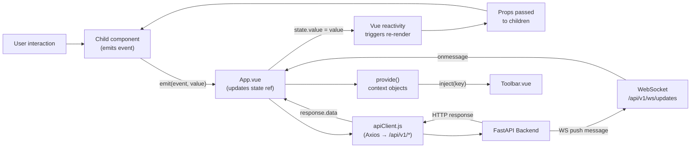
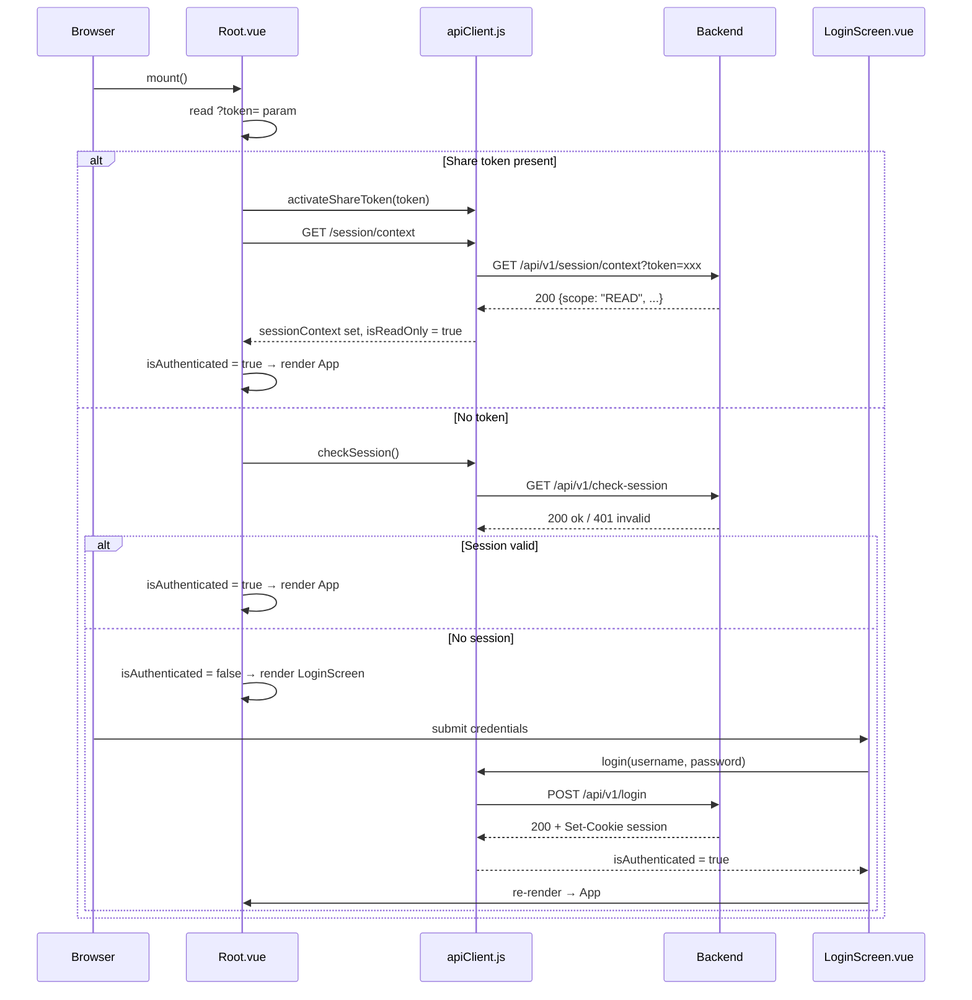
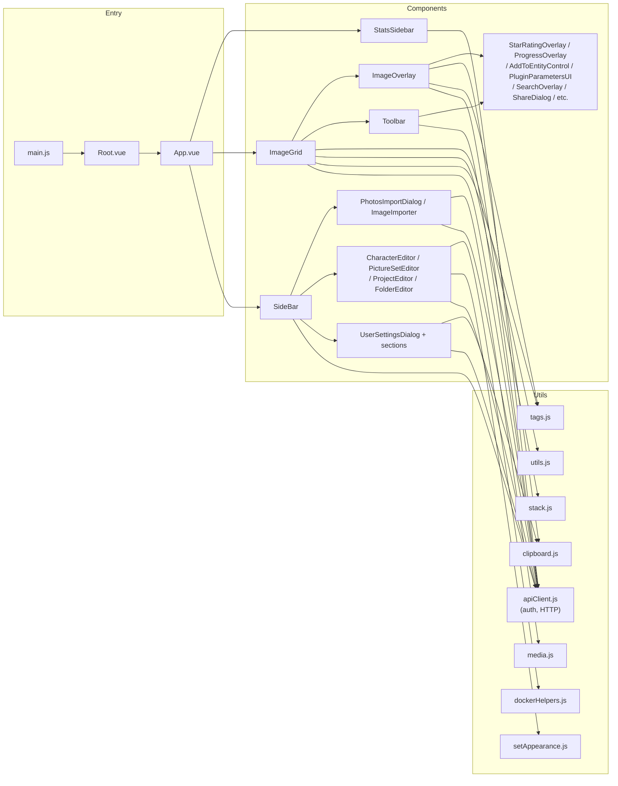
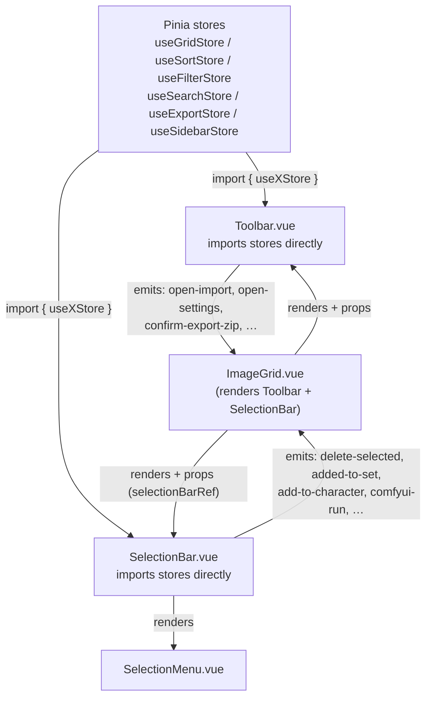

# PixlStash Frontend Architecture

> **Document purpose:** Synthetic reference database of the Vue 3 frontend for Copilot and developers. Describes every component, utility, data-flow pattern, and design decision. Keep this document updated when making structural changes.

---

## Table of Contents

1. [Project Source Tree](#1-project-source-tree)
2. [Architecture Overview](#2-architecture-overview)
3. [Entry Points](#3-entry-points)
4. [State Management — Pinia](#4-state-management--pinia)
5. [Component Catalogue](#5-component-catalogue)
6. [Utility Modules](#6-utility-modules)
7. [Theming and Styling](#7-theming-and-styling)
8. [API Client and Authentication](#8-api-client-and-authentication)
9. [Real-time Updates (WebSocket)](#9-real-time-updates-websocket)
10. [Naming and Coding Conventions](#10-naming-and-coding-conventions)
11. [Build Configuration](#11-build-configuration)
12. [Mermaid Diagrams](#12-mermaid-diagrams)

---

## 1. Project Source Tree

```
frontend/src/
├── main.js                      # App bootstrap: Vuetify + Pinia setup, theme registration, mount
├── Root.vue                     # Auth gate: LoginScreen or App
├── App.vue                      # Root application shell: layout + WebSocket + sidebar/stats state
├── App.css                      # App-scoped CSS overrides
├── style.css                    # Global CSS reset and base rules
│
├── assets/
│   ├── fonts/                   # Self-hosted fonts (if any)
│   ├── Google_Photos_icon_(2020-2025).svg
│   └── unknown-person.png       # Fallback avatar for unrecognised faces
│
├── styles/
│   └── context-menu.css         # Shared CSS for native-style context menus
│
├── stores/                      # Pinia stores (cross-component shared state)
│   ├── useSelectionStore.js
│   ├── useFilterStore.js
│   ├── useSortStore.js
│   ├── useGridStore.js
│   ├── useExportStore.js
│   ├── useWsStore.js
│   ├── useUserPrefsStore.js
│   ├── useProjectStore.js
│   ├── useSidebarStore.js
│   ├── useSearchStore.js
│   ├── useSnapshotsStore.js
│   └── useEntityNamesStore.js   # id→name maps for the ImageGrid breadcrumb
│
├── composables/                 # Extracted logic composables (Phase 8.1 — complete)
│   ├── useVirtualScroll.js      # Virtualised scroll window calculation for ImageGrid
│   ├── useMultiSelect.js        # Image multi-selection (shift-click, range, touch mode)
│   ├── useGridDragDrop.js       # Drag-and-drop reordering and import in ImageGrid
│   ├── useStackOrdering.js      # Stack expand/collapse, reorder, visual mapping in ImageGrid
│   ├── useGridFetch.js          # Grid image fetch state + all fetch/query-param functions
│   ├── useGridKeyboardNav.js    # Keyboard navigation and keyboard-driven actions for ImageGrid
│   ├── useBreadcrumb.js         # Current-view breadcrumb trail from route + id→name maps; shared by in-grid nav and TitleBar
│   └── useVersionCheck.js       # "New version available" check (pixlstash.dev poll); single owner gated by `enabled`
│
├── utils/
│   ├── apiClient.js             # Axios instance, auth state, session/token helpers
│   ├── clipboard.js             # Cross-browser clipboard write helper
│   ├── dockerHelpers.js         # Pure helpers for Docker volume/mount path building
│   ├── media.js                 # File extension lists, file-type predicates, drop-target helpers
│   ├── setAppearance.js         # Picture-set icon/colour palette constants (kept in sync with backend)
│   ├── stack.js                 # Pure stack-ordering and leader-selection utilities
│   ├── tags.js                  # Tag normalisation, deduplication, penalty scoring
│   └── utils.js                 # Date formatting, score toggle, stack colours, ComfyUI error parsing
│
├── router/
│   └── index.js                 # Vue Router config: app routes + history mode
│
└── components/
    ├── TitleBar.vue             # Desktop-only custom window title bar (Electron): wordmark, breadcrumb, window controls, update alert
    ├── WordmarkLogo.vue         # "PixlStash" brand wordmark in the Tiny5 pixel font (two-tone via --wordmark-accent)
    ├── views/       # Full-page / full-screen UI surfaces (ImageGrid, ImageOverlay, LoginScreen, SearchOverlay, overlay panels)
    ├── panels/      # Large structural panels that form the app shell (SideBar, Toolbar, SelectionBar, SelectionMenu, StatsSidebar, …)
    ├── editors/     # Entity create / edit / delete dialogs
    ├── settings/    # Settings dialog and its section sub-components (Appearance, Behaviour, SmartScore, Workflows, Account, Snapshots, Compute)
    ├── io/          # Import / export / external-service connection
    └── widgets/     # Reusable primitives used across multiple domains
```

---

## 2. Architecture Overview

| Concern | Choice |
|---------|--------|
| Framework | Vue 3 (Composition API, `<script setup>`) |
| UI component library | Vuetify 3 |
| State management | **Pinia** — 10 domain stores in `src/stores/`; `App.vue` owns only UI-shell state |
| HTTP client | Axios (singleton `apiClient`) |
| Routing | **Vue Router 4** (`createWebHistory`). `Root.vue` gates on `isAuthenticated`; all authenticated views (`/`, `/character/:id`, `/set/:id`, `/project/:id`, `/scrapheap`) render `App.vue` via `<RouterView>`. `App.vue` watches the route and syncs params to Pinia stores; nav handlers call `router.push()` to update the URL. **The route is the single source of truth for what the grid shows** — only explicit entry clicks push routes; sidebar tab/category switches never do (see Key Design Principles). |
| Build tool | Vite 5 |
| Unit tests | Vitest (jsdom environment) — test files co-located as `*.test.js` in `utils/` |
| End-to-end tests | Playwright (`frontend/e2e/`) — drives the real SPA against a backend booted on a throwaway copy of the `test-data/` fixture. See `frontend/e2e/README.md`. |
| Icons | Material Design Icons (`@mdi/font`) |

### Key Design Principles

- **Pinia for cross-component state.** All state shared across more than one component lives in a Pinia store in `src/stores/`. `App.vue` owns only layout-shell state (sidebar/stats visibility, pending import counts) that is not consumed anywhere else.
- **Sidebar tabs are stateless; the route is the single source of truth for the grid view.** Switching a sidebar tab/category (People / Sets / Projects / Folders, and the Global ↔ Project mode) is a *pure sidebar-display* operation: it only changes which list of entries the sidebar renders. It must **not** call `router.push()`, must **not** emit any `select-*` / navigation event, and must **not** write to the filter / selection / sort / grid stores. The grid keeps showing whatever the current route resolves to. Only an explicit **entry click** (a specific character / set / project) navigates, via `router.push()`. This decoupling is what lets a user stay on a global view, switch to the Projects tab purely to reveal its entries as **drop targets**, and drag the current selection onto a project or one of its characters without losing the view they found the pictures in. See [§5 → SideBar.vue](#sidebarvue--150-lines).
- **Composables for reusable logic.** Complex logic extracted from mega-components lives in `src/composables/` as `useX()` functions. Composables accept dependencies as parameters and are independently unit-testable.
- **Flat component structure.** All components sit directly in `src/components/` with sub-directories by domain (`views/`, `panels/`, `editors/`, `settings/`, `io/`, `widgets/`). Shared presentational sub-components (e.g. `StarRatingOverlay`, `ProgressOverlay`) live in `widgets/`.
- **Utilities are pure functions.** Every file in `src/utils/` exports only plain functions and constants; none hold reactive state themselves (except `apiClient.js`, which holds `isAuthenticated`, `sessionContext`, and `isReadOnly`).
- **`<script setup>` everywhere.** All components use the Composition API with `<script setup>` syntax. Options API is not used anywhere.

---

## 3. Entry Points

### `main.js`

Bootstraps the app:
1. Imports global CSS (`vuetify/styles`, MDI icons, `style.css`, `context-menu.css`).
2. Creates a Vuetify instance with two custom themes: `pixlStashLight` and `pixlStashDark` (full custom colour tokens — sidebar, toolbar, accent, primary, input-background, etc.).
3. Creates the Vue Router instance (imported from `src/router/index.js`).
4. Mounts `Root` as the top-level component.

### `Root.vue`

Authentication gate rendered before `App`. On mount:
1. Reads `?token=` query parameter — if present, calls `activateShareToken()` and validates via `GET /session/context`. Valid → sets `isAuthenticated = true` and `sessionContext`.
2. Otherwise calls `checkSession()` (a `GET /check-session` request).
3. Shows `LoginScreen` when `isAuthenticated` is false; shows `<RouterView>` (which renders `App.vue`) when true.
4. Renders a blank `root-loading` div during the async check.

### `App.vue`

The application shell. Responsibilities:
- Owns **layout-shell state** only: sidebar/stats visibility. All domain state has moved to Pinia stores; the pill ids live in `useWsStore`.
- Renders the three-panel layout: `SideBar` | `ImageGrid` (+ `Toolbar`) | `StatsSidebar`.
- Manages the `PhotosImportDialog`.
- Owns the **WebSocket lifecycle only** (connect / reconnect / close / `set_filters`); the picture-event decision table is delegated to `useGridRealtimeSync` (see §9).
- Handles global keyboard shortcuts, window drag/drop, paste events.
- Fetches user config on startup (`GET /users/me/config`) and applies persisted preferences via the relevant stores.
- Persists sidebar/stats open state to `localStorage`.

---

## 4. State Management — Pinia

PixlStash uses **Pinia** for cross-component state. State is managed at three tiers:

### Tier 1: Pinia stores — cross-component shared state

All state consumed by more than one component lives in a Pinia store. The stores defined in `frontend/src/stores/` are:

| Store | File | Key State |
|-------|------|-----------|
| `useSelectionStore` | `useSelectionStore.js` | `selectedCharacter`, `selectedCharacterIds`, `selectedSet`, `selectedSetIds`, `selectedFolderFilter` |
| `useFilterStore` | `useFilterStore.js` | `mediaTypeFilter`, `minScoreFilter`, `maxScoreFilter`, `tagFilter`, `tagRejectedFilter`, `faceBboxFilter`, `sharedOnlyFilter`, `unassignedOnlyFilter`, etc. |
| `useSortStore` | `useSortStore.js` | `selectedSort`, `selectedDescending`, `sortOptions`, `similarityCharacterOptions`, `selectedSimilarityCharacter` |
| `useGridStore` | `useGridStore.js` | `columns`, `thumbnailSize`, `sidebarThumbnailSize`, `gridVersion`, `wsUpdateKey`, `showStars`, `showFaceBboxes`, `showProblemIcon`, `showStacks`, `stackThreshold`, `expandedStackCount`, `totalStackCount`, `compactMode`, `visibleRangeLabel` |
| `useExportStore` | `useExportStore.js` | `exportType`, `exportCaptionMode`, `exportResolution`, `exportTagFormat`, `exportIncludeCharacterName`, `exportUseOriginalFileNames`, etc. |
| `useWsStore` | `useWsStore.js` | `wsTagUpdate`, `wsPluginProgress`, `updatesSocket`; the per-tab `clientId` (`crypto.randomUUID()`, persisted under `pixlstash:clientId` in `sessionStorage`, in-memory fallback; mirrored into `apiClient` via `setRequestClientId`); the two pills' ids — `pendingExternalImportIds`/`sortChangedExternalIds` with computed `*Count` and `add*`/`clear*` setters |
| `useUserPrefsStore` | `useUserPrefsStore.js` | `checkForUpdates`, `hiddenTags`, `applyTagFilter`, `penalisedTagWeights`, `dateFormat`, `themeMode`, `sidebarWidth` (drag-resizable, clamped 120–300), `showKeyboardHint` |
| `useProjectStore` | `useProjectStore.js` | `projectViewMode` *(sidebar-display only — see below)*, `selectedProjectId`, `characterProjectIds`, `setProjectIds` |
| `useSidebarStore` | `useSidebarStore.js` | `sidebarDocked` (width pref), `sidebarPinned` (visibility pref), `statsOpen`, `sidebarForcedHidden`, `statsForcedHidden`, `characterMultiMode`, `setMultiMode`, `setDifferenceBaseId`; computeds `effectivePinned`, `effectiveDocked`, `sidebarVisible`, `sidebarOverlay` model the pin / dock / auto-hide behaviour (mobile `*ForcedHidden` overrides win). All localStorage access is try/caught. |
| `useSearchStore` | `useSearchStore.js` | `searchQuery`, `searchInput`, `searchHistory`, `isSearchActive`, `searchOverlayVisible` |
| `useEntityNamesStore` | `useEntityNamesStore.js` | `characterNames`, `setNames`, `projectNames`, `refFolderLabels`, `importFolderLabels` (id→name maps). One-directional id→name only (names aren't unique). `SideBar` publishes via `merge*` setters after each fetch; `ImageGrid`'s breadcrumb consumes them to label the route's IDs. |

Components import stores directly (`import { useFilterStore } from '../../stores/useFilterStore'`) — no prop drilling required.

### Tier 2: Component-local state

Sub-components that manage independent data (e.g. `AccountSection`, `SmartScoreSection`, `StatsSidebar`) own their own refs and fetch their own data. They receive an `open: Boolean` prop (or equivalent) and trigger data loads via `watch(() => props.open, ...)`.

### Tier 3: Template-ref imperative API

`App.vue` holds refs to `SideBar` (via `sidebarRef`) and `ImageGrid` (via `gridContainer`) and calls `defineExpose`'d methods on them:

**`SideBar` exposes:** `refreshSidebar()`, `openSettingsDialog()`, `startLocalImport()`, `currentProjectId`, `openCurrentSelectionEditor()`

**`ImageGrid` exposes:** `gridEl`, `onGlobalKeyPress()`, `updateVisibleThumbnails()`, `expandAllStacks()`, `collapseAllStacks()`, `exportCurrentViewToZip()`, `getExportCount()`, `removeImagesById()`, `clearFaceSelection()`, `runComfyuiOnGridImages()`, `hasCursorFocus`

---

## 5. Component Catalogue

### Layout and Shell

#### `Root.vue` (66 lines)
Auth gate. Renders `LoginScreen` or `App` based on `isAuthenticated`. Handles `?token=` share links on mount.

#### `App.vue` (~1 700 lines)
Application shell. Owns all global state. Renders `SideBar` + `ImageGrid` + `StatsSidebar`. Manages WebSocket, keyboard shortcuts, window drag/drop, paste, config loading, export, update checks.

#### `TitleBar.vue` (~400 lines)
Desktop-only custom window title bar for the Electron shell. All desktop calls go through `window.pixlstashDesktop?.…` optional chaining, so it no-ops in a plain browser. Renders the `WordmarkLogo`, the breadcrumb trail (`useBreadcrumb`), the app version, the "new version available" / security update alert (`useVersionCheck`, with `enabled = Boolean(desktop)` so exactly one owner runs the check), and the OS window controls (minimize / maximize / close, hidden on macOS where the OS draws them). Props: `installType`, `checkForUpdates`.

#### `WordmarkLogo.vue` (30 lines)
Presentational "PixlStash" brand wordmark in the Tiny5 pixel font (replaced the prior SVG outline). "Pixl" uses `currentColor`; "Stash" uses `var(--wordmark-accent, currentColor)`, so a caller that sets only `color` gets a single-tone wordmark and one that also sets `--wordmark-accent` gets the two-tone split. Sized via `font-size` on the host. No props.

---

### Large Stateful Components

#### `ImageGrid.vue` (~8 670 lines)
The core image display engine. Responsibilities:
- Virtualised grid scroll with dynamic thumbnail sizes (via `useVirtualScroll`).
- Fetches images from `GET /pictures` with all filter params as query args.
- Manages stacks: collapsing/expanding, leader-map calculation, inline stack drag-sort (via `useStackOrdering`).
- Multi-selection (shift-click, keyboard navigation with arrow keys) (via `useMultiSelect`).
- Image scoring (guest and authenticated star rating).
- Drag-and-drop reordering within sets (via `useGridDragDrop`).
- Integrates `ImageOverlay`, `ImageImporter`, `Toolbar`, `ImageGridContextMenu`, `EmptyScrapHeap`, `ComfyUiRunner`.
- Emits: `open-overlay`, `refresh-sidebar`, `clear-search`, `reset-to-all`, `search-all`, `update:selected-sort`, `update:stack-stats`, `import-started`, `import-ended`, `clear-multi-selection`, `update:character-multi-mode`, `update:set-multi-mode`, `update:set-difference-base-id`, `update:embed-watermark`, `update:visible-range-label`, `load-pending-imports`
- Key props: `thumbnailSize`, `columns`, `selectedCharacter`, `selectedSet`, `searchQuery`, `selectedSort`, `wsTagUpdate`, `wsPluginProgress`, `gridVersion`, `wsUpdateKey`, `publicUrl`, `embedWatermark`, + all filter props.

#### `SideBar.vue` (~8 150 lines)
Left navigation panel. Responsibilities:
- Tabs: People, Sets, Projects, Folders.
- Character list with face thumbnails, drag-drop assignment, inline create/edit.
- Set list with thumbnail stacks, drag-drop assignment.
- Project tree with expandable nodes (people + sets per project); project rows are drop targets — dropping grid pictures assigns them to that project (like character/set rows).
- Folder browser (import and reference folders).
- Settings dialog trigger, sort selector.
- Embeds: `ImageImporter`, `CharacterEditor`, `PictureSetEditor`, `ProjectEditor`, `FolderEditor`, `UserSettingsDialog`.
- Exposes: `refreshSidebar()`, `openSettingsDialog()`, `startLocalImport()`, `currentProjectId`, `openCurrentSelectionEditor()`
- Emits: 30+ events including `select-character`, `select-set`, `select-folder`, `update:public-url`, `update:theme-mode`, `update:sort-options`, `update:hidden-tags`, `toggle-dock`, `update:project-view-mode`, etc.

##### Sidebar tabs & drag-to-assign (stateless tabs)

The tab/category switch is **stateless** (see Key Design Principles). Concretely:

- **Tab state is sidebar-local display state only.** `sidebarPrimaryTab`
  (`'library' | 'folders'`) and `projectViewMode` (`'global' | 'project'`)
  select *which list the sidebar renders*. Switching them must not
  `router.push()`, must not emit a `select-*` event, and must not mutate the
  filter / selection / sort / grid stores. Folder-status polling is the only
  permitted side effect of a tab switch (it loads the data the tab displays).
- **Entry clicks are the only navigation.** Clicking a specific character /
  set / project emits the corresponding `select-*` event → `App.vue` calls
  `router.push()` → the route (the single source of truth) drives the grid.
  The grid is otherwise unaffected by tab switches.
- **Every entry is also a drop target.** Each character and set row (and the
  project entries) accepts a drop of the current grid selection
  (`application/json` payload via `dataTransfer`) to assign those pictures —
  `handleDragOverCharacter` / `dragOverSet` and siblings. Because switching a
  tab no longer disturbs the grid, the intended flow works end-to-end: find
  pictures on a global view → switch to the Projects/People/Sets tab → drag the
  selection onto a project or character to add them, with the global view still
  intact underneath.
- **Anti-pattern (do not reintroduce):** a tab/mode `watch` that emits
  `select-*`, pushes a route, or resets a filter. That recouples the sidebar to
  the view and breaks the drag-to-assign flow. Keep navigation in entry-click
  handlers only.

#### `ImageOverlay.vue` (~6 590 lines)
Full-screen image lightbox. Responsibilities:
- **Frozen navigation backbone (overlay-open deferral, see §9.1).** prev/next and the filmstrip read membership from a snapshot of `allImages` (`frozenAllImages`, captured on open and cleared on close) via the `overlayImages` computed, not from the live `allImages` prop. This keeps left/right working for the overlay's whole lifetime even after the current picture stops matching the active filter (e.g. the user removes the tag the view is filtered on) or a background refetch reshuffles the grid. The currently displayed card stays fresh independently: it lives in `image.value` and is updated by local edits / `fetchOverlayMetadata`, not by the snapshot. Stack expansion still loads fresh members from `/stacks/{id}/pictures`; only the sequence/membership is frozen.
- Image display with pan/zoom (fit / 1.5× / 2×).
- Tag management: add, remove, autocomplete suggestions from `GET /tags/completions`.
- AI tag predictions (accept/reject).
- Description editing (inline markdown-like text, copy button).
- Stack expansion inline within the overlay.
- Runs ComfyUI workflows on the current image.
- Runs plugins on the current image.
- Sidebar panel: metadata, score, dates, file info, penalised-tag indicator.
- Embeds `AddToEntityControl`, `StarRatingOverlay`, `ProgressOverlay`, `ComfyUiRunner`.
- Receives `allImages` array from `ImageGrid` for filmstrip navigation.
- Key props: `open`, `initialImageId`, `allImages`, `tagUpdate`, `hiddenTags`, `applyTagFilter`, `availablePlugins`, `comfyuiProgress`, `guestScore`
- Emits: `close`, `apply-score`, `set-guest-score`, `add-tag`, `remove-tag`, `update-description`, `overlay-change`, `added-to-set`, `set-project`, `comfyui-run`, `run-plugin`

#### `Toolbar.vue` (`panels/`, ~3 300 lines)
Top/grid toolbar. Imports state directly from Pinia stores (`useGridStore`, `useSortStore`, `useFilterStore`, `useSearchStore`, `useExportStore`, `useSidebarStore`) — no `inject` or prop drilling. The selection action UI that used to live here was extracted into `SelectionBar.vue` + `SelectionMenu.vue` (see below); `Toolbar` no longer holds any selection state.

Responsibilities:
- Grid bar: sort selector, filter chips (tags, score, media type, resolution), column slider, stack controls, view mode toggles.
- Top bar: search toggle, export menu, settings button, import button, sidebar/stats toggles.
- Export menu: type (full/face), caption mode, resolution, tag format, character name inclusion.
- Props: `selectedCount`, `selectedCharacter`, `selectedSort`, `allPicturesId`, `unassignedPicturesId`, `backendUrl`, `comfyuiConfigured`.
- Key emits: `comfyui-run-grid`, `expand-all-stacks`, `collapse-all-stacks`, `confirm-export-zip`, `open-import`, `open-settings`.

#### `SelectionBar.vue` (`panels/`)
Floating selection action bar shown above the grid when images are selected (the leftover from the Toolbar split). Driven by props from `ImageGrid`; it renders the per-selection plugin/ComfyUI run menus, the tag/caption controls, and the `SelectionMenu` dropdown. Uses the `@container selbar` query against the grid-content wrapper, so its layout responds to the available grid width.
- Key props: `selectedCount`, `selectedExpandedCount`, `selectedFaceCount`, `selectedGroupName`, `selectedSort`, `visible`, `scrapheapPicturesId`, `backendUrl`, `selectedImageIds`, `selectedMediaSupport`, `comfyuiClientId`, `comfyuiConfigured`, `selectedMultipleStackIds`, `groupingLockReason`, `availablePlugins`, `taggerPlugins`, `captionerPlugins`, `allGridImages`, `selectedCharacter`, `selectedSet`.
- Exposes: `openTagInput()`, `openPluginPanel()`, `openComfyuiPanel()` (consumed by `ImageGrid` via `selectionBarRef`).
- Key emits: `clear-selection`, `delete-selected`, `added-to-set`, `add-to-character`, `remove-from-character`, `set-project`, `create-stack`, `remove-from-stack`, `dissolve-stacks`, `create-stacks-from-groups`, `run-plugin`, `comfyui-run`, `tags-applied`, `auto-tag`, `generate-description`, `reverse-image-search`, `remove-from-group`, `selection-menu-open`.

#### `SelectionMenu.vue` (`panels/`)
The dropdown menu of bulk actions for the current selection, rendered by `SelectionBar`: add to project/character/set (via `AddToEntityControl`), stack/unstack/dissolve, tag/caption/describe, run plugin/ComfyUI, reverse image search, delete. Native-style menu using `styles/context-menu.css` classes (shares the look of `ImageGridContextMenu`).
- Key props: `open`, `selectedCount`, `selectedImageIds`, `backendUrl`, `isReadOnly`, `isScrapheapView`, `groupingLockReason`, `taggerPlugins`, `captionerPlugins`, `comfyuiConfigured`, `hasPluginOptions`, `selectedSort`, `selectedGroupName`, `selectedMultipleStackIds`, `showRemoveFromStack`.
- Exposes: `focusFirst()`, `containsFocus()`.
- Key emits: same action set as `SelectionBar` plus `open-tag-input`, `open-plugin-panel`, `open-comfyui-panel`, `close`.

#### `StatsSidebar.vue` (~2 560 lines)
Right-side statistics panel. Responsibilities:
- Tag frequency charts (top tags, tag co-occurrence).
- Confidence-score histogram.
- Tag-count histogram.
- Score distribution.
- Filter controls that emit back to `App.vue`: tag filter, score range, resolution bucket, media type.
- Mirrors the same filter props as `ImageGrid` so its stats always match the active view.
- Key emits: `toggle`, `filter-tag`, `filter-tags`, `filter-confidence-above`, `update:minScoreFilter`, `update:maxScoreFilter`, `update:smartScoreBucketFilter`, `update:resolutionBucketFilter`

---

### Settings Dialog and Sub-sections

#### `UserSettingsDialog.vue` (~2 580 lines)
Multi-tab settings dialog. Each tab now delegates to its own section component (the Behaviour, Workflows and Snapshots tabs were extracted from inline markup). Tabs:
- **Appearance** → `<AppearanceSection>`
- **Behaviour** → `<BehaviourSection>` (`!isReadOnly`)
- **Smart Score** → `<SmartScoreSection>` (`!isReadOnly`)
- **Workflows** → `<WorkflowsSection>` (`!isReadOnly`)
- **Snapshots** → `<SnapshotsSection>` (`!isReadOnly`)
- **Backend** → `<ComputeSection>` (desktop only, `isDesktop && !isReadOnly`)
- **Account Settings** → `<AccountSection>` (`!isReadOnly`)

Emits: `update:public-url`

#### `AppearanceSection.vue` (244 lines)
Appearance tab content: sidebar thumbnail size, sidebar width (Full / Dock toggle), theme, date format, keyboard-hint toggle, guest-session clear. Props: `sidebarThumbnailSize`, `themeMode`, `dateFormat`, `showKeyboardHint`. Emits corresponding `update:*` events. Contains own `clearGuestSession()` logic and `hasGuestSessionCookie` state. The sidebar width toggle reads/writes `useSidebarStore.sidebarDocked` directly.

#### `BehaviourSection.vue`
Behaviour tab content (extracted from inline `UserSettingsDialog` markup): hidden tags, VRAM limits, tagger configuration.

#### `WorkflowsSection.vue`
Workflows tab content (extracted from inline markup): ComfyUI URL, workflow import/management.

#### `SnapshotsSection.vue`
Snapshots tab content. Props: `open: Boolean`. Lists and manages snapshots (reuses `utils/snapshots.js` helpers).

#### `ComputeSection.vue` (~595 lines)
Desktop-only compute-runtime manager ("Backend" tab). Talks to the Electron preload bridge (`window.pixlstashDesktop`) to switch between the built-in CPU/Metal runtime and an on-demand GPU overlay; the same choice appears on the first-run welcome screen. Switching the runtime restarts the local server (which reloads the page). Props: `open: Boolean`. No-ops outside the desktop shell.

#### `SmartScoreSection.vue` (409 lines)
Penalised-tags configuration. Props: `open: Boolean`. Fetches `GET /users/me/config` on open and on `onMounted`. Saves directly via `PATCH /users/me/config`. Owns all penalised-tag CRUD state internally.

#### `AccountSection.vue` (1 076 lines)
Account management tab. Props: `open: Boolean`. Emits: `update:public-url`.
- On `open` change: resets form, fetches auth info, tokens, public URL, watermark preview.
- Manages: password change, API token CRUD (create/list/delete/copy), share-link builder, public URL config, watermark upload/clear.
- Owns: `tokenDialogOpen` and `tokenDeleteDialogOpen` dialogs (rendered inside this component using Vuetify's overlay teleport system).

---

### Editor and Browser Components

#### `CharacterEditor.vue` (458 lines)
Create/edit/delete character (person) entity. Props: `open`, `character`, `backendUrl`, `projects`. Emits: `close`, `saved`.

#### `PictureSetEditor.vue` (524 lines)
Create/edit/delete picture sets. Props: `open`, `set`, `thumbnailUrl`. Uses `SET_ICONS`, `SET_COLORS`, `SET_ICON_CATEGORIES`, `ICON_CARDS` from `setAppearance.js`. Emits: `close`, `saved`, `deleted`.

#### `ProjectEditor.vue` (130 lines)
Create/rename/delete a project. Props: `open`, `project`. Emits: `close`, `saved`, `deleted`.

#### `FolderEditor.vue` (1 198 lines)
Configure import/reference folders (add, edit, remove, Docker command generation). Uses `dockerHelpers.js` for volume flag building. Embeds `FolderBrowser`.

#### `FolderBrowser.vue` (255 lines)
Server-side directory browser dialog. Props: `open`, `initialPath`. Emits: `select`, `close`. Fetches `GET /folders/browse`.

#### `FolderTreeNode.vue` (202 lines)
Recursive tree node for nested folder display. Props: `node`, `expanded`, `depth`. Emits: `select`, `toggle`.

---

### Import Components

#### `PhotosImportDialog.vue` (575 lines)
Import source selection dialog. Sources: local file picker, Google Photos (OAuth), external API. Embeds `ProjectEditor`. Props: `open`. Emits: `close`, `import`.

#### `ImageImporter.vue` (783 lines)
Actual file upload engine. Props: `backendUrl`, `selectedCharacterId`, `allPicturesId`, `unassignedPicturesId`. Emits: `import-started`, `import-finished`, `import-cancelled`, `import-error`. Handles chunked multipart upload with progress tracking.

---

### Shared / Primitive Components

#### `AddToEntityControl.vue` (966 lines)
Reusable control for assigning images to/from characters and sets. Props: `type` (`'character'`|`'set'`), `imageIds`, `selectedCharacter`, `selectedSet`. Emits: `added`, `removed`, `selected`. Used in `Toolbar`, `ImageOverlay`, `ImageGridContextMenu`.

#### `StarRatingOverlay.vue` (133 lines)
5-star score widget. Props: `score`, `readonly`. Emits: `set-score`. Used in `ImageOverlay` and `ImageGrid` cells.

#### `ProgressOverlay.vue` (160 lines)
Task progress overlay. Props: `status`, `progress`, `message`, `abortable`. Emits: `abort`. Terminal statuses: `completed`, `failed`, `cancelled`.

#### `PluginParametersUI.vue` (336 lines)
Dynamic form renderer for **image plugin** JSON schemas. Props: `schema`, `modelValue`. Emits: `update:modelValue`. Uses `reactive` form values synced bidirectionally with props. **Not reused for tagger plugins** — those use `TaggerParametersUI.vue`.

#### `TaggerParametersUI.vue`
Schema-driven form renderer for **tagger plugin** parameter schemas. Props: `schema` (array of parameter definition dicts), `modelValue` (dict). Emits: `update:modelValue`. Supports field types: `number`/`integer` (with `min`/`max`/`step`), `boolean`, `select` (with `options`), `string`, `textarea`, `csv-int`.

#### `TaggerPluginSettingsDialog.vue`
Per-plugin settings dialog. Props: `plugin` (plugin schema object), `params` (current param dict), `modelValue` (v-dialog open). Emits: `update:modelValue`, `saved`. Contains `TaggerParametersUI`, a "Reset to defaults" button, and a label-thresholds preview panel (PixlStash tagger only). Saves via `PATCH /users/me/config` (`tagger_settings.plugins.<name>.params`).

#### `TagPluginsTable.vue`
Table of tag-capable plugins (`supports_tags = true`). Columns: Active (radio — single selection), Plugin name + tooltip, Loaded indicator, Settings gear. Patches `tagger_settings.active_tag_plugin` via `PATCH /users/me/config` on change. Props: `plugins`, `settings`. Emits: `update:settings`.

#### `DescriptionPluginsTable.vue`
Table of description-capable plugins (`supports_descriptions = true`). Columns: Active (radio — single selection), Plugin name + tooltip, Loaded indicator, Settings gear. Patches `tagger_settings.active_description_plugin` via `PATCH /users/me/config` on change. Props: `plugins`, `settings`. Emits: `update:settings`.

#### `ComfyUiRunner.vue` (1 110 lines)
ComfyUI workflow executor embedded in `ImageGrid` and `ImageOverlay`. Connects to the ComfyUI WebSocket for real-time progress. Props: `workflowId`, `clientId`, `imageIds`, `backendUrl`. Emits progress and completion events.

**Grid refresh contract (in-app ComfyUI output):** the new grid card for an in-app ComfyUI result appears via the origin-aware WebSocket `picture_imported` insert (`useGridRealtimeSync.handleForeignUi` → `insertGridImagesById`, [§9](#9-real-time-updates-websocket)), **not** via a full grid refetch. `routes/comfyui.py` broadcasts the import with `source: "ui"` and no origin id, so every owner tab (including the originating one) does a targeted in-place insert at the sorted position with no pill and no reload — the old "image pops in → disappears → comes back" flicker is gone. The runner's `refresh-grid` emit is therefore **no longer wired to a grid refetch**: `ImageGrid.onComfyuiRefreshGrid` now only reconciles an **open** overlay (i2i/upscale) to the freshly-stacked output via `maybeRefreshOverlayForComfyui` (a guarded no-op when the overlay is closed or no comfyui refresh is pending). The same overlay reconcile is also kicked from `insertGridImagesById` after the WS insert lands, so the lightbox catches the new stack member without waiting for the runner's retry backoff. What the runner still drives unchanged: the ComfyUI **progress banner**, the **`refresh-sidebar`** emit (sidebar count), and the open-overlay refresh (including the failure path, which hides the banner / shows the error and no longer refetches the grid).

#### `SearchOverlay.vue` (273 lines)
Full-screen search input with history. Props: `modelValue`, `history`. Emits: `search`, `close`, `clear-history`. Keyboard: Enter to search, Escape to close.

#### `SearchResultBar.vue` (95 lines)
Active-search banner. Props: `query`, `scope`, `resultCount`. Emits: `clear`, `search-all`.

#### `ShareDialog.vue` (286 lines)
Share link creation. Props: `modelValue` (v-model for open), `pictureId`, `embedWatermark`. Emits: `update:modelValue`, `update:embed-watermark`, `created`. Calls `POST /shares`.

#### `SnapshotsWithDeletedDialog.vue` (~95 lines)
Post-purge privacy notice. Props: `modelValue` (v-model open), `snapshots` (array of `{id, kind, label, created_at, matched_count}` from the `DELETE /pictures/scrapheap` response's `snapshots_with_deleted`). Emits: `update:modelValue`. Shown by `ImageGrid` after a permanent scrapheap purge when the deleted pictures' metadata still lives in one or more snapshots — the archives are not scrubbed, so it lists those snapshots and points the user to Settings → Snapshots to delete them. Reuses `kindChipColor`/`relativeDate` from `utils/snapshots.js`.

#### `ImageGridContextMenu.vue` (392 lines)
Right-click context menu for grid cells. Props: `visible`, `x`, `y`, `selectedImageIds`, `selectedMediaSupport`, `selectedCharacter`, `selectedSet`, `selectedSort`, `allPicturesId`, `unassignedPicturesId`. Emits same action events as `Toolbar`. Embeds `AddToEntityControl`.

#### `ProjectFiles.vue` (713 lines)
Expandable project file-tree panel inside `SideBar`. Shows imported files grouped by project.

#### `EmptyScrapHeap.vue` (106 lines)
Empty-state illustration and caption for the scrapheap (deleted-images holding area) view.

#### `LoginScreen.vue` (209 lines)
Login/registration form. On mount calls `checkLoginStatus()` to detect first-run (no users exist → show registration form). Calls `login()` from `apiClient.js`.

---

## 6. Utility Modules

All utilities in `src/utils/` are pure functions / constants with no Vue lifecycle dependency (except `apiClient.js`).

### `apiClient.js`

The single most-imported utility. Exports:

| Export | Type | Description |
|--------|------|-------------|
| `apiClient` | Axios instance | Pre-configured with `baseURL`, 60 s timeout, `withCredentials: true`. Request interceptor rewrites relative paths to `${API_PREFIX}/*`, injects `?token=` for share sessions, and adds the `X-Client-Id` header on mutating (`POST`/`PUT`/`PATCH`/`DELETE`) same-origin requests. Response interceptor triggers `logout()` on 401. |
| `setRequestClientId(id)` | function | Stores the per-tab client id in module scope (capped at 200 chars) so the request interceptor can attach `X-Client-Id` without a Pinia lookup. Called by `useWsStore` at init. |
| `isAuthenticated` | `ref<Boolean>` | Global auth state. Set by `login()`, `checkSession()`, `logout()`. |
| `isReadOnly` | `computed<Boolean>` | `true` when `sessionContext.scope === 'READ'` (share-token session). |
| `sessionContext` | `ref<Object\|null>` | Session metadata from `GET /session/context`. |
| `activateShareToken(token)` | function | Stores the share token for injection into all subsequent requests. |
| `appendShareToken(url)` | function | Appends `?token=` to raw `` or similar URLs that bypass Axios. |
| `login(username, password)` | async function | `POST /login`, sets `isAuthenticated`, stores credentials via `PasswordCredential` API. |
| `logout()` | async function | `POST /logout`, clears `isAuthenticated`. |
| `checkSession()` | async function | `GET /check-session`. Returns `{status: 'ok'|'invalid'|'unreachable'}`. |
| `checkLoginStatus()` | async function | `GET /login`. Returns first-run / login state. |
| `API_BASE_URL` | string | Derived backend base URL (same-origin by default; overridable via `VITE_BACKEND_URL`). |

**URL derivation:** In production the SPA is served by the PixlStash FastAPI server on the same origin, so `window.location.origin` is used. Dev builds can override with `VITE_BACKEND_URL`.

---

### `tags.js`

Tag normalisation and penalty helpers.

| Export | Description |
|--------|-------------|
| `getTagLabel(tag)` | Extract string label from a tag string or `{tag, id}` object. |
| `getTagId(tag)` | Extract numeric ID or null. |
| `TagItem(tag)` | Normalise to `{id, tag}` or null. |
| `getTagList(tags)` | Map array to `TagItem[]`, filtering nulls. |
| `dedupeTagList(tags)` | Deduplicate by lowercase tag string; prefer items with IDs; sort alphabetically. |
| `tagMatches(tag, target)` | Equality check by ID (if present) then by string. |
| `hasPenalisedTags(img)` | True if image has non-empty `penalised_tags` array. |
| `penalisedTagsTitle(img)` | Tooltip string listing penalised tags. |
| `penalisedTagIcon(img, weights, outline)` | Returns MDI icon name graded by penalty severity (neutral / sad / angry). |
| `penalisedTagColor(img, weights)` | Returns colour graded by severity (yellow → orange → red). |

---

### `utils.js`

General-purpose helpers.

| Export | Description |
|--------|-------------|
| `toggleScore(current, target)` | Returns 0 if current equals target, else target. Used for star-toggle behaviour. |
| `formatUserDate(dateStr, format)` | Format ISO date string with user-selected format: `us`, `british`, `eu`, `ymd-slash`, `ymd-dot`, `ymd-jp`, `locale`, `iso`. UTC-aware (appends `Z` to bare ISO strings). |
| `formatIsoDate(dateStr)` | Shorthand for `formatUserDate(str, 'iso')`. |
| `getStackThreshold(value)` | Clamp to `[0.5, 0.99999]` with default 0.9. |
| `getStackColor(stackIndex, row, col)` | HSL colour for stack border from 8-hue palette. |
| `faceBoxColor(idx)` | Colour from a 10-colour palette for face bounding boxes. |
| `applyStackBackgroundAlpha(color)` | Convert HSL/RGB to HSLA/RGBA with 0.6 alpha. |
| `getStackColorIndexFromId(stackId)` | Convert stack ID to a numeric palette index. |
| `normalizePluginProgressMessage(msg, fallback)` | Strip JSON-encoding artefacts and escape sequences from plugin status strings. |
| `formatComfyuiExecutionErrorMessage(error)` | Format ComfyUI execution error payloads for human display. |

---

### `stack.js`

Pure stack ordering and leader-selection utilities (no Vue dependency).

| Export | Description |
|--------|-------------|
| `getPictureStackId(img)` | Normalise `stack_id` / `stackId` to string or null. |
| `normalizeStackIdValue(stackId)` | Coerce to number or string. |
| `getStackPositionValue(img)` | Read `stack_position` / `stackPosition` as finite number. |
| `getStackSmartScoreValue(img)` | Read `smartScore` / `smart_score` as finite number (default 0). |
| `compareStackOrder(a, b)` | Comparator: `stack_position` → `score` → `smart_score` → `created_at` → `id`. |
| `sortStackMembers(members)` | Sort by `compareStackOrder`. |
| `selectNewestStackMember(members)` | Return member with latest `created_at` (tie-break by id). |
| `buildStackLeaderMap(images)` | Build `Map<stackId, leaderId>` preserving backend ordering. |
| `getStackBadgeCount(img)` | Read `stackCount` / `stack_count` as finite number. |

---

### `media.js`

File type helpers.

| Export | Description |
|--------|-------------|
| `PIL_IMAGE_EXTENSIONS` | Array of ~50 image format extensions. |
| `VIDEO_EXTENSIONS` | `['mp4', 'avi', 'mov', 'webm', 'mkv', 'flv', 'wmv', 'm4v']` |
| `ARCHIVE_EXTENSIONS` | `['zip']` |
| `CAPTION_EXTENSIONS` | `['txt']` |
| `isSupportedImageFile(file)` | Predicate by extension. |
| `isSupportedVideoFile(file)` | Predicate by extension. |
| `isSupportedArchiveFile(file)` | Predicate by extension. |
| `isSupportedMediaFile(file)` | Image OR video. |
| `isSupportedCaptionFile(file)` | `.txt` extension. |
| `isSupportedImportFile(file)` | Media OR archive OR caption. |
| `collectImportFiles(dataTransfer)` | Async; recursively resolves `FileSystemEntry` trees via WebKit directory API, deduplicates by `name::size::lastModified`. |

---

### `clipboard.js`

| Export | Description |
|--------|-------------|
| `copyText(text)` | Async. Tries `navigator.clipboard.writeText`. Falls back to `document.execCommand('copy')` via a `copy` event intercept. Normalises `\r\n` on Windows. Returns `Boolean`. |

---

### `setAppearance.js`

| Export | Description |
|--------|-------------|
| `ICON_CARDS` | Sentinel `"cards"` — renders animated thumbnail-stack preview instead of an MDI icon. |
| `SET_ICON_CATEGORIES` | Array of `{label, icons[]}` groups for the icon picker grid (Photography, Favourites, Family, Clothing, Home, Travel, Sports, Work, Events, Arts, Seasons, Food). Must be kept in sync with `pixlstash/routes/picture_sets.py`. |
| `SET_ICONS` | Flat list of all icon values (derived from categories). |
| `SET_COLORS` | Array of colour hex values for the set colour picker. |

---

### `dockerHelpers.js`

Pure helpers for constructing Docker run/compose snippets in the folder editor UI.

| Export | Description |
|--------|-------------|
| `normalizeFolderPath(value)` | Trim and strip trailing slashes. |
| `buildDockerVolumeFlag(hostPath, containerPath, format)` | Build `-v host:container` flag; `format='windows'` uses double-quotes. |
| `deriveLabelFromHostPath(value)` | Extract leaf folder name as a human label. |
| `inferImportMount(folder, fallbackIndex)` | Derive `{hostPath, containerPath}` for an import folder. |
| `inferReferenceMount(folder, fallbackIndex)` | Derive `{hostPath, containerPath}` for a reference folder. |

---

## 7. Theming and Styling

### Vuetify custom themes

Two themes are registered in `main.js`: `pixlStashLight` and `pixlStashDark`. Both share the same token names but different values.

Custom colour tokens (beyond Vuetify defaults):

| Token | Role |
|-------|------|
| `sidebar` / `sidebar-text` | Sidebar background and text |
| `toolbar` / `toolbar-text` | Top toolbar background and text |
| `sidebar-hover` / `on-sidebar-hover` | Active/hover state in sidebar |
| `input-background` / `input-text` | Form field backgrounds |
| `cancel-button` / `cancel-button-text` | Secondary/cancel button colours |
| `dark-surface` / `on-dark-surface` | Dark card/panel surfaces (used inside the grid) |
| `accent` | Orange brand accent (#f28f3b) |
| `primary` | Green primary (#8EA604) |
| `secondary` | Pink secondary (#DA4167) |
| `tertiary` | Teal (#77A0A9) |
| `panel` / `onPanel` | Sidebar-style panel inside dialogs |
| `border` / `divider` | Borders and dividers |

Theme is switched at runtime by setting Vuetify's `theme.global.name` from the `themeMode` ref in `App.vue`. The user preference is persisted via `PATCH /users/me/config`.

### CSS layers

- `vuetify/styles` — Vuetify component styles.
- `@mdi/font/css/materialdesignicons.css` — MDI icons.
- `style.css` — Global resets, custom scrollbars, grid utility classes.
- `App.css` — App-level layout overrides (sidebar shell, app-viewport).
- `styles/context-menu.css` — Shared styling for custom right-click menus.
- `<style scoped>` in each component — Component-specific styles. CSS scoping is done by Vue's transform and does not cross component boundaries.

### Overlay / title-bar layering

In the Electron desktop shell a custom 34px title bar (`TitleBar.vue`, `.titlebar`) sits at the top of `.app-viewport` and hosts the window drag region and the min/maximize/close controls. No overlay may ever cover it. Three pieces keep that true; new overlays must respect them:

- **`--titlebar-h`** — the reserved title-bar height. Defaults to `0px` on `:root` (a plain browser has no title bar) and is overridden to `34px` on `html.is-desktop` (the class `main.js` adds when `window.pixlstashDesktop` exists). Defined at the root so it inherits everywhere, including Vuetify overlays teleported to `<body>`. The `34px` must stay in sync with `.titlebar { height }` in `TitleBar.vue` (both carry a comment saying so).
- **The title bar is top-most.** `.titlebar` is `position: relative; z-index: 100000`, above every in-app overlay (the highest is the import-progress modal at `99999`). It is a child of `.app-viewport` alongside the in-app overlays, so this z-index wins over all of them. Bump it if any overlay ever goes higher.
- **Full-screen overlays anchor their top at `var(--titlebar-h)`.** Any new full-viewport modal backdrop (`position: fixed` + `inset: 0` / `top:0;left:0;right:0;bottom:0` / `100vw`×`100vh`) must start below the title bar: use `inset: var(--titlebar-h) 0 0 0` (or `top: var(--titlebar-h)` with a matching height reduction) so its own top content (close buttons, toolbars) and its centred/scrolled content land in the visible area below the bar. Current insets: `ImageOverlay` `.image-overlay` (via a global `html.is-desktop` rule), `ReviewFixesOverlay` `.rf-overlay` / `.rf-preview` / `.rf-zoom`, `CharacterEditor` `.ref-preview-overlay`, `ImageImporter` `.import-progress-modal`, `SearchOverlay` `.search-overlay`.

**Do NOT wrap overlays in a containing-block / `transform` / `contain` element to push them down.** A containing block reparents the viewport coordinate space, which breaks JS-coordinate-positioned popovers (`ImageGridContextMenu`, `AddToEntityControl`, the tag autocomplete dropdowns in `OverlayTagsPanel` / `TbTagPanel`) that position with `position: fixed` using `getBoundingClientRect()` / `clientX`. Leave those JS-positioned popovers, context menus, and tooltips untouched — they read viewport coordinates and are already correct. Inset the backdrop directly instead.

---

## 8. API Client and Authentication

### Authentication modes

| Mode | Mechanism |
|------|-----------|
| Full session | Cookie-based session set by `POST /login`. `withCredentials: true` ensures the cookie is included on all requests. On 401, `logout()` is called globally. |
| Share token | `?token=` query parameter obtained from a share link. Stored in the module-level `_shareToken` variable. Injected into all Axios requests via the request interceptor. Share sessions are `READ` scope — `isReadOnly` is `true`. |
| Read-only mode | `isReadOnly = computed(() => sessionContext.value?.scope === 'READ')`. Many edit actions are conditionally hidden or disabled. |

### URL rewriting

The Axios request interceptor rewrites all relative URLs:
- If the URL does not already start with `/api/v1`, prepends `/api/v1`.
- Fully qualified URLs (`http://...`) are passed through unchanged, except same-origin requests get the share token injected.
- Share token is injected as `?token=` query param for both relative and same-origin absolute requests.

### `appendShareToken(url)`

For `` bindings and similar direct browser requests that bypass Axios, call `appendShareToken()` to add `?token=` manually.

---

## 9. Real-time Updates (WebSocket)

`App.vue` opens a WebSocket at `ws(s)://host/api/v1/ws/updates` and reconnects with a 2-second delay on close. The handshake is **authenticated** by the backend (the HTTP auth middleware does not cover WebSockets): a full session authenticates via the same-origin session cookie, so `buildUpdatesSocketUrl()` runs the URL through `appendShareToken()` to add the READ `?token=` for share/read-only sessions that have no cookie. The backend only delivers the global event stream to owner-level connections; a scoped/READ token may connect but receives no events.

### Message types

| `type` | Action |
|--------|--------|
| `pictures_changed` | Routed to `useGridRealtimeSync` (see below). If LIKENESS_GROUPS sort is active, emits `wsTagUpdate` instead. |
| `picture_imported` | Routed to `useGridRealtimeSync` → slick insert, foreign-tab insert, or the "New pictures" pill. |
| `characters_changed` | Immediate `refreshSidebar()`. |
| `tags_changed` | Emits `wsTagUpdate` with the affected picture IDs **and an `external` flag** (`origin_client_id !== this tab`) so `ImageOverlay` can refresh tags for any origin, while `ImageGrid` only refreshes a tag-filtered grid in place for this tab's **own** edits; an external tag change (background tagging, another tab) raises the "View changed externally" pill instead of reshuffling the filtered view. |
| `plugin_progress` | Sets `wsPluginProgress` payload forwarded to `ImageGrid` → `ComfyUiRunner`. |

After connecting, and after any filter change, `App.vue` sends a `set_filters` message (carrying the tab's `client_id`) so the backend can scope `pictures_changed` events to the current view.

### `useGridRealtimeSync` — the picture-event decision table

The WebSocket → grid update policy lives in [`composables/useGridRealtimeSync.js`](../frontend/src/composables/useGridRealtimeSync.js). `App.vue` keeps **only** the socket lifecycle (connect / reconnect / close / `set_filters`) and routes picture events to `handleMessage(payload)`. The composable takes all of its dependencies by parameter — `getMyClientId`, the grid imperative API (`insertGridImagesById`, `refreshGridImage`, `refreshSmartScoreForImage`, `repositionBy*`, `removeImagesById`, `isImagesLoading`, `isOverlayOpen`, `markOverlayDeferredRefresh`), `wsStore`, `pictureChangeAffectsView`, `getSelectedSort`, `logger`, `reload`, `refreshSidebar` — so the decision table is unit-testable without a live grid or Pinia. `isOverlayOpen` / `markOverlayDeferredRefresh` drive the overlay-open deferral (see §9.1). The per-event rule (own-origin echo suppression with the server-computed-sort reconcile exception; foreign-UI targeted ops; external → pills / silent removal / ignore; logged full-reload fallback) is the frontend half of the contract in [integration_architecture.md §8.2](integration_architecture.md#82-frontend-decision-rule).

**Hard rule: never splice `allGridImages` directly.** Position-shifting ops mutate `lastFetchedGridImages` and rebuild via `rebuildGridImagesFromLastFetch()` — the single place that reassigns each `img.idx` (virtual-scroll keys embed it) and clamps the scroll window. Splicing `allGridImages` directly corrupts the index.

### The two pills

Both reuse the primary-coloured `pending-imports-pill` styling and never reshuffle the grid under the user without a click:

- **"New pictures"** — raised for `source: "external", change_kind: "added"` (or foreign-UI adds that arrive mid-streaming-fetch). Backed by `useWsStore.pendingExternalImportIds`; click splices the new ids in. Replaces the old import-only "pending imports" pill.
- **"View changed externally — click to refresh"** — a sibling pill raised when an external `updated` event has `pictureChangeAffectsView(fields) === true`, **or** when an external `tags_changed` arrives while a tag filter is active (`ImageGrid`'s `wsTagUpdate` watcher emits `flag-sort-changed`; `App.vue` skips ids already queued in the "New pictures" pill so a just-imported batch being tagged doesn't double-pill). Backed by `useWsStore.sortChangedExternalIds`; click reconciles/re-sorts.

### 9.1 Overlay-open deferral contract

While the lightbox overlay is open, the user's own in-overlay edits (and any other change) must **not** restructure the sequence the overlay navigates, and must **not** flash a pill. The contract has three parts:

1. **Frozen filmstrip.** `ImageOverlay` snapshots the grid sequence on open (`frozenAllImages`) and navigates that snapshot for its whole lifetime (the `overlayImages` computed feeds `filmstripImages` / `filmstripIndexById` / `allImageById` / `allImagesByStackId`). prev/next therefore keep working even after the current picture no longer matches the active filter. The snapshot is released on close so the next open re-snapshots and closed reads fall through to live `allImages`.

2. **Deferred pills + deferred grid mutation.** Nothing reshuffles the grid or raises a pill under an open overlay:
   - `useGridRealtimeSync` knows the overlay is open via `grid.isOverlayOpen()`. Its pill branches (`external-added`, `external-updated-sort-affecting`, `foreign-ui-added`) call `grid.markOverlayDeferredRefresh()` instead of `addPendingExternalImportIds` / `addSortChangedExternalIds`, and raise no pill. **External *removals* are NOT deferred** (they still remove immediately, to avoid a stale 404-clickable card behind the overlay).
   - `ImageGrid`'s `wsTagUpdate` watcher (active only when a tag filter is set) sets `pendingOverlayGridRefresh` instead of running `scheduleWsTagFullRefresh()` while the overlay is open. This is the path that the original bug came through: a tag edit under an active tag filter (e.g. removing "malformed hand" from the only filtered view) used to fire a streaming refetch that dropped the de-tagged picture from the grid mid-view.
   - `useGridFetch`'s **streaming** fetch path (the default for filtered views) now bails to `pendingOverlayGridRefresh` while the overlay is open. The id-list / search modes already reached the shared `overlayOpen` guard that stores results in `pendingGridImages`; the streaming branch wrote `allGridImages` through its own return paths and had to be guarded explicitly.

3. **On close, reconcile in place (no pill).** `ImageGrid.closeOverlay()` applies the deferred work directly: it swaps in any `pendingGridImages` and, when `pendingOverlayGridRefresh` / `pendingTagFilterRefresh` is set, runs `debouncedFetchAllGridImages()`. So the now-non-matching picture leaves the grid and any re-sort applies as a direct in-place refresh — never as a pill flashing on exit.

`grid.isOverlayOpen` / `grid.markOverlayDeferredRefresh` are exposed by `ImageGrid` (Tier-3 imperative API) and forwarded to `useGridRealtimeSync` through `App.vue`'s `gridApi`. Tested in `useGridRealtimeSync.test.js` (both directions: deferred while open, pill still raised when closed).

---

## 10. Naming and Coding Conventions

### Component naming
- **PascalCase** filenames and registration: `ImageGrid.vue`, `UserSettingsDialog.vue`.
- **Descriptive + domain-noun**: components are named after the UI element they represent, not a generic role (`FolderEditor`, not `Editor`).

### Props
- camelCase in `defineProps`, kebab-case in templates (Vue 3 convention).
- Boolean props default to `false` unless stated otherwise.
- Array/Object props always have default factories (`default: () => []`).
- `open: Boolean` is the standard prop name for dialog/panel visibility.

### Emits
- kebab-case event names: `update:public-url`, `select-character`.
- `update:*` pattern for v-model-compatible bindings.
- Descriptive action names for commands: `added-to-set`, `comfyui-run`, `clear-selection`.

### Utility functions
- camelCase: `getTagLabel`, `formatUserDate`, `buildDockerVolumeFlag`.
- Factory/constructor-style helpers capitalised: `TagItem(tag)`, `SelectionPayload(payload)`.

### Reactive state
- `ref()` for all scalar values, arrays, and nullables.
- `reactive()` only for tightly coupled multi-property objects (`pan`, `config`).
- `computed()` for derived values — never computed values that have side effects.

### Data loading in sub-components
- Sub-components that open as dialogs/panels use `watch(() => props.open, (isOpen) => { if (isOpen) fetchData() })`.
- This is necessary because Vuetify `v-dialog` keeps content mounted after first open; `onMounted` only fires once.

### localStorage / sessionStorage keys
All persisted keys are prefixed `pixlstash:` to avoid collisions:
- `pixlstash:statsSidebarOpen`, `pixlstash:sidebarDocked`
- `pixlstash:characterMultiMode`, `pixlstash:setMultiMode`, `pixlstash:setDifferenceBaseId`
- `pixlstash:clientId` (per-tab, `sessionStorage` — the `X-Client-Id` / WS `origin_client_id` echo key; in-memory fallback if `sessionStorage` is unavailable)

---

## 11. Build Configuration

`frontend/vite.config.js`:

| Setting | Value |
|---------|-------|
| Plugin | `@vitejs/plugin-vue` |
| Output directory | `../pixlstash/frontend/dist` (served by FastAPI static mount) |
| `__APP_VERSION__` | Read from root `pyproject.toml` at build time |
| Chunk size warning | 1 024 KB |
| Dev server port | 5173, `host: true` (all interfaces) |
| HMR | WebSocket on `ws://localhost:5173` |
| Test environment | Vitest + jsdom, globals enabled, `src/**/*.test.{js,ts}` |

**Build command:** `npm run build` (in `frontend/`)  
**Dev command:** `npm run dev` (in `frontend/`)  
**Test command:** `npm test` (in `frontend/`)

---

## 12. Mermaid Diagrams

### 12.1 Component Hierarchy

```mermaid
graph TD
    Root["Root.vue<br/>(auth gate)"]
    Login["LoginScreen.vue"]
    App["App.vue<br/>(shell + global state)"]
    SideBar["SideBar.vue"]
    ImageGrid["ImageGrid.vue"]
    StatsSidebar["StatsSidebar.vue"]
    PhotosDialog["PhotosImportDialog.vue"]

    Root --> Login
    Root --> App
    App --> SideBar
    App --> ImageGrid
    App --> StatsSidebar
    App --> PhotosDialog

    SideBar --> CharEd["CharacterEditor.vue"]
    SideBar --> SetEd["PictureSetEditor.vue"]
    SideBar --> ProjEd["ProjectEditor.vue"]
    SideBar --> FolderEd["FolderEditor.vue"]
    SideBar --> Importer["ImageImporter.vue"]
    SideBar --> SettingsDlg["UserSettingsDialog.vue"]

    SettingsDlg --> AppSec["AppearanceSection.vue"]
    SettingsDlg --> BehSec["BehaviourSection.vue"]
    SettingsDlg --> SmartSec["SmartScoreSection.vue"]
    SettingsDlg --> WfSec["WorkflowsSection.vue"]
    SettingsDlg --> SnapSec["SnapshotsSection.vue"]
    SettingsDlg --> CompSec["ComputeSection.vue (desktop)"]
    SettingsDlg --> AccSec["AccountSection.vue"]

    FolderEd --> FolderBrowser["FolderBrowser.vue"]

    App --> TitleBar["TitleBar.vue (desktop)"]
    TitleBar --> Wordmark["WordmarkLogo.vue"]

    ImageGrid --> ImageOverlay["ImageOverlay.vue"]
    ImageGrid --> Toolbar["Toolbar.vue"]
    ImageGrid --> SelectionBar["SelectionBar.vue"]
    ImageGrid --> CtxMenu["ImageGridContextMenu.vue"]
    ImageGrid --> Importer
    ImageGrid --> ComfyUI["ComfyUiRunner.vue"]
    ImageGrid --> EmptyScrap["EmptyScrapHeap.vue"]

    SelectionBar --> SelectionMenu["SelectionMenu.vue"]
    SelectionBar --> AddToEnt["AddToEntityControl.vue"]
    SelectionBar --> PluginUI["PluginParametersUI.vue"]
    SelectionMenu --> AddToEnt

    ImageOverlay --> AddToEnt
    ImageOverlay --> StarRating["StarRatingOverlay.vue"]
    ImageOverlay --> Progress["ProgressOverlay.vue"]
    ImageOverlay --> ComfyUI

    CtxMenu --> AddToEnt
```



---

### 12.2 Data Flow



---

### 12.3 Authentication and Session Flow



---

### 12.4 Module Relationships



---

### 12.5 Toolbar / SelectionBar store-direct state

`Toolbar`, `SelectionBar` and `SelectionMenu` import the Pinia stores directly
(`useGridStore`, `useSortStore`, `useFilterStore`, `useSearchStore`,
`useExportStore`, `useSidebarStore`); the older `provide('gridBarState')` /
`provide('toolbarState')` / `inject` wiring has been removed. `App.vue` no longer
calls `provide()` for the toolbar.


