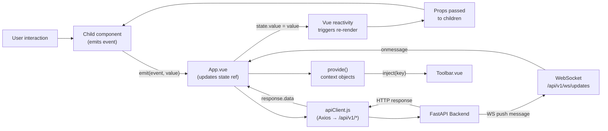
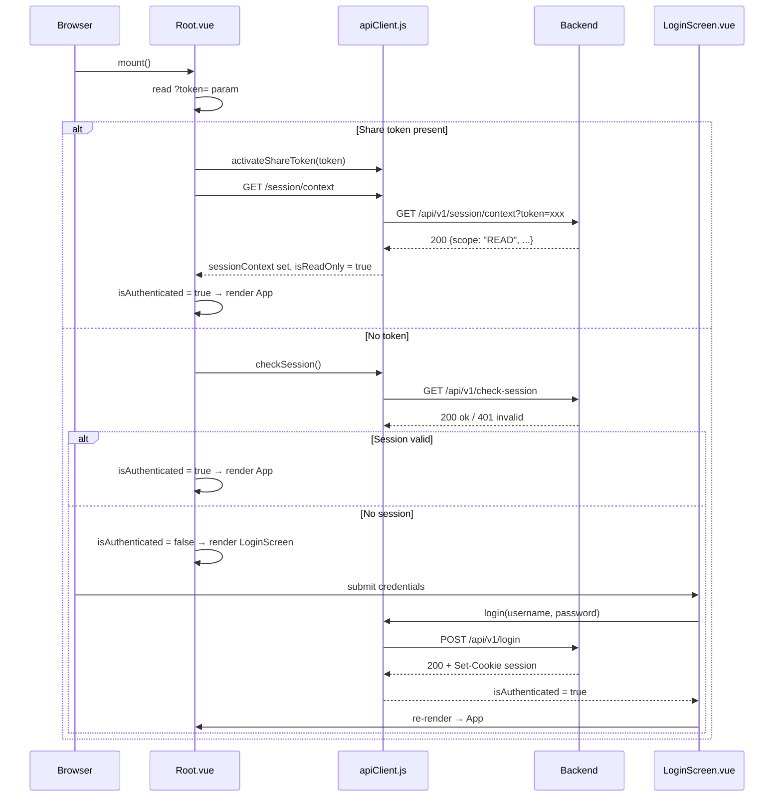
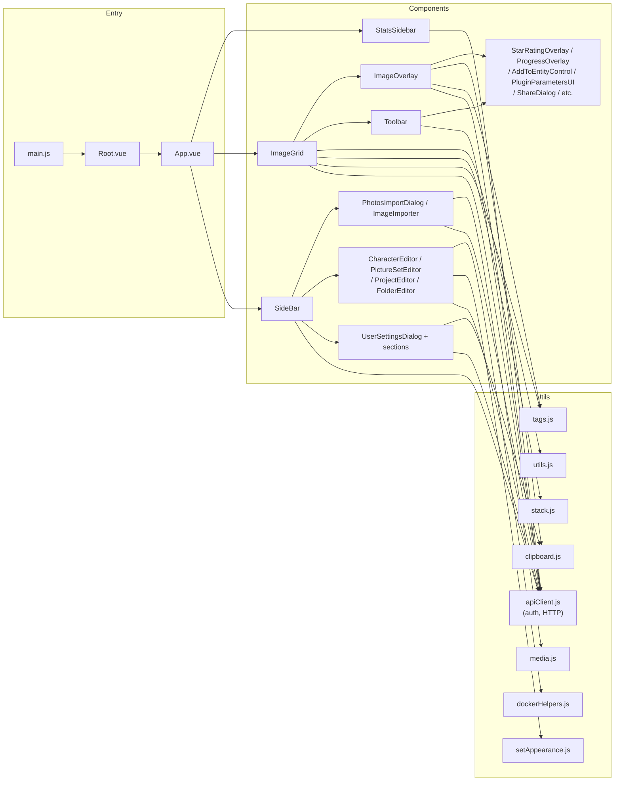
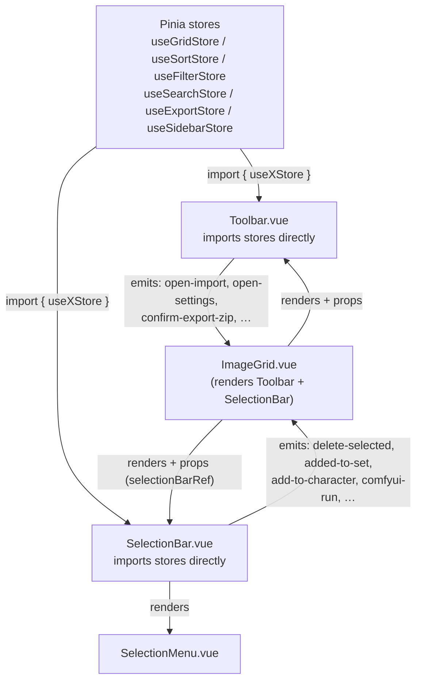

# PixlStash Frontend Architecture

> **Document purpose:** Synthetic reference database of the Vue 3 frontend for Copilot and developers. Describes every component, utility, data-flow pattern, and design decision. Keep this document updated when making structural changes.

---

## Table of Contents

1. [Project Source Tree](#1-project-source-tree)
2. [Architecture Overview](#2-architecture-overview)
3. [Entry Points](#3-entry-points)
4. [State Management — Pinia](#4-state-management--pinia)
5. [Component Catalogue](#5-component-catalogue)
6. [Utility Modules](#6-utility-modules)
7. [Theming and Styling](#7-theming-and-styling)
8. [API Client and Authentication](#8-api-client-and-authentication)
9. [Real-time Updates (WebSocket)](#9-real-time-updates-websocket)
10. [Naming and Coding Conventions](#10-naming-and-coding-conventions)
11. [Build Configuration](#11-build-configuration)
12. [Mermaid Diagrams](#12-mermaid-diagrams)

---

## 1. Project Source Tree

```
frontend/src/
├── main.js                      # App bootstrap: Vuetify + Pinia setup, theme registration, mount
├── Root.vue                     # Auth gate: LoginScreen or App
├── App.vue                      # Root application shell: layout + WebSocket + sidebar/stats state
├── App.css                      # App-scoped CSS overrides
├── style.css                    # Global CSS reset and base rules
│
├── assets/
│   ├── fonts/                   # Self-hosted fonts (if any)
│   ├── Google_Photos_icon_(2020-2025).svg
│   └── unknown-person.png       # Fallback avatar for unrecognised faces
│
├── styles/
│   ├── context-menu.css         # Shared CSS for native-style context menus
│   └── design-tokens.css        # Design-system tokens: spacing, radius, type ramp, elevation, motion, colour
│
├── stores/                      # Pinia stores (cross-component shared state)
│   ├── useViewStore.js          # route → view resolution: the app's ONE route watcher (see §4.5)
│   ├── useSelectionStore.js
│   ├── useFilterStore.js
│   ├── useSortStore.js
│   ├── useGridStore.js
│   ├── useExportStore.js
│   ├── useWsStore.js
│   ├── useUserPrefsStore.js
│   ├── useProjectStore.js
│   ├── useSidebarStore.js
│   ├── useSearchStore.js
│   ├── useSnapshotsStore.js
│   ├── useGenStackPrefsStore.js # remembered "stack generated/filtered output with source" prefs
│   ├── useLockedSetsStore.js    # which pictures are frozen by a locked picture set
│   ├── useReviewSessionsStore.js # tag-review sessions, health board, and sticker gamification
│   ├── useEntityNamesStore.js   # id→name maps for the ImageGrid breadcrumb
│   ├── useEntityListsStore.js   # the shared character/set/project LISTS (stale-while-revalidate)
│   ├── useOperationStore.js     # the undo/redo stack + the action receipt (backend §21)
│   ├── useDedupStore.js         # the duplicate triage queue, its live counts and the tier gate
│   └── useTasksStore.js         # active background work (workers + ComfyUI runs); app-wide activity light
│
├── composables/                 # Extracted logic composables (Phase 8.1 — complete)
│   ├── useVirtualScroll.js      # Virtualised scroll window calculation for ImageGrid (uniform 'square' grid + packed 'justified' rows)
│   ├── useJustifiedLayout.js    # Pure justified-row (Google-Photos-style) packing arithmetic used by useVirtualScroll (+ *.test.js)
│   ├── useMultiSelect.js        # Image multi-selection (shift-click, range, touch mode)
│   ├── useGridDragDrop.js       # Drag-and-drop reordering and import in ImageGrid
│   ├── useStackOrdering.js      # Stack expand/collapse, reorder, visual mapping in ImageGrid
│   ├── useGridFetch.js          # Grid image fetch state + all fetch/query-param functions
│   ├── useGridKeyboardNav.js    # Keyboard navigation and keyboard-driven actions for ImageGrid
│   ├── useGridRealtimeSync.js   # WebSocket picture-event decision table for ImageGrid (see §9)
│   ├── useBreadcrumb.js         # Current-view breadcrumb trail from route + id→name maps; shared by in-grid nav and TitleBar
│   ├── useReviewRoute.js        # URL ⇄ tag-review overlay (`?review=…`); mirrors ImageGrid's `?overlay=` mechanics (+ *.test.js)
│   ├── useActionReceipt.js      # The receipt contract (wording, keycaps, drain, pause, focus) shared by the grid pill and the lightbox's own narration
│   ├── useVersionCheck.js       # "New version available" check (pixlstash.dev poll); single owner gated by `enabled`
│   ├── useSidebarExpansion.js   # Which sidebar sections / projects / folders are open; localStorage-backed (+ *.test.js)
│   ├── useDedupQueueKeyboard.js # The duplicate queue's key model, as a dependency-injected factory (+ *.test.js)
│   ├── useDedupRowExpansion.js  # The queue row's one stack-expansion band: the "one open, on the focused row" invariant + the lazy member read (+ *.test.js)
│   ├── useMixedStackQueue.js    # The Mixed stacks queue's view state: focus, selection, stranger marks and the member cursor (+ *.test.js)
│   ├── useOneTimeNotice.js      # A notice shown once per browser and then never again; localStorage-backed (+ *.test.js)
│   └── useSubmitGuard.js        # One in-flight submit at a time + the `pending` flag its button wears — see §10.2 (+ *.test.js)
│
├── api/                         # Backend resource modules: the only place URL strings live (see §8)
│   ├── config.js                # Per-user config blob: GET/PATCH /users/me/config
│   ├── serverConfig.js          # Server-wide config topics under /server-config/
│   ├── users.js                 # /users/me/* — account, tokens/share links, watermark
│   ├── session.js               # /session/context — the current credential's scope
│   ├── workers.js               # /workers/progress — background-worker poll
│   ├── snapshots.js             # /snapshots + restore/preview sub-resources
│   ├── reviews.js               # /reviews — tag-review session bookkeeping
│   ├── tagSuggestions.js        # /tag_suggestions — per-card review decisions
│   ├── tagHealth.js             # /tag_health — board rows + cache rebuild
│   ├── comfyui.js               # /comfyui/* — workflows, run, recipe read/replay, abort
│   ├── taggers.js               # /taggers, /tagger/label-thresholds
│   ├── folders.js               # /reference-folders, /import-folders, /filesystem/*
│   ├── characters.js            # /characters + faces + reference pictures
│   ├── projects.js              # /projects + membership
│   ├── pictureSets.js           # /picture_sets + membership + locked members
│   ├── tags.js                  # /tags, /pictures/{id}/tags, tag predictions
│   ├── pictureImport.js         # streaming-staging import session (was useImportService)
│   ├── operations.js            # /operations — the undo/redo log, undo-state, undo/redo
│   ├── stacks.js                # /stacks — create, order, members
│   └── pictures.js              # /pictures — reads, count, stream, searches, stats
│                                # every module has a co-located *.test.js
│
├── utils/
│   ├── apiClient.js             # Axios instance, auth state, session/token helpers
│   ├── characterCreateFlow.js   # Pure helpers for the context-menu create-person flow: default naming + face-vs-picture assignment choice (+ *.test.js)
│   ├── clipboard.js             # Cross-browser clipboard write helper
│   ├── descriptions.js          # Pure helpers for picture-description formatting/normalisation
│   ├── dockerHelpers.js         # Pure helpers for Docker volume/mount path building
│   ├── keepCoverOnly.js         # Keep-cover-only: the copy + the two selection computations, pure (+ *.test.js)
│   ├── media.js                 # File extension lists, file-type predicates, drop-target helpers
│   ├── setAppearance.js         # Picture-set icon/colour palette constants (kept in sync with backend)
│   ├── sidebarCounts.js         # Which count field the sidebar reads per view mode, pure (+ *.test.js)
│   ├── snapshots.js             # Snapshot kind→chip-colour and relative-date helpers (shared by snapshot UIs)
│   ├── stack.js                 # Pure stack-ordering and leader-selection utilities
│   ├── tags.js                  # Tag normalisation, deduplication, penalty scoring
│   └── utils.js                 # Date formatting, score toggle, stack colours, ComfyUI error parsing
│
├── router/
│   └── index.js                 # Vue Router config: app routes + history mode
│
└── components/
    ├── TitleBar.vue             # Shared library chrome plus Electron title bar: active-library entry point, breadcrumb, window controls, update alert
    ├── WordmarkLogo.vue         # "PixlStash" brand wordmark in the Tiny5 pixel font (two-tone via --wordmark-accent)
    ├── views/       # Full-page / full-screen UI surfaces: ImageGrid, ImageOverlay + extracted OverlayTagsPanel/OverlayDescriptionPanel/OverlayMetadataPanel/OverlayFilmstrip, ReviewSessionsOverlay, DuplicateQueue, ModelShelf, LoginScreen
    ├── panels/      # Large structural panels that form the app shell: SideBar, Toolbar + extracted TbTagPanel/TbComfyPanel/TbExportPanel/TbImportPanel/GbFilterPanel/UndoControl, SelectionBar, SelectionMenu, StatsSidebar, ProjectFiles, …
    ├── reviews/     # Tag-review surfaces (see below)
    │   ├── ReviewSessionView.vue      # One open review session: header, rail, and card queue
    │   ├── ReviewRail.vue             # Rail of open review sessions
    │   ├── ReviewBinaryCard.vue       # Single-tag accept/dismiss decision card
    │   ├── ReviewPairCard.vue         # Twin/near-duplicate pair decision card
    │   ├── ReviewDecisionBar.vue      # Accept/dismiss/fix/undo action bar
    │   ├── ReviewCelebration.vue      # Session-complete celebration
    │   ├── ReviewArchivedReceipt.vue  # Archived-session summary receipt
    │   ├── ReviewSticker.vue          # Die-cut sticker award (vocabulary from setAppearance.js)
    │   ├── NewReviewDialog.vue        # "Start a review" tag + scope picker
    │   ├── TagHealthBoard.vue         # Landing tag-health board
    │   └── tagHealthBoardLogic.js     # Pure board estimate/threshold helpers (+ *.test.js)
    ├── editors/     # Entity create / edit / delete dialogs
    ├── settings/    # UserSettingsDialog, its section sub-components (Appearance, Behaviour, SmartScore, Workflows, Account, Snapshots, Compute), and the Settings* layout primitives (SettingsRow, SettingsSection, SettingsChip/ChipGrid, SettingsFieldBlock, SettingsSliderRow, SettingsTwoCol, SettingsInfoCard, SettingsAddTagRow)
    ├── io/          # Import / export / external-service connection, ComfyUiRunner, RemixDialog
    └── widgets/     # Reusable primitives, including the App* design-system layer (AppButton/AppDialog/AppInput/AppSelect/AppStepper/AppTextarea + FieldLabel), the two undo receipts (ActionReceipt over the grid, OverlayActionReceipt inside the lightbox), the Dedup* family (the duplicate queue's row, the picture strip both queue rows are built on, compare dialog, auto-stack dialog, tier menu, the shared threshold control, scan banner, scope pill, why-pills and confidence pill), `MixedQueueRow` (one row of the Duplicates destination's third page, which is a queue of its own), `KeepCoverOnlyDialog` (the one consent for collapsing stacks to their covers; see §5 "Confirming a destructive action"), and the Stack* family (badge, edge ticks, expansion strip)
```

---

## 2. Architecture Overview

| Concern | Choice |
|---------|--------|
| Framework | Vue 3 (Composition API, `<script setup>`) |
| UI component library | Vuetify 3 |
| State management | **Pinia** — 21 domain stores in `src/stores/`; `App.vue` owns only UI-shell state |
| HTTP client | Axios (singleton `apiClient`) |
| Routing | **Vue Router 4** (`createWebHistory`). `Root.vue` gates on `isAuthenticated`; all authenticated views (`/`, `/character/:id`, `/set/:id`, `/project/:id`, `/scrapheap`, `/duplicates`) render `App.vue` via `<RouterView>`. `useViewStore` owns the app's single route watcher and syncs params to Pinia stores (§4.5); `App.vue`'s nav handlers call `router.push()` to update the URL. `/duplicates` is deliberately NOT a grid view: `parseRouteView` returns `null` for it, so the selection stores keep whatever the user was looking at. **The route is the single source of truth for what the grid shows** — only explicit entry clicks push routes; sidebar tab/category switches never do (see Key Design Principles). |
| Build tool | Vite 5 |
| Unit tests | Vitest (jsdom environment) — test files co-located as `*.test.js` in `utils/` |
| End-to-end tests | Playwright (`frontend/e2e/`) — drives the real SPA against a backend booted on a throwaway copy of the `test-data/` fixture. See `frontend/e2e/README.md`. |
| Icons | Material Design Icons (`@mdi/font`) |

### Key Design Principles

- **Pinia for cross-component state.** All state shared across more than one component lives in a Pinia store in `src/stores/`. `App.vue` owns only layout-shell state (sidebar/stats visibility, pending import counts) that is not consumed anywhere else.
- **Sidebar tabs are stateless; the route is the single source of truth for the grid view.** Switching a sidebar tab/category (People / Sets / Projects / Folders, and the Global ↔ Project mode) is a *pure sidebar-display* operation: it only changes which list of entries the sidebar renders. It must **not** call `router.push()`, must **not** emit any `select-*` / navigation event, and must **not** write to the filter / selection / sort / grid stores. The grid keeps showing whatever the current route resolves to. Only an explicit **entry click** (a specific character / set / project) navigates, via `router.push()`. This decoupling is what lets a user stay on a global view, switch to the Projects tab purely to reveal its entries as **drop targets**, and drag the current selection onto a project or one of its characters without losing the view they found the pictures in. See [§5 → SideBar.vue](#sidebarvue-6989-lines).
- **Composables for reusable logic.** Complex logic extracted from mega-components lives in `src/composables/` as `useX()` functions. Composables accept dependencies as parameters and are independently unit-testable.
- **Flat component structure.** All components sit directly in `src/components/` with sub-directories by domain (`views/`, `panels/`, `editors/`, `settings/`, `io/`, `widgets/`). Shared presentational sub-components (e.g. `StarRatingOverlay`, `ProgressOverlay`) live in `widgets/`.
- **Utilities are pure functions.** Every file in `src/utils/` exports only plain functions and constants; none hold reactive state themselves (except `apiClient.js`, which holds `isAuthenticated`, `sessionContext`, and `isReadOnly`).
- **`<script setup>` everywhere.** All components use the Composition API with `<script setup>` syntax. Options API is not used anywhere.

---

## 3. Entry Points

### `main.js`

Bootstraps the app:
1. Imports global CSS (`vuetify/styles`, MDI icons, `style.css`, `context-menu.css`).
2. Creates a Vuetify instance with two custom themes: `pixlStashLight` and `pixlStashDark` (full custom colour tokens — sidebar, toolbar, accent, primary, input-background, etc.).
3. Creates the Vue Router instance (imported from `src/router/index.js`).
4. Mounts `Root` as the top-level component.

### `Root.vue`

Authentication gate rendered before `App`. On mount:
1. Reads `?token=` query parameter — if present, calls `activateShareToken()` and validates via `GET /session/context`. Valid → sets `isAuthenticated = true` and `sessionContext`.
2. Otherwise calls `checkSession()` (a `GET /check-session` request).
3. Shows `LoginScreen` when `isAuthenticated` is false; shows `<RouterView>` (which renders `App.vue`) when true.
4. Renders a blank `root-loading` div during the async check.

### `App.vue`

The application shell. Responsibilities:
- Owns **layout-shell state** only: sidebar/stats visibility. All domain state has moved to Pinia stores; the pill ids live in `useWsStore`.
- Owns **route pushing** (`pushAppRoute` / `pushRouteForCurrentSelection`) and calls `useViewStore().startRouteSync(route, { watch })` once. Reading the route back into stores is `useViewStore`'s job, not App.vue's (see §4.5).
- Renders the three-panel layout: `SideBar` | `ImageGrid` (+ `Toolbar`) | `StatsSidebar`.
- Manages the `PhotosImportDialog`.
- Owns the **WebSocket lifecycle only** (connect / reconnect / close / `set_filters`); the picture-event decision table is delegated to `useGridRealtimeSync` (see §9).
- Handles global keyboard shortcuts, window drag/drop, paste events. Undo/redo (`Ctrl+Z` / `Ctrl+Y` / `Ctrl+Shift+Z`, Meta accepted everywhere) lives in `handleGlobalKeydown` and declines in four cases, each for its own reason: while typing (a text field keeps its native undo stack), in a read-only session, on key auto-repeat (a held `Ctrl+Z` must not walk the stack), and while a modal **dialog** owns the screen — the receipt sits on `--z-floating`, under every dialog scrim, so an undo fired from there would mutate the library with no visible narration. See "Undo has three keyboard owners" below for the two surfaces that own the chord themselves.
- Fetches user config on startup (`GET /users/me/config`) and applies persisted preferences via the relevant stores.
- Persists sidebar/stats open state to `localStorage`.

---

## 4. State Management — Pinia

PixlStash uses **Pinia** for cross-component state. State is managed at three tiers:

### Tier 1: Pinia stores — cross-component shared state

All state consumed by more than one component lives in a Pinia store. The stores defined in `frontend/src/stores/` are:

| Store | File | Key State |
|-------|------|-----------|
| `useViewStore` | `useViewStore.js` | The route's parsed reflection: `view` (the resolved view descriptor) and `activeFolderKey`. Owns the app's **single route watcher** and is the only writer of route-derived selection/project state. Never pushes a route. See §4.5. |
| `useSelectionStore` | `useSelectionStore.js` | `selectedCharacter`, `selectedCharacterIds`, `selectedSet`, `selectedSetIds`, `selectedFolderFilter` |
| `useFilterStore` | `useFilterStore.js` | `mediaTypeFilter`, `minScoreFilter`, `maxScoreFilter`, `tagFilter`, `tagRejectedFilter`, `faceBboxFilter`, `sharedOnlyFilter`, `unassignedOnlyFilter`, etc. |
| `useSortStore` | `useSortStore.js` | `selectedSort`, `selectedDescending`, `sortOptions`, `similarityCharacterOptions`, `selectedSimilarityCharacter` |
| `useGridStore` | `useGridStore.js` | `columns`, `thumbnailSize`, `sidebarThumbnailSize`, `gridVersion`, `wsUpdateKey`, `showStars`, `showFaceBboxes`, `showProblemIcon`, `showStacks`, `stackThreshold`, `expandedStackCount`, `totalStackCount`, `compactMode`, `visibleRangeLabel` |
| `useExportStore` | `useExportStore.js` | `exportType`, `exportCaptionMode`, `exportResolution`, `exportTagFormat`, `exportIncludeCharacterName`, `exportUseOriginalFileNames`, etc. |
| `useWsStore` | `useWsStore.js` | `wsTagUpdate`, `wsPluginProgress`, `updatesSocket`; the per-tab `clientId` (`crypto.randomUUID()`, persisted under `pixlstash:clientId` in `sessionStorage`, in-memory fallback; mirrored into `apiClient` via `setRequestClientId`); the two pills' ids — `pendingExternalImportIds`/`sortChangedExternalIds` with computed `*Count` and `add*`/`clear*` setters |
| `useUserPrefsStore` | `useUserPrefsStore.js` | `checkForUpdates`, `hiddenTags`, `applyTagFilter`, `penalisedTagWeights`, `dateFormat`, `themeMode`, `sidebarWidth` (drag-resizable, clamped 120–300), `showKeyboardHint` |
| `useProjectStore` | `useProjectStore.js` | `projectViewMode` *(sidebar-display only — see below)*, `selectedProjectId`, `characterProjectIds`, `setProjectIds` |
| `useSidebarStore` | `useSidebarStore.js` | `sidebarDocked` (width pref), `sidebarPinned` (visibility pref), `statsOpen`, `sidebarForcedHidden`, `statsForcedHidden`, `characterMultiMode`, `setMultiMode`, `setDifferenceBaseId`; computeds `effectivePinned`, `effectiveDocked`, `sidebarVisible`, `sidebarOverlay` model the pin / dock / auto-hide behaviour (mobile `*ForcedHidden` overrides win). All localStorage access is try/caught. |
| `useSearchStore` | `useSearchStore.js` | `searchQuery`, `searchInput`, `searchHistory`, `isSearchActive`, `searchOverlayVisible` |
| `useSnapshotsStore` | `useSnapshotsStore.js` | `snapshots`, `loading`, `activeJob`, `error`, `dailySnapshotsEnabled`; drives the shared `RestoreConfirmDialog` hoisted in `App.vue` (`restoreDialogOpen`, `restoreDialogSnapshotId`, `restoreDialogResources`). Owns snapshot list load / create / restore and the snapshot WebSocket event handlers (called from `App.vue`). |
| `useReviewSessionsStore` | `useReviewSessionsStore.js` | Tag-review state: the tag-health board, the rail of open review sessions (each = one tag + frozen scope + one scan's results), and the per-session binary/pair card queues. Per-item decisions write through `/tag_suggestions`; session bookkeeping talks to `/reviews`, the board to `/tag_health`. Also owns the opt-in gamification — variable-ratio sticker awards with monotonic XP / level / streak counters; the sticker vocabulary is imported from `setAppearance.js` so sets and stickers never drift. |
| `useLockedSetsStore` | `useLockedSetsStore.js` | Which pictures are frozen by a locked picture set. Fed by `GET /picture_sets/locked-members`; refreshed on app start and on the same sidebar-refresh / `pictures_changed` ws triggers the sidebar uses. Single source of the lock-tooltip copy reused by the grid badge, overlay chip, and context-menu gating. |
| `useModelShelfStore` | `useModelShelfStore.js` | The model shelf's rows and its `Show` selection. `rows` are the raw `/adapters` + `/checkpoints` payload, **every block fetched so far rather than the shown set**: a fetch replaces the blocks it asked for and leaves the rest standing, because both option vocabularies (`adapterKindOptions`, `baseModelOptions`) are derived from `rows`, so an overwriting narrowed fetch deleted the kind checkboxes that unticking Adapters is documented to *grey*, and dropped base models that stayed selected and persisted with no box left to untick them. `visibleRows` layers the resolved name and the reduced location state on top and applies the kind and base-model narrowing **client-side**, so a multi-select base-model filter is not one request per option. `groups` sorts `visibleRows` client-side on the five ruled `SortKey` values and cuts them into one level of groups (`none` / `base_model` / `folder`), always returning at least one group so the flat and grouped lists are one piece of markup; sorting never refetches, because every field the keys read is already on the payload and three server-sorted blocks would be destroyed by the merge above. A row that cannot answer the key sorts last in BOTH directions, and the unset group sorts last whatever the direction. `view` (`groupBy`, `sortKey`, `sortDirection`) and the per-axis collapsed sets persist under `pixlstash:modelShelfView`, a SECOND key so `resetFilters` cannot take the sort order with it. `filters` (`adapters`, `adapterKinds`, `checkpoints`, `unclassified`, `engines`, `baseModels`) persists to `localStorage` under `pixlstash:modelShelfFilters` — not to `/users/me/config`, which is a fixed `User` model and would need a backend column. An empty `adapterKinds` / `baseModels` array means **unconstrained**, the standard multi-select convention and the only reading under which a fresh install shows anything. `activeCount` counts filter SECTIONS that deviate from their default, not ticked boxes, or a mild narrowing would read as `9`. Only the four top-level type toggles refetch, and they narrow client-side too; the rest only narrow what is already loaded. Each fetch takes the next `epoch` and only the newest may write `rows` or clear `loading`, so a slower earlier flight cannot land last and show adapters only while Checkpoints is ticked; `resetForSession` bumps the same counter, so a read on the wire when the credential changed is discarded. `ModelShelf.vue` watches `loaded` and refetches when a session reset clears it, which the store cannot do itself because session-reset handlers run *before* the new credential is installed. **Session reset drops `rows` but keeps `filters`:** the models are hub-side facts about this machine, but every row carries the characters and sets in the ACTIVE LIBRARY that use it, while the selection and the view axes are the user's own preferences and hold no ids. `offlineMounts` and the `New` badge's `newIds` are both derived here and both documented under §9.1a, "The two kinds of absence": `offlineMounts` reads `rows` rather than `visibleRows` on purpose, and `newIds` is a per-fetch id diff that only `fetchRows({ markNew: true })` fills and every other fetch clears. |
| `useModelFoldersStore` | `useModelFoldersStore.js` | The registered model folders and the scans running against them. Fetched when `ModelFoldersDialog` opens, not at startup: the dialog is its only reader. It is a **store rather than dialog state** because a scan outlives the panel that started it, and because `POST .../rescan` answers 202 as soon as the thread starts, so completion has to be waited for: the store polls `GET /model-folders` every 3s and treats `last_checked` advancing as done, then refreshes `useModelShelfStore` and says what landed. It **gives up after 10 minutes**, because the scanner logs an exception without stamping `last_checked` and a crashed scan is otherwise indistinguishable from a slow one. `forget` captures the row's fields BEFORE the request, which is what makes the notice's `Add it back` possible and therefore what lets removal skip a confirmation prompt. **Session reset drops it whole:** absolute host paths are owner-only, and a session that lost its credential has no standing to keep polling. |
| `useGenStackPrefsStore` | `useGenStackPrefsStore.js` | Remembered client prefs for whether newly generated / filtered images stack with their source: `stackI2IOutputs` (ComfyUI image-to-image) and `stackFilterOutputs` (plugin "Filters" runs), both default ON and persisted to `localStorage`. |
| `useEntityListsStore` | `useEntityListsStore.js` | The character / picture-set / project **lists** themselves (`characters`, `pictureSets`, `projects`) plus `fetchedAt` and `pending` per kind. One cache for the three surfaces that need them — the `SideBar` tree, the image context menu's Person/Set/Project flyouts, and the tag-review scope pickers. **Stale-while-revalidate:** a caller renders the cached list immediately and calls `refresh(kind)` *without awaiting it*, so opening a flyout never waits on the network; concurrent callers share one in-flight request (`inFlight`, modelled on `useDedupStore.scopeCounts`). `invalidate(kinds)` is **refetch-only** — a `characters_changed` ws event or a local assignment says "ask again", it never writes the store from a payload (`origin_client_id` is echo-matching, not authority; see §9 and integration_architecture.md §8.1). **These are `SCOPED_LIST` routes, so their content is an authorization decision:** the cache is in-memory only (never `localStorage`/`sessionStorage`), `reset()` drops it on every auth-context transition via the single `onSessionReset` chokepoint in `apiClient` (logout / login / share-token entry / vault switch), and an epoch guard discards any response that was in flight across that transition. Revalidate-on-open is mandatory rather than an optimisation: a share/scoped session receives no ws events (the stream is owner-only), so it is that session's only invalidation path. **The sidebar's row counts ride along on these lists (`include_counts=true`, issue #651):** every character row carries `image_count` and `project_image_count` (scoped to the character's OWN `project_id`, or to "in no project" when it has none) and every project row carries `image_count`, which is what replaced `SideBar.fetchSidebarData`'s one-`/{id}/summary`-per-row fan-out. They live on the shared list rather than in a second counts-bearing cache on purpose (two shapes for one entity would mean two caches, two invalidation paths and two epochs), and the flyout / scope-picker consumers simply ignore the extra fields. Because both scopes are on every row and neither depends on the sidebar's current project selection, one cached response serves both sidebar view modes. Distinct from `useEntityNamesStore`, which holds id→name maps only. |
| `useEntityNamesStore` | `useEntityNamesStore.js` | `characterNames`, `setNames`, `projectNames`, `refFolderLabels`, `importFolderLabels` (id→name maps). One-directional id→name only (names aren't unique). `SideBar` publishes via `merge*` setters after each fetch; `ImageGrid`'s breadcrumb consumes them to label the route's IDs. |
| `useOperationStore` | `useOperationStore.js` | The undo/redo stack, mirrored from the backend's append-only operation log (`backend_architecture.md` §21): `operations` (newest 50, newest first), `canUndo`/`canRedo`/`nextUndo`/`nextRedo` from `GET /operations/undo-state`, and the single live `receipt` that narrates what just happened. Computeds `past` (applied steps), `future` (undone, redoable), `historyCount`, `nextUndoIsExternal`. Owns the receipt's dwell timer (5s, 8s destructive, paused on hover/focus/hidden tab) and the multi-step `undoTo` walk. Refreshed on a debounced WS picture/tag/character/description event; the receipt narrates THIS client's operations only (origin read from the event `data`), so another tab's work updates the stack silently. |
| `useLibrariesStore` / `useLibrarySwitchStore` | `useLibrariesStore.js` | Owner-only app-level library identity and the switch state machine. `App.vue` fetches the registry on owner startup; Settings refreshes the same store whenever its Libraries pane opens. `activeLibrary` therefore drives the Active row, the shared browser/Electron `TitleBar` entry point, and the document title from one response. Share/read-only sessions never make this request and receive no library name in chrome. A confirmed switch moves the second store to `switching`, lets Vue render the persistent alert dialog and apply `inert` to the entire `VApp`, then posts the UUID. Since Vuetify dialogs teleport beside the app root, `inertSiblingOverlays` also inerts every already-open overlay except the switch modal. Success reloads the document; failure keeps the old library, names both target and retained library, and the sole Stay action restores focus to the invoking row. |
| `useDedupStore` | `useDedupStore.js` | The duplicate triage queue. `openCount` (the sidebar badge), `byTier` (the per-tier split, including tiers that are switched off), `scopeCounts` (the per-object counts the context menus read, cached and de-duplicated while in flight), `scan` (normalised from the server's picture and bucket counters; the percentage is derived here because the server publishes none), `groups` + `windowStart` + `total` + `hasMore` (a contiguous WINDOW of the confidence-descending queue, absolute indices, never loaded whole), `focusIndex` (+ `focusStart`/`focusEnd`/`loadPrevious`/`cancelEndChase`/`endChaseActive`, the one-press random-access End jump onto the tail page and its upward backfill — see §9.2), the per-group `coverChoices` / `exclusions` keyed on signature, and the tier gate (`nearEnabled`, `embeddingEnabled`, `threshold`) whose bounds all come from `GET /dedup/policy`. Owns the verdicts and the auto-advance: resolving a group removes its row and the focus lands on the next open group. Every verdict is recorded server-side (`dedup.stack`; `dedup.keep_separate` since the owner's 2026-07-30 override of #644), so receipts and `Ctrl+Z` come from `useOperationStore` — triggered from the verdict response, gated on its always-populated `batch_id` (see §9.2); against an older backend whose keep-separate returns no `batch_id`, the narration degrades to the transient notice pointing at the **Decided page** (owner call, 2026-07-29 — this replaced the sticky Reopen notice). `showingDecided` / `toggleDecided` flip the queue to `GET /dedup/groups?decided=true`: resolved groups with their live verdict, each row swapping its verdict buttons for a verdict label and a **Clear decision** action (`POST /dedup/verdicts/reopen` — never touches pictures; a reopened stacked group stays stacked until unstacked from the Stacks view). Verdicts and multi-select are inert on the decided page, and its empty state carries its own way back since the header toggle unmounts with the list. **Multi-select (owner request, 2026-07-29):** Ctrl/Cmd+click toggles a group in and out of a selection, Shift+click ranges from the anchor, plain click clears — the grid's own conventions. A verdict on any selected group applies to the whole selection (`verdictTargets`); a bulk stack shares ONE `cli-` batch id so a single Ctrl+Z reverses the gesture, and a bulk keep-separate narrates once for the whole gesture. The bulk scope is stated twice — a header chip ("N groups selected — Stack and Keep separate apply to all") and the verdict buttons themselves rename ("Stack N groups" / "Keep N separate") — because a bulk action must never look like a single one. Escape clears the selection without costing the focus; a reload (scope, tier, rescan) clears it too, since it would silently point at different rows. **`openQueue` is the scan trigger**: the group cache only fills when a scan runs, so opening the queue queues one (`POST /dedup/scan`) and the queue opens over whatever exists while the banner streams — without this the queue reads an empty cache forever, whatever the tier gate says. Loosening the policy (enabling a tier, lowering the threshold) rescans too; narrowing only re-queries. While a scan is `pending`/`running` the store polls counts every 2s and reloads the group list **only while it is empty**, so the first finds surface on their own and a triage in progress is never yanked to the top. |
| `useTasksStore` | `useTasksStore.js` | `workerSnapshots`, `series` (per-worker throughput history), `systemUsage` (CPU/RAM/VRAM), `comfyuiRuns` (frontend-driven run progress keyed by run id); computeds `activeEntries` (backend workers + ComfyUI runs, merged), `hasActiveTasks`, `activeCount`. The **single poller** of `GET /workers/progress` (adaptive cadence — see §4.4) and the single source of truth for the app-wide "is the app working" indicators. |

Components import stores directly (`import { useFilterStore } from '../../stores/useFilterStore'`) — no prop drilling required.

### Tier 2: Component-local state

Sub-components that manage independent data (e.g. `AccountSection`, `SmartScoreSection`, `StatsSidebar`) own their own refs and fetch their own data. They receive an `open: Boolean` prop (or equivalent) and trigger data loads via `watch(() => props.open, ...)`.

### Tier 3: Template-ref imperative API

`App.vue` holds refs to `SideBar` (via `sidebarRef`) and `ImageGrid` (via `gridContainer`) and calls `defineExpose`'d methods on them:

**`SideBar` exposes:** `refreshSidebar()`, `openSettingsDialog()`, `startLocalImport()`, `currentProjectId`, `openCurrentSelectionEditor()`

**`ImageGrid` exposes:** `gridEl`, `onGlobalKeyPress()`, `updateVisibleThumbnails()`, `expandAllStacks()`, `collapseAllStacks()`, `exportCurrentViewToZip()`, `getExportCount()`, `removeImagesById()`, `clearFaceSelection()`, `runComfyuiOnGridImages()`, `hasCursorFocus`

### 4.4 Task activity and the app-wide activity indicators

`useTasksStore` is the one place that knows "what is the app working on right now," and the only component that polls `GET /workers/progress`. Two kinds of work merge into its `activeEntries` list:

- **Backend workers** (quality scoring, tagging, embeddings, faces, likeness, folder scans…) — fetched from `/workers/progress`. The store accumulates per-worker throughput `series` and applies the same grace-period active-state logic the Tasks tab used to own.
- **ComfyUI runs** — frontend-driven (each `ComfyUiRunner` talks to ComfyUI's own WebSocket), so they can't be polled. Every runner instance mirrors its `progress` reactive into the store via `setComfyuiRun(runId, …)` / `clearComfyuiRun(runId)`, and registers an abort handler so the Tasks-tab row can cancel a run that lives in a different component (`ImageGrid` / `ImageOverlay`).

**Adaptive poll.** `App.vue` calls `tasksStore.startPolling()` on mount (and `stopPolling()` on unmount) so the indicators are live app-wide, not only while the Tasks tab is open. The store self-throttles: paused while `document.hidden`, ~2 s when the Tasks tab is open or work is active, ~5 s when merely idle-watching. Share / read-only sessions skip the fetch (the endpoint is owner-only). This is the only always-on background poll in the app.

**Consumers (deny nothing, just read):**
- `StatsSidebar` renders the **Tasks tab** purely from `tasksStore.activeEntries` — backend workers as a throughput sparkline + rate, ComfyUI runs as a progress bar + abort. It owns only the canvas drawing and label formatting now; it no longer fetches or polls. Its **Tasks-tab button pulses** when `hasActiveTasks`.
- `Toolbar`'s **stats toggle** shows a pulsing activity dot when `hasActiveTasks`, so background work is visible even with the stats sidebar collapsed.
- `ComfyUiRunner` retired its inline in-progress banner (progress now lives in the Tasks tab). It still renders an **inline banner for the failed state only**, so an error is never buried in a collapsed sidebar.

All indicator animations honour `prefers-reduced-motion: reduce`.

### 4.5 Route → view resolution (`useViewStore`)

The route is the single source of truth for what the grid shows (§2). `useViewStore` is the one place that turns the URL into the selection/project state the grid renders, and the only writer of that state from the route.

It is split in two so the URL contract is testable on its own:

- **`parseRouteView(route)`** is pure. It resolves a route to a *view descriptor* (project scope, selected character/characters, selected set/sets, multi modes, difference base, category label, folder key), or `null` for a route the grid is not driven from. Every URL shape the router declares is unit-tested here (`useViewStore.test.js`), with no router, grid, or mounted App.
- **`applyRoute(route)`** writes the descriptor into `useSelectionStore` / `useProjectStore`. Idempotent by construction: values that have not changed are not written, and the character guard compares stringified ids because the id space mixes numbers with the `ALL` / `UNASSIGNED` / `SCRAPHEAP` pseudo-ids.

**`startRouteSync(route, { watch })` installs the app's one and only route watcher**, called once from `App.vue`. `watch` is injected (same pattern as `useReviewRoute`) so the watcher is created in App.vue's effect scope and dies with it, and so the store stays testable. Two rules keep the seam honest:

- The store **never pushes a route**. Route *pushing* stays in `App.vue` (`pushAppRoute` / `pushRouteForCurrentSelection`), next to the nav handlers that own navigation decisions.
- Folder routes (`ref-folder` / `import-folder`) deliberately do **not** clear `selectedFolderFilter`. The sidebar owns that payload and emits `select-folder` once the folder has loaded, so the route must not wipe what the sidebar just set.

**`?stack_state=` is the one filter the route owns**, and it is **additive only**: an absent or unrecognised value resolves to `null`, which means "leave `useFilterStore.stackStateFilter` alone". Resetting it on every route tick would silently clear a filter the user set in the filter panel the moment they navigated anywhere, which no other filter does. It exists because the Duplicates queue-clear screen routes to All Pictures with the stacked filter applied (`docs/design/keep-cover-only.md` → "The route from Duplicates"), and that destination has to be reloadable and Back-able rather than a state only one click can produce. It is read for every grid route, not just `/`. Adding a second route-owned filter is a design decision, not a copy-paste: the store is otherwise the writer of selection/project state only.

**The URL cannot grant a project scope the credential does not have.** `applyRoute` narrows the parsed descriptor through `scopeProjectToSession` before writing it: a credential with a `resource_type` takes its project scope from the **token**, never from the URL — `project` → its own project (whatever project the URL names), everything else (`character` / `picture_set` / `picture`) → global mode with no project id. An owner session and a whole-library READ share both have **no** `resource_type` and are left exactly as the URL says; narrowing them would be over-blocking, since the backend places no project restriction on either (`visible_project_ids` returns `None`).

This exists because a share link inherits whatever pathname the owner minted it from — Settings is a dialog, not a route, so `AccountSection.shareUrl` builds `/project/5?token=…` from `window.location.pathname` (issue #717). Without the narrowing the recipient's grid sends `project_id=5`, which the AuthzGate refuses for a character/set token (empty visible-project set), and the grid comes back empty with nothing said to the owner. It lives **here rather than in `App.vue`'s mount-time scoped-session block** for two reasons: this store is the single writer of the grid's project scope, and a mount-time write loses to the next route tick (Back onto the shared link would re-break it). `App.vue`'s block keeps normalising what is *selected*. Both directions are covered in `stores/scopedSessionProjectScope.test.js`, which asserts the query string on the wire and pins the mount ordering the defect depended on.

The Phase 0 pin specs `route-as-truth.spec.js` and `stateless-tabs.spec.js` characterise the user-visible half of this contract.

### 4.6 Auth-context transitions — the session-reset chokepoint

Logout is a **reactive flip in the SPA, not a page reload**, so Pinia module state survives a logout → login on the same tab. Any store that caches data from a scope-aware endpoint would therefore render one credential's data under the next one (CWE-524). Issue #655 closed that class; this section is the contract it left behind.

**One mechanism, not one per store.** `utils/apiClient.js` owns it:

- `onSessionReset(handler)` registers a handler and returns an unsubscribe.
- `notifySessionReset(reason)` runs every handler synchronously, then clears the transport's own identity (`_shareToken`, `sessionContext`).

It fires from exactly three places today — `logout()`, `login()` and `activateShareToken()` — and a store never detects a credential change itself. A store that had to would eventually miss one.

**Ordering is load-bearing, in both directions.** Handlers run *before* `_shareToken` / `sessionContext` are cleared, because a handler may read `sessionContext` while deciding what to drop (`useEntityListsStore.canFetch`). And `activateShareToken()` announces the transition *before* assigning the new token, so the clear cannot wipe the token it just set.

**The rules for a store that caches server data:**

1. Register `reset()` on the chokepoint, and unregister with `onScopeDispose`.
2. `reset()` bumps an **epoch**, and every read tags itself with the epoch it started in. Clearing state alone leaves the store empty for a few hundred milliseconds and then quietly refilling with the previous credential's rows — the same leak with a delay on it.
3. `reset()` also stops **timers** and clears **in-flight/dedup bookkeeping**, so nothing re-enters the store after the clear and no caller can join a request belonging to the previous session.
4. The cache is **in-memory only**. It must never reach `localStorage` / `sessionStorage`, where it would outlive the credential that produced it. Genuine view preferences (the dedup thumbnail size, the review overlay's sticker shelf) are exempt — they carry no authorization decision.
5. Caches are **refetch-only**: nothing here is ever patched from a WebSocket payload (`origin_client_id` is echo-matching, never authority — integration_architecture.md §8.1).

**Completeness is arithmetic, not judgement.** `stores/sessionReset.test.js` holds the store matrix: every file matching `stores/use*.js` must appear either in its reset table or in its documented `NO_SERVER_DATA` exemption list, and a store in neither fails the test. That is the frontend counterpart of the backend's `test_all_routes_declare_access_policy` guardrail. It asserts **both directions** — empty the instant the context changes, *and* repopulating on the next read — because over-blocking is its own regression.

**The vault switch does not exist yet.** `useEntityListsStore` and `apiClient` name it as a covered transition; multi-library is v1.9 Lane E. `notifySessionReset` is exported so that **whoever builds the vault switch calls it at the switch site** — every registered store then drops its cache for free, and nothing has to be revisited store by store.

---

## 5. Component Catalogue

### Layout and Shell

#### `Root.vue` (58 lines)
Auth gate. Renders `LoginScreen` or `App` based on `isAuthenticated`. Handles `?token=` share links on mount.

#### `App.vue` (640 lines)
Application shell. Owns all global state. Renders `SideBar` + `ImageGrid` + `StatsSidebar`. Manages WebSocket, keyboard shortcuts, window drag/drop, paste, config loading, export, update checks.

#### `TitleBar.vue` (546 lines)
Shared application chrome. In a plain browser it renders a compact owner-only active-library control that deep-links to Settings › Libraries; in Electron that control is part of the custom title bar alongside the `WordmarkLogo`, the breadcrumb trail (`useBreadcrumb`), the app version, the "new version available" / security update alert (`useVersionCheck`, with `enabled = Boolean(desktop)` so exactly one owner runs the check), and the OS window controls (minimize / maximize / close, hidden on macOS where the OS draws them). All desktop calls go through `window.pixlstashDesktop?.…` optional chaining, so they no-op in a plain browser. Share/read-only sessions receive neither the library name nor its entry point. Props: `installType`, `checkForUpdates`, `activeLibraryName`, `showLibraryChrome`; emits `open-libraries`.

#### `WordmarkLogo.vue` (30 lines)
Presentational "PixlStash" brand wordmark in the Tiny5 pixel font (replaced the prior SVG outline). "Pixl" uses `currentColor`; "Stash" uses `var(--wordmark-accent, currentColor)`, so a caller that sets only `color` gets a single-tone wordmark and one that also sets `--wordmark-accent` gets the two-tone split. Sized via `font-size` on the host. No props.

---

### Large Stateful Components

#### `ImageGrid.vue` (7933 lines)
The core image display engine. Responsibilities:
- Virtualised grid scroll with dynamic thumbnail sizes (via `useVirtualScroll`).
- Fetches images from `GET /pictures` with all filter params as query args.
- Manages stacks: collapsing/expanding, leader-map calculation, inline stack drag-sort (via `useStackOrdering`).
- Multi-selection (shift-click, keyboard navigation with arrow keys) (via `useMultiSelect`).
- **Segment (object detection)**: the context menu's "Segment" item emits `segment`; `ImageGrid` opens a small dialog for an optional label phrase and `POST`s `/pictures/detect` with the selected ids (empty phrase → dense detection). Progress shows in the task manager; the overlay refreshes on the resulting `changed_pictures` event.
- Image scoring (guest and authenticated star rating).
- Drag-and-drop reordering within sets (via `useGridDragDrop`).
- Integrates `ImageOverlay`, `ImageImporter`, `Toolbar`, `ImageGridContextMenu`, `EmptyScrapHeap`, `ComfyUiRunner`.
- Emits: `open-overlay`, `refresh-sidebar`, `clear-search`, `reset-to-all`, `search-all`, `update:selected-sort`, `update:stack-stats`, `import-started`, `import-ended`, `clear-multi-selection`, `update:character-multi-mode`, `update:set-multi-mode`, `update:set-difference-base-id`, `update:embed-watermark`, `update:visible-range-label`, `load-pending-imports`
- Key props: `thumbnailSize`, `columns`, `selectedCharacter`, `selectedSet`, `searchQuery`, `selectedSort`, `wsTagUpdate`, `wsPluginProgress`, `gridVersion`, `wsUpdateKey`, `publicUrl`, `embedWatermark`, + all filter props.

##### The four grid fetch modes, and the character face search

`useGridFetch` picks one branch per fetch (`fetchMode`): `likeness-groups`, `character-face-search`, `face-likeness-search`, `reverse-image-search`, `text-search`, or `stream`. The first five build an **ordered id list** and re-read the pictures by id, because the ranking *is* the result and a plain id-list read does not preserve order.

**`character-face-search` — "Suggest more pictures of &lt;person&gt;" (#636).** Launched from the sidebar's person context menu (`SideBar` → `suggest-pictures-for-character` → `App.handleSuggestPicturesForCharacter` → the grid's exposed `suggestPicturesForCharacter`, the same Tier-3 route as `confirmEmptyScrapheap`). It queries `POST /pictures/face-search?source_character_id=…&exclude_character_id=…`, i.e. the person's reference faces, minus the pictures already assigned to them.

- **State**: `faceSearchCharacter` (`{id, name}`, null when inactive), `faceSearchThreshold` (default **0.7**, the same cut `SourceFaceLikenessTask.SIMILARITY_THRESHOLD` already uses for "same person"; a second UI-local number would drift from it), `faceSearchMinRefs` (default **1**, which is what `combine=max` gives on its own, so the knob starts where the search has always been and only ever tightens), `faceSearchArmedView`, and `faceSearchRanked` (`{characterId, matches, rowsById}`).
- **The ranked list and its picture rows are both cached**, so moving **either** knob **re-cuts the same list with no network call**. The request sets `include_reference_scores`, so each match carries `reference_likeness` (the winning face's similarity to every reference) and the agreement knob is a client-side count over that row rather than a server-side k-of-n, which would put a round trip under a drag. Both knobs are in the fetch key (a rebuild that early-returned as a no-op would leave the grid disagreeing with the count), and the rebuild is debounced 200ms while the count in the bar updates synchronously from `faceSearchMatches`.
- **One cut, two callers.** `utils/faceSuggestionCut.js` owns `cutFaceSuggestions` / `agreeingReferenceCount` / `referenceFaceCount`, and both the grid rebuild (`useGridFetch`) and the pill's count (`faceSearchMatches`) go through it. A count that disagrees with the grid under it is the bug that file exists to prevent. It falls back to the combined `likeness` when `reference_likeness` is absent (older server), which keeps `minRefs = 1` behaving exactly as before.
- **It is not a character-scoped *view***, and `faceSearchCharacter` is deliberately independent of `props.selectedCharacter`. But since 2026-07-30 a view change **does** drop it (owner call). Leaving it up meant navigating elsewhere and still being shown suggestions for a person with a bulk Assign armed, reading as the new view's contents; navigation is the ordinary way out of a mode. It compares against `faceSearchArmedView`, the view snapshotted when the search was armed, rather than firing on any change: opening the sidebar's person menu can itself select that person, and that selection lands around the same click that arms the search.
- **The clearing runs inside the view-change watcher, immediately before its refetch, and must never be moved to a watcher of its own.** `fetchAllGridImages` picks its `fetchMode` synchronously (no `await` precedes the read), and Vue runs pre-flush watchers in creation order, so a clearing watcher declared after the fetching one loses every time: the fetch re-issues the search that is still armed, and the later clear then unmounts the pill. That combination shipped briefly and looked like "the view does not change" — a grid full of the old search with no bar to explain or dismiss it. `dropSearchesForViewChange` carries the rule; `ImageGridSuggestionViewChange.test.js` asserts it on the wire.
- **After the assign, the search is re-run against the server (`force: true`), not pruned locally.** Two correctness reasons: `POST /characters/{id}/faces` is stack-atomic, so it can assign *more* pictures than were named (a suggestion's stack siblings would otherwise linger as un-assigned), and the fetch key is unchanged, so a non-forced call would be dropped by the 1200ms de-dup window. `operationStore.refresh()` then raises the "Assigned N pictures…· Undo" receipt, which is what lets this bulk write skip a confirmation dialog.

##### Entity-assignment refetch rule (set / project / character)

**An assignment refetches the grid only when the active view is scoped by the thing that changed.** Grouping membership is not part of the grid query in the global view, so assigning a picture to a set or project from **All Pictures** cannot change which pictures match or their sort position, and the card renders no set/project data, so a refetch there is pure churn (flicker, lost scroll position, lost selection). The three handlers each gate on their own view scope:

| Handler | Refetches / mutates the grid when |
|---|---|
| `handleSetProjectForSelected` (project) | `isProjectScopedView` (`projectViewMode === "project"`, including the `project_id=UNASSIGNED` pseudo-view). Mirrors `useGridFetch._appendSelectionParams`, the only place that appends `project_id`. |
| `handleOverlayAddedToSet` (set) | a set view where the removal drops the picture out of the view (overlap view, primary selected set), or the Unassigned view. An **add** never mutates the grid. |
| `App.handleImagesMoved` (sidebar drag-drop onto a set / project) | `kind === "reference-folder"` or an explicit `refresh: true`; otherwise only the Unassigned view removes cards. |

Every path still emits `refresh-sidebar` (the counts changed) and, under an open overlay, defers its grid work to `pendingOverlayGridRefresh` rather than restructuring the frozen filmstrip (§9.1), but only when a refetch was warranted in the first place, so a deferred redundant reload is not queued either. Regression coverage: `ImageGridProjectAssignRefresh.test.js` (both directions: no refetch in the global view, refetch still fires in the project view).

#### `SideBar.vue` (6989 lines)
Left navigation panel. Responsibilities:
- Tabs: People, Sets, Projects, Folders.
- Character list with face thumbnails, drag-drop assignment, inline create/edit.
- Set list with thumbnail stacks, drag-drop assignment.
- Project tree with expandable nodes (people + sets per project); project rows are drop targets — dropping grid pictures assigns them to that project (like character/set rows).
- Folder browser (import and reference folders).
- Settings dialog trigger, sort selector.
- Expansion state (People / Sets headers, the Folders-tab headers, per-project nodes and their People/Sets sub-sections, the reference-folder tree) is owned by `composables/useSidebarExpansion.js` and persisted client-side — see §10.1.
- Embeds: `ImageImporter`, `CharacterEditor`, `PictureSetEditor`, `ProjectEditor`, `FolderEditor`, `UserSettingsDialog`.
- Exposes: `refreshSidebar()`, `openSettingsDialog()`, `startLocalImport()`, `currentProjectId`, `openCurrentSelectionEditor()`
- Emits: 30+ events including `select-character`, `select-set`, `select-folder`, `update:public-url`, `update:theme-mode`, `update:sort-options`, `update:hidden-tags`, `toggle-dock`, `update:project-view-mode`, etc.

##### Sidebar tabs & drag-to-assign (stateless tabs)

The tab/category switch is **stateless** (see Key Design Principles). Concretely:

- **Tab state is sidebar-local display state only.** `sidebarPrimaryTab`
  (`'library' | 'folders'`) and `projectViewMode` (`'global' | 'project'`)
  select *which list the sidebar renders*. Switching them must not
  `router.push()`, must not emit a `select-*` event, and must not mutate the
  filter / selection / sort / grid stores. Folder-status polling is the only
  permitted side effect of a tab switch (it loads the data the tab displays).
- **Entry clicks are the only navigation.** Clicking a specific character /
  set / project emits the corresponding `select-*` event → `App.vue` calls
  `router.push()` → the route (the single source of truth) drives the grid.
  The grid is otherwise unaffected by tab switches.
- **Every entry is also a drop target.** Each character and set row (and the
  project entries) accepts a drop of the current grid selection
  (`application/json` payload via `dataTransfer`) to assign those pictures —
  `handleDragOverCharacter` / `dragOverSet` and siblings. Because switching a
  tab no longer disturbs the grid, the intended flow works end-to-end: find
  pictures on a global view → switch to the Projects/People/Sets tab → drag the
  selection onto a project or character to add them, with the global view still
  intact underneath.
- **A drop target judges the payload KIND during dragover, from `types` alone.**
  The JSON body is protected while a drag is in flight (`getData()` returns `""`
  in Chrome and Firefox), so the kind travels as the *key*: every internal drag
  writes `application/json` **plus** a marker type —
  `application/x-pixlstash-pictures` or `application/x-pixlstash-faces`
  (`utils/media.js`: `setInternalDragPayload`, `isPictureDrag`, `isFaceDrag`).
  A new payload kind adds a marker; it does not add a field to the body.
  Two rules follow, and both were once broken (issue #757):
  - **Never `@dragover.prevent` on a drop target.** The modifier calls
    `preventDefault()` before the handler body and regardless of what it
    decides, which accepts every drag on the page. `preventDefault()` belongs
    inside the handler, only for the kinds that row takes — `SideBar.acceptDrop`
    returns `accept` / `reject` / `ignore` (`ignore` = an external file drag the
    window-level importer still owns, so the row stays unpainted rather than
    promising a refusal it will not perform).
  - **A drop handler keys off `data.type`, never off the presence of
    `imageIds`.** A face payload carries `imageIds` too (the pictures the faces
    were found in), which is how face drags used to file themselves into sets.
    `readDraggedImageIds` returns nothing unless the payload is `image-ids`.
  A refused row shows the `.not-droppable` state (hatch + `mdi-cancel` glyph +
  `--opacity-disabled`, never colour alone), so rejection is visible during the
  drag instead of arriving as a toast afterwards.
- **Anti-pattern (do not reintroduce):** a tab/mode `watch` that emits
  `select-*`, pushes a route, or resets a filter. That recouples the sidebar to
  the view and breaks the drag-to-assign flow. Keep navigation in entry-click
  handlers only.

#### `ImageOverlay.vue` (4413 lines)
Full-screen image lightbox. Responsibilities:
- **Frozen navigation backbone (overlay-open deferral, see §9.1).** prev/next and the filmstrip read membership from a snapshot of `allImages` (`frozenAllImages`, captured on open and cleared on close) via the `overlayImages` computed, not from the live `allImages` prop. This keeps left/right working for the overlay's whole lifetime even after the current picture stops matching the active filter (e.g. the user removes the tag the view is filtered on) or a background refetch reshuffles the grid. The currently displayed card stays fresh independently: it lives in `image.value` and is updated by local edits / `fetchOverlayMetadata`, not by the snapshot. Stack expansion still loads fresh members from `/stacks/{id}/pictures`; only the sequence/membership is frozen.
- **Image display with the zoom family's continuous wheel zoom** (rework 2026-07-30; the old fit/1.5×/2× ladder and its `zoom-hud` are retired). The overlay consumes `composables/useWheelZoom.js` with basis 1 = actual pixels: entry at fit, continuous cursor-anchored exponential wheel (the image point under the pointer stays stationary through every scale change — binding), ceiling `max(ZOOM_MAX_SCALE, fitScale)`. **The floor policy is `rest`**: wheeling out clamps hard at fit with no exit and no hysteresis — the overlay is a destination, not a layer; Escape/backdrop remain the exits (`ZOOM_EXIT_RESISTANCE` stays Compare-only). Fit and 100% are the snap stops: `Z` and the toolbar zoom button toggle them centre-anchored, a double-click toggles them anchored at the click point. Drag pans at any above-fit scale (pointer capture kept) and the pan is **clamped** — the image edge never crosses its viewport edge, and a zoom-out re-clamps so the image re-centres. The pan transport is the `translate(offset) scale(scale/fitScale)` transform on `.overlay-media` (`anchorZoomOffset`), which is **load-bearing** for the face-bbox overlays, the draw-mode rectangle (both render in layout space inside `.overlay-media-inner` and ride the transform; `getDrawPoint` divides the cursor through the CSS scale), and video. The toolbar zoom button carries the live readout: a whole-percent label of natural size beside the icon (`--space-2` gap, `--text-xs`, tabular numerals, `min-width: 5ch` reserved once so the toolbar never jumps); at fit it shows the computed fit percentage (e.g. "37%", follows resize), never the word "Fit"; its title/aria narrate the click semantics ("Zoom 37% (fit) — click for 100% (Z)" / "Zoom 240% — click to fit (Z)"). No `aria-live` on the button — a visually-hidden `role="status"` node announces on settle (500 ms after the last wheel change; snaps announce immediately), timer owned by the composable. Touch is unchanged (swipe/tap; no pinch yet) and the filmstrip's wheel-navigate is untouched.
- Tag management: add, remove, autocomplete suggestions from `GET /tags/completions`.
- Object-detection overlay: a `showDetections` toggle button (next to the face-bbox toggle) renders stored detection boxes fetched from `GET /pictures/{id}/detections` (`detectionBboxes` ref, same request-id race guard as faces), drawn with `getOverlayBoxStyle` and coloured per distinct label. Refetched whenever the displayed image id changes, like faces.
- AI tag predictions (accept/reject).
- Description editing (inline markdown-like text, copy button).
- Stack expansion inline within the overlay.
- Runs ComfyUI workflows on the current image.
- Runs plugins on the current image.
- Sidebar panel: metadata, score, dates, file info, penalised-tag indicator.
- Embeds `AddToEntityControl` (set/project in the chrome; one `face`-mode instance per detected face in the Faces panel), `StarRatingOverlay`, `ProgressOverlay`, `ComfyUiRunner`, and its own `CharacterEditor` for the create-person-from-a-face flow (#645). That editor is overlay-hosted because the flow's state (target face, the trigger to refocus) is overlay-local and must not outlive the lightbox. **Escape while that dialog is open is owned by a capture-phase document handler** (`onCreatePersonKeydownCapture`): `AppDialog` stops the event on its own subtree, so a focused field is already safe, but an Escape targeting `<body>` bubbles document → window into `handleKeydown` and would close the whole lightbox behind the dialog, and a bubble-phase guard cannot fix it because `CharacterEditor`'s own document listener has already flipped the flag by then. Same pattern as `ImageGridContextMenu`.
- Receives `allImages` array from `ImageGrid` for filmstrip navigation.
- Key props: `open`, `initialImageId`, `allImages`, `tagUpdate`, `hiddenTags`, `applyTagFilter`, `availablePlugins`, `comfyuiProgress`, `guestScore`
- Emits: `close`, `apply-score`, `set-guest-score`, `add-tag`, `remove-tag`, `update-description`, `overlay-change`, `added-to-set`, `set-project`, `comfyui-run`, `run-plugin`

#### Overlay side-panels (`views/`)
The overlay's right-hand panels, extracted from `ImageOverlay.vue` so each owns its own markup and state:
- `OverlayTagsPanel.vue` (1358 lines) — tag list, add/remove, autocomplete, AI-prediction accept/reject.
- `OverlayDescriptionPanel.vue` (493 lines) — inline description editing (uses `utils/descriptions.js`) and copy.
- `OverlayMetadataPanel.vue` (705 lines) — metadata, score, dates, file info, penalised-tag indicator.
- `OverlayFilmstrip.vue` (338 lines) — the frozen-navigation filmstrip strip (reads `overlayImages`, see §9.1).

#### `Toolbar.vue` (`panels/`, ~1 410 lines)
Top/grid toolbar. Imports state directly from Pinia stores (`useGridStore`, `useSortStore`, `useFilterStore`, `useSearchStore`, `useExportStore`, `useSidebarStore`) — no `inject` or prop drilling. The selection action UI that used to live here was extracted into `SelectionBar.vue` + `SelectionMenu.vue` (see below); the tag / ComfyUI / export / import / global-filter menu bodies were extracted into the `Tb*Panel` / `GbFilterPanel` sub-panels (see below). `Toolbar` no longer holds any selection state.

**Responsive collapse (the ⋯ overflow pattern).** The bar is a container named
`selbar toolbar` (the Duplicates bar is `dqbar toolbar`); shared chrome
(`UndoControl`, `TbGlobalActions`, `TbOverflowMenu`) writes scoped
`@container toolbar (…)` rules so it degrades identically in both bars. Fold =
CSS both ways: every foldable control exists as its bar button AND as a
`TbOverflowMenu` row with the same `v-if`, and container queries flip which of
the pair is visible — no ResizeObserver, no JS measurement. The ladder and the
never-fold floor are recorded in `docs/design/toolbar-responsive-decisions.md`;
undo never enters the overflow.

Responsibilities:
- Grid bar: sort selector, filter chips (tags, score, media type, resolution), column slider, stack controls, view mode toggles.
- Top bar: search toggle, export menu, settings button, import button, sidebar/stats toggles.
- Export menu: type (full/face), caption mode, resolution, tag format, character name inclusion, bounding-box sidecar (`exportBboxMode`: none / COCO JSON → `bbox_mode` query param).
- Props: `selectedCount`, `selectedCharacter`, `selectedSort`, `allPicturesId`, `unassignedPicturesId`, `backendUrl`, `comfyuiConfigured`.
- Key emits: `comfyui-run-grid`, `expand-all-stacks`, `collapse-all-stacks`, `confirm-export-zip`, `open-import`, `open-settings`.

#### Toolbar menu panels (`panels/`)
The individual toolbar menu bodies, extracted from `Toolbar.vue` so each dropdown owns its own markup and state:
- `TbTagPanel.vue` (1530 lines) — the tag filter / tag-management menu body.
- `TbComfyPanel.vue` (234 lines) — the ComfyUI-run menu body.
- `TbExportPanel.vue` (213 lines) — the export options menu body (type, caption, resolution, tag format, bbox sidecar).
- `TbImportPanel.vue` (371 lines) — the import-source menu body.
- `GbFilterPanel.vue` (1267 lines) — the global-filter panel (score / media-type / resolution / tag filter controls) shared by the grid bar.

#### `SelectionBar.vue` (`panels/`)
Floating selection action bar shown above the grid when images are selected (the leftover from the Toolbar split). Driven by props from `ImageGrid`; it renders the per-selection plugin/ComfyUI run menus, the tag/caption controls, and the `SelectionMenu` dropdown. Uses the `@container selbar` query against the grid-content wrapper, so its layout responds to the available grid width.
- Key props: `selectedCount`, `selectedExpandedCount`, `selectedFaceCount`, `selectedGroupName`, `selectedSort`, `visible`, `scrapheapPicturesId`, `backendUrl`, `selectedImageIds`, `selectedMediaSupport`, `comfyuiClientId`, `comfyuiConfigured`, `selectedMultipleStackIds`, `groupingLockReason`, `availablePlugins`, `taggerPlugins`, `captionerPlugins`, `allGridImages`, `selectedCharacter`, `selectedSet`.
- Exposes: `openTagInput()`, `openPluginPanel()`, `openComfyuiPanel()` (consumed by `ImageGrid` via `selectionBarRef`).
- Key emits: `clear-selection`, `delete-selected`, `keep-cover-only`, `added-to-set`, `add-to-character`, `remove-from-character`, `set-project`, `create-stack`, `remove-from-stack`, `dissolve-stacks`, `create-stacks-from-groups`, `run-plugin`, `comfyui-run`, `tags-applied`, `auto-tag`, `generate-description`, `reverse-image-search`, `remove-from-group`, `selection-menu-open`.

#### `SelectionMenu.vue` (`panels/`)
The dropdown menu of bulk actions for the current selection, rendered by `SelectionBar`: add to project/character/set (via `AddToEntityControl`), stack/unstack/dissolve, tag/caption/describe, run plugin/ComfyUI, reverse image search, keep cover only, delete. Native-style menu using `styles/context-menu.css` classes (shares the look of `ImageGridContextMenu`). This is the **only** place `Keep cover only` appears on the pill, never as a top-level pill button, because a floating pill over a photo grid is the wrong place for an `error`-filled control and this is periodic cleanup, not a high-frequency verb.
- Key props: `open`, `selectedCount`, `selectedImageIds`, `backendUrl`, `isReadOnly`, `isScrapheapView`, `groupingLockReason`, `taggerPlugins`, `captionerPlugins`, `comfyuiConfigured`, `hasPluginOptions`, `selectedSort`, `selectedGroupName`, `selectedMultipleStackIds`, `keepCoverOnlyStackCount`, `keepCoverOnlyLockReason`, `showRemoveFromStack`.
- Exposes: `focusFirst()`, `containsFocus()`.
- Key emits: same action set as `SelectionBar` plus `open-tag-input`, `open-plugin-panel`, `open-comfyui-panel`, `close`.

#### `StatsSidebar.vue` (3152 lines)
Right-side statistics panel. Responsibilities:
- Tag frequency charts (top tags, tag co-occurrence).
- Confidence-score histogram.
- Tag-count histogram.
- Score distribution.
- **Agreement matrix** (`score_agreement`): a 5x4 heatmap cross-tabulating the user's star rating (rows 1-5, same order as the Score chart) against the smart-score buckets (columns, same bucketing as the Smart Score chart), **Composite encoding**: hue is a traffic light for how far apart the two scores are, opacity is the count on a sqrt ramp. The gap is measured in **smart-score points, not grid steps** — a star rating is a rounded smart score, so rating 4 covers 3.5-4.5 and matches both the 3-4 and the 4-5 bucket. Distance is from the rating to the nearest edge of the bucket's interval: 0 (green, within half a point), 1 (amber), 2 or more (red). Middle ratings therefore get a two-bucket green band and the end ratings one, which is correct rather than an artefact. Hue is redundant with cell position and every populated cell prints its count, so nothing is carried by colour alone. Status hues come from the theme's own `success`/`warning`/`error` tokens, with the matching `on-*` ink for counts on strong fills. Axis titles ("Your rating" rotated on the left, "Smart score" below) plus Pearson r and Spearman ρ, each named and tooltipped, over a rated-coverage line. A cell click is a **compound** filter (`minScoreFilter` + `maxScoreFilter` + `smartScoreBucketFilter` at once); clicking the active cell clears all three. Keyboard: the grid is one tab stop with roving `tabindex`, arrow keys/Home/End move, Enter/Space activate. **The backend deliberately computes this section with those three filters excluded** so a cell click cannot collapse the matrix to the cell you just clicked (see backend_architecture, `_agreement_scope`); the selected cell is ringed instead. Empty cells are inert, since filtering to one would empty the grid.
- Filter controls that emit back to `App.vue`: tag filter, score range, resolution bucket, media type.
- Mirrors the same filter props as `ImageGrid` so its stats always match the active view.
- Key emits: `toggle`, `filter-tag`, `filter-tags`, `filter-confidence-above`, `update:minScoreFilter`, `update:maxScoreFilter`, `update:smartScoreBucketFilter`, `update:resolutionBucketFilter`

---

### Settings Dialog and Sub-sections

#### `UserSettingsDialog.vue` (363 lines)
Thin multi-tab settings shell. It now owns only the tab chrome and routing — every tab's content was extracted into its own section component, so the dialog itself holds no inline tab markup. Tabs:
- **Appearance** → `<AppearanceSection>`
- **Behaviour** → `<BehaviourSection>` (`!isReadOnly`)
- **Smart Score** → `<SmartScoreSection>` (`!isReadOnly`)
- **Workflows** → `<WorkflowsSection>` (`!isReadOnly`)
- **Snapshots** → `<SnapshotsSection>` (`!isReadOnly`)
- **Backend** → `<ComputeSection>` (desktop only, `isDesktop && !isReadOnly`)
- **Account Settings** → `<AccountSection>` (`!isReadOnly`)

**Libraries.** The first rail item is owner-only and carries `aria-current` plus
an explicitly labelled region. `LibrariesSection` reads the shared registry
store, shows host paths and deployment-specific CLI commands only when the
server supplied them, and always offers the public documentation link as the
remote-safe fallback. The switch confirmation is the global
`ConfirmDialog.vue` host for `useConfirm`: it focuses the primary action, handles
Enter/Escape through `AppDialog`, restores invoking focus on cancel, and names
outgoing live share links before any switch request is sent. After acceptance,
`LibrarySwitchOverlay.vue` owns the persistent assertive switching/failure
surface above Settings; it deliberately has no Escape or outside-click exit.

Emits: `update:public-url`

#### `AppearanceSection.vue` (544 lines)
Appearance tab content: sidebar thumbnail size, sidebar width (Full / Dock toggle), theme, date format, keyboard-hint toggle, guest-session clear. Props: `sidebarThumbnailSize`, `themeMode`, `dateFormat`, `showKeyboardHint`. Emits corresponding `update:*` events. Contains own `clearGuestSession()` logic and `hasGuestSessionCookie` state. The sidebar width toggle reads/writes `useSidebarStore.sidebarDocked` directly.

#### `BehaviourSection.vue`
Behaviour tab content (extracted from inline `UserSettingsDialog` markup): hidden tags, VRAM limits, tagger configuration.

#### `WorkflowsSection.vue`
Workflows tab content (extracted from inline markup): ComfyUI URL, workflow import/management.

#### `SnapshotsSection.vue`
Snapshots tab content. Props: `open: Boolean`. Lists and manages snapshots (reuses `utils/snapshots.js` helpers).

#### `ComputeSection.vue` (795 lines)
Desktop-only compute-runtime manager ("Backend" tab). Talks to the Electron preload bridge (`window.pixlstashDesktop`) to switch between the built-in CPU/Metal runtime and an on-demand GPU overlay; the same choice appears on the first-run welcome screen. Switching the runtime restarts the local server (which reloads the page). Props: `open: Boolean`. No-ops outside the desktop shell.

#### `SmartScoreSection.vue` (366 lines)
Penalised-tags configuration. Props: `open: Boolean`. Fetches `GET /users/me/config` on open and on `onMounted`. Saves directly via `PATCH /users/me/config`. Owns all penalised-tag CRUD state internally.

#### `AccountSection.vue` (1255 lines)
Account management tab. Props: `open: Boolean`. Emits: `update:public-url`.
- On `open` change: resets form, fetches auth info, tokens, public URL, watermark preview.
- Manages: password change, API token CRUD (create/list/delete/copy), share-link builder, public URL config, watermark upload/clear.
- Owns: `tokenDialogOpen` and `tokenDeleteDialogOpen` dialogs (rendered inside this component using Vuetify's overlay teleport system).

#### Settings layout primitives (`settings/`)
Small presentational building blocks shared by the section components above, so every tab lays out with one consistent grammar: `SettingsSection`, `SettingsRow`, `SettingsTwoCol`, `SettingsFieldBlock`, `SettingsSliderRow`, `SettingsInfoCard`, `SettingsChip` / `SettingsChipGrid`, and `SettingsAddTagRow`. Presentational only — state lives in the section components.

---

### Editor and Browser Components

#### `CharacterEditor.vue` (428 lines)
Create/edit/delete character (person) entity. Props: `open`, `character`, `backendUrl`, `projects`. Emits: `close`, `saved` (payload: the saved record, with the server-assigned id on create, so hosts can chain follow-up work). Hosted by `SideBar` (its own entry points) and by `ImageGrid` (the context menu's create-person-and-assign flow, #645).

#### `PictureSetEditor.vue` (618 lines)
Create/edit/delete picture sets. Props: `open`, `set`, `thumbnailUrl`. Uses `SET_ICONS`, `SET_COLORS`, `SET_ICON_CATEGORIES`, `ICON_CARDS` from `setAppearance.js`. Emits: `close`, `saved`, `deleted`.

#### `ProjectEditor.vue` (177 lines)
Create/rename/delete a project. Props: `open`, `project`. Emits: `close`, `saved`, `deleted`.

#### `FolderEditor.vue` (1638 lines)
Configure import/reference folders (add, edit, remove, Docker command generation). Uses `dockerHelpers.js` for volume flag building. Embeds `FolderBrowser`.

#### `FolderBrowser.vue` (416 lines)
Server-side directory browser dialog. Props: `open`, `initialPath`. Emits: `select`, `close`. Fetches `GET /folders/browse`.

#### `FolderTreeNode.vue` (230 lines)
Recursive tree node for nested folder display. Props: `entry`, `rfId`, `depth`, `selectedFolderKey`, `folderBrowseCache`, `expandedFolderIds`, `dropTargetKey`, `dropRejected`. Emits: `select`, `toggle`, `drag-over`, `drag-leave`, `drop`, `context`. `dropRejected` must be declared and forwarded down the recursion, or a refused payload paints the full `droppable` accept highlight on a row whose dragover never called `preventDefault()`; the row styling lives unscoped in `SideBar.global.css` (`.sidebar-folder-row.not-droppable`).

---

### Import Components

#### `PhotosImportDialog.vue` (576 lines)
Import source selection dialog. Sources: local file picker, Google Photos (OAuth), external API. Embeds `ProjectEditor`. Props: `open`. Emits: `close`, `import`.

#### `ImageImporter.vue` (1185 lines)
Actual file upload engine. Props: `backendUrl`, `selectedCharacterId`, `allPicturesId`, `unassignedPicturesId`. Emits: `import-started`, `import-finished`, `import-cancelled`, `import-error`. Handles chunked multipart upload with progress tracking.

**The Scrapheap restore offer.** A staged file whose content matches a soft-deleted picture is reported by the backend in its own bucket (`scrapheaped_count` / `scrapheaped_picture_ids`, integration §10.1): it is not imported again and not restored behind the user's back. On completion the component pushes ONE sticky `useNoticeStore` notice whose single action calls `restoreScrapheap` from `api/pictures.js`, the shipped route, not a second restore path, and reports `restored_count` honestly, because retention can sweep a match away between the import and the click. The completion headline is built from the buckets it names, so a run of scrapheap matches can no longer print "All files were duplicates".

---

### Shared / Primitive Components

#### App* design-system layer (`widgets/`)
The house-styled form/control primitives that wrap Vuetify with the PixlStash tokens (`styles/design-tokens.css`), so new UI composes from one consistent kit instead of raw Vuetify: `AppButton.vue` (263 lines), `AppDialog.vue` (217 lines), `AppInput.vue` (96 lines), `AppSelect.vue` (182 lines), `AppStepper.vue` (126 lines), `AppTextarea.vue` (61 lines), plus `FieldLabel.vue` (16 lines) for consistent field labelling. Presentational; each takes `v-model` / props and emits the matching update events.

**`AppButton loading`** (2026-07-30, issue #647): the pending state. Forces the button natively `disabled` so a create cannot be double-submitted, swaps the leading icon for `mdi-loading` + `mdi-spin`, sets `aria-busy`, and restores focus to itself when the request settles (a natively-disabled button drops focus to `<body>`, stranding a keyboard user who would otherwise have to tab all the way back). It does **not** dim and it does **not** change the label; there is no loading-text prop. Rationale and the contrast arithmetic: `docs/design/visual-language.md` §11. The behavioural half is `composables/useSubmitGuard.js` (§10.2).

**`AppDialog fullscreen`** (2026-07-29): a near-viewport dialog (min(1800px, 96vw) × 94vh, flexing body) for working surfaces where the content is the point — first user: the dedup Compare dialog, per the owner's "take the full space of the grid view". Ordinary forms keep the fixed `width`.

**The dialog keyboard contract (owner decision, 2026-07-29).** Every dialog dismisses on **Escape** and accepts on plain **Enter**, and the buttons wear the keys. `AppDialog` implements both on its own subtree so no page-level Escape owner is consulted first: Escape emits `close` (suppressed while `persistent`), Enter emits `accept`. Enter is deliberately inert where the key already has a meaning — multiline fields, buttons and links (native activation wins, so Enter on a focused Cancel cancels), selects, `<summary>`, ARIA text boxes, and any element that already handled the event (`defaultPrevented`). To adopt: wire the primary action to `@accept`, give the accept/confirm button `AppButton key-hint="enter"` (an ↵ badge, plus `aria-keyshortcuts`) and the cancel/abort button `key-hint="esc"`, and let the disabled state of the button — not the handler — be what gates the keypress (the `accept` handler must check the same `canSubmit` the button uses). New dialogs must follow this; existing dialogs adopt it as they are touched. First adopter: `RemixDialog`.

#### `ActionReceipt.vue` (465 lines, `widgets/`)
The transient undo pill, built to the owner's "Undo / Redo System" design. One instance, mounted by `ImageGrid` in the selection pill's slot; reads `useOperationStore` directly (the receipt is inherently singular, so there is nothing to prop-drill). Props: `liftPx` — how far to sit above the selection bar, MEASURED by the caller via `useAnchorHeight("selection-bar")`, never assumed. States: default / coalesced (`+N`, grouped by the server's `batch_id`) / undone-with-Redo / not-undoable ("Can't be undone", never a dead button). A `--countdown-h` hairline drains over the dwell window (5s, 8s destructive) as a `scaleX` animation whose `animation-play-state` pauses on hover and focus-within in lockstep with the store's timer (WCAG 2.2.1); it is the one animation that deliberately survives `prefers-reduced-motion`, because it is the time-remaining readout rather than decoration. Sits on `--z-floating` and registers `"action-receipt"` with `useBottomAnchor` — the measured element is the pointer-transparent wrapper (pill + lift), so the notice stack clears the whole thing. Announces through ONE persistent `role="status"` region rather than the remounted pill, throttled so a burst of actions reads once.

**The second sentence.** The server's `summary` says what an operation *did*; an action that deliberately left something alone can add one sentence about what it did **not** do, by calling `useOperationStore.noteNextReceipt(opType, note)` immediately before the `refresh()` that will narrate it. `useActionReceipt` appends it to `text` (and therefore to the announcement) on both surfaces, and drops it once the pill flips to "Undone", where it would describe work that has just been taken back. The note is armed for one op type and consumed by the **first** receipt built afterwards, matching or not, so it can never drift onto an unrelated action. This exists so a skip belongs on the same pill as the move it qualifies: split across a pill and a notice, the half that needed a decision gets dismissed along with the half that did not. First and only consumer: `stack.keep_cover_only`'s skipped stacks.

#### `UndoControl.vue` (`panels/`)
The toolbar undo/redo pair plus a chevron opening the History popover. Mounted in the **right-side app-wide cluster of every toolbar** — the canonical tail `[separator] [UndoControl] [TbGlobalActions]`, identical in the grid bar and the Duplicates bar (see `docs/design/toolbar-responsive-decisions.md`), and the same position in the Electron shell and in the browser, which is why it is not in the breadcrumb. Under the shared `toolbar` container it collapses in steps: ≤480px the chevron hides (the hosts' ⋯ overflow "History…" row calls the exposed `openHistory()` instead), ≤420px redo hides; **undo itself never folds or hides** — the recovery control stays a single visible target, which also keeps the "Changed elsewhere" warning surfaced. Buttons use `aria-disabled` + a guarded handler rather than the native `disabled`, so they stay tabbable and keep naming the step ("Nothing to undo"), and carry `aria-keyshortcuts`. The popover reuses the shared `.tbm*` menu chrome and is labelled `role="dialog"` (not `menu`): it is a list of ordinary tab-order buttons with no roving arrow-key navigation, so claiming a menu would promise a contract it does not honour. Rows are newest-first, undone steps struck through and inert; hovering **or focusing** a row previews how far back you would go (`--active-wash` + an `--active-bar` inset rail across the whole range), and activating it walks the stack via `undoTo`. Enter is handled explicitly because Vuetify's menu `preventDefault`s it. Focus returns to the chevron on a programmatic close. Exposes `openHistory()`.

#### `OverlayActionReceipt.vue` (`widgets/`)
The lightbox's own narration of the same single receipt, mounted by `ImageOverlay` as the last child of `.overlay-main`. The owner ruled that undo must work in the lightbox and that the affordance may be fitted differently there, because the lightbox has its own GUI — so this is not the grid pill promoted above the modal layer. Everything the receipt *means* comes from the shared `useActionReceipt` composable, so the two surfaces cannot drift; only the chrome differs: `dark-surface`/`on-dark-surface` at 0.9 (the exact fill `.overlay-topbar` and `.overlay-rail` carry), `--elevation-4` (the rung `visual-language.md` §7 names for lightbox chrome, and the reason the grid pill takes -3), a `0.2` border matching `.overlay-nav`, and its own 64px transient-status lane inset by `--filmstrip-rail-width` / `--sidebar-width` so it centres on the visible image. Three deliberate differences beyond the material: **no live region** (the grid's still speaks from underneath, so a second one would double-speak); **no History popover** (choosing a step is a browsing task whose preview has no referent on a surface showing one picture); and a **scope clause** above one target ("Across 2,700 pictures, not just this one"), derived from the count alone so navigating to the next picture cannot falsify it. Nothing on this surface ever says "this picture". Exposes `containsFocus()` / `dismiss()` for the overlay's Escape guard.

#### Undo has three keyboard owners
`Ctrl+Z` is one vocabulary with three implementations, because three surfaces own the keyboard:

| Surface | Owner | What the chord does |
|---|---|---|
| The grid and the app shell | `App.vue` `handleGlobalKeydown` | `useOperationStore.undo()`, narrated by the grid `ActionReceipt`. |
| The lightbox | `ImageOverlay.handleKeydown` | The same store, narrated by `OverlayActionReceipt`. |
| A review session | `ReviewSessionsOverlay.handleKeyDown` → `ReviewSessionView.attemptUndo` | The **review's own** single-step undo (`POST /tag_suggestions/{id}/reopen`), never the operation stack. |

The lightbox and the review overlay both register a `window` keydown listener in their own `onMounted` and stop propagation while open, and a child mounts before its parent — so **App's binding is unreachable from either**, whatever its own guards say. (`isModalOverlayOpen()` never fired for the lightbox in the first place: it looks for a Vuetify scrim, and `.image-overlay` renders its own.) That is why the binding is re-implemented per surface rather than centralised.

The review's stack is separate **on purpose**: a review decision also flips its `tag_suggestion` row's status, and `capture_state_in_session` does not capture that, so putting them on one stack would undo half of each decision. The boundary is stated rather than crossed — the cheat-sheet row reads "Undo the last decision in this review", and an empty review stack answers with a notice naming the toolbar rather than silently reaching past the overlay. `U` remains an alias for the identical request.

Two of the three blockers this note originally listed are now gone (`backend_architecture.md` §21.2): the human-label **ledger** is a captured facet (`tag_predictions`), `anomaly_tag_uncertainty` is **recomputed** on restore rather than needing a facet at all, and the scoped-token question was settled the same way — record regardless of principal, since `/operations*` is `OWNER_ONLY` so only the owner can see or undo the row. What is still missing is a `tag_suggestion.status` facet. Until that exists the two stacks stay separate.

#### `AddToEntityControl.vue` (1524 lines)
Reusable control for assigning images to/from characters, sets and projects. Props: `type` (`'character'`|`'set'`|`'project'`), `pictureIds`, `placement`, `lockedSetIds`, … Emits: `added`, `removed`, `selected`. Used in `Toolbar`, `SelectionMenu`, `ImageOverlay`, `ImageGridContextMenu`.

**Two data sources, deliberately different (issue #646).** The **entity list** is shared and cached — it is read straight off `useEntityListsStore` and re-rendered from cache the instant the control mounts, with `refresh()` fired on open and *not* awaited. This matters because `ImageGridContextMenu` is `v-if`-mounted: every open destroys and recreates all three flyouts, so component-local caching is impossible by construction. **Membership** (`getPictureSetMembership` / `getProjectMembership` / `getCharacterMembership`) is *not* cached — it answers "is this selection in each entity", which changes on every click. It is fetched alongside the list, never before it: the rows paint at once and the checkmarks hydrate a moment later, with each response stamped with the picture-id set it was asked for and dropped if the selection has moved on. Set/project rows stay inert until membership lands (a toggle is a diff against it); character rows do not need it. An assignment that 404s means the cached list named an entity the server no longer has, so it surfaces the error and invalidates that list.

**The `face` type is a separate single-select mode** (#645), used by `ImageOverlay`'s per-face rows in place of the native `<select>` they replaced (a native `<option>` cannot carry the create row's highlight: macOS Chrome and Safari draw select popups as OS menus that ignore option colour). A face has exactly one person or none, so it renders radio glyphs (`mdi-radiobox-marked` / `mdi-radiobox-blank`, left at `on-dark-surface` in both states so the olive is spent on the create row alone) plus a leading **Unassigned** row, and it is deliberately NOT bolted onto the character path, whose tri-state checkboxes, toggle semantics and picture-id writes are all wrong for a face. It performs **no writes**: it emits `assign` / `unassign` and the host keeps its face-level `addCharacterFacesByFaceId` / `removeCharacterFacesByFaceId` calls. Props `faceId`, `assignedCharacterId`, `assignedCharacterName`; `focusTrigger()` is exposed so a host dialog can hand the keyboard back.

**`floatMenu`** (opt-in, default false) teleports the menu to `<body>` and has `sizeMenu()` position it against the viewport (`position: fixed`, `--z-overlay`, viewport-clamped, flipping upward for a low trigger) instead of rendering it in place. The in-place default is only safe where no ancestor clips or scrolls, which holds for the grid context menu (itself fixed and teleported), `SelectionMenu`, and the overlay's top chrome, but NOT inside the overlay's Faces panel, where `.overlay-sidebar` is `overflow: hidden` and `.face-assign-grid` is `overflow-y: auto`: an absolutely positioned menu there was clipped and inflated the scroller's extent, producing a spurious scrollbar. It is a prop rather than a `type === "face"` branch because host layout, not entity type, decides it. **Incompatible with `placement="right"`**, whose `.ate--flyout` rules position at `left: 100%` of a root the node has left. Position (not just height) is recomputed on the `resize` and capture-phase `scroll` listeners `openMenu()` already registers; capture phase is what catches the sidebar scrolling, since the scrolling ancestor is not the window. It lives in this component rather than in a local overlay menu because the `.ate-*` skin is scoped to this file and one create rule has to serve both call sites.

Both people modes take the opt-in `allowCreate` prop (default false; set by `ImageGridContextMenu` and by the overlay's face rows, because a host that does not handle `create` must never show a dead row, which is why `SelectionMenu` stays opted out): the flyout carries a pinned "New person…" row below the scrolling list, and a no-match search turns the empty state into a Create "query"… row (Enter in the search box activates it). Both rows are disabled exactly like sibling items (readonly / empty selection) and only emit `create` with the typed query; creation itself belongs to the host (`ImageGrid` opens its `CharacterEditor` and assigns the captured selection on save; see #645). Co-located tests: `AddToEntityControl.test.js`.

**The control owns its own keyboard, and its structure is a listbox, not a menu (#759).** It has to own the keys: with `floatMenu` the panel is teleported to `<body>`, so a host `keydown` listener never sees them at all, and a host that navigates by its own class selector (`ImageGridContextMenu` walked `.ctx-item`, which no part of this control is) silently skips the whole control — which is how assignment became pointer-only in the grid. `onMenuKeydown` on `.ate-menu` therefore handles ArrowDown/ArrowUp over `[search box, ...enabled options]` (no wrapping, so ArrowUp off the first row returns to the search box and filtering stays reachable), Home/End over the options only (in the search box they stay text-editing keys), ArrowLeft as "back" for `placement="right"` (in the search box only at caret start), and Escape to dismiss the list. `closeMenu()` hands focus back to `.ate-btn` whenever the menu currently holds it — guarded on containment so a hover-out or an outside click does not yank focus from wherever the user just went. **Hosts only have to stay out of the way:** exempt events originating inside `.ate-menu` from their own key handling (`ImageGridContextMenu` does this in both its bubble-phase roving focus and its capture-phase Escape, the same exemption `onDocumentMousedown` already made for clicks), and include `.ate-btn` in their roving-focus selector. Structurally the panel carries **no `role="menu"`**: a menu may not wrap a text input, so the search box is a plain labelled `<input>`, the entity rows are `role="option"` inside a labelled `role="listbox"` (`aria-multiselectable` outside face mode, `aria-controls`-linked from the trigger, which advertises `aria-haspopup="listbox"`), and the loading / empty / create rows stay **outside** that listbox because they are not choosable options. `navigableItems()` therefore queries `[role="option"]`, not `.ate-item`, so Home/End cannot land on a create button, which keeps its plain Tab order (#782). Bulk membership is announced as `aria-selected="true" | "false"`, the state a listbox option is expected to expose, with **partial** membership carried as a `.visually-hidden` ", partially applied" folded into the row's accessible name. `aria-checked="mixed"` on an option is not reliably announced, which defeated the point; `aria-selected="false"` for a partial row also matches what a click does there (it adds the rest, exactly like an unchecked row, because only `checked` removes). Deliberately **not** `role="combobox"`: that pattern requires focus to stay in the input with `aria-activedescendant`, and this control moves real focus onto the rows.

#### `StarRatingOverlay.vue` (133 lines)
5-star score widget. Props: `score`, `readonly`. Emits: `set-score`. Used in `ImageOverlay` and `ImageGrid` cells.

#### `ProgressOverlay.vue`
Task progress overlay, shared by export, plugin runs and smart-score sorts (all three mounted in `ImageGrid`). Props: `visible`, `status`, `message`, `percent`, `count`, `total`, `abortLabel`, `anchor`, `indeterminate`. Emits: `abort`. Terminal statuses: `completed`, `failed`, `cancelled`.

**Multi-root by design (#758).** The card is behind `v-if="visible"`, but the `role="status"` live region is a second root *outside* it: a live region inserted at the same moment as its first text is not reliably announced, so hosting it inside the `v-if` loses the run's opening line. Consequence for callers: attribute fallthrough does not apply — `class`/`style`/`id` are silently dropped (with a dev-only Vue warning) and `ref.$el` resolves to a text node, not the card. Pass anything positional through props, or wrap the component.

The rest of the accessibility contract: the bar is a real `role="progressbar"` with `aria-valuemin`/`aria-valuemax` and an `aria-valuenow` deliberately omitted while `indeterminate` (same call as `DedupScanBanner`); the card carries `aria-busy` until a terminal status; the stated percentage is clamped to 0-100 and NaN-guarded in one place, so both the bar and the announcement agree; the live region's text is rounded to 10% steps so a per-item export announces ~10 times rather than thousands; failure adds an `mdi-alert-circle` glyph and the word "Failed" so it does not ride on the red card alone (WCAG 1.4.1); and the indeterminate animation parks at its start offset under `prefers-reduced-motion`.

**Terminal statuses are announced even after the card is hidden.** `announcement` checks `failed`/`cancelled`/`completed` *before* the `visible` guard, because callers routinely settle the status and drop `visible` in the same tick — both of the export's cancel paths do — and gating on `visible` would end those runs in silence. The text lingers in a hidden node, which costs nothing: a live region announces a change, not a presence. Callers must therefore reset the status to a non-terminal value (`idle`) when they tear the overlay down, or the next run's opening line can be identical to the last one and go unread.

`smartScoreProgress` carries a real `status` for this reason (`running` → `completed` → `idle`). Its unsuccessful path deliberately settles on `idle`, not `failed`: `useGridFetch` passes `wasSuccessful: false` for a superseded fetch as well as for a real error, so announcing a failure there would fire every time a user re-sorts quickly.

#### `PluginParametersUI.vue` (336 lines)
Dynamic form renderer for **image plugin** JSON schemas. Props: `schema`, `modelValue`. Emits: `update:modelValue`. Uses `reactive` form values synced bidirectionally with props. **Not reused for tagger plugins** — those use `TaggerParametersUI.vue`.

#### `TaggerParametersUI.vue`
Schema-driven form renderer for **tagger plugin** parameter schemas. Props: `schema` (array of parameter definition dicts), `modelValue` (dict). Emits: `update:modelValue`. Supports field types: `number`/`integer` (with `min`/`max`/`step`), `boolean`, `select` (with `options`), `string`, `textarea`, `csv-int`.

#### `TaggerPluginSettingsDialog.vue`
Per-plugin settings dialog. Props: `plugin` (plugin schema object), `params` (current param dict), `modelValue` (v-dialog open). Emits: `update:modelValue`, `saved`. Contains `TaggerParametersUI`, a "Reset to defaults" button, and a label-thresholds preview panel (PixlStash tagger only). Saves via `PATCH /users/me/config` (`tagger_settings.plugins.<name>.params`).

#### `TagPluginsTable.vue`
Table of tag-capable plugins (`supports_tags = true`). Columns: Active (radio — single selection), Plugin name + tooltip, Loaded indicator, Settings gear. Patches `tagger_settings.active_tag_plugin` via `PATCH /users/me/config` on change. Props: `plugins`, `settings`. Emits: `update:settings`.

#### `DescriptionPluginsTable.vue`
Table of description-capable plugins (`supports_descriptions = true`). Columns: Active (radio — single selection), Plugin name + tooltip, Loaded indicator, Settings gear. Patches `tagger_settings.active_description_plugin` via `PATCH /users/me/config` on change. Props: `plugins`, `settings`. Emits: `update:settings`.

#### `ComfyUiRunner.vue` (1097 lines)
ComfyUI workflow executor embedded in `ImageGrid` and `ImageOverlay`. Connects to the ComfyUI WebSocket for real-time progress. Props: `workflowId`, `clientId`, `imageIds`, `backendUrl`. Emits progress and completion events.

**Grid refresh contract (in-app ComfyUI output):** the new grid card for an in-app ComfyUI result appears via the origin-aware WebSocket `picture_imported` insert (`useGridRealtimeSync.handleForeignUi` → `insertGridImagesById`, [§9](#9-real-time-updates-websocket)), **not** via a full grid refetch. `routes/comfyui.py` broadcasts the import with `source: "ui"` and no origin id, so every owner tab (including the originating one) does a targeted in-place insert at the sorted position with no pill and no reload — the old "image pops in → disappears → comes back" flicker is gone. The runner's `refresh-grid` emit is therefore **no longer wired to a grid refetch**: `ImageGrid.onComfyuiRefreshGrid` now only reconciles an **open** overlay (i2i/upscale) to the freshly-stacked output via `maybeRefreshOverlayForComfyui` (a guarded no-op when the overlay is closed or no comfyui refresh is pending). The same overlay reconcile is also kicked from `insertGridImagesById` after the WS insert lands, so the lightbox catches the new stack member without waiting for the runner's retry backoff. What the runner still drives unchanged: the ComfyUI **progress banner**, the **`refresh-sidebar`** emit (sidebar count), and the open-overlay refresh (including the failure path, which hides the banner / shows the error and no longer refetches the grid).

#### `RemixDialog.vue` (`io/`, ~600 lines)
The **"Generate variants…"** modal (Remix v1, v1.9). Opened from `ImageGridContextMenu`'s `open-remix-dialog` emit and mounted in `ImageGrid`. Props: `open`, `image` (the right-clicked picture), `selectedImageIds`, `clientId`, `backendUrl`, `stackOutputs`. Emits: `close`, `run` (`{prompts, pictureId, pictureIds}` — handed straight to `ComfyUiRunner.handleComfyuiRun`), `use-batch`.

Two modes, chosen from **side-by-side radio cards** — stacked full-width they read as info boxes rather than a choice (owner feedback, 2026-07-29). Still a radio group with room for a per-option subtitle and, when unavailable, a reason; v1.11's third mode (lock-replay: reproduce the original exactly) joins the row and wraps when it does not fit:

| Mode | What it runs | When it is offered |
|---|---|---|
| `template` | `POST /comfyui/run_i2i` with a chosen i2i workflow, the prompt, and a seed | always |
| `recipe` | `POST /comfyui/run_recipe` — replays the executable graph embedded in the source file with a new seed | only when `GET /comfyui/pictures/{id}/recipe` returns `available` **and** the server's pre-flight passed |

Load-bearing behaviours, each of which is a deliberate decision rather than an incidental one:

- **An unavailable mode is shown disabled with a visible reason, never hidden and never a `title` tooltip.** The row carries `aria-disabled` (not the `disabled` attribute) so keyboard traversal still reaches it and the reason is discoverable; only activation is blocked. The reason text is deliberately NOT at the 38% disabled opacity — it is the one thing on that row that must be read. Three causes are worded differently on purpose, because they send the user to three different places: no embedded workflow, ComfyUI is missing named things, and ComfyUI could not be reached to check at all.
- **The recipe row has four states, not two** (`recipeState`: `loading` / `blocked` / `unreachable` / `ready`). One computed rather than a pair of booleans, because a pair drifts out of sync. `blocked` is `remix-mode--off` + `aria-disabled`; `unreachable` is `remix-mode--caution` and stays selectable — but cannot run (below).
- **"Could not check" is not "checked and broken."** They stay different sentences — but an unreachable ComfyUI is now a *refusal*, not a caveat (see the consent section below). Reporting it as a pre-flight *failure* would still be wrong: it would name missing things that are not missing.
- **No mode is preselected until the check resolves**, so the dialog cannot change its own state under a user who has already committed attention to it. Recipe wins the default only when `recipeState === "ready"` — not merely selectable — and the session-sticky `comfyui_remix_mode` preference does not get to skip that either: landing a user inside the override UI is the habituation path.
- **There is no strength/denoise slider, on purpose.** No shipped template exposes a denoise input — the Flux2 Klein edit graph samples from an empty latent with the source entering as reference conditioning — so the control would move nothing. A slider that silently does nothing is worse than an absent one: it teaches a false model of cause and effect. Adding one means adding a template that actually has the input.
- **The prompt's provenance decays.** Prefilled from the picture's Florence-2 `description` with a quiet "from image description" note; the note is replaced by a "Reset to description" button the moment the user types. The grid hands the dialog its own listing row, which carries **no** `description` field, so the dialog fetches `GET /pictures/{id}/metadata` on open whenever the prop lacks a usable description — without that it told users their described pictures had "no description yet". A pending-description sentinel (`__description::…`) is never prefilled. The prompt field is hidden entirely when the selected workflow's `missing_placeholders` includes `{{caption}}`, mirroring `SelectionBar` — otherwise a user writes carefully into a void.
- **It closes on submit and hands progress to `ComfyUiRunner`**, rather than hosting its own bar. Abort is global (`POST /comfyui/abort` clears the entire ComfyUI queue), so a modal-local control next to it would be a mislabel. A submit *failure* is treated as a form error: the dialog stays open with every input intact and the message in a `role="alert"`.
- **Scope is disclosed, not silently applied.** The action always targets the right-clicked picture; with a wider selection live the dialog says so and offers a one-click route to the shipped batch path (`open-comfyui-panel`).
- **Three seed modes in recipe mode, two in template mode.** Random draws fresh. **Incremented** (recipe mode only — templates have no original to increment from) applies a signed delta (default +1, session-sticky) to the original seed read from the recipe response (`seed`, falling back to the first `seed_inputs` value) and shows the resulting value live; it submits as `seed_mode: "fixed"` with the computed seed, so the API surface is unchanged. **Fixed** defaults to the original seed and carries a small warning-toned "same as original" note until edited, because replaying the identical seed re-creates the identical image, which the importer dedupes into silence — flagged, not forbidden. A sticky `incremented` preference falls back to random where it cannot be honoured.
- **Compare is fullscreen, image-first, with the design system's blink compare.** The dialog takes the grid's full space (`AppDialog fullscreen`); cards grow into the width and preview **down-scaled originals** (browser-decodable formats; RAW/video fall back to the server thumbnail) with the metadata compacted into the design system's two-column label-over-value grid.

  **One card per UNIT, not per candidate** (`mixed-stacks-and-stack-units.md` D2/D4), because a verdict moves units and a strip drawn per candidate compares things no verdict can move apart. Four consequences, each load-bearing:
  - **A deck's numbers are its LEADER's, labelled `Leader`, never an aggregate.** The metric columns answer "which file is better"; a mean megapixel count answers nothing, and an aggregate would silently break the per-column best-value highlight, which compares individual FILES. The leader is *frequently not a group candidate*, so the dialog fetches its row on open: `listStackMembers(stackId, {limit: 1})`, one member per such deck, on a surface the user opened deliberately. Until it lands every metric cell shows the en dash rather than a confident zero.
  - **A group-level `Contains` row** (`5 pictures · 42 MB` / `1 picture`) states what a card stands for, because the File column shows only the leader's size and would otherwise be read as the deck's footprint. It follows the same all-or-none discipline as Location and Smart score (every card or none), since the meta grid is what the picture above it gives its leftover height to. The footprint appears only once the **whole** member list is held; the payload carries no total and summing one page would state a stack's size from a fraction of it.
  - **Expansion is a full-width band BELOW `.dc-strip`, never inside a card** (a card that grew would take the pictures out of register, which is the one thing the surface exists to hold), **at most one open at a time**, opened from the `Contains` value and fetched lazily. It is `StackExpansionStrip`'s **first mount anywhere**: it now takes its size from a `thumbHeight` prop (height fixed, width auto, which is EXIF-rotation correctness rather than a preference, since stored dimensions ignore rotation) and hides its Unstack action behind `showUnstack`, because Compare has no unstack pathway to honour. **Promoting a member to cover survives here** (it was withdrawn from the queue row) as a two-step whose confirmation names the consequence: it re-covers that stack across the library, not just in this group.
  - **The zoom flips PICTURES, not units**: unit 1's leader, unit 1's remaining known members in stack order, unit 2's leader, and so on, growing to the whole stack once an expansion has fetched it. Eyeballing a stack sibling at 100% is the strongest disclosure available when a group named only one member of a stack. The zoom keys the current picture by **id, not index**, so a sequence that grows underneath it cannot slide onto a different picture; the *cover* gesture inside the zoom stays unit-level for the same reason the row's did. The **zoom** (per the design-system update, 2026-07-29; continuous-wheel rework, 2026-07-30) is a full-screen blink compare teleported above the modal: one candidate at a time flipped in place (←/→ wrap, 1–9 jump) so differences read as motion. **The wheel means ZOOM for the whole gesture** (owner requirement): wheel UP over a candidate's picture opens the zoom at fit and the same motion keeps magnifying, a continuous scale from the fit floor to 8× actual pixels (`utils/zoomMath.js`; wheel deltas normalized across pixel/line/page wheel modes via the shared `normalizeWheelDelta`, and the percentage readout via the shared `formatZoomPercent`, the zoom family's core, see §6), **anchored at the cursor** (binding: the image point under the pointer stays stationary through every scale change, edge-clamped; the thumbnail→surface jump has no meaningful cursor geometry, so the open lands at fit and anchors from the first in-tick). Wheeling out **three full accumulated notches of deliberate resistance** (`ZOOM_EXIT_RESISTANCE`, raised 2026-07-30 from one notch, which exited too easily) while already AT the fit floor closes the zoom back to Compare; the accumulation is the hysteresis (it only counts AT the floor, any zoom-in resets it, and a pause longer than `ZOOM_EXIT_GESTURE_GAP_MS` starts it over, so trackpad crumbs cannot blow through, stale part-gestures do not carry, and the boundary cannot flap because reopening takes a wheel over a thumbnail). **Fit and 100% are snap stops** on the continuum (the header buttons and P, centre-anchored), the live percentage renders in the top bar (100% = actual pixels; it is what makes the same-magnification blink guarantee verifiable), a **drag pans** at every overflowing level (the wheel never scrolls anything, `overflow: hidden` + preventDefault), and a **flip keeps scale and pan** so the blink stays registered (the new image's own fit floor re-clamps on load). Click picks the cover, right-click excludes, Enter/S stack and K keeps separate from inside (amendment #3's verdict key scheme). The zoom's *state* lives in the dialog (exposed as `isZoomOpen/openZoom/closeZoom/flipZoom/zoomTo/toggleZoomPixels/zoomLevel`) but its *keys* live in the queue's one keyboard model, which Escape-peels one layer at a time: zoom → Compare → queue. In the zoom, digits flip; they never silently re-pick the cover.
- **First adopter of the dialog keyboard contract** (see "App* design-system layer"): Escape dismisses, plain Enter accepts via `AppDialog`'s `accept`, and the footer buttons wear the ↵ / Esc badges. The prompt textarea and seed field stop propagation of ordinary typing so grid shortcuts stay quiet, but deliberately let Escape and Enter through to the dialog — and handle Ctrl/Meta+Enter themselves, since the root-level shortcut cannot hear a stopped event.

**Recipe mode is a consent surface** (review finding R3, CWE-829). The replayed graph is file metadata: whoever made the image authored it, and it runs on the owner's ComfyUI bounded only by their installed node packs. The confirm step's reading order *is* the argument — what could not be checked, then what it would run:

- **A graph with PixlStash nodes is refused, with somewhere to go.** `reason: "pixlstash_nodes"` makes recipe mode unavailable and offers **Copy workflow**, which fetches `GET /comfyui/pictures/{id}/workflow` (the UI-format chunk, the format ComfyUI accepts on paste) and writes it to the clipboard. The button reports its own failure — `navigator.clipboard` is undefined on an insecure origin — because a button that silently does nothing reads as broken. Rationale in `backend_architecture.md`: the graph calls back into PixlStash while PixlStash is running it, carrying ids frozen when the file was written.
- **The node classes are disclosed, not just counted.** `node_classes` is the first row of the `<details>` disclosure, above Prompt, because the summary asks "what will this run" and the class list is the literal answer. Rendered as mono text rather than chips (twenty chips in a 560px dialog is noise and implies an interactivity that is not there), truncated at 12 with an in-place `+n more` expander.
- **No contact with ComfyUI means nothing generates** (owner decision, 2026-07-29 — superseding the earlier run-unchecked acknowledgement). `preflight.checked === false` puts the row in `unreachable`: it stays selectable — `aria-disabled` would be a lie to assistive tech and would hide "Check again" — but **Generate is disabled in both modes**, template included, since a template run against a dead ComfyUI fails anyway. The `.remix-ack` checkbox and the dialog's `allow_unchecked` are gone; the API keeps `allow_unchecked` for programmatic callers, and **the backend still refuses an uninspected graph without it**, so removing the override here strictly tightened this surface. Reachability is only *knowable* when a recipe pre-flight ran — a picture with no embedded graph reports nothing, and a template run then simply fails at submit with the error kept in the form.
- **"Check again" is the only way out of the refusal**, offered in the alert in both modes. A success re-enables Generate and announces itself; a failure announces too, because nothing visible changes.
- **An imported source is recorded, not announced** (owner decision, 2026-08-06). `source_is_imported` used to raise a `.remix-alert` and force the disclosure open. It no longer does either: a watched folder pointed at the user's own ComfyUI output directory makes every self-generated image "imported", so the banner fired on the single most common setup and read as noise — the same reflex argument that kept it from ever being a checkbox, applied one step further. `source_label` survives as the **Source** row inside the disclosure, so the route in is still there for whoever looks. The gate that actually protects this surface is the unchecked-pre-flight refusal, which is unaffected.
- **The caution styling is not the disabled styling.** `.remix-mode--caution` takes a warning-toned border and an `mdi-alert-outline` glyph (status never rides on colour alone) with **no** opacity drop, because the row can still be chosen. `.remix-alert` text is `on-surface`, never `on-warning`: `on-<x>` is only correct on a solid `<x>` fill and measures ~1.4:1 over an 8% tint.
- **Nothing fails silently.** The live region announces `unreachable` on resolve, both outcomes of "Check again" (the failure especially — nothing visible changes), and an Enter / Ctrl+Enter that the disabled Generate is blocking, naming the blocker.

#### `GridActionPill.vue` (`panels/`, ~200 lines)
**The grid's single bottom-edge surface** (`docs/design/merged-grid-action-pill.md`). Props: `searchActive`, `selectionActive`. Emits: `focus-escaped`. Slots: `search`, `selection`.

Before this component the search bar (`bottom: 0`, full width) and the selection pill (`bottom: var(--space-5)`, centred) were independent mounts under independent conditions, so **both could be up at once**, and only the pill called `useBottomAnchor` — so notice cards landed on top of the search bar, and `.grid-breadcrumb` sat inside its band. One owner of the bottom edge retires all of that.

- **It owns the surface, not the actions.** The pill chrome, the seam, the motion and the one `useBottomAnchor("selection-bar", …)` registration live here; the two halves are **slots**, so their wiring stays in `ImageGrid` rather than being drilled through a shell (the selection half alone has ~25 props and ~18 emits). The anchor keeps the old name deliberately: `ActionReceipt` lifts itself by `useAnchorHeight("selection-bar")`.
- **Two real `role="group"`s** ("Search results" / "Selection actions"), not styled runs: the **group boundary** is what a screen reader navigates by. The seam is `aria-hidden`.
- **The expand is geometry-stable.** Width is deliberately *not* transitioned — `max-content` is not interpolable, and because the pill is centred with `translateX(-50%)` an animated width moves its **left** edge too, dragging the search half's controls sideways under a live pointer. Height must never animate either: it feeds `--floating-bottom-h` through a `ResizeObserver`, so it would re-target the notice stack *and* the receipt's lift every frame. The cue is carried by the seam (`scaleY 0→1`, `--dur-1`) and the entering segment (`translateX(8px)` + opacity, `--dur-2`), suppressed while `selbar-pop` owns the entrance.
- **`flex-wrap: nowrap` is load-bearing.** One wrap = a ~40px height jump = the notice stack and the receipt both move mid-interaction. The segments' `@container selbar` ladders exist to make wrapping impossible above the narrow floor.
- **Focus rescue.** When the half holding focus unmounts (Esc peels the selection), focus is moved to the surviving half; if none survives it emits `focus-escaped` and `ImageGrid` returns focus to the scroll wrapper. Without it focus falls to `<body>` and a keyboard user drops out of the tab order (WCAG 2.4.3). Covered by `GridActionPill.test.js`.

#### `SearchResultBar.vue` (722 lines)
**The search half of the grid action pill**, a run of controls rather than a surface. Props: `imagesLoading`, `statusCount`, `statusLabel`, `isAllPicturesActive`, `ownsEscape`, plus the person-search set below. Emits: `clear`, `search-all`, `update:threshold`, `update:min-refs`, `assign`.

- **The status is one sentence, and it names the query.** `statusCount` (the numeral) and `statusLabel` (the rest) are separate props so the count can carry its own weight without regex-splitting a string that contains the user's query. The scope is folded in (`42 matches for "sunset" in Landscapes`) rather than standing beside it as a `Searched X only` note. Naming the query is new: nothing else on screen said what was searched once the toolbar popover closed.
- **Two numerals bracket the pill** — this half's count and the selection half's — in one shared type recipe. That, one identity glyph per half, and a 32px seam gutter against an 8px internal rhythm are how the halves are told apart; a two-tone background was proposed and rejected on measurement (`merged-grid-action-pill.md` §11.1).
- **One live region for the whole pill**, `role="status"`, permanently mounted (a region that mounts with content already in it announces unreliably), **debounced 300ms** so a slider drag reads once instead of ~40 times, with the threshold folded into the same sentence. The `<output>` carries `aria-live="off"` — it maps to `role="status"` by default and was double-speaking — and the range carries `aria-valuetext`, without which a keyboard user hears `slider, 0.82`.
- **Loading does not empty the half.** The controls stay mounted and `aria-disabled`; hiding them collapsed the pill and snapped it back to full width when results landed, moving targets under a travelling cursor.
- **Only the control Esc will actually reach wears the keycap** (`ownsEscape`): a `<kbd>` chip plus `aria-keyshortcuts="Escape"`. An `aria-keyshortcuts` on a button that will not get the key is a 4.1.2 lie.

**Person-search mode (`assignTarget` / `threshold` non-null).** Serves "Suggest more pictures of &lt;person&gt;" (see `ImageGrid` below). Adds two controls, both optional so the text and reverse-image callers render unchanged:

- A **tuning popover** behind one value-carrying trigger (`mdi-tune-variant` + `82%`, plus `· 3/7` once the agreement knob is off its floor). Both knobs are native ranges with a real `<label for>` and an `<output>` in the label line, same pattern as `DedupTierMenu`, so both are keyboard-operable and named. Both emit on `input`, not `change`: the count has to track the drag, not wait for the pointer release.
  - **Match strength** (`threshold`, `thresholdMin`, `thresholdMax`): the cosine floor. `thresholdMin` is the **fetch floor**, since below it there are no fetched results to reveal.
  - **Reference faces** (`minRefs`, `referenceCount`): how many of the person's reference faces must clear that same floor. It exists because the backend combines a character query with `combine=max`, so `likeness` alone cannot distinguish "resembles one reference perfectly" from "resembles all of them well", and on a person whose references span years and angles that is the difference between the same person and the same haircut. Dropped entirely below two references: a slider whose only legal position is its minimum is chrome, not a control.
  - **The popover is the only form** (owner call, 2026-07-30, reversing `merged-grid-action-pill.md` §11's "usability wins: the popover is the narrow and touch form"). The inline `Match ≥ 82%` slider is gone, not hidden: two knobs cannot share a 40px band without taking half the pill, and a pair of sliders is a thing to compare against each other and against the count, which is a panel's job. §12.1 of that doc records the reversal and what was given up. **Vertical remains rejected on arithmetic**: 46 discrete steps in a 40px band is ~0.9px per step.
- An **assign** action (`assignTarget`, `assignCount`, `assignFromSelection`, `assignBusy`) labelled `Assign N to <person>`. **The count is on the button, never "all"**. The blast radius of a bulk write is stated before the click, and it is what makes the sliders legible. When the grid has an explicit selection the label becomes `Assign N selected to <person>` and the action follows the selection: silently writing the whole result set over a deliberate selection is the error the mode exists to prevent. Disabled at count 0 and while a write is in flight (a double submit would raise two operation-log entries, so Undo would reverse only half). **The person's name is its own element** so the ladder can drop it whole at ≤900px, leaving `Assign 41`; ellipsising the label produced `Assign 2 t…`.

The status text sits in an `aria-live="polite"` region because the count moves with the sliders (WCAG 4.1.3), and **both** knobs are folded into that one sentence rather than speaking separately. Covered by `SearchResultBar.test.js`.

**The selection half** (`SelectionBar.vue`, `panels/`) is the same shape: it renders `display: contents` into the pill and owns no surface of its own. Its menu trigger now reads `12 selected` (or `12 selected · 3 faces` — pictures and faces are different units and are never summed) instead of a bare `(N)`, and the standalone faces span is gone. The trigger gained `aria-haspopup="menu"`, `aria-expanded` and `aria-keyshortcuts="S"`; without the first two a screen-reader user got no signal it opened anything. `Delete` states the outcome it actually has (`Move 12 to Scrapheap (Del)`, or `Delete 12 forever (Del)` inside the scrapheap) and takes a group gap off `Clear selection`, which it previously sat 8px from.

**Esc peels one layer per press** — an open menu, then the selection, then the search — and that ladder already lived in `useGridKeyboardNav`. One gap was fixed with the merge: the final step gated on `props.searchQuery`, so a reverse-image, similar-faces or person face search (all of which have an empty query string) ignored Esc even though `clearSearchQuery` has always reset them. It now takes `searchResultsActive`. Covered by `useGridKeyboardNav.test.js`.

#### `ShareDialog.vue` (290 lines)
Share link creation. Props: `modelValue` (v-model for open), `pictureId`, `embedWatermark`. Emits: `update:modelValue`, `update:embed-watermark`, `created`. Calls `POST /shares`.

#### `SnapshotsWithDeletedDialog.vue` (119 lines)
Post-purge privacy notice. Props: `modelValue` (v-model open), `snapshots` (array of `{id, kind, label, created_at, matched_count}` from the `DELETE /pictures/scrapheap` response's `snapshots_with_deleted`). Emits: `update:modelValue`. Shown by `ImageGrid` after a permanent scrapheap purge when the deleted pictures' metadata still lives in one or more snapshots — the archives are not scrubbed, so it lists those snapshots and points the user to Settings → Snapshots to delete them. Reuses `kindChipColor`/`relativeDate` from `utils/snapshots.js`.

#### `ImageGridContextMenu.vue` (1213 lines)
Right-click context menu for grid cells. Props: `visible`, `x`, `y`, `selectedImageIds`, `selectedMediaSupport`, `selectedCharacter`, `selectedSet`, `selectedSort`, `allPicturesId`, `unassignedPicturesId`, `keepCoverOnlyStackCount`, `keepCoverOnlyLockReason`. Emits same action events as `Toolbar`, plus `create-character` (forwarded from the Person flyout's `create` via the delegate pattern: close the menu, `nextTick`, then emit, so focus handling stays correct) and `keep-cover-only`. Embeds `AddToEntityControl`, whose triggers are part of this menu's roving focus (`.ctx-item` **and** `.ate-btn`) and whose open flyout takes the keyboard back: keystrokes originating inside `.ate-menu` are exempted from both the roving handler and the capture-phase Escape handler, so the first Escape dismisses the flyout and only the second closes this menu (#759; see the control's own entry for the contract). ArrowRight on a trigger opens its flyout and lands in its search box, mirroring `SelectionMenu`. Tests: `ImageOverlayContextMenu.test.js`, `ImageGridContextMenuCreatePerson.test.js`, `ImageGridContextMenuKeyboard.test.js`, `KeepCoverOnlyMenus.test.js` (which asserts the same danger-group rules against this menu **and** `SelectionMenu`, because a rule enforced in one and forgotten in the other is the shape of bug that file exists to catch).

#### Confirming a destructive action: two dialogs, deliberately unequal

The app has exactly two bulk-destruction confirms and they are **not** variations of one component. Which ceremony a dialog wears is the only signal the user gets for "recoverable" versus "gone", so borrowing the heavier one flattens the distinction that the whole Scrapheap design rests on.

| | `DeleteForeverDialog.vue` | `KeepCoverOnlyDialog.vue` |
|---|---|---|
| What dies | the on-disk original | nothing; rows move to the Scrapheap |
| Gate | type-to-confirm (`DELETE`) + a server preview | a server preview alone |
| Undo | none | one op-log batch, one `Ctrl+Z` |
| Keyboard | the app's convention (Enter accepts) | **inverted**: Cancel is focused, plain Enter does not accept |

`KeepCoverOnlyDialog` is presentational; `ImageGrid` owns the preview, the run and the ghosting, and the design is `docs/design/keep-cover-only.md` (wire contract: integration §2.2). Four rules are load-bearing and each has a test:

- **One computed, two renderings.** `picturesMoving` is `null` until the preview lands and drives *both* the headline figure and the confirm label. Same endpoint is not enough; the neighbouring `DedupAutoStackDialog` reported "62 stacks to create" for work that would create 3 precisely because two renderings read two different things. While the figure is unknown it shows an en dash at full size and the confirm is disabled: never a zero, never a stale number.
- **Nothing is freed.** `originals deleted from disk: 0` is stated out loud in every state, exactly as the auto-stack dialog states its own zero, and the byte count is a *sentence*, never a figure block: a figure is for what changes now, and nothing is reclaimed until the Scrapheap is emptied. The retention sentence branches on the preview's live `scrapheap_retention_days`, whose default (`null`) means the Scrapheap never empties on its own, so hardcoding "30 days" is the class of error this dialog exists to avoid.
- **Buckets are summed, never subtracted.** "Stacks skipped" is the sum of the three disjoint, directly-counted skip buckets, so the row cannot report a number no query answered.
- **Cancel holds focus and Enter does not accept.** The dialog does not listen for `AppDialog`'s `accept`, and focusing Cancel puts Enter on a native button, where `AppDialog`'s `ENTER_EXEMPT` rule hands it to that button's own activation. So Enter cancels. Users arrive here from the duplicate queue with Enter under their finger from the verdict keys; do not "fix" this by adding an `@accept` handler or focusing the confirm.

The menu item (`Keep cover only`, `mdi-layers-minus`) lives in the grid context menu and the selection pill's **overflow only**, never as a top-level pill button, in the trailing `.ctx-item--danger` group, ordered by escalating severity: Keep cover only, then Move to Scrapheap, then Delete forever. Its unit is the stack, so its label counts stacks (`(3 stacks)`) or states partial eligibility (`(12 of 20)`), which is what makes ignoring loose pictures in a mixed selection honest. There is no keyboard shortcut: `Delete` already means "move the selection to the Scrapheap", and a second, differently-scoped destructive key is how the wrong one gets pressed.

#### `ProjectFiles.vue` (732 lines)
Expandable project file-tree panel inside `SideBar`. Shows imported files grouped by project.

#### `EmptyScrapHeap.vue` (187 lines)
Empty-state illustration and caption for the scrapheap (deleted-images holding area) view.

#### `LoginScreen.vue` (274 lines)
Login/registration form. On mount calls `checkLoginStatus()` to detect first-run (no users exist → show registration form). Calls `login()` from `apiClient.js`.

---

### Tag Review

Tag review is modelled as first-class **review sessions** (one tag + a frozen scope + one scan's results), backed by `useReviewSessionsStore` (§4). State lives in the store; these components are the surface.

#### `ReviewSessionsOverlay.vue` (`views/`, ~580 lines)
Full-screen entry point for tag review. Hosts the tag-health board (landing view) and the open-session rail, and switches between them.

##### Review overlay URL state (`composables/useReviewRoute.js`)

The overlay is addressable, the same way the image lightbox is via `?overlay=<pictureId>`. `useReviewRoute()` is called once from `App.vue` (the overlay's mount point, since `overlayOpen` gates the `v-if`) and syncs both directions:

| Param | Meaning |
|---|---|
| `?review=board` | Overlay open on the tag-health board |
| `?review=<reviewId>` | Overlay open on that review — an OPEN session or an ARCHIVED receipt, resolved by id against the loaded lists (`/reviews` gives both from one id space) |
| `?review_project=<id>` | Board scope: project |
| `?review_set=<id>` | Board scope: set |
| `?review_character=<id\|UNASSIGNED>` | Board scope: character |

**Mechanics — mirror `ImageGrid.vue`'s `_pushOverlayRoute` / `_removeOverlayRoute` / `route.query.overlay` watcher exactly:** `router.replace` only (never `push`), a `syncing` re-entrancy flag so the writer never feeds the reader, and a no-op guard so an unchanged query produces no navigation at all. Consequence, shared with the image overlay: **Back pops to the history entry that preceded the overlay** and the read-watcher reconciles the overlay shut on the way out — there is exactly one back-semantics for both overlays.

**Deliberately not encoded:** board sort, tag-filter text, the anomalies-only toggle, the zero-Priority disclosure, scroll position, zoom, the tag panel, and the new-review dialog. Transient view-shaping state, cheap to re-apply, and it would otherwise ride along in shared links as somebody else's incidental filter.

**Degradation (never throws, never half-opens):** presence of `?review` alone opens the overlay, so `?review`, `?review=`, `?review=true` and `?review=garbage` all land on the board. A numeric id that resolves to neither list (archived-and-purged, deleted, never existed) falls back to the board and the URL self-heals to `?review=board`. Malformed scope dimensions are dropped individually. A scope naming a **locked** set lands on the board's locked terminal state — that is the correct destination, not an error.

`store.pendingRestoreViewId` carries the id from the route into `store.load()`, which resolves it only after `fetchSessions`/`fetchArchived` have landed. `openNewReview()`'s scope prefill (`ReviewSessionsOverlay.vue` ~:205-213, reading `store.healthScoped`) is untouched — the composable seeds `healthScope` directly before the overlay mounts, so `load()`'s single `/tag_health` call is already scoped.

#### `ReviewSessionView.vue` (`reviews/`, ~700 lines)
One open review session: header, progress, and the queue of decision cards. Drives accept/dismiss/fix through the store, which writes to `/tag_suggestions`.

#### `ReviewRail.vue` (`reviews/`, ~740 lines)
Rail of open review sessions — each entry is one tag's in-progress review; select to resume, archive to close.

#### `ReviewBinaryCard.vue` (`reviews/`, ~685 lines)
Single-tag accept/dismiss decision card for one picture.

#### `ReviewPairCard.vue` (`reviews/`, ~320 lines)
Twin / near-duplicate pair card: compares a picture against a reference to fix-twin / swap.

#### `ReviewDecisionBar.vue` (`reviews/`, ~275 lines)
The accept / dismiss / fix / undo action bar shared by the decision cards.

#### `ReviewCelebration.vue` (`reviews/`, ~355 lines)
Session-complete celebration screen.

#### `ReviewArchivedReceipt.vue` (`reviews/`, ~135 lines)
Summary receipt shown for an archived session (what was decided).

#### `ReviewSticker.vue` (`reviews/`, ~85 lines)
Die-cut sticker award. The sticker vocabulary is imported from the Picture Set palette (`utils/setAppearance.js`) so sets and stickers never drift.

#### `NewReviewDialog.vue` (`reviews/`, ~730 lines)
"Start a review" dialog: pick a tag and freeze the scope for a new session.

#### `TagHealthBoard.vue` (`reviews/`, ~935 lines)
Landing tag-health board — precision-adjusted estimates and thresholds per tag, the jumping-off point for starting a review. Pure estimate/threshold math lives in `tagHealthBoardLogic.js` (153 lines).

---

## 6. Utility Modules

All utilities in `src/utils/` are pure functions / constants with no Vue lifecycle dependency (except `apiClient.js`).

### `apiClient.js`

The single most-imported utility. Exports:

| Export | Type | Description |
|--------|------|-------------|
| `apiClient` | Axios instance | Pre-configured with `baseURL`, 60 s timeout, `withCredentials: true`. Request interceptor rewrites relative paths to `${API_PREFIX}/*`, injects `?token=` for share sessions, and adds the `X-Client-Id` header on mutating (`POST`/`PUT`/`PATCH`/`DELETE`) same-origin requests. Response interceptor triggers `logout()` on 401. |
| `setRequestClientId(id)` | function | Stores the per-tab client id in module scope (capped at 200 chars) so the request interceptor can attach `X-Client-Id` without a Pinia lookup. Called by `useWsStore` at init. |
| `newOperationBatchId()` | function | Mints a `cli-…` correlation id for **one user gesture that fans out over several requests**. Unlike `X-Client-Id` it is per-call, not interceptor-injected: the handler passes `{ batchId }` down to every api call of the gesture, which sends it as `X-Operation-Batch-Id`. The backend records it as the operations' `batch_id`, so the gesture is one history step, one receipt (with its `+N`) and one `Ctrl+Z` (`backend_architecture.md` §21.2). The `cli-` namespace is load-bearing — the server mints `srv-` and rejects anything else from a client. Used by `OverlayTagsPanel.removeAllTag`, `TbTagPanel.onDropToRejected` and `TbTagPanel.confirmPredictionOnAll`. |
| `operationBatchHeaders(batchId)` | function | The axios config carrying that header, or `undefined` when there is no gesture — the one place its spelling lives. Every api module that takes a `batchId` option merges it in. |
| `isAuthenticated` | `ref<Boolean>` | Global auth state. Set by `login()`, `checkSession()`, `logout()`. |
| `isReadOnly` | `computed<Boolean>` | `true` when `sessionContext.scope === 'READ'` (share-token session). |
| `sessionContext` | `ref<Object\|null>` | Session metadata from `GET /session/context`. |
| `activateShareToken(token)` | function | Stores the share token for injection into all subsequent requests. |
| `appendShareToken(url)` | function | Appends `?token=` to raw `` or similar URLs that bypass Axios. |
| `login(username, password)` | async function | `POST /login`, sets `isAuthenticated`, stores credentials via `PasswordCredential` API. |
| `logout()` | async function | `POST /logout`, clears `isAuthenticated`. |
| `checkSession()` | async function | `GET /check-session`. Returns `{status: 'ok'|'invalid'|'unreachable'}`. |
| `checkLoginStatus()` | async function | `GET /login`. Returns first-run / login state. |
| `API_BASE_URL` | string | Derived backend base URL (same-origin by default; overridable via `VITE_BACKEND_URL`). |

**URL derivation:** In production the SPA is served by the PixlStash FastAPI server on the same origin, so `window.location.origin` is used. Dev builds can override with `VITE_BACKEND_URL`.

---

### `tags.js`

Tag normalisation and penalty helpers.

| Export | Description |
|--------|-------------|
| `getTagLabel(tag)` | Extract string label from a tag string or `{tag, id}` object. |
| `getTagId(tag)` | Extract numeric ID or null. |
| `TagItem(tag)` | Normalise to `{id, tag}` or null. |
| `getTagList(tags)` | Map array to `TagItem[]`, filtering nulls. |
| `dedupeTagList(tags)` | Deduplicate by lowercase tag string; prefer items with IDs; sort alphabetically. |
| `tagMatches(tag, target)` | Equality check by ID (if present) then by string. |
| `hasPenalisedTags(img)` | True if image has non-empty `penalised_tags` array. |
| `penalisedTagsTitle(img)` | Tooltip string listing penalised tags. |
| `penalisedTagIcon(img, weights, outline)` | Returns MDI icon name graded by penalty severity (neutral / sad / angry). |
| `penalisedTagColor(img, weights)` | Returns colour graded by severity (yellow → orange → red). |

---

### `utils.js`

General-purpose helpers.

| Export | Description |
|--------|-------------|
| `toggleScore(current, target)` | Returns 0 if current equals target, else target. Used for star-toggle behaviour. |
| `formatUserDate(dateStr, format)` | Format ISO date string with user-selected format: `us`, `british`, `eu`, `ymd-slash`, `ymd-dot`, `ymd-jp`, `locale`, `iso`. UTC-aware (appends `Z` to bare ISO strings). |
| `formatIsoDate(dateStr)` | Shorthand for `formatUserDate(str, 'iso')`. |
| `getStackThreshold(value)` | Clamp to `[0.5, 0.99999]` with default 0.9. |
| `getStackColor(stackIndex, row, col)` | HSL colour for stack border from 8-hue palette. |
| `faceBoxColor(idx)` | Colour from a 10-colour palette for face bounding boxes. |
| `applyStackBackgroundAlpha(color)` | Convert HSL/RGB to HSLA/RGBA with 0.6 alpha. |
| `getStackColorIndexFromId(stackId)` | Convert stack ID to a numeric palette index. |
| `normalizePluginProgressMessage(msg, fallback)` | Strip JSON-encoding artefacts and escape sequences from plugin status strings. |
| `formatComfyuiExecutionErrorMessage(error)` | Format ComfyUI execution error payloads for human display. |

---

### `stack.js`

Pure stack ordering and leader-selection utilities (no Vue dependency).

| Export | Description |
|--------|-------------|
| `getPictureStackId(img)` | Normalise `stack_id` / `stackId` to string or null. |
| `normalizeStackIdValue(stackId)` | Coerce to number or string. |
| `getStackPositionValue(img)` | Read `stack_position` / `stackPosition` as finite number. |
| `getStackSmartScoreValue(img)` | Read `smartScore` / `smart_score` as finite number (default 0). |
| `compareStackOrder(a, b)` | Comparator: `stack_position` → `score` → `smart_score` → `created_at` → `id`. |
| `sortStackMembers(members)` | Sort by `compareStackOrder`. |
| `selectNewestStackMember(members)` | Return member with latest `created_at` (tie-break by id). |
| `buildStackLeaderMap(images)` | Build `Map<stackId, leaderId>` preserving backend ordering. |
| `getStackBadgeCount(img)` | Read `stackCount` / `stack_count` as finite number. |

---

### `media.js`

File type helpers.

| Export | Description |
|--------|-------------|
| `PIL_IMAGE_EXTENSIONS` | Array of ~50 image format extensions. |
| `VIDEO_EXTENSIONS` | `['mp4', 'avi', 'mov', 'webm', 'mkv', 'flv', 'wmv', 'm4v']` |
| `ARCHIVE_EXTENSIONS` | `['zip']` |
| `CAPTION_EXTENSIONS` | `['txt']` |
| `isSupportedImageFile(file)` | Predicate by extension. |
| `isSupportedVideoFile(file)` | Predicate by extension. |
| `isSupportedArchiveFile(file)` | Predicate by extension. |
| `isSupportedMediaFile(file)` | Image OR video. |
| `isSupportedCaptionFile(file)` | `.txt` extension. |
| `isSupportedImportFile(file)` | Media OR archive OR caption. |
| `collectImportFiles(dataTransfer)` | Async; recursively resolves `FileSystemEntry` trees via WebKit directory API, deduplicates by `name::size::lastModified`. |

---

### `clipboard.js`

| Export | Description |
|--------|-------------|
| `copyText(text)` | Async. Tries `navigator.clipboard.writeText`. Falls back to `document.execCommand('copy')` via a `copy` event intercept. Normalises `\r\n` on Windows. Returns `Boolean`. |

---

### `setAppearance.js`

| Export | Description |
|--------|-------------|
| `ICON_CARDS` | Sentinel `"cards"` — renders animated thumbnail-stack preview instead of an MDI icon. |
| `SET_ICON_CATEGORIES` | Array of `{label, icons[]}` groups for the icon picker grid (Photography, Favourites, Family, Clothing, Home, Travel, Sports, Work, Events, Arts, Seasons, Food). Must be kept in sync with `pixlstash/routes/picture_sets.py`. |
| `SET_ICONS` | Flat list of all icon values (derived from categories). |
| `SET_COLORS` | Array of colour hex values for the set colour picker. |

---

### `dockerHelpers.js`

Pure helpers for constructing Docker run/compose snippets in the folder editor UI.

| Export | Description |
|--------|-------------|
| `normalizeFolderPath(value)` | Trim and strip trailing slashes. |
| `buildDockerVolumeFlag(hostPath, containerPath, format)` | Build `-v host:container` flag; `format='windows'` uses double-quotes. |
| `deriveLabelFromHostPath(value)` | Extract leaf folder name as a human label. |
| `inferImportMount(folder, fallbackIndex)` | Derive `{hostPath, containerPath}` for an import folder. |
| `inferReferenceMount(folder, fallbackIndex)` | Derive `{hostPath, containerPath}` for a reference folder. |

---

### `zoomMath.js` + `composables/useWheelZoom.js` — the zoom family (mandatory shared core)

**Any new zoom surface MUST build on this core.** Do not re-implement wheel
zoom per surface — the family exists precisely because two surfaces once had
divergent wheel behaviour (Compare's raw `deltaY` misbehaved on line-mode
wheels until it adopted `normalizeWheelDelta`).

Two layers:

- **`utils/zoomMath.js` — the pure arithmetic**, unit-tested invariants:
  `ZOOM_INTENSITY` (0.002, exponential wheel), `zoomStepScale` (per-event
  0.5–2× clamp, `[fit, max]` continuum), `atFitFloor`, `ZOOM_MAX_SCALE` (8× of
  actual pixels), `ZOOM_EXIT_RESISTANCE` + `ZOOM_EXIT_GESTURE_GAP_MS` (Compare's
  exit hysteresis — three deliberate notches, gesture-gap restart; exit
  surfaces only), the two **cursor-anchor solvers derived from the same equation** —
  `anchorZoomScroll` (scroll-container transport: Compare) and
  `anchorZoomOffset` (translate+scale transform transport: ImageOverlay) —
  plus `normalizeWheelDelta` (pixel/line/page delta modes → pixels) and
  `formatZoomPercent` (the one readout format, whole percent of actual
  pixels).
- **`composables/useWheelZoom.js` — the stateful glue**: the scale ref (basis
  1 = actual pixels) and fit-measurement hook (`setMeasurements`), the wheel
  handler, snap-to-stop and the fit ↔ 100% toggle, floor-policy dispatch,
  clamped pan, and the settle detection feeding the aria announcer
  (`ZOOM_SETTLE_MS` 500 ms; snaps announce immediately).

**The parameter split is deliberate.** Shared and non-overridable (the
family's *feel*): `ZOOM_INTENSITY`, the per-event clamp, the anchor equations,
the near-stop slack (`NEAR_SCALE_SLACK` 1%), delta normalization, the settle
window, the percent format. Per-surface: the entry scale (fit), the snap
stops, `maxScale` (default `ZOOM_MAX_SCALE`; effective ceiling
`max(maxScale, fitScale)`), the **floor behavior** (`rest` — hard clamp at
fit, for destination surfaces like ImageOverlay; `exit` + the `ZOOM_EXIT_RESISTANCE`
hysteresis, for layered surfaces like Compare's blink-zoom), and the **pan
transport** (transform offsets via the composable, or a scroll container via
`anchorZoomScroll`).

Named follow-ups (recorded, not yet done):

1. **`ReviewSessionsOverlay` migration onto `useWheelZoom`.** Its `.rs-zoom`
   full-screen zoom still carries its own scroll-to-magnify implementation;
   it should become the third consumer of the shared core.
2. **Pinch support.** The anchor equation takes any `{x, y}` in container
   space, so a pinch centroid drives `wheelZoom`/`snapTo` unchanged — the
   composable is pinch-ready; only the gesture recognition is missing.

## 7. Theming and Styling

> This heading was missing from the body until 2026-08-12, so the table of
> contents' `#7-theming-and-styling` link had nothing to land on. Sections 6 and
> 8 were adjacent and everything below read as part of "Utility Modules".

### The design system is upstream of this document

**PixlStash has a published design system, and it is the source for anything
visual: <https://claude.ai/design/p/ac544c9e-b278-4439-be75-e442fca29d41>.**
New UI is built against it, not against whatever the nearest component happens
to do.

It is readable and writable from a session through the **`DesignSync`** tool
(`list_files`, `get_file`; `finalize_plan` then `write_files` to publish). It is
not a picture of the product: it holds the tokens, the React component
primitives, the foundation guideline cards, and a UI kit of real app surfaces.

| Path | What it is |
|---|---|
| `styles.css` | Entry point. Imports the four token partials and nothing else |
| `tokens/colors.css` | Every colour token plus the semantic aliases |
| `tokens/typography.css` | Families, the type ramp, weights, leading, tracking |
| `tokens/spacing.css` | Spacing, radius, elevation, motion, layout fixtures |
| `tokens/fonts.css` | `@font-face` for Tiny5 |
| `components/core/`, `components/forms/` | The reusable primitives, each with a `.d.ts` and a `.prompt.md` |
| `guidelines/` | Foundation specimen cards, plus `visual-language.md` mirrored from this repo |
| `ui_kits/app/` | Real app surfaces: `index`, `toolbar-menus`, `dedup-stacks`, `folder-browser`, `folder-editor`, `character-editor`, `dialogs`, `stats-sidebar`, `review-sessions`, `undo-redo`, `model-shelf` |

**Which direction wins, when they disagree.** The design system's own readme
states it: *"The token values here mirror `docs/design/design-tokens.css` in the
repo — that file is the law. If this project and the repo disagree, the repo
wins; fix the drift here."* So the repo is authoritative for **token values**,
and the design system is authoritative for **how a surface is composed**, meaning what
a shelf row, a triage queue or a folder header is made of. Both directions have
drifted in practice, so check rather than assume: on 2026-08-11 the readme's
prose named an accent of `#b0732b` and an olive of `#8ea604` while `main.js` and
`tokens/colors.css` both shipped `#c47a1e` and `#567309`. The prose was stale;
the tokens were not.

### Building a new surface

1. **Look in `ui_kits/app/` first.** If the surface exists there, it is the
   spec, so read it before writing a component, and prefer its structure to a
   fresh invention. `dedup-stacks.html` is the reference for two-tier detection
   and per-group adjudication; `toolbar-menus.html` is the reference for the
   `.tbm` popover shell, and the model shelf's `Show` / `Group by` / `Sort`
   panels are that same shell rather than new components.
2. **Reuse the DS controls.** The readme is blunt about it: *"Do not hand-roll a
   checkbox, toggle, segmented control, button, tag, input, or star rating."*
   Bespoke re-implementations drift from the tokens (wrong olive, wrong radius,
   wrong hover) and are the thing the system exists to prevent. If a control is
   genuinely missing, add it to `components/` with its `.d.ts` and `.prompt.md`
   so the next surface reuses it.
3. **Design dark-first.** The app defaults to dark and `:root` in
   `tokens/colors.css` *is* the dark palette; light is `[data-theme="light"]`.
4. **Never hardcode** a hex, a shadow, an off-ramp font size, or an off-grid
   space. Four radii and a pill. Headings are 600, never 700. Text is never pure
   `#ffffff` or `#000000`. `--text` is warm, and `--accent-on` (`#f7f1ea`) is
   the label colour on any deep brand or status fill.

### Publishing a card back to the design system

A card is a self-contained HTML file whose **first line** is a `@dsCard` marker;
the Design System pane builds its index from that, so no separate registration
is needed:

```html
<!-- @dsCard group="UI Kits · App" viewport="1240x1720" name="Model Shelf" subtitle="…" -->
<!DOCTYPE html>
<html lang="en">
<head>
<meta charset="UTF-8">
<title>PixlStash — Model Shelf</title>
<link rel="stylesheet" href="../../styles.css">
<link rel="stylesheet" href="https://cdn.jsdelivr.net/npm/@mdi/font@7/css/materialdesignicons.min.css">
```

Two conventions that are not guessable and will be wrong if you assume them:

- **Every card ships a `.light.html` twin**, and the twin needs *both*
  `data-theme="light"` on `<html>` **and** an inline `<style>` restating the
  light palette on bare `:root`. The reason is written in
  `folder-editor.light.html`: *"force light palette in gallery thumbnail
  (thumbnailer skips `[data-theme]`)"*. Derive the twin from the dark file
  mechanically rather than maintaining two files, or they drift.
- **The card's `name` gets a `— Light` suffix**; everything else is identical.

Verify before publishing that every `var(--…)` the card references actually
exists in the three token files, and that none is from the deprecated alias list
at the bottom of `spacing.css` / `typography.css`. An undefined `var()` renders
as nothing and reads as a styling bug.

### Vuetify custom themes

Two themes are registered in `main.js`: `pixlStashLight` and `pixlStashDark`. Both share the same token names but different values.

Custom colour tokens (beyond Vuetify defaults):

| Token | Role |
|-------|------|
| `sidebar` / `sidebar-text` | Sidebar background and text |
| `toolbar` / `toolbar-text` | Top toolbar background and text |
| `sidebar-hover` / `on-sidebar-hover` | Active/hover state in sidebar |
| `input-background` / `input-text` | Form field backgrounds |
| `cancel-button` / `cancel-button-text` | Secondary/cancel button colours |
| `dark-surface` / `on-dark-surface` | Dark card/panel surfaces (used inside the grid) |
| `accent` | Orange brand accent (#f28f3b) |
| `primary` | Green primary (#8EA604) |
| `secondary` | Pink secondary (#DA4167) |
| `tertiary` | Teal (#77A0A9) |
| `panel` / `onPanel` | Sidebar-style panel inside dialogs |
| `border` / `divider` | Borders and dividers |

Theme is switched at runtime by setting Vuetify's `theme.global.name` from the `themeMode` ref in `App.vue`. The user preference is persisted via `PATCH /users/me/config`.

### CSS layers

- `vuetify/styles` — Vuetify component styles.
- `@mdi/font/css/materialdesignicons.css` — MDI icons.
- `style.css` — Global resets, custom scrollbars, grid utility classes.
- `App.css` — App-level layout overrides (sidebar shell, app-viewport).
- `styles/context-menu.css` — Shared styling for custom right-click menus.
- `<style scoped>` in each component — Component-specific styles. CSS scoping is done by Vue's transform and does not cross component boundaries.

#### Sidecar CSS for the large components

Four components keep their CSS in a **sidecar file next to the `.vue`** rather
than inline, pulled in with `<style scoped src="./Name.css">`:

| Component | Sidecar |
|---|---|
| `App.vue` | `App.css` (unscoped) |
| `SideBar.vue` | `SideBar.css` (scoped) + `SideBar.global.css` |
| `ImageGrid.vue` | `ImageGrid.css` (scoped) + `ImageGrid.global.css` |
| `ImageOverlay.vue` | `ImageOverlay.css` (scoped) |

This is purely a **file-size** measure: these four carried 2 900–3 000 lines of
CSS each, which is dead weight for anyone (human or agent) navigating the logic,
and it forced range-reads instead of whole-file reads. The extraction is
behaviour-neutral — the emitted stylesheet is byte-identical apart from Vue's
content-derived `data-v-*` scope IDs and hashed `@keyframes` names.

The `.global.css` sidecars hold the **unscoped** blocks. Those exist because
`::-webkit-scrollbar-*` pseudo-elements are suppressed once a scoped `data-v`
attribute is added to the selector, so the sidebar and grid scrollbar treatments
must stay unscoped. They are near-duplicates of each other and carry mutual
"keep in sync" comments — a real deduplication opportunity, not yet taken.

**Constraint:** `v-bind()` in CSS cannot be used from a sidecar file — it is
compiled against the component's `setup` scope and only works in an inline
`<style>` block. None of these four use it. Adding a `v-bind()` to one of them
means moving that rule back inline.

### Overlay / title-bar layering

In the Electron desktop shell a custom 34px title bar (`TitleBar.vue`, `.titlebar`) sits at the top of `.app-viewport` and hosts the window drag region and the min/maximize/close controls. No overlay may ever cover it. Three pieces keep that true; new overlays must respect them:

- **`--titlebar-h`** — the reserved title-bar height. Defaults to `0px` on `:root` (a plain browser has no title bar) and is overridden to `34px` on `html.is-desktop` (the class `main.js` adds when `window.pixlstashDesktop` exists). Defined at the root so it inherits everywhere, including Vuetify overlays teleported to `<body>`. The `34px` must stay in sync with `.titlebar { height }` in `TitleBar.vue` (both carry a comment saying so).
- **The title bar is top-most.** `.titlebar` is `position: relative; z-index: 100000`, above every in-app overlay (the highest is the import-progress modal at `99999`). It is a child of `.app-viewport` alongside the in-app overlays, so this z-index wins over all of them. Bump it if any overlay ever goes higher.
- **Full-screen overlays anchor their top at `var(--titlebar-h)`.** Any new full-viewport modal backdrop (`position: fixed` + `inset: 0` / `top:0;left:0;right:0;bottom:0` / `100vw`×`100vh`) must start below the title bar: use `inset: var(--titlebar-h) 0 0 0` (or `top: var(--titlebar-h)` with a matching height reduction) so its own top content (close buttons, toolbars) and its centred/scrolled content land in the visible area below the bar. Current insets: `ImageOverlay` `.image-overlay` (via a global `html.is-desktop` rule), `ReviewSessionsOverlay` `.rs-overlay` / `.rs-zoom` (both `inset: var(--titlebar-h) 0 0 0`; its centred child scrims — `.rs-keys-backdrop`, `NewReviewDialog` `.rs-dialog-backdrop`, `ReviewRail` `.rs-abort-backdrop` — stay `inset: 0` because they only centre content and the title bar's higher z-index covers the scrim), `CharacterEditor` `.ref-preview-overlay`, `ImageImporter` `.import-progress-modal`.

**Shell-anchored overlays are the exception, and belong to `.file-manager`.** The auto-hide sidebar drawer (`.sidebar-shell.sidebar-overlay`), its hover trigger, and its click-outside scrim (`.sidebar-backdrop`) are `position: absolute` inside `.file-manager` (`position: relative`), not `fixed` + `--titlebar-h`. `.file-manager` already begins below the title bar *and* below anything hoisted above it (e.g. `ThumbnailUpgradeBanner`), so anchoring structurally stays correct in every combination, whereas the manual `--titlebar-h` offset they used to carry silently painted over that banner. Do not "fix" these three into full-viewport `fixed` overlays. Their z-indexes form one local wedge between `--z-sticky` (100) and `--z-floating` (200): trigger `140` < scrim `145` < drawer `150`. The named rungs cannot express "scrim just below its own drawer", so the wedge stays raw and migrates to the ladder as a set, never one rule at a time.

**Do NOT wrap overlays in a containing-block / `transform` / `contain` element to push them down.** A containing block reparents the viewport coordinate space, which breaks JS-coordinate-positioned popovers (`ImageGridContextMenu`, `AddToEntityControl`, the tag autocomplete dropdowns in `OverlayTagsPanel` / `TbTagPanel`) that position with `position: fixed` using `getBoundingClientRect()` / `clientX`. Leave those JS-positioned popovers, context menus, and tooltips untouched — they read viewport coordinates and are already correct. Inset the backdrop directly instead.

---

## 8. API Client and Authentication

### Authentication modes

| Mode | Mechanism |
|------|-----------|
| Full session | Cookie-based session set by `POST /login`. `withCredentials: true` ensures the cookie is included on all requests. On 401, `logout()` is called globally. |
| Share token | `?token=` query parameter obtained from a share link. Stored in the module-level `_shareToken` variable. Injected into all Axios requests via the request interceptor. Share sessions are `READ` scope — `isReadOnly` is `true`. |
| Read-only mode | `isReadOnly = computed(() => sessionContext.value?.scope === 'READ')`. Many edit actions are conditionally hidden or disabled. |

### URL rewriting

The Axios request interceptor rewrites all relative URLs:
- If the URL does not already start with `/api/v1`, prepends `/api/v1`.
- Fully qualified URLs (`http://...`) are passed through unchanged, except same-origin requests get the share token injected.
- Share token is injected as `?token=` query param for both relative and same-origin absolute requests.

### `appendShareToken(url)`

For `` bindings and similar direct browser requests that bypass Axios, call `appendShareToken()` to add `?token=` manually.

### The `src/api/` resource layer

`utils/apiClient.js` is the *transport*; `src/api/` is the *contract*. Backend URL strings belong in `src/api/` and nowhere else. Components, stores, and composables import named functions from a resource module instead of calling `apiClient.<verb>('/some/url')` inline, so a contract change is a one-line edit in one file rather than a hunt across the tree.

**Layout:** one module per backend resource, named after the resource, with a co-located `<module>.test.js`.

| Module | Resource |
|---|---|
| `api/config.js` | `GET`/`PATCH /users/me/config`, the per-user config blob |
| `api/serverConfig.js` | `/server-config/*`, the server-wide topics (scrapheap retention, snapshots) |
| `api/users.js` | `/users/me/*`: the owner account, its tokens and share links, the watermark |
| `api/session.js` | `/session/context` and `/sort_mechanisms` |
| `api/workers.js` | `/workers/progress`, the background-worker poll |
| `api/snapshots.js` | `/snapshots` and its restore/preview sub-resources |
| `api/reviews.js` | `/reviews`, tag-review session bookkeeping |
| `api/tagSuggestions.js` | `/tag_suggestions`, the per-card decisions |
| `api/tagHealth.js` | `/tag_health`, the board and its cache rebuild |
| `api/comfyui.js` | `/comfyui/*`, PixlStash's own ComfyUI proxy routes |
| `api/taggers.js` | `/taggers` and `/tagger/label-thresholds` |
| `api/folders.js` | `/reference-folders`, `/import-folders`, and the `/filesystem/*` picker |
| `api/characters.js` | `/characters`, including face membership and reference pictures |
| `api/projects.js` | `/projects` and project membership |
| `api/pictureSets.js` | `/picture_sets`, membership, and locked members |
| `api/tags.js` | `/tags` vocabulary, per-picture tag edits, and tag predictions |
| `api/pictureImport.js` | the streaming-staging import session (`/pictures/import/staging/*`) |
| `api/operations.js` | `/operations`: the append-only change log, `undo-state`, and undo / redo / per-operation undo / batch undo (all OWNER_ONLY — callers guard on `isReadOnly`) |
| `api/stacks.js` | `/stacks`: grouping, ordering, dissolving, and the Keep-cover-only dry run + collapse (`/stacks/keep-cover-only{,/preview}`) |
| `api/dedup.js` | `/dedup`: the triage queue, the live counts, the scoped scan, the three verdicts, the bulk auto-stack, a deck's lazy members (`/dedup/stacks/{id}/members`), and the Mixed stacks page (`/dedup/mixed-stacks` + its `split` / `unstack` / `keep` sub-resources) |
| `api/pictures.js` | `/pictures`, the largest resource: reads, count, stream, the searches, stats |

Modules are seeded as their first call site migrates, so a module can legitimately expose one function today and a dozen once the components that use the rest of its resource move over.

**Rules for modules in this directory:**

- **URL strings exist only here.** No `apiClient.<verb>('/url')` outside `src/api/**`, and this is enforced: a `no-restricted-imports` ESLint rule makes importing the `apiClient` named export outside this directory an **error**, as is importing `axios` anywhere but the singleton's own definition. The exemptions are `src/utils/apiClient.js` itself and `*.test.js` files, which import it to mock the transport.
- **Reuse the `apiClient` singleton; never import `axios` directly.** All the cross-cutting behaviour above (the `/api/v1` prefix, share-token injection, `X-Client-Id`, global 401 → logout) lives in the singleton's interceptors, so a module that re-creates an Axios instance silently loses every one of them.
- **Every function returns `response.data`,** not the Axios envelope. Where a caller genuinely needs response metadata (e.g. the `content-disposition` filename on an export download), the module parses it and returns a structured value such as `{ blob, filename }`, so the envelope still does not escape the layer.
- **Modules are pure transport:** no Pinia imports, no Vue reactivity, no notice/snackbar side effects. Callers own state and error presentation.
- **Non-JSON responses stay explicit:** blob endpoints (thumbnails, overlays, exports) forward `{ responseType: "blob" }` from inside the module.
- **Failures propagate.** A module never swallows an error into a benign-looking empty value. This is the natural home for the integration-§13 error-shape normalisation once it lands.

**Testing:** each module gets a co-located `.test.js` that mocks `../utils/apiClient` and asserts verb, URL, params/body, and that the function returns the body rather than the envelope. `api/config.test.js` is the pattern.

**Barrel:** there is deliberately no `src/api` barrel. Import the concrete module (`import { getUserConfig } from "@/api/config"`), which keeps imports tree-shakeable and matches the co-located-test convention. A barrel that re-exported `apiClient` would also be a hole in the lint guard above.

---

## 9. Real-time Updates (WebSocket)

`App.vue` opens a WebSocket at `ws(s)://host/api/v1/ws/updates` and reconnects with a 2-second delay on close. The handshake is **authenticated** by the backend (the HTTP auth middleware does not cover WebSockets): a full session authenticates via the same-origin session cookie, so `buildUpdatesSocketUrl()` runs the URL through `appendShareToken()` to add the READ `?token=` for share/read-only sessions that have no cookie. The backend only delivers the global event stream to owner-level connections; a scoped/READ token may connect but receives no events.

### Message types

| `type` | Action |
|--------|--------|
| `pictures_changed` | Routed to `useGridRealtimeSync` (see below). If LIKENESS_GROUPS sort is active, emits `wsTagUpdate` instead. Also emits two overlay-only signals off `fields`: `wsSmartScoreUpdate` (field `smart_score`, or an absent/empty `fields` list) and `wsDetectionUpdate` (field `detections`). |
| `picture_imported` | Routed to `useGridRealtimeSync` → slick insert, foreign-tab insert, or the "New pictures" pill. |
| `characters_changed` | Immediate `refreshSidebar()`. |
| `tags_changed` | Emits `wsTagUpdate` with the affected picture IDs **and an `external` flag** (`origin_client_id !== this tab`) so `ImageOverlay` can refresh tags for any origin, while `ImageGrid` only refreshes a tag-filtered grid in place for this tab's **own** edits; an external tag change (background tagging, another tab) raises the "View changed externally" pill instead of reshuffling the filtered view. |
| `plugin_progress` | Sets `wsPluginProgress` payload forwarded to `ImageGrid` → `ComfyUiRunner`. |

After connecting, and after any filter change, `App.vue` sends a `set_filters` message (carrying the tab's `client_id`) so the backend can scope `pictures_changed` events to the current view.

### `useGridRealtimeSync` — the picture-event decision table

The WebSocket → grid update policy lives in [`composables/useGridRealtimeSync.js`](../frontend/src/composables/useGridRealtimeSync.js). `App.vue` keeps **only** the socket lifecycle (connect / reconnect / close / `set_filters`) and routes picture events to `handleMessage(payload)`. The composable takes all of its dependencies by parameter — `getMyClientId`, the grid imperative API (`insertGridImagesById`, `refreshGridImage`, `refreshSmartScoreForImage`, `repositionBy*`, `removeImagesById`, `isImagesLoading`, `isOverlayOpen`, `markOverlayDeferredRefresh`), `wsStore`, `pictureChangeAffectsView`, `getSelectedSort`, `logger`, `reload`, `refreshSidebar` — so the decision table is unit-testable without a live grid or Pinia. `isOverlayOpen` / `markOverlayDeferredRefresh` drive the overlay-open deferral (see §9.1). The per-event rule (own-origin echo suppression with the server-computed-sort reconcile exception; foreign-UI targeted ops; external → pills / silent removal / ignore; logged full-reload fallback) is the frontend half of the contract in [integration_architecture.md §8.2](integration_architecture.md#82-frontend-decision-rule).

**Hard rule: never splice `allGridImages` directly.** Position-shifting ops mutate `lastFetchedGridImages` and rebuild via `rebuildGridImagesFromLastFetch()` — the single place that reassigns each `img.idx` (virtual-scroll keys embed it) and clamps the scroll window. Splicing `allGridImages` directly corrupts the index.

### `refreshStackFacets`: the stack badge is not a card field

`stack_count` is **derived and listing-only**: the server computes it per stack over LIVE members inside the `fields=grid` projection (`_enrich_stack_counts`), and `GET /pictures/{id}/metadata` does not carry it at all. So `refreshGridImage`, the per-card reconcile every other targeted branch uses, **cannot repair a stack badge**. That is why a "Keep cover only" left its surviving cover rendering "stack of 5" with four of its members already in the Scrapheap.

`ImageGrid.refreshStackFacets(pictureIds)` is the read that can, and it is the only mechanism: there is no optimistic client-side patch, in either direction, because only the server knows the count.

- **The read is per STACK, not per picture.** A `fields=grid` listing represents each stack by the lowest-positioned member *inside the id filter* and reports that stack's live count, so one row repairs every mounted member. This is what lets one call serve both directions: the covers after a collapse, and, from the **restored copies' own ids**, the same covers again after an undo. Chunked at 200 ids per request, because the URL is a repeated `id=` list.
- **Fields only.** Nothing is inserted, removed or reordered; only `stack_count`/`stackCount` change, on `lastFetchedGridImages`, followed by one `rebuildGridImagesFromLastFetch()`. Both spellings are written because the fetched row carries `stack_count` while `collapseStackImages` writes the card's `stackCount`, which would otherwise win on the next rebuild.
- **No rebuild when no count moved**, so the steady state reassigns nothing and no watcher on `allGridImages` reads it as "the grid changed under you".
- **This is the concession that keeps the ghost window.** `debouncedFetchAllGridImages()` would fix the badge and break the feature: a refetch rebuilds the grid without the scrapheaped copies and takes the ghosted tiles off the screen, and with them the one-click undo they advertise. A ghost still mounted survives the field patch; a ghost set with no tiles in this view is forgotten silently by the usual `dropGhosts()` rule, and the receipt is untouched either way.
- **A failed read leaves the badge stale and logs.** Stale is recoverable; an invented count is not.

Driven from `useGridRealtimeSync`'s stack-facet branch (below), for every origin, never inline by `runKeepCoverOnly`, so one mechanism serves the acting tab, a second tab and the undo alike.

### The two pills

Both reuse the primary-coloured `pending-imports-pill` styling and never reshuffle the grid under the user without a click:

- **"New pictures"** — raised for `source: "external", change_kind: "added"` (or foreign-UI adds that arrive mid-streaming-fetch). Backed by `useWsStore.pendingExternalImportIds`; click splices the new ids in. Replaces the old import-only "pending imports" pill.
- **"View changed externally — click to refresh"** — a sibling pill raised when an external `updated` event has `pictureChangeAffectsView(fields) === true`, **or** when an external `tags_changed` arrives while a tag filter is active (`ImageGrid`'s `wsTagUpdate` watcher emits `flag-sort-changed`; `App.vue` skips ids already queued in the "New pictures" pill so a just-imported batch being tagged doesn't double-pill), **or** for an external `restored` (below). Backed by `useWsStore.sortChangedExternalIds`; click reconciles/re-sorts.

### `fields: ["stack_count"]`: the one update the per-card refresh cannot apply

Decided **before** the origin dispatch, like `detections`, and for a stronger reason: the origin genuinely makes no difference. A stack badge is card content, never a sort or filter position, so this branch raises no pill and reshuffles nothing; and it is uniform across origins because, unlike a tag edit, the acting tab has no optimistic local copy to have applied. The count is server-computed; an undo from `Ctrl+Z`, the toolbar or the lightbox has no local grid op at all. Suppressing the own-origin echo here is exactly what left the collapsing tab rendering a stack of five forever.

One batched `grid.refreshStackFacets(pictureIds)` per event, not a per-id loop, so there is deliberately no `MAX_TARGETED_UPDATE` escalation: one read is not a fetch storm, and the reload it would escalate to is the thing that must not happen while a ghost window is open. Deferred under an open overlay like every other grid mutation (§9.1). **Every** named field must be a stack facet: mixed fields (a cover that also gained a score) fall through to the ordinary dispatch, which is why the backend emits the stack change as an event of its own rather than widening the metadata one. Emitted by `keep_cover_only_service` on the collapse and by `operation_log_service._emit` on the undo and the redo; see integration_architecture.md §2.2.

### `change_kind: "restored"` — a comeback is not an arrival

A scrapheap undo, and `POST /pictures/scrapheap/restore`, announce themselves as `restored`, never `added` (backend_architecture.md §21.1). Both put a card back; only `added` means *new to the vault*, and the SPA acts on that difference in two visible places, both of which were lying about restored pictures:

- **The sidebar's NEW marker.** `refreshSidebar(flash)` raises it on any count that grew since the last fetch. A `restored` event grows "All Pictures" exactly as an import does, so it refreshes the counts with `flash = false`: the marker means "this arrived while you were not looking", which a picture the user just pulled back out of the Scrapheap themselves is not.
- **The grid's new-picture highlight.** `restored` ids are buffered apart from `addedIds` and inserted with `insertGridImagesById(ids, { highlight: false })`. The flash says "this was not here before", and it strobes the whole grid on a bulk undo.

Per origin: **own-origin is the one echo that is NOT suppressed** (an undo from the toolbar, `Ctrl+Z` or the lightbox has no local optimistic op to have applied it, and the ghosted tiles may already have collapsed — suppressing it is what left the grid stale after an undo); **foreign UI** inserts in place; **external** raises the "View changed externally" pill, never the "New pictures" one, whose copy would call them new. All three defer under an open overlay (§9.1) and fall back to a reload when a restore-all names no ids. The insert is idempotent: an id still mounted as a ghost is already in `lastFetchedGridImages`, so the call is a no-op for it and only the ghost flag clears.

`resolveChangeKind`'s allowlist is one contract with the backend's `WsBroadcasterMixin.CHANGE_KINDS`. Each side degrades an unknown kind silently (the backend drops the field, the SPA falls back to `updated`), so they move together or a lifecycle change leaves a 404-clickable card behind.

### Ghost tiles — a Scrapheap move stays on screen while undo is offered

A move to the Scrapheap does not take its thumbnails away. The tiles stay exactly where they are, ghosted (desaturated, veiled toward the page, hatched via `.image-card--ghost`), for as long as the undo is one click away; only then does the grid close the gap. Undo inside the window un-ghosts them in place — no refetch, no flash.

**The window is the receipt's, never a clock of its own.** `useOperationStore` owns the machine (`GHOST_NONE` → `GHOST_PENDING` → `GHOST_COMMITTED`) precisely because it owns the receipt timer, so the destructive dwell, the hover/focus freeze (WCAG 2.2.1) and the hidden-tab pause apply to the tiles for free. A second timer in `ImageGrid` would drift out of that agreement within one hover.

- **Start.** `deleteSelected` calls `operationStore.markGhosted(ids)` instead of `removeImagesById(ids)`. It declines (returns `false`) in a read-only session, where there is no undo window at all, and the tiles go immediately as they always did. The own-origin `removed` echo of the same delete is suppressed by the decision table, so nothing races to drop them.
- **Adoption.** Ghosting starts *optimistically*; the receipt cannot arrive before the 400 ms WS trailing edge plus the `/operations` round trip. The first destructive own-origin receipt adopts the set. `GHOST_ADOPT_TIMEOUT_MS` (2.5 s) is the liveness bound on that gap — not a second dwell — and a set that hits it collapses with a logged warning rather than staying ghosted forever behind a dropped socket.
- **End.** `dismissReceipt` (timer expiry, drained resume, or explicit dismissal) commits the set; a receipt raised for anything else replaces the pill in place, so that set's one-click undo is gone and its tiles go with it. A `blocked` (non-undoable) receipt collapses immediately — a ghost promising an undo that does not exist is a lie.
- **Collapse.** The store hands the ids back through `collapsingPictureIds`; `ImageGrid.collapseGhostedImages` anchors on the topmost item still on screen, calls `removeImagesById`, then restores that item to the same pixel. Ghosts below the fold move nothing, ghosts on screen close their gap in plain sight, and ghosts scrolled off the top no longer drag the view up under someone who has moved on. This is the concession that makes a *timed* reflow acceptable at all, given the pills exist so nothing reshuffles unprompted.
- **Virtualization is untouched.** Ghosting FLAGS items; it never splices `allGridImages` or `lastFetchedGridImages`. The only array mutation is the collapse, through the same `removeImagesById` a plain delete always used.
- **Interaction.** Ghosts are `inert` and carry `.image-card--ghost`. They are never selected (click, Ctrl+click, Shift+range, Ctrl+A, Space all skip them), never hovered (`hoveredImageIdx` drives digit-scoring), never open the lightbox (which would freeze a stale filmstrip, §9.1), and have no context menu (every entry acts on the selection, and a per-tile "Restore" would be a second Undo competing with the live receipt). The arrow cursor **skips** them rather than landing: a cursor on an inert cell makes every following key silently dead, which a user cannot tell from a broken feature.
- **View changes.** A refetch rebuilds the grid without the scrapheaped pictures, so `dropGhosts()` forgets the set *silently* — no collapse, and the receipt is untouched, because undo is still offered, it just has no tiles left to put back in this view. In the **Scrapheap view** `isImageGhosted` is always false: there the pictures have arrived, not departed, and the view already shows the real auto-purge countdown.
- **Undo after the collapse** falls through to the `restored` reinsert path above, which is why the two halves are one feature.

### The undo stack's WS hook

The operation log has **no WS event of its own** — a recorded metadata mutation announces itself as an ordinary `pictures_changed` / `tags_changed` / `characters_changed` / `descriptions_changed` event, and that is the signal the undo stack may have moved. `App.vue` routes those four types (and deliberately not `picture_imported`: imports are not undoable in v1.9) to `useOperationStore.onPictureEvent`, which re-reads `GET /operations` + `GET /operations/undo-state` on a 400 ms trailing edge, because a bulk action over thousands of pictures would otherwise poll back to back for the whole run. Origin is read from the event `data` and used for one thing only: whether the change may narrate itself. An own-origin event raises the receipt; anything external updates the stack **silently**, and the toolbar tooltip then says "Changed elsewhere: …" so a later `Ctrl+Z` cannot revert another tab's work unannounced.

### 9.1 Overlay-open deferral contract

While the lightbox overlay is open, the user's own in-overlay edits (and any other change) must **not** restructure the sequence the overlay navigates, and must **not** flash a pill. The contract has three parts:

1. **Frozen filmstrip.** `ImageOverlay` snapshots the grid sequence on open (`frozenAllImages`) and navigates that snapshot for its whole lifetime (the `overlayImages` computed feeds `filmstripImages` / `filmstripIndexById` / `allImageById` / `allImagesByStackId`). prev/next therefore keep working even after the current picture no longer matches the active filter. The snapshot is released on close so the next open re-snapshots and closed reads fall through to live `allImages`.

2. **Deferred pills + deferred grid mutation.** Nothing reshuffles the grid or raises a pill under an open overlay:
   - `useGridRealtimeSync` knows the overlay is open via `grid.isOverlayOpen()`. Its pill branches (`external-added`, `external-updated-sort-affecting`, `foreign-ui-added`) call `grid.markOverlayDeferredRefresh()` instead of `addPendingExternalImportIds` / `addSortChangedExternalIds`, and raise no pill. **External *removals* are NOT deferred** (they still remove immediately, to avoid a stale 404-clickable card behind the overlay).
   - `ImageGrid`'s `wsTagUpdate` watcher (active only when a tag filter is set) sets `pendingOverlayGridRefresh` instead of running `scheduleWsTagFullRefresh()` while the overlay is open. This is the path that the original bug came through: a tag edit under an active tag filter (e.g. removing "malformed hand" from the only filtered view) used to fire a streaming refetch that dropped the de-tagged picture from the grid mid-view.
   - `useGridFetch`'s **streaming** fetch path (the default for filtered views) now bails to `pendingOverlayGridRefresh` while the overlay is open. The id-list / search modes already reached the shared `overlayOpen` guard that stores results in `pendingGridImages`; the streaming branch wrote `allGridImages` through its own return paths and had to be guarded explicitly.

   - The deferral covers the **grid**, not the overlay's own content. A change to something the lightbox itself renders must therefore reach it through a dedicated signal, or it stays stale until the overlay is closed and reopened: `wsSmartScoreUpdate` (metadata panel score) and `wsDetectionUpdate` (object boxes, re-read from `/pictures/{id}/detections` — otherwise a Segment run started from the overlay context menu showed nothing until reopen) both exist for that reason. Each fires on any distinct signal key while a card is open, without gating on the payload's `picture_ids`, because signals written in one Vue flush coalesce to the last one, which may not name the open card.

3. **On close, reconcile in place (no pill).** `ImageGrid.closeOverlay()` applies the deferred work directly: it swaps in any `pendingGridImages` and, when `pendingOverlayGridRefresh` / `pendingTagFilterRefresh` is set, runs `debouncedFetchAllGridImages()`. So the now-non-matching picture leaves the grid and any re-sort applies as a direct in-place refresh — never as a pill flashing on exit.

`grid.isOverlayOpen` / `grid.markOverlayDeferredRefresh` are exposed by `ImageGrid` (Tier-3 imperative API) and forwarded to `useGridRealtimeSync` through `App.vue`'s `gridApi`. Tested in `useGridRealtimeSync.test.js` (both directions: deferred while open, pill still raised when closed).

---

### 9.1a The model shelf destination

`/models` mounts `ModelShelf.vue` in place of `ImageGrid` (`App.vue`,
`isModelsView`), on exactly the `/duplicates` pattern: a route rather than a
selection, because the shelf lists **files on this machine** — LoRAs, other
adapters and checkpoints found by the scanner — and no picture selection can
express that. Like Duplicates it is excluded from `selectionOwnsHighlight` in
`SideBar.vue`, or the underlying picture selection would light a second active
destination in the rail.

These rules come from measurement against real adapter folders and are easy to
undo by accident:

- **A blank cell is the failure mode, not an edge case.** 37% of real adapters
  carry no title, no base model and no trigger word at all. So the name falls
  back through `display_name` → a name derived from the filename → the filename
  itself (`utils/modelShelf.js`), and the metadata line always renders its
  kind, its base model *or* the words "Base model not set", and its size.
- **The derived name is computed at render, never stored.** That is what keeps
  `display_name IS NULL` an exact "nobody has named this" queue on the backend
  and stops a guess being mistaken for a choice. `deriveModelName` mirrors
  `pixlstash/utils/model_utils.py`; `cleanAssetName` beneath it must not drift,
  because its Python original feeds stored sentence embeddings.
- **The name has FOUR states and the row draws each one differently.**
  `modelName` returns `{text, state}` with `state` one of `named` / `derived` /
  `from-file` / `needs-a-name`, and naming is the commonest fix on this shelf,
  so telling them apart is the column's main job (#897):
  - `named` — somebody chose it. Plain, at `--weight-semibold`.
  - `derived` — we made a readable string the file does not contain. The **UI**
    face at `--weight-regular` (mono would claim the string were the file's),
    plus an outline tag reading `derived`.
  - `from-file` — nothing survived the strip, so what is shown *is* the
    filename. `--font-mono` (§3 gives mono to file paths) plus a small **accent**
    tag reading `from filename`.
  - `needs-a-name` — no name and no filename. `text` is deliberately **empty**
    and the row draws an italic `Name this model` prompt with a permanent accent
    rule and a pencil that never hides. It used to read `no name in file`, which
    looks like a name and reads as inert, so the row that most needed naming was
    the one that least invited it.
  Rank is type, shape and words — **never opacity** (`visual-language.md` §5.1):
  a third of the rows faded would be a column of ghosts, and the two "nobody has
  named this" tags carry their meaning in the label so the pair survives
  greyscale. The empty `text` is already handled by `compareOn`, which sorts a
  row that cannot answer the key last in both directions.
- **The name is a field, and the affordance is not hover-only.** The dashed rule
  and the pencil appear on `.shelf-row:hover` **and** `:focus-within`, or a
  keyboard reader would have no sign the name is editable. Editing happens
  **inline** — a bordered input with `--focus-ring`, committed on Enter or on
  blur, abandoned on Escape, writing through `store.editModelIds(ids, changes)`
  (the selection-free half of `editSelected`) and taking a stack cover's whole
  run, since the members share one name. The keyboard path is **F2 on the row**
  (`aria-keyshortcuts`), not a focusable pencil: the shelf's dialect is that the
  row is the control, and a pencil per row would be 1,800 new tab stops. The
  field stops its own keys, or Arrow, Space and Escape would walk and clear the
  list from under it.
- **`unknown` is never rendered as a checkpoint.** `file_kind='unknown'` is a
  first-class stored value with its own glyph and the word "Unclassified". It
  is in neither list by default and is fetched only from the *adapters* block
  under `?file_kind=unknown`.

**The `Assigned to` marks** (`EntityMark.vue`, `assignmentMarks` in
`utils/modelShelf.js`) draw one bordered thumbnail per attached character or
set. `attachments` carries `entity_type` and `entity_id` and no names, so the
names, colours and thumbnails come from `useEntityListsStore` — the two list
reads the sidebar already makes, shared and cached, never a lookup per
attachment; the thumbnail is an `` from `characterThumbnailUrl` /
`pictureSetThumbnailUrl` rather than a blob, so one response is cached however
many rows name that character. Four rules hold it together and are each easy to
undo:

- **Colour is a grouping hint and never the meaning.** Every mark carries the
  entity's thumbnail (or its initials when the entity has no picture) and an
  accessible name saying its type, so the column reads in greyscale (WCAG
  1.4.1). Distinguishing a character from a set *by colour* is explicitly
  rejected. The hue is the entity's own where it has one, so a character wears
  the same colour here as in the sidebar, and a hash of its id otherwise —
  never its position in the fan, which would repaint every mark when one
  attachment is removed.
- **One radius for every entity mark.** `--radius-sm`, because §6 reserves
  `--radius-pill` for avatar rings and half of these are picture sets. Type
  lives in the label, never in the shape.
- **Unassigned is a dashed outline, not a blank cell**, so "assigned to
  nothing" reads as a state rather than as a rendering gap.
- **The fan is capped at three with an explicit z-order.** Three marks at a
  half-mark overlap land exactly on the two-mark track, so a fourth would step
  every column right of it sideways; beyond that the last slot becomes a `+N`
  counter whose title names the entities it stands for. `assignmentMarks`
  stamps `z` descending, so the fan paints front-to-back rather than the last
  attachment covering the first.

An attachment whose entity the lists do not answer still gets a mark, reading
`#12`: the vault is the authority on what is attached, and dropping the mark
would say "not assigned", which is a different and wrong fact.

Rows are built on the shared row system (`SideBar.global.css`, §5.1) through
the neutral `.ps-row` / `.ps-row-glyph` aliases, so the shelf consumes those
rules rather than keeping a second copy of them. Column 1 is reserved and empty
until grouping fills it. Rows are **not** focus stops while they carry no verb:
1,800 empty tab stops would be a trap, so the shelf root takes `tabindex="-1"`
and receives focus on entry, and roving focus arrives with the first thing a
focused row can do. The sidebar's Models entry is a real `<button>` with
`aria-current`; the three older fixed destinations are still clickable `div`s,
which is a filed gap rather than a pattern to copy.

The `Show` panel (`components/panels/ShelfShowPanel.vue`) is the toolbar's
shipped filter pattern reused whole: a `bar-btn--boxed` activator with a
`bar-filter-badge`, a `.tbm` panel of `.tbm-check` rows, and a `v-menu` — which
is also what returns focus to the invoking button on Escape and on an outside
click, so none of that is hand-rolled. It is deliberately **not** an ARIA tree:
two flat groups of native checkboxes in DOM order give Tab-between and
Space-to-toggle for free, where `role="tree"` would be a widget contract to
maintain for nothing. Unchecking **Adapters** sets its nested kind boxes
`disabled` — which greys them, keeps their selection so re-checking restores it
exactly, and takes them out of the tab order — rather than clearing them; the
fade is legal only because they are genuinely disabled (§11). The parent shows
`indeterminate` when some but not all kinds are ticked. `Not set` is a
first-class option carrying the API's `base_model=UNASSIGNED`, never omitted,
and the wire sentinel never reaches the UI.

Windowing is `content-visibility: auto` with `contain-intrinsic-size` on the
row rather than a virtual scroller: the browser skips layout and paint outside
the viewport, which is what 1,800 rows need, in two declarations.

#### Sorting and grouping (the `Sort` split-button)

**Sorting is client-side, and that is the correct answer rather than a
shortcut.** `GET /adapters` and `GET /checkpoints` both accept the five ruled
`SortKey` values, but `fetchRows` issues one request per selected block and
concatenates the results, so three server-sorted lists would arrive correctly
ordered and be destroyed by the merge. Every field the five keys read is already
on the list payload, so sorting in `groups` costs no request and a direction
flip refetches nothing. `SORT_KEYS` in `useModelShelfStore.js` mirrors
`SortKey` in `routes/model_shelf.py` and must stay in step with it.

Two rules are inherited from the API and are easy to undo:

- **A row that cannot answer the key sorts last in BOTH directions.** It is not
  "smallest": a file recording no base model is an unanswered question, and
  letting 37% of the shelf pile up at whichever end the arrow points is how a
  sort stops being one.
- **`size` reads `total_size ?? file_size` and `added_at` reads
  `newest_member_at || added_at`.** A stack's size is its members' and its date
  is its newest member's; the cover alone understates a six-step run by about
  six times, in the column the shelf exists to answer.

**`groups` always returns at least one group**, so the flat list and the grouped
list are one piece of markup with the header switched off rather than two copies
of the row template. Grouping offers `None`, `Base model` and `Folder`. Type is
deliberately absent: three buckets, already a `Show` checkbox, and already on
every row as an icon and a word.

**Two levels, and only under `Folder`.** The folder is a grouping *value* on
every axis, so `None` and `Base model` draw one level of headers and nothing
else; a band per folder crossed with a group per base model would fragment "what
do I have for SDXL" into one answer per disk, and three folders by twelve base
models is thirty-six headers. Under `Folder` the second level is spent on the
**drive band** (F2), which is what the plan's "2 levels max" was for.

- **The layout is a sub-choice of `Folder`, not a fourth axis.** `folderLayout`
  is `drive` (bands the folders by the disk they sit on) or `alpha` (one flat A
  to Z run), it renders in `ShelfSortPanel.vue` only while `Folder` is selected,
  and it is carried in `view` at all times so a trip through another axis and
  back does not reset it. It was once shipped as `Sort: Drive | Folder`, which
  reordered nothing and grouped everything; a grouping control living in the
  sort menu is why the absence of real sorting went unnoticed.
- **Only the folder header is sticky.** Two sticky levels need stacking
  arithmetic — the inner offset is the outer's measured height, which no token
  knows — and the band is a label with a meter rather than something worth
  pinning while the reader scans one folder. So there is still one sticky offset.
- **A registered folder holding no models still gets a group.** Groups are built
  from `model_file` rows, so a folder with nothing in it produces none — and the
  managed store is exactly that on every fresh install, despite being the ruled
  default destination for a drop or an import. A destination you cannot see is
  not a destination. `withEmptyFolders` merges the registry into the folder
  groups, which is why `ModelShelf.vue` now fetches the folder list on mount
  rather than leaving `ModelFoldersDialog` as its only reader.
  - It says **which** empty it is: "Not scanned yet" against "No models in this
    folder", discriminated on `last_checked IS NULL` rather than on a zero count,
    because a folder nothing has walked has no count to be zero. Only one of the
    two states is the owner's to act on.
  - **Absence from `groups` does not mean empty**, which is why the registry's
    `file_count` decides and not the group list. `groups` is built from the
    VISIBLE rows, so a folder full of adapters has no group at all while `Show`
    is narrowed to checkpoints; synthesising an empty group there would print
    "No models in this folder" over a folder holding ninety. A folder with
    `file_count > 0` is skipped and stays absent from a filtered view, exactly
    as every other filtered-out row does.
  - The note is a plain `<li>`, never a `role="option"`: there is no model there
    for a verb to write.
  - It applies under `Group by: Folder` only. A folder appearing while grouped by
    base model would be a category error.
  - A shelf holding **no** models at all still shows its own empty state instead
    of a list of empty folders, because "add the folder where you keep them" is
    the better answer on a fresh install than an inventory of nothing.
- **The band is named by the volume, not by the mount point.** A Linux mount
  point runs to `/media/glindkvist/102AB4B6757AF9A3` and crowds the header out,
  so the band shows `label` behind a disk glyph and keeps `mount_point` as its
  `title`. The server reads the label from `/dev/disk/by-label` on Linux,
  `GetVolumeInformationW` on Windows and the `/Volumes` mount name on macOS, and
  returns null when there is none, which a root partition usually has not. The
  fallback chain is label → mount point → the folder's own path, so the header
  is never empty and never invented.
- **The band is a drive, never a path prefix.** `bandGroups` keys on the
  `device_id` the server measured (`GET /model-folders/devices`), because a bind
  mount and a symlinked folder look like different drives by path and are one,
  and two folders under one root can be different drives when a mount sits
  between them. Groups are **re-ordered** so a band's folders are contiguous: a
  band drawn over a non-contiguous run would claim a grouping the list has not
  got.
- **An unmeasurable drive still gets a band, and says so.** It is labelled with
  the folder's own path, bands alone (two folders we could not stat are not
  thereby one drive) and sorts after every measured band. Its meter is omitted
  rather than drawn empty, because an empty bar reads as a drive with nothing on
  it. `bandUsage` returns `null` for exactly this.
- **The meter is one track with three segments, and free space leads the label.**
  `ours | other | free`, laid end to end. The shelf's share is *part* of what is
  used, so `other` is the *rest* of the used space and the three sum to exactly
  100% by construction — which is what lets them be a flex row with no rounding
  sliver at the right-hand end. They were originally two *overlaid* fills, which
  summed correctly but meant a reader could see a boundary without being able to
  tell which of the meter's two questions — "how full is this drive" and "how
  much of that is ours" — it answered (#893). Free leads the label because it is
  the number that decides whether the next 24 GB checkpoint fits. `shelf_bytes`
  counts `present` copies only, so a `missing` row never reports space the drive
  does not agree is in use.
- **The key is drawn once for the view; the meters carry no ARIA.** Three
  segments need naming, but naming them per band would cost more room than the
  meters themselves, so the legend renders once and only when a *measured* band
  is actually on screen (an unmeasured band has no meter to key). Each meter is
  `aria-hidden`: `.shelf-band-figures` already states the identical string as
  visible text in the same heading, so labelling the meter made every band
  announce its figures twice. `role="meter"` is wrong here for a different
  reason — it carries a single `aria-valuenow`, and this is three numbers.
- **Low free space is a fact about a disk, not an event.** `bandUsage` flags it
  from an absolute floor (`LOW_FREE_BYTES`, 50 GiB) and never a percentage: the
  question is "does the next checkpoint fit", 10% of a 4 TB model drive is
  400 GB and would cry wolf, and 10% of a 256 GB SSD is 25 GB — but so is 60 GB
  free on that same disk. It is carried by the word "Only" leading the label, a
  `mdi-alert-outline` glyph and semibold figures, with the warning hue additive
  on top; so it survives greyscale, and it gets no live region, because it is
  true of several bands at once and would fire a burst on every device refresh.
- **The bands are decoration and fail alone.** `refreshDevices` is unawaited and
  swallows its own error into a `console.warn`, never into the folder store's
  `error`: the route stats the filesystem, so an offline mount can make it slow
  or make it fail, and neither may hold up the models or raise an alert about
  folders that were read perfectly well.

F5's stacks nest inside a *row*, not inside a header, so they do not want a
third level.

#### The two kinds of absence (#898)

`locationState()` reduces a row's copies to one word, and the shelf renders
**broken** and **offline** as two visibly different things. Collapsing them is
the defect this section exists to prevent: the offline case is the common one
for anyone keeping adapters on an external disk, so a treatment that reads as a
fault teaches the reader to ignore the fault as well.

- **Broken** (`missing`, `forgotten` — `BROKEN_STATES`) is a fault: the file was
  registered and is gone. The row takes the **error rail** and the error-coloured
  mark in the status column.
- **Offline** (`unreachable`) is not: we could not look, usually because a drive
  is not plugged in. The row takes a **dashed rail and muted ink**, and
  **deliberately never the error colour**. Nothing is lost and nothing needs
  fixing; the models come back when the drive does.

**They are told apart in greyscale**, which is what makes this a treatment
rather than a hue: solid rail, dashed rail, no rail, plus two different glyphs.
The colours only reinforce what the shapes already say. Both ride `.ps-row`'s
own rail — `border-left: 3px solid transparent`, always present, always
transparent (§5.1) — so only its colour and style change and a row that flips
state does not move a pixel.

**Muted is 0.7, never lower.** That is the alpha the figure columns already
carry and the one #836 measured as clearing contrast at this size; 0.6 does not.
It is the row's **name** that recedes on an offline row, because there the row's
content is what is out of reach, where a broken row's name is still perfectly
true and only its file is gone. Rank is still never opacity (§5.1) — this is
state, not hierarchy.

**An offline mount states its scope once.** `offlineFolders()` (pure, in
`utils/modelShelf.js`) names every registered folder whose every copy is
`unreachable` and counts the rows it takes with it; `ModelShelf.vue` renders one
banner for the lot. A folder is disqualified by **one** `present` copy (the
drive is plugged in) or **one** `missing` copy (the folder *was* readable, which
is the other fact entirely). It is derived from `store.rows` and **not** from
`visibleRows`: it is a fact about the disk, so a filter that hides the one
present copy must not promote a folder to "offline", and the banner's count must
not shrink when the reader narrows the list.

**The `New` badge is a diff, not a timestamp.** `fetchRows({ markNew: true })` —
passed only by `useModelFoldersStore.settleFinishedScans`, i.e. by a scan that
actually landed — records the ids this fetch returned that the last one did not,
and those rows wear a badge in the **success** treatment until the next fetch
clears it. Diffed rather than read off `added_at` because "new" here means "this
appeared while you were looking": a folder re-registered after a Forget hands
back rows whose `added_at` is months old and which are nonetheless new to this
shelf. A stack is `New` when **any** member is, because a scan that adds a
seventh step to a six-step run leaves the cover untouched.

**Grouped, filtered, faceted and sorted on `base_model_folded`; displayed as
`base_model`.** `baseModelKey()` prefers the server's canonical label and falls
back to the raw string, so `sdxl_base_v1-0`, `SDXL`, `sdxl base` and `stable
diffusion xl` make one header, one facet and one filter match instead of four —
while a base model the table has never heard of stays selectable in its own
right rather than being swept into "not set". The row keeps showing the raw
spelling, because that is what the file actually says.

All four uses had to move together. A facet list built from folded values with a
filter matching raw ones would offer a box that hides most of the rows it
promises, which is the failure a test now pins.

- **`Base model not set` sorts last, always, and is expanded by default.** It is
  the absence of a value rather than a value, so it never joins the alphabetical
  run and never swaps ends with the direction. That matters because it is not a
  tail: it is one of the largest groups on the shelf. Expanded by default because
  a collapsed third of the library is a hiding place, and the wall is survivable
  because it is reached last and its count is stated before you fall into it.
- **A model appears under every folder holding a copy of it**, and each such row
  reports *that* copy's state rather than the merged `locState`. A "primary
  location" would be a fiction the shelf then has to explain, and it makes the
  storage answer wrong: the file really does occupy both disks. The consequence
  is that group counts sum higher than the shelf holds, so the toolbar states
  both numbers when they differ (`1,782 models · 1,806 copies`).
- **The sort never reorders groups, only rows inside them.** Groups are
  alphabetical by label with the unset group last. Switching to "Largest first"
  and having every header move out from under the reader would be a different
  view, not a sorted one.

The header **is** the button, on the row grid, wrapped in an `<h3>`: column 1
carries the chevron, column 2 stays reserved and empty so the label starts at
the row names' left edge, and the count sits in column 4 where the row's status
glyph does. Rows are still not focus stops, so the headers are the only stops in
the list, which makes Tab a group-to-group move and is why no jump shortcut was
invented; the `<h3>` gives heading navigation for free, and
`useGlobalKeydown.js` already owns Home/End/PageUp/PageDown, so adding keys here
would collide. Rank is size, case and tracking at **full** `on-background`
strength, never opacity: a header must not be dimmer than the rows it heads. A
folder header's label is a literal path, so it takes `--font-mono` at
`--text-sm` and is never uppercased; a base-model label takes `--text-2xs`
uppercase with `--tracking-label`. The band is sticky on
`DuplicateQueue.vue`'s shipped `.mixed-head` recipe (opaque `background`,
`--z-sticky`, one hairline, no elevation).

The `Sort` split-button reuses `.bar-split-button` / `.bar-split-toggle` /
`.bar-split-menu` whole. The left half toggles direction and **its accessible
name is the current state**, worded per axis ("Newest first", "A to Z",
"Largest first") because "ascending" is useless on a date and backwards on a
size; the right half opens `ShelfSortPanel.vue` and carries
`aria-haspopup="dialog"`, not `"menu"`: the `.tbm` panel is a div of grouped
toggles with no roving arrow keys, and the same reasoning already rejected
`role="listbox"`/`option` here. Inside the panel the options are `.tbm-toggle`
buttons in a `role="group"` with `aria-pressed`, matching `DedupTierMenu.vue`;
menu roles inside a non-menu container would repeat the mistake one level down.
One `role="status"` announces a resort, because the rows reorder silently;
collapse gets none, because `aria-expanded` already says it.

`view` (`groupBy`, `sortKey`, `sortDirection`) and the collapsed sets persist to
`localStorage` under **`pixlstash:modelShelfView`**, a second key rather than
more fields under `pixlstash:modelShelfFilters`: `Reset filters` clears
everything under that one, and losing your sort order to it would be a different
promise than the button makes. The blob is versioned and a mismatch is discarded
whole (`useSidebarExpansion.js`'s shape). Only the **collapsed** set is stored,
namespaced per axis, so a base model that appears after the preference was
written still opens, and collapsing `Not set` under `Base model` does not
collapse a folder of the same name.

#### The verbs (the selection bar, F3)

**Everything that changes a file lives on the row or in the selection bar,
never in the toolbar** (#896). The toolbar is where the view is switched, so a
mutating control beside `Sort` and `Show` would be one stray click from a
different question. The four toolbar buttons are audited against that rule and
all four hold: `Show` and `Sort` write only view state; `Model folders` and
`Import from ai-toolkit` open a dialog and write nothing on the press, and the
import is confirmed against a listing of the runs it found. `Group training
runs` is the same shape — it opens the dry run, and the applying half is behind
the dialog's own confirmation. Import and detection stay in the toolbar because
neither has a selection to act on: their subject is a source folder full of
files the shelf does not list yet, so there is no row and no selection to hang
them off.

**The bar states the count AND what the selection weighs**, `40 models selected
· 12.4 GB`, in the `·` separator the grid's own `SelectionBar` uses. The size is
what makes a bulk verb reviewable before it runs: "Forget these 40" says nothing
about what is being reclaimed. It is summed off each row's `members` rather than
the payload's `total_size`, for the reason `collapseStacks` counts what is
*shown* — a filter can hide part of a run, and a figure covering rows the reader
cannot reach would not describe the selection they made. When nothing in the
selection has a recorded size (an unhashed shelf) the figure is **dropped**
rather than shown as `0 B`, which would claim the selection is empty.

**`Stack these` is the manual half of grouping**, beside the toolbar's sweep
rather than instead of it. Detection proposes only files differing by a training
step, so a run it cannot read as one had no way to be said at all. The bar
checks every gate `services/stack_detector.apply_stack` enforces — two or more
models, adapters only, none already stacked, each with a `present` copy, and one
folder holding all of them — so the button is never offered where it could only
come back refused, and the failing gate is the tooltip. It is a confirmation and
not a second dry run: the reader assembled the group themselves and is looking
at it. The prompt exists because nothing unstacks a model run afterwards.

**Selection is by MODEL, not by rendered row.** Under folder grouping one model
is drawn once per folder holding a copy of it, and the verbs write the model, so
a per-row selection would let the same file be half selected and ask the reader
to hold a distinction the data has not got. `selectedIds` is a `Set` of hub
`model.id`, replaced rather than mutated on every change because Vue does not
track `Set.add` and the bar's count would otherwise go stale.

**`selectedRows` reads `visibleRows`, never `rows`,** which is load-bearing: a
verb may only act on something the reader can see. Narrowing `Show` therefore
drops rows out of the selection (an unclassified file has to have its box ticked
before it can be corrected at all), while `selectedIds` keeps the id, so
re-ticking the box brings it back rather than making the reader select it again.
`pruneSelection` runs after every fetch and drops ids the shelf no longer holds,
or a forgotten model would be counted by the bar for the life of the tab.

**Selection is the file manager's, not a checkbox's.** Plain click replaces the
selection with the row clicked, Ctrl/Cmd+click toggles one, Shift+click takes the
contiguous run from the anchor and **replaces** rather than merges — the same
three gestures, and the same replace rule, as `ImageGrid.handleImageCardClick`.
Replacing is what makes a mis-aimed range one click to correct instead of two.
The anchor is held apart from the selection (`anchorId`, mirroring
`useMultiSelect`'s `lastSelectedImageId`) precisely because a range replaces
what was there: it could not be recovered from the selection afterwards.

The shelf shipped a per-row checkbox first and it was the wrong call — a second
selection dialect on the one list in the app that most looks like a file
manager. The tick that remains in column 1 is a *mark*, not a control.

**The range spans the DRAWN order, de-duplicated.** `orderedRowIds` walks
`shownGroups` and skips collapsed groups, because banding re-orders groups and a
range measured against an order the reader cannot see would select a run they
did not point at. A model drawn under two folders appears once in that sequence,
since the range is over models and models are what the verbs act on.

**The rows are a multi-select listbox with a roving tabindex.** Removing the
checkbox removed the only focus stop a row had, so the row takes the role
instead: `role="listbox"` + `aria-multiselectable` on the `<ul>`,
`role="option"` + `aria-selected` on each row, and exactly one row at
`tabindex="0"` — seeded to the first drawn row, or a roving tabindex with
nothing at 0 makes the whole list unreachable by Tab.

**Focus is keyed per DRAWN ROW (`rowKey`), selection per MODEL (`id`), and the
two lists are not the same.** Under folder grouping a model with copies in two
folders is drawn twice, and both draws are places the cursor can be — but the
verbs write the model, so the range de-duplicates. Keying focus by model id
instead put `tabindex="0"` on every draw of the same model at once, which is two
focusable options for one listbox position, and made the arrows read the first
draw's index whichever draw the cursor was on. `rowKey` is assigned on **both**
branches of `groups`, including the ungrouped default, where it was previously
absent and left the list's `v-for` key `undefined` for every row. That is the same "1,800
tab stops is a trap" rule as before, now solved by roving rather than by having
no stop at all. The listbox role is legitimate here and was refused in
`ModelFoldersDialog` for the mirror-image reason: these rows hold no interactive
controls, and a control inside `role="option"` is unreachable.

Arrows move the stop **without** selecting, so a reader can walk the list
without arming a verb against every row they pass; Space and Enter pick;
Shift+arrow extends from the anchor, the keyboard's Shift+click; Escape clears.
A click that ends a text drag **inside that row** is ignored, or dragging across
a name to copy it would collapse the selection on mouseup. Scoped to the clicked
row: asking only whether any text is selected anywhere would make the entire
list unclickable for as long as the reader had a selection elsewhere on the
page.

**`ShelfSelectionBar.vue` emits; `ModelShelf.vue` acts.** Every button is an
emit, so both confirmations live in one place instead of half in the bar and
half in the view, and the bar mounts in a test with nothing but a store. Assign
is the one exception, and only because it is not a button: it is the shared
`AddToEntityControl`, which owns its own menu and emits the entity it was
pointed at, so relaying that up and calling back down would buy nothing.

**Assign reuses the grid's picker rather than a shelf-local one.** Two
instances, `type="character"` and `type="set"`, so the search, the tri-state and
the keyboard model are learned once. Three things make a picture picker work for
adapters:

- **`subjectIds` is a generic id list**, not `pictureIds`. The shelf passes hub
  `model.id` values.
- **`membership` is supplied by the host**, which is the single switch into
  host-driven mode. The picker's own readers ask which *pictures* are in each
  entity, a question with no answer here; `attachments` already come back on the
  list payload, so the bar builds `entity id -> Set of model ids` off the rows
  it drew and **nothing is fetched**. An empty `{}` still switches the mode on —
  only `null` sends the picker back to reading picture membership.
- **The writes are the store's.** `PUT /adapters/{sha256}/attachments`
  **replaces** one adapter's whole set, so Assign is N calls with the union
  computed in `setAttachment`. Writing just the new entity would silently detach
  every other character already using the model, with no undo behind it and no
  error to notice. The rows are re-read from `selectedRows` rather than trusted
  from the payload, because the picker emits the ids it was handed when the menu
  opened and the selection may have moved since.

Partial resolves **up**, the picker's existing rule: a half-attached row adds
the rest and never detaches, so the only way to detach is to click a row that is
fully attached.

**Assign is gated by what can be addressed**, the same shape as Forget and for
the same reason, but on two different refusals. A **checkpoint** is refused on
meaning — "this character uses this LoRA" is not something you say about a base
model, and the route 400s. A row with **no `sha256`** is refused on addressing:
the attachment table is keyed by the interop hash, and a 24 GB file the hash
worker has not reached has none, so it becomes assignable on its own once the
hash lands. Only the assignable subset is handed to the picker; passing the
whole selection would compute the tri-state across rows that can never be
attached, so a person every adapter was already assigned to would still read as
partial. The tooltip says how many of how many.

**No confirmation on Assign**, though the shelf has no undo. An assignment is
fully reconstructable from what is on screen, so a prompt would cost a click on
every use and prevent nothing. `assignReceipt` is the record, and because Assign
is N calls a partial failure is a real outcome rather than an error: it reports
what landed first, or the reader re-runs the verb on the rows that already have
it.

**Three verbs, one dialog.** `ShelfEditDialog.vue` carries Rename, Set base
model and Set kind because all three write one curated column and differ only in
which one, mirroring `PATCH /models` rather than inventing a shape of its own.
It sends **only** the field its verb owns, which is why the route distinguishes
an absent field from a null one. Fields are seeded from the selection on open
(shared value, or empty when the selection disagrees) so the box shows what is
there rather than something the reader has to interpret.

**The two confirmations are deliberately different shapes.**

- *Bulk base-model overwrite* is inline in the dialog, and counts the values it
  will **destroy** rather than the rows selected: "12 selected" is something the
  reader can already see. It appears only from two rows up. A second dialog
  stacked on a form is how people learn to click through prompts.
- *Forget* is a `useConfirm` prompt, because unlike the overwrite it is a single
  press with nothing between it and the deletion.

**Forget is gated by row state in the bar as well as on the server.** It is
enabled only when the selection holds rows whose every copy is `missing` (or
`forgotten`); `present` and `unreachable` both mean the bytes may still be out
there, and `unreachable` is the one that matters — an unplugged drive must never
be one press from losing its curation. The bar disables with the reason in the
tooltip rather than hiding the verb, and a mixed selection stays enabled with
the count it will actually take, because the server forgets what it can and
reports the rest.

#### Moving files (F4)

**`useModelMovesStore` owns the job, not the dialog.** The same reason folder
scans are a store: a move outlives whatever started it. The owner drags 400
files onto another drive and navigates away, and the server keeps copying
either way — so the progress has to survive the component, and `adopt()` on
mount picks up a job already running (from another tab, or from before a
reload). Only a `running` job is adopted; a `finished` one belongs to a receipt
that has already been shown, and re-reporting it on every mount is how a
completed move announces itself forever.

**One job, machine-wide**, which is the server's rule and not a convenience:
two concurrent moves would race for the same free space that both of them
checked before either started. `busy` is what every entry point tests first.

**Progress is counted in ITEMS, never bytes.** `bytes_to_copy` is *zero* for a
same-drive move, because those are renames — a byte-based bar would sit at 0%
through the entire fastest case and then jump.

**Two ways in, one dialog, and a drop does not move on release.** The selection
bar's Move button and a drag onto a folder header both resolve to the same list
of copies and both open `ShelfMoveDialog`, which states the move in files, bytes
and rename-versus-copy before anything starts. There is no undo behind a move,
so a 438 GB copy across a USB drive must never be one slip of the pointer away.
A drop seeds the destination it was aimed at; the select still lets it be
corrected.

**`movableCopies` is the single gate**, per COPY rather than per model, because
`model_file`'s key is `(folder_id, relpath)` and a model catalogued in three
folders offers three of them. It drops three things: a copy that is not
`present` (there are no bytes to move — `missing` is a fact, `unreachable` is
the absence of one, and neither has a file to read), a copy in PixlStash's own
folder (declared rather than scanned, and every engine loader looks for them at
a fixed path), and a copy in an `external` folder (the HuggingFace cache and
insightface's store are shared with other software).

**The drag carries its own MIME marker.** `MODEL_FILE_DRAG_MIME` joins the
picture and face markers in `utils/media.js`, and for the same reason: only
`types` is readable during `dragover`, so the key is the only thing that can
discriminate before the drop has happened. A model dropped on a sidebar set row
has no meaning, and this is what refuses it. `dragover` carries **no**
`.prevent` modifier — calling `preventDefault()` is what *accepts* a drop, so it
happens inside the handler and only for a payload the target takes (#757).

**The list is `inert` while a move runs, not merely dimmed.** A move repoints
`model_file` rows underneath it, so a verb pressed mid-move acts on a location
that is about to be wrong; a veil that only *looks* disabled leaves every row
clickable and in the tab order, which is worse than none. The toolbar stays
live, because Show and Sort still answer correctly while files are in flight.

#### The icon verb, on the shelf

**Unset is never blank.** The identity column used to be a bare kind glyph, so
every checkpoint row and the 37% of adapters carrying no title rendered
identically — the blank column the icon verb exists to fill. `ModelMark` draws
the row's icon if it has one, else a generated mark.

**The mark is a pure function of the row**, and deliberately not
`character_color`'s rule. Characters take the *first unused* colour, which needs
a bounded set and a moment of assignment; models are unbounded and have neither,
and a mark that shifted when a neighbour was deleted would be worse than no
mark. So the colour is `SET_COLORS[hash(foldedBaseModel) % 48]` and the initials
come from the same name chain the row's label uses. **The two rules must not be
unified**, however similar the palettes look.

Keyed on the **folded** base model, so every spelling of FLUX.2 lands on one
colour instead of scattering across the palette — which is what the folding
table is for. A row recording no base model hashes on the empty string and
shares one colour with every other unset row: correct, because they are one
group, and the shelf already treats "not set" as a value rather than an absence.

The mark is `aria-hidden`: the row's accessible name already says which model it
is, and a mark announcing "FL" would be the same fact twice, less usefully.

**Set is single-row, clear is bulk.** An icon answers "which one is this?", so
giving forty rows one mark would remove the only thing telling them apart — Set
icon is gated to a selection of one, shown-and-disabled like Rename. Clear
appears only when something in the selection has one. Setting or clearing a
single row prompts for nothing (both are reconstructable by doing them again); a
**bulk** clear is not and confirms, the same test the bulk base-model overwrite
falls on.

**One upload path.** The picker is a real `<input type="file">` — the platform's
own chooser, keyboard-accessible for free — and the client posts the bytes. That
is what makes "pick a library picture" a *copy* rather than a reference into the
vault, which is the constraint the hub/vault split imposes.

**The sample/icon view toggle is NOT built, and cannot be yet.** The ruling
defines two fallback chains (sample → icon → mark, and icon → mark), but the
shelf's payload carries **no sample field at all** — not on `ModelResponse`, not
on the `model` table. Both settings would therefore render identically, so the
toggle would be a control that does nothing. It needs a sample source on the
shelf row first.

#### Stacks (F5)

**A run is one row, and the fold happens client-side.** The list query returns
every member with its `stack_id` / `stack_position`, so without `collapseStacks`
a six-step run reads as six unrelated adapters — which is what the shelf did
until F5. The **cover** is `stack_position` 0, already ordered by the backend
(the bare final file if the run wrote one, else its highest step).

**Folded LAST, after the filters.** The filters narrow individual models and the
stack is built from what survived; folding first would let a stack whose cover
matches drag hidden members back into view. A stack whose cover is filtered out
collapses onto its lowest surviving position rather than vanishing, because a
run half-hidden by a base-model filter is still a run.

**The badge counts what is SHOWN, not the payload's `member_count`** — a badge
reading 6 over a strip that opens to 2 would be describing rows the reader
cannot reach.

**Stacks are atomic, exactly as they are for pictures.**
`services/stack_membership` applies a grouping mutation to *every* member "so
state can never go partial", and the shelf follows it: clicking a collapsed row
selects the whole run, Ctrl-click toggles it as a unit, a Shift range takes
whole runs, and `selectedModelIds` — not `selectedRows` — is what the verbs
write. Selecting the cover alone would let Move take one step of six and leave
the rest, or Forget destroy a run's cover while its steps stayed on the shelf.
`selectedRows` still counts one row per *shown* row, which is what the bar says.

**`StackEdgeTicks` and `StackBadge` are reused; `StackExpansionStrip` is not.**
The first two are count-only glyphs and fit unchanged. The strip draws picture
thumbnails for the dedup queue, and a model file has no thumbnail — so a run's
other steps render as ordinary shelf rows, indented and not individually
selectable. They *are* shelf rows; drawing them as anything else would be a
second row idiom. The badge carries `aria-expanded` and is the disclosure, so
the count and the control are one thing rather than a number beside a chevron.
Members are labelled by **step**, not filename: every member of a run shares a
name by construction, so repeating it six times hides the one field that differs.

**The dry run is a batch confirmation, and every group opens ticked.** Tier 1 is
files differing solely by a training step — there is nothing for a person to
weigh, so making the groups opt in one at a time would apply the tier-2 flow to
the tier that does not need it. Each group states which file will represent it,
because that is the one decision a reader might disagree with and it is not
readable from a list of steps. Applying is one call per run, and a group refused
in the meantime (409, something stacked its rows first) is counted rather than
thrown — one stale group must not discard the others.

**Tier 2 is absent from the UI because it is absent from the backend.** Prefix
grouping (`JimmyCarr` beside `JimmyCarr2`) needs per-group adjudication with
counter-evidence first; half an adjudication surface would be worse than none.

#### Importing from ai-toolkit (F6)

**The card grid is built on a promise the listing route makes**, and the promise
is what must not be eroded: `GET /model-folders/{id}/runs` reads filenames and
one `config.yaml` per run, and hashes, copies, moves and writes nothing. So the
whole grid — names, steps, sizes, previews, what the config says the run trained
against — is drawn for an entire output root before the user has committed to
anything. Do not add a call to `ModelImportDialog` that breaks that.

**One run at a time**, `role="radiogroup"` rather than a multi-select. The
destination, the step selection and the receipt are all per-run, so ticking two
would promise a batch `POST /model-imports` does not implement.

**Picking a run ticks every checkpoint in it.** Importing part of a run is the
exception, not the default: the steps land as one `adapter_stack` and the point
of the stack is that the run stays together.

**An unconfirmed cover is stated, never resolved silently.** ai-toolkit writes a
bare final file when a run finishes, so a run without one is still training or
was interrupted; the highest step is then the best available answer rather than
a certain one, and the card says so. A run whose `config.yaml` could not be read
stays importable and says that too — steps and samples come from filenames, so
the config is decoration.

**Previews are ``, not fetches**, so the browser's own caching,
decoding and `loading="lazy"` do the work: a run carries up to 130 samples and
only the visible cards should hit the network. The URL comes from
`runSampleUrl`, which encodes both segments because they are **names**, not
paths — the server joins each to a registered path and refuses what resolves
outside.

**`delete_after_import` is disclosed before the press, not in the receipt.** It
is the one part of an import that cannot be undone, and it is a property of the
*source folder* rather than a choice made in the dialog. `importReceipt` names
the deletion only when something actually landed: the server unlinks last and
only after each row is committed, so "nothing imported" and "the run is gone"
cannot both be true, and saying it anyway would tell the reader their run was
destroyed for nothing.

**`Add file` is the same step's loose-file half, and it reuses `FolderBrowser`
in a file mode rather than an `<input type=file>`.** The file is on the machine
running PixlStash and the server copies it there, so an upload would push a
gigabyte through the browser to land it a directory away from where it started —
and `<input type=file>` cannot give the host path the route needs anyway. (The
icon verb *does* use a real file input, because an icon is small and its bytes
genuinely have to travel.) The picker's file mode is opt-in on both sides: the
`pickModelFile` prop turns a click on a file into a selection instead of a
no-op, and it is what sets `include_model_files` on `GET /filesystem/browse`, so
every other folder picker keeps a directory-only list. A click **selects**, it
never confirms — a single click that started a copy would be one slip of the
pointer away from writing a file nobody chose.

**No confirmation and no destination picker on `Add file`.** A copy into
PixlStash's own managed store writes over nothing, removes nothing, and is undone
by forgetting the row; a prompt would be ceremony around the least dangerous
verb the shelf has. The receipt says the original is still where it was, because
nothing else in the UI would say so. Choosing another destination is what a drag
onto a folder group already does, and it does it better — with the folder in
front of you. Both stores are refreshed afterwards, for the reason the import
refreshes both: the shelf gained a row and the destination folder's file count
and `shelf_bytes` moved with it, so the drive bands are stale too.

**The toolbar button is hidden, not disabled, when no `source` folder is
registered** — unlike the selection bar's verbs, which are about a selection the
reader just made and therefore owe an explanation in a tooltip. This is about a
folder they have not set up, which the folders dialog is the place to say.

**Receipts are notices, not `useActionReceipt`.** That composable is built on
`useOperationStore`, which is the vault-only operation log with undo keycaps —
the exact machinery the shelf ruled out. Shelf outcomes go through
`useNoticeStore`, the same idiom folder registration already uses, and
`editReceipt` / `forgetReceipt` are pure functions so the wording is testable
without a component. The forget receipt names the refusals: "3 forgotten, 2
still have copies" is the normal outcome of a selection made a minute ago, and a
receipt reporting only the 3 would read as a silent partial failure. The **two
refusal reasons stay apart**: `still_has_a_copy` is the gate doing its job and
the file is fine, while `no_such_model` means the row had already been forgotten
before the call reached it. Reporting the second as "still has a copy" would
tell the reader their file is safe when the row is not there at all. Any reason
the server adds later counts as kept, the conservative reading.

**Assign is not here yet.** It is the fifth verb and its route already exists,
but its control is the `AddToEntityControl` rewrite that decision 6 of the nine
puts after #759 — a combobox/listbox shell rather than a button — so it arrives
with that rewrite instead of as a fourth dialog.

**Capacity meters are built, and they read the disk rather than the catalogue.**
This paragraph previously recorded the opposite, on the grounds that nothing
exposed per-drive free and total bytes and that a meter computed from the sizes
the shelf happens to know would measure "what the shelf has catalogued" while
looking like "what is on the disk". That reasoning still holds and is exactly
why `GET /model-folders/devices` exists: `total_bytes` and `free_bytes` come
from `shutil.disk_usage` on the drive, and `shelf_bytes` is reported as a
*separate* fill inside the same track rather than as the meter itself. The two
numbers answer different questions and the band shows both.

The `.bar-*` control family lives **unscoped in `App.css`**, not in
`Toolbar.vue`. `<style scoped>` compiles `.bar-btn` to `.bar-btn[data-v-hash]`,
which matches only that component's own elements, so the shelf's toolbar (which
reuses the same class names) rendered bare `<button>`s; the `--open` state was
already global, so half the family lived in each place. `Toolbar.vue` keeps only
its own overrides (the container-query fold, the icon-trigger accent) and
`TbGlobalActions.vue`'s byte-identical second copy is gone.

#### Registering the folders the shelf reads

`ModelFoldersDialog.vue` (`components/panels/`) is the registry surface,
opened from a `bar-btn--boxed` beside `Show` and from the empty state's own
button. The empty state is the moment the folder list matters, so the fix must
not be two navigations away in Settings. `FolderBrowser.vue` is reused whole as
the host-path picker, and `registeredPaths` is what stops the API's duplicate
409 rather than reporting it.

Four states are designed rather than left to fail on click:

- **A remote owner reads the list and may change nothing.** `GET
  /model-folders` is `OWNER_ONLY`, every mutator is `LOCAL_OWNER_ONLY` (§16.3).
  The signal is `useLibrariesStore().canManage`, already refreshed at startup
  for every non-read-only session, so there is no second source of truth to
  drift. Blocked controls take **`aria-disabled`, never the `disabled`
  attribute**, the shipped `MixedQueueRow` / `ReviewDecisionBar` pattern, so
  they keep their tab stop and the `aria-describedby` reason they point at
  stays reachable by keyboard. Docker blocks *adding* for a different reason
  (`POST` needs a host path this UI cannot ask for from inside a container) and
  says so in its own sentence.
- **The managed store has no remove affordance at all.** `DELETE` on it is a
  **409, not a 403**: the caller is authorized and the target's state refuses,
  because exactly one such row always exists and it is PixlStash's own storage.
  A button that could only ever 409 is a worse answer than no button, so the
  row carries Relocate in that slot instead, and the reason its Forget is
  missing is **rendered in the row**, not in a tooltip. Relocation itself is
  not built yet: the control ships blocked and described, so its absence is not
  mistaken for a design gap.
- **Every action slot is reserved.** Three slots per row plus a trailing help
  mark, and an action a row does not have is hidden with `visibility`, never
  `v-if`: §5.1's glyph-gutter rule applied to the right edge, or the managed
  row's missing Forget would slide every other row's Scan sideways. The help
  mark (`widgets/HelpTip.vue`, an `AppButton` in a `v-tooltip`) is the
  pointer-and-focus route to a blocked control's reason; it opens on focus as
  well as hover and its box is reserved on rows with nothing to explain.
- **`POST .../rescan` answers 202 the instant the thread starts.** There is no
  progress channel, because the scanner is a raw daemon thread, so there is no
  progress bar to draw and a fake one would lie. `useModelFoldersStore` polls
  the list every 3s and treats `last_checked` advancing as completion, then
  refreshes the shelf and says what landed. The poll lives in the **store, not
  the dialog**, because a 57 GB scan outlives the panel that started it; it
  gives up after 10 minutes, because the scanner logs its exception without
  stamping `last_checked` and a crash is otherwise indistinguishable from a
  slow read.

Forgetting a folder takes **no confirmation and an undo instead**. The API
tombstones only the `model_file` rows, so the models keep the names, triggers
and attachments the owner gave them and re-adding re-links by content. That is
only cheap to reverse because the notice's `Add it back` exists, which is why
the row's fields are captured *before* the request that destroys them.

Rows are a plain `<ul role="list">` of real `<button>`s, deliberately **not**
`role="listbox"` / `role="option"`: nothing here is selected, and interactive
controls inside an `option` are unreachable to a screen reader. Both openers
restore focus to the control that was pressed, falling back to the toolbar
button when the empty-state button has unmounted underneath the dialog.

---

### 9.2 The Duplicates destination

Duplicate detection is a **destination with a to-do count**, not a sort order or
a filter. `/duplicates` mounts `DuplicateQueue.vue` in place of `ImageGrid`
(`App.vue`, `isDuplicatesView`), so the grid is unmounted and its fetches and
WebSocket reconciliation go quiet while the queue is open. The route branch in
`applyRouteToStores` deliberately leaves the selection stores untouched: the
queue shows no pictures, so it has no selection to express, and navigating back
out of it lands the user on the view they left.

Three rules from the design are load-bearing and are easy to break by accident:

- **Never block on a full pass.** `listQueue` returns whatever has been found
  plus the scan's progress, so the view renders a partial queue with a streaming
  banner. There is no state in which a user waits on a complete scan.
- **Never render the queue whole.** Groups are paged by confidence descending,
  the row list is windowed around the focus, and only the focused row and the
  one after it decode real thumbnails (the next group is prefetched into the
  browser cache and nothing further). Ten groups and ten thousand cost the same
  to render. Paging **prefers the keyset cursor**: a response carrying
  `next_cursor` puts `loadMore` on the cursor path and the offset is never sent
  alongside it, which is what removes the re-serve/skip hazard an offset has over
  a table a scan is still inserting into. A server that publishes no cursor falls
  back to the offset path with its mitigations intact — dedupe by signature,
  advance by the page's *served* length — and either path can hand over to the
  other mid-queue. See `integration_architecture.md` 2.1.
- **Auto-advance.** A verdict removes its row and the focus lands on the next
  open group, so a run of `Enter` presses works the queue with no extra
  keystrokes.
- **End means the true end, by random access.** The loaded rows are a
  contiguous **window** of the queue, not necessarily its head:
  `useDedupStore.groups` plus `windowStart` (the absolute queue index of
  `groups[0]`, 0 through all normal top-down paging). Every public index —
  `focusIndex`, the view's row indices, spacer arithmetic — is absolute,
  mapped through `windowStart`; the scroll track is sized from the server
  total, so the queue's bottom exists before its rows do. One `End` press
  calls `focusEnd()`:
  - everything loaded → focus the last row, synchronously;
  - a small gap (≤ 2 browsing pages) → chase it in sequence, no rebase;
  - a large gap → **jump**: ONE offset request for the last page
    (`offset = max(0, total − page_size)`, never a cursor — the server 400s
    the two together and the forward cursor chain is broken by any offset
    jump), the window REBASED onto it, focus clamped to the last row actually
    received. The selection is cleared on rebase (it would otherwise point at
    rows no longer held — same rationale as `loadFirstPage`), and a
    `windowEpoch` counter makes any ordinary page still in flight discard
    itself instead of splicing the old window's rows onto the new one.
  From a jumped tail, `loadPrevious()` backfills **upwards** by offset page
  (prepends fill spacer, the scroll never moves), driven by the same
  scroll/growth triggers as the downward chase; `Home` (`focusStart()`)
  resets to the normal cursor-paged top window. `Ctrl+A` pages upwards first
  after a jump, so "all" still means the whole queue. Under a running scan
  the jump re-aims once from the served `total` and otherwise gives up onto
  the best-known end; offset drift at page seams is tolerated by the same
  de-dupe-by-signature the offset fallback always had. Cancellation
  semantics are unchanged: any other focus move, a list rebuild, a scroll
  away from the tail, or unmounting the view kills a running jump/chase via
  `cancelEndChase()`. Known limitation: a `from_end`/anchored-tail server
  parameter would remove the offset-instability window entirely; the
  frontend is designed against the current contract instead.
- **The UNIT, not the picture, is what the queue renders** (`docs/design/mixed-stacks-and-stack-units.md`
  D2/D3). A stack verdict moves whole **stacks**, `_stack_members` folds in
  every member of any stack the group touches, so the row's smallest
  addressable thing is a unit: a **loose picture** (`stack_id IS NULL`) or a
  **deck** (every candidate sharing one `stack_id`, collapsed into one tile).
  `utils/dedup.js` owns the partition (`groupUnits`, `unitForPictureId`,
  `isUnitExcluded`, `includedUnits`, `unitCompositionLabel`,
  `stackVerdictLabel`: pure and unit-tested); the row, the store and
  `useDedupQueueKeyboard` all read it, so the strip, the digit keys, the floor
  and the request can never disagree.
  - **A deck stands for the ENTIRE existing stack.** Its depth is
    `groups[].stacks[id].member_count` (the stack's live count, routinely larger
    than the group's own membership) and its face is `leader_picture_id`, which
    is *frequently not a group candidate at all*, the common case, not an edge
    one. Sizing a deck from `candidates` would draw a 4-deep stack as one
    picture and then silently move four. Members are lazy: `listStackMembers`
    (`GET /dedup/stacks/{id}/members`) fetches them only when an expansion opens.
  - **The deck reuses the grid's vocabulary**: `StackEdgeTicks` behind the tile
    (outside `.gthumb`, which clips) and `StackBadge` in the top-right column.
    That column is an absolutely-positioned **sibling** of `.gthumb`, not a
    child, because both are `<button>`: the `.dc-zoom` construction.
  - **Cover, exclusion and Compare are unit-level.** A cover choice on a deck
    resolves to its **leader**; `X` takes a whole deck out (per-picture
    exclusion was a silent no-op, because the rest of the stack dragged the
    picture straight back in); `Compare all N` counts units, and
    `DedupCompareDialog` renders one card per unit for the same reason (see the
    Compare bullet below).
  - **The preselected cover is the deck**, not the server's smart-score pick,
    whenever a group holds one (deepest wins a tie). Otherwise the default
    verdict silently re-curates a stack the user already made. This lives in
    `useDedupStore.coverIdFor` / `pickCoverForUnits`, not in the row.
  - **Two cover gestures share one channel, and the ID tells them apart.**
    Passing a unit's `coverPictureId` chooses that UNIT and resolves to the
    stack's leader (the row's tile, the digits, Compare's card and its zoom, and
    the automatic move when the cover's unit is excluded all do this). Passing a
    deck's non-leader MEMBER, which only Compare's expansion band does, is
    honoured verbatim, because that band's two-step confirmation exists to say
    the cover changes across the library. Normalising both to the leader made
    promotion a silent no-op for every member the group had named (it appeared
    to work only for members outside the group, which fell through the unit
    lookup by accident). A future gesture meaning "this deck" must therefore
    keep passing `unit.coverPictureId`, never one of its matched members.
  - **The button names its outcome** and the header the composition:
    `Stack 3` / `Add 1 to stack of 4` / `Merge 2 stacks`, over
    `Stack of 5 + 1 picture`. The button degrades `Add 1 to stack of 4` →
    `Add 1 to stack` → `Add 1` in CSS both ways, via a `@container grow` query
    on the row: the toolbar's fold pattern, no measurement. The size never
    leaves the header.
  - **The deck's accessible name carries the disclosure until it is opened**:
    `a stack of 4 pictures, 1 of them matched`. The corner has no budget for a
    second numeral (the spec's dropped "1 of 4 matched" marker), so that
    sentence is the only always-present statement of the depth and the overlap.
  - **Expansion in place (D4), in both the queue row and Compare.** Pressing a
    deck's `StackBadge`, or `E`, opens that stack's members as a **full-width
    band below the row's three columns** (`grid-column: 1 / -1`), never inline
    in `.gstrip`, which is already an `overflow-x` scroller. Compare's band sits
    below `.dc-strip`, never inside a card, so the cards stay height-registered.
    Both mount `StackExpansionStrip` at the caller's own picture height
    (`thumbHeight`; the queue runs a 112–406px slider) with width auto, because
    stored dimensions ignore EXIF rotation.
    - **At most one band in the whole queue, and it lives on the FOCUSED row.**
      Not a preference: `DuplicateQueue` sizes both scroll spacers from a single
      uniform `rowPitchPx`, so a second variable-height row breaks that
      arithmetic. `composables/useDedupRowExpansion.js` owns the invariant, the
      lazy `listStackMembers` read and its loading/failed states; moving the
      focus collapses the band (`keepOnlyOn`, stated as "keep it only on this
      row" because the badge focuses an unfocused row *before* it opens it).
      `measureRowPitch` samples two rows whose first is collapsed, so the band's
      one-off height never becomes the whole track's pitch.
    - **Disclosure, not a mode.** Verdicts stay live and unchanged while a band
      is open, other units keep their numbers, cover and exclusion state, digits
      still address units (never expanded members), and `Enter` straight after
      opening does what it would have done anyway.
    - **The queue row's band is READ-ONLY** (`readOnly`, `showUnstack: false`).
      `StackExpansionStrip` emits `unstack` and `set-cover`, and both would
      rewrite the library from inside a panel opened in order to look.
      **Promotion lives in Compare**, where the two-step confirmation carries
      the consequence ("it also becomes the picture this stack shows everywhere
      in your library") in its own text.
    - `StackBadge` publishes `aria-expanded` + `actionTitle` only where the
      press really is a disclosure; on the grid, where it jumps or expands the
      tile itself, it publishes neither.
- **A stack needs two UNITS.** `useDedupStore.toggleExcluded` refuses an `X`
  that would leave a single included unit and returns `false`, so a two-unit
  group accepts no exclusion at all and the Stack button the row is still
  offering can never be a guaranteed 400. The floor counts units, not pictures:
  a deck and a loose picture is the smallest group with a decision left in it
  however deep the deck runs. `DuplicateQueue` narrates the refusal into the
  live region rather than letting a one-key action read as a dead key, and a
  verdict that *is* refused by the server surfaces the server's own `detail`
  instead of a generic sentence.
- **A locked-set unit is the server's exclusion, not the user's.** A candidate
  served `stackable: false` is frozen by a locked picture set and can join
  neither the stack nor the metadata union; a **deck** carries the server's
  unit-level rollup (`stacks[id].stackable`), which already accounts for a
  frozen sibling *outside* the group, because a stack moves whole or not at all.
  The row marks it (dimmed, plus a lock chip distinct from the user-exclusion
  `X`, tooltip and `aria-label` from `buildLockReason`),
  `useDedupStore.effectiveExcludedFor` sends **every picture of the frozen
  unit** as an exclusion so the server never has to skip one, `coverIdFor` keeps
  the cover off it, and `toggleExcluded` returns `"locked"` rather than `false`
  so the queue can narrate the one refusal that unlocking, not re-including, is
  the fix for. A group that keeps two or more stackable units is served whole,
  frozen members included and marked.
- **A group with fewer than two stackable candidates never arrives.** The server
  withholds it (owner call, 2026-07-30) and withholds it from the counts too, so
  the row's `noLegalStack` branch (Stack disabled with a reason, Keep separate
  still live) is the **stale-page** case: the lock landed after this page loaded.
  It is deliberately kept rather than deleted, because that page is exactly when
  the user is about to press Enter on a group the server will refuse.
- **A partial stack is a success.** When the lock lands after the page loaded, the
  server stacks the rest and reports `skipped`; the store carries it up as
  `gesture_skipped` (aggregated across a bulk gesture) and a bulk run does **not**
  abort on one. `DuplicateQueue` raises a one-sentence `noticeStore.warning`,
  because the row has left the queue and there is nothing left to anchor to. A
  hard 423 keeps the row, so there the anchor is real: the named `picture_ids`
  flash their lock chip. `serverDetail`, `lockedPictureIds` and
  `partialStackSentence` live in `utils/dedup.js` (pure, unit-tested) rather than
  in the view.

**Mixed stacks is a third PAGE of this destination, not a route and not a
sidebar row** (`docs/design/mixed-stacks-and-stack-units.md` D5). A mixed stack
is a live stack whose members do not form one connected cluster at the queue's
similarity threshold. It earns no sidebar row because only a destination with a
to-do count does, and this is 9 to 26 items; it earns no grid filter value
because `unresolved` was withdrawn from the filter panel on the grounds that
"the duplicate queue owns that work".

- **The list is bound to the queue's threshold slider, never to a constant.**
  `setThreshold` reloads it, and the page states the threshold the SERVER
  echoed rather than the slider's, because the two differ for exactly as long
  as a reload is in flight. On the owner's library it is 26 rows at the default
  0.90 and 9 at the 0.65 floor.
- **The count rides on the page toggle** (`data-testid="mixed-toggle"`, the
  shipped `Decided` / `Back to review` construction reused verbatim) and never
  on the sidebar badge, which has to keep meaning "groups to review".
- **Flipping the page reloads nothing.** `showMixedStacks` / `hideMixedStacks`
  only flip a flag: the queue's window, focus, selection and per-group choices
  stay standing behind it, which is what lets the two-way shortcut offer a
  return that restores them. Escape is the one-press way back.

**The page is the THIRD QUEUE** (owner reversal, 2026-08-02). The first cut was
a divider-separated list on the reasoning that a second card stack would be read
as a second to-do count. The owner rejected it as under-equipped: "no zoom, no
Compare Group view, no individual selection, no threshold, no multi-select, no
keyboard shortcuts". Every one of those is queue machinery that already exists,
so the page now **reuses** it rather than re-deciding it, and the D5 paragraph
about the row not looking like the queue is superseded.

- **`MixedQueueRow` is a SIBLING of `DedupGroupRow`, not a mode of it.** Same
  box, same three columns, same focus treatment, same roving tab stop. What
  differs is everything the row means: its tiles are one existing stack's
  MEMBERS (never collapsed into a deck, because looking inside is the point),
  its verdicts are split / unstack / keep, and its evidence describes an object
  that already exists. `DedupGroupRow` is 1,500 lines; a second variant axis
  inside it would be a file nobody can change safely.
- **`DedupPictureStrip` is the shared half**, extracted out of `DedupGroupRow`
  and mounted by both: the height-driven sizing math (`stripHeightForSizeLevel`,
  the 2.4:1 panorama ceiling, the placeholder's EXIF-blind shape estimate), the
  roving tabindex rule, the corner columns and the whole chip system. It keeps
  the shipped class names (`.gstrip`, `.gunit`, `.gthumb`, `.gt`, `.gtl`,
  `.gtr`, `.gnum`, `.gcv`, `.glock`, `.gx`, `.gsmart`) on purpose: they are the
  vocabulary of the tests, the e2e page object and three design documents, and
  renaming them would hide a real regression inside the noise. Rows hand it
  plain tile objects and slots for the components that are theirs alone
  (`StackEdgeTicks`, `StackBadge`, `StarRatingOverlay`).
- **Marks are the model, and there is ONE stranger treatment.** Members start in
  the stack; `X` (and a click, and Compare's card) marks a stranger, and the
  marked ones are what the primary takes out. The server pre-marks the members
  it believes are strangers, so a row opens with some already marked, exactly as
  the review queue opens with the server's exclusions applied on an unstackable
  candidate. An engine mark and a user mark are drawn identically and unmark
  identically: the button acts on one list, and a user cannot act on a
  distinction the button does not make. A marked tile takes a `warning` BORDER
  plus an 18px neutral glyph chip, never `.gthumb--out`'s fade: a marked tile is
  the evidence, and fading it would say "inert" about the only tiles that are
  not. **A not-yet-analysed member is never pre-marked** (it carries no hash, so
  the cohesion fold necessarily lists it as stranded); the row says so in words.
- **The member cursor is a RAIL, not a ring** (`.gunit--cursor::after`): the
  tile's border already carries two meanings, accent for the cover and warning
  for a stranger, and a third would be a third colour on one edge nobody could
  read. The strip scrolls the cursor into view, since a cursor a digit pushed
  off the right edge is a cursor the user cannot act on.
- **The primary names its outcome and predicts it from the marks**: `Split off
  N` normally, `Unstack all N` (with the icon changing to `layers-off` at the
  same instant) the moment the marks would leave fewer than two members. It is a
  PREDICTION; what happened is reported from the response's `stack_dissolved`,
  because the stack can change between the read and the press.
- **One call carries both outcomes.** `POST …/split` takes any live member of
  the stack (widened 2026-08-02, reversing security finding F7 now that the user
  marks rather than the engine), so an unstack is "every member leaves" and the
  server applies the two-member floor itself. No client-side routing between two
  endpoints, so the prediction and the request can never disagree. `Keep`
  changes no picture, records no operation and is what makes the list drainable;
  `DELETE` on the same path is the way back, offered on the notice because the
  row has already left.
- **A 400 is a STALE row, and it has a handler.** It means a marked member has
  left the stack since the list was read. Without one the button simply did
  nothing, which is the definition of a dead control; the store re-reads the
  list and the page says the stack changed.
- **`useDedupQueueKeyboard` is reused parameterised, never copied.** The five
  decline guards, the `preventDefault` + `stopPropagation` claim contract, the
  Escape layering and the Compare-open branch are identical on both queues.
  Three hooks carry the three facts that differ: `unitsOf` points `1`-`9` at a
  stack's members rather than a group's units, `signatureOf` keys a row on its
  stack id, and `onStackSynonym` takes `S` off the primary. **`S` is bound to
  nothing here but is still claimed and answered**: a queue-trained user reads it
  as Stack and would mean Split, which are opposite acts, so the page says "S
  means Stack in the review queue. Here the primary action is Split off 2; press
  Enter" rather than running it or going quiet.
- **Only `Keep` acts in bulk.** Multi-select is inherited whole, but the
  primary's outcome differs per row (one stack splits, the next dissolves) and a
  bulk button cannot name an outcome it does not have. The selection bar says
  `12 rows selected: Keep applies to all`.
- **The threshold header is sticky inside the list's own scroller**, because
  every row is a verdict relative to one number and a user who has scrolled that
  number away is reading the verdict without its premise. The count is the
  sentence's SUBJECT ("26 stacks don't hang together at 90% similar"), not a
  figure beside a caption, so the two cannot drift. The slider is
  `DedupThresholdControl`, extracted so the tier popover and this band cannot
  differ in label, step or number formatting.
- **A frozen row keeps its primary reachable.** A locked set refuses split and
  unstack alike and refuses the WHOLE stack, so every tile fades and none is
  markable, the reason is a line in the info column, and the button takes
  `aria-disabled` rather than `disabled` so it stays a tab stop pointing at that
  reason. The payload rolls the lock up over the stack and names no member, so
  the per-tile lock chip waits for a 423 that does (`lockChip`, distinct from
  `locked`, in the strip's tile model): a chip on every tile of a frozen row
  would be a lock field and the colour would stop meaning anything.
- **`useMixedStackQueue` holds the page's view state** (focus, selection, marks,
  member cursor) and the store keeps owning the rows and the writes. Marks are
  keyed on each stack's `membership_fingerprint`, so an edit is dropped rather
  than replayed against a stack whose membership changed underneath it, and they
  are reset wholesale when the threshold moves, because the engine's marks are a
  function of that number.
- **Compare is mode-varied, not forked.** One card per member, the card's
  primary click marks and unmarks (matching the row's `X` exactly), `In the
  stack` reads `Yes` / `Stranger`, the per-column best-value chip is suppressed
  (it answers "which is the better file" and this page asks "which does not
  belong"), the `Contains` row and the expansion band go, and a group-level
  `Match` row shows each member's strongest edge as a percentage with the en
  dash for none. The zoom is reused verbatim and is the single largest thing the
  page gains by being a queue.
- **The warning chip marks only the STRONG case** (a member joined to nothing
  else in its stack). At the measured 12% a mark is one tile in eight and
  becomes a warning field, and the soft cases are often legitimate. It reuses
  `StackBadge`'s icon slot, freed because the edge ticks already say "this is a
  stack": `mdi-alert-outline` in `--v-theme-warning` over `--scrim-photo-strong`
  with a 1px inset warning ring, no motion. Below 168px (the ladder's `small`
  rung) the dense rule INVERTS: an unflagged deck keeps its numeral and drops
  the icon, a flagged one keeps the icon and drops the numeral. Badge
  precedence is expanded > flagged > per-stack tint. **The chip never blocks or
  disables a verdict**: a mixed stack is one a user may legitimately want to
  add to.
- **`useDedupStore.flaggedStackIds` is derived from the loaded page**, not from
  a second request: the list is ranked stranded-members-descending, so a page
  that holds the head holds every strong case. The list loads when Mixed stacks
  is opened, not during ordinary queue startup: after a cache migration the
  first score is an all-stack operation and must not occupy the serialized
  database worker for a page the user did not visit. Warning chips appear after
  that first page load.
- **The two-way shortcut.** Queue to page: the flagged deck's expansion band
  carries the link (the badge itself is already the disclosure, and a line in
  the collapsed row would put a per-row variable into the uniform scroll pitch
  the spacers are sized from). Page to queue: `showQueueForStack` searches the
  LOADED window only and returns false rather than guessing, so the row hides
  the control when there is nowhere real to land.

**Compare is a working surface, not a detour** (owner requirements, 2026-07-30).
A verdict given inside `DedupCompareDialog` — footer buttons, `Enter`/`S`
(stack) or `K` (keep separate) —
does **not** close the dialog: the store's auto-advance moves the focus and the
dialog, which renders `store.focusedGroup`, flips to the next group in place
(zoom and fit/actual-pixels reset per group signature). It closes only when the
queue runs out (`DuplicateQueue`'s `focusedGroup` watcher), and a failed
verdict leaves the same group showing. Both verdict buttons wear their shortcut
chips (`Enter`/`K`, via `AppButton key-hint`; S is Stack's unshown synonym,
taught in copy — amendment #3). A **double-click** on a queue
row (surface or thumbnail, unmodified, not on the action buttons) opens
Compare like `C`. The **mouse wheel** over a candidate's picture (wheel up,
the zoom-in direction) opens the blink-compare zoom on it, and the wheel
means ZOOM for the whole gesture from there — continuous, cursor-anchored,
leaving back to Compare three full notches of resistance past the fit floor (see the Compare
bullet in §5 for the full model). **Escape peels one layer**: zoom → Compare
→ queue. The
keyboard model orders it that way, and `DedupCompareDialog.requestClose`
routes AppDialog's own subtree-Escape/scrim close through the zoom layer so
no path closes both at once.

**The queue carries the shell chrome and closes the undo loop** (2026-07-30).
Duplicates replaces the grid, and with it the grid's toolbar, so the queue's
own bar mounts the same app-wide components: `TbGlobalActions` (Settings +
stats toggle, shared with `Toolbar.vue`) and `UndoControl` (owner-only, hidden
read-only), behind one separator. **The grid toolbar now matches**: its
UndoControl moved out of the left group into the identical right-side tail
`[separator] [UndoControl] [TbGlobalActions]`, so the position learned in one
view holds in the other (`docs/design/toolbar-responsive-decisions.md`). Both
bars also share the `toolbar` container name and the ⋯ overflow's collapse
ladder, so the shared chrome degrades identically at every width. Undo/redo run through the shared
`useOperationStore` and its receipt exactly as everywhere else; the queue's
one addition is a Pinia `$onAction` subscription on that store which, after an
`undo`/`redo`/`undoTo`/`undoBatchById` that touched a `dedup.*` operation,
reloads the list (`invalidateScopeCounts` + `loadFirstPage` + `refreshCounts`,
the same sequence as `reopen()`). That hook exists because the backend's
post-restore hook reopens the verdict and returns the group to the unresolved
queue, but the undo's own WebSocket echo is own-origin and suppressed like any
other, and only the counts refresh via the sidebar path — without the
subscription the badge said N+1 over a list of N. Scoped to dedup op types so
an unrelated undo never yanks a triage back to the top.

**A scrapheap move elsewhere** is the mirror case and has its own path, in the
store rather than the view (it must work whichever route is mounted):
`useUpdatesSocket` hands every `pictures_changed` frame to
`useDedupStore.applyPictureEvent`, which for a `removed` event with ids rewrites
the loaded rows *surgically*, the deleted candidates go, the group's
`member_count` follows, each deck's depth / `matched_picture_ids` / leader
follow, and any group left spanning fewer than two units is removed through the
existing `removeGroup` (so the focus, the selection, the per-group choices and
the offset are all handled). `loadFirstPage` is deliberately not used: the queue
is windowed and keyset-paged, and rebuilding it would throw a triage in progress
back to row 1. A `restored` event (and an untargetable id-less `removed`) does
**not** insert: the group returns at a position in the confidence ordering the
client cannot compute and there is no per-signature read, so the badge carries
it and the row returns with the next page: unless the window is empty, where
"nothing left to review" would be a lie and there is nothing to disturb, so the
first page is reloaded. Origin is not consulted, unlike the grid: nothing in
this store applies a scrapheap move optimistically. The decided page keeps its
thinned rows and only loses their dead tiles, matching the server.

**Filter persistence:**
the tier gate and threshold are remembered in `localStorage`
(`pixlstash:dedupFilters`, written on every deliberate change and on queue
open) and restored in `openQueue` between `loadPolicy()` and the URL filters,
so precedence is URL > remembered > server defaults and the restored lens is
in force for the first page. The Decided flip is deliberately not remembered.
Account-level persistence in `/users/me/config` would need a backend schema
change (the PATCH endpoint rejects unknown keys) and is recorded as a
follow-up.

**One filter button, two filters** (owner call, 2026-07-30). The tier gate says
nothing about a decision already made — the server ignores the gate and the
threshold entirely on `decided=true` — so while the Decided page is showing,
the toolbar's filter button opens `DedupVerdictMenu` instead of
`DedupTierMenu`, and its label names the verdict filter (`All decisions` /
`Stacked` / `Kept separate`) rather than a tier the page is not filtered by.
The rows are built from `bounds.verdicts` and their counts from the decided
page's `by_verdict`, which is served **without** the filter in force so a
hidden row says what turning it back on would add rather than reading as "there
are none". `useDedupStore` holds the gate as the verdicts switched **off**
(`hiddenVerdicts`), so a verdict the server adds later is included by default;
`verdictArgs` sends the selection only when it is a strict subset, because
"everything" must be expressed by absence — a full list would also drop the
verdict-less tail the server still serves. Switching the **last** verdict off
is refused in both the store and the menu: an empty gate can only render an
empty page, which reads as a broken queue rather than a choice. Unlike a tier
toggle the popover stays open (with two verdicts, hiding one is usually
followed by hiding or restoring the other) while the keyboard goes back to the
rows. The selection is mirrored into the URL as `verdict=<comma-joined>`
alongside `view=decided` — one scalar, so the mirror's identity check needs no
array handling — but it is not remembered in `localStorage`: like the Decided
flip itself, it is a place the user visits rather than a lens they set, and
`openQueue` clears it.

**A committed toolbar change hands the keyboard back to the queue**
(2026-07-30). A tier toggle closes the popover and focuses the queue root
(Escape still returns to the trigger); a POINTER-committed threshold or size
change focuses the queue root while keyboard tuning keeps the slider (each
arrow fires its own `change`); the Decided flip focuses the list it revealed.
The tier popover blocks only keys pressed *inside itself*
(`tierMenuOwnsEvent`, the event now passed to `isBlocked`), so the rows stay
workable under its live counts, and Escape anywhere in it (including the
slider, a typing target the key model stands down for) dismisses it via a
wrap-level handler. Slider thumbs (`role="slider"`) are typing targets, so
their arrows never double as row moves. Settings/History/undo keep standard
focus behaviour: the dialog/popover owns focus, and Enter-repeat on undo is
meaningful. **Inside Compare, Up/Down switch the compared group in
place** — clamped at the queue's ends, live in read-only, chase-cancelling
like any focus move; the ZOOM layer keeps all its arrows for candidate
flipping (one axis, one meaning per layer), and Home/End/Page keys stay quiet
behind the dialog.

**Undo is not reimplemented for any verdict.** Every verdict is recorded
server-side — `dedup.stack`, and since the owner's override of the #644
ruling (2026-07-30) `dedup.keep_separate` too, with the same
`VerdictResponse` shape and a `batch_id` that is always populated — and
verdict paths now also emit the standard own-origin `pictures_changed` event.
The receipt still triggers from the verdict RESPONSE
(`useDedupStore.narrateVerdictOperation` →
`useOperationStore.refresh({ narrate: true })` → `narrateNewest`), once per
gesture, gated on the response's `batch_id`: it is immediate, it covers older
backends whose keep-separate returns no `batch_id` (those degrade to the
transient info notice), and the operation store's own-origin/high-water
guards make the later WS echo idempotent — one receipt per gesture, tested in
`useOperationStore.test.js`. The queue's `$onAction dedup.*` watcher covers
undo-reload for both verdict types, and for BOTH sides of the flip: its
`loadFirstPage` carries `decided: showingDecided`, so an undo taken on the
Decided screen removes the group from Decided (it is back in the queue) and a
redo returns it there, counts reconciling on the same pass; a group whose
lens no longer matches after the reopen simply reloads to an honest empty
state.
**The URL filter mirror is gated on `useDedupStore.filtersRestored`**: on a
full reload the policy landing flipped `policyLoaded` one microtask before
`openQueue` adopted the URL's filters, the mirror read the still-default gate
as "the user chose defaults" and replaced the URL without its filter params —
and because that navigation was still in flight when the mirror re-ran, the
`same`-query check passed and no corrective write ever happened. The gate
keeps the mirror silent until the store has adopted the URL (or a deliberate
filter change makes the state authoritative via `rememberFilters`).
The queue's only other undo-specific job is to *claim* `Ctrl+Z`
(`preventDefault` **and** `stopPropagation`, see `useDedupQueueKeyboard.js`) so
the app shell's global handler does not also fire and undo twice. Any new view
that owns keys the shell also owns has the same obligation.

**The sidebar badge is reconciled from the server, never inferred from
WebSocket traffic.** A picture event says something changed, not what the
counts became, so the optimistic decrement in `useDedupStore` would drift in
a second tab from the first verdict. Every verdict therefore refetches
`POST /dedup/counts` behind its optimistic tick (unawaited, so auto-advance is
not held up), and `syncQueueToRoute` refreshes the counts on queue open even when
the requested scope is already showing.

**Scope travels in the URL**, not in a store: `/duplicates?scope=set&scope_id=12`.
That makes a scoped queue reloadable and keeps a back-navigation meaningful.
`useViewStore.parseRouteView` returns `null` for `/duplicates` (it drives no
grid, so the selection stores keep whatever the user was looking at), which is
why `DuplicateQueue` reads the scope off the route itself rather than receiving
it from the route sync. The
`Find duplicates in…` context-menu entries in `SideBar.vue` warm the per-scope
count through `useDedupStore.fetchScopeCount` when the menu opens, then emit
`select-duplicates` after `closeSidebarCtxMenu()` on the next tick, so the menu's
teardown cannot race the navigation for focus.

**Stacked / unstacked is a filter, not a place.** `filterStore.stackStateFilter`
(`all` / `stacked` / `unstacked` / `unresolved`) serialises to `stack_state` in
both grid query builders. Only Duplicates, which has a to-do count, earns a
sidebar row. Since the Keep-cover-only lane it is also the one filter a URL may
carry (`?stack_state=`, additive only; see §4.5).

**Recently changed stacks is a stack-only sort.** The toolbar exposes
`STACK_UPDATED_AT` only while `stackStateFilter === "stacked"`, marks it with a
filter glyph whose tooltip explains that boundary, and falls back to Date when
the user leaves the stacked filter. Stack membership events normally refresh
only the deck count; under this sort they reload (or defer under the lightbox)
because the same edit advances `PictureStack.updated_at` and can reorder decks.

**Decided groups show their original candidates, not collapsed decks.** Decks
remain load-bearing in the active review queue because a verdict moves an
existing stack as one unit. Decided is read-only history, so both its row and
Compare Group pass `collapseStacks=false` and show the pictures the decision
was made over individually. Active-queue deck expansion remains lazy; its
thumbnail URLs must include `API_BASE_URL`, just like the deck face itself,
because the SPA and image API may run on different origins.

**The queue-clear screen is the only route to the stacks**, and it goes to the
**place, not to the action**: a `router.push` to `/` with
`?stack_state=stacked`, landing in All Pictures with nothing selected and
nothing armed. A one-click path from a satisfying "Queue clear" screen into a
confirm for hundreds of deletions is how you get a bad afternoon, so the
destructive action stays two deliberate steps away (open a selection's menu,
then confirm). The toolbar is the wrong host for it: it would put the route in
front of someone mid-triage. It is shown whenever the **library** holds a live
stack with two or more members (`useDedupStore.mixedLiveStackCount`, loaded on
every queue open for the deck badges), **never** gated on this session's tally:
a user can arrive with hundreds of stacks that predate the whole feature, and
those are exactly the people the route is for. It pushes rather than replaces so
Back returns to the queue. Covered in `DuplicateQueue.test.js`.

**The Likeness Groups sort order is gone from the menu** (`Toolbar.vue`,
`filteredSortOptions`). The backend still serves the mechanism, so a saved
preference naming it keeps working; the menu simply shows a one-time migration
notice in its place, persisted through `useOneTimeNotice`.

## 10. Naming and Coding Conventions

### Component naming
- **PascalCase** filenames and registration: `ImageGrid.vue`, `UserSettingsDialog.vue`.
- **Descriptive + domain-noun**: components are named after the UI element they represent, not a generic role (`FolderEditor`, not `Editor`).

### Props
- camelCase in `defineProps`, kebab-case in templates (Vue 3 convention).
- Boolean props default to `false` unless stated otherwise.
- Array/Object props always have default factories (`default: () => []`).
- `open: Boolean` is the standard prop name for dialog/panel visibility.

### Emits
- kebab-case event names: `update:public-url`, `select-character`.
- `update:*` pattern for v-model-compatible bindings.
- Descriptive action names for commands: `added-to-set`, `comfyui-run`, `clear-selection`.

### Utility functions
- camelCase: `getTagLabel`, `formatUserDate`, `buildDockerVolumeFlag`.
- Factory/constructor-style helpers capitalised: `TagItem(tag)`, `SelectionPayload(payload)`.

### Reactive state
- `ref()` for all scalar values, arrays, and nullables.
- `reactive()` only for tightly coupled multi-property objects (`pan`, `config`).
- `computed()` for derived values — never computed values that have side effects.

### Data loading in sub-components
- Sub-components that open as dialogs/panels use `watch(() => props.open, (isOpen) => { if (isOpen) fetchData() })`.
- This is necessary because Vuetify `v-dialog` keeps content mounted after first open; `onMounted` only fires once.

### localStorage / sessionStorage keys
All persisted keys are prefixed `pixlstash:` to avoid collisions:
- `pixlstash:statsSidebarOpen`, `pixlstash:sidebarDocked`
- `pixlstash:characterMultiMode`, `pixlstash:setMultiMode`, `pixlstash:setDifferenceBaseId`
- `pixlstash:sidebar:expansion` (one JSON blob — see §10.1)
- `pixlstash:clientId` (per-tab, `sessionStorage` — the `X-Client-Id` / WS `origin_client_id` echo key; in-memory fallback if `sessionStorage` is unavailable)

### 10.1 Sidebar expansion state (`composables/useSidebarExpansion.js`)

Which sidebar sections are open is a per-browser view preference, so it stays on the client: one versioned JSON blob under `pixlstash:sidebar:expansion`, read once when `SideBar` sets up and rewritten by a single watcher on change. Nothing is sent to the server, and a blob whose `v` does not match the current schema is discarded rather than half-applied.

Two rules keep the restored state honest:

- **Store the non-default choice.** Sections and project nodes are expanded by default, so what is persisted is the *collapsed* set (`collapsedProjectIds`, `projectPeopleCollapsed`, `projectSetsCollapsed`). `expandedProjectIds` stays derived: `syncProjectExpansion(ids)` expands each project the first time it is seen *unless* it is in the persisted collapsed set, so a project created after the preference was written still opens by default and a remembered collapse is not undone on every fetch. Ids for projects that no longer exist are pruned — but never on an empty list, which on boot means "not fetched yet" as often as "none exist". The folder tree defaults to collapsed, so there the *expanded* keys are stored (mixed: reference-folder id numbers and subfolder path strings), capped at 200 entries.
- **Re-browse what was restored.** `folderBrowseCache` is per-session, so a restored subfolder would render with no children. `fetchReferenceFolders()` calls `browseExpandedFolderPaths()` to fetch a listing for each persisted path, and `browseExpandedFolders()` does the same after the cache is dropped (folder relocate, drag-drop move).

localStorage failures (private mode, disabled storage, quota) warn once per sidebar and fall back to defaults; the sections still toggle for the session.

### 10.2 Submitting a form (`composables/useSubmitGuard.js`)

**Any handler that creates something server-side goes through `useSubmitGuard`.** Issue #647: a create form's button stayed live while its POST was in flight, so a double-click — or an impatient second click while the server was busy captioning an import — sent the request twice and the library gained two identical people, sets, or folders. The window is invisible to the user and widest exactly when the server is slowest, which is when they are most likely to click again.

```js
const { pending: saving, run: save } = useSubmitGuard(submitCharacter);
```

Bind `pending` to the submit button (`AppButton :loading`, or `:disabled` on a hand-rolled one) and call `run` wherever the handler used to be called. Three rules:

- **Guard the handler, not just the button.** The button is not the only door in: every one of these forms also submits on Enter (an `@enter` on the name field, a `@keydown.enter`, a Ctrl+Enter document listener), and key auto-repeat fires those faster than a `disabled` attribute can be painted. `run` refusing a re-entrant call is what covers the keyboard; `pending` on the button is what makes the state visible. A component that already had a `saveLoading` ref bound to `:loading` was **not** safe — `FolderEditor` had six Enter-bound fields behind one guarded button.
- **The handler must await its own work.** `useSubmitGuard` clears `pending` when the handler settles, so a wrapper that fires an async call without awaiting it clears the flag immediately and guards nothing.
- **Do not catch inside the guard.** It deliberately re-raises, so the form's existing `useNoticeStore` toast or inline error line still fires; `pending` clears in `finally`, which is what re-enables the button for a retry.

Guarded today: `CharacterEditor`, `PictureSetEditor`, `FolderEditor`, `FolderBrowser`, `ProjectFiles` (add-URL), `LoginScreen`. `ProjectEditor` and `NewReviewDialog` predate the composable and hand-roll the same shape; converge them when next touched.

---

## 11. Build Configuration

`frontend/vite.config.js`:

| Setting | Value |
|---------|-------|
| Plugin | `@vitejs/plugin-vue` |
| Output directory | `../pixlstash/frontend/dist` (served by FastAPI static mount) |
| `__APP_VERSION__` | Read from root `pyproject.toml` at build time |
| Chunk size warning | 1 024 KB |
| Dev server port | 5173, `host: true` (all interfaces) |
| HMR | WebSocket on `ws://localhost:5173` |
| Test environment | Vitest + jsdom, globals enabled, `src/**/*.test.{js,ts}` |

**Build command:** `npm run build` (in `frontend/`)
**Dev command:** `npm run dev` (in `frontend/`)
**Test command:** `npm test` (in `frontend/`)

---

## 12. Mermaid Diagrams

### 12.1 Component Hierarchy


```mermaid
graph TD
    Root["Root.vue<br/>(auth gate)"]
    Login["LoginScreen.vue"]
    App["App.vue<br/>(shell + global state)"]
    SideBar["SideBar.vue"]
    ImageGrid["ImageGrid.vue"]
    StatsSidebar["StatsSidebar.vue"]
    PhotosDialog["PhotosImportDialog.vue"]

    Root --> Login
    Root --> App
    App --> SideBar
    App --> ImageGrid
    App --> StatsSidebar
    App --> PhotosDialog

    SideBar --> CharEd["CharacterEditor.vue"]
    SideBar --> SetEd["PictureSetEditor.vue"]
    SideBar --> ProjEd["ProjectEditor.vue"]
    SideBar --> FolderEd["FolderEditor.vue"]
    SideBar --> Importer["ImageImporter.vue"]
    SideBar --> SettingsDlg["UserSettingsDialog.vue"]

    SettingsDlg --> AppSec["AppearanceSection.vue"]
    SettingsDlg --> BehSec["BehaviourSection.vue"]
    SettingsDlg --> SmartSec["SmartScoreSection.vue"]
    SettingsDlg --> WfSec["WorkflowsSection.vue"]
    SettingsDlg --> SnapSec["SnapshotsSection.vue"]
    SettingsDlg --> CompSec["ComputeSection.vue (desktop)"]
    SettingsDlg --> AccSec["AccountSection.vue"]

    FolderEd --> FolderBrowser["FolderBrowser.vue"]

    App --> TitleBar["TitleBar.vue (desktop)"]
    TitleBar --> Wordmark["WordmarkLogo.vue"]

    ImageGrid --> ImageOverlay["ImageOverlay.vue"]
    ImageGrid --> Toolbar["Toolbar.vue"]
    ImageGrid --> SelectionBar["SelectionBar.vue"]
    ImageGrid --> CtxMenu["ImageGridContextMenu.vue"]
    ImageGrid --> Importer
    ImageGrid --> ComfyUI["ComfyUiRunner.vue"]
    ImageGrid --> EmptyScrap["EmptyScrapHeap.vue"]

    SelectionBar --> SelectionMenu["SelectionMenu.vue"]
    SelectionBar --> AddToEnt["AddToEntityControl.vue"]
    SelectionBar --> PluginUI["PluginParametersUI.vue"]
    SelectionMenu --> AddToEnt

    ImageOverlay --> AddToEnt
    ImageOverlay --> StarRating["StarRatingOverlay.vue"]
    ImageOverlay --> Progress["ProgressOverlay.vue"]
    ImageOverlay --> ComfyUI

    CtxMenu --> AddToEnt
```

---

### 12.2 Data Flow


```mermaid
flowchart LR
    User["User interaction"]
    Comp["Child component<br/>(emits event)"]
    App["App.vue<br/>(updates state ref)"]
    Provide["provide()<br/>context objects"]
    Props["Props passed<br/>to children"]
    API["apiClient.js<br/>(Axios → /api/v1/*)"]
    Backend["FastAPI Backend"]
    WS["WebSocket<br/>/api/v1/ws/updates"]
    Reactive["Vue reactivity<br/>triggers re-render"]

    User --> Comp
    Comp -- "emit(event, value)" --> App
    App -- "state.value = value" --> Reactive
    Reactive --> Props
    Props --> Comp
    App --> Provide
    Provide -- "inject(key)" --> Toolbar["Toolbar.vue"]
    App --> API
    API --> Backend
    Backend -- "HTTP response" --> API
    API -- "response.data" --> App
    Backend -- "WS push message" --> WS
    WS -- "onmessage" --> App
```

---

### 12.3 Authentication and Session Flow


```mermaid
sequenceDiagram
    participant Browser
    participant Root.vue
    participant apiClient.js
    participant Backend

    Browser->>Root.vue: mount()
    Root.vue->>Root.vue: read ?token= param
    alt Share token present
        Root.vue->>apiClient.js: activateShareToken(token)
        Root.vue->>apiClient.js: GET /session/context
        apiClient.js->>Backend: GET /api/v1/session/context?token=xxx
        Backend-->>apiClient.js: 200 {scope: "READ", ...}
        apiClient.js-->>Root.vue: sessionContext set, isReadOnly = true
        Root.vue->>Root.vue: isAuthenticated = true → render App
    else No token
        Root.vue->>apiClient.js: checkSession()
        apiClient.js->>Backend: GET /api/v1/check-session
        Backend-->>apiClient.js: 200 ok / 401 invalid
        alt Session valid
            Root.vue->>Root.vue: isAuthenticated = true → render App
        else No session
            Root.vue->>Root.vue: isAuthenticated = false → render LoginScreen
            Browser->>LoginScreen.vue: submit credentials
            LoginScreen.vue->>apiClient.js: login(username, password)
            apiClient.js->>Backend: POST /api/v1/login
            Backend-->>apiClient.js: 200 + Set-Cookie session
            apiClient.js-->>LoginScreen.vue: isAuthenticated = true
            LoginScreen.vue->>Root.vue: re-render → App
        end
    end
```

---

### 12.4 Module Relationships


```mermaid
graph LR
    subgraph Entry
        main["main.js"]
        Root["Root.vue"]
        App["App.vue"]
    end

    subgraph Utils
        apiClient["apiClient.js<br/>(auth, HTTP)"]
        tags["tags.js"]
        utils["utils.js"]
        stack["stack.js"]
        media["media.js"]
        clipboard["clipboard.js"]
        setApp["setAppearance.js"]
        docker["dockerHelpers.js"]
    end

    subgraph Components
        SideBar
        ImageGrid
        Toolbar
        ImageOverlay
        StatsSidebar
        Settings["UserSettingsDialog + sections"]
        Editors["CharacterEditor / PictureSetEditor<br/>/ ProjectEditor / FolderEditor"]
        Import["PhotosImportDialog / ImageImporter"]
        Shared["StarRatingOverlay / ProgressOverlay<br/>/ AddToEntityControl / PluginParametersUI<br/>/ ShareDialog / etc."]
    end

    main --> Root
    Root --> App
    App --> SideBar
    App --> ImageGrid
    App --> StatsSidebar

    SideBar --> apiClient
    SideBar --> Settings
    SideBar --> Editors
    SideBar --> Import

    ImageGrid --> apiClient
    ImageGrid --> tags
    ImageGrid --> stack
    ImageGrid --> utils
    ImageGrid --> Toolbar
    ImageGrid --> ImageOverlay

    ImageOverlay --> apiClient
    ImageOverlay --> tags
    ImageOverlay --> clipboard
    ImageOverlay --> Shared

    Toolbar --> apiClient
    Toolbar --> Shared

    Settings --> apiClient
    Settings --> clipboard

    Editors --> apiClient
    Editors --> setApp
    Editors --> docker

    StatsSidebar --> apiClient

    Import --> apiClient
    Import --> media
```

---

### 12.5 Toolbar / SelectionBar store-direct state

`Toolbar`, `SelectionBar` and `SelectionMenu` import the Pinia stores directly
(`useGridStore`, `useSortStore`, `useFilterStore`, `useSearchStore`,
`useExportStore`, `useSidebarStore`); the older `provide('gridBarState')` /
`provide('toolbarState')` / `inject` wiring has been removed. `App.vue` no longer
calls `provide()` for the toolbar.


```mermaid
flowchart TD
    Stores["Pinia stores<br/>useGridStore / useSortStore / useFilterStore<br/>useSearchStore / useExportStore / useSidebarStore"]
    ImageGrid["ImageGrid.vue<br/>(renders Toolbar + SelectionBar)"]
    Toolbar["Toolbar.vue<br/>imports stores directly"]
    SelectionBar["SelectionBar.vue<br/>imports stores directly"]
    SelectionMenu["SelectionMenu.vue"]

    Stores -- "import { useXStore }" --> Toolbar
    Stores -- "import { useXStore }" --> SelectionBar
    ImageGrid -- "renders + props" --> Toolbar
    ImageGrid -- "renders + props (selectionBarRef)" --> SelectionBar
    SelectionBar -- "renders" --> SelectionMenu
    Toolbar -- "emits: open-import, open-settings,<br/>confirm-export-zip, …" --> ImageGrid
    SelectionBar -- "emits: delete-selected, added-to-set,<br/>add-to-character, comfyui-run, …" --> ImageGrid
```
