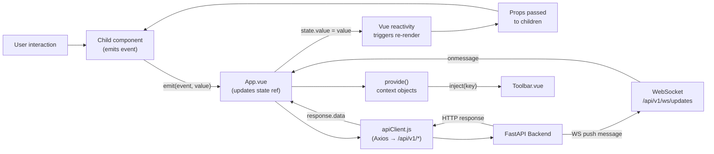
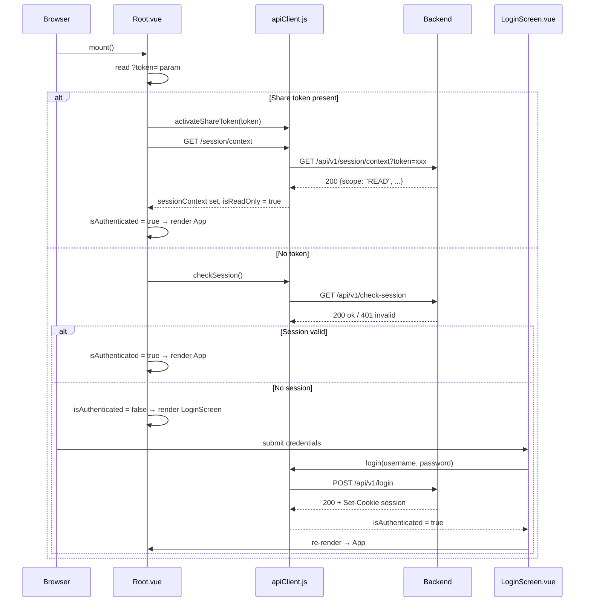
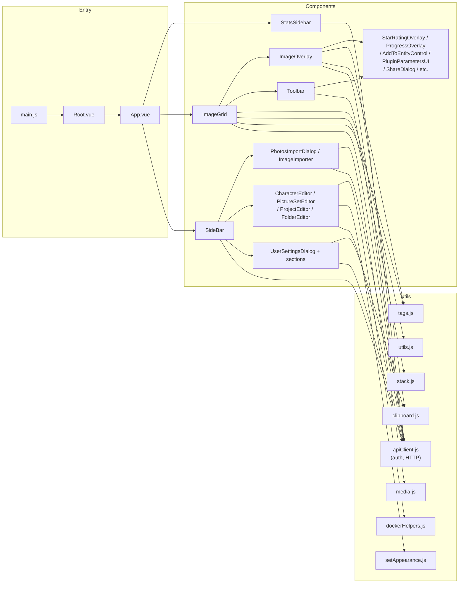
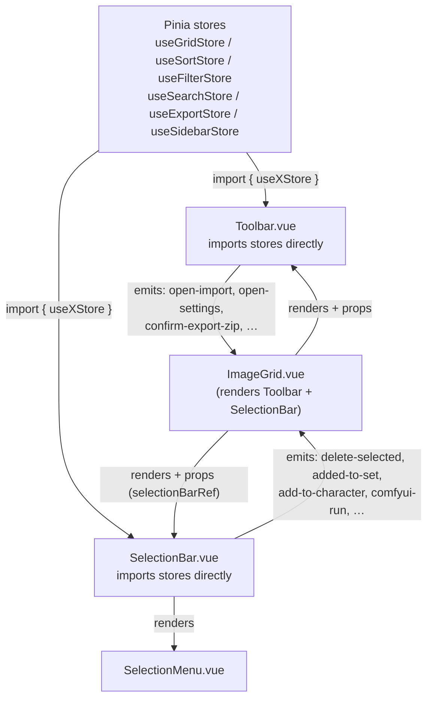

# PixlStash Frontend Architecture

> **Document purpose:** Synthetic reference database of the Vue 3 frontend for Copilot and developers. Describes every component, utility, data-flow pattern, and design decision. Keep this document updated when making structural changes.

---

## Table of Contents

1. [Project Source Tree](#1-project-source-tree)
2. [Architecture Overview](#2-architecture-overview)
3. [Entry Points](#3-entry-points)
4. [State Management — Pinia](#4-state-management--pinia)
5. [Component Catalogue](#5-component-catalogue)
6. [Utility Modules](#6-utility-modules)
7. [Theming and Styling](#7-theming-and-styling)
8. [API Client and Authentication](#8-api-client-and-authentication)
9. [Real-time Updates (WebSocket)](#9-real-time-updates-websocket)
10. [Naming and Coding Conventions](#10-naming-and-coding-conventions)
11. [Build Configuration](#11-build-configuration)
12. [Mermaid Diagrams](#12-mermaid-diagrams)

---

## 1. Project Source Tree

```
frontend/src/
├── main.js                      # App bootstrap: Vuetify + Pinia setup, theme registration, mount
├── Root.vue                     # Auth gate: LoginScreen or App
├── App.vue                      # Root application shell: layout + WebSocket + sidebar/stats state
├── App.css                      # App-scoped CSS overrides
├── style.css                    # Global CSS reset and base rules
│
├── assets/
│   ├── fonts/                   # Self-hosted fonts (if any)
│   ├── Google_Photos_icon_(2020-2025).svg
│   └── unknown-person.png       # Fallback avatar for unrecognised faces
│
├── styles/
│   ├── context-menu.css         # The one menu: surface (.ctx-menu) and row (.ctx-item)
│   └── design-tokens.css        # Design-system tokens: spacing, radius, type ramp, elevation, motion, colour
│
├── stores/                      # Pinia stores (cross-component shared state)
│   ├── useViewStore.js          # route → view resolution: the app's ONE route watcher (see §4.5)
│   ├── useSelectionStore.js
│   ├── useFilterStore.js
│   ├── useSortStore.js
│   ├── useGridStore.js
│   ├── useExportStore.js
│   ├── useWsStore.js
│   ├── useUserPrefsStore.js
│   ├── useProjectStore.js
│   ├── useSidebarStore.js
│   ├── useSearchStore.js
│   ├── useSnapshotsStore.js
│   ├── useGenStackPrefsStore.js # remembered "stack generated/filtered output with source" prefs
│   ├── useLockedSetsStore.js    # which pictures are frozen by a locked picture set
│   ├── useReviewSessionsStore.js # tag-review sessions, health board, and sticker gamification
│   ├── useEntityNamesStore.js   # id→name maps for the ImageGrid breadcrumb
│   ├── useEntityListsStore.js   # the shared character/set/project LISTS (stale-while-revalidate)
│   ├── useOperationStore.js     # the undo/redo stack + the action receipt (backend §21)
│   ├── useDedupStore.js         # the duplicate triage queue, its live counts and the tier gate
│   └── useTasksStore.js         # active background work (workers + ComfyUI runs); app-wide activity light
│
├── composables/                 # Extracted logic composables (Phase 8.1 — complete)
│   ├── useVirtualScroll.js      # Virtualised scroll window calculation for ImageGrid (uniform 'square' grid + packed 'justified' rows)
│   ├── useJustifiedLayout.js    # Pure justified-row (Google-Photos-style) packing arithmetic used by useVirtualScroll (+ *.test.js)
│   ├── useMultiSelect.js        # Image multi-selection (shift-click, range, touch mode)
│   ├── useGridDragDrop.js       # Drag-and-drop reordering and import in ImageGrid
│   ├── useStackOrdering.js      # Stack expand/collapse, reorder, visual mapping in ImageGrid
│   ├── useGridFetch.js          # Grid image fetch state + all fetch/query-param functions
│   ├── useGridKeyboardNav.js    # Keyboard navigation and keyboard-driven actions for ImageGrid
│   ├── useGridRealtimeSync.js   # WebSocket picture-event decision table for ImageGrid (see §9)
│   ├── useBreadcrumb.js         # Current-view breadcrumb trail from route + id→name maps; shared by in-grid nav and TitleBar
│   ├── useReviewRoute.js        # URL ⇄ tag-review overlay (`?review=…`); mirrors ImageGrid's `?overlay=` mechanics (+ *.test.js)
│   ├── useActionReceipt.js      # The receipt contract (wording, keycaps, drain, pause, focus) shared by the grid pill and the lightbox's own narration
│   ├── useVersionCheck.js       # "New version available" check (pixlstash.dev poll); single owner gated by `enabled`
│   ├── useSidebarExpansion.js   # Which sidebar sections / projects / folders are open; localStorage-backed (+ *.test.js)
│   ├── useDedupQueueKeyboard.js # The duplicate queue's key model, as a dependency-injected factory (+ *.test.js)
│   ├── useDedupRowExpansion.js  # The queue row's one stack-expansion band: the "one open, on the focused row" invariant + the lazy member read (+ *.test.js)
│   ├── useMixedStackQueue.js    # The Mixed stacks queue's view state: focus, selection, stranger marks and the member cursor (+ *.test.js)
│   ├── useOneTimeNotice.js      # A notice shown once per browser and then never again; localStorage-backed (+ *.test.js)
│   └── useSubmitGuard.js        # One in-flight submit at a time + the `pending` flag its button wears — see §10.2 (+ *.test.js)
│
├── api/                         # Backend resource modules: the only place URL strings live (see §8)
│   ├── config.js                # Per-user config blob: GET/PATCH /users/me/config
│   ├── serverConfig.js          # Server-wide config topics under /server-config/
│   ├── users.js                 # /users/me/* — account, tokens/share links, watermark
│   ├── session.js               # /session/context — the current credential's scope
│   ├── workers.js               # /workers/progress — background-worker poll
│   ├── snapshots.js             # /snapshots + restore/preview sub-resources
│   ├── reviews.js               # /reviews — tag-review session bookkeeping
│   ├── tagSuggestions.js        # /tag_suggestions — per-card review decisions
│   ├── tagHealth.js             # /tag_health — board rows + cache rebuild
│   ├── comfyui.js               # /comfyui/* — workflows, run, recipe read/replay, abort
│   ├── taggers.js               # /taggers, /taggers/plugin-diagnostics, /tagger/label-thresholds
│   ├── folders.js               # /reference-folders, /import-folders, /filesystem/*
│   ├── characters.js            # /characters + faces + reference pictures
│   ├── projects.js              # /projects + membership
│   ├── pictureSets.js           # /picture_sets + membership + locked members
│   ├── tags.js                  # /tags, /pictures/{id}/tags, tag predictions
│   ├── pictureImport.js         # streaming-staging import session (was useImportService)
│   ├── operations.js            # /operations — the undo/redo log, undo-state, undo/redo
│   ├── stacks.js                # /stacks — create, order, members
│   └── pictures.js              # /pictures — reads, count, stream, searches, stats
│                                # every module has a co-located *.test.js
│
├── utils/
│   ├── apiClient.js             # Axios instance, auth state, session/token helpers
│   ├── characterCreateFlow.js   # Pure helpers for the context-menu create-person flow: default naming + face-vs-picture assignment choice (+ *.test.js)
│   ├── clipboard.js             # Cross-browser clipboard write helper
│   ├── descriptions.js          # Pure helpers for picture-description formatting/normalisation
│   ├── dockerHelpers.js         # Pure helpers for Docker volume/mount path building
│   ├── keepCoverOnly.js         # Keep-cover-only: the copy + the two selection computations, pure (+ *.test.js)
│   ├── media.js                 # File extension lists, file-type predicates, drop-target helpers
│   ├── rotate.js                # In-place rotate: the format/reference-folder gates, the menu label and the skip note, pure (+ *.test.js)
│   ├── setAppearance.js         # Picture-set icon/colour palette constants (kept in sync with backend)
│   ├── sidebarCounts.js         # Which count field the sidebar reads per view mode, pure (+ *.test.js)
│   ├── snapshots.js             # Snapshot kind→chip-colour and relative-date helpers (shared by snapshot UIs)
│   ├── stack.js                 # Pure stack-ordering and leader-selection utilities
│   ├── tags.js                  # Tag normalisation, deduplication, penalty scoring
│   └── utils.js                 # Date formatting, score toggle, stack colours, ComfyUI error parsing
│
├── router/
│   └── index.js                 # Vue Router config: app routes + history mode
│
└── components/
    ├── TitleBar.vue             # Shared library chrome plus Electron title bar: active-library entry point, breadcrumb, window controls, update alert
    ├── WordmarkLogo.vue         # "PixlStash" brand wordmark in the Tiny5 pixel font (two-tone via --wordmark-accent)
    ├── views/       # Full-page / full-screen UI surfaces: ImageGrid, ImageOverlay + extracted OverlayTagsPanel/OverlayDescriptionPanel/OverlayRecipePanel/OverlayMetadataPanel/OverlayFilmstrip, ReviewSessionsOverlay, DuplicateQueue, ModelShelf, LibraryInsights, MovesReview, TrainingRuns, WorkflowsView, LoginScreen
    ├── panels/      # Large structural panels that form the app shell: SideBar, Toolbar + extracted TbTagPanel/TbExportPanel/TbImportPanel/FilterMenu/FilterStrip/WorkflowFilterMenu/UndoControl, SelectionBar, SelectionMenu, StatsSidebar, TasksPanel, ProjectFiles, …
    ├── reviews/     # Tag-review surfaces (see below)
    │   ├── ReviewSessionView.vue      # One open review session: header, rail, and card queue
    │   ├── ReviewRail.vue             # Rail of open review sessions
    │   ├── ReviewBinaryCard.vue       # Single-tag accept/dismiss decision card
    │   ├── ReviewPairCard.vue         # Twin/near-duplicate pair decision card
    │   ├── ReviewDecisionBar.vue      # Accept/dismiss/fix/undo action bar
    │   ├── ReviewCelebration.vue      # Session-complete celebration
    │   ├── ReviewArchivedReceipt.vue  # Archived-session summary receipt
    │   ├── ReviewSticker.vue          # Die-cut sticker award (vocabulary from setAppearance.js)
    │   ├── NewReviewDialog.vue        # "Start a review" tag + scope picker
    │   ├── TagHealthBoard.vue         # Landing tag-health board
    │   └── tagHealthBoardLogic.js     # Pure board estimate/threshold helpers (+ *.test.js)
    ├── editors/     # Entity create / edit / delete dialogs
    ├── settings/    # UserSettingsDialog, its section sub-components (Appearance, Behaviour, SmartScore, Workflows, Account, Snapshots, Compute, Libraries, Layout), and the Settings* layout primitives (SettingsRow, SettingsSection, SettingsChip/ChipGrid, SettingsFieldBlock, SettingsSliderRow, SettingsTwoCol, SettingsInfoCard, SettingsAddTagRow)
    ├── io/          # Import / export / external-service connection, ComfyUiRunner, RunDialog, SaveRecipeDialog, ExportRecipeDialog
    └── widgets/     # Reusable primitives, including the App* design-system layer (AppButton/AppDialog/AppInput/AppSelect/AppStepper/AppTextarea + FieldLabel, and the two pick-one shapes `Segmented` and `OptionRows`), the two undo receipts (ActionReceipt over the grid, OverlayActionReceipt inside the lightbox), the Dedup* family (the duplicate queue's row, the picture strip both queue rows are built on, compare dialog, auto-stack dialog, tier menu, the shared threshold control, scan banner, scope pill, why-pills and confidence pill), `MixedQueueRow` (one row of the Duplicates destination's third page, which is a queue of its own), `KeepCoverOnlyDialog` (the one consent for collapsing stacks to their covers; see §5 "Confirming a destructive action"), the Stack* family (badge, edge ticks, expansion strip), `AdapterTray` (the adapters one person or set uses, read-only, inside the two editors), `BaseModelInput` (the completing base-model field, shared by the shelf's bulk dialog and its inline row editor), `PicturePicker` (one faceted, single-select library picker: the shelf's thumbnail verb today, the workflow Fixed and run-time modes next), and `AiToolkitIcon` (the one non-mdi glyph in the app: ai-toolkit's mark, traced as a `currentColor` path because they publish it only as raster)
```

---

## 2. Architecture Overview

| Concern | Choice |
|---------|--------|
| Framework | Vue 3 (Composition API, `<script setup>`) |
| UI component library | Vuetify 3 |
| State management | **Pinia** — 21 domain stores in `src/stores/`; `App.vue` owns only UI-shell state |
| HTTP client | Axios (singleton `apiClient`) |
| Routing | **Vue Router 4** (`createWebHistory`). `Root.vue` gates on `isAuthenticated`; all authenticated views (`/`, `/character/:id`, `/set/:id`, `/project/:id`, `/scrapheap`, `/duplicates`, `/models`, `/models/runs`) render `App.vue` via `<RouterView>`. `useViewStore` owns the app's single route watcher and syncs params to Pinia stores (§4.5); `App.vue`'s nav handlers call `router.push()` to update the URL. `/duplicates` is deliberately NOT a grid view: `parseRouteView` returns `null` for it, so the selection stores keep whatever the user was looking at. **The route is the single source of truth for what the grid shows** — only explicit entry clicks push routes; sidebar tab/category switches never do (see Key Design Principles). |
| Build tool | Vite 5 |
| Unit tests | Vitest (jsdom environment) — test files co-located as `*.test.js` in `utils/` |
| End-to-end tests | Playwright (`frontend/e2e/`) — drives the real SPA against a backend booted on a throwaway copy of the `test-data/` fixture. See `frontend/e2e/README.md`. |
| Icons | Material Design Icons (`@mdi/font`) |

### Key Design Principles

- **Pinia for cross-component state.** All state shared across more than one component lives in a Pinia store in `src/stores/`. `App.vue` owns only layout-shell state (sidebar/stats visibility, pending import counts) that is not consumed anywhere else.
- **Sidebar tabs are stateless; the route is the single source of truth for the grid view.** Switching a sidebar tab/category (People / Sets / Projects / Folders, and the Global ↔ Project mode) is a *pure sidebar-display* operation: it only changes which list of entries the sidebar renders. It must **not** call `router.push()`, must **not** emit any `select-*` / navigation event, and must **not** write to the filter / selection / sort / grid stores. The grid keeps showing whatever the current route resolves to. Only an explicit **entry click** (a specific character / set / project) navigates, via `router.push()`. This decoupling is what lets a user stay on a global view, switch to the Projects tab purely to reveal its entries as **drop targets**, and drag the current selection onto a project or one of its characters without losing the view they found the pictures in. See [§5 → SideBar.vue](#sidebarvue-6989-lines).
- **Composables for reusable logic.** Complex logic extracted from mega-components lives in `src/composables/` as `useX()` functions. Composables accept dependencies as parameters and are independently unit-testable.
- **Flat component structure.** All components sit directly in `src/components/` with sub-directories by domain (`views/`, `panels/`, `editors/`, `settings/`, `io/`, `widgets/`). Shared presentational sub-components (e.g. `StarRatingOverlay`, `ProgressOverlay`) live in `widgets/`.
- **Utilities are pure functions.** Every file in `src/utils/` exports only plain functions and constants; none hold reactive state themselves (except `apiClient.js`, which holds `isAuthenticated`, `sessionContext`, and `isReadOnly`).
- **`<script setup>` everywhere.** All components use the Composition API with `<script setup>` syntax. Options API is not used anywhere.

---

## 3. Entry Points

### `main.js`

Bootstraps the app:
1. Imports global CSS (`vuetify/styles`, MDI icons, `style.css`, `context-menu.css`).
2. Creates a Vuetify instance with two custom themes: `pixlStashLight` and `pixlStashDark` (full custom colour tokens — sidebar, toolbar, accent, primary, input-background, etc.).
3. Creates the Vue Router instance (imported from `src/router/index.js`).
4. Mounts `Root` as the top-level component.

### `Root.vue`

Authentication gate rendered before `App`. On mount:
1. Reads `?token=` query parameter — if present, calls `activateShareToken()` and validates via `GET /session/context`. Valid → sets `isAuthenticated = true` and `sessionContext`.
2. Otherwise calls `checkSession()` (a `GET /check-session` request).
3. Shows `LoginScreen` when `isAuthenticated` is false; shows `<RouterView>` (which renders `App.vue`) when true.
4. Renders a blank `root-loading` div during the async check.

### `App.vue`

The application shell. Responsibilities:
- Owns **layout-shell state** only: sidebar/stats visibility. All domain state has moved to Pinia stores; the pill ids live in `useWsStore`.
- Owns **route pushing** (`pushAppRoute` / `pushRouteForCurrentSelection`) and calls `useViewStore().startRouteSync(route, { watch })` once. Reading the route back into stores is `useViewStore`'s job, not App.vue's (see §4.5).
- Renders the three-panel layout: `SideBar` | `ImageGrid` (+ `Toolbar`) | `StatsSidebar`.
- Manages the `PhotosImportDialog`.
- Owns the **WebSocket lifecycle only** (connect / reconnect / close / `set_filters`); the picture-event decision table is delegated to `useGridRealtimeSync` (see §9).
- Handles global keyboard shortcuts, window drag/drop, paste events. Undo/redo (`Ctrl+Z` / `Ctrl+Y` / `Ctrl+Shift+Z`, Meta accepted everywhere) lives in `handleGlobalKeydown` and declines in four cases, each for its own reason: while typing (a text field keeps its native undo stack), in a read-only session, on key auto-repeat (a held `Ctrl+Z` must not walk the stack), and while a modal **dialog** owns the screen — the receipt sits on `--z-floating`, under every dialog scrim, so an undo fired from there would mutate the library with no visible narration. See "Undo has three keyboard owners" below for the two surfaces that own the chord themselves.
- Fetches user config on startup (`GET /users/me/config`) and applies persisted preferences via the relevant stores.
- Persists sidebar/stats open state to `localStorage`.

---

## 4. State Management — Pinia

PixlStash uses **Pinia** for cross-component state. State is managed at three tiers:

### Tier 1: Pinia stores — cross-component shared state

All state consumed by more than one component lives in a Pinia store. The stores defined in `frontend/src/stores/` are:

| Store | File | Key State |
|-------|------|-----------|
| `useViewStore` | `useViewStore.js` | The route's parsed reflection: `view` (the resolved view descriptor) and `activeFolderKey`. Owns the app's **single route watcher** and is the only writer of route-derived selection/project state. Never pushes a route. See §4.5. |
| `useSelectionStore` | `useSelectionStore.js` | `selectedCharacter`, `selectedCharacterIds`, `selectedSet`, `selectedSetIds`, `selectedFolderFilter` |
| `useFilterStore` | `useFilterStore.js` | `mediaTypeFilter`, `minScoreFilter`, `maxScoreFilter`, `unscoredOnlyFilter`, `tagFilter`, `tagRejectedFilter`, `faceBboxFilter`, `sharedOnlyFilter`, `unassignedOnlyFilter`, etc. `minScoreFilter`/`maxScoreFilter`/`unscoredOnlyFilter` are writable computeds, not bare refs: "unscored" (`unscored=1`, i.e. `score IS NULL OR score = 0`) combines with a score range as "range OR unrated" (the filter menu's "Include unscored"), so the setters no longer clear each other; a surface that means one or the other, like the stats sidebar's score bars, clears the other kind itself. |
| `useSortStore` | `useSortStore.js` | `selectedSort`, `selectedDescending`, `sortOptions`, `similarityCharacterOptions`, `selectedSimilarityCharacter` |
| `useGridStore` | `useGridStore.js` | `columns`, `thumbnailSize`, `sidebarThumbnailSize`, `gridVersion`, `wsUpdateKey`, `showStars`, `showFaceBboxes`, `showProblemIcon`, `showStacks`, `stackThreshold`, `expandedStackCount`, `totalStackCount`, `compactMode`, `visibleRangeLabel` |
| `useExportStore` | `useExportStore.js` | `exportType`, `exportCaptionMode`, `exportResolution`, `exportTagFormat`, `exportIncludeCharacterName`, `exportUseOriginalFileNames`, etc. |
| `useWsStore` | `useWsStore.js` | `wsTagUpdate`, `wsPluginProgress`, `updatesSocket`; the per-tab `clientId` (`crypto.randomUUID()`, persisted under `pixlstash:clientId` in `sessionStorage`, in-memory fallback; mirrored into `apiClient` via `setRequestClientId`); the two pills' ids — `pendingExternalImportIds`/`sortChangedExternalIds` with computed `*Count` and `add*`/`clear*` setters |
| `useUserPrefsStore` | `useUserPrefsStore.js` | `checkForUpdates`, `hiddenTags`, `applyTagFilter`, `penalisedTagWeights`, `dateFormat`, `themeMode`, `sidebarWidth` (drag-resizable, clamped 120–300), `showKeyboardHint` |
| `useProjectStore` | `useProjectStore.js` | `projectViewMode` *(sidebar-display only — see below)*, `selectedProjectId`, `characterProjectIds`, `setProjectIds` |
| `useSidebarStore` | `useSidebarStore.js` | `sidebarDocked` (width pref), `sidebarPinned` (visibility pref), `statsOpen`, `sidebarForcedHidden`, `statsForcedHidden`, `characterMultiMode`, `setMultiMode`, `setDifferenceBaseId`; computeds `effectivePinned`, `effectiveDocked`, `sidebarVisible`, `sidebarOverlay` model the pin / dock / auto-hide behaviour (mobile `*ForcedHidden` overrides win). All localStorage access is try/caught. |
| `useSearchStore` | `useSearchStore.js` | `searchQuery`, `searchInput`, `searchHistory`, `isSearchActive`, `searchOverlayVisible` |
| `useSnapshotsStore` | `useSnapshotsStore.js` | `snapshots`, `loading`, `activeJob`, `error`, `dailySnapshotsEnabled`; drives the shared `RestoreConfirmDialog` hoisted in `App.vue` (`restoreDialogOpen`, `restoreDialogSnapshotId`, `restoreDialogResources`). Owns snapshot list load / create / restore and the snapshot WebSocket event handlers (called from `App.vue`). |
| `useMovesStore` | `useMovesStore.js` | v1.11 Phase 5, the reconciliation queue for moves made outside PixlStash. `unambiguous` / `ambiguous` / `offLayout`, `loading`, `error`, `loaded`; `hasPending`/`pendingCount` deliberately **exclude `offLayout`** — that bucket carries no decision (backend_architecture.md §27), so a sidebar badge counting it would nag about nothing. `fetchPending` never invents or corrects a verdict; it re-fetches `GET /moves/pending`, which the backend reclassifies live on every call. `applyAllUnambiguous`/`applyReview`/`dismissReviews`/`dismissAll` all re-fetch afterward rather than mutating the local lists — see §9.4. |
| `useReviewSessionsStore` | `useReviewSessionsStore.js` | Tag-review state: the tag-health board, the rail of open review sessions (each = one tag + frozen scope + one scan's results), and the per-session binary/pair card queues. Per-item decisions write through `/tag_suggestions`; session bookkeeping talks to `/reviews`, the board to `/tag_health`. Also owns the opt-in gamification — variable-ratio sticker awards with monotonic XP / level / streak counters; the sticker vocabulary is imported from `setAppearance.js` so sets and stickers never drift. |
| `useLockedSetsStore` | `useLockedSetsStore.js` | Which pictures are frozen by a locked picture set. Fed by `GET /picture_sets/locked-members`; refreshed on app start and on the same sidebar-refresh / `pictures_changed` ws triggers the sidebar uses. Single source of the lock-tooltip copy reused by the grid badge, overlay chip, and context-menu gating. |
| `useModelShelfStore` | `useModelShelfStore.js` | The model shelf's rows and its `Show` selection. `rows` are the raw `/adapters` + `/checkpoints` payload, **every block fetched so far rather than the shown set**: a fetch replaces the blocks it asked for and leaves the rest standing, because the option vocabularies (`adapterKindOptions`, `capabilityOptions`, `baseModelOptions`) are derived from `rows`, so an overwriting narrowed fetch deleted the kind checkboxes that unticking Adapters is documented to *grey*, and dropped base models that stayed selected and persisted with no box left to untick them. `visibleRows` layers the resolved name, the reduced location state and `copies` (how many of the row's registered copies are `present`) on top and applies the kind, capability and base-model narrowing **client-side**, so a multi-select base-model filter is not one request per option. The capability filter matches **has this capability**, not *is this kind*: a model serving two features survives a tick of either, and like the kind boxes it narrows only the block it hangs under (engines), never the whole shelf. `groups` sorts `visibleRows` client-side on the five ruled `SortKey` values and cuts them into one level of groups (`none` / `base_model` / `folder` / `feature`), always returning at least one group so the flat and grouped lists are one piece of markup; the fifth axis, `workflow_set`, is deliberately NOT in that list and is the shelf's DEFAULT (#1438) — its groups overlap, so it swaps the row list for `ModelSetGrid.vue` and is served instead by `workflowSets` / `visibleCombinations` / `setStacks` / `setFoldCounts` / `noSetRows`, read once from `GET /models/workflow-sets` by `loadWorkflowSets()` and refetched only after a scan (`fetchRows({markNew: true})`), never on a filter tick, because it is a window over every kept picture in the vault; `worksWithModel(id)` answers off the WHOLE payload rather than the narrowed one, since hiding a companion because its kind is unticked would turn a view setting into a claim about the evidence; sorting never refetches, because every field the keys read is already on the payload and three server-sorted blocks would be destroyed by the merge above. **Two axes fan a row out across several groups** — `folder` (a file copied into two folders occupies both) and `feature` (a multi-capability model is listed under each feature it serves, which is the design rule) — so `rowKey` carries the group on every grouped axis, not just the ones that need it: one key across several draws put `tabindex="0"` on all of them at once. **Under `folder` the key carries the COPY, not the folder**, because the hub is content-addressed and the same bytes can be registered twice *inside one folder* under two names — the exact collision the previous sentence describes, reached on the axis it was written for. `relpath` is half the `model_file` key and so unique within a folder by construction. A row that cannot answer the key sorts last in BOTH directions, and the unset group sorts last whatever the direction; an adapter declares no capability and groups under **its algorithm** (`LoRA`, `LoKr`, …) rather than under one "No feature recorded" bucket that held most of the shelf. One vocabulary spells it and one fold keys it, both in `utils/modelShelf.js`: `adapterKindKey` trims and lower-cases the free-text column, `adapterKindLabel` names the folded value, and the group key, the group header, the row's Kind cell, the nested `Show` checkboxes AND the `adapterKinds` filter behind them all read those two rather than `row.kind`. **The fold has to reach the filter, not just the label.** `LoRA` is reachable from the edit dialog, which trims but does not case-fold, so faceting on the raw column offered two checkboxes drawn with the same label that each ticked half the rows — while the axis folded them into one visible group. **And the fold has to reach the remembered selection too**, which `storedFilters` does on read: a shipped build persisted the raw column, so a blob holding `LoRA` would match nothing and appear in no checkbox — an empty shelf with the Adapters box reading fully on and nothing on screen naming the filter doing it. Folded rather than discarded by a `FILTERS_SCHEMA_VERSION` bump, which throws the whole blob away when the selection is still exactly what the user chose. The key is the folded value and never the label, because the key is what `modelShelfView.collapsed.feature` remembers a collapse by; it is prefixed `kind:` to keep an algorithm out of the capability keyspace. Group headers are uppercased by `.shelf-group-label` like every other header on the axis, so the header reads `LORA` where the cell reads `LoRA`: one vocabulary stops a *second spelling* existing, it does not exempt the axis from the shelf-wide case rule. Everything that is not an adapter with an algorithm still falls through to "No feature recorded", which is the whole of the rest: a checkpoint, an unclassified file, an engine declaring no capability and any `file_kind` this build does not know have no algorithm at all; an adapter whose `kind` folds to the empty string has none either (the hub CHECK makes it NOT NULL, not non-empty, so a whitespace-only one is reachable over the raw API); and an adapter whose `kind` is the literal `unknown` has the classifier's refusal rather than an algorithm (`KIND_UNKNOWN`, `utils/adapter_header.py`) — heading that `UNKNOWN` would stand a second shrug beside the real one and call it a feature. The `Show` facet still offers `Unknown` as a box, because "which of these could we not identify" is a real selection even where it is not a real feature. `view` (`groupBy`, `sortKey`, `sortDirection`) and the per-axis collapsed sets persist under `pixlstash:modelShelfView`, a SECOND key so `resetFilters` cannot take the sort order with it. `filters` (`adapters`, `adapterKinds`, `checkpoints`, `unclassified`, `engines`, `capabilities`, `baseModels`, `duplicatesOnly`) persists to `localStorage` under `pixlstash:modelShelfFilters` — not to `/users/me/config`, which is a fixed `User` model and would need a backend column. **`duplicatesOnly` is the one field `storedFilters` deliberately does not read back**: "only the files written twice" is a question somebody asks once while reclaiming disk, and remembered across a restart it is a shelf that opens showing four rows of an eighteen-hundred-row library with nothing on screen saying why. An empty `adapterKinds` / `capabilities` / `baseModels` array means **unconstrained**, the standard multi-select convention and the only reading under which a fresh install shows anything. `activeCount` counts filter SECTIONS that deviate from their default, not ticked boxes, or a mild narrowing would read as `9`. Only the four top-level type toggles refetch, and they narrow client-side too; the rest only narrow what is already loaded. Each fetch takes the next `epoch` and only the newest may write `rows` or clear `loading`, so a slower earlier flight cannot land last and show adapters only while Checkpoints is ticked; `resetForSession` bumps the same counter, so a read on the wire when the credential changed is discarded. `ModelShelf.vue` watches `loaded` and refetches when a session reset clears it, which the store cannot do itself because session-reset handlers run *before* the new credential is installed. **Session reset drops `rows` but keeps `filters`:** the models are hub-side facts about this machine, but every row carries the characters and sets in the ACTIVE LIBRARY that use it, while the selection and the view axes are the user's own preferences and hold no ids. `offlineMounts` and the `New` badge's `newIds` are both derived here and both documented under §9.1a, "The three kinds of absence": `offlineMounts` reads `rows` rather than `visibleRows` on purpose, and `newIds` is a per-fetch id diff that only `fetchRows({ markNew: true })` fills and every other fetch clears. |
| `useWorkflowsStore` | `useWorkflowsStore.js` | The Workflows grid's cards (v1.12 F1a) — `GET /workflows`, one card per stack; B9 (#1410) moved the grid onto that route when it deleted the shelf's topology list. `sortKey` is one of `rating` / `used` / `pictures`; *Your ratings* orders by **`rank`**, the Bayesian cover rank, not by the `rating` the card displays, or a 5.0 from one picture would lead a 4.8 from ninety. **`openStackKey` is a single key, so at most one stack is ever open** — deliberately unlike the picture grid, where any number expand at once: a workflow panel is a full-width band that pushes every later row down, and a second one puts itself a screen and a half below the card that opened it. `members[coverKey]` is the stack's cards, cover first, fetched one detail request per member (the grid lists the cover alone) and then KEPT, so reopening after a resize re-requests nothing. `selectedKeys` mixes top-level cards and members freely. **Once the reader is browsing stacks, the panel follows the selection** (`browsingStacks` + `syncPanelToSelection`, called from `select` and `selectRange`). A click is never the way IN: until ▸, Enter or a double-click has opened one, `browsingStacks` is false and the rule returns at once. What it settles afterwards is the state a gesture-only panel used to contradict — a band standing open under one stack while the reader has gone and selected another, or several. **The mode outlives the band**: selecting a workflow with nothing under it takes the panel off the screen without ending it, so the next stack picked opens with no second double-click; only ▸, Escape, the panel's Close (`collapseStack()`, which clears it) or a session reset says done. That is what `collapseStack`'s `keepBrowsing` is for, and its one caller is this rule. A selection that is exactly one STACK, taken whole (what `whole` makes a click on a stack card mean), moves the band there; anything else reaching OUTSIDE the open stack closes it — a lone workflow with nothing under it as much as five cards, because the band belongs to a stack the reader has stopped looking at either way. **Outside, not "more than one"**: what is left alone is a selection that stays INSIDE the open stack — its member rows, its cover, any mix — because a count would make Ctrl-click and Shift-click inside an open panel impossible, the second pick destroying the rows being picked from, and the grid declares `aria-multiselectable`. That is also what keeps the `?topology=` deep link, which selects a cover key ALONE, from shutting the very panel it pointed somebody at. The `covered.length > 1` test in the move branch is what stops a lone card matching it and falling out of the close. It is a rule about the selection MOVING and not an invariant over `selectedKeys`, so ▸ may leave a stack selected with no panel and nothing re-opens it. **`closeStack` is immediate and `collapseStack` animates**: the immediate one is for wherever the panel's content has stopped being true (`forgetMembers`, a filter taking the cover off the grid), where there is nothing left worth watching shrink; a gesture takes the other, which holds `openStackKey` with `panelClosing` set until the panel reports `collapsed`, because the member rows the grid splices in are what the animation is drawn on. That report is the panel's own `animationend`; `PANEL_COLLAPSE_MS` is a backstop behind it and **must sit clear of `--dur-2`** — the class reaches the DOM a flush after the timer is armed and the animation starts a frame after that, so a backstop set to the duration itself wins every race and the event path only ever runs under `prefers-reduced-motion`. It is three times the duration, and `useWorkflowsStore.test.js` reads `--dur-2` out of the sheet and fails if the two meet. The event is what matters because reduced motion zeroes the duration rather than switching the animation off, so it fires at once and Escape and the caret come straight back rather than being gated for a fifth of a second. `openStack` cancels a collapse to switch stacks but deliberately does NOT cancel one of the SAME stack: ▸ does not stop its click, so closing from the caret also selects that card and the rule then asks for the same stack. `invalidate()` is the one door in from outside the view — a ghost purge in Settings › Privacy — and forgets the members, then re-reads the grid **only if it had been read**, so a purge made by somebody who never opened Workflows fires no request. Session reset drops all of it: every count on a card is read across the active library's pictures. **`filters` (F7) is split across the wire on purpose**: *Hide one-offs* and *Show hidden workflows* are sent as `include_one_offs` / `include_hidden` and re-read the grid, because widening the set re-runs the stacking server-side, and a card let back in by the browser would sit beside a cover still claiming a `stack_size` of one; Ghosts, Type, Checkpoint, Source and Min rating only ever remove a card, so `filteredCards` applies them here. `filterChips` is the one answer to "which filters are on" — the panel's *Clear all*, the strip and the toolbar badge all count it — and its WORDS come from `workflowFilterChips` in `utils/filterChips.js`, the module that exists so one filter cannot be spelled two ways; the store owns the state and the refetch decision and nothing else. A filter that removes a card also **prunes `selectedKeys`** and closes the open stack if it was that stack's cover, because the selection bar and the rail's bulk verbs act on the selection and would otherwise offer Hide or Stack together on cards nobody can see. and `filterOptions` counts each pick-one option over `cards` rather than `filteredCards`, so a count cannot go to zero on the row being read. **Those lists describe COVERS**, because `cards` is one card per stack: a checkpoint only a stacked member carries is not offered, and a stack of six on one checkpoint counts 1. Building them from opened stacks would grow the lists as the reader browsed; making them library-wide needs the members in the payload or a facet count beside it, neither of which F7 adds. The same seam is why `filteredCards` filters top-level cards only — filtering inside an open panel would have the stack card say "6 workflows" over a panel drawing two. |
| `useWorkflowPullStore` | `useWorkflowPullStore.js` | A pull of ComfyUI's saved workflows (#1440): `phase` (`idle` / `pulling` / `done` / `failed`), `summary`, `comfyuiUrl`, `error`. `start()` posts `POST /comfyui/workflows/pull` and polls `GET /comfyui/workflows/pull` every `PULL_POLL_MS` until the task ends, then calls `useWorkflowsStore().fetchCards()` once; it gives up with a reason after `PULL_POLL_MAX_MISSES` unanswered asks, and reports only the task it started (another tab's, or one a restart forgot, is a stated failure, never somebody else's summary). A store rather than view state because the pull outlives the screen. Reset on session change (`sessionReset.test.js`) |
| `useModelFoldersStore` | `useModelFoldersStore.js` | The registered model folders and the scans running against them. Fetched by the shelf (folder headers, drive bands) and re-read when `ModelFoldersDialog` opens. It is a **store rather than dialog state** because a scan outlives the panel that started it, and because `POST .../rescan` answers 202 as soon as the thread starts, so completion has to be waited for: the store polls `GET /model-folders` every 3s and treats `last_checked` advancing as done, then refreshes `useModelShelfStore` and says what landed. It **gives up after 10 minutes**, because the scanner logs an exception without stamping `last_checked` and a crashed scan is otherwise indistinguishable from a slow one. `forget` captures the row's fields BEFORE the request, which is what makes the notice's `Add it back` possible and therefore what lets removal skip a confirmation prompt. **Session reset drops it whole:** absolute host paths are owner-only, and a session that lost its credential has no standing to keep polling. |
| `useGenStackPrefsStore` | `useGenStackPrefsStore.js` | Remembered client pref for whether newly filtered images stack with their source: `stackFilterOutputs` (plugin "Filters" runs), default ON and persisted to `localStorage`. Its `stackI2IOutputs` half went in v1.12 F5 with the two surfaces that read it, since `POST /workflows/run` does not stack. |
| `useEntityListsStore` | `useEntityListsStore.js` | The character / picture-set / project **lists** themselves (`characters`, `pictureSets`, `projects`) plus `fetchedAt` and `pending` per kind. One cache for the three surfaces that need them — the `SideBar` tree, the image context menu's Person/Set/Project flyouts, and the tag-review scope pickers. **Stale-while-revalidate:** a caller renders the cached list immediately and calls `refresh(kind)` *without awaiting it*, so opening a flyout never waits on the network; concurrent callers share one in-flight request (`inFlight`, modelled on `useDedupStore.scopeCounts`). `invalidate(kinds)` is **refetch-only** — a `characters_changed` ws event or a local assignment says "ask again", it never writes the store from a payload (`origin_client_id` is echo-matching, not authority; see §9 and integration_architecture.md §8.1). **These are `SCOPED_LIST` routes, so their content is an authorization decision:** the cache is in-memory only (never `localStorage`/`sessionStorage`), `reset()` drops it on every auth-context transition via the single `onSessionReset` chokepoint in `apiClient` (logout / login / share-token entry / vault switch), and an epoch guard discards any response that was in flight across that transition. Revalidate-on-open is mandatory rather than an optimisation: a share/scoped session receives no ws events (the stream is owner-only), so it is that session's only invalidation path. **The sidebar's row counts ride along on these lists (`include_counts=true`, issue #651):** every character row carries `image_count` and `project_image_count` (scoped to the character's OWN `project_id`, or to "in no project" when it has none) and every project row carries `image_count`, which is what replaced `SideBar.fetchSidebarData`'s one-`/{id}/summary`-per-row fan-out. They live on the shared list rather than in a second counts-bearing cache on purpose (two shapes for one entity would mean two caches, two invalidation paths and two epochs), and the flyout / scope-picker consumers simply ignore the extra fields. Because both scopes are on every row and neither depends on the sidebar's current project selection, one cached response serves both sidebar view modes. Distinct from `useEntityNamesStore`, which holds id→name maps only. |
| `useEntityNamesStore` | `useEntityNamesStore.js` | `characterNames`, `setNames`, `projectNames`, `refFolderLabels`, `importFolderLabels` (id→name maps). One-directional id→name only (names aren't unique). `SideBar` publishes via `merge*` setters after each fetch; `ImageGrid`'s breadcrumb consumes them to label the route's IDs. |
| `useOperationStore` | `useOperationStore.js` | The undo/redo stack, mirrored from the backend's append-only operation log (`backend_architecture.md` §21): `operations` (newest 50, newest first), `canUndo`/`canRedo`/`nextUndo`/`nextRedo` from `GET /operations/undo-state`, and the single live `receipt` that narrates what just happened. Computeds `past` (applied steps), `future` (undone, redoable), `historyCount`, `nextUndoIsExternal`. Owns the receipt's dwell timer (5s, 8s destructive, paused on hover/focus/hidden tab) and the multi-step `undoTo` walk. Refreshed on a debounced WS picture/tag/character/description event; the receipt narrates THIS client's operations only (origin read from the event `data`), so another tab's work updates the stack silently. |
| `useLibrariesStore` / `useLibrarySwitchStore` | `useLibrariesStore.js` | Owner-only app-level library identity and the switch state machine. `App.vue` fetches the registry on owner startup; Settings refreshes the same store whenever its Libraries pane opens. `activeLibrary` therefore drives the Active row, the shared browser/Electron `TitleBar` entry point, and the document title from one response. Share/read-only sessions never make this request and receive no library name in chrome. A confirmed switch moves the second store to `switching`, lets Vue render the persistent alert dialog and apply `inert` to the entire `VApp`, then posts the UUID. Since Vuetify dialogs teleport beside the app root, `inertSiblingOverlays` also inerts every already-open overlay except the switch modal. Success reloads the document; failure keeps the old library, names both target and retained library, and the sole Stay action restores focus to the invoking row. |
| `useDedupStore` | `useDedupStore.js` | The duplicate triage queue. `openCount` (the sidebar badge), `byTier` (the per-tier split, including tiers that are switched off), `scopeCounts` (the per-object counts the context menus read, cached and de-duplicated while in flight), `scan` (normalised from the server's picture and bucket counters; the percentage is derived here because the server publishes none), `groups` + `windowStart` + `total` + `hasMore` (a contiguous WINDOW of the confidence-descending queue, absolute indices, never loaded whole), `focusIndex` (+ `focusStart`/`focusEnd`/`loadPrevious`/`cancelEndChase`/`endChaseActive`, the one-press random-access End jump onto the tail page and its upward backfill — see §9.2), the per-group `coverChoices` / `exclusions` keyed on signature, and the tier gate (`nearEnabled`, `embeddingEnabled`, `threshold`) whose bounds all come from `GET /dedup/policy`. Owns the verdicts and the auto-advance: resolving a group removes its row and the focus lands on the next open group. Every verdict is recorded server-side (`dedup.stack`; `dedup.keep_separate` since the owner's 2026-07-30 override of #644), so receipts and `Ctrl+Z` come from `useOperationStore` — triggered from the verdict response, gated on its always-populated `batch_id` (see §9.2); against an older backend whose keep-separate returns no `batch_id`, the narration degrades to the transient notice pointing at the **Decided page** (owner call, 2026-07-29 — this replaced the sticky Reopen notice). `showingDecided` / `toggleDecided` flip the queue to `GET /dedup/groups?decided=true`: resolved groups with their live verdict, each row swapping its verdict buttons for a verdict label and a **Clear decision** action (`POST /dedup/verdicts/reopen` — never touches pictures; a reopened stacked group stays stacked until unstacked from the Stacks view). Verdicts and multi-select are inert on the decided page, and its empty state carries its own way back since the header toggle unmounts with the list. **Multi-select (owner request, 2026-07-29):** Ctrl/Cmd+click toggles a group in and out of a selection, Shift+click ranges from the anchor, plain click clears — the grid's own conventions. A verdict on any selected group applies to the whole selection (`verdictTargets`); a bulk stack shares ONE `cli-` batch id so a single Ctrl+Z reverses the gesture, and a bulk keep-separate narrates once for the whole gesture. The bulk scope is stated twice — a header chip ("N groups selected — Stack and Keep separate apply to all") and the verdict buttons themselves rename ("Stack N groups" / "Keep N separate") — because a bulk action must never look like a single one. Escape clears the selection without costing the focus; a reload (scope, tier, rescan) clears it too, since it would silently point at different rows. **`openQueue` is the scan trigger**: the group cache only fills when a scan runs, so opening the queue queues one (`POST /dedup/scan`) and the queue opens over whatever exists while the banner streams — without this the queue reads an empty cache forever, whatever the tier gate says. Loosening the policy (enabling a tier, lowering the threshold) rescans too; narrowing only re-queries. While a scan is `pending`/`running` the store polls counts every 2s and reloads the group list **only while it is empty**, so the first finds surface on their own and a triage in progress is never yanked to the top. |
| `useTasksStore` | `useTasksStore.js` | `workerSnapshots`, `series` (per-worker throughput history), `systemUsage` (CPU/RAM/VRAM), `comfyuiRuns` (frontend-driven run progress keyed by run id); computeds `activeEntries` (backend workers + ComfyUI runs, merged), `hasActiveTasks`, `activeCount`. The **single poller** of `GET /workers/progress` (adaptive cadence — see §4.4) and the single source of truth for the app-wide "is the app working" indicators. |

Components import stores directly (`import { useFilterStore } from '../../stores/useFilterStore'`) — no prop drilling required.

### Tier 2: Component-local state

Sub-components that manage independent data (e.g. `AccountSection`, `SmartScoreSection`, `StatsSidebar`) own their own refs and fetch their own data. They receive an `open: Boolean` prop (or equivalent) and trigger data loads via `watch(() => props.open, ...)`.

### Tier 3: Template-ref imperative API

`App.vue` holds refs to `SideBar` (via `sidebarRef`) and `ImageGrid` (via `gridContainer`) and calls `defineExpose`'d methods on them:

**`SideBar` exposes:** `refreshSidebar()`, `openSettingsDialog()`, `startLocalImport()`, `currentProjectId`, `openCurrentSelectionEditor()`

**`ImageGrid` exposes:** `gridEl`, `onGlobalKeyPress()`, `updateVisibleThumbnails()`, `expandAllStacks()`, `collapseAllStacks()`, `exportCurrentViewToZip()`, `getExportCount()`, `removeImagesById()`, `clearFaceSelection()`, `runComfyuiOnGridImages()`, `hasCursorFocus`

### 4.4 Task activity and the app-wide activity indicators

`useTasksStore` is the one place that knows "what is the app working on right now," and the only component that polls `GET /workers/progress`. Two kinds of work merge into its `activeEntries` list:

- **Backend workers** (quality scoring, tagging, embeddings, faces, likeness, folder scans…) — fetched from `/workers/progress`. The store accumulates per-worker throughput `series` and applies the same grace-period active-state logic the Tasks tab used to own.
- **ComfyUI runs** — frontend-driven (each `ComfyUiRunner` talks to ComfyUI's own WebSocket), so they can't be polled. Every runner instance mirrors its `progress` reactive into the store via `setComfyuiRun(runId, …)` / `clearComfyuiRun(runId)`, and registers an abort handler so the Tasks-tab row can cancel a run that lives in a different component (`ImageGrid` / `ImageOverlay`).

**Adaptive poll.** `App.vue` calls `tasksStore.startPolling()` on mount (and `stopPolling()` on unmount) so the indicators are live app-wide, not only while the Tasks tab is open. The store self-throttles: paused while `document.hidden`, ~2 s when the Tasks tab is open or work is active, ~5 s when merely idle-watching. `setTasksTabOpen` **counts mounted panels rather than holding a flag**, because the Tasks panel is shared: with a boolean, one host unmounting would drop the cadence back to idle under another host still showing it. Share / read-only sessions skip the fetch (the endpoint is owner-only). This is the only always-on background poll in the app.

**Consumers (deny nothing, just read):**
- `panels/TasksPanel.vue` renders the **Tasks tab** purely from `tasksStore.activeEntries` — backend workers as a throughput sparkline + rate, ComfyUI runs as a progress bar + abort. It owns only the canvas drawing and label formatting; it never fetches or polls. It exports `tasksTabFor(tasksStore)`, the tab descriptor its hosts declare — one function so the two cannot drift on the wording or on when the light comes on — and sets the store's fast cadence (`setTasksTabOpen`) for as long as it is mounted — which is exactly while the tab is on screen, since an inspector unmounts its body when the rail collapses. **Two inspectors offer the tab, last in their band**: `StatsSidebar` (everywhere the grid's rail is shown, the model shelf included) and `WorkflowTab` (`/workflows`), which the descriptor marks `busy` while `hasActiveTasks`, pulsing the tab. The image overlay's inspector deliberately does not: it is one picture's pane, laid over that picture. **A deep link to the tab goes through `sidebarStore.showTasksTab()`**, a counter both hosts watch: it used to be `statsSidebarRef.value.focusTasksTab()`, which reached nothing on `/workflows` — the one screen a run is usually started from, and so the one screen the "Started N runs" toast's *Show* silently did nothing on.
- `Toolbar`'s **stats toggle** pulses its whole icon in `accent` when `hasActiveTasks`, so background work is visible even with the stats sidebar collapsed.
- `ComfyUiRunner` retired its inline in-progress banner (progress now lives in the Tasks tab). It still renders an **inline banner for the failed state only**, so an error is never buried in a collapsed sidebar.

All indicator animations honour `prefers-reduced-motion: reduce`.

### 4.5 Route → view resolution (`useViewStore`)

The route is the single source of truth for what the grid shows (§2). `useViewStore` is the one place that turns the URL into the selection/project state the grid renders, and the only writer of that state from the route.

It is split in two so the URL contract is testable on its own:

- **`parseRouteView(route)`** is pure. It resolves a route to a *view descriptor* (project scope, selected character/characters, selected set/sets, multi modes, difference base, category label, folder key), or `null` for a route the grid is not driven from. Every URL shape the router declares is unit-tested here (`useViewStore.test.js`), with no router, grid, or mounted App.
- **`applyRoute(route)`** writes the descriptor into `useSelectionStore` / `useProjectStore`. Idempotent by construction: values that have not changed are not written, and the character guard compares stringified ids because the id space mixes numbers with the `ALL` / `UNASSIGNED` / `SCRAPHEAP` pseudo-ids.

**`startRouteSync(route, { watch })` installs the app's one and only route watcher**, called once from `App.vue`. `watch` is injected (same pattern as `useReviewRoute`) so the watcher is created in App.vue's effect scope and dies with it, and so the store stays testable. Two rules keep the seam honest:

- The store **never pushes a route**. Route *pushing* stays in `App.vue` (`pushAppRoute` / `pushRouteForCurrentSelection`), next to the nav handlers that own navigation decisions.
- Folder routes (`ref-folder` / `import-folder`) deliberately do **not** clear `selectedFolderFilter`. The sidebar owns that payload and emits `select-folder` once the folder has loaded, so the route must not wipe what the sidebar just set.

**`?stack_state=` is the one filter the route owns**, and it is **additive only**: an absent or unrecognised value resolves to `null`, which means "leave `useFilterStore.stackStateFilter` alone". Resetting it on every route tick would silently clear a filter the user set in the filter panel the moment they navigated anywhere, which no other filter does. It exists because the Duplicates queue-clear screen routes to All Pictures with the stacked filter applied (`docs/design/keep-cover-only.md` → "The route from Duplicates"), and that destination has to be reloadable and Back-able rather than a state only one click can produce. It is read for every grid route, not just `/`. Adding a second route-owned filter is a design decision, not a copy-paste: the store is otherwise the writer of selection/project state only.

**`?path=<absolute folder>` is the folder facet for folders that have no id.** A
reference folder and an import folder each have a route (`/ref-folder/:id`,
`/import-folder/:id`) and the sidebar owns their payload — which is why those
two routes do not clear `selectedFolderFilter`, and why `applyView` refuses to
apply `?path=` on them (it guards on `folderKey`). The folder an "About your
library" finding points at (§9.3) has no id of any kind, which is what this
param is for. **It also carries the sidebar's subfolder selection.**
`FolderTreeNode.vue` requires `rfId`, so a subfolder click takes
`pushRouteForCurrentSelection`'s ref-folder branch; the branch pushes `?path=`
alongside the id, and `SideBar.routeSubfolderUnder` reads it back once the
folder listing is in, selecting the subfolder rather than the folder root.
**On an id-carrying route that query is RELATIVE to the folder the id names**
(`SideBar._subPathUnder` builds it, and it reaches the branch as the payload's
`subPath`). The id already says where the folder is, so repeating the absolute
path only put the owner's folder tree in the address bar and in browser history
(#1206 item 9); a folder ROOT is therefore `/ref-folder/:id` with no query at
all. `routeSubfolderUnder` still accepts an ABSOLUTE `?path=`, because links
shared and history entries made before that carry one — and because `/`, the
only folder-facet route with no id, has nothing to be relative to. The id still
owns `referenceFolderId`, so
`reference_folder_id` stays in the grid query — the query only says which
folder *inside* it is open. **The sidebar watcher watches `?path=` alongside
`activeFolderKey`, and has to.** Two sibling subfolders of one folder push
routes that differ only in the query, so the key alone cannot tell them apart;
watching only the key meant every subfolder click created a history entry
(`/ref-folder/5` used to be pushed identically each time, which vue-router
deduplicates, so there was none) whose Back moved the address bar and nothing
else. The watcher's "already in sync" test therefore compares the folder *and*
the path, or a click would re-fetch both listings and re-emit the payload it
had just set — **through `_urlPath`, not `_samePath`**, because
`routeSubfolderUnder` re-spells the path into the folder's own separators and
`parseFolderPath` keeps the URL's, so the two are in different spaces. Compared
in the wrong one they never match, the sidebar stops recognising its own work,
and the re-emit pushes a URL that differs from the one that arrived — the
inert-Back bug again, in a loop. `SideBarFolderRouteRestore.test.js` pins the
whole class with one property, "a route arriving twice is inert",
parameterised over the separator-changing inputs; the POSIX-only version of it
was green while the Windows case looped. `parseFolderPath`
resolves it to the same `{pathPrefix, label}` payload the sidebar emits, and so
to the listing API's existing `file_path_prefix` param — there is no new backend
filter behind it. Read on every grid route rather than only on `/`, the same
reasoning as `?stack_state=`: it is what makes `/character/UNASSIGNED?path=…`,
the unassigned pictures in ONE folder, expressible at all. Unlike
`?stack_state=` it is **not** additive — an absent `path` on a non-folder route
clears the filter, because the facet describes what the grid is showing rather
than a sticky preference.

**The URL cannot grant a project scope the credential does not have.** `applyRoute` narrows the parsed descriptor through `scopeProjectToSession` before writing it: a credential with a `resource_type` takes its project scope from the **token**, never from the URL — `project` → its own project (whatever project the URL names), everything else (`character` / `picture_set` / `picture`) → global mode with no project id. An owner session and a whole-library READ share both have **no** `resource_type` and are left exactly as the URL says; narrowing them would be over-blocking, since the backend places no project restriction on either (`visible_project_ids` returns `None`).

This exists because a share link inherits whatever pathname the owner minted it from — Settings is a dialog, not a route, so `AccountSection.shareUrl` builds `/project/5?token=…` from `window.location.pathname` (issue #717). Without the narrowing the recipient's grid sends `project_id=5`, which the AuthzGate refuses for a character/set token (empty visible-project set), and the grid comes back empty with nothing said to the owner. It lives **here rather than in `App.vue`'s mount-time scoped-session block** for two reasons: this store is the single writer of the grid's project scope, and a mount-time write loses to the next route tick (Back onto the shared link would re-break it). `App.vue`'s block keeps normalising what is *selected*. Both directions are covered in `stores/scopedSessionProjectScope.test.js`, which asserts the query string on the wire and pins the mount ordering the defect depended on.

The Phase 0 pin specs `route-as-truth.spec.js` and `stateless-tabs.spec.js` characterise the user-visible half of this contract.

### 4.6 Auth-context transitions — the session-reset chokepoint

Logout is a **reactive flip in the SPA, not a page reload**, so Pinia module state survives a logout → login on the same tab. Any store that caches data from a scope-aware endpoint would therefore render one credential's data under the next one (CWE-524). Issue #655 closed that class; this section is the contract it left behind.

**One mechanism, not one per store.** `utils/apiClient.js` owns it:

- `onSessionReset(handler)` registers a handler and returns an unsubscribe.
- `notifySessionReset(reason)` runs every handler synchronously, then clears the transport's own identity (`_shareToken`, `sessionContext`).

It fires from exactly three places today — `logout()`, `login()` and `activateShareToken()` — and a store never detects a credential change itself. A store that had to would eventually miss one.

**Ordering is load-bearing, in both directions.** Handlers run *before* `_shareToken` / `sessionContext` are cleared, because a handler may read `sessionContext` while deciding what to drop (`useEntityListsStore.canFetch`). And `activateShareToken()` announces the transition *before* assigning the new token, so the clear cannot wipe the token it just set.

**The rules for a store that caches server data:**

1. Register `reset()` on the chokepoint, and unregister with `onScopeDispose`.
2. `reset()` bumps an **epoch**, and every read tags itself with the epoch it started in. Clearing state alone leaves the store empty for a few hundred milliseconds and then quietly refilling with the previous credential's rows — the same leak with a delay on it.
3. `reset()` also stops **timers** and clears **in-flight/dedup bookkeeping**, so nothing re-enters the store after the clear and no caller can join a request belonging to the previous session.
4. The cache is **in-memory only**. It must never reach `localStorage` / `sessionStorage`, where it would outlive the credential that produced it. Genuine view preferences (the dedup thumbnail size, the review overlay's sticker shelf) are exempt — they carry no authorization decision.
5. Caches are **refetch-only**: nothing here is ever patched from a WebSocket payload (`origin_client_id` is echo-matching, never authority — integration_architecture.md §8.1).

**Completeness is arithmetic, not judgement.** `stores/sessionReset.test.js` holds the store matrix: every file matching `stores/use*.js` must appear either in its reset table or in its documented `NO_SERVER_DATA` exemption list, and a store in neither fails the test. That is the frontend counterpart of the backend's `test_all_routes_declare_access_policy` guardrail. It asserts **both directions** — empty the instant the context changes, *and* repopulating on the next read — because over-blocking is its own regression.

**The vault switch does not exist yet.** `useEntityListsStore` and `apiClient` name it as a covered transition; multi-library is v1.9 Lane E. `notifySessionReset` is exported so that **whoever builds the vault switch calls it at the switch site** — every registered store then drops its cache for free, and nothing has to be revisited store by store.

---

## 5. Component Catalogue

### Layout and Shell

#### `Root.vue` (58 lines)
Auth gate. Renders `LoginScreen` or `App` based on `isAuthenticated`. Handles `?token=` share links on mount.

#### `App.vue` (640 lines)
Application shell. Owns all global state. Renders `SideBar` + `ImageGrid` + `StatsSidebar`. Manages WebSocket, keyboard shortcuts, window drag/drop, paste, config loading, export, update checks.

#### `TitleBar.vue` (546 lines)
Shared application chrome. In a plain browser it renders a compact owner-only active-library control that deep-links to Settings › Libraries; in Electron that control is part of the custom title bar alongside the `WordmarkLogo`, the breadcrumb trail (`useBreadcrumb`), the app version, the "new version available" / security update alert (`useVersionCheck`, with `enabled = Boolean(desktop)` so exactly one owner runs the check), and the OS window controls (minimize / maximize / close, hidden on macOS where the OS draws them). All desktop calls go through `window.pixlstashDesktop?.…` optional chaining, so they no-op in a plain browser. Share/read-only sessions receive neither the library name nor its entry point. Props: `installType`, `checkForUpdates`, `activeLibraryName`, `showLibraryChrome`; emits `open-libraries`.

#### `WordmarkLogo.vue` (30 lines)
Presentational "PixlStash" brand wordmark in the Tiny5 pixel font (replaced the prior SVG outline). "Pixl" uses `currentColor`; "Stash" uses `var(--wordmark-accent, currentColor)`, so a caller that sets only `color` gets a single-tone wordmark and one that also sets `--wordmark-accent` gets the two-tone split. Sized via `font-size` on the host. No props.

---

### Large Stateful Components

#### `ImageGrid.vue` (7933 lines)
The core image display engine. Responsibilities:
- Virtualised grid scroll with dynamic thumbnail sizes (via `useVirtualScroll`).
- Fetches images from `GET /pictures` with all filter params as query args.
- Manages stacks: collapsing/expanding, leader-map calculation, inline stack drag-sort (via `useStackOrdering`).
- Multi-selection (shift-click, keyboard navigation with arrow keys) (via `useMultiSelect`).
- **Segment (object detection)**: the context menu's "Segment" item emits `segment`; `ImageGrid` opens a small dialog for an optional label phrase and `POST`s `/pictures/detect` with the selected ids (empty phrase → dense detection). Progress shows in the task manager; the overlay refreshes on the resulting `changed_pictures` event.
- Image scoring (guest and authenticated star rating).
- Drag-and-drop reordering within sets (via `useGridDragDrop`).
- Integrates `ImageOverlay`, `ImageImporter`, `Toolbar`, `ImageGridContextMenu`, `EmptyScrapHeap`, `LibraryEmptyState`, `ComfyUiRunner`.
- Emits: `open-overlay`, `refresh-sidebar`, `clear-search`, `reset-to-all`, `search-all`, `update:selected-sort`, `update:stack-stats`, `import-started`, `import-ended`, `clear-multi-selection`, `update:character-multi-mode`, `update:set-multi-mode`, `update:set-difference-base-id`, `update:embed-watermark`, `update:visible-range-label`, `load-pending-imports`
- Key props: `thumbnailSize`, `columns`, `selectedCharacter`, `selectedSet`, `searchQuery`, `selectedSort`, `wsTagUpdate`, `wsPluginProgress`, `gridVersion`, `wsUpdateKey`, `publicUrl`, `embedWatermark`, + all filter props.

##### The empty library is a different question from an empty grid

`ImageGrid` has three empty states and they are not variants of one screen.
A filter that matched nothing and an empty scrap heap keep the card they had —
"No pictures match the current filters", "Are all your pictures that good?" —
because those are questions with their own answers.

The third, `totalAllPicturesCount === 0`, is **the first screen of every
install**, and it gets `LibraryEmptyState.vue`. It used to read *"No pictures in
the database. Add pictures by dragging them here."* Two things were wrong with
that. **"Database"** is our word: the owner has pictures, and the thing holding
them is an implementation detail they were never introduced to. And **dragging
is one route of three**, offered as though it were the only one — PixlStash can
also read a folder you already have, in place, moving nothing, and it can
generate straight into the library. Someone arriving with an organised folder
tree was being told to take it apart and drag it back in, which is the v1.11
diagnosis in a single sentence of copy.

So: three routes, folder first, and only that one carries the accent. Ordering
plus a single primary is the whole of how "none of them is more official than
the others" is said; two primaries would make it a choice between two official
answers. The folder route leads because it is the case the release exists for
and the one that was invisible — reference folders have always worked and were a
sidebar accessory nobody was pointed at.

**Every route reuses wiring App.vue already had.** `local-import` reaches
`SideBar.startLocalImport`, `open-settings` reaches `SideBar.openSettingsDialog`
(with `"workflows"`, where the ComfyUI URL lives), and `choose-folder` is the one
new signal, for `SideBar.chooseLibraryFolder`.

**A dismissed offer has a way back in.** `SideBar.chooseLibraryFolder` resumes
this library's pending `local_import` entry if there is one, else re-inspects
the library's own path and, when it holds pictures, opens the same
`local_import` wizard the offer opens; only an empty folder falls through to
the ordinary add. "Add a library" refuses the folder the library already is, so
without this route a dismissed offer left no way to import those pictures at
all, and the root scan no longer indexes them behind the owner's back (backend
§25). The count the offer or the click last read lives in
`useFolderMappingStore.rootPictureCount` (`rootPictureCountCapped` when the
inspect stopped at its cap), and `LibraryEmptyState` reads it to say "Import
the pictures already in this folder" with an `Import them…` button instead of
"Use a folder you already have". A session reset forgets the count and closes
the wizard along with the entry.

**The empty library asks whether its own folder is empty.** The desktop's
first-run setup creates the vault in whatever folder was chosen, and the web
flow's "Add a library" only saves a pending mapping entry for folders it read
itself, so a vault made over loose pictures had nothing to bring the wizard up:
the owner chose a folder full of pictures and got "This library is empty".
`ImageGrid` emits `library-empty` the first time `showLibraryEmptyState` turns
true; App.vue forwards it to `SideBar.offerLoosePictures`, which asks
`GET /libraries/inspect` about the active library's own path (the `attached`
verdict now carries `picture_count`, what is on disk whether indexed or not)
and, when there is anything there, opens `FolderMappingWizard` with
`{ path, mode: "local_import" }` and no read: the scan card starts one, the
read saves the pending entry as any resumed read does, so Cancel leaves the
sidebar's "Finish organising…" row offering it. Once per page load, like the
pending-entry auto-open beside it, and never for a read-only session, a remote
one (`canManage` false), or while an entry is already pending. The wizard's
"Drop this, organise later" commits with no assignments when the library
already exists rather than trying to add it again.

**Initial setup comes before the telemetry question.** `useAppConfig` asks
for the consent dialog as soon as the config says it was never answered, which
on a first run is before the library has even been counted, so the privacy
dialog came up first and the import wizard opened over it. `ImageGrid` also
emits `library-loaded` `{ empty }` when the first count lands; App.vue awaits
the loose-picture offer for an empty library, then marks the library settled,
and `TelemetryConsentDialog` is shown only once that is true and no mapping
wizard is open or pending. The request itself is kept, so the dialog appears
the moment the wizard closes. `SideBar.offerLoosePictures` hands every caller
the same in-flight promise: `library-empty` and `library-loaded` fire in the
same tick, and a second call that returned at once (already offered) settled
the library before the path had even been inspected, so the dialog came up
under the wizard anyway.

**The first frame's theme is remembered, not guessed.** The theme a person
chose lives on their user record, a round trip away, so everything painted
before that answer lands is painted in whatever `createVuetify`'s
`defaultTheme` says. That default is **dark** - it matches the desktop shell the
window opens from, and a picture is looked at against a dark canvas - which left
someone who had chosen light watching one frame of dark first.
`utils/themeMemory.js` closes it: App.vue's theme watcher writes the mode it
just applied to `localStorage`, and `main.js` reads it back to pick
`defaultTheme` before the app mounts. It is a cache of a decision made
elsewhere and never the decision itself - a stale or unreadable value costs one
repaint and nothing else - so a blocked `localStorage` simply falls back to the
default, and the stored `theme_mode` still wins the moment the config arrives.

**On desktop the privacy question is not this dialog's to ask.** The shell's
startup framework (`electron/src/renderer/setup.html` / `setup.js`) asks it
before the app loads, as one of the steps that launch needed, and parks the
answer in `userData/pending-telemetry.json`. `useAppConfig` takes that answer
(`window.pixlstashDesktop.takePendingTelemetry()`, read-and-delete so it cannot
re-apply over a later change in Settings) and saves it, which also sets
`telemetry_consent_prompted` and stops the dialog. A desktop launch that finds
the question unanswered with nothing parked — an upgrade from a version that
never asked — hands the window back with
`askStartupQuestion("privacy")` rather than opening the dialog over a library
that is already on screen; the shell shows that one step, parks the answer, and
returns to the app. The in-app `TelemetryConsentDialog` remains the browser's
path, and the desktop's last resort if the shell is too old to answer either
call.

**Directly to the reference editor, not to `openAddFolderTypeDialog`.** That
chooser's other option is an import folder — *"watch for new files and import
them automatically"* — which copies files in, and the button that reaches it
promises "Nothing is moved" one screen earlier. Routing through the chooser
would have the release's headline claim falsified by the very next click, and
the probe would measure the opposite of what it is for.

The component is presentational: it holds a hidden file input, clears its
`value` after each `change` so the same files can be chosen twice in a row, and
hands the chosen files up **unfiltered**. `ImageGrid.importChosenFiles` drops
what PixlStash cannot read, against the same `isSupportedImportFile` and under
the same `import-unsupported-files` notice key the two drop paths use — an OS
picker's `accept` is advisory, so a button that skipped it would be the one
import route that took anything silently. It normalises with `Array.from`
before filtering, so a caller handing it an `<input>`'s `FileList` gets an
import rather than a `TypeError` raised a long way from the mistake.

**`accept` is one constant, `IMPORT_FILE_ACCEPT` in `utils/media.js`, for all
three import inputs** (this card, `PhotosImportDialog`, `TbImportPanel`). It has
to agree with `isSupportedImportFile`, and it did not: this card shipped as
`image/*,video/*`, which greyed out the zip and caption-file imports the app
supports and left them reachable only through the picker's "All Files". Advisory
or not, `accept` is what the route *looks like it takes*, so a narrow one hides
a feature rather than rejecting a file. `media.test.js` asserts the offer
against the predicate in **both** directions — every named extension is one the
importer takes, and every type the importer takes is named or covered by a
wildcard — because a subset check alone stays green when a supported type is
dropped from the offer, which is the drift that matters.

**A `:accept` bound to a name the `<script setup>` never imported renders no
`accept` at all**, so the picker silently offers every file on the disk while
the markup still reads correctly. This shipped in review: two of the three
inputs were pointed at the shared constant without importing it. Two guards now
close it — `vue/no-undef-properties` is an **error** in `eslint.config.js`
(repo-wide, for every undeclared name a template references, not just this one),
and `TbImportPanel.test.js` asserts the *rendered* attribute rather than the
binding.

**Three conditions stop it appearing, and two are about not lying:**

- `totalAllPicturesCountLoaded` — the count starts at `0` and
  `fetchAllPicturesCount` swallows its failure, so an unanswered request is
  indistinguishable from an empty library. Saying "This library is empty" over a
  backend that did not reply is worse than saying nothing, and this screen says
  it with three buttons under it.
- `!isReadOnly` — a share recipient owns nothing here. Two routes open the
  owner's sidebar dialogs and the third dead-ends in the importer's read-only
  refusal, and the zero they were handed is the count `GET
  /characters/{ALL}/summary` refused them, not a fact about the library.
- the scrap-heap and set-overlap views, which have their own questions.

`ImageGridLibraryEmptyState.test.js` mounts the real grid for all of it. The
component's own suite passes with the feature disconnected from the app
entirely — that was measured, not assumed — so the integration file is where
"does it render" and "does a button reach anything" actually live.

##### Who owns a card's thumbnail URL

**The server does, and the grid may only cache its answer.** `POST /pictures/thumbnails` returns a URL whose `?v=` version is `ImageUtils.thumbnail_cache_version` — the one thing that moves when a bitmap is regenerated but the picture is not replaced: the upgrade NULL-reset in `thumbnail_generation_task.py`, a reference-folder source swap, an in-place rotate.

`fetchThumbnailsBatch` still pre-fills `/pictures/thumbnails/<id>.webp?v=<imported_at epoch>` synchronously, so a tile paints without waiting for the round trip. That is a **placeholder with a placeholder's lifetime**: when the POST answers, every card it names takes the server's URL, overwriting the placeholder. The rule that broke this was `missingThumbIds`, computed *after* the pre-fill had already set `thumbnail` — so a card with an `imported_at` (i.e. every real card) was filtered out of it and kept a version derived from its import date, which never changes again. The effect was general rather than feature-specific: **no regenerated thumbnail ever repainted in the grid.** `ImageGridThumbnailVersion.test.js` holds the line.

Two things the fix must not undo, both asserted: a card the server reports **no** URL for keeps what it is painting (a still-processing picture is not blanked, and a card that never had one stays null and goes down the `scheduleThumbnailRetry` path); and `appendShareToken` is applied to whichever URL wins. Never stamp a client-side `&t=Date.now()` buster — that defeats HTTP caching for every thumbnail in the library, which is the reason the version is a server contract in the first place.

##### The four grid fetch modes, and the character face search

`useGridFetch` picks one branch per fetch (`fetchMode`): `likeness-groups`, `character-face-search`, `face-likeness-search`, `reverse-image-search`, `text-search`, or `stream`. The first five build an **ordered id list** and re-read the pictures by id, because the ranking *is* the result and a plain id-list read does not preserve order.

**`character-face-search` — "Suggest more pictures of &lt;person&gt;" (#636).** Launched from the sidebar's person context menu (`SideBar` → `suggest-pictures-for-character` → `App.handleSuggestPicturesForCharacter` → the grid's exposed `suggestPicturesForCharacter`, the same Tier-3 route as `confirmEmptyScrapheap`). It queries `POST /pictures/face-search?source_character_id=…&exclude_character_id=…`, i.e. the person's reference faces, minus the pictures already assigned to them.

- **State**: `faceSearchCharacter` (`{id, name}`, null when inactive), `faceSearchThreshold` (default **0.7**, the same cut `SourceFaceLikenessTask.SIMILARITY_THRESHOLD` already uses for "same person"; a second UI-local number would drift from it), `faceSearchMinRefs` (default **1**, which is what `combine=max` gives on its own, so the knob starts where the search has always been and only ever tightens), `faceSearchArmedView`, and `faceSearchRanked` (`{characterId, matches, rowsById}`).
- **The ranked list and its picture rows are both cached**, so moving **either** knob **re-cuts the same list with no network call**. The request sets `include_reference_scores`, so each match carries `reference_likeness` (the winning face's similarity to every reference) and the agreement knob is a client-side count over that row rather than a server-side k-of-n, which would put a round trip under a drag. Both knobs are in the fetch key (a rebuild that early-returned as a no-op would leave the grid disagreeing with the count), and the rebuild is debounced 200ms while the count in the bar updates synchronously from `faceSearchMatches`.
- **One cut, two callers.** `utils/faceSuggestionCut.js` owns `cutFaceSuggestions` / `agreeingReferenceCount` / `referenceFaceCount`, and both the grid rebuild (`useGridFetch`) and the pill's count (`faceSearchMatches`) go through it. A count that disagrees with the grid under it is the bug that file exists to prevent. It falls back to the combined `likeness` when `reference_likeness` is absent (older server), which keeps `minRefs = 1` behaving exactly as before.
- **It is not a character-scoped *view***, and `faceSearchCharacter` is deliberately independent of `props.selectedCharacter`. But since 2026-07-30 a view change **does** drop it (owner call). Leaving it up meant navigating elsewhere and still being shown suggestions for a person with a bulk Assign armed, reading as the new view's contents; navigation is the ordinary way out of a mode. It compares against `faceSearchArmedView`, the view snapshotted when the search was armed, rather than firing on any change: opening the sidebar's person menu can itself select that person, and that selection lands around the same click that arms the search.
- **The clearing runs inside the view-change watcher, immediately before its refetch, and must never be moved to a watcher of its own.** `fetchAllGridImages` picks its `fetchMode` synchronously (no `await` precedes the read), and Vue runs pre-flush watchers in creation order, so a clearing watcher declared after the fetching one loses every time: the fetch re-issues the search that is still armed, and the later clear then unmounts the pill. That combination shipped briefly and looked like "the view does not change" — a grid full of the old search with no bar to explain or dismiss it. `dropSearchesForViewChange` carries the rule; `ImageGridSuggestionViewChange.test.js` asserts it on the wire.
- **After the assign, the search is re-run against the server (`force: true`), not pruned locally.** Two correctness reasons: `POST /characters/{id}/faces` is stack-atomic, so it can assign *more* pictures than were named (a suggestion's stack siblings would otherwise linger as un-assigned), and the fetch key is unchanged, so a non-forced call would be dropped by the 1200ms de-dup window. `operationStore.refresh()` then raises the "Assigned N pictures…· Undo" receipt, which is what lets this bulk write skip a confirmation dialog.

##### Entity-assignment refetch rule (set / project / character)

**An assignment refetches the grid only when the active view is scoped by the thing that changed.** Grouping membership is not part of the grid query in the global view, so assigning a picture to a set or project from **All Pictures** cannot change which pictures match or their sort position, and the card renders no set/project data, so a refetch there is pure churn (flicker, lost scroll position, lost selection). The three handlers each gate on their own view scope:

| Handler | Refetches / mutates the grid when |
|---|---|
| `handleSetProjectForSelected` (project) | `isProjectScopedView` (`projectViewMode === "project"`, including the `project_id=UNASSIGNED` pseudo-view). Mirrors `useGridFetch._appendSelectionParams`, the only place that appends `project_id`. |
| `handleOverlayAddedToSet` (set) | a set view where the removal drops the picture out of the view (overlap view, primary selected set), or the Unassigned view. An **add** never mutates the grid. |
| `App.handleImagesMoved` (sidebar drag-drop onto a set / project) | `kind === "reference-folder"` or an explicit `refresh: true`; otherwise only the Unassigned view removes cards. |

Every path still emits `refresh-sidebar` (the counts changed) and, under an open overlay, defers its grid work to `pendingOverlayGridRefresh` rather than restructuring the frozen filmstrip (§9.1), but only when a refetch was warranted in the first place, so a deferred redundant reload is not queued either. Regression coverage: `ImageGridProjectAssignRefresh.test.js` (both directions: no refetch in the global view, refetch still fires in the project view).

#### `SideBar.vue` (6989 lines)
Left navigation panel. Responsibilities:
- Tabs: People, Sets, Projects, Folders.
- Character list with face thumbnails, drag-drop assignment, inline create/edit.
- Set list with thumbnail stacks, drag-drop assignment.
- Project tree with expandable nodes (people + sets per project); project rows are drop targets — dropping grid pictures assigns them to that project (like character/set rows).
- Folder browser (import and reference folders).
- Settings dialog trigger, sort selector.
- Expansion state (People / Sets headers, the Folders-tab headers, per-project nodes and their People/Sets sub-sections, the reference-folder tree) is owned by `composables/useSidebarExpansion.js` and persisted client-side — see §10.1.
- Embeds: `ImageImporter`, `CharacterEditor`, `PictureSetEditor`, `ProjectEditor`, `FolderEditor`, `UserSettingsDialog`.
- Exposes: `refreshSidebar()`, `openSettingsDialog()`, `startLocalImport()`, `currentProjectId`, `openCurrentSelectionEditor()`
- Emits: 30+ events including `select-character`, `select-set`, `select-folder`, `update:public-url`, `update:theme-mode`, `update:sort-options`, `update:hidden-tags`, `toggle-dock`, `update:project-view-mode`, etc.

##### Sidebar tabs & drag-to-assign (stateless tabs)

The tab/category switch is **stateless** (see Key Design Principles). Concretely:

- **Tab state is sidebar-local display state only.** `sidebarPrimaryTab`
  (`'library' | 'folders'`) and `projectViewMode` (`'global' | 'project'`)
  select *which list the sidebar renders*. Switching them must not
  `router.push()`, must not emit a `select-*` event, and must not mutate the
  filter / selection / sort / grid stores. Folder-status polling is the only
  permitted side effect of a tab switch (it loads the data the tab displays).
- **Entry clicks are the only navigation.** Clicking a specific character /
  set / project emits the corresponding `select-*` event → `App.vue` calls
  `router.push()` → the route (the single source of truth) drives the grid.
  The grid is otherwise unaffected by tab switches.
- **Every entry is also a drop target.** Each character and set row (and the
  project entries) accepts a drop of the current grid selection
  (`application/json` payload via `dataTransfer`) to assign those pictures —
  `handleDragOverCharacter` / `dragOverSet` and siblings. Because switching a
  tab no longer disturbs the grid, the intended flow works end-to-end: find
  pictures on a global view → switch to the Projects/People/Sets tab → drag the
  selection onto a project or character to add them, with the global view still
  intact underneath.
- **A drop target judges the payload KIND during dragover, from `types` alone.**
  The JSON body is protected while a drag is in flight (`getData()` returns `""`
  in Chrome and Firefox), so the kind travels as the *key*: every internal drag
  writes `application/json` **plus** a marker type —
  `application/x-pixlstash-pictures` or `application/x-pixlstash-faces`
  (`utils/media.js`: `setInternalDragPayload`, `isPictureDrag`, `isFaceDrag`).
  A new payload kind adds a marker; it does not add a field to the body.
  Two rules follow, and both were once broken (issue #757):
  - **Never `@dragover.prevent` on a drop target.** The modifier calls
    `preventDefault()` before the handler body and regardless of what it
    decides, which accepts every drag on the page. `preventDefault()` belongs
    inside the handler, only for the kinds that row takes — `SideBar.acceptDrop`
    returns `accept` / `reject` / `ignore` (`ignore` = an external file drag the
    window-level importer still owns, so the row stays unpainted rather than
    promising a refusal it will not perform).
  - **A drop handler keys off `data.type`, never off the presence of
    `imageIds`.** A face payload carries `imageIds` too (the pictures the faces
    were found in), which is how face drags used to file themselves into sets.
    `readDraggedImageIds` returns nothing unless the payload is `image-ids`.
  A refused row shows the `.not-droppable` state (hatch + `mdi-cancel` glyph +
  `--opacity-disabled`, never colour alone), so rejection is visible during the
  drag instead of arriving as a toast afterwards.
- **Anti-pattern (do not reintroduce):** a tab/mode `watch` that emits
  `select-*`, pushes a route, or resets a filter. That recouples the sidebar to
  the view and breaks the drag-to-assign flow. Keep navigation in entry-click
  handlers only.

#### `ImageOverlay.vue` (4413 lines)
Full-screen image lightbox. Responsibilities:
- **Frozen navigation backbone (overlay-open deferral, see §9.1).** prev/next and the filmstrip read membership from a snapshot of `allImages` (`frozenAllImages`, captured on open and cleared on close) via the `overlayImages` computed, not from the live `allImages` prop. This keeps left/right working for the overlay's whole lifetime even after the current picture stops matching the active filter (e.g. the user removes the tag the view is filtered on) or a background refetch reshuffles the grid. The currently displayed card stays fresh independently: it lives in `image.value` and is updated by local edits / `fetchOverlayMetadata`, not by the snapshot. Stack expansion still loads fresh members from `/stacks/{id}/pictures`; only the sequence/membership is frozen. **One exception, and only one:** an explicit move to a picture the snapshot does not hold - `initialImageId` changing to an id created *after* the overlay opened, which is an in-app ComfyUI i2i/upscale stacking its output next to the picture on screen - re-captures the snapshot from the live `allImages` instead of refusing. The freeze is there to stop a background refetch dropping the current picture out of the navigation sequence, not to refuse a deliberate move; without the exception `setOverlayImageById` finds the id in neither map and returns having done nothing, and the overlay silently stays on the old picture (#1256). Covered both directions by `ImageOverlayMoveToNewPicture.test.js`.
- **Image display with the zoom family's continuous wheel zoom** (rework 2026-07-30; the old fit/1.5×/2× ladder and its `zoom-hud` are retired). The overlay consumes `composables/useWheelZoom.js` with basis 1 = actual pixels: entry at fit, continuous cursor-anchored exponential wheel (the image point under the pointer stays stationary through every scale change — binding), ceiling `max(ZOOM_MAX_SCALE, fitScale)`. **The floor policy is `rest`**: wheeling out clamps hard at fit with no exit and no hysteresis — the overlay is a destination, not a layer; Escape/backdrop remain the exits (`ZOOM_EXIT_RESISTANCE` stays Compare-only). Fit and 100% are the snap stops: `Z` and the toolbar zoom button toggle them centre-anchored, a double-click toggles them anchored at the click point. Drag pans at any above-fit scale (pointer capture kept) and the pan is **clamped** — the image edge never crosses its viewport edge, and a zoom-out re-clamps so the image re-centres. The pan transport is the `translate(offset) scale(scale/fitScale)` transform on `.overlay-media` (`anchorZoomOffset`), which is **load-bearing** for the face-bbox overlays, the draw-mode rectangle (both render in layout space inside `.overlay-media-inner` and ride the transform; `getDrawPoint` divides the cursor through the CSS scale), and video. The toolbar zoom button carries the live readout: a whole-percent label of natural size beside the icon (`--space-2` gap, `--text-xs`, tabular numerals, `min-width: 5ch` reserved once so the toolbar never jumps); at fit it shows the computed fit percentage (e.g. "37%", follows resize), never the word "Fit"; its title/aria narrate the click semantics ("Zoom 37% (fit) — click for 100% (Z)" / "Zoom 240% — click to fit (Z)"). No `aria-live` on the button — a visually-hidden `role="status"` node announces on settle (500 ms after the last wheel change; snaps announce immediately), timer owned by the composable. Touch is unchanged (swipe/tap; no pinch yet) and the filmstrip's wheel-navigate is untouched.
- Tag management: add, remove, autocomplete suggestions from `GET /tags/completions`.
- **Text in the picture** (`composables/usePictureText.js`, #1197). Owns the text read from the open picture (`GET /pictures/{id}/text`, sending the active text search as `query` so the server marks `matched` words), the Description/Text tab and the word selection, because two surfaces share them: the sidebar's Text panel and the word boxes over the picture. While Text is open an `<svg class="picture-text-boxes">` sits inside `.overlay-media-inner`, positioned from `overlayDims` like the face boxes, so it rides the zoom/pan transform; box fractions are of the displayed picture. Each box pairs a line with a contrasting halo (olive ring on a dark halo = selected, dashed dark line on a light halo = search match); clicking one selects its word (shift adds) and scrolls its button into view. Box geometry is the pure `wordBoxRect` / `wordLayerStyle` in the composable. A rotate re-reads the text with the face boxes (the server drops it on a turn). **Read again** keeps the Text tab and tab: the server keeps the old text until the new read lands, so the composable's per-picture `readAgainBusy` is the busy state (boxes hidden, panel shows "Reading the text again…") until the `ocr_text` frame's `refresh()` clears it; moving to another picture clears it too. **Which tab opens:** the last one the user picked, remembered for the overlay's lifetime and never persisted, except that a picture whose words matched the active search opens on Text with the first match selected; a picture without text always shows Description. The picture id the composable watches is null while the overlay is closed, so a reopen lands afresh. **Live update:** a `pictures_changed` frame with `fields` containing `ocr_text` raises `wsStore.wsTextUpdate` (`useUpdatesSocket`), and the overlay re-reads the text only if the frame names the open picture. `ocr_text` is classified as never affecting the view (`pictureChangeFieldAffectsView`), so it never reloads the grid or raises the view-changed pill.
- Object-detection overlay: a `showDetections` toggle button (next to the face-bbox toggle) renders stored detection boxes fetched from `GET /pictures/{id}/detections` (`detectionBboxes` ref, same request-id race guard as faces), drawn with `getOverlayBoxStyle` and coloured per distinct label. Refetched whenever the displayed image id changes, like faces.
- AI tag predictions (accept/reject).
- Description editing (inline markdown-like text, copy button).
- Stack expansion inline within the overlay.
- Runs ComfyUI workflows on the current image.
- Runs plugins on the current image.
- **Rotate in place** (two toolbar buttons, `[` and `]`). One press is one 90° step, applied immediately: no dialog, no direction picker, no confirmation — the safety net is the receipt's Undo, because the step is instant, lossless and reversible. `POST /pictures/rotate` rewrites the file's EXIF orientation tag and leaves the bitmap alone, so the gates in `utils/rotate.js` are load-bearing: JPEG and PNG only (WebP's orientation tag is ignored by Chromium and Firefox, which would show a rotated thumbnail beside an unrotated full view), never a reference-folder file, and owner-only sessions only. A refused picture is **greyed with the reason**, never silently switched to making a copy — the tooltip is what points at Filters > Rotate, which still does. **The cache-buster is `orientation`, and nothing else** (`mediaVersion` in `utils/media.js`), because a rotate moves neither the pixels nor the dimensions: the sampled content hash stays put, the browser applies the orientation tag itself, and a sha-only `?v=` left the lightbox painting the bytes it had already decoded. Same decision, same shape, as `ImageUtils.thumbnail_cache_version` server-side; orientation 1 contributes nothing, so an unrotated picture keeps the URL it has always had. **It has to be derivable from a grid row, which is why `orientation` is in `Picture.grid_fields()`** — the lightbox opens on that row, and so do the two full-image warm-ups (`ImageGrid.prefetchFullImage`, `ImageOverlay.preloadAdjacentImages`). `pixel_sha` is not in the grid projection and only arrives with `/pictures/{id}/metadata`, a beat after the `` has loaded, so a sha-based buster could not be applied without either a flash (remounting on `:key="fullImageSrc"` for a URL nothing has cached) or a pin that held the URL steady and thereby handed back the prefetched *pre-rotate* bytes. All three builders now produce the same URL from the first paint, and `fullImageSrc` is a plain computed with nothing to pin. `orientation` is therefore server-wins in `fetchOverlayMetadata`'s otherwise local-wins merge.

The same field carries the tile's **shape**. `displayedAspectRatio` (`utils/media.js`, feeding `gridAspectRatios`) prefers `thumbnail_width`/`height`, which describe the stored bitmap and are already EXIF-transposed, and falls back to the RAW `width`/`height` — which do *not* swap when a picture is turned — with the quarter turns (orientations 5-8) applied. That fallback is the normal path for a freshly rotated card: `apply_orientation` NULLs the thumbnail dimensions to re-queue `ThumbnailGenerationTask`, and the server's null is taken verbatim rather than the pre-rotate pair being kept.

**A rotate lands on a tile as ONE visual change, and `ImageGrid.applyRotatedCards` is the only thing that may do it.** The two halves arrive from different reads — the orientation (hence the shape) from `/pictures/{id}/metadata`, the thumbnail URL and its cache token from `POST /pictures/thumbnails`, which is the only place either exists — and applying each as it arrived is what made a rotate happen *twice* on screen: the packed cell flipped to portrait first, stretching the old landscape bitmap into it, and only then did the new bitmap arrive and the picture turn. So both reads complete, the new bitmap is fetched **and decoded** off-screen (`preloadBitmap`, with a flat ceiling so a hung request cannot strand the tile), and only then is one write made to `allGridImages`. Every `pixels` consumer routes through it — the grid's own gesture, `handleOverlayChange`, and `useGridRealtimeSync`'s targeted-update branch — so a rotate arriving over the socket from the lightbox or another tab behaves identically. It is fields-only, so it is safe inside an open overlay where a refetch is not.

That makes the gesture deliberately a beat late, which is why the tile carries an **in-flight overlay** from the moment the request is sent until the commit: `--scrim-photo` with an `on-dark-surface` glyph (visual-language §7), and the glyph is `mdi-file-rotate-left`/`-right` rather than a spinner. Naming the direction is the point — the action has no dialog and no confirmation step, so which way it was asked to turn is the one thing a user cannot otherwise check before it happens. It is `aria-hidden`; the operation receipt is the announced channel. The mark is cleared in a `finally`, so a refused rotate does not leave a tile scrimmed for the rest of the session.

**And the rotate must not borrow the upgrade banner.** `apply_orientation` re-queues a turned picture's bitmap by NULLing its thumbnail dimensions, which is the same signal `MissingThumbnailFinder` was given for the one-off v1.8.0 regeneration — and the worker snapshot's `remaining` is a library-wide count of `thumbnail_width IS NULL`, so turning three photos raised `ThumbnailUpgradeBanner` with a determinate bar reading "12,070 / 12,073". It now engages only once the backlog has been more than `BULK_BACKLOG_THRESHOLD` (5). That is a **latch, not a filter**: a handful outstanding at the start is a rotate and must never raise it, while a handful at the end is the tail of a real upgrade and must not make it vanish at 99.9% or declare "Thumbnails updated" with work still running. Afterwards the faces and detections are re-read (their boxes live in a coordinate space the turn just redefined) and `overlay-change` with `fields.pixels` tells `ImageGrid` to re-read the card's thumbnail version — which it can only do through `POST /pictures/thumbnails`, since `/pictures/{id}/metadata` carries no thumbnail URL.
- Sidebar panel: metadata, score, dates, file info, penalised-tag indicator.
- Embeds `AddToEntityControl` (set/project in the chrome; one `face`-mode instance per detected face in the Faces panel), `StarRatingOverlay`, `ProgressOverlay`, `ComfyUiRunner`, and its own `CharacterEditor` for the create-person-from-a-face flow (#645). That editor is overlay-hosted because the flow's state (target face, the trigger to refocus) is overlay-local and must not outlive the lightbox. **Escape while that dialog is open is owned by a capture-phase document handler** (`onCreatePersonKeydownCapture`): `AppDialog` stops the event on its own subtree, so a focused field is already safe, but an Escape targeting `<body>` bubbles document → window into `handleKeydown` and would close the whole lightbox behind the dialog, and a bubble-phase guard cannot fix it because `CharacterEditor`'s own document listener has already flipped the flag by then. Same pattern as `ImageGridContextMenu`.
- Receives `allImages` array from `ImageGrid` for filmstrip navigation.
- Key props: `open`, `initialImageId`, `allImages`, `tagUpdate`, `hiddenTags`, `applyTagFilter`, `availablePlugins`, `comfyuiProgress`, `guestScore`
- Emits: `close`, `apply-score`, `set-guest-score`, `add-tag`, `remove-tag`, `update-description`, `overlay-change`, `added-to-set`, `set-project`, `run-plugin`, `run-recipe`, `use-as-input`

#### Overlay side-panels (`views/`)
The overlay's right-hand panels, extracted from `ImageOverlay.vue` so each owns its own markup and state:
- `OverlayTagsPanel.vue` (1358 lines) — tag list, add/remove, autocomplete, AI-prediction accept/reject.
- `OverlayDescriptionPanel.vue` (493 lines) — inline description editing (uses `utils/descriptions.js`) and copy. **Description and Text are label tabs in its one header** (#1197, text in pictures): `role="tablist"`, arrow keys switch, the selected tab takes full ink and the `dark-surface-primary` bar, and only one panel is ever on screen. The header's refresh/copy/count act on the open tab (Text: *Read the text again* → `POST /pictures/{id}/text/read`, copy the whole text with lines joined by `\n`, its character count; no per-model menu, there is one reader). The Text tab exists only when the reader found words (`state: "read"` with at least one word); `pending` shows it disabled with a spinner; `none` keeps today's plain Description header with no empty state. The Text panel is read-only: monospace, one row per line, each word a `<button>` (click selects it alone, clicking the only selected word clears, shift-click toggles; the list is one tab stop with roving focus, Left/Right move by word and Up/Down by line, and arrow keys are stopped there so they never reach the overlay's picture navigation), search matches dotted-underlined, and an `aria-live` strip under it shows the hint or the selected words with Copy / Clear. The panel is presentational: state comes in as props from ImageOverlay.
- `OverlayMetadataPanel.vue` (267 lines) — metadata, score, dates, file info, penalised-tag indicator. **One list, no tab band:** the ComfyUI tab that used to sit beside Picture information moved whole into the Recipe tab (#1313), which is where everything about how the picture was made now lives. It is one of the panels under **Info**.
- **The lightbox sidebar is `AppInspector`'s own tab band, Info | Recipe** (#1313, the v1.12 design). Info holds everything the pane showed before — Description, Faces, Tags, Metadata — wrapped in one `.overlay-sidebar-group` flex column so Description keeps its `flex: 1 1 114px` share of the fixed-height pane. That group is `v-show`, never `v-if`: the panels hold editing state and the refs the overlay reaches into for `T` (open the tag field) and Escape, and unmounting them behind the Recipe tab would take those with it — `T` also switches back to Info, because the field it focuses lives there. The Recipe tab is `v-if`: read-only, nothing worth preserving, and building it on demand keeps `AppButton` (and so Vuetify) out of every overlay mount. **The tab band is drawn only for a picture that has a recipe at all** — `sidebarTabs` returns `[]` otherwise, so `AppInspector`'s `v-if="tabs.length"` takes the whole band away rather than leaving a lone Info button, which would be a dead tab by another name. It is never *disabled*: a disabled tab fires no pointer events, so the tooltip explaining it would never open for a mouse. An A1111 picture keeps its tab, because it has a recipe; a holiday photo had nothing behind it but a sentence saying so, which is not worth a tab. Two things make hiding it safe rather than merely tidy, and `ImageOverlayRecipeTab.test.js` guards both. `recipeTabShown` is held across the read rather than cleared with the recipe, so the tab is not taken away and put back under the cursor for the length of one file read on every filmstrip step. And `sidebarTab` is a writable computed over `chosenSidebarTab`, so the reader's *choice* survives a picture that has no recipe: stepping over one shows Info and stepping off it shows Recipe again, rather than silently moving them to Info for the rest of the walk. `AppInspector` gained the on-dark inks for its tab band in the same change — its own prop documentation had said a lightbox pane needing `tabs` must add them first. **A consequence for tests:** that band renders a `VIcon` imported from the `vuetify/components` barrel, so any suite that mounts `ImageOverlay` without the Vuetify plugin must stub the barrel through `testing/vuetifyStubs.js` — five overlay suites now carry that four-line `vi.mock`. It cannot be hoisted into `testing/setup.js` (the helper's own docstring explains why: some suites need the real `AppButton` / `AppDialog`) and `vi.mock` is per-file by construction, so a sixth overlay suite will need it too.
- `OverlayRecipePanel.vue` (~1160 lines) — the body of the sidebar's **Recipe** tab (#1313), read-only. Fed from `GET /comfyui/pictures/{id}/recipe?preflight=false` — the one recipe read, asked without its ComfyUI round-trip because the tab re-reads on every filmstrip step. Drawn to the v1.12 Workflows & Recipes design ("From a picture: an Info tab and a Recipe tab"): **Workflow** with *Open* (→ `/workflows?topology=<hash>`), **Prompt** with a Copy action, **Models** as chips carrying the strength each LoRA was loaded at plus a `mdi-check-decagram` badge when the recipe named the file by its digest (a chip with a `model_id` is a button to `/models?model=<id>`; one without is the same chip inert, because "not on your shelf" is information), then **Settings, Seed and Negative** in one `.inspector-kv` grid, rendered from `extract_recipe_extras`' `{field: value}` dict in a preferred order with anything unmapped following — so an A1111 picture's own vocabulary renders through the same grid without the panel branching on `source`. `Size` is `width`×`height` written as the design writes it ("832×1216"), and Seed and Negative are always present because their absence is a fact worth reading. The seed is rendered from `seed_text`, never the number: a 64-bit seed loses digits as a JS `Number`. Below that the **resolution lock** (#1313's `inputs`, which the design does not draw) and the **workflow JSON with Copy and Download** — fetched from `/workflow` lazily, only when the box is opened, because the graph is the one large thing here — kept from the Metadata panel's old ComfyUI box at the owner's direction — the design drops it in favour of *Open*, but pasting a graph into ComfyUI and saving the file are real uses. A footer pins three actions: **Run…**, which opens the Run popup on this picture's own recipe (#1407), **Save as recipe** (#1408, `io/SaveRecipeDialog.vue`) when the hub has keyed the picture onto a card and the session can write — inert **Saved** once one of the card's saved recipes already keeps this look, which the **"Matches your saved recipe X" banner** above the reading says too — and since #1480 that banner's name is a link to `/workflows?topology=<hash>&tab=recipes`, the card with its rail open on the Recipes tab — and *Use as input for…* (#1406), which opens the same popup with its workflow picker unset and is what a picture that cannot be replayed can always do. `RUN_REASONS` maps the read's own `reason` onto the sentence under the button so the words cannot drift from the server's decision, and `conversion_problems` is printed as a list beneath it. **On that refusal the Negative row reads "not read", never "none"**: the negative prompt and the settings are read off a *resolved* graph, and a picture whose editor graph would not rebuild has none — so "none" would be a claim about the workflow rather than about what PixlStash knows. The seed keeps its own answer, because it IS read off the editor graph — an uninstalled node pack is something to go and install, and "PixlStash could not rebuild it" on its own sends the reader nowhere.

  **Run… is `aria-disabled`, never `disabled`, with the reason in prose above it.** A natively-disabled button is out of the tab order, so a keyboard reader could never reach the reason `aria-describedby` points at; `AppButton` inks both spellings the same way and the click is refused in the handler instead. Four reasons, and they are not interchangeable to the reader, so they are ranked by what the reader can do about them. **The picture first**: an A1111 or Forge picture (`source: "a1111"`) fills the tab in completely and is still not a graph any ComfyUI could be handed, so naming this machine or this session would send the reader to fix something that is not the problem; then a graph the server itself called unrunnable (`available: false`, whose `reason` — `no_seed_input`, `pixlstash_nodes` — supplies the words, so they cannot drift from the decision). **Then the session**: the recipe route is `PICTURE_SCOPED`, so a share link reads it, and "ComfyUI is not connected" would be false on a machine where it is and would send that reader to a settings screen they cannot open. **Then the machine.** `available` is read as `=== false`, not falsy: a payload without the field is not a refusal, and `ImageOverlay` passes the server's value straight through rather than coercing an absent one into `false`.

  *Use as input for…* follows the two context-menu copies of the same action exactly: fenced on `comfyuiConfigured` (with no ComfyUI there is nothing to be an input *for*), and rendered **disabled, not hidden**, for a read-only session. Where its refusal differs from Run…'s — a read-only reader on an A1111 picture is refused twice, for two different reasons — each button gets its own sentence and its own `aria-describedby`; where they coincide, one sentence is rendered and shared. The two buttons stack rather than sitting in a row: the pane is `--stats-panel-w` (288px) and these two labels are ~314px together, where the design's own "Run… / Save" fit.

  *Use as input for…* is also in the lightbox's right-click menu, and both go to `ImageGrid.runWorkflowOnPicture`: it closes the lightbox and opens the Run popup on **that one picture**, with no id at all falling back to nothing rather than to the selection. **It narrows unconditionally, which `handleImageContextMenu` deliberately does not**: that one keeps a selection the right-clicked picture is already in, because in the grid the selection is on screen. `openOverlay` never touches `selectedImageIds`, so in the lightbox it is invisible, and both ways in name one picture — handing the popup fifty unseen pictures from a control whose tooltip says "this picture" is the regression `ImageGridUseAsInput.test.js` exists to catch. The sibling entry *Run a workflow on these…* does take the whole selection, which is what it says; the same file pins that too, so the narrowing above cannot be "fixed" into narrowing both.

  **Two things the design draws are still absent rather than faked**, each waiting on a later step of that plan: the workflow's name and the stack it is in (the workflow cards read, #1395), and the workflow's own value beside an overridden setting — *"workflow: 8"* — (#1397's owner-only route). The *"Matches your saved recipe X"* banner and **Save** shipped with F6 (#1408). **Run…** is the Run popup as of #1407, and stays visible and `aria-disabled` with the reason when it cannot run, which is the shape the design gives an A1111 picture.
- `OverlayFilmstrip.vue` (338 lines) — the frozen-navigation filmstrip strip (reads `overlayImages`, see §9.1).

#### `Toolbar.vue` (`panels/`, ~1 410 lines)
Top/grid toolbar. Imports state directly from Pinia stores (`useGridStore`, `useSortStore`, `useFilterStore`, `useSearchStore`, `useExportStore`, `useSidebarStore`) — no `inject` or prop drilling. The selection action UI that used to live here was extracted into `SelectionBar.vue` + `SelectionMenu.vue` (see below); the tag / ComfyUI / export / import / global-filter menu bodies were extracted into the `Tb*Panel` / `FilterMenu` sub-panels (see below). `Toolbar` no longer holds any selection state.

**Responsive collapse (the ⋯ overflow pattern).** The bar is a container named
`selbar toolbar` (the Duplicates bar is `dqbar toolbar`); shared chrome
(`UndoControl`, `TbGlobalActions`, `TbOverflowMenu`) writes scoped
`@container toolbar (…)` rules so it degrades identically in both bars. Fold =
CSS both ways: every foldable control exists as its bar button AND as a
`TbOverflowMenu` row under the same condition, and container queries flip which
of the pair is visible — no ResizeObserver, no JS measurement. Usually that
condition is one `v-if` written twice; where a whole menu is gated on it
instead (the Duplicates bar's ⋯ mounts only while its rows apply), one computed
carries it and the rows inherit it from the mount. The ladder and the
never-fold floor are recorded in `docs/design/toolbar-responsive-decisions.md`;
undo never enters the overflow. **The Duplicates bar carries a shrink chain
underneath the ladder** (amendment #4): its left group takes `min-width: 0` so
its labels ellipsize, its right group takes `flex: 0 0 auto` so the app-wide
tail is unreachable by any content the left group can hold. Without it a bar
whose ladder runs out simply pushes Settings and Stats off its right edge,
which is what issue #1009 was. **The grid bar has no such chain yet** —
`.selection-bar-left` / `.selection-bar-right` are still `flex-shrink: 0` with
no `min-width: 0`, so the same failure is available to it once its own content
outgrows its ladder; that is a known gap, not a decision.
`TbOverflowMenu`'s panel hangs from the edge its `align` prop names (`end` by
default, `start` for a trigger near the bar's left edge), and it exposes
`isOpen()` for a host whose surface owns the keyboard.

Responsibilities:
- Grid bar: sort selector, filter chips (tags, score, media type, resolution), column slider, stack controls, view mode toggles.
- Top bar: search toggle, export menu, settings button, import button, sidebar/stats toggles.
- Export menu: type (full/face), caption mode, resolution, tag format, character name inclusion, bounding-box sidecar (`exportBboxMode`: none / COCO JSON → `bbox_mode` query param).
- Props: `selectedCount`, `selectedCharacter`, `selectedSort`, `allPicturesId`, `unassignedPicturesId`, `backendUrl`, `comfyuiConfigured`.
- Key emits: `expand-all-stacks`, `collapse-all-stacks`, `confirm-export-zip`, `open-import`, `open-settings`.

#### Toolbar menu panels (`panels/`)
The individual toolbar menu bodies, extracted from `Toolbar.vue` so each dropdown owns its own markup and state:
- `TbTagPanel.vue` (1530 lines) — the tag filter / tag-management menu body.
- `TbExportPanel.vue` (213 lines) — the export options menu body (type, caption, resolution, tag format, bbox sidecar).
- `TbImportPanel.vue` (371 lines) — the import-source menu body.
- `FilterMenu.vue` — the funnel's menu, whose only job is to add filters to the filter strip. A root menu of kinds (Picture: Media, Faces, Stacks, Sharing; Content: Score, Tags, Tag confidence, Checkpoint, LoRA; then Problems), each a 32px menu row with a 16px leading glyph, opening its own `.tbm` menu beside it and aligned to its row only as far as keeps the cascade no taller than the root (`FilterChecklistMenu.vue` for Tags / Checkpoint / LoRA, `FilterConfidenceMenu.vue` for Tag confidence, the rest inline). Nothing closes it but Esc, a click outside or the funnel: every change lands on the strip at once. Every choice shows a count from `useFilterCounts`: a `GET /pictures/count` over the grid's view (`buildFilterCountBaseQuery` in `useGridFetch`, stack leaders only, no filters) plus that one filter. The cache is module-level and keyed by the full query, so the strip's "of N" and the menu header's are one request; it empties when the menu opens (so edits made while it was closed show), at most six requests are in flight, a failed count is asked again on the next render, and under a Character-likeness sort only the total is counted (those counts queue on the one DB worker). During a search the base query is `null` and nothing is counted, because `/pictures/count` cannot count search hits. Tag counts are the one exception: they come from `GET /tags` and span the whole library. Every pick-one list keeps the radiogroup contract (one tab stop, arrows select); a chosen option is removed with the submenu's Clear or the chip's ×, never by clicking it again. The panels are `role="group"`, not dialogs: nothing traps focus. Widths are `--filter-menu-w` / `--filter-submenu-w`. Shared rows and checkboxes are the global `.fm-*` classes in `App.css`.
- `FilterStrip.vue` — the row under the toolbar with one chip per active filter, each with its own ×, the "N of M" count and Clear all. Chips come from `utils/filterChips.js`, which is also where the menu's choice labels live, so a row and the chip it makes cannot spell a filter two ways. It exists only while a chip does, and the toolbar funnel is lit on the same test (chip count, not a store flag), so the two cannot disagree; `ImageGrid` sets `--filter-strip-h` on the grid area so whatever hangs off `--selbar-height` moves down under it. **Two screens use it.** Given no `chips` prop it draws the picture grid's, off `useFilterStore`; `WorkflowsView` (F7) hands its own `chips` and `of-label` from `useWorkflowsStore` plus `inline`, which drops the absolute placement, because that screen's toolbar is in the normal flow and has no selection bar to hang from. Everything a chip needs travels in the chip — a `kind`, a `value` and its own `remove` — so the component knows nothing about which screen it is on. **`onClearAll` is the one thing an owner can override**: the default Clear all removes the chips one at a time, which is right for the picture grid (each removal is a store write) and wrong for Workflows, where two filters are the server's and each removal would cost a grid read.

#### `SelectionBar.vue` (`panels/`)
Floating selection action bar shown above the grid when images are selected (the leftover from the Toolbar split). Driven by props from `ImageGrid`; it renders the per-selection plugin/ComfyUI run menus, the tag/caption controls, and the `SelectionMenu` dropdown. Uses the `@container selbar` query against the grid-content wrapper, so its layout responds to the available grid width.
- Key props: `selectedCount`, `selectedExpandedCount`, `selectedFaceCount`, `selectedGroupName`, `selectedSort`, `visible`, `scrapheapPicturesId`, `backendUrl`, `selectedImageIds`, `selectedMediaSupport`, `comfyuiClientId`, `comfyuiConfigured`, `selectedMultipleStackIds`, `groupingLockReason`, `availablePlugins`, `taggerPlugins`, `captionerPlugins`, `allGridImages`, `selectedCharacter`, `selectedSet`.
- Exposes: `openTagInput()`, `openPluginPanel()` (consumed by `ImageGrid` via `selectionBarRef`). `openComfyuiPanel()` went with the rail run panel in v1.12 F5; the two run entries are forwarded as emits instead.
- Key emits: `clear-selection`, `delete-selected`, `keep-cover-only`, `added-to-set`, `add-to-character`, `remove-from-character`, `set-project`, `create-stack`, `remove-from-stack`, `dissolve-stacks`, `create-stacks-from-groups`, `run-plugin`, `comfyui-run`, `tags-applied`, `auto-tag`, `generate-description`, `reverse-image-search`, `remove-from-group`, `selection-menu-open`.

#### `SelectionMenu.vue` (`panels/`)
The dropdown menu of bulk actions for the current selection, rendered by `SelectionBar`: add to project/character/set (via `AddToEntityControl`), stack/unstack/dissolve, tag/caption/describe, run plugin/ComfyUI, reverse image search, segment, rotate in place, keep cover only, delete. Native-style menu using `styles/context-menu.css` classes (shares the look of `ImageGridContextMenu`).

**This menu and `ImageGridContextMenu` are held to label-for-label parity for a multi-picture selection**, by `e2e/specs/menu-parity.spec.js` (#403): an action reachable from one and not the other fails the build, with the two-way diff naming the item. The rotate pair shipped wired to the context menu alone and that spec is what caught it, so a new selection-scoped action belongs in **both** files, gated the same way, with its label from the same helper. The unit-level counterparts are `KeepCoverOnlyMenus.test.js` and `SelectionMenuRotate.test.js` / `ImageGridContextMenuRotate.test.js`, which assert the shared rules against each menu in milliseconds rather than at the end of a full gate. This is the **only** place `Keep cover only` appears on the pill, never as a top-level pill button, because a floating pill over a photo grid is the wrong place for an `error`-filled control and this is periodic cleanup, not a high-frequency verb.
- Key props: `open`, `selectedCount`, `selectedImageIds`, `backendUrl`, `isReadOnly`, `isScrapheapView`, `groupingLockReason`, `taggerPlugins`, `captionerPlugins`, `comfyuiConfigured`, `hasPluginOptions`, `selectedSort`, `selectedGroupName`, `selectedMultipleStackIds`, `keepCoverOnlyStackCount`, `keepCoverOnlyLockReason`, `rotateBlockReason` (null while at least one selected picture can be rotated in place — a mixed selection stays live, exactly as in `ImageGridContextMenu`), `showRemoveFromStack`.
- Exposes: `focusFirst()`, `containsFocus()`.
- Key emits: same action set as `SelectionBar` plus `open-tag-input`, `open-plugin-panel`, `make-more` / `run-workflow` (v1.12 F5, replacing `open-comfyui-panel`), `rotate-left` / `rotate-right`, `close`.

#### `StatsSidebar.vue` (2037 lines)
Right-side statistics panel, built on `AppInspector` (see "Shared shell pieces"). Its Tasks tab is the shared `TasksPanel` (§4.4); everything below is its own. Responsibilities:
- Tag frequency charts (top tags, tag co-occurrence).
- Confidence-score histogram.
- Tag-count histogram.
- Score distribution. Every row is clickable, including **Unscored**: it toggles `unscoredOnlyFilter` (`unscored=1`) the same way a star row toggles a one-star range, so the count it has always shown is now a way in. The Filters menu writes the same field as Score's "Include unscored". There it combines with a star range (`unscored=1` beside `min_score`/`max_score` is range OR unrated, see `PredicateFilter`), so the store no longer makes the two exclusive; a bar here is one pick and clears the other kind itself.
- **Agreement matrix** (`score_agreement`): a 5x4 heatmap cross-tabulating the user's star rating (rows 1-5, same order as the Score chart) against the smart-score buckets (columns, same bucketing as the Smart Score chart), **Composite encoding**: hue is a traffic light for how far apart the two scores are, opacity is the count on a sqrt ramp. The gap is measured in **smart-score points, not grid steps** — a star rating is a rounded smart score, so rating 4 covers 3.5-4.5 and matches both the 3-4 and the 4-5 bucket. Distance is from the rating to the nearest edge of the bucket's interval: 0 (green, within half a point), 1 (amber), 2 or more (red). Middle ratings therefore get a two-bucket green band and the end ratings one, which is correct rather than an artefact. Hue is redundant with cell position and every populated cell prints its count, so nothing is carried by colour alone. Status hues come from the theme's own `success`/`warning`/`error` tokens, with the matching `on-*` ink for counts on strong fills. Axis titles ("Your rating" rotated on the left, "Smart score" below) plus Pearson r and Spearman ρ, each named and tooltipped, over a rated-coverage line. A cell click is a **compound** filter (`minScoreFilter` + `maxScoreFilter` + `smartScoreBucketFilter` at once); clicking the active cell clears all three. Keyboard: the grid is one tab stop with roving `tabindex`, arrow keys/Home/End move, Enter/Space activate. **The backend deliberately computes this section with those three filters excluded** so a cell click cannot collapse the matrix to the cell you just clicked (see backend_architecture, `_agreement_scope`); the selected cell is ringed instead. Empty cells are inert, since filtering to one would empty the grid.
- Filter controls that emit back to `App.vue`: tag filter, score range, resolution bucket, media type.
- Mirrors the same filter props as `ImageGrid` so its stats always match the active view.
- Key emits: `toggle`, `filter-tag`, `filter-tags`, `filter-confidence-above`, `update:minScoreFilter`, `update:maxScoreFilter`, `update:smartScoreBucketFilter`, `update:resolutionBucketFilter`

---

### Settings Dialog and Sub-sections

#### `UserSettingsDialog.vue` (439 lines)
Thin multi-tab settings shell. It now owns only the tab chrome and routing — every tab's content was extracted into its own section component, so the dialog itself holds no inline tab markup. Rail order, top to bottom (label → component; the label differs from the id where noted):
- **Appearance** → `<AppearanceSection>`
- **Models** (id `behaviour`) → `<BehaviourSection>` (`!isReadOnly`)
- **Smart Score & Filters** (id `smart-score`) → `<SmartScoreSection>` (`!isReadOnly`)
- **Libraries** → `<LibrariesSection>` (`!isReadOnly`)
- **Scrapheap** → `<ScrapheapSection>` (`!isReadOnly`)
- **Snapshots** → `<SnapshotsSection>` (`!isReadOnly`)
- **Privacy** → `<PrivacySection>` (`!isReadOnly`)
- **Compute** (`!isReadOnly`; id `compute`) → `<ComputeSection view="compute">`, rendered only under `isDesktop`, then `<ComfyuiHostSection>`, rendered always. The rail item itself is NOT desktop-gated (Backend still is), and it is **labelled for what the pane holds**: `Compute` / `expansion-card-variant` on the desktop, where the acceleration runtime sits above the host, and `ComfyUI` / `sitemap-outline` in a browser, where the ComfyUI host is the whole pane and `Compute` would be the wrong word to hunt for. The host section is `first` there, so it carries no divider above nothing.
- **Backend** → `<ComputeSection>` (desktop only, `isDesktop && !isReadOnly`)
- **Account Settings** → `<AccountSection>` (`!isReadOnly`)

##### `LibraryLayoutDialog.vue`: the layout, and the one gesture that moves everything

**A dialog, not a tab.** It opens from `Choose a layout…` on the active
library's `⋯` menu in `LibrariesSection`, and only that row's: the layout routes
are `/server-config/layout`, which address whichever library is *open*, so the
item on any other row would silently edit a different library's folders. There
is deliberately no Library layout entry on the settings rail.

`AppDialog size="lg"` (720px) rather than a form's `md`, and the extra width
is spent on the one thing that needs it. One pane, no steps:

- **The level builder** is one `v-select multiple` per folder level, each in its
  own colour, with the level number on the select's own label so colour is
  never the only thing telling two levels apart. The hues are theme colours
  `level-1`..`level-4` (+ their `on-*` pairs) in `main.js`, and they are the one
  family that is deliberately **different in light and dark**: the hue has to
  clear 4.5:1 as small text, which needs luminance <= 0.183 on white and >= 0.310
  on the dark `input-background`, and those windows do not overlap. The tint
  alpha behind each field is `--level-wash` in `style.css`, 0.10 light and 0.14
  dark for the same luminance step.
  Four levels must sit on one line without wrapping: 620 minus 48 padding = 572px,
  less three separators and six gaps leaves about 527px over four 120px-basis
  flex columns, and a label longer than its column ellipsises with the full text
  in `title`. Measured in Chromium at 620px: four levels give four 132px cells
  at one shared top, row height 36px, no horizontal scrollbar. The row is
  `align-items: stretch`, not `center`, because a filled select is taller than
  an empty one and centring the two puts the boxes on different baselines.
  That budget only holds while the row carries selects and separators and
  **nothing else**: no per-level remove button, and no add control at four
  levels. `LibraryLayoutDialog.test.js` pins that. A fifth level cannot happen,
  because there are four facets and none may be used twice.
- **The tree is the argument.** `getLayoutMigrationPreview` returns `tree`, a
  flat list of `{path, name, depth, have, arriving, leaving, is_new}`, every
  folder of the library, uncapped: the list scrolls, because a cap that showed
  sixty rows and "...and 299 more folders" hid exactly the date folders the
  owner wanted to check. A folder is a row only when one of have/arriving/leaving is
  non-zero, so an intermediate folder that holds nothing and receives nothing is
  absent while its child is present, and **under a multi-level layout almost
  every row is such an orphan**. Indenting on `depth` alone therefore says
  nothing: measured against the e2e fixture on Project/Person/Set/Tag, all nine
  rows were leaves whose ancestors had no row, and they read "arm hair",
  "beard", "arm hair" with no way to tell whose they were. So each row shows the
  ancestors that have no row of their own as a **muted breadcrumb read off
  `path`**, and indents only under the nearest ancestor that IS present. Nothing
  is synthesised and no withheld parent row is invented. The breadcrumb is the
  only part that shrinks (`flex: 0 1 auto` + ellipsis); the leaf identifies the
  row and always shows in full, and `title` carries the whole stored path.
  `have` renders a dash off `is_new`, not off `have == 0`, because a real folder
  can legitimately hold nothing. **The library root is one of the rows** since
  #1161 — `path: ""`, drawn as *Library root* at indent 0 with no breadcrumb.
  It is in the list under the same non-zero rule as every other row, so it
  appears only while pictures are actually in it, which with the unfiled sweep
  off is exactly where the pictures the layout cannot place stay. Drawing every
  folder except that one read as "nothing was left behind".
- **The pane says what files a picture.** `filingHint` is derived from
  `segments`, never written down, so it cannot drift from the builder above it:
  it names the facets that are in the layout, the ones that are not ("a Tag does
  not"), that an unfilled level becomes `Global`, and that a picture nothing
  files at all has no folder and stays in the library root unless the sweep box
  is ticked. The builder showed which facets were *in* the layout and nothing
  said which were not, so an owner whose pictures were all tagged and none of
  them in a project read the empty tree as a bug (#1161).
- **The layout is frozen for the duration of a move**, in `scheduleSave`, every
  edit routes through it, so one guard covers the model, the debounce and the
  write. Editing mid-run makes later passes re-plan against a new layout, so
  half the library lands on one and half on the other, under one undo batch that
  describes neither. The selects are `disabled` too, but that is the affordance,
  not the rule.
- **`refreshPreview` never touches `lastRun`.** Its `batchId` is the only route
  back to a move that has already happened, and a re-count is not a reason to
  throw one away. Nor is a pass that fails: `lastRun` is only overwritten when
  the new run actually minted a batch id.
- **There is no confirm, and the Move button is the guard instead.** The
  consequence bar carries the number beside the verb, so a modal on top would be
  a second yes for one gesture. Every edit marks the count stale, the bar reads
  `counting…` *instead of* the old number, and the primary is inert until a
  fresh count lands. A number that lags the tree is worse than no number.
- **Saves are debounced 500 ms.** `v-select multiple` emits per item toggle and
  every save re-counts.
- **The migration runs in passes and echoes one `batch_id`**, which is what makes
  the whole run a single undo (integration §23). The loop guards on the cursor
  strictly advancing. `undoBatchById` refuses by returning `null` rather than
  throwing, which is what keeps the Undo on screen instead of discarding the
  batch id with it.
- **Two exits, both filled buttons, side by side.** `Keep layout, move nothing`
  is `secondary`, not `ghost`: choosing a layout and declining the move is the
  common case and must not read as backing out. `Move them now` is
  `primary_green` and is the only control on the pane that changes colour.
- **Every refusal the API reports is shown** as a flag chip, from the preview's
  `skipped_counts` and from each pass's `skipped`, alongside `collision_count`
  and `cross_volume_count`. A run that could not touch 500 locked files must not
  report a clean "Moved 3,609 pictures".
- **The prose is a disclosure.** `What this layout will never do` is three lines
  behind a closed `<details>`; it is a promise checked once, not copy read every
  time.

A library switch reloads the page (`useLibrariesStore.begin` -> `reloadPage`), so
nothing in this dialog has to survive one.

**Pane height is fixed** (`.settings-content`, 524px) so the dialog does not
resize as the rail is clicked. A pane that outgrows it scrolls whole, header and
all, which is what the Models pane did once a library had six tagger plugins.
A pane with unbounded content should bound and scroll that content instead:
Models gives the Auto-tagging section the leftover height and scrolls each
plugin table inside its column (`BehaviourSection` below).

A pane whose content is merely *long* has to fit, and the budget is roughly
500px. Two things spend it faster than they look: a row's sub is only ~190px
wide inside `SettingsTwoCol`, and a path is one unbreakable word, so a row whose
sub names a path belongs at full width rather than in the pair — that is why the
Backend pane's Shell command row sits below its `SettingsTwoCol` instead of in
it. The remaining slack is ~13px on the worst platform, so lengthening any
Backend sub is a change that has to be measured.

**Libraries.** An ordinary rail item ordered next to Scrapheap and Snapshots —
the open library's bin and its backups — rather than set apart at the top by a
divider, which read as a section of its own. The rail is one flat list with no
rendered grouping: adjacency is the only cue, and nothing may style an item by
its position. The divider was `.settings-nav-item:first-child::after`, which
targeted whatever came first, so it landed under Appearance in any session that
hides Libraries. It is owner-only and carries `aria-current` plus an explicitly
labelled region; every rail item's `aria-controls` resolves to such a region,
asserted in `UserSettingsDialog.test.js`.

`LibrariesSection` reads the shared registry
store, shows host paths and deployment-specific CLI commands only when the
server supplied them, and always offers the public documentation link as the
remote-safe fallback.

It owns the whole lifecycle from v1.11: `+ Add a library…`, and a per-row `⋯`
menu holding `Open this library`, `Rename…` and `Stop using this…`. **The active
library's menu has no `Stop using this…`** — the registry refuses detaching it,
so the item could only ever fail, and switching away first is what the other
rows' `Switch` buttons are for. **A remote session gets no menu and no Add
button at all**, because every verb behind them is `LOCAL_OWNER_ONLY`; the
visible note under the list says so, rather than four items that each fail.
Renaming stays open on a name the server refused, with the server's reason — it
names the library already holding that name, which is the one thing that tells
the owner what to type instead.

`+ Add a library…` opens **`FolderMappingWizard.vue`**, the one dialog the whole
add flow lives in (mounted once, in `SideBar`; opened through
`useFolderMappingStore.openWizard()` from Settings, the empty library's
`Choose a folder…` and the sidebar's add-folder alike). Its first pane is
`folders/FolderMappingChooseStep.vue`: one path field, `Browse…` (reusing
`FolderBrowser`, including its `New folder`, since `POST /libraries` creates no
directory), and one `FolderMappingCard` rendering the `GET /libraries/inspect`
verdict. Every word in that card is the server's `headline` and `detail`; the
component decides only the border and whether there is a button, branching on
`can_add` and nothing else. `vault` and `empty` are added and switched to on
the spot (`addLibrary`, then `useLibrarySwitchStore.begin`); it adds the path
the **server resolved**, not the one typed, and an inspection still on the wire
when the path changes is discarded by epoch. A refusal from `POST /libraries` —
the server re-inspects, so a folder that became covered since the verdict is
refused there — re-asks and then shows the message, so the card and the error
agree.

**`pictures` creates nothing yet.** `Bring them in` swaps the verdict card for
`FolderMappingScanStep` in the same `FolderMappingCard` frame, under the same
(now fixed) path field, in the same dialog at the same width — the owner's
requirement was that the box changes and the dialog does not. The read runs
with `match_existing: false`, because the library it would match against does
not exist and some other one is active. Then the mapping and preview steps as
before; only `Yes, build this library` (or `Organise later`, with no
assignments) does `addLibrary`, saves a store entry with `autoCommit: true`,
the accepted `assignments`, the caption answers (`captions`) and
`pictureCount`, and starts the switch. After the
reload `SideBar` auto-opens the wizard on that entry, straight into the preview
step, which commits on mount (`commitOnMount`) and immediately re-saves the
entry without `autoCommit`, so a deferred or interrupted commit resumes as a
plain "Finish organising…" and never commits twice. Cancel or the header close
anywhere before the build cancels a running read, clears the entry and leaves
nothing behind; a resumed entry is left alone, as its read is real.

**The preview step asks about caption files.** A `local_import` read reports
the caption-file patterns it found beside the pictures (`result.captions`, one
row per suffix such as `.txt` or `_tags.txt`, with a file count and an excerpt,
integration §20). `FolderMappingPreviewStep` lists them on a "Caption files
beside your pictures" card, each pre-filled with the read's guess (Tags /
Description / Ignore), and sends the answers as `captions` on the commit; the
facts card counts the files read as tags, as descriptions and left unread. The
answers are held in the wizard, not the step, so `Back to the mapping` keeps
them, and they ride in the pending entry so a resumed commit sends what the
owner chose rather than the read's guesses. `Organise later` answers "read
nothing" (`[]`); a read from before the card existed has no `captions` array
and the commit then sends no key at all, which the server treats as "probe the
known conventions". A reference-mode commit never carries the key.

A `Call it` field sits inside the addable card, prefilled from the verdict's
`suggested_name` and left alone once the owner edits it. It is not decoration:
library names are unique among attached libraries, so without it two folders
both named `2024` are unaddable from this dialog and the owner is sent to the
command line — the thing the feature removes.

**`inspect` is a no-op for the path it last answered, and that is what makes the
button work.** A browser orders `mousedown → blur → click`; `@blur` re-inspects,
and without the guard it cleared the verdict synchronously, so the click that
followed found `canAdd` false and did nothing at all — a button that silently
failed on its first press, every time. `FolderMappingChooseStep.test.js`
reproduces it with a *slow* inspect mock on purpose: with one that settles
inside the blur's own `nextTick` the test passes either way, which is how such a
bug survives being "covered".

**A read that stops leaves the pane usable.** The path field and `Browse…` are
disabled while a read runs, so a failed one used to freeze the whole pane with
`Cancel` as its only live control — reached most often by a *resumed* entry,
since the server keeps one read slot and the saved task is usually gone by the
time "Finish organising…" is pressed. `FolderMappingScanStep` emits
`read-failed`, which un-disables the picker while leaving the card on screen,
and swaps its permanently-disabled `Set up my library` for `Try again`. That
retry starts a **new** read rather than reattaching to `resumeTaskId`, which is
precisely what failed. Pointing the field somewhere else instead drops the card
— after the `lastAsked` guard, so the `mousedown → blur → click` on `Try again`
does not unmount the button before the click lands. The equivalent on the
Preview step is `Back to the mapping`: it re-fetches the read's result before
switching, because the mapping step cannot render without one and pressing it
after the mount poll had failed swapped the Preview for an empty dialog. If the
read is genuinely gone it says so and stays put, keeping `Organise later` and
`Cancel`.

The read's summary states `skipped_folders` and `face_signal_ran` alongside
`truncated` and `unreadable_folders` (integration_architecture.md §20). All four
mean *this map is not the whole library*; `face_signal_ran: false` is the one
that explains a People count of zero on a machine with no inference engine, and
dropping it made the same tree read differently depending on whether models
happened to be loaded.

The Preview's "N are created or matched" sums the **per-kind** buckets. A set of
names across kinds counted an `Alice` person and an `Alice` set once between
them, and the sentence beside it is built from `FACET_KINDS` so a facet cannot
be counted and left unnamed the way `tag` was.

The switch confirmation is the global
`ConfirmDialog.vue` host for `useConfirm`: it focuses the primary action, handles
Enter/Escape through `AppDialog`, restores invoking focus on cancel, and names
outgoing live share links before any switch request is sent. After acceptance,
`LibrarySwitchOverlay.vue` owns the assertive switching/failure
surface above Settings. While switching it has no Escape or outside-click exit
(`persistent`, and the header close does nothing); once the switch has failed,
closing means staying on the current library. Because Escape is blocked, being
unnamed is worse here than elsewhere: `role="alertdialog"` and
`aria-describedby` pass through `AppDialog` to Vuetify's `.v-overlay` root,
where Vuetify authors `role="dialog"` + `aria-modal`, and `AppDialog` supplies
`aria-labelledby` from its title `h2`. The title is computed from the phase, so
the name tracks it. `LibrarySwitchOverlay.a11y.test.js`
mounts the real Vuetify and asserts the resolved name and description in both
phases — it is the guard on that fall-through if Vuetify's markup ever moves.

Emits: `update:public-url`

##### `LibraryCaptionsDialog.vue`: caption files beside the library's own pictures

The same shape as the layout dialog, one row down the same `⋯` menu:
`Caption files…` on the active row only, because `GET`/`PATCH
/server-config/captions` address whichever library is open. Two rows, a
checkbox per type ("Sync tags", "Sync descriptions") with the suffix field for
new files shown only while the type is on, and an `e.g. image_tags.txt` hint
that follows what is typed. Nothing is written until Save, which sends all
four fields; a 400 (an unsafe suffix, or one suffix for both types) shows the
server's reason and keeps the dialog open. Save stays disabled until the GET
has applied, since a failed read leaves a valid-looking "everything off" form
the PATCH would store. A remote owner sees the locality sentence instead of
the controls, as in `LibraryLayoutDialog`. `LibraryCaptionsDialog.test.js`
pins those four behaviours. The reference-folder editor's sync block is the
same contract per folder; both say that a picture's existing caption file
keeps its name and the suffix only names files PixlStash creates.

#### `AppearanceSection.vue` (544 lines)
Appearance tab content: sidebar thumbnail size, sidebar width (Full / Dock toggle), theme, date format, keyboard-hint toggle, guest-session clear. Props: `sidebarThumbnailSize`, `themeMode`, `dateFormat`, `showKeyboardHint`. Emits corresponding `update:*` events. Contains own `clearGuestSession()` logic and `hasGuestSessionCookie` state. The sidebar width toggle reads/writes `useSidebarStore.sidebarDocked` directly.

#### `BehaviourSection.vue`
Behaviour tab content (extracted from inline `UserSettingsDialog` markup): hidden tags, VRAM limits, tagger configuration.
Auto-tagging holds two `PluginSelect` pickers side by side, one per capability.
The plugin load-error list is capped and scrolled, since the text is a
third-party exception. The columns carry `min-width: 0`: a grid item's automatic
minimum is its min-content, so a long plugin name would otherwise widen its own
`1fr` track and push the pane sideways; the field ellipsises it instead.

#### `ComfyuiHostSection.vue`
The ComfyUI host and port (`comfyui_url` in the user config), on the Compute tab. Props: `open`, `first`. Emits `update:comfyui-configured`. There is no workflow import or list in Settings: a workflow is added through *Add…* on the Workflows view or into the watched `workflows/` folder. Deleting an imported workflow file has no UI between F1b and F5 — the shelf's inspector was the only one and went with the shelf; `DELETE /comfyui/workflows/{name}` is still there.

#### `SnapshotsSection.vue`
Snapshots tab content. Props: `open: Boolean`. Lists and manages snapshots (reuses `utils/snapshots.js` helpers).

#### `ComputeSection.vue` (795 lines)
Desktop-only compute-runtime manager ("Backend" tab). Talks to the Electron preload bridge (`window.pixlstashDesktop`) to switch between the built-in CPU/Metal runtime and an on-demand GPU overlay; the same choice appears on the first-run welcome screen. Switching the runtime restarts the local server (which reloads the page). Props: `open: Boolean`. No-ops outside the desktop shell.

#### `SmartScoreSection.vue` (366 lines)
Penalised-tags configuration. Props: `open: Boolean`. Fetches `GET /users/me/config` on open and on `onMounted`. Saves directly via `PATCH /users/me/config`. Owns all penalised-tag CRUD state internally.

#### `AccountSection.vue` (1255 lines)
Account management tab. Props: `open: Boolean`. Emits: `update:public-url`.
- On `open` change: resets form, fetches auth info, tokens, public URL, watermark preview.
- Manages: password change, API token CRUD (create/list/delete/copy), share-link builder, public URL config, watermark upload/clear.
- Owns: `tokenDialogOpen` and `tokenDeleteDialogOpen` dialogs (rendered inside this component using Vuetify's overlay teleport system).

#### Settings layout primitives (`settings/`)
Small presentational building blocks shared by the section components above, so every tab lays out with one consistent grammar: `SettingsSection`, `SettingsRow`, `SettingsTwoCol`, `SettingsFieldBlock`, `SettingsSliderRow`, `SettingsInfoCard`, `SettingsChip` / `SettingsChipGrid`, and `SettingsAddTagRow`. Presentational only — state lives in the section components.

---

### Editor and Browser Components

#### `CharacterEditor.vue` (582 lines)
Create/edit a character (person). Props: `open`, `character`, `backendUrl`, `projects`. Emits: `close`, `saved` (payload: the saved record, with the server-assigned id on create, so hosts can chain follow-up work). Hosted by `SideBar` (its own entry points), by `ImageGrid` (the context menu's create-person-and-assign flow, #645) and by `ImageOverlay` (create-person-from-a-face; that instance is overlay-local, see §`ImageOverlay.vue`). Embeds `AdapterTray` below the reference images. **The reference grid is the thumbnail picker**: clicking a reference image stages it as the person's thumbnail (marked with a corner check and the `--active-bar` selected edge; written as `thumbnail_picture_id` on **Save**, like every other field in this form), clicking the staged one clears the pin back to the automatic choice, and the full-screen preview moved onto its own magnify button because one click cannot mean two things. The key is sent **only when the user picked** — an absent key tells the backend to leave the existing pin alone, so a host handing the editor a character row without the field cannot wipe a pin it never showed. Two cases the grid alone does not cover: the reference list is recomputed from scores, so a pinned picture can drop out of it, and the badge is the only control — a pin the list no longer holds therefore gets an explicit "Use the automatic choice" reset (`.ref-pin-reset`); and the magnify button is `opacity: 0` until hover or focus, with an `@media (hover: none)` branch that shows it on touch, where an invisible corner button would otherwise swallow the tap meant to pin. **Editing is two-column at `lg` (720)** (fields left, reference images right, tray spanning); **creating stays one-column at `md` (520)**, because both right-column blocks are gated on an existing id and a 720 dialog with an empty half is worse than the narrow one. See "Two-column editors" below.

#### `PictureSetEditor.vue` (696 lines)
Create/edit picture sets. Props: `open`, `set`, `thumbnailUrl`, `backendUrl`, `projects`. Uses `SET_COLORS`, `SET_ICON_CATEGORIES`, `ICON_CARDS` from `setAppearance.js`. Emits: `close`, `refresh-sidebar`. Hosted by `SideBar`. Embeds `AdapterTray` below the appearance row, outside the lock wash — the tray is read-only, so a locked set still shows what it uses. **Two-column at 720**: name/description left, projects/lock right, with the appearance row and the tray spanning both. See "Two-column editors" below.

#### Two-column editors (`CharacterEditor`, `PictureSetEditor`)

Both editors had outgrown the viewport and were scrolling `AppDialog`'s body. Measured by driving the e2e fixture library in Chromium at 1280x800, comparing `.app-dialog__body` `scrollHeight` against `clientHeight`: the person editor held 768px of content in a 641px body — 127px of scroll — and the set editor 676 in 641. **`e2e/specs/editor-layout.spec.js` keeps that measurement honest**: it asserts `scrollHeight === clientHeight` for both editors and that the columns are side by side, which is the guarantee this section is about and the one a jsdom unit test cannot see. Two columns, not tabs: these are short-lived forms with one required field and one commit, and a field behind a tab is one you cannot check before you save — which in the person editor is a Ctrl+Enter away (the set editor has no such binding; that inconsistency is its own item). At 720 the same measurement gave 487 and 540 with `scrollHeight === clientHeight`, measured with the old 24px body padding; the 16px gutter (#1298) only shortens it.

**That is a claim about width, not a promise about every window.** A dialog whose content is ~490-540px tall still scrolls once the viewport is short enough to squeeze `AppDialog`'s body below it — measured in 10px steps, the person editor is clear down to a 650px-tall viewport and starts scrolling at 640, and the set editor is clear to 700 and starts at 690. Two columns move the threshold from "most windows" to "short ones"; they do not abolish it, and `AppDialog` scrolling its body is the correct behaviour when it is reached. The spec pins the 1280x800 case.

The shape is the same in both, and is a **CSS reflow of unchanged source order** — `.editor-col` divs in DOM order inside a `.editor-body` grid, two of them wherever the layout splits (the person editor's create branch renders one) — so the focus sequence is exactly what it was single-column. No `order`, no `row-reverse`, nothing that reorders the DOM. What does change is where that unchanged sequence lands on screen: the person editor's second column is read-only, so nothing moves, but the set editor's holds Projects and Locked, so Tab travels down the left column and then jumps to the top of the right one. That is column-major order, which is what a two-column form is read in — worth knowing rather than worth denying.

- `grid-template-columns: repeat(2, minmax(0, 1fr))` — `minmax(0, …)` and not a bare `1fr`, or a wide child sets the track's min-content width and pushes the row past the dialog.
- `.editor-span` (`grid-column: 1 / -1`) for rows that must not be halved: `AdapterTray` in both (its cards auto-fill at 180px), plus the set editor's appearance row, whose eight 32px icon columns, "or" divider, thumbnail and colour box have an intrinsic width around 570px. **The icon grid stays at 8 columns**; if it ever has to shrink, the appearance row was wrongly put in a column.
- `@media (max-width: 720px)` collapses both to one column. Vuetify caps the dialog at `calc(100% - 48px)`, so below a 768px viewport it is no longer 720 wide and the columns shrink with it — about 307px each at a 720px viewport, just over the ~300px the fields want.

720 is `AppDialog size="lg"`, the list/tree/two-column step; `xl` (840) is the two-pane-with-nav-rail tier (`UserSettingsDialog`) and these are forms.

#### `ProjectEditor.vue` (177 lines)
Create/rename/delete a project. Props: `open`, `project`. Emits: `close`, `saved`, `deleted`.

#### `FolderEditor.vue` (1638 lines)
Configure import/reference folders (add, edit, remove, Docker command generation). Uses `dockerHelpers.js` for volume flag building. Embeds `FolderBrowser`.

#### `FolderBrowser.vue` (416 lines)
Server-side directory browser dialog. Props: `open`, `initialPath`. Emits: `select`, `close`. Fetches `GET /folders/browse`.

#### `FolderTreeNode.vue` (230 lines)
Recursive tree node for nested folder display. Props: `entry`, `rfId`, `depth`, `selectedFolderKey`, `folderBrowseCache`, `expandedFolderIds`, `dropTargetKey`, `dropRejected`. Emits: `select`, `toggle`, `drag-over`, `drag-leave`, `drop`, `context`. `dropRejected` must be declared and forwarded down the recursion, or a refused payload paints the full `droppable` accept highlight on a row whose dragover never called `preventDefault()`; the row styling lives unscoped in `SideBar.global.css` (`.sidebar-folder-row.not-droppable`).

---

### Import Components

#### `PhotosImportDialog.vue` (576 lines)
Import source selection dialog. Sources: local file picker, Google Photos (OAuth), external API. Embeds `ProjectEditor`. Props: `open`. Emits: `close`, `import`.

#### `ImageImporter.vue` (1185 lines)
Actual file upload engine. Props: `backendUrl`, `selectedCharacterId`, `allPicturesId`, `unassignedPicturesId`. Emits: `import-started`, `import-finished`, `import-cancelled`, `import-error`. Handles chunked multipart upload with progress tracking.

**The Scrapheap restore offer.** A staged file whose content matches a soft-deleted picture is reported by the backend in its own bucket (`scrapheaped_count` / `scrapheaped_picture_ids`, integration §10.1): it is not imported again and not restored behind the user's back. On completion the component pushes ONE sticky `useNoticeStore` notice whose single action calls `restoreScrapheap` from `api/pictures.js`, the shipped route, not a second restore path, and reports `restored_count` honestly, because retention can sweep a match away between the import and the click. The completion headline is built from the buckets it names, so a run of scrapheap matches can no longer print "All files were duplicates".

---

### Shared / Primitive Components

#### `AdapterTray.vue` (421 lines, `widgets/`)
The other end of the shelf's `Assigned to` marks (§9.1a): which adapters *this*
person or set uses, as a read-only grid of small cards inside `CharacterEditor`
and `PictureSetEditor`. Props: `entityType` (`character` | `set`), `entityId`.
**`api/modelShelf.test.js` asserts the query string, not the arguments**, and it
exists because every consumer of that module mocks it out at the import boundary
— the shelf store, the shelf view, the show panel and this tray all replace
`listAdapters` with a double, so the real function body was executed by nothing
in the repo. FastAPI silently drops a query param it does not declare, so
renaming `character_id` to `characterId` there would leave all ~3000 frontend
tests green while the server answered with **every adapter on the machine**,
which this tray would then render as one person's attachments under a confident
"N attached". Any new param on this module wants the same kind of test.

The filter is the route's own `character_id` / `set_id` (`GET /adapters`), which
buys the wire and not the query: `_build_list` reads the whole kind and
intersects against `attached_hashes` in Python, deliberately, because the hub and
the vault are separate SQLite files (`model_shelf.py`). What it saves is shipping
every adapter on the machine to the client and filtering it there, plus a second
statement of what "attached" means.

Each card is `ModelMark` + the `modelName` chain + the base model (`Base model
not set` when there is none, never a blank) + the trigger words when there are
any, keyed on the hub `model.id`. Ordering is newest-first on
`newest_member_at || added_at` — a stack's date is its newest member's, the same
rule `useModelShelfStore`'s sort accessor applies, so a six-step run does not
order one way here and the other way on the shelf.

**It asks for both `file_kind=adapter` and `file_kind=unknown`**, which is two
requests because the route's `file_kind` Query is a single `str` (`_build_list`
underneath it already takes a tuple, so one `list[str]` Query would collapse this
to one request — worth doing, not done here; it would also halve the request
count on every editor open, which for a scoped session is two guaranteed 403s).
Of the file kinds, the attach route rejects only a checkpoint (400, on meaning)
and an engine (409), so an unclassified file can carry an attachment, and asking for `adapter` alone
told the owner "no adapters yet" about a person whose shelf row was showing their
mark.

**Known gap, wanting the same backend change** (the one that matters today; `engine` is the other kind the adapter block serves and the tray never asks for it, but the attach route 409s an engine, so no such attachment can exist): `file_kind` is owner-correctable
while the sha256-keyed vault row survives the correction, so an adapter re-filed
as a *checkpoint* keeps its attachment and disappears from the tray. Unreachable
from the client — `/adapters` 400s on a checkpoint and `/checkpoints` takes no
`character_id`.

Rows are cleared *before* the await on a re-read, not after it: the epoch alone
only stops a late answer from winning, and the cards already on screen are the
previous entity's — leaving them there puts one person's adapters, under a
confident "N attached", inside another person's dialog for the length of the
load.

**The failure matrix is decided by two counts, not case by case**, because
patching it a cell at a time is exactly how it went wrong twice. The two reads
are `Promise.allSettled`, not `Promise.all` — one kind failing must not throw
away the other's rows — and then:

| what came back | what renders |
|---|---|
| nothing failed | the rows (or the empty line) |
| some flights failed | the rows that arrived **and** an error line |
| every flight failed, all 403 | **nothing** — the section hides |
| every flight failed, not all 403 | an error line |

**Exactly one cell hides**, and the reason is narrow: `refused` means *this
session may not read the shelf*, which is only what a wholly-refused read says.
A 403 standing beside a success is not a permission to respect, it is a session
that changed underneath two concurrent requests — and treating it as a
permission is what printed "No adapters yet" for a person with three adapters
attached. Every other failure renders a line, **including a partial one, over
whatever rows did arrive**: those rows are true and the list is short of what
the entity has, and dropping either half is a confident wrong answer. Which
reason is shown is picked by kind, never by array position — a 403 carries no
`detail`, so preferring it over a 500 beside it costs the only sentence that
said what broke.

The copy leads with our sentence and appends the server's via `errorDetail`,
rather than `errorMessage`'s the-other-way-round: whether this is all of the
adapters or only some is the part the reader needs, and no server detail says it.

Add to that the two states that are not failures at all: **no id yet** (an
unsaved create) renders nothing, because there is nothing to be attached to; and
**no answer yet** renders nothing, heading included, because a section title over
empty space is a promise not yet kept. `settled` is one-way — once the section
has earned its place a re-read empties it rather than tearing it down — and
`refused` is deliberately *not* cleared per read, or a refused session's tray
blinks into view and out again on every open.

The refusal is read off the response, deliberately not predicted from
`sessionContext.is_owner`: predicting it saves a harmless request per open and
buys a second, separately-drifting statement of who may read the shelf, which the
server already owns.

The heading names the list (`aria-labelledby`), so it is not announced as a bare
"list, 3 items", and the card's `title` carries the **name** as well as the
filename — the name is one ellipsised line in a ~180px track, so it is the half
most likely to be truncated and was the half a bare `title="filename"` left out.

Reads are **epoch-guarded**, the same guard and the same reason as
`useModelShelfStore` (§4): opening one person's editor and switching to another's
is two overlapping reads of one endpoint, and without it a slow first flight
lands last and paints one person's adapters into another person's dialog. The
grid has **no height cap and no scroller of its own** — `AppDialog` scrolls its
body and keeps the footer outside it, so no number of cards can push Save out of
reach, and a nested scroller would strand the rows past its cap from the
keyboard.

Attaching stays on the shelf, where the whole library is in front of you and
where the replace-the-whole-set semantics of `PUT /adapters/{sha256}/attachments`
can be honoured safely; the hosts mount the tray under `v-if="open"` so each open
re-reads without that freshness resting on the dialog's lazy-mount behaviour.

#### App* design-system layer (`widgets/`)
The house-styled form/control primitives that wrap Vuetify with the PixlStash tokens (`styles/design-tokens.css`), so new UI composes from one consistent kit instead of raw Vuetify: `AppButton.vue` (263 lines), `AppDialog.vue` (217 lines), `AppInput.vue` (96 lines), `AppSelect.vue` (182 lines), `AppStepper.vue` (126 lines), `AppTextarea.vue` (61 lines), plus `FieldLabel.vue` (16 lines) for consistent field labelling. Presentational; each takes `v-model` / props and emits the matching update events.

**Two button dialects** (issue #1295, spec `docs/design/buttons.md`). The app has two button components and no third. `AppButton` is the **raised** control for dialogs, panels and forms: `--control-h` 28px (`size="sm"` `--control-h-sm` 24px), `--radius-sm`, variants `primary` / `secondary` / `outline` / `danger` / `ghost`, and `block` for full width. `AppBarButton` is the **flat** control for the toolbar, the selection bar and every close/dismiss: `--control-h-bar` 32px, transparent until hovered, `shape="boxed"` (strip) or `"round"` (selection pill), with `prefix`, `badge`, `chevron`, `active`, `open` and `danger` for the anatomy a bar needs; its glyph is 24px icon-only and 18px beside a label, owned by the component. Its paint is the global `.bar-btn*` family in `App.css`, so split pairs and responsive folds can still style it from outside (a parent's scoped rule reaches the root `<button>` only; inner parts need `:deep`). Both share the disabled, pending and focus contract. `v-btn` is not used. Pressable things that are menu rows, choice controls or in-content affordances (a chip's remove, a tile's control) are not buttons and keep their own markup. Still open, and deliberately not built: an on-dark context (so the review overlay's `.rs-*` family and the lightbox chrome keep their own button shapes, though their hover, selection and focus colours follow the shared rules through the `dark-surface` family) and popovers adopting the 28px control (so `.tbm-action` stays). One exception rides on `AppBarButton`: the model shelf's Add is the bar's key action and paints the amber fill over it (`.shelf-toolbar .bar-btn--accent`).

**One tooltip surface** (issue #1299, spec `docs/design/buttons.md` "Tooltips"). `Tooltip.vue` wraps `v-tooltip` with the app's configuration: `surface` ground, `--text-sm`, `--radius-md`, 1px border, `--elevation-3`, `--tooltip-max-w`; hover opens after `--tooltip-delay`, keyboard focus opens at once (on `focusin`, so a wrapper parent reaches a focused control inside it), Escape and a press dismiss, only the innermost of nested tips stays open, and the surface is click-through (Vuetify's `pointer-events: none`, no close grace): a tip lands on the neighbouring control, and a hoverable one took that control's click (#1380), which `styles/designDrift.test.js` guards. It is not eager, so a tip renders when it opens rather than once per button. It describes its control through `aria-describedby` pointing at a hidden node, added beside the control's own ids and re-added by a mutation observer when Vue or Vuetify rewrites the attribute. Vuetify's own id would name nothing until the tip opens, and it binds that id over the control's own `aria-describedby` (a blocked button's pointer at its visible reason), which `Tooltip` hands back. `aria-description` would be simpler and is ARIA 1.3, exposed only in Chromium. `Tooltip.test.js` mounts the real `v-tooltip` to hold all of this. Attach it with `activator="parent"` as a child of the control, or through the `#activator` slot. `HelpTip` is its preset for the "why is this unavailable" mark. `AppButton` and `AppBarButton` take a `tooltip` prop: on an icon-only button that one string is both the tip and the `aria-label`, so the two cannot drift (an explicit `aria-label` still wins); on a labelled button it is the description. **A native `title` survives only to reveal text already on screen that is clipped**; anywhere else it reaches neither the keyboard nor touch and is a bug. A tooltip is a second route to information, never its only home. Icon sizes follow `visual-language.md` §8 (a component owns its icon slot; free-standing icons track their text, 16px default; an icon-only control 32px or taller takes 24px), and z-index follows §14 (nothing hand-written above `--z-drawer`; clearing a modal means being an overlay). `styles/designDrift.test.js` holds the line: one tooltip surface, no `title` on either button dialect, no sub-pixel type, no raw size or radius that is a token, and no z-index above `--z-drawer` beyond a named debt list that may only shrink, and no element binding an activator's slot props beside a template `ref` (Vue keeps only the last `ref`, so the tip opens unanchored or the app's ref stays null; bind `utils/withRef.js` instead). A Tooltip attached with `activator="parent"` does not build its `v-tooltip` until the control is first hovered or focused: a grid tile carries several tips, and building them up front cost about twenty times a native `title` each (it is now three to five). The slot form cannot defer, so a control repeated per tile takes the parent form, as the rating stars do.

**State colours are shared, not per component** (issue #1294, `docs/design/visual-language.md` §11). Focus is one global `:focus-visible` outline in `style.css`, 2px `--focus-stroke` (ink) with a 2px gap; hover is `--hover-wash` (ink 16%), `--hover-shade` on a filled control, `--hover-neutral` on a grey one; a selected item takes `--active-wash` / `--active-bar` / `--active-text` and a chosen value's mark `--selected-ink`, all olive. These are declared per theme on the `.v-theme--*` class, and `App.vue` puts that class on `<html>` as well, because a hand-rolled `<Teleport to="body">` sits outside `v-app` and would otherwise resolve every one of them to nothing. A token composed from `--focus-stroke` (`--focus-ring-inset`, `--focus-glow`) must be restated wherever the stroke is overridden, as `ImageOverlay.css` does for the always-dark lightbox, because a custom property holding `var()` resolves where it is declared.

**Fields and pick-one** (issue #1296, spec `docs/design/buttons.md`). Every field in the shell is `--control-h` at `--radius-sm`, the same box as the `AppButton` beside it: `AppInput`, `AppSelect` (`compact` is `--control-h-sm`), `AppStepper`, and the popover `.tbm-input` / `.tbm-num` / `.tbm-select`. The label is the uppercase `FieldLabel` above the box and never inside it, so `v-text-field` is not used. A field holding a path, hash, port or id passes `AppInput mono`; a name or phrase does not. `AppInput` also takes `readonly`, `error` (a string renders the message) and `ariaLabel` for a field with no visible label. Pick-one has exactly two shapes, chosen by arity, one per site: `Segmented` for two to five short options (a trough track with an inset `--track-ring`, `--control-h-bar` tall, olive selected segment; variants `label`, `icon-label`, `icon`, and `stacked` with a `#media` slot for a diagram of the outcome) and `OptionRows` for sort by and the filter menu's pick-one lists (no fill, a trailing `--selected-ink` check and medium weight on the selected row, `columns` 1 or 2, a `#meta` slot). Both are `radiogroup`/`radio` with `aria-checked` and one roving tab stop moved by the arrow keys (`utils/radioGroup.js`); neither is `aria-pressed`. On/off toggles, multi-select filters and tabs are not pick-one and keep their own markup.

**`AppButton loading`** (2026-07-30, issue #647): the pending state. Forces the button natively `disabled` so a create cannot be double-submitted, swaps the leading icon for `mdi-loading` + `mdi-spin`, sets `aria-busy`, and restores focus to itself when the request settles (a natively-disabled button drops focus to `<body>`, stranding a keyboard user who would otherwise have to tab all the way back). It does **not** dim and it does **not** change the label; there is no loading-text prop. Rationale and the contrast arithmetic: `docs/design/visual-language.md` §11. The behavioural half is `composables/useSubmitGuard.js` (§10.2).

**`AppDialog fullscreen`** (2026-07-29): a near-viewport dialog (min(1800px, 96vw) × 94vh, flexing body) for working surfaces where the content is the point — first user: the dedup Compare dialog, per the owner's "take the full space of the grid view". Ordinary forms take a `size` step.

**One dialog chrome** (issue #1298, spec `docs/design/buttons.md` "Dialogs: one chrome, four widths"). Every dialog is an `AppDialog`; `v-dialog` appears only as its root, and `v-card` is not dialog chrome. Width is `size`: `sm` 420, `md` 520 (the default), `lg` 720, `xl` 840, from `--dialog-w-*`, or `fullscreen`. **Never a pixel width at a call site.** The header (left), body and footer share one 16px gutter (`--space-5`); the header keeps 12px on the right for the 32px close button; the body is a flex column that spaces its children with `gap: --space-5`, so a field in a dialog carries no trailing margin. The title `h2` has a `useId()` id passed to `<v-dialog>` as `aria-labelledby`, which falls through to the `.v-overlay` root where Vuetify puts `role="dialog"`. The enter/leave is Vuetify's default `dialog-transition`; it is a Web Animations call the global CSS reduce rule cannot reach, so `AppDialog` passes `transition=false` when `prefers-reduced-motion: reduce` matches at mount.

**The dialog keyboard contract (owner decision, 2026-07-29).** Every dialog dismisses on **Escape** and accepts on plain **Enter**, and the buttons wear the keys. `AppDialog` implements both on its own subtree so no page-level Escape owner is consulted first: Escape emits `close` and Enter emits `accept`; `persistent` suppresses both, so a destructive or in-flight accept only fires from its own button. Enter is deliberately inert where the key already has a meaning — multiline fields, buttons and links (native activation wins, so Enter on a focused Cancel cancels), selects, `<summary>`, ARIA text boxes, and any element that already handled the event (`defaultPrevented`). To adopt: wire the primary action to `@accept`, give the accept/confirm button `AppButton key-hint="enter"` (an ↵ badge, plus `aria-keyshortcuts`) and the cancel/abort button `key-hint="esc"`, and let the disabled state of the button — not the handler — be what gates the keypress (the `accept` handler must check the same `canSubmit` the button uses). New dialogs must follow this; existing dialogs adopt it as they are touched.

#### `PicturePicker.vue` (`widgets/`)
**One picker for "which picture?", faceted by the groupings the vault already
stores.** Props: `open`, `subtitle` (what the picture is *for*, in the caller's
own words). Emits `close` and `pick(picture)`; a `footer-start` slot is where a
caller puts the route the picker deliberately does not replace. Built on
`AppDialog` (so it inherits the Escape/Enter contract), with the facet rail
left, search and tile grid right, and the receipt plus verbs in the footer —
the `Picker` artboard of the 1.11 Workflow Library canvas.

**Facets are project / character / picture set**, read from
`useEntityListsStore` (so the picker costs no request the sidebar was not making
anyway; reference sets are filtered out exactly as the sidebar filters them).
One facet is active at a time and it becomes `project_id` / `character_id` /
`set_id` on `GET /pictures/stream`. Free search is the **escape hatch, not the
primary route**: it swaps to `GET /pictures/search` and carries the same scope.

**Single-select on purpose.** Every caller needs exactly one picture — a model's
thumbnail, a workflow's Fixed input, a run-time answer — and multi-select would
be built on the argument that something might want it one day.

**Paste imports — and the picker deliberately handles none of it.**
`useWindowFileImport` already claims a pasted image anywhere in the window, and
`ImageImporter` — what it hands off to — announces the import from inside the
import, where the truth is: its progress dialog opens on the same keystroke and
it reports the buckets at the end. The picker shows the `Ctrl` `V` affordance
and nothing else, because a second announcement from outside could only be a
guess, and was wrong three ways: `startImport` refuses outright while another
import runs *and* under a read-only token, neither refusal ever registers a run
(so a flag armed on paste never disarmed), and the window importer takes video
as well as images, so a filter of the picker's own reported one paste and stayed
silent on another. **What the picker does own** is that the result becomes
selectable without reopening the dialog: it re-reads the *current* list when
`useTasksStore.importRuns` drains while it is open — in place, keeping the
facet, the search and the choice, because an import finishing is not a reason to
undo what the reader did while they waited, and any import may be one they never
started. Why paste must import at all: everything downstream names a picture by
id, and `generation_input` locks an image by sha256 **and** id, so a picture
that was never imported cannot be locked.

**Two ceilings, both stated on screen.** The browse path pages at 120 with
`Show more`. The search path has no server-side ceiling to inherit — `GET
/pictures/search` ignores `top_n` and defaults its `limit` to `sys.maxsize` —
and this grid is not virtualised, so the cap is applied client-side and the
panel says it cut the list. The browse path also asks for an explicit
`fields=id,file_path` rather than `fields=grid`, because the route reads `grid`
as "this is the picture grid" and silently forces `stack_leaders_only`: a picker
that could not offer a stacked variant, and whose browse and search results
would then disagree about the same picture.

**A tile can say it is not available.** A thumbnail is generated *from* the
file, so a picture on an unplugged drive 404s — a state the shelf beside it
already models. Those tiles draw the off-glyph, carry it in their accessible
name, and refuse to be chosen, rather than showing an empty box that invites a
click which cannot work.

**The grid is one tab stop.** Roving `tabindex` with arrow-key movement (the
pattern `DedupPictureStrip` already uses), because 120 tiles as 120 tab stops
puts the footer verbs out of reach — and Enter on a tile accepts, since
`AppDialog` exempts `<button>` from its Enter contract and the ↵ badge on
`Use this picture` would otherwise promise what the keyboard cannot do.

First caller: the model shelf's thumbnail verb (§9.1). The workflow Fixed and
run-time Picker modes are its second and third.

#### `ActionReceipt.vue` (465 lines, `widgets/`)
The transient undo pill, built to the owner's "Undo / Redo System" design. One instance, mounted by `ImageGrid` in the selection pill's slot; reads `useOperationStore` directly (the receipt is inherently singular, so there is nothing to prop-drill). Props: `liftPx` — how far to sit above the selection bar, MEASURED by the caller via `useAnchorHeight("selection-bar")`, never assumed. States: default / coalesced (`+N`, grouped by the server's `batch_id`) / undone-with-Redo / not-undoable ("Can't be undone", never a dead button). A `--countdown-h` hairline drains over the dwell window (5s, 8s destructive) as a `scaleX` animation whose `animation-play-state` pauses on hover and focus-within in lockstep with the store's timer (WCAG 2.2.1); it is the one animation that deliberately survives `prefers-reduced-motion`, because it is the time-remaining readout rather than decoration. Sits on `--z-floating` and registers `"action-receipt"` with `useBottomAnchor` — the measured element is the pointer-transparent wrapper (pill + lift), so the notice stack clears the whole thing. Announces through ONE persistent `role="status"` region rather than the remounted pill, throttled so a burst of actions reads once.

**The second sentence.** The server's `summary` says what an operation *did*; an action that deliberately left something alone can add one sentence about what it did **not** do, by calling `useOperationStore.noteNextReceipt(opType, note)` immediately before the `refresh()` that will narrate it. `useActionReceipt` appends it to `text` (and therefore to the announcement) on both surfaces, and drops it once the pill flips to "Undone", where it would describe work that has just been taken back. The note is armed for one op type and consumed by the **first** receipt built afterwards, matching or not, so it can never drift onto an unrelated action. This exists so a skip belongs on the same pill as the move it qualifies: split across a pill and a notice, the half that needed a decision gets dismissed along with the half that did not. First and only consumer: `stack.keep_cover_only`'s skipped stacks.

#### `UndoControl.vue` (`panels/`)
The toolbar undo/redo pair plus a chevron opening the History popover. Mounted in the **right-side app-wide cluster of every toolbar that writes the operation log** — the canonical tail `[separator] [UndoControl] [TbGlobalActions]`, identical in the grid bar and the Duplicates bar (see `docs/design/toolbar-responsive-decisions.md`; the model shelf is the one documented exception and mounts no undo), and the same position in the Electron shell and in the browser, which is why it is not in the breadcrumb. Under the shared `toolbar` container it collapses in steps: ≤480px the chevron hides (the hosts' ⋯ overflow "History…" row calls the exposed `openHistory()` instead), ≤420px redo hides; **undo itself never folds or hides in a host that mounts it** — the recovery control stays a single visible target at every width, which also keeps the "Changed elsewhere" warning surfaced. (Whether a host mounts it at all is a separate question, answered per view: the model shelf does not, and `useGlobalKeydown` declines the chord there for the same reason.) Buttons use `aria-disabled` + a guarded handler rather than the native `disabled`, so they stay tabbable and keep naming the step ("Nothing to undo"), and carry `aria-keyshortcuts`. The popover reuses the shared `.tbm*` menu chrome and is labelled `role="dialog"` (not `menu`): it is a list of ordinary tab-order buttons with no roving arrow-key navigation, so claiming a menu would promise a contract it does not honour. Rows are newest-first, undone steps struck through and inert; hovering **or focusing** a row previews how far back you would go (`--active-wash` + an `--active-bar` inset rail across the whole range), and activating it walks the stack via `undoTo`. Enter is handled explicitly because Vuetify's menu `preventDefault`s it. Focus returns to the chevron on a programmatic close. Exposes `openHistory()`.

#### `OverlayActionReceipt.vue` (`widgets/`)
The lightbox's own narration of the same single receipt, mounted by `ImageOverlay` as the last child of `.overlay-main`. The owner ruled that undo must work in the lightbox and that the affordance may be fitted differently there, because the lightbox has its own GUI — so this is not the grid pill promoted above the modal layer. Everything the receipt *means* comes from the shared `useActionReceipt` composable, so the two surfaces cannot drift; only the chrome differs: `dark-surface`/`on-dark-surface` at 0.9 (the exact fill `.overlay-topbar` and `.overlay-rail` carry), `--elevation-4` (the rung `visual-language.md` §7 names for lightbox chrome, and the reason the grid pill takes -3), a `0.2` border matching `.overlay-nav`, and its own 64px transient-status lane inset by `--filmstrip-rail-width` / `--sidebar-width` so it centres on the visible image. Three deliberate differences beyond the material: **no live region** (the grid's still speaks from underneath, so a second one would double-speak); **no History popover** (choosing a step is a browsing task whose preview has no referent on a surface showing one picture); and a **scope clause** above one target ("Across 2,700 pictures, not just this one"), derived from the count alone so navigating to the next picture cannot falsify it. Nothing on this surface ever says "this picture". Exposes `containsFocus()` / `dismiss()` for the overlay's Escape guard.

#### Undo has three keyboard owners
`Ctrl+Z` is one vocabulary with three implementations, because three surfaces own the keyboard:

| Surface | Owner | What the chord does |
|---|---|---|
| The grid and the app shell | `App.vue` `handleGlobalKeydown` | `useOperationStore.undo()`, narrated by the grid `ActionReceipt`. |
| The lightbox | `ImageOverlay.handleKeydown` | The same store, narrated by `OverlayActionReceipt`. |
| A review session | `ReviewSessionsOverlay.handleKeyDown` → `ReviewSessionView.attemptUndo` | The **review's own** single-step undo (`POST /tag_suggestions/{id}/reopen`), never the operation stack. |

The lightbox and the review overlay both register a `window` keydown listener in their own `onMounted` and stop propagation while open, and a child mounts before its parent — so **App's binding is unreachable from either**, whatever its own guards say. (`isModalOverlayOpen()` never fired for the lightbox in the first place: it looks for a Vuetify scrim, and `.image-overlay` renders its own.) That is why the binding is re-implemented per surface rather than centralised.

The review's stack is separate **on purpose**: a review decision also flips its `tag_suggestion` row's status, and `capture_state_in_session` does not capture that, so putting them on one stack would undo half of each decision. The boundary is stated rather than crossed — the cheat-sheet row reads "Undo the last decision in this review", and an empty review stack answers with a notice naming the toolbar rather than silently reaching past the overlay. `U` remains an alias for the identical request.

Two of the three blockers this note originally listed are now gone (`backend_architecture.md` §21.2): the human-label **ledger** is a captured facet (`tag_predictions`), `anomaly_tag_uncertainty` is **recomputed** on restore rather than needing a facet at all, and the scoped-token question was settled the same way — record regardless of principal, since `/operations*` is `OWNER_ONLY` so only the owner can see or undo the row. What is still missing is a `tag_suggestion.status` facet. Until that exists the two stacks stay separate.

#### `AddToEntityControl.vue` (1524 lines)
Reusable control for assigning images to/from characters, sets and projects. Props: `type` (`'character'`|`'set'`|`'project'`), `pictureIds`, `placement`, `lockedSetIds`, … Emits: `added`, `removed`, `selected`. Used in `Toolbar`, `SelectionMenu`, `ImageOverlay`, `ImageGridContextMenu`.

**Two data sources, deliberately different (issue #646).** The **entity list** is shared and cached — it is read straight off `useEntityListsStore` and re-rendered from cache the instant the control mounts, with `refresh()` fired on open and *not* awaited. This matters because `ImageGridContextMenu` is `v-if`-mounted: every open destroys and recreates all three flyouts, so component-local caching is impossible by construction. **Membership** (`getPictureSetMembership` / `getProjectMembership` / `getCharacterMembership`) is *not* cached — it answers "is this selection in each entity", which changes on every click. It is fetched alongside the list, never before it: the rows paint at once and the checkmarks hydrate a moment later, with each response stamped with the picture-id set it was asked for and dropped if the selection has moved on. Set/project rows stay inert until membership lands (a toggle is a diff against it); character rows do not need it. An assignment that 404s means the cached list named an entity the server no longer has, so it surfaces the error and invalidates that list.

**The `face` type is a separate single-select mode** (#645), used by `ImageOverlay`'s per-face rows in place of the native `<select>` they replaced (a native `<option>` cannot carry the create row's highlight: macOS Chrome and Safari draw select popups as OS menus that ignore option colour). A face has exactly one person or none, so it renders radio glyphs (`mdi-radiobox-marked` / `mdi-radiobox-blank`, left at `on-dark-surface` in both states so the olive is spent on the create row alone) plus a leading **Unassigned** row, and it is deliberately NOT bolted onto the character path, whose tri-state checkboxes, toggle semantics and picture-id writes are all wrong for a face. It performs **no writes**: it emits `assign` / `unassign` and the host keeps its face-level `addCharacterFacesByFaceId` / `removeCharacterFacesByFaceId` calls. Props `faceId`, `assignedCharacterId`, `assignedCharacterName`; `focusTrigger()` is exposed so a host dialog can hand the keyboard back.

**`floatMenu`** (opt-in, default false) teleports the menu to `<body>` and has `sizeMenu()` position it against the viewport (`position: fixed`, `--z-overlay`, viewport-clamped, flipping upward for a low trigger) instead of rendering it in place. The in-place default is only safe where no ancestor clips or scrolls, which holds for the grid context menu (itself fixed and teleported), `SelectionMenu`, and the overlay's top chrome, but NOT inside the overlay's Faces panel, where `.overlay-sidebar` is `overflow: hidden` and `.face-assign-grid` is `overflow-y: auto`: an absolutely positioned menu there was clipped and inflated the scroller's extent, producing a spurious scrollbar. It is a prop rather than a `type === "face"` branch because host layout, not entity type, decides it. **Incompatible with `placement="right"`**, whose `.ate--flyout` rules position at `left: 100%` of a root the node has left — and that is now ENFORCED rather than stated: the `floating` computed drops `floatMenu` under that placement, because saying it was not enough. The model shelf's row context menu (`ShelfSelectionBar.vue`'s `VerbMenu`) passed both, and its two Assign flyouts came out BELOW the row instead of beside it and teleported out of the `.ate` root they hover off, so reaching for one fired `mouseleave` and shut it before the pointer arrived. The side a flyout opens on (`measureFlyoutSide`) is measured in `openMenu` AND in `sizeMenu`, not only on `mouseenter`, for the same class of reason: measured on hover alone, a flyout opened from the keyboard near the right edge kept the previous measurement and painted off-screen with nothing to clamp it, and a resize under an open one never moved it back. `openMenu` covers the first paint synchronously, `sizeMenu` is what the `resize` / `scroll` listeners call, and `onFlyoutMouseenter` is the only one that sees a hover of an already-open menu. Position (not just height) is recomputed on the `resize` and capture-phase `scroll` listeners `openMenu()` already registers; capture phase is what catches the sidebar scrolling, since the scrolling ancestor is not the window. It lives in this component rather than in a local overlay menu because the `.ate-*` skin is scoped to this file and one create rule has to serve both call sites.

Both people modes take the opt-in `allowCreate` prop (default false; set by `ImageGridContextMenu` and by the overlay's face rows, because a host that does not handle `create` must never show a dead row, which is why `SelectionMenu` stays opted out): the flyout carries a pinned "New person…" row below the scrolling list, and a no-match search turns the empty state into a Create "query"… row (Enter in the search box activates it). Both rows are disabled exactly like sibling items (readonly / empty selection) and only emit `create` with the typed query; creation itself belongs to the host (`ImageGrid` opens its `CharacterEditor` and assigns the captured selection on save; see #645). Co-located tests: `AddToEntityControl.test.js`.

**The control owns its own keyboard, and its structure is a listbox, not a menu (#759).** It has to own the keys: with `floatMenu` the panel is teleported to `<body>`, so a host `keydown` listener never sees them at all, and a host that navigates by its own class selector (`ImageGridContextMenu` walked `.ctx-item`, which no part of this control was then; its triggers and rows now wear the shared menu row, and the host filters rows inside `.ate-menu` out of its walk) silently skips the whole control — which is how assignment became pointer-only in the grid. `onMenuKeydown` on `.ate-menu` therefore handles ArrowDown/ArrowUp over `[search box, ...enabled options]` (no wrapping, so ArrowUp off the first row returns to the search box and filtering stays reachable), Home/End over the options only (in the search box they stay text-editing keys), ArrowLeft as "back" for `placement="right"` (in the search box only at caret start), and Escape to dismiss the list. `closeMenu()` hands focus back to `.ate-btn` whenever the menu currently holds it — guarded on containment so a hover-out or an outside click does not yank focus from wherever the user just went. **Hosts only have to stay out of the way:** exempt events originating inside `.ate-menu` from their own key handling (`ImageGridContextMenu` does this in both its bubble-phase roving focus and its capture-phase Escape, the same exemption `onDocumentMousedown` already made for clicks), and include `.ate-btn` in their roving-focus selector. Structurally the panel carries **no `role="menu"`**: a menu may not wrap a text input, so the search box is a plain labelled `<input>`, the entity rows are `role="option"` inside a labelled `role="listbox"` (`aria-multiselectable` outside face mode, `aria-controls`-linked from the trigger, which advertises `aria-haspopup="listbox"`), and the loading / empty / create rows stay **outside** that listbox because they are not choosable options. `navigableItems()` therefore queries `[role="option"]`, not `.ate-item`, so Home/End cannot land on a create button, which keeps its plain Tab order (#782). Bulk membership is announced as `aria-selected="true" | "false"`, the state a listbox option is expected to expose, with **partial** membership carried as a `.visually-hidden` ", partially applied" folded into the row's accessible name. `aria-checked="mixed"` on an option is not reliably announced, which defeated the point; `aria-selected="false"` for a partial row also matches what a click does there (it adds the rest, exactly like an unchecked row, because only `checked` removes). Deliberately **not** `role="combobox"`: that pattern requires focus to stay in the input with `aria-activedescendant`, and this control moves real focus onto the rows.

#### `StarRatingOverlay.vue` (133 lines)
5-star score widget. Props: `score`, `readonly`. Emits: `set-score`. Used in `ImageOverlay` and `ImageGrid` cells.

#### `ProgressOverlay.vue`
Task progress overlay, shared by export, plugin runs and smart-score sorts (all three mounted in `ImageGrid`) and by the model shelf's move (§9.1a). Props: `visible`, `status`, `message`, `percent`, `count`, `total`, `abortLabel`, `anchor`, `indeterminate`. Emits: `abort`. Terminal statuses: `completed`, `failed`, `cancelled`.

**The button is gated on the label alone**, terminal status included (#900), so a card *held up* to report a failure can carry its own dismissal rather than needing a second prop for a second word. A caller that wants no button at the end nulls the label, which is what the export already does; the plugin and smart-score callers pass none at all.

**Positioning is the caller's, in practice.** `anchor` only picks `top: 10px` or `bottom: 88px` against the nearest positioned ancestor, and 88px is the grid's bottom bar, not a universal offset. A host whose corner is somewhere else wraps the component in its own absolutely positioned box and resets the card to `position: static` — the shelf's `.shelf-progress` is the worked example. Wrapping (rather than passing a class) is also forced by the multi-root note above.

**Multi-root by design (#758).** The card is behind `v-if="visible"`, but the `role="status"` live region is a second root *outside* it: a live region inserted at the same moment as its first text is not reliably announced, so hosting it inside the `v-if` loses the run's opening line. Consequence for callers: attribute fallthrough does not apply — `class`/`style`/`id` are silently dropped (with a dev-only Vue warning) and `ref.$el` resolves to a text node, not the card. Pass anything positional through props, or wrap the component.

The rest of the accessibility contract: the bar is a real `role="progressbar"` with `aria-valuemin`/`aria-valuemax` and an `aria-valuenow` deliberately omitted while `indeterminate` (same call as `DedupScanBanner`); the card carries `aria-busy` until a terminal status; the stated percentage is clamped to 0-100 and NaN-guarded in one place, so both the bar and the announcement agree; the live region's text is rounded to 10% steps so a per-item export announces ~10 times rather than thousands; failure adds an `mdi-alert-circle` glyph and the word "Failed" so it does not ride on the red card alone (WCAG 1.4.1); and the indeterminate animation parks at its start offset under `prefers-reduced-motion`.

**Terminal statuses are announced even after the card is hidden.** `announcement` checks `failed`/`cancelled`/`completed` *before* the `visible` guard, because callers routinely settle the status and drop `visible` in the same tick — both of the export's cancel paths do — and gating on `visible` would end those runs in silence. The text lingers in a hidden node, which costs nothing: a live region announces a change, not a presence. Callers must therefore reset the status to a non-terminal value (`idle`) when they tear the overlay down, or the next run's opening line can be identical to the last one and go unread.

`smartScoreProgress` carries a real `status` for this reason (`running` → `completed` → `idle`). Its unsuccessful path deliberately settles on `idle`, not `failed`: `useGridFetch` passes `wasSuccessful: false` for a superseded fetch as well as for a real error, so announcing a failure there would fire every time a user re-sorts quickly.

#### `PluginParametersUI.vue` (336 lines)
Dynamic form renderer for **image plugin** JSON schemas. Props: `schema`, `modelValue`. Emits: `update:modelValue`. Uses `reactive` form values synced bidirectionally with props. **Not reused for tagger plugins** — those use `TaggerParametersUI.vue`.

#### `TaggerParametersUI.vue`
Schema-driven form renderer for **tagger plugin** parameter schemas. Props: `schema` (array of parameter definition dicts), `modelValue` (dict). Emits: `update:modelValue`. Supports field types: `number`/`integer` (with `min`/`max`/`step`), `boolean`, `select` (with `options`), `string`, `textarea`, `csv-int`.

#### `TaggerPluginSettingsDialog.vue`
Per-plugin settings dialog. Props: `plugin` (plugin schema object), `params` (current param dict), `modelValue` (dialog open). Emits: `update:modelValue`, `saved`. Contains `TaggerParametersUI`, a "Reset to defaults" button, and a label-thresholds preview panel (PixlStash tagger only). Saves via `PATCH /users/me/config` (`tagger_settings.plugins.<name>.params`).

#### `PluginSelect.vue`
Picks the active plugin for one capability (`kind`: `"tag"` or `"description"`, filtering on `supports_tags` / `supports_descriptions`). A field-shaped button (the `AppSelect` box, as a `<button>`) opens a `v-menu` built from the one menu (`.ctx-menu` / `.ctx-item`, `styles/context-menu.css`, keyboard via `utils/menuKeyboard`): an explicit None row, then a `menuitemradio` row per plugin with the trailing olive check on the chosen one. Each plugin row, and the field, leads with a loaded icon in the `--gutter-glyph` box (`mdi-check-circle` in `success`, or a muted `mdi-circle-outline`; deliberately not `.ctx-icon`, which turns olive on the chosen row) and carries a `Tooltip` with the plugin's description and loaded state, so readiness can be compared without choosing, which saves. Not a native `<select>`: its popup takes neither the menu styling nor a tooltip per option. Choosing refocuses the field on the menu's `afterLeave` (sooner, the leaving menu takes focus away again). Beside it a secondary icon-only gear opens `TaggerPluginSettingsDialog` for the chosen plugin (`aria-disabled` plus a guarded handler while None is chosen, so its tooltip stays reachable). A failed save is a `role="alert"` line. A saved plugin that is no longer installed shows as "(not installed)", and the empty state names it too. Patches `tagger_settings.active_<kind>_plugin` via `PATCH /users/me/config`, writing `null` for None. Props: `plugins`, `settings`, `kind`. Emits: `update:settings`. Replaced the radio tables (issue #1344).

#### `ComfyUiRunner.vue` (1097 lines)
ComfyUI workflow executor embedded in `ImageGrid` and `ImageOverlay`. Connects to the ComfyUI WebSocket for real-time progress. Props: `workflowId`, `clientId`, `imageIds`, `backendUrl`. Emits progress and completion events.

**Grid refresh contract (in-app ComfyUI output):** the new grid card for an in-app ComfyUI result appears via the origin-aware WebSocket `picture_imported` insert (`useGridRealtimeSync.handleForeignUi` → `insertGridImagesById`, [§9](#9-real-time-updates-websocket)), **not** via a full grid refetch. `routes/comfyui.py` broadcasts the import with `source: "ui"` and no origin id, so every owner tab (including the originating one) does a targeted in-place insert at the sorted position with no pill and no reload — the old "image pops in → disappears → comes back" flicker is gone. The runner's `refresh-grid` emit is therefore **no longer wired to a grid refetch**: `ImageGrid.onComfyuiRefreshGrid` now only reconciles an **open** overlay (i2i/upscale) to the freshly-stacked output via `maybeRefreshOverlayForComfyui` (a guarded no-op when the overlay is closed or no comfyui refresh is pending). The same overlay reconcile is also kicked from `insertGridImagesById` after the WS insert lands, so the lightbox catches the new stack member without waiting for the runner's retry backoff. What the runner still drives unchanged: the ComfyUI **progress banner**, the **`refresh-sidebar`** emit (sidebar count), and the open-overlay refresh (including the failure path, which hides the banner / shows the error and no longer refetches the grid).

#### `RunDialog.vue` + `MakeMoreDialog.vue` (`io/`, v1.12 F5)

**One Run popup for every source.** A picture's recipe, a whole selection or a workflow card off the Workflows view all open `RunDialog`; `MakeMoreDialog` exists only for the case it cannot answer, a selection whose pictures are on more than one card. Both are mounted in **`App.vue`**, not in `ImageGrid`, because they are opened from the grid's two menus, from the lightbox's Recipe tab and from the Workflows view's Workflow tab, and `App.vue` is the only parent all three share. Both send `POST /workflows/run`, which B9 (#1410) left as the only run route there is: the `run_recipe` / `run_i2i` / `run_t2i` routes they never touched are deleted.

`useRunDialogStore` is the channel and holds nothing else: `source` (the open Run popup, or null), `makeMore`, the view `context` a run's output is filed into, and the grid's progress `runner`. It replaced `useWorkflowRunStore` when the rail panel went. **`ImageGrid` still feeds it** the context and the runner — those are the grid's — and detaches the runner and closes the popup when it unmounts. The selection is NOT in the store any more: a popup is opened with an explicit `pictureIds`, so what runs is fixed at the gesture rather than read live at submit.

**Which popup opens is the server's answer, not a guess.** *Make more like these…* pre-flights the selection first; one group with a card is the single Run popup (over that group's pictures), anything else is `MakeMoreDialog`. A client cannot group pictures by card — that is what a card *is* — so deciding it here would be deciding it wrong.

Load-bearing behaviours:

- **Exactly one source in the body.** `POST /workflows/run` takes one of `picture_ids` / `saved_recipe_id` / `workflow_key` and refuses two with a 400 before it reads anything. With pictures the chosen card is `target` ("run this stack member over what I selected"); with no pictures the card *is* the source. Since F6 the Recipes tab opens the popup on a saved recipe, which is the `saved_recipe_id` source — `target` still rides along, because a recipe runs on any member of its stack and the picker chooses which. The route fills the row's prompt, LoRAs, overrides and seed in *underneath* the body, so the form is prefilled from the row as well: `runBody` sends every parameter it displays, and a recipe value the form did not show would be overwritten by the card's own default. `RunDialog.test.js` pins the shapes.
- **Every edit is an override, never a write-back.** Edited fields go out as `values: [{slot_label, input_name, value}]` — the address the card's defaults use, never a node id, which every re-serialisation renumbers. Nothing here writes `PUT /workflows/{key}/defaults`: the stored document is content-addressed and rewriting it would change the identity of the card being run.
- **An edited field is marked IN ITS LABEL ROW** (`RunResetChip.vue`): a ↺ chip carrying the value the field started at, which puts it back. Beside the control it would change a cell's height and knock the four-column grid out of alignment the moment one field was edited. The value it carries is the picture's own setting where there is one, else the card's default — what the popup opened showing, not the card's value and not the current one.
- **Switching to another stack member keeps the edits and NAMES the ones it cannot keep.** The new card's `defaults` are re-read, edits whose address survives are kept, and the rest are listed ("Denoise went back to this workflow's own value"). Dropping them silently is what makes a run quietly use 8 steps when the form said 16.
- **Pinned fields first, then `All N parameters`.** Workflow, Prompt, LoRAs, Size, Steps, CFG, Count, Seed, Checkpoint, from the card's `defaults` matched by widget name; everything else is behind the disclosure. The four columns are spanned by what a field HOLDS, not evenly: Size is two numbers of up to five digits and takes two columns, Steps and CFG one each; Count keeps a narrow cell beside Seed's three; Checkpoint takes the row, because a filename is the longest value on the form. The negative prompt only opens when the original had one — an empty box under every run reads as a field somebody forgot to fill in.
- **A refusal is a code, read in one place.** `utils/runReasons.js` turns a pre-flight reason into a sentence and a fix, shared by both popups so the same refusal is never worded two ways; `RunReasonNotice.vue` draws it on the notice surface's error shape (a `--rail-w` rail in `--surface-error`, the glyph in the same hue, the sentence left as ordinary text). Fixes offered: **Settings › Compute** (`comfyui_not_configured`), **Retry** (both ComfyUI codes, re-running the pre-flight — `comfyui_not_configured` needs one of its own because Settings opens *over* this popup and nothing tells it when the address has been set), and **Run without the LoRA** (`no_lora_loader`, which clears them and re-asks, or the refusal outlives its own fix). **Everything else gets no action at all**: a refusal with no fix has its whole answer in the sentence — which node, which file, what the graph does that PixlStash will not run — and a general "learn more" link cannot say more about THIS run than that, so it is one more thing to try before it can be dismissed.
  - **Two fixes the design names are deliberately not offered**, because this route cannot carry them. *Insert a LoRA loader* is the `insert_lora_loader` flag the retired replay route took (#1376, #1410) and `POST /workflows/run` has no field for it; the reason only ever fires because the run is putting a LoRA in, so taking it out again is the fix that actually works here. *Pick a new input* **is** offered since #1457, and not as a notice button: the pre-flight returns the card's whole input set (`RunGroup.picture_inputs`), so the Pictures section below writes the whole-set `PUT /workflows/{key}/inputs` from a set it has read, and `picture_input_unfilled` (which replaced `fixed_input_deleted`) is drawn there as an empty slot rather than as a refusal.
- **Pictures in (#1457).** A row per `RunGroup.picture_inputs` entry of the first pre-flight group, between the Workflow select and the Prompt. **The popup never decides how an input is filled**: `fill` is the server's answer (`selection`, `request`, `fixed`, `graph` or `null`), so a card whose one open input the selection fills shows the selection there with nothing asked. A filled row is a 72px tile that opens `PicturePicker` (mounted only while a slot is being filled), a pin (`AppBarButton`, `aria-pressed`) and, for a picture chosen for this run, a clear; a selection row is a 2×2 contact sheet of the selection; any non-selection row offers *Use my selection here* when there is one. `runBody` sends `inputs` with **only the pictures picked for this run** — pins, the stored selection and the lone-open-input rule are the server's. Pinning and moving the selection write `PUT /workflows/{key}/inputs` through `setupWith`, which sends **every row as it was read** with one changed (and a second `selection` demoted to `picker`), because the PUT replaces the whole set. Unpinning keeps the picture for this run. `picture_input_unfilled` is filtered out of the notices (`shownRefusals`) and the Run button's blocker names the slot instead ("Choose a picture for Reference first."): a pin whose picture has gone is "no picture yet", not an error. Titles are the loaders' own; two alike are numbered. Every setup write waits for the pre-flight after the last one (`settle`), is refused unless the rows on screen were read for the card it would go to (`inputsKey`), and the rows are cleared on a stack-member switch or a failed pre-flight, so a pin is never written from a stale set; the controls use `aria-disabled` and focus returns to the row. **The stack checkbox** (`stack`) shows only where its label is true — one picture, or a selection fed in — defaults to ticked exactly when a selection is fed in, and is not remembered — deliberately not the retired `stackI2IOutputs` store key, which is still on disks defaulted on.
- **A bypassed LoRA is drawn beside the refusals and is not one** (#1463). The server takes a LoRA loader out of the graph when this ComfyUI does not have its file, and the run goes ahead; `runReasons.bypassNotice` turns `RunGroup.bypassed_loras` into the reason shape so `RunReasonNotice` can draw it, in the warning hue (`--surface-warning`), with `mdi-alert-outline` and without the "can't run" lead. **It is concatenated for display only and never put into `group.reasons`**: `reasonsBlock` reads that list and `MakeMoreDialog.runnable` counts groups with none, so a notice placed there would block the very run the server is willing to make. Said *before* the run, because a picture made without the character LoRA the owner expected, with nothing said, is worse than a refusal. The live region around the list follows it: `role="alert"` while a refusal is on screen, `role="status"` when only notices are, because an assertive interruption is for something that went wrong. `RunReasonNotice.test.js` pins the wording and the glyph; the hue is a token in a scoped stylesheet, which jsdom does not apply, so the class is as far as a unit test reaches.
- **A missing model blocks the WHOLE batch**, mirroring `workflow_run_service.blocks_batch`: installing a file is a trip away from the keyboard, so queueing the rest would leave the owner repeating the gesture to catch what was skipped. A group that cannot run stays on screen, faded, with its reason and its count — filtering it out would make the total add up and say nothing about why. `MakeMoreDialog.test.js` pins that.
- **An empty prompt box is `null`, not `""`.** `_apply_prompts` short-circuits on `None` and writes on `""`, so the two are opposite instructions: "leave the graph's own text alone" and "blank every positive-prompt node". Only a box that *had* text in it and was cleared sends `""`. A card and a multi-picture selection read no recipe, so their box is empty because nothing filled it, and sending that would generate from no prompt at all.
- **`count` is per RECIPE, unless the recipe takes its pictures.** `_submit_every` runs each card `count` times; the pictures only choose which cards run — except where a card's picture input is fed from them (`fill: "selection"`, #1457), when the run repeats once per picture. `MakeMoreDialog` therefore counts each runnable group once, or once per picture where it feeds them, times `count`, reads that from the pre-flight rather than deciding it, and labels the field plain **"Count"** since it is per recipe for one card and per picture for another. A card it cannot run because it needs a picture chosen is named with `picture_input_unfilled`'s sentence; that dialog has no picture UI of its own.
- **The ceiling is on the TOTAL, and it is 200.** `MAX_RUNS_PER_REQUEST` (`routes/comfyui.py`) is checked by `_plan` against the sum over every group, so two recipes at 150 each is a 400 although each count is legal. Both popups guard the product and name the number rather than letting the owner find it by pressing Run.
- **A pre-flight 4xx is a refusal and is shown at once.** The route answers 400/404/422 on the dry run exactly as on the run, "so the two never disagree". Anything else - the network, a 5xx - is the question not being asked, which is not a refusal: the button stays live and the run itself answers. Over-blocking is its own regression.
- **`allow_unchecked` is never sent.** An uninspectable ComfyUI blocks, the backend refuses independently, and there is no consent checkbox on this surface. (The same decision `RemixDialog` reached on 2026-07-29 and kept until it was deleted.)
- **A submit failure is a form error**: the popup stays open with every input intact and the message in a `role="alert"`. A success emits `run` with the prompts, which `App.vue` hands to the grid's `ComfyUiRunner` and reports as a toast whose **Show** action deep-links to the Tasks tab (`sidebarStore.showTasksTab()`).
- **Save as recipe** opens `io/SaveRecipeDialog.vue` from the footer (F6, #1408; F5 shipped it as an inline name field, which that step replaced). It `POST /recipes` with the prompt, the LoRAs and the edits as `overrides`, addressed `"<slot_label>/<input_name>"` — the form `POST /workflows/run` unpacks back into `values` when that recipe is run. Since #1480 the button reads an inert **Saved** once one of the card's saved recipes would be *duplicated* by this form (`wouldDuplicate`, not `keepsTheSameLook` — an edited parameter is a variation, not a duplicate), and a typed name already on the stack offers **Replace** instead of a second row with the same name.

#### `WorkflowCard.vue`, `ChipRow.vue`, `InfoPopover.vue` (`widgets/`, v1.12 Workflows & Recipes)
The uniform workflow card and its two parts. Mounted by `WorkflowsView.vue` (F1a, below) and by its `StackPanel`. In this code a `workflow_recipe` / structural hash is a **variant**; a user's Recipe is a **saved recipe**.

- **The card shape is snake_case and uses B1's slot vocabulary** (`mark: "structural" | "recipe"`, #1390), documented at the top of `utils/workflowCard.js`, so `GET /workflows` (B3) needs no mapping layer and cannot invert the solid/dashed meaning in translation. `models` carries **every** non-LoRA slot (checkpoint, unet, vae, clip), because a stack whose difference reads "other models" has to have those models behind it in ⓘ; a card row still names the BASE MODEL only — the checkpoint, or the `unet` a Flux or SD3 graph carries instead. `checkpointModel` walks `BASE_MODEL_KINDS` and never falls back to "the first slot": slot order is document order, and that fallback showed a Flux card its VAE. The list is kept identical to the server's (`workflow_card_service.BASE_MODEL_KINDS`, derived from `CHECKPOINT_WIDGETS`) and asserted by `test_base_model_kinds_agree_across_the_stack`, because the server names the card from the same order and a disagreement makes one card say two things.
- **A slot's `name` is DERIVED and its `quant` is what was taken out of it.** The server serves `derive_model_name(...)` — no folder, no extension, no quant postfix — so a chip reads `t5xxl` rather than `t5xxl_fp8_e4m3fn.safetensors`, and `null` (never `""`) for a slot whose name the recipe never recorded. The precision comes back as its own field, one canonical id (`bf16`, `fp8_e4m3`, `q4_k_m`, `mixed`), null where nothing records it: the shelf's own column where this machine holds the file, the filename postfix otherwise. **Stripping without badging is the failure mode**, because two quant builds of one model then read as one name with nothing telling them apart — so `checkpointChips` draws the badge as a second `fact` chip beside the name (it clips to "+1" instead of eating the name it qualifies), ⓘ puts one on every model it lists, and `cardAccessibleName` **speaks** it: every chip on the card is `aria-hidden`, so a badge missing from that string does not exist for a screen reader. `quantBadge` (`utils/modelShelf.js`) is the one map from id to words — the badge text and its tooltip live in the client the way slot kinds already do, and an id it has never seen is shown verbatim rather than swallowed.
- **The recipe overlay derives the name itself, and that asymmetry is deliberate.** `OverlayRecipePanel`'s `modelLabel` runs `deriveModelName` on the slot's `name`, where the workflow card is served the stripped one. The overlay's `name` is the shelf lookup's own key *and* what its hover text shows — the raw filename is what a reader pastes into a ComfyUI node, and for a digest slot it is the digest — so stripping it server-side would take away the one string the chip cannot do without. Both halves run the same parser (`modelShelf.deriveModelName` mirrors `model_utils.derive_model_name`, asserted case for case by `modelShelf.test.js` against `tests/test_model_file_classification.py`), so the card and the overlay one click away from it cannot spell one model two ways. `quant` is still served, never re-derived in JS.
- **A card with no recipe covers itself with its models** (#1466). An editor-format workflow file — which is what ComfyUI saves by default — is filed as a topology and nothing else, so its card has no pictures to cover it and no cached slot list; its `models` and `loras` are recovered from the file itself and carry the shelf's `title`, `icon` and `base_model` like any other slot. The empty cover draws each as a `ModelMark`, the shelf's own identity slot, so a model with a chosen picture shows it and one the shelf has never scanned shows initials off its filename. **Only that card**: every other pictureless card keeps the shipped "No pictures yet" cover, because a card whose pictures were all binned is a different state from one nothing has ever run. **And an empty row is "not read", never "has none"** — per row, because the recovery can find a card's LoRAs and miss the loader beside them, so "non-empty" is no evidence either. `checkpointUnread` and `lorasUnread` are what the model rows and the accessible name branch on, and the shipped empty cover is still the last resort.
- **`WorkflowCard`** takes one `card`, `expanded`, `panelId`, `member` and `selected`; emits `toggle` (▸), `run` (*Run it…* on a card with no pictures) and `open-picture` (a cover tile, #1455). **The CONTENT cannot grow the card, but its column can**: a cover at `aspect-ratio: 6 / 5`, then four `--control-h-sm` rows (name, base model, LoRAs, special facts) that clip rather than wrap, summing to a fixed `--wf-meta-h` (118px). The cover is a ratio and not a pixel height because it used to be a flat 132px against a fluid card width, so its cells drifted from 1.2:1 at the 240px column floor to 1.8:1 by 360px — nobody had chosen landscape; it fell out. Cards still line up because every card in a row is the same width, which is what the old fixed total was really protecting.
- **The cover's TRACKS come from the strip, one cell per picture** (#1456). It used to be `v-for="i in 3"` with only the `` conditional, so a workflow with one or two pictures showed its picture beside painted `input-background` rectangles and read as a card that had failed to load — and a card under three pictures is not the rare case it looks like, since `one_off` also requires unrated, not imported and no saved recipe, so the partial card on the grid is one somebody cared about. The box stays 6:5 at every count and only the tracks inside it change: `--1` is one cell at **6:5**, `--2` a pair of **3:5** columns, `--3` today's 2fr/1fr mosaic with every cell at **4:5** (the big one spans two columns and two rows, so it keeps the cover's own proportion). The strip is capped at three by a `slice(0, 3)` in the component, matching the server's own `COVER_DEPTH = 3`, so four and up are the mosaic. A card whose covers have not arrived keeps `min(picture_count, 3)` empty cells rather than a collapsed cover, so the placeholder is the arrangement the pictures are about to land in and not one box the size of the whole cover, which is what `--empty` looks like. An entry with no `url` is dropped before the count, because there is no picture behind it to draw. The shape decides how much of the picture a cell keeps: of an 832×1216 generation, 6:5 keeps 57% of the height, 4:5 keeps 86%, and 3:5 keeps all of it (a cell narrower than the picture trims the sides) — so the widest cut lands on the card with one picture to show, which is what giving it the whole box costs. **WHERE that slice is taken from is the stored rectangle's business, not the anchor's** (#1465): each `covers` entry carries the face-weighted square `render_thumbnail` computed for that picture, `coverCellStyle` (`utils/workflowCard.js`) fits the cell's own ratio around its centre and clamps it to the bitmap — `cropRectForRatio` / `cropImgStyle` in `utils/squareCrop.js`, the square helper's generalisation — and the result is inline `width`/`height`/`left`/`top` on an absolutely-positioned ``. The cell ratio comes from the COUNT alone, since the mosaic's three cells are all 4:5. `object-fit: cover` + `object-position: top center` survives as the fallback for a picture whose rectangle has not been computed yet (the fields are nullable), which is the half that would be a regression if it moved; the anchor itself stays the app's shipped convention (`ImageGrid.css`). The same helper draws the stack panel's List strip, so a row and its card frame a picture identically. jsdom has no layout, so `WorkflowCard.test.js` resolves the stylesheet against the token sheet and asserts the meta sum, the cell ratios of all three arrangements, the mosaic's `grid-row: 1 / 3` and that no other rule grants that span, and that row 4's right padding keeps it clear of ⓘ; the content cases (0 and 5 LoRAs, long names) were measured once in Chromium, not in CI. **The cells stay inert `<span>`s**, and that is a decision rather than an omission: opening a picture is a CONTEXT-MENU verb here, never a click. Making a tile a button took the card's ordinary click away from it — a press on the top half of a card stopped selecting it — and put hover chrome over the picture, for a gesture nobody had asked for. What the tiles do carry is `data-picture-id` / index / total, because a right-click anywhere on a card opens the card menu and that menu offers to open a picture, so it has to know which tile the pointer was over. Both hosts read it off the event target (`pictureUnder`) rather than the card tracking a "last right-clicked" that could go stale, and the menu row names what it will open (*Open picture 2 of 3*), falling back to *Open cover picture* when the press missed a tile or came from `⋯`, which has no pointer. `StackPanel`'s member menu carries the same row, which is the keyboard's only route to a member's pictures. **That is why the two verb menus are held equal by `data-verb` and not by their labels**: the same verb correctly saying which picture it is about to open is not the divergence #403 was about.
- **`selected` is the card's own mark, and it is an overlay.** The shell's wash plus `--selection-ring` (`style.css` rule 3) on a `::after` at `--z-raised`, `pointer-events: none`. It was twice put somewhere it could not be seen: on the grid cell, which `.wf-card`'s opaque `surface` covers entirely, and then on the card itself, where an inset shadow paints under the element's children and the cover's ``s are children — so the ring ran along the text rows and stopped dead at the thumbnails. `.selection-overlay` in `ImageGrid.css` is the shipped answer for marking something with pictures in it.
- **A stack** (`stackSize` ≥ 2) adds ▸ before the name and a layered count on the cover; its facts row reads "differs by". ▸ and ⓘ are real `AppButton`s at `tabindex="-1"`: the Workflows grid's roving cursor owns Tab. **The layered count is a button too** (#1402) — it is the mark that says there are cards under this one, so it opens the stack as well — but it stays `aria-hidden` and off the tab order: ▸ is the announced control and a second one saying the same thing is noise, not access.
- **A hidden card leads its facts row with `hidden`** (F7). It is drawn at all only because somebody ticked *Show hidden workflows*, and the row clips to "+N" — a mark that can be clipped away leaves a card reading as an ordinary one in the grid it was deliberately kept out of. It leads on a stack too, where the rest of the row is the members' `differs_by`.
- **"+N" is not a control.** The card's `aria-label` (`cardAccessibleName`) carries every chip, saying "workflow LoRA" or "recipe LoRA slot" because the solid/dashed border is not announced, and ratings as "4.8 of 5".
- **`ChipRow`** measures its chips from a hidden natural-width copy, shows as many as fit (`fitChipCount`, which always keeps one and ellipsizes it rather than showing a bare "+N"), and emits `overflow` with the hidden count. **Nothing consumes `overflow` yet**: F2's List "Differs by" column mounts `ChipRow` but reads no count from it, because the row's own `aria-label` already carries every chip the line clipped — the event is there for a caller that wants to say so visibly, and until one exists it is unused surface.
- **The chip is the design's `.uchip`**, not the DS Tag: a control-tier chip with a 1px `border` outline on the `input-background` surface, `--space-2`, `--text-2xs`, the label at full ink, and a muted glyph. F0 first shipped these as `Tag` xs — a 10% wash, muted, unbordered and glyphless — which is the DS component for an image *tag*; a model chip is a different object and the design draws it differently. The app kit corroborates it: `ui_kits/app/unified.css` draws `.chip`, “the shape for every small labelled datum”, as `--input-bg` behind a 1px `--border` with the label at full `--text` — this chip one size up. The workflow card's own spec lives in an artifact neither synced design project holds, so the kit is what a later session can actually check. Three variants, all from the design: a **recipe slot** is dashed and unfilled, a **fact** keeps the outline and drops the fill, and **"+N"** is a fact chip with the count muted.
- **The glyph separates the three kinds of thing a row can name** — `cube-outline` a model, `layers` a LoRA, `plus` a slot — and says nothing finer, because `checkpointModel` falls back to the first model of *any* kind: a graph with no checkpoint draws the model glyph over its unet, which is what ⓘ already lists and what `cardAccessibleName` already says aloud.
- **Where the chip is approximated against the design, and why.** `--tag-h-xs` (18px) where it draws 20, rather than a fourth chip height for 2px. `--space-2` for the padding and the icon gap where it draws 6px and 3px: the spacing scale has no 6, and `visual-language.md` §5 names `--space-2` for icon-to-label. The glyph box is 12px with the glyph at the inherited 11px, because `v-icon`'s numeric `size` sets the box, not the font. The glyph is muted by a **colour**, never `opacity`: `--dashed` already mutes the chip's ink, and an opacity over that draws its glyph at 0.7 × 0.7 — 3.10:1 on the light card, which `design-tokens.test.js` cannot catch because it models one application of the token. **In the light theme `input-background` and `surface` are both `#ffffff`**, so fill does not separate a model chip from a fact chip there; the outline is the same on both, so the glyph alone carries it — that is the design's own light palette, and it is the one part of this worth a designer's sign-off, as the dashed chip was before it. The cover badges are deliberately NOT the design's `color-mix(--bg 72%)` + blur: `visual-language.md` §7 *Scrims (badges over imagery)* rules a chip over an arbitrary photo onto `--scrim-photo`, which is the app-wide treatment across nine files.
- **ⓘ's Differs-by chips are the card's fact chip, spelled a second time.** The popover wraps its chips and a `ChipRow` clips to one line, so it cannot mount one; `ChipRow.test.js` holds the two copies to the same geometry instead, because two blocks that must agree and nothing keeping them so is how they drift.
- **`InfoPopover`** is the app's first shared popover component (Tooltip and HelpTip are hover tips): a `v-menu` holding a `.tbm` panel with `.tbm-caret--icon-sm-end`, `--stats-panel-w` wide, grouped Models, Differs by, Defaults and the saved-recipe count. The trigger comes from its `activator` slot. **The panel takes focus on open** (`tabindex="-1"` plus a focus call): `VMenu` moves focus to the first *focusable* child, which since F7 is the picture count — *Show all N pictures* — so without the focus call a screen-reader user is landed on a link mid-panel, and before F7 was landed nowhere at all on content teleported to the end of `<body>`. Both are the same bug. `InfoPopover.a11y.test.js` mounts the real `VMenu` to hold that, since the stubbed menu elsewhere is always open and focuses nothing.

#### `ModelSetGrid.vue` (`views/`) + `ModelSetCard.vue` / `ModelSetMemberCard.vue` (`widgets/`) + `ModelSetPanel.vue` / `ModelWorksWithDialog.vue` (`panels/`), #1438

The model shelf's `Workflow set` axis: a card grid of the sets of files a picture
proves ran together, with a model free to appear in more than one.

- **The SHAPE is borrowed; the components are not.** `ModelSetCard.vue` is the
  shipped workflow card measured out again — the same `252px` / `132px` pair,
  the same 2fr/1fr cover mosaic, the same scrim badges, the same four
  single-line rows that clip to `+N` — and `ModelSetPanel.vue` is `StackPanel`'s
  notched band with the same `rowgroup` / `row` / `gridcell` chain and the same
  `--notch` arithmetic. Reusing the components themselves was tried and
  abandoned: `WorkflowCard`'s ⓘ says *"Stack of 3 workflows"* and *"Saved
  recipes"* and lists pictures through a workflow, and `StackPanel` has grown a
  Grid|List switch backed by a remembered preference, a per-member `⋯` menu of
  workflow verbs and a selection contract over workflow keys. A set's members
  are models and its selection is the shelf's own, by `model.id`, so borrowing
  would have put three wrong words on every card and two dead controls in every
  panel to save two files. **`StackPanel.vue` and `WorkflowCard.vue` are
  untouched by this change**, which is the other half of the trade. The
  workflows grid's flat-list machinery (`{kind: "card"|"member"|"hole"}`, the
  padding holes, `verticalStop`) is reproduced for the same reason: ~60 lines
  that read the store beside them, where a shared version would take four
  callbacks and a store adapter.
- **A tray row is one model.** `ModelSetMemberCard.vue` draws it with its kind,
  its size and its own evidence, never truncated. Its name is a button and opens
  *Works with* for that model; in the tray's List view, where there is no such
  button, a single click selects the row and a DOUBLE click asks the same
  question, because the row is the selection target and *Works with* is its
  default action.
- **A card stands for ONE model: the base model it is named after**, and that
  is what makes the screen safe to act on. The shelf's selection is by
  `model.id` and its verbs destroy bytes, so a card standing for its whole SET
  would put a shared VAE behind a Delete aimed at a checkpoint. It stands for
  its head instead — the file whose name, kind and mark the card already draws
  — and the other members are selected one at a time in the tray, where a row
  is one model. Nothing here ever selects a SET. On that footing the grid
  carries the row list's whole contract, through the same store: click
  replaces, Ctrl/Cmd+click toggles, Shift+click takes the range in DRAWN order
  (`orderedIds`, read off `flatRows`, de-duplicated because an open set's head
  is drawn twice), Space toggles, Shift+arrow extends, F2 renames what the
  cursor is on, and right-click, the Menu key and Shift+F10 open the shelf's
  full verb menu after making the thing under them the selection — the
  file-manager rule, so a menu opened on one of forty selected models still acts
  on the forty. `ModelShelf.vue` floats the one `ShelfSelectionBar` over both
  views and `shelfOwnsTheKey` no longer excludes the grid, so Escape, Delete and
  Ctrl+A work there; the grid emits `menu` with the pointer and the view opens
  the bar's own context menu, so there is one set of refusals rather than two
  that can drift. **A card's ▸ is exempt**: its click bubbles into the row, and
  a disclosure control that replaced the selection would arm a model the reader
  never pointed at, so `targetOwnsTheGesture` — the same test `onKeyDown`
  already used for a press aimed at a button — now filters clicks too.
- **`screenRows` is what "on screen" means, and it is the one place the two
  views are told apart.** `selectedRows`, `selectVisible` and `modelsBehind` all
  read it, so the rules they encode — a verb may only act on what the reader can
  see, a range is measured over drawn rows, a run is atomic — hold on both
  screens from one piece of code. On the row list it is `visibleRows`; on the
  grid it is `setGridRows`, and the two differ in BOTH directions. A combination
  survives the `Show` narrowing on any ONE visible member and is then drawn
  whole, so a tray lists files the row list is hiding (untick Support and a
  checkpoint's card still lists its VAE) and those have to be actionable. And a
  model on no card at all — every `In no set` row, every model filtered out of
  all its combinations — is *not* on the grid, so a selection carried in from
  the row list arms nothing there. That second direction is the one the hidden
  verb bar used to stand in for: reading `visibleRows` on the grid would leave
  Delete live over models that screen shows none of. The ids survive the switch
  either way, so the row list offers them again.
- **`setGridRows` does not fold runs, and that is the one place it departs from
  `visibleRows`.** `shownModelIds` fans a run out into its members, so the grid
  can draw a card named after step 2 of 6 — and a second card named after step 1
  beside it. Folding them was tried, on the reasoning that a run is atomic, and
  is wrong for this screen: clicking one card lit up every other card built on
  the same run, and a verb aimed at the set in front of the reader reached files
  in sets they were not looking at. The grid's question is *what is in THIS
  workflow set*, and a card names exactly one file in it. So a card resolves
  through `modelsBehind` to itself, which is the shelf's own documented
  exception — "a member picked out of an expanded strip stands for itself" —
  reached by a different route: the card names the one file a recipe recorded.
  The atomic gesture stays where the run is visible, on the row list, which
  draws it as one row and takes it whole.
- **`setGridModelIds` is the narrower question the VIEW asks**: which ids have a
  card or a tray row, so a click has something to aim at. Intersected with
  `rows`, because a verb writes a shelf row and a combination can name a model
  from a block this session never fetched; such a row still draws and still
  takes the cursor, but carries no `aria-selected`, takes no selection and opens
  no menu.
- **The empty-screen refusal lives in `selectVisible`.** It used to be a guard
  at one caller reading `visibleRows`; on the grid that is the wrong list, so
  Ctrl+A passed the guard and then replaced a live selection with an empty one —
  a silent clear from a key that says *select*, with no undo. The pill's *Select
  all shown* never had the guard at all. One refusal in the store answers both.
- **Rename has no inline field on the grid**, because a name lives on a card and
  the dashed rule under a row is what makes an inline field honest. The verb
  falls through to `ShelfEditDialog`'s `rename`, which already exists for the
  same string, rather than being a menu item that silently does nothing. The row
  list is untouched, including its silent no-op when the selection is held but
  the row is not drawn.
- **The selection mark on a card is an `::after` overlay**, not the card's own
  background and shadow, for the reason `WorkflowCard.vue` records at the same
  rule: an inset box-shadow paints over an element's background but under its
  children, and the top of this card is the cover's opaque ``s. It is the
  wash plus `--selection-ring`, because a card has no left edge to rail. A tray
  member has no pictures, so it takes the plain wash plus `--selection-edge` —
  the same rail `.msm--head` draws, so a head row gains only the wash when it is
  ticked and what still tells head from ticked is the *Names this set* pill,
  which is text and survives greyscale.
- **Dragging a model to a folder is a row-list gesture only.** The drop targets
  are the folder bands, and the grid has none.
- **A card is one base model and its tray holds MODELS**, which is the shape the
  owner asked for over the folded-combinations one this branch first built. One
  card per checkpoint - or per diffusion file, where a graph loads one instead -
  carrying the union of everything it has co-occurred with. `setGroups`
  (`utils/workflowSets.js`) keys on the head's ID and never its name, gives each
  member its OWN `recipes` / `pictures` counted over the combinations in that
  group that name it, and counts `otherSets` across the whole grid so a tray can
  mark a shared VAE as shared. There is no fold control and no fold distance: the
  grouping has one answer, so there is nothing to tune.
- **A union is not reproducible, and the tray says so before listing it.** Two
  files in one tray may never have run together and the union cannot say which.
  That sentence is in the tray's header, because without it the tray reads as a
  set you could re-run - the one claim this feature must not make. The
  per-combination evidence is therefore NOT folded away on the way in:
  `worksWith` reads it so pairwise answers stay exact, and a member's own counts
  come from the combinations that name it. Union for the card, combinations for
  every claim.
- **Grid | List in the tray is the Workflows stack panel's**, by name, by the
  `icon-label` Segmented and by the remembered-for-every-tray rule, so a reader
  learns one switch. The component is not shared because that panel's List
  columns are workflow columns (`Workflow`, `Checkpoint`, `Differs by`) where a
  set's are `Model`, `Kind`, `Size`, `Recipes`, `Pictures`, `In other sets`, and
  it carries a per-member menu of workflow verbs. The remembered choice is
  `view.trayView` in the shelf's own blob rather than
  `useWorkflowPrefsStore.stackView`, which documents itself as a Workflows-screen
  preference; one choice across both trays would be the better product and wants
  that store renaming rather than this screen reaching into it.
- **The models with no set get a card too**, dashed, last, and outside the
  treegrid — it is not a set, and inside the grid it would be the last thing the
  arrow keys walk into. Its copy states the narrow fact and not the wide one:
  `no_set` means no KEPT PICTURE IN THIS LIBRARY was made with them, which is
  not "no recipe names them" (a recipe on the hub may, from another library or
  from pictures since deleted) and is emphatically not a verdict about what they
  work with. The engines are excluded server-side, because no generation graph
  can load a tagger and its absence from a recipe means nothing.
- **`ModelWorksWithDialog.vue` is a dialog rather than an inspector section.**
  The approved design draws *Works with* inside a model inspector with `Model`
  and `Copies` tabs, and this shelf has no inspector: it is a row list with a
  floating selection bar. The content is the design's — the sets above, the
  companions ranked by recipe count with a bar and a number, the closing notice
  that a missing companion is untested rather than incompatible — in the
  container the screen actually has. It is reached from the context menu on
  either screen (*Works with…*, single selection only) and from a tray row's own
  name, and it reads the whole payload rather than `visibleCombinations`: hiding a
  companion because its kind is unticked would turn a view setting into a claim
  about the evidence.

#### `WorkflowsView.vue` (`views/`) + `StackPanel.vue` (`panels/`), v1.12 F1a / F2

The Workflows grid, **on `/workflows`** (`WORKFLOW_ROUTES`,
`router/routeNames.js`) since F1b (#1404) retired the shelf and its temporary
`/workflows-next` route. Owner-only, and bounced for a READ session by the same
watcher the model shelf uses. See §9.1b for the destination itself.

- **Toolbar**: Sort (Your ratings / Recently used / Picture count) in the
  shipped `.tbm` popover, *Add…*, which is today's workflow import
  (`POST /comfyui/workflows/import`) rather than anything new, and then the
  app-wide tail — `[separator] [TbGlobalActions]` in its own `--space-3`
  cluster, `rail-name="inspector"`. Replacing the grid replaces the grid's
  toolbar, so without the tail nothing on this screen opens Settings or the
  right rail, and the rail is where `WorkflowTab` is drawn (#1415).
- **Filters** (F7) is a `.tbm` panel on the toolbar's funnel,
  `WorkflowFilterMenu.vue`, carrying the design's rows: *Hide one-offs* with
  its count and the rule it states, *Show hidden workflows* with its count, a
  Ghosts row ("Keeps something deleted"), then Type, Checkpoint, Source and
  Min rating as pick-one lists with counts. **One panel, not #1387's cascade**:
  that menu fans out because the picture grid has eleven filter kinds and
  several are searchable lists of hundreds of tags, while these four lists are
  the library's own workflow types, its checkpoints and five stars. The rows,
  the counts, the `.tbm-*` / `.fm-*` classes and the chip strip are #1387's;
  the second level is not. Which side applies which filter is in the
  `useWorkflowsStore` row of §3. The funnel's badge and the strip both count
  `filterChips`, so neither can describe a filter the other has dropped, and
  the subtitle counts only what is STILL withheld — a grid showing its hidden
  cards must not also caption itself "4 hidden". Filters that leave no card
  get `.wfv-note`, not the first-run empty state: that screen offers three
  ways to get a first workflow and this reader already has some. A
  `?topology=` link whose card a filter is hiding gets its own note with a
  Clear all, kept apart from "not in this grid": the verdict is read off
  `store.cards`, the payload, because a card the answer plainly holds is one
  × away from visible and telling the reader it is absent sends them looking
  for a workflow they already have. A
  `?topology=` link whose card a filter is hiding gets its own note with a
  Clear all, kept apart from "not in this grid" — the verdict is read off
  `store.cards`, the payload, because a card the answer plainly holds is one
  × away from visible and telling the reader it is absent sends them looking
  for a workflow they already have.
- ***Show all N pictures*** (F7) is the picture figure in `WorkflowTab`'s
  header and in `InfoPopover`, wired by `composables/useWorkflowPictures.js`:
  it writes `useFilterStore().workflowFilter = {key, name}` and pushes `/`, so
  the library opens narrowed with a removable **Workflow** chip on #1387's
  strip. **It clears the view it lands in first** — `handleResetToAll`'s own
  clearing, repeated rather than called because that composable takes
  App-level deps — since this is the one control in the app that promises a
  COUNT handed to it from elsewhere, and a reader with a tag filter on or a
  character selected would be shown fewer than the number they clicked. The
  order matters and is the whole behaviour: `resetFilters()` clears
  `workflowFilter` too, so it runs *before* the chip is set.
  `filterStore.workflowFilter` is in `ImageGrid`'s filter watcher, which is
  what makes the chip's × refetch — arrival works without it by accident (the
  route change remounts the grid), removal does not. `workflow_key` and not `workflow_stack` even on a stack's cover,
  because the number clicked is that card's own count — the grid draws a stack
  as its cover and never sums its members, so a stack filter would answer with
  more pictures than the link said. A card with no pictures draws the figure
  as plain text; there is nothing to show.
- **`?topology=<hash>` is honoured here**, as it was on the shelf: the link a
  picture's Recipe section pushes selects the first card in sort order whose
  `topology_hash` matches and moves the cursor onto it. Once per VALUE, not
  once per change of the list: the grid is refetched while the query string
  stays put, and a second application would take focus off whatever the reader
  had moved to. `immediate`, because the store's cards outlive a route change
  and a second visit on the same link has nothing left for the watcher to see.
  **It can only reach the cards the grid lists, and that is not every card.**
  `GET /workflows` leaves out the hidden ones and the one-offs (under
  three pictures, unrated, not imported, no saved recipe) — the ordinary state
  of a workflow used once, which is exactly when the link is worth clicking.
  A stack is one card here too, grouped by `core_hash`, so a member can carry
  a topology its cover does not. The shelf had no such gap, listing every
  topology as a row; closing it needs a topology→card read the API does not
  have. **So a miss says so** — `.wfv-note` plus the live region, naming what
  is being withheld — rather than dropping the reader at the top of a grid
  that does not hold what they clicked, which is the silent failure this
  screen must not have. It waits for `store.loaded`, because "not here" is
  false while the answer is on the wire, and it does not move the cursor while
  the Sort popover is open, because the cards land asynchronously and can
  arrive mid-gesture. F7's Filters panel does not close the gap but makes it
  actionable: unticking *Hide one-offs*, or ticking *Show hidden workflows*,
  re-reads the grid with the withheld cards in it, and the note already says
  which of the two is holding them.
- **`--wf-columns` is computed, not `auto-fill`.** A `ResizeObserver` reads the
  grid's `clientWidth` and the count is `floor((width + gap) / (min + gap))`;
  the grid is then TOLD to draw that many columns. The cursor arithmetic, the
  panel's notch and the painted layout therefore cannot disagree, and the count
  is testable without a browser. Two consequences worth keeping: **`.wfv-scroll`
  carries the padding, not the grid**, because `clientWidth` includes an
  element's own padding and a padded grid measures its inset wider than the
  track its columns actually have (16px at `--space-3` a side); and `COLUMN_MIN` / `COLUMN_GAP` are written onto
  the element as `--wf-column-min` / `--wf-gap` rather than read back out of
  the sheet, so the arithmetic and the painted track are the same two numbers
  by construction. `StackPanel` is **passed** the count as a prop and
  re-declares it on its own grid for the same reason: `auto-fill` inside the
  panel's padding drops a column, and a member's index would stop naming the
  column it is drawn in.
- **One flat index space across the panel boundary.** The open stack's members
  are spliced in at the END of its row — where the panel sits in the DOM — and
  padded with holes to a whole number of rows, so `index % columns` is the
  column a row is drawn in on both sides of the boundary and Down from the
  stack's row enters the panel at the nearest column. **The stack's own row is
  padded first**: a stack in the last, incomplete row would otherwise splice
  the block in at an index that is no multiple of `columns`, and from there the
  column arithmetic is wrong for every row after it — six cards over four
  columns left Down from the stack card on a hole with nothing below it, so the
  panel could not be reached by keyboard at all. Holes are not cursor
  stops. **A stack's cover appears twice**, as the grid's stack card and as the
  panel's first (flagged) member, so entries carry a unique `id` beside the
  shared card `key` and a DOM lookup is scoped by kind.
- **The panel follows the selection once the reader is browsing stacks.**
  ▸, Enter and the row's double-click are still the only ways IN — a plain
  click is a selection, and a rule that opened on one would throw a band
  open under every card clicked down the grid. After that, clicking another
  stack moves the band there and clicking anything outside the open stack —
  another workflow, several cards — takes it off the screen
  (`syncPanelToSelection`, §3). Picking inside the open stack, one row or
  several, leaves it alone. **The mode outlives the band**: the next stack
  picked after a plain card opens with no second double-click, because only
  ▸, Escape and Close say done. That is the contradiction the screen had: a
  band standing open under one stack while the reader had gone and selected
  another.
- **It grows and shrinks rather than appearing.** `.stack-panel` is one grid row
  over a `min-height: 0; overflow: clip` body, so both animations interpolate
  `0fr` to `1fr` over `--dur-2` — the one way to animate a band whose height is
  whatever its content comes to. `clip` and not `hidden`: `hidden` makes the
  body a programmatic scroll container, and `moveCursor`'s `.focus()` on a row
  while the box is still shorter than its content would scroll it internally,
  with no scrollbar and no way back. Neither keyframe touches `opacity` —
  `.tbm-caret` exists to mask the panel's top border with the panel's own
  colour, and fading the band fades the mask. The collapse rule is qualified
  `.stack-panel.stack-panel--closing` so it cannot lose to source order. **The
  cursor can be inside a panel that closes** — Ctrl-clicking a member while a
  card outside the stack is selected does it — so the close watcher puts the
  cursor back on the stack card whenever it is left naming a row that is gone;
  the grid has one tab stop and losing it strands a keyboard reader outside the
  screen. **What is not animated**: switching stacks removes the old band and
  grows the new one at the card that was clicked, rather than collapsing the
  first and then expanding the second — two bands cannot be on screen at once,
  and sequencing them would put `--dur-2` of latency on every click. A cold
  open animates the cover row alone and then jumps when the member reads land,
  which is the same jump the panel has always had on a first open.
- **`StackPanel` is one element at `grid-column: 1 / -1`**, so opening a stack
  pushes the later rows down rather than floating over them. Neutral ground —
  `--panel`, a hairline border, `--radius-lg`, `--space-4` below — and **no
  olive wash for merely being open**: the open card is marked by its rotated ▸
  alone. The notch is the shipped `.tbm-caret` aimed by `--notch`, recomputed
  from the stack card's COLUMN INDEX on every resize and never stored as a
  pixel offset.
- **A stack is selected WHOLE, and wears one mark.** `store.stackKeys(key)`
  expands a stack card's key into the cover plus its `member_keys`, and `select`
  takes `whole` to ask for that. The cover key alone — what shipped first — had a
  card marked "3 workflows" select one of them, the one at the top of the pile,
  and the open panel then drew the mark on its first row and on none of the
  others. **`whole` is opt-in (it defaults to `false`), because the caller
  decides**: the cover key names two rows (see the bullet above), so the grid's
  stack card passes it and the panel's rows do not, which is what keeps the cover
  separable from the stack it heads. Defaulting it the other way silently caught
  a third caller — the `?topology=` deep link, pushed by one picture's Recipe
  panel, which names ONE workflow and selected the whole stack it sat in.
  Whole-stack selection is a gesture on the stack card, never a consequence of
  naming its key. Ctrl removes only a stack that is already in **in full**, or
  taking one member out and then Ctrl-clicking the cover emptied the selection
  where it means "make this whole". `selectRange` expands nothing itself:
  `selectToCursor` expands per row kind, or a Shift range ending two rows into an
  open panel drags back the members a Ctrl-click just removed.
- **The mark follows the unit.** `StackPanel` takes `selected` — the view's
  `openStackSelected`, `every` key of the stack rather than `some`, computed
  from the stack's key set rather than from the rows on screen so an in-flight
  member request cannot make a full selection read as partial — and wears the
  shell's wash + `--selection-ring` round the whole band. Its rows then wear
  nothing: in Grid it stops passing `selected` down to the member cards, and in
  List the row's rail rule is scoped `:not(.stack-panel--selected)`. A partly
  selected stack marks its rows instead, that being the only way to see which of
  them are in. Rows keep `aria-selected` either way — they are selected
  whichever box the olive is on. **The grid's own card for the OPEN stack marks
  on `openStackSelected`, not on the key** (`cardSelected`): a cover key names
  two rows, and only while the panel is open is the second of them on screen,
  so from that moment the card stands for the whole stack and nothing less.
  Marking it on the key alone made selecting the top workflow — the one gesture
  that reaches the cover as an individual — light the stack card up as well, so
  the cover was the single card in an open panel that could not be picked out of
  it. A CLOSED stack still marks on the key, because the card is then the
  cover's only row; that is also what keeps the `?topology=` deep link, which
  selects one cover key, visibly landing somewhere. The band's wash is a `background-image` layer
  over `--panel` (the way `--hover-shade` layers over a filled control), which
  is also why the `.tbm-caret` notch restates it: the caret hardcodes `--panel`
  and would otherwise seam. In List the rows are transparent so the wash reads
  across the panel; in Grid the cards are opaque, so what shows is the header,
  the padding and the gutters — a frame round the cards. Header text over the
  wash measures 4.98:1 light / 4.63:1 dark at secondary alpha. The stack's own
  card in the grid keeps its ordinary card mark; a stack-level shape for it
  instead is a design decision left open (see the pull request).
- **ARIA**: one `treegrid`. Cards are `role="row"` with `aria-selected`, stack
  rows add `aria-expanded`/`aria-controls`; the panel is a `rowgroup` holding a
  header row (one gridcell, one `role="toolbar"` named after the stack) and
  `aria-level="2"` member rows with `aria-posinset`/`aria-setsize`. The notch
  is `aria-hidden`, and the grid declares `aria-multiselectable` because rows
  carry `aria-selected` and a selection may mix the two levels. **`aria-owns`
  on the open stack row is what makes the tree true**: the panel is a
  full-width band after the LAST card of the stack's row, so in DOM order the
  member rows follow whichever card ends that row rather than the expanded one,
  and a reader on the stack card pressing Down would otherwise be handed its
  right-hand neighbour instead of its children. A live region announces
  "X opened, N workflows" and "X closed" — the count comes from `stack_size`,
  not from how many member requests have landed, or the open announces twice
  and the first of the two says "0 workflows".
- **Keyboard**: one tab stop with a roving cursor, the shape of
  `useGridKeyboardNav.js` but its own handler — that composable is bound to the
  picture grid's stores and its justified layout. Space selects; Enter toggles
  a stack card's panel and otherwise opens ⓘ. **Shift+F10 and the Menu key open
  the card menu** (#1455), which is what those keys mean everywhere else and in
  every file manager; they opened ⓘ while F1a had no card menu, and Enter still
  does, so nothing was lost by moving them. F2 renames. On a MEMBER row inside
  an open panel both keys still reach `StackPanel`'s own member menu, which
  holds the verbs that are only about a row inside a run. Esc closes the
  innermost first: the `VMenu`s consume their own
  Escape, so what reaches the grid is the panel, then the selection. **Esc and
  the panel's Close return the cursor to the stack card**; ▸ and the layered
  count deliberately do not, being a click on a card rather than a move.
- **The cursor is an entry id, never an index.** `flatRows` is rebuilt by a
  resort, by a stack opening and by one closing; an index held across any of
  those names a different card, and when the list shrinks past it, no card at
  all — which takes the grid's only tab stop with it and strands a keyboard
  user outside a screen they cannot re-enter. Vertical movement steps by WHOLE
  ROWS over the padding holes rather than scanning one index at a time, or a
  ragged last member row (five members across four columns) walks the cursor
  out of the column it is travelling down.
- **The panel draws the cover the moment it opens**, from the card the grid
  already holds, and its header counts `stack_size` rather than what has
  arrived. Members are one detail request each, so counting arrivals leaves a
  six-member stack reading "1 workflow" for six round trips — and permanently
  if one of them fails. While any are missing the header says so
  ("reading the rest…", or "N could not be read"), and which of the two it says
  is read off the OPEN stack: `membersLoading` is `inflight.has(openStackKey)`,
  not a boolean shared by every stack, or opening `b` and then `e` has `b`
  finishing tell the panel that `e`'s members could not be read while they are
  still on the wire.
- **A member row is drawn with `member` set, which drops the stack marks.**
  Members carry the WHOLE stack's `stack_size` — the service sets it on every
  member so one opened alone still shows what it differs by — so without the
  prop each row in the panel wore the layered count and a ▸ bound to nothing,
  offering a reader N collapsed expandables that never expand, and announced
  itself as "stack of N workflows" from inside that stack. The difference chips
  and their "differs by" label stay: they are what the row is for.
- **A failed member request is recorded, not cached as the answer.** Writing
  the cover alone into `members` satisfied the "already have them" guard, so
  one dropped request left the panel reading "N could not be read" for the rest
  of the session however often it was reopened. Three states — in `inflight`,
  answered in `members`, failed in `membersFailed` — and a reopen clears the
  third and asks again; the retired shelf's sample tiles settled the same
  hazard the same way. The store also carries an **epoch stamp** bumped by
  `reset()`, so a fetch still in flight when the credential changes cannot
  write the old session's cards, or their cover thumbnail URLs, into the new
  one.
- **`.stack-cover-flag` moved from `ImageGrid.css` (scoped) to `App.css`
  (global)** so the picture grid and this panel wear one chip rather than two
  copies. `ImageGrid.css` still owns where it sits in a picture tile's
  stacking order.
- **Grid | List is one switch for every stack** (F2, #1405), a `Segmented` in
  the panel header backed by `useWorkflowPrefsStore` — `localStorage` inside a
  try/catch, `useGenStackPrefsStore`'s shape, and a preference that cannot be
  written is one that does not persist rather than a screen that fails to
  draw. Remembered for all stacks and not per stack, because the switch answers
  "how do I read a stack" rather than anything about the one in front of you.
  The view owns the selection and the cursor, so switching keeps both and moves
  nothing in the grid.
- **List is NOT a `<table>`.** The panel already sits inside the view's
  `treegrid`; a table would nest a second grid structure in it and break the
  rowgroup → row → gridcell chain `aria-owns` depends on. The rows are the same
  `aria-level="2"` rows Grid draws, with six `role="gridcell"` columns —
  workflow (an 80px-tall thumbnail strip at `--space-1` / `--radius-sm` with
  `alt=""`, the name and the Cover pill), checkpoint, differs by, pictures,
  rating, ⋯ — over a header row of `columnheader`s carrying `.section-label`.
  **The strip is one cell per picture, in the card cover's own arrangement and
  its own 6:5 box, one size down** (#1456): one picture fills the box, two
  split it, three keep the 2fr/1fr mosaic, and the box does not change size
  with the count, so the column stays aligned down the list. A fixed three put
  a one-picture member's picture beside two painted boxes and made Grid and
  List disagree about the same workflow. 6:5 is what makes each arrangement's
  cells the shape the pictures are — 6:5, 3:5 and 4:5 respectively — and the
  crop is the card's own `coverCellStyle`, so a row and its tile frame the same
  picture identically (#1465): the cell's ratio fitted around the picture's
  stored face-weighted rectangle, falling back to `ImageGrid.css` /
  `utils/squareCrop.js`'s top-anchored `cover` for a picture that has no
  rectangle yet. The 56×36 box it replaces was 14:9 at every count, so the
  mosaic's cells came out square and a centred crop took the heads off. The box's HEIGHT is fixed
  (`--stack-thumb-h`, local to the panel) where the card's cover is fluid,
  because the card's WIDTH is fluid and a row's is not: a strip that grew with
  the panel would move every row's height as the window moved. The `` is
  conditional on top of that, so an unfilled cell is not a broken-image glyph.
  **Its `src` goes through `workflowCoverUrl`**, like the
  card's own: a cover's `url` is API-relative and an `` bypasses Axios,
  so the raw value asks the page origin for a path no route serves. Reading
  the payload directly here reintroduced the broken covers F1b had just fixed
  for the card, and a `toBeTruthy()` on the `src` passed straight over it.
  **One `grid-template-columns`, declared on the header and the rows alike**:
  each row is its own grid container, so `auto` tracks would be measured per
  row and the columns would step sideways down the list. The checkpoint column
  draws a chip **only where it differs from the cover's**, the cover's own row
  never; a column repeating one model name down every row says nothing, and
  what is not shared is the whole point of List. A model whose name was
  forgotten draws nothing rather than a label-less chip, and two forgotten
  names are not read as the same model. **"Differs by" is blank on the cover's
  row for the same reason**: the cover card carries the UNION of what its
  members differ by — it is the one tile the grid draws for the stack — so
  listing it there makes the first row claim its siblings' differences as its
  own, beside a Checkpoint cell deliberately left empty. The Cover pill is
  what that row says instead — **and the blanking reaches the row's accessible
  name**, which is the whole of what a screen reader hears here, every cell but
  ⋯ being `aria-hidden`. Left in, the label told a reader the cover differed
  from itself by the very things its siblings differ from it by, over a row
  that visibly said nothing of the kind.
- **One member menu, in ⋯ and in right-click and in both views**, built from a
  single list in `StackPanel` rather than written out per view — which is what
  makes the four combinations identical rather than identical today, and is
  asserted as such in `StackPanel.test.js`. It carries *Make it the cover*,
  *Move earlier*, *Move later*, *Unstack* and *Hide*; the ordering three go
  disabled at the ends and whenever the OPEN STACK'S COVER carries no
  `stack_id`. The design's *Run…* and *Rename* are not drawn at all.
  *Rename* wants somewhere to type. *Run…* no longer wants for a surface — F5
  made running a popup and the Workflow tab on this route opens it for a card —
  but it does want the member menu's own decision, since a member is the
  stack's OTHER card and the popup would open on that key rather than the
  cover's; that belongs to whoever adds the item. An item that has never done
  anything is not a control a reader should discount.
- **Opening the menu closes it first.** A right button press fires `mousedown`
  and `contextmenu` but no `click`, and Vuetify's click-outside closes on
  `click`; its location strategy reads the anchor on open and never on change.
  So right-clicking a second row left the menu sitting at the first row's
  coordinates while its verbs acted on the second. `openMenu` sets
  `menuOpen = false`, awaits a tick and reopens, which is the only thing that
  re-anchors it.
- **`Shift+F10` and the Menu key reach the MEMBER menu on a member row**, and ⓘ
  everywhere else; `Enter` on a member row falls through to the menu when the
  row draws no card, which is every row in List. Without all three, *Unstack*
  and *Hide* had no keyboard route at all — both ⋯ buttons sit at
  `tabindex="-1"` because the grid owns Tab — and `Enter` in List was a dead
  key, `activeCardButton` querying a `.wf-card__info` List never renders.
- **Reorder is a complete ordered list, every time, and the server decides
  whether one can be formed.** `PUT /workflows/stacks/{id}/order` refuses
  anything less, deliberately: a key left out would be dropped from the stack
  with no record that it had gone. The grid, though, drops hidden cards and
  one-offs *before* grouping, so the members a panel can offer are not always
  the members the hub holds — which is why `GET /workflows` serves
  `stack_id: null` for a stack it drew only part of (integration §4). The
  client therefore never sends a partial list: it has no id to send one to, and
  the ordering verbs go disabled instead of failing with a sentence about keys
  the owner was never shown. A move at either end is a no-op rather than a wrap.
- **Every path that moves a member follows it and says where it landed.**
  Alt+↑/↓ and the menu's *Move earlier* / *Move later* / *Make it the cover*
  reach the same three writes and all route through one `followMove` wrapper.
  Wired straight to the store the menu skipped it: the write tears every member
  row down, and the menu's activator is a pair of coordinates with no element
  for focus to fall back to, so a reader choosing *Move later* was left outside
  the grid hearing only that the panel had closed and reopened.
- **Alt+↑/↓ moves the row and follows it**, and **swallows the arrow whether or
  not it can act**: the write re-reads the grid, so every member row is torn
  down and rebuilt and the browser drops its focus — without the follow, one
  Alt+Down strands a keyboard reader outside the grid, and without the swallow
  a HELD Alt+Down arrives while the cursor is briefly not on a member and walks
  it off down the grid instead. **Only a move that landed is announced**:
  `moveMember` answers a boolean, because a refusal and a stack with no id both
  return here and "position 2 of 6" over either tells a reader the row moved
  when the list in front of them is unchanged. Alt on a top-level row does
  nothing; the grid's order is the sort.
- **Vertical movement into the List panel is about CROSSING it, not landing in
  it.** The member block is padded to whole grid rows whatever the view, so a
  two-member stack over four columns leaves holes in two of them and the
  whole-row walk steps clean over the full-width panel and out the other side.
  Redirecting only when the walk happened to *land* on a member made the panel
  keyboard-reachable from the columns the members filled and unreachable from
  the rest — a panel that appears and disappears with the window's width.
- **Every stack write re-reads the grid rather than patching the store.** A
  reorder moves the cover, and the cover is what the grid draws, what the panel
  is keyed on, what `differs_by` is computed against and what decides whether
  `stack_id` is served at all — four things the server derives that the
  response, which names only the new order, cannot stand in for. It goes
  through the pre-existing `forgetMembers`, whose epoch bump is what stops a
  member read still on the wire writing the pre-write members back into the
  map, and the panel closes if what it was open over is no longer a stack.
  **The cost is one grid read plus one detail read per member, per move**, so
  walking a card from the bottom of a ten-stack to the top is nine round
  trips. That is the honest price of the four derived values and is accepted
  for now; the cheaper shape is a route that answers with the re-derived
  stack, which is a change to B4's contract rather than to this screen.
- **Not here, and why.** Drag-reorder and the grip, *Stack together*, *Unstack
  all*, the undo toasts and the live `CHANGED_WORKFLOWS` refresh are F2's
  remaining half and are a step of their own. The panel header's **"N hidden ·
  Show"** is blocked on the READ side rather than the write side, and still is:
  `GET /workflows` drops hidden cards BEFORE grouping, so a hidden member
  is in neither `member_keys` nor the payload at any level. *Hide* is offered
  because it is a write the panel can make; **Unhide is not, because nothing
  here can list what was hidden**. (`stack_id` itself is now on the card — F2
  added it, since neither the reorder route nor `unstack` can be addressed
  without it and no other field derives it.) The **grid-level** counts are a different number and are shown: the
  toolbar subtitle reads "N workflows · N hidden · N one-offs" from the
  payload's own `hidden` / `one_offs`, and the empty state says which of the
  two it is in rather than announcing "Nothing found yet" over a subtitle
  reporting forty hidden cards. The inspector rail is mounted by
  `WorkflowTab.vue` below; selection lives in the store and the rail follows
  it.

#### `WorkflowTab.vue` + `WorkflowDefaultRow.vue` (`panels/`), v1.12 F3

The Workflows grid's right rail, mounted by `App.vue` on `/workflows` in place
of `StatsSidebar`. Three `AppInspector` tabs — **Recipes | Workflow | Tasks**,
Recipes and Workflow in the design's order and Tasks always last — and **no Run
tab**: Run… is an action, so it belongs in the footer and opens a popup (F5).
**Workflow** is still the tab a selection opens on; it is the one that says what
the card is, and a card with no saved recipe yet would otherwise open on an
empty list. The footer is the Workflow tab's alone: Recipes runs a recipe from
its own row, and Tasks replaces the body, so Run… would act on a card the reader
can no longer see.

- **Tasks is the shared `TasksPanel`, and always last.** This view replaces
  the grid, and its rail replaces the grid's, so without the tab a run started
  from this screen could not be watched from this screen: the reader had to
  leave the workflows they were browsing to see the work they had just asked
  for. It replaces the body rather than sitting under it, and the footer goes
  with the body — Run… acts on a card the reader can no longer see.

- **Built as a sibling of the shelf's own inspector, not a reshaping of it**,
  though the implementation plan names that file: every step of this feature
  had to leave the shipped shelf working, and F1b (#1404) then deleted the
  shelf, its store and its inspector together.
- **The rail follows the SELECTION, not the open stack.** A member is never in
  `store.cards` — the grid lists one card per stack — so the fetched
  `store.members` lists are searched too; without that, selecting a row inside
  an open stack panel emptied the rail. The header then reads "In the X
  stack · N pictures" for a member and "Showing the cover · N pictures" for a
  stack's cover.
- **The LoRA slot's `Segmented` re-keys the card.** `PUT /workflows/{key}/slots`
  answers with the key the card moved to, and the rail follows it: staying on
  the key it sent leaves the panel reading a card the hub no longer has. The
  slot is addressed by `slot_label`, which the card payload carries for this.
  A flip also **forgets the store's cached stack members** — every card of the
  topology may have moved — and the rail falls back to the card the detail
  read brought back when the successor key is not in the grid at all, which
  is what a merge into somebody else's stack looks like.
  `useWorkflowsStore.forgetMembers()` **collapses the open stack and bumps the
  epoch**, taking `reset()`'s shape: left open with no members `StackPanel`
  renders the shortfall as "N could not be read", a failure message for a
  deliberate invalidation; and `openStack`'s completion path is epoch-guarded
  only, so a member read already on the wire would write the pre-flip members
  straight back. `loading` is cleared with the epoch because the old epoch's
  `finally` will not, and every caller follows it with `fetchCards()`, which
  early-returns while `loading` is set.
- **Defaults are whole-set writes.** Resetting one value sends every other
  edited value back untouched, which is the only way "reset one" exists on a
  route that replaces the set. The pin is the same shape. The detail route
  carries `pins`, and `null` (nobody has chosen) is not `[]` (everything
  unpinned): `null` applies the component's own `DEFAULT_PINS`, which is the
  design's choice of steps, cfg, guidance, width and height. `key_pins`
  answers `null` for an unreadable row too, never `[]` — reporting corruption
  as "the owner unpinned everything" would put a card's whole parameter list
  behind a collapsed disclosure and look deliberate.
- **One write at a time, and every answer is checked against the selection
  before it is used.** `detail` carries the card, its defaults and its pins
  together, so two writes in flight means the slower answer discards the
  faster one's change; `queueWrite()` runs them in turn. **Queued, not
  refused**: the gesture that starts the second write is routinely the one
  that ends the first — clicking a pin is what blurs the notes box — so
  refusing would drop that click and leave the pin looking dead. The multi-
  select Hide loops one card at a time for a second reason: there is no bulk
  route, and each PATCH runs a whole `read_grid()` inside `_read_detail`.
  And the selection moves while a write is out — clicking another card is exactly what blurs the
  notes box and fires its save — so `stillOn()` drops an answer for a card
  that has gone. The notes box is drawn only once *this* card's detail has
  arrived, because the draft otherwise holds the last card's text and blurring
  it writes that onto this one.
- **What is drawn but not writable yet, and why.** The checkpoint and VAE are
  fields rather than selects: no route changes a card's model file. A LoRA's
  strength is **not drawn at all** — `_describe_slots` reads `asset_names`,
  which is filenames, and `FEATURED_NAMES` excludes `strength_model`, and an
  empty bordered field reads as a control that is broken rather than as "not
  recorded". It arrives with the data. The ⋯ menu holds
  Hide/Unhide alone: Duplicate and Open in ComfyUI have no route at all;
  *Export workflow* has to write a runnable ComfyUI file and the only graph
  read that exists, `GET /workflows/recipes/{structural_hash}/graph`, answers
  `runnable: false` by construction; *Delete* is only
  `DELETE /comfyui/workflows/{name}`, keyed by filename, and the card payload
  carries no filename. The **picture-input UI has not moved here**: what is
  missing is not the stored overrides — `picture_inputs()` reads those and the
  run pre-flight already calls it — but the list of picture inputs a card
  *has*, which is derived from the graph and is served only by the file-keyed
  `GET /comfyui/workflows/{name}/inputs`. Without it there is nothing to draw
  a mode control against.
- **The "N pictures" figure is the way out to the pictures**, wired by F7
  (#1409) into `useWorkflowPictures`. §F2's rule for the shipped shelf's rail —
  "the second tab is always the way out to the pictures, which is what stops
  the rail being terminal" — is met by the header figure rather than by a tab:
  round 2 draws **Recipes | Workflow** and no Pictures tab. The rail was
  terminal between F3 and F7, which was a known cost of that order rather than
  an oversight.
- **Run… with several selected stays on screen and refuses**: `aria-disabled`
  plus `aria-describedby` pointing at "Run one workflow at a time". A control
  that disappears teaches nobody why. The multi-selection also gets *Stack
  together* and *Hide*. With one selected, Run… opens the Run popup on that
  card (F5, #1407): no picture behind it, so it shows the card's cover, an
  empty prompt box and a set picker for where the output is filed.

#### `WorkflowRecipesTab.vue` (`panels/`) + `SaveRecipeDialog.vue` / `ExportRecipeDialog.vue` (`io/`), v1.12 F6

The **saved recipe** — the user's Recipe, which is a prompt, its LoRAs with
strengths and the parameters they changed. Not a `workflow_recipe` row, which
new code calls a *variant*. Owner-only, like everything under `/workflows`.

- **The tab has two halves, and the second is why it is not empty.** A saved
  recipe is a look somebody pressed Save on; `GET /recipes/used` answers with
  every look the stack's own pictures were *actually made with*, grouped from
  the same picture rows credit is counted from. Without it the tab showed "no
  recipes yet" on every workflow of a full library, because saved recipes are
  a concept that ships empty. The server leaves out any look a saved recipe
  already keeps, on the same `prompt_key`/`lora_key` pair, so the two halves
  can never both claim one — which is why **Save… keys the new recipe off the
  look and not off the cover picture's re-read**: the look was keyed on the
  stored `comfyui_*` columns, the live extraction can differ from them, and a
  recipe carrying the re-read's prompt would leave the look in the used half
  AND be credited 0. Only the LoRA strengths and the seed come from the
  picture, because the columns do not hold them. The server merges groups on
  that key too, because the SQL groups by the stored `comfyui_loras` *text*
  and one look written two ways (`ada.safetensors`,
  `characters/Ada.safetensors`) arrives as two rows. A group with neither a
  prompt nor a LoRA is dropped: it is the key of every picture whose metadata
  has not been read, it matches everything and identifies nothing, and being
  the biggest group it would sort first. **Run…** on an unsaved look opens the
  Run popup on its cover picture, because there is no `saved_recipe_id` to
  name and "run what made this" is exactly what the look is.
- **A selection of several is the union of their stacks.** `workflow_key`
  repeats on both reads, capped at `MAX_UNION_KEYS` (spelled on both sides, so
  the client refuses in words rather than letting the server 422 and wiping the
  panel). Both reads chunk through `utils/sql_chunking` and **merge** across
  chunks: one card accumulates a variant per structural change, so a hundred
  selected cards resolve to thousands of structural hashes and an unchunked
  `IN` crosses SQLite's bound-parameter floor — the database limit surfacing
  as a 500.
- **A recipe belongs to one card and runs on its whole stack** (backend
  decision D10). `GET /recipes?workflow_key=` resolves the stack server-side,
  so the tab passes the **selected** card's key and a selected member lists its
  stack's recipes; only the header names the stack, from `parentStack ?? card`
  and its `stack_size` (never `member_keys.length`, which leaves the card's own
  key out and would call a stack of six "five workflows").
- **The order is written back whole on every move.** `PUT /recipes/order` takes
  the complete ordered id list and refuses it entirely if one id is unknown, so
  a half-applied order is never left behind. The rail moves first and is put
  back if the write is refused — guarded on the load token, or switching cards
  mid-write would render the previous card's list under the new card's header.
  Drag is the **handle's** HTML5 drag, not the card's (a draggable card makes
  the prompt unselectable and turns every press on Run… into a drag); the same
  handle takes **Alt+↑/↓**, named in its `aria-label` rather than a tooltip,
  and one polite live region carries every move, drop and rollback.
- **The thumbnail is one picture, not five.** A recipe row carries
  `source_picture_id` and a `pictures` **count**, never a list of ids, so the
  design's five-tile strip would be four tiles of invention: the picture the
  row names is a `1 / 1` square at the head of the card's first line — a band
  across the card would have needed an aspect ratio this app does not have —
  and the credit is the number on the line below ("31 pictures · steps 12", the
  override's `input_name` only, since the slot label is a node name that means
  nothing outside the graph).
- **`SaveRecipeDialog` is a list of checkboxes, and the seed is off.** "What
  the recipe keeps" is a promise about the row, so every line can be unticked
  and an unticked line is not sent. **`keep_seed` is what makes a stored seed
  live** — the run route reads one only when that flag is set, so digits with
  the flag off would be a checkbox that does nothing. The seed row says why it
  is off ("every run varies"). It is opened from the Run popup's footer (it
  replaced F5's inline naming mode), from the lightbox Recipe tab's **Save as
  recipe**, and from an unsaved look; it reads `GET /workflows/cards/{key}`
  itself for "Saved to X" and falls back to that name when a caller has none to
  suggest. **It does not preview credit**: the count of pictures that already
  match exists only once the row does, so the banner says what is certain and
  the notice after the save carries the number.
- **A LoRA the shelf cannot name is kept and named, never dropped.** The run
  route applies only saved LoRAs carrying a `sha256`, so an unresolved one will
  not reach the graph — but dropping it made the recipe's key disagree with the
  picture's, so the saved row never matched the picture it came from: no
  banner, no **Saved**, the same look kept over and over, and 0 credited
  pictures for the same reason. The list stays whole and the dialog says which
  row a run will ignore; removing it is #1478.
- **`ExportRecipeDialog` never composes its own list.** The file is written by
  `GET /recipes/{id}/export` and only that route knows what went into it, so
  the dialog prints the route's `shares` line by line — a summary here would go
  on saying "your prompt" the day the export changed. Beside it, **Export
  workflow** (`GET /workflows/{key}/export`, B8) is the share that keeps the
  look back, and it reports what the scrub removed rather than going out
  silently.
- **The lightbox's match banner is computed on the client.** No route answers
  "which recipe does this picture match", so the panel reads the card's saved
  recipes once per `workflowKey` — never for a read-only reader, since every
  `/recipes` route is owner-only — and applies the server's own credit keys.
  Those live in **`utils/recipeKey.js`** (`promptKey`, `loraKey`,
  `keepsTheSameLook`) as one function per side, because two copies is how it
  first went wrong. A match turns *Save as recipe* into an `aria-disabled`
  **Saved**, never a native `disabled`, so the sentence saying why stays
  reachable. `GET /comfyui/pictures/{id}/recipe` now carries `workflow_key` and
  `loras` into the overlay's recipe object for all of it.
- **The Run popup asks a NEIGHBOURING question, and the difference matters**
  (#1480). F6 left it with no match state at all, so the duplicate the Recipe
  tab refuses was one press away from the popup's own footer. But the tab is
  read-only and the popup is a form: a recipe holds a negative prompt, LoRA
  *strengths*, the parameters the owner changed and a `keep_seed` flag, and
  **none of those are part of the look**, whose key is prompt and LoRA names
  because that is what the server groups credit by. Keyed on the look alone,
  an inert **Saved** refuses to keep a recipe differing from the saved one in
  every parameter it carries — not a duplicate, a *variation*, and on the one
  surface that can edit those parameters it was unsaveable. So
  `utils/recipeKey.js` gained **`wouldDuplicate(recipe, save)`** beside
  `keepsTheSameLook`: the look first, then everything else the save would
  write, and never a row that keeps a seed (a save leaves the seed off unless
  the owner ticks it, so the two are different recipes). `RunDialog` reads
  `listSavedRecipes(activeKey)` once per key and applies it to what the form
  would send. Same spelling as the tab: `aria-disabled` **Saved**, a plain
  `.rund-note` sentence (never `--bad`, which would read as a second run
  refusal beside the real one), and the click refused in the handler.
- **A name already on the stack turns Save into Replace** (#1480). Nothing
  makes a recipe name unique — not the column, not `POST /recipes` — so two
  visits to a card made two rows reading the same thing with no undo.
  **`SaveRecipeDialog` reads that list itself**, although two of its three
  callers already hold one: `GET /recipes?workflow_key=` resolves the stack
  server-side and nothing on the client can, so the Recipes tab's list — the
  union of every selected card's stack — is both too wide (a `PATCH` matched
  against another stack's row overwrites a recipe nobody was saving to) and,
  narrowed by `workflow_key`, too narrow (it drops the target's own stack
  siblings, which is the collision this exists to catch). One read on a dialog
  somebody deliberately opened is the cheaper half of that trade.
  - The match is case-insensitive and **the row's own spelling is what the
    button and the warning print**, because that is what is about to go. The
    write sends the TYPED spelling, so a replace can also rename, and the
    confirm says so when it does.
  - **A name the dialog SUGGESTED is withdrawn when it is taken.** The box is
    prefilled from the card, so a card whose first recipe took that name would
    hand every later save a destructive primary by default, one Enter away,
    over a dialog still titled "Save as recipe". A name the *owner* types is
    theirs and arms Replace as asked.
  - Replace is `PATCH /recipes/{id}`, gated on `useConfirm` — the same gate
    the tab's Delete has, for the same reason — so the row keeps its id, its
    place in the tab and its credited pictures. **`PATCH` writes every field
    the request carries** (its `exclude_unset` sees the key, not the value),
    so a `null` is an instruction to forget: `source_picture_id` is dropped
    from the body when this surface has none, rather than taking away the
    picture the recipe is drawn from without anything on screen mentioning it.
    Everything else the body carries IS on screen, in the list headed "What
    the recipe keeps", which is what the confirm says is overwritten.
  - `saving` is raised **before** the confirm is awaited, not after: it is the
    first thing in `save()` to yield, and a guard read before it let a second
    press queue a second confirm and a second write.
  - The two surfaces holding a list of their own fold the dialog's answer back
    **by id**, so a replacement does not append a second copy of a row that is
    already there.
- **The banner's name is the way there** (#1480). *Saved* said a recipe keeps
  this look and stopped; the name is now a `<button>` pushing
  `/workflows?topology=<hash>&tab=recipes` — the same gesture *Open* makes for
  the workflow, one query further. `WorkflowTab` honours `?tab=recipes` and
  **opens the rail** while it does (landing on a selected card behind a shut
  rail is the same dead end), watching the query value rather than the route,
  so the one-shot instruction cannot take the tab back off whatever the reader
  chose afterwards. It stays plain text when the recipe carries no topology —
  exactly where *Open* is not offered either.
- **A save made anywhere re-reads the tab.** `useWorkflowsStore.recipesEpoch`
  is bumped by `SaveRecipeDialog`; the tab watches it beside its own keys,
  because the Run popup opened *from that tab* saves onto the card the
  selection never moves off. The backend announces this as `workflows_changed`
  with reason `"recipes"` and nothing in the client listens to that stream yet
  — this is the in-process half until something does. The tab does **not** bump
  it for its own delete or rename: it is the writer there.

#### Shared shell pieces (issue #1301)
Four pieces every screen builds on, to the design system's shell contract (`ui_kits/app/unified-shell.html`, rules 2, 3, 8 and 9). Reuse them; do not re-roll them.

- **Section label: the global `.section-label`** (`style.css`). The one name for a group: `--text-2xs`, semibold, uppercase, `--tracking-label`, ink at `--opacity-text-secondary`. The lightbox panels add `.section-label--on-dark`, because that surface is dark in both themes. Inspector sections, the lightbox's Description / Faces / Tags / Metadata, and the dedup menu titles are built on it, and a local rule keeps only layout. `.tbm-label` and `.shortcuts-section` still carry their own copies of the rule, now at the same ink. Settings keeps its 14px section and field titles for now: it has two heading levels, and a single 11px label would flatten them, so it waits for the Settings screen's own design.
- **Selection mark: `--active-wash` plus `--selection-edge` or `--selection-ring`** (`style.css`, on the theme classes). The edge (`--rail-w`) is for rows, list cards and grid tiles; the 2px ring is for cells and cards with no left edge. Words stay `--active-text`. Drop targets and the undo range preview borrow the vocabulary but are not selections, and spell their own shadows. The sidebar's rows keep the transparent-border rail from `visual-language.md` §5, which is the same mark drawn as a border. The lightbox keeps `dark-surface-primary`, because its surface is dark in both themes and `--active-bar` is not.
- **Inspector: `widgets/AppInspector.vue`.** The right-edge pane, `--stats-panel-w` on the sidebar surface, collapsing to zero width in place. Props: `open`, `label` (the `aria-label`), `tabs` (`[{ value, label, icon, disabled, tooltip, busy, busyTooltip }]`) and `v-model` for the active tab. `busy` is a tab's live-work light — the icon pulses accent and an accent dot sits beside the label, and `busyTooltip` then becomes the button's description in place of `tooltip`. It lives here rather than in a host so the Tasks tab pulses identically in every inspector that offers it; a `#tab` slot used to carry it and went when the second host arrived. The tab band is `--toolbar-height`, so it shares the toolbar's bottom rule, and has no title row. Inside, a group is `.inspector-section` with a `.section-label`, and values sit in `dl.inspector-kv` (two columns, name over value). `StatsSidebar`, `WorkflowTab` and the image overlay's sidebar are built on it. The overlay passes `lightbox`: the pane is a translucent `dark-surface` laid over the canvas (dark in both themes), its content stays mounted while closed (hidden with `v-show`, because the overlay reaches into the description panel as it opens), and it is a fixed-height column whose sections bound and scroll themselves rather than the pane scrolling. Its Metadata box uses the inspector's tab band one level down and `dl.inspector-kv` for the picture information. The model detail and duplicates evidence panes do not exist yet, and take this component when they are built (#1321, #1319).
- **Selection pill: the global `.selbar`** (`App.css`). `--panel`, a 1px `--border`, `--radius-pill`, `--elevation-4`. Count first, then round `AppBarButton` verbs split by `.selbar-sep`, destructive last. `GridActionPill`, `ShelfSelectionBar` and the training runs all wear it. Each host positions it (`GridActionPill` centres itself; the shelves use `.selbar-float`), at `--z-floating`. The dedup queue's `.qselchip` is not this pill: it states the bulk scope of the row verdicts and carries no verbs, so moving it would change the flow.

#### `GridActionPill.vue` (`panels/`, ~200 lines)
**The grid's single bottom-edge surface** (`docs/design/merged-grid-action-pill.md`). Props: `searchActive`, `selectionActive`. Emits: `focus-escaped`. Slots: `search`, `selection`.

Before this component the search bar (`bottom: 0`, full width) and the selection pill (`bottom: var(--space-5)`, centred) were independent mounts under independent conditions, so **both could be up at once**, and only the pill called `useBottomAnchor` — so notice cards landed on top of the search bar, and `.grid-breadcrumb` sat inside its band. One owner of the bottom edge retires all of that.

- **It owns the surface, not the actions.** The pill chrome (the shared `.selbar` class, see "Shared shell pieces"), the seam, the motion and the one `useBottomAnchor("selection-bar", …)` registration live here; the two halves are **slots**, so their wiring stays in `ImageGrid` rather than being drilled through a shell (the selection half alone has ~25 props and ~18 emits). The anchor keeps the old name deliberately: `ActionReceipt` lifts itself by `useAnchorHeight("selection-bar")`.
- **Two real `role="group"`s** ("Search results" / "Selection actions"), not styled runs: the **group boundary** is what a screen reader navigates by. The seam is `aria-hidden`.
- **The expand is geometry-stable.** Width is deliberately *not* transitioned — `max-content` is not interpolable, and because the pill is centred with `translateX(-50%)` an animated width moves its **left** edge too, dragging the search half's controls sideways under a live pointer. Height must never animate either: it feeds `--floating-bottom-h` through a `ResizeObserver`, so it would re-target the notice stack *and* the receipt's lift every frame. The cue is carried by the seam (`scaleY 0→1`, `--dur-1`) and the entering segment (`translateX(8px)` + opacity, `--dur-2`), suppressed while `selbar-pop` owns the entrance.
- **`flex-wrap: nowrap` is load-bearing.** One wrap = a ~40px height jump = the notice stack and the receipt both move mid-interaction. The segments' `@container selbar` ladders exist to make wrapping impossible above the narrow floor.
- **Focus rescue.** When the half holding focus unmounts (Esc peels the selection), focus is moved to the surviving half; if none survives it emits `focus-escaped` and `ImageGrid` returns focus to the scroll wrapper. Without it focus falls to `<body>` and a keyboard user drops out of the tab order (WCAG 2.4.3). Covered by `GridActionPill.test.js`.

#### `SearchResultBar.vue` (722 lines)
**The search half of the grid action pill**, a run of controls rather than a surface. Props: `imagesLoading`, `statusCount`, `statusLabel`, `isAllPicturesActive`, `ownsEscape`, plus the person-search set below. Emits: `clear`, `search-all`, `update:threshold`, `update:min-refs`, `assign`.

- **The status is one sentence, and it names the query.** `statusCount` (the numeral) and `statusLabel` (the rest) are separate props so the count can carry its own weight without regex-splitting a string that contains the user's query. The scope is folded in (`42 matches for "sunset" in Landscapes`) rather than standing beside it as a `Searched X only` note. Naming the query is new: nothing else on screen said what was searched once the toolbar popover closed.
- **Two numerals bracket the pill** — this half's count and the selection half's — in one shared type recipe. That, one identity glyph per half, and a 32px seam gutter against an 8px internal rhythm are how the halves are told apart; a two-tone background was proposed and rejected on measurement (`merged-grid-action-pill.md` §11.1).
- **One live region for the whole pill**, `role="status"`, permanently mounted (a region that mounts with content already in it announces unreliably), **debounced 300ms** so a slider drag reads once instead of ~40 times, with the threshold folded into the same sentence. The `<output>` carries `aria-live="off"` — it maps to `role="status"` by default and was double-speaking — and the range carries `aria-valuetext`, without which a keyboard user hears `slider, 0.82`.
- **Loading does not empty the half.** The controls stay mounted and `aria-disabled`; hiding them collapsed the pill and snapped it back to full width when results landed, moving targets under a travelling cursor.
- **Only the control Esc will actually reach wears the keycap** (`ownsEscape`): a `<kbd>` chip plus `aria-keyshortcuts="Escape"`. An `aria-keyshortcuts` on a button that will not get the key is a 4.1.2 lie.

**Person-search mode (`assignTarget` / `threshold` non-null).** Serves "Suggest more pictures of &lt;person&gt;" (see `ImageGrid` below). Adds two controls, both optional so the text and reverse-image callers render unchanged:

- A **tuning popover** behind one value-carrying trigger (`mdi-tune-variant` + `82%`, plus `· 3/7` once the agreement knob is off its floor). Both knobs are native ranges with a real `<label for>` and an `<output>` in the label line, same pattern as `DedupTierMenu`, so both are keyboard-operable and named. Both emit on `input`, not `change`: the count has to track the drag, not wait for the pointer release.
  - **Match strength** (`threshold`, `thresholdMin`, `thresholdMax`): the cosine floor. `thresholdMin` is the **fetch floor**, since below it there are no fetched results to reveal.
  - **Reference faces** (`minRefs`, `referenceCount`): how many of the person's reference faces must clear that same floor. It exists because the backend combines a character query with `combine=max`, so `likeness` alone cannot distinguish "resembles one reference perfectly" from "resembles all of them well", and on a person whose references span years and angles that is the difference between the same person and the same haircut. Dropped entirely below two references: a slider whose only legal position is its minimum is chrome, not a control.
  - **The popover is the only form** (owner call, 2026-07-30, reversing `merged-grid-action-pill.md` §11's "usability wins: the popover is the narrow and touch form"). The inline `Match ≥ 82%` slider is gone, not hidden: two knobs cannot share a 40px band without taking half the pill, and a pair of sliders is a thing to compare against each other and against the count, which is a panel's job. §12.1 of that doc records the reversal and what was given up. **Vertical remains rejected on arithmetic**: 46 discrete steps in a 40px band is ~0.9px per step.
- An **assign** action (`assignTarget`, `assignCount`, `assignFromSelection`, `assignBusy`) labelled `Assign N to <person>`. **The count is on the button, never "all"**. The blast radius of a bulk write is stated before the click, and it is what makes the sliders legible. When the grid has an explicit selection the label becomes `Assign N selected to <person>` and the action follows the selection: silently writing the whole result set over a deliberate selection is the error the mode exists to prevent. Disabled at count 0 and while a write is in flight (a double submit would raise two operation-log entries, so Undo would reverse only half). **The person's name is its own element** so the ladder can drop it whole at ≤900px, leaving `Assign 41`; ellipsising the label produced `Assign 2 t…`.

The status text sits in an `aria-live="polite"` region because the count moves with the sliders (WCAG 4.1.3), and **both** knobs are folded into that one sentence rather than speaking separately. Covered by `SearchResultBar.test.js`.

**Narrowing a text search to text matches (`textMatchCount` / `textMatchesOnly`, #1197).** `/pictures/search` rows carry `text_match`. When a text search has at least one, the half gets an `All | In text <n>` switch between the status and the actions, bracketed by the intra-half rules: `role="group" aria-label="Show matches from"`, `aria-pressed` toggle buttons in the segmented track recipe. Pressing *In text* emits `update:text-matches-only`; `ImageGrid` sets `searchStore.textMatchesOnly` and re-runs `fetchAllGridImages({ textMatchRecut: true })`, which re-cuts the cached response (`textSearchResults`) instead of searching again. Any other fetch searches again, and the switch is part of the fetch key. The status label becomes `matches in text for "…"` with the narrowed count, so the one live region announces the narrowed state. The switch is session-only and **resets to All on every change of query, a clear included** (a watcher inside `useSearchStore`). It never renders beside the face search's tuning control: the two modes are exclusive, and if both were ever armed the tuning wins.

**The selection half** (`SelectionBar.vue`, `panels/`) is the same shape: it renders `display: contents` into the pill and owns no surface of its own. Its menu trigger now reads `12 selected` (or `12 selected · 3 faces` — pictures and faces are different units and are never summed) instead of a bare `(N)`, and the standalone faces span is gone. The trigger gained `aria-haspopup="menu"`, `aria-expanded` and `aria-keyshortcuts="S"`; without the first two a screen-reader user got no signal it opened anything. `Delete` states the outcome it actually has (`Move 12 to Scrapheap (Del)`, or `Delete 12 forever (Del)` inside the scrapheap) and takes a group gap off `Clear selection`, which it previously sat 8px from.

**Esc peels one layer per press** — an open menu, then the selection, then the search — and that ladder already lived in `useGridKeyboardNav`. One gap was fixed with the merge: the final step gated on `props.searchQuery`, so a reverse-image, similar-faces or person face search (all of which have an empty query string) ignored Esc even though `clearSearchQuery` has always reset them. It now takes `searchResultsActive`. Covered by `useGridKeyboardNav.test.js`.

#### `ShareDialog.vue` (290 lines)
Share link creation. Props: `modelValue` (v-model for open), `pictureId`, `embedWatermark`. Emits: `update:modelValue`, `update:embed-watermark`, `created`. Calls `POST /shares`.

#### `SnapshotsWithDeletedDialog.vue` (129 lines)
Post-purge privacy notice. Props: `modelValue` (v-model open), `snapshots` (array of `{id, kind, label, created_at, matched_count}` from the `DELETE /pictures/scrapheap` response's `snapshots_with_deleted`). Emits: `update:modelValue`. Shown by `ImageGrid` after a permanent scrapheap purge when the deleted pictures' metadata still lives in one or more snapshots — the archives are not scrubbed, so it lists those snapshots and points the user to Settings → Snapshots to delete them. Reuses `kindChipColor`/`relativeDate` from `utils/snapshots.js`.

#### `ImageGridContextMenu.vue` (1213 lines)
Right-click context menu for grid cells. Props: `visible`, `x`, `y`, `selectedImageIds`, `selectedMediaSupport`, `selectedCharacter`, `selectedSet`, `selectedSort`, `allPicturesId`, `unassignedPicturesId`, `keepCoverOnlyStackCount`, `keepCoverOnlyLockReason`, `rotateBlockReason` (null while at least one selected picture can be rotated in place — a mixed selection stays live and the receipt reports what was left alone). Emits same action events as `Toolbar`, plus `rotate-left` / `rotate-right`, `create-character` (forwarded from the Person flyout's `create` via the delegate pattern: close the menu, `nextTick`, then emit, so focus handling stays correct) and `keep-cover-only`. The Set and Person flyouts' `added` / `removed` are forwarded **without** closing the menu, so a run of adds is a run of clicks; the row's optimistic tick and the status line are the feedback (#1262). If the selection changes while the menu is open (the grid drops pictures from the Unassigned view, the person's own view or a viewed set), the menu closes rather than stand over a stale selection. One-shot actions, the Project flyout and face-mode assignment still close. Embeds `AddToEntityControl`, whose triggers are part of this menu's roving focus (`.ctx-item` **and** `.ate-btn`) and whose open flyout takes the keyboard back: keystrokes originating inside `.ate-menu` are exempted from both the roving handler and the capture-phase Escape handler, so the first Escape dismisses the flyout and only the second closes this menu (#759; see the control's own entry for the contract). ArrowRight on a trigger opens its flyout and lands in its search box, mirroring `SelectionMenu`. Tests: `ImageOverlayContextMenu.test.js`, `ImageGridContextMenuCreatePerson.test.js`, `ImageGridContextMenuKeyboard.test.js`, `KeepCoverOnlyMenus.test.js` (which asserts the same danger-group rules against this menu **and** `SelectionMenu`, because a rule enforced in one and forgotten in the other is the shape of bug that file exists to catch).

#### Confirming a destructive action: two dialogs, deliberately unequal

The app has exactly two bulk-destruction confirms and they are **not** variations of one component. Which ceremony a dialog wears is the only signal the user gets for "recoverable" versus "gone", so borrowing the heavier one flattens the distinction that the whole Scrapheap design rests on.

| | `DeleteForeverDialog.vue` | `KeepCoverOnlyDialog.vue` |
|---|---|---|
| What dies | the on-disk original | nothing; rows move to the Scrapheap |
| Gate | type-to-confirm (`DELETE`) + a server preview | a server preview alone |
| Undo | none | one op-log batch, one `Ctrl+Z` |
| Keyboard | Escape cancels; plain Enter does not accept (destructive, no `@accept`) | **inverted**: Cancel is focused, plain Enter does not accept |

`KeepCoverOnlyDialog` is presentational; `ImageGrid` owns the preview, the run and the ghosting, and the design is `docs/design/keep-cover-only.md` (wire contract: integration §2.2). Four rules are load-bearing and each has a test:

- **One computed, two renderings.** `picturesMoving` is `null` until the preview lands and drives *both* the headline figure and the confirm label. Same endpoint is not enough; the neighbouring `DedupAutoStackDialog` reported "62 stacks to create" for work that would create 3 precisely because two renderings read two different things. While the figure is unknown it shows an en dash at full size and the confirm is disabled: never a zero, never a stale number.
- **Nothing is freed.** `originals deleted from disk: 0` is stated out loud in every state, exactly as the auto-stack dialog states its own zero, and the byte count is a *sentence*, never a figure block: a figure is for what changes now, and nothing is reclaimed until the Scrapheap is emptied. The retention sentence branches on the preview's live `scrapheap_retention_days`, whose default (`null`) means the Scrapheap never empties on its own, so hardcoding "30 days" is the class of error this dialog exists to avoid.
- **Buckets are summed, never subtracted.** "Stacks skipped" is the sum of the disjoint, directly-counted skip buckets (four, with Keep recipes only's `nothing_reproducible`), so the row cannot report a number no query answered.
- **Cancel holds focus and Enter does not accept.** The dialog does not listen for `AppDialog`'s `accept`, and focusing Cancel puts Enter on a native button, where `AppDialog`'s `ENTER_EXEMPT` rule hands it to that button's own activation. So Enter cancels. Users arrive here from the duplicate queue with Enter under their finger from the verdict keys; do not "fix" this by adding an `@accept` handler or focusing the confirm.

**Keep recipes only (#1315) is the same dialog with `keep-recipes`.** The menus emit `keep-cover-only` with `{ keepRecipes: true }` from an item that **leads** the danger group, above Keep cover only (it moves a strict subset of the same pictures, so escalating severity puts it first) and wearing its own glyph, `mdi-image-refresh`, because one word of difference between two adjacent danger items is not a distinction; `ImageGrid` keeps the mode and the `keepEveryGhost` box and re-runs the preview whenever the box changes, so the figure is always the one the button acts on. The dialog adds a "pictures stay" panel from the disjoint `pictures_staying_*` counts, and its lede branches on the live `ghost_retention` (under `covered` what takes a recipe away later is deleting the cover, which "your ghost setting" does not convey). The keep-every-ghost box shows while it is ticked or while copies of this selection stay for want of a ghost, and that second half is **latched** rather than read live: the re-run nulls the preview, so reading it live unmounted the control under the cursor mid-confirm. It is disabled instead, and the latch resets when the dialog opens. The box sits outside the `role="status"` region the figures live in, so a re-preview does not re-announce a control. The confirm sends the previewed `picture_ids_moving` as `expected_picture_ids`; a **409** means more pictures qualified while the dialog was open, so the grid warns and re-previews rather than retrying.

The menu item (`Keep cover only`, `mdi-layers-minus`) lives in the grid context menu and the selection pill's **overflow only**, never as a top-level pill button, in the trailing `.ctx-item--danger` group, ordered by escalating severity: Keep cover only, then Move to Scrapheap, then Delete forever. Its unit is the stack, so its label counts stacks (`(3 stacks)`) or states partial eligibility (`(12 of 20)`), which is what makes ignoring loose pictures in a mixed selection honest. There is no keyboard shortcut: `Delete` already means "move the selection to the Scrapheap", and a second, differently-scoped destructive key is how the wrong one gets pressed.

#### `ProjectFiles.vue` (732 lines)
Expandable project file-tree panel inside `SideBar`. Shows imported files grouped by project.

#### `EmptyScrapHeap.vue` (187 lines)
Empty-state illustration and caption for the scrapheap (deleted-images holding area) view.

#### `LoginScreen.vue` (274 lines)
Login/registration form. On mount calls `checkLoginStatus()` to detect first-run (no users exist → show registration form). Calls `login()` from `apiClient.js`.

---

### Tag Review

Tag review is modelled as first-class **review sessions** (one tag + a frozen scope + one scan's results), backed by `useReviewSessionsStore` (§4). State lives in the store; these components are the surface.

#### `ReviewSessionsOverlay.vue` (`views/`, ~580 lines)
Full-screen entry point for tag review. Hosts the tag-health board (landing view) and the open-session rail, and switches between them.

##### Review overlay URL state (`composables/useReviewRoute.js`)

The overlay is addressable, the same way the image lightbox is via `?overlay=<pictureId>`. `useReviewRoute()` is called once from `App.vue` (the overlay's mount point, since `overlayOpen` gates the `v-if`) and syncs both directions:

| Param | Meaning |
|---|---|
| `?review=board` | Overlay open on the tag-health board |
| `?review=<reviewId>` | Overlay open on that review — an OPEN session or an ARCHIVED receipt, resolved by id against the loaded lists (`/reviews` gives both from one id space) |
| `?review_project=<id>` | Board scope: project |
| `?review_set=<id>` | Board scope: set |
| `?review_character=<id\|UNASSIGNED>` | Board scope: character |

**Mechanics — mirror `ImageGrid.vue`'s `_pushOverlayRoute` / `_removeOverlayRoute` / `route.query.overlay` watcher exactly:** `router.replace` only (never `push`), a `syncing` re-entrancy flag so the writer never feeds the reader, and a no-op guard so an unchanged query produces no navigation at all. Consequence, shared with the image overlay: **Back pops to the history entry that preceded the overlay** and the read-watcher reconciles the overlay shut on the way out — there is exactly one back-semantics for both overlays.

**Deliberately not encoded:** board sort, tag-filter text, the anomalies-only toggle, the zero-Priority disclosure, scroll position, zoom, the tag panel, and the new-review dialog. Transient view-shaping state, cheap to re-apply, and it would otherwise ride along in shared links as somebody else's incidental filter.

**Degradation (never throws, never half-opens):** presence of `?review` alone opens the overlay, so `?review`, `?review=`, `?review=true` and `?review=garbage` all land on the board. A numeric id that resolves to neither list (archived-and-purged, deleted, never existed) falls back to the board and the URL self-heals to `?review=board`. Malformed scope dimensions are dropped individually. A scope naming a **locked** set lands on the board's locked terminal state — that is the correct destination, not an error.

`store.pendingRestoreViewId` carries the id from the route into `store.load()`, which resolves it only after `fetchSessions`/`fetchArchived` have landed. `openNewReview()`'s scope prefill (`ReviewSessionsOverlay.vue` ~:205-213, reading `store.healthScoped`) is untouched — the composable seeds `healthScope` directly before the overlay mounts, so `load()`'s single `/tag_health` call is already scoped.

#### `ReviewSessionView.vue` (`reviews/`, ~700 lines)
One open review session: header, progress, and the queue of decision cards. Drives accept/dismiss/fix through the store, which writes to `/tag_suggestions`.

#### `ReviewRail.vue` (`reviews/`, ~740 lines)
Rail of open review sessions — each entry is one tag's in-progress review; select to resume, archive to close.

#### `ReviewBinaryCard.vue` (`reviews/`, ~685 lines)
Single-tag accept/dismiss decision card for one picture.

#### `ReviewPairCard.vue` (`reviews/`, ~320 lines)
Twin / near-duplicate pair card: compares a picture against a reference to fix-twin / swap.

#### `ReviewDecisionBar.vue` (`reviews/`, ~275 lines)
The accept / dismiss / fix / undo action bar shared by the decision cards.

#### `ReviewCelebration.vue` (`reviews/`, ~355 lines)
Session-complete celebration screen.

#### `ReviewArchivedReceipt.vue` (`reviews/`, ~135 lines)
Summary receipt shown for an archived session (what was decided).

#### `ReviewSticker.vue` (`reviews/`, ~85 lines)
Die-cut sticker award. The sticker vocabulary is imported from the Picture Set palette (`utils/setAppearance.js`) so sets and stickers never drift.

#### `NewReviewDialog.vue` (`reviews/`, ~730 lines)
"Start a review" dialog: pick a tag and freeze the scope for a new session.

#### `TagHealthBoard.vue` (`reviews/`, ~935 lines)
Landing tag-health board — precision-adjusted estimates and thresholds per tag, the jumping-off point for starting a review. Pure estimate/threshold math lives in `tagHealthBoardLogic.js` (153 lines).

---

## 6. Utility Modules

All utilities in `src/utils/` are pure functions / constants with no Vue lifecycle dependency (except `apiClient.js`).

### `apiClient.js`

The single most-imported utility. Exports:

| Export | Type | Description |
|--------|------|-------------|
| `apiClient` | Axios instance | Pre-configured with `baseURL`, 60 s timeout, `withCredentials: true`. Request interceptor rewrites relative paths to `${API_PREFIX}/*`, injects `?token=` for share sessions, and adds the `X-Client-Id` header on mutating (`POST`/`PUT`/`PATCH`/`DELETE`) same-origin requests. Response interceptor triggers `logout()` on 401. |
| `setRequestClientId(id)` | function | Stores the per-tab client id in module scope (capped at 200 chars) so the request interceptor can attach `X-Client-Id` without a Pinia lookup. Called by `useWsStore` at init. |
| `newOperationBatchId()` | function | Mints a `cli-…` correlation id for **one user gesture that fans out over several requests**. Unlike `X-Client-Id` it is per-call, not interceptor-injected: the handler passes `{ batchId }` down to every api call of the gesture, which sends it as `X-Operation-Batch-Id`. The backend records it as the operations' `batch_id`, so the gesture is one history step, one receipt (with its `+N`) and one `Ctrl+Z` (`backend_architecture.md` §21.2). The `cli-` namespace is load-bearing — the server mints `srv-` and rejects anything else from a client. Used by `OverlayTagsPanel.removeAllTag`, `TbTagPanel.onDropToRejected` and `TbTagPanel.confirmPredictionOnAll`. |
| `operationBatchHeaders(batchId)` | function | The axios config carrying that header, or `undefined` when there is no gesture — the one place its spelling lives. Every api module that takes a `batchId` option merges it in. |
| `isAuthenticated` | `ref<Boolean>` | Global auth state. Set by `login()`, `checkSession()`, `logout()`. |
| `isReadOnly` | `computed<Boolean>` | `true` when `sessionContext.scope === 'READ'` (share-token session). |
| `sessionContext` | `ref<Object\|null>` | Session metadata from `GET /session/context`. |
| `activateShareToken(token)` | function | Stores the share token for injection into all subsequent requests. |
| `appendShareToken(url)` | function | Appends `?token=` to raw `` or similar URLs that bypass Axios. |
| `login(username, password)` | async function | `POST /login`, sets `isAuthenticated`, stores credentials via `PasswordCredential` API. |
| `logout()` | async function | `POST /logout`, clears `isAuthenticated`. |
| `checkSession()` | async function | `GET /check-session`. Returns `{status: 'ok'|'invalid'|'unreachable'}`. |
| `checkLoginStatus()` | async function | `GET /login`. Returns first-run / login state. |
| `API_BASE_URL` | string | Derived backend base URL (same-origin by default; overridable via `VITE_BACKEND_URL`). |

**URL derivation:** In production the SPA is served by the PixlStash FastAPI server on the same origin, so `window.location.origin` is used. Dev builds can override with `VITE_BACKEND_URL`.

---

### `tags.js`

Tag normalisation and penalty helpers.

| Export | Description |
|--------|-------------|
| `getTagLabel(tag)` | Extract string label from a tag string or `{tag, id}` object. |
| `getTagId(tag)` | Extract numeric ID or null. |
| `TagItem(tag)` | Normalise to `{id, tag}` or null. |
| `getTagList(tags)` | Map array to `TagItem[]`, filtering nulls. |
| `dedupeTagList(tags)` | Deduplicate by lowercase tag string; prefer items with IDs; sort alphabetically. |
| `tagMatches(tag, target)` | Equality check by ID (if present) then by string. |
| `hasPenalisedTags(img)` | True if image has non-empty `penalised_tags` array. |
| `penalisedTagsTitle(img)` | Tooltip string listing penalised tags. |
| `penalisedTagIcon(img, weights, outline)` | Returns MDI icon name graded by penalty severity (neutral / sad / angry). |
| `penalisedTagColor(img, weights)` | Returns colour graded by severity (yellow → orange → red). |

---

### `utils.js`

General-purpose helpers.

| Export | Description |
|--------|-------------|
| `toggleScore(current, target)` | Returns 0 if current equals target, else target. Used for star-toggle behaviour. |
| `formatUserDate(dateStr, format)` | Format ISO date string with user-selected format: `us`, `british`, `eu`, `ymd-slash`, `ymd-dot`, `ymd-jp`, `locale`, `iso`. UTC-aware (appends `Z` to bare ISO strings). |
| `formatIsoDate(dateStr)` | Shorthand for `formatUserDate(str, 'iso')`. |
| `getStackThreshold(value)` | Clamp to `[0.5, 0.99999]` with default 0.9. |
| `getStackColor(stackIndex, row, col)` | HSL colour for stack border from 8-hue palette. |
| `faceBoxColor(idx)` | Colour from a 10-colour palette for face bounding boxes. |
| `applyStackBackgroundAlpha(color)` | Convert HSL/RGB to HSLA/RGBA with 0.6 alpha. |
| `getStackColorIndexFromId(stackId)` | Convert stack ID to a numeric palette index. |
| `normalizePluginProgressMessage(msg, fallback)` | Strip JSON-encoding artefacts and escape sequences from plugin status strings. |
| `formatComfyuiExecutionErrorMessage(error)` | Format ComfyUI execution error payloads for human display. |

---

### `stack.js`

Pure stack ordering and leader-selection utilities (no Vue dependency).

| Export | Description |
|--------|-------------|
| `getPictureStackId(img)` | Normalise `stack_id` / `stackId` to string or null. |
| `normalizeStackIdValue(stackId)` | Coerce to number or string. |
| `getStackPositionValue(img)` | Read `stack_position` / `stackPosition` as finite number. |
| `getStackSmartScoreValue(img)` | Read `smartScore` / `smart_score` as finite number (default 0). |
| `compareStackOrder(a, b)` | Comparator: `stack_position` → `score` → `smart_score` → `created_at` → `id`. |
| `sortStackMembers(members)` | Sort by `compareStackOrder`. |
| `selectNewestStackMember(members)` | Return member with latest `created_at` (tie-break by id). |
| `buildStackLeaderMap(images)` | Build `Map<stackId, leaderId>` preserving backend ordering. |
| `getStackBadgeCount(img)` | Read `stackCount` / `stack_count` as finite number. |

---

### `media.js`

File type helpers.

Every name below is `export`ed **except** the five marked *(module-local)*, which
are listed because they are how the exported predicates are built, not because
anything outside the file can reach them.

| Name | Description |
|------|-------------|
| `PIL_IMAGE_EXTENSIONS` | Array of ~50 image format extensions. What the app can **display** — never what it will import. |
| `VIDEO_EXTENSIONS` | `['mp4', 'avi', 'mov', 'webm', 'mkv', 'flv', 'wmv', 'm4v']` — display, as above. |
| `IMPORT_MEDIA_EXTENSIONS` | What the importer will **take**, mirroring `STAGING_ALLOWED_MEDIA_EXTS` in `pixlstash/routes/pictures/_import.py`. Much shorter than the display lists, and the difference is not cosmetic: filtering a drop against those let a `.psd` or a `.wmv` upload in full before the route skipped it as unsupported and the commit returned "No staged files to import". `tests/test_architecture_guardrails.py::test_frontend_import_extensions_match_the_staging_allowlist` fails the build if the two lists drift. |
| `ARCHIVE_EXTENSIONS` | *(module-local)* `['zip']` |
| `CAPTION_EXTENSIONS` | *(module-local)* `['txt']` |
| `isSupportedImageFile(file)` | Predicate by extension. |
| `isSupportedVideoFile(file)` | Predicate by extension. |
| `isSupportedArchiveFile(file)` | *(module-local)* Predicate by extension. |
| `isImportableMediaFile(file)` | *(module-local)* Extension is in `IMPORT_MEDIA_EXTENSIONS` — the import test, not the display one. |
| `isSupportedCaptionFile(file)` | *(module-local)* `.txt` extension. |
| `isSupportedImportFile(file)` | Importable media OR archive OR caption. Every import entry point filters through this one: the window-wide drop (`useWindowFileImport`), the grid's drop target, the sidebar set/character drops, and the import dialog. |
| `isModelFile(file)` | `.safetensors` — what the model shelf catalogues, not something the picture importer ever takes. |
| `extractSupportedImportFilesFromDataTransfer(dataTransfer, { accept })` | Async; recursively resolves `FileSystemEntry` trees via WebKit directory API, keeps what `accept` allows (default `isSupportedImportFile`), deduplicates by `name::size::lastModified`. Call it ONCE per drop: Safari empties the DataTransfer on the first `await`, so a caller wanting two kinds out of one drop widens `accept` and splits the result. |

---

### `clipboard.js`

| Export | Description |
|--------|-------------|
| `copyText(text)` | Async. Tries `navigator.clipboard.writeText`. Falls back to `document.execCommand('copy')` via a `copy` event intercept. Normalises `\r\n` on Windows. Returns `Boolean`. |

---

### `setAppearance.js`

| Export | Description |
|--------|-------------|
| `ICON_CARDS` | Sentinel `"cards"` — renders animated thumbnail-stack preview instead of an MDI icon. |
| `SET_ICON_CATEGORIES` | Array of `{label, icons[]}` groups for the icon picker grid (Photography, Favourites, Family, Clothing, Home, Travel, Sports, Work, Events, Arts, Seasons, Food). Must be kept in sync with `pixlstash/routes/picture_sets.py`. |
| `SET_ICONS` | Flat list of all icon values (derived from categories). |
| `SET_COLORS` | Array of colour hex values for the set colour picker. |
| `nextSetAppearance(allSets, siblingSets)` | `{set_icon, set_color}` a new set defaults to (#457): the palette entry after the newest set's (so consecutive sets differ, and a set created in an empty project does not restart at the head of the palette), skipping anything a sibling already uses. `SideBar.createSet` seeds the editor with it; the backend applies the same rule in `_auto_assign_icon_color` for sets created without an appearance. |

---

### `dockerHelpers.js`

Pure helpers for constructing Docker run/compose snippets in the folder editor UI.

| Export | Description |
|--------|-------------|
| `normalizeFolderPath(value)` | Trim and strip trailing slashes. |
| `buildDockerVolumeFlag(hostPath, containerPath, format)` | Build `-v host:container` flag; `format='windows'` uses double-quotes. |
| `deriveLabelFromHostPath(value)` | Extract leaf folder name as a human label. |
| `inferImportMount(folder, fallbackIndex)` | Derive `{hostPath, containerPath}` for an import folder. |
| `inferReferenceMount(folder, fallbackIndex)` | Derive `{hostPath, containerPath}` for a reference folder. |

---

### `zoomMath.js` + `composables/useWheelZoom.js` — the zoom family (mandatory shared core)

**Any new zoom surface MUST build on this core.** Do not re-implement wheel
zoom per surface — the family exists precisely because two surfaces once had
divergent wheel behaviour (Compare's raw `deltaY` misbehaved on line-mode
wheels until it adopted `normalizeWheelDelta`).

Two layers:

- **`utils/zoomMath.js` — the pure arithmetic**, unit-tested invariants:
  `ZOOM_INTENSITY` (0.002, exponential wheel), `zoomStepScale` (per-event
  0.5–2× clamp, `[fit, max]` continuum), `atFitFloor`, `ZOOM_MAX_SCALE` (8× of
  actual pixels), `ZOOM_EXIT_RESISTANCE` + `ZOOM_EXIT_GESTURE_GAP_MS` (Compare's
  exit hysteresis — three deliberate notches, gesture-gap restart; exit
  surfaces only), the two **cursor-anchor solvers derived from the same equation** —
  `anchorZoomScroll` (scroll-container transport: Compare) and
  `anchorZoomOffset` (translate+scale transform transport: ImageOverlay) —
  plus `normalizeWheelDelta` (pixel/line/page delta modes → pixels) and
  `formatZoomPercent` (the one readout format, whole percent of actual
  pixels).
- **`composables/useWheelZoom.js` — the stateful glue**: the scale ref (basis
  1 = actual pixels) and fit-measurement hook (`setMeasurements`), the wheel
  handler, snap-to-stop and the fit ↔ 100% toggle, floor-policy dispatch,
  clamped pan, and the settle detection feeding the aria announcer
  (`ZOOM_SETTLE_MS` 500 ms; snaps announce immediately).

**The parameter split is deliberate.** Shared and non-overridable (the
family's *feel*): `ZOOM_INTENSITY`, the per-event clamp, the anchor equations,
the near-stop slack (`NEAR_SCALE_SLACK` 1%), delta normalization, the settle
window, the percent format. Per-surface: the entry scale (fit), the snap
stops, `maxScale` (default `ZOOM_MAX_SCALE`; effective ceiling
`max(maxScale, fitScale)`), the **floor behavior** (`rest` — hard clamp at
fit, for destination surfaces like ImageOverlay; `exit` + the `ZOOM_EXIT_RESISTANCE`
hysteresis, for layered surfaces like Compare's blink-zoom), and the **pan
transport** (transform offsets via the composable, or a scroll container via
`anchorZoomScroll`).

Named follow-ups (recorded, not yet done):

1. **`ReviewSessionsOverlay` migration onto `useWheelZoom`.** Its `.rs-zoom`
   full-screen zoom still carries its own scroll-to-magnify implementation;
   it should become the third consumer of the shared core.
2. **Pinch support.** The anchor equation takes any `{x, y}` in container
   space, so a pinch centroid drives `wheelZoom`/`snapTo` unchanged — the
   composable is pinch-ready; only the gesture recognition is missing.

## 7. Theming and Styling

> This heading was missing from the body until 2026-08-12, so the table of
> contents' `#7-theming-and-styling` link had nothing to land on. Sections 6 and
> 8 were adjacent and everything below read as part of "Utility Modules".

### The design system is upstream of this document

**PixlStash has a published design system, and it is the source for anything
visual: <https://claude.ai/design/p/ac544c9e-b278-4439-be75-e442fca29d41>.**
New UI is built against it, not against whatever the nearest component happens
to do.

It is readable and writable from a session through the **`DesignSync`** tool
(`list_files`, `get_file`; `finalize_plan` then `write_files` to publish). It is
not a picture of the product: it holds the tokens, the React component
primitives, the foundation guideline cards, and a UI kit of real app surfaces.

| Path | What it is |
|---|---|
| `styles.css` | Entry point. Imports the four token partials and nothing else |
| `tokens/colors.css` | Every colour token plus the semantic aliases |
| `tokens/typography.css` | Families, the type ramp, weights, leading, tracking |
| `tokens/spacing.css` | Spacing, radius, elevation, motion, layout fixtures |
| `tokens/fonts.css` | `@font-face` for Tiny5 |
| `components/core/`, `components/forms/` | The reusable primitives, each with a `.d.ts` and a `.prompt.md` |
| `guidelines/` | Foundation specimen cards, plus `visual-language.md` mirrored from this repo |
| `ui_kits/app/` | Real app surfaces: `index`, `toolbar-menus`, `dedup-stacks`, `folder-browser`, `folder-editor`, `character-editor`, `dialogs`, `stats-sidebar`, `review-sessions`, `undo-redo`, `model-shelf` |

**Which direction wins, when they disagree.** The design system's own readme
states it: *"The token values here mirror `docs/design/design-tokens.css` in the
repo — that file is the law. If this project and the repo disagree, the repo
wins; fix the drift here."* So the repo is authoritative for **token values**,
and the design system is authoritative for **how a surface is composed**, meaning what
a shelf row, a triage queue or a folder header is made of. Both directions have
drifted in practice, so check rather than assume: on 2026-08-11 the readme's
prose named an accent of `#b0732b` and an olive of `#8ea604` while `main.js` and
`tokens/colors.css` both shipped `#c47a1e` and `#567309`. The prose was stale;
the tokens were not.

### Building a new surface

1. **Look in `ui_kits/app/` first.** If the surface exists there, it is the
   spec, so read it before writing a component, and prefer its structure to a
   fresh invention. `dedup-stacks.html` is the reference for two-tier detection
   and per-group adjudication; `toolbar-menus.html` is the reference for the
   `.tbm` popover shell, and the model shelf's `Show` / `Group by` / `Sort`
   panels are that same shell rather than new components.
2. **Reuse the DS controls.** The readme is blunt about it: *"Do not hand-roll a
   checkbox, toggle, segmented control, button, tag, input, or star rating."*
   Bespoke re-implementations drift from the tokens (wrong olive, wrong radius,
   wrong hover) and are the thing the system exists to prevent. If a control is
   genuinely missing, add it to `components/` with its `.d.ts` and `.prompt.md`
   so the next surface reuses it.
3. **Design dark-first.** The app defaults to dark and `:root` in
   `tokens/colors.css` *is* the dark palette; light is `[data-theme="light"]`.
4. **Never hardcode** a hex, a shadow, an off-ramp font size, or an off-grid
   space. Four radii and a pill. Headings are 600, never 700. Text is never pure
   `#ffffff` or `#000000`. `--text` is warm, and `--accent-on` (`#f7f1ea`) is
   the label colour on any deep brand or status fill.

### Publishing a card back to the design system

A card is a self-contained HTML file whose **first line** is a `@dsCard` marker;
the Design System pane builds its index from that, so no separate registration
is needed:

```html
<!-- @dsCard group="UI Kits · App" viewport="1240x1720" name="Model Shelf" subtitle="…" -->
<!DOCTYPE html>
<html lang="en">
<head>
<meta charset="UTF-8">
<title>PixlStash — Model Shelf</title>
<link rel="stylesheet" href="../../styles.css">
<link rel="stylesheet" href="https://cdn.jsdelivr.net/npm/@mdi/font@7/css/materialdesignicons.min.css">
```

Two conventions that are not guessable and will be wrong if you assume them:

- **Every card ships a `.light.html` twin**, and the twin needs *both*
  `data-theme="light"` on `<html>` **and** an inline `<style>` restating the
  light palette on bare `:root`. The reason is written in
  `folder-editor.light.html`: *"force light palette in gallery thumbnail
  (thumbnailer skips `[data-theme]`)"*. Derive the twin from the dark file
  mechanically rather than maintaining two files, or they drift.
- **The card's `name` gets a `— Light` suffix**; everything else is identical.

Verify before publishing that every `var(--…)` the card references actually
exists in the three token files, and that none is from the deprecated alias list
at the bottom of `spacing.css` / `typography.css`. An undefined `var()` renders
as nothing and reads as a styling bug.

### Vuetify custom themes

Two themes are registered in `main.js`: `pixlStashLight` and `pixlStashDark`. Both share the same token names but different values.

Custom colour tokens (beyond Vuetify defaults):

| Token | Role |
|-------|------|
| `sidebar` / `sidebar-text` | Sidebar background and text |
| `toolbar` / `toolbar-text` | Top toolbar background and text |
| `sidebar-hover` / `on-sidebar-hover` | Active/hover state in sidebar |
| `input-background` / `input-text` | Form field backgrounds |
| `cancel-button` / `cancel-button-text` | Secondary/cancel button colours |
| `dark-surface` / `on-dark-surface` | Dark card/panel surfaces (used inside the grid) |
| `accent` | Orange brand accent (#f28f3b) |
| `primary` | Green primary (#8EA604) |
| `secondary` | Pink secondary (#DA4167) |
| `tertiary` | Teal (#77A0A9) |
| `panel` / `onPanel` | Sidebar-style panel inside dialogs |
| `border` / `divider` | Borders and dividers |

Theme is switched at runtime by setting Vuetify's `theme.global.name` from the `themeMode` ref in `App.vue`. The user preference is persisted via `PATCH /users/me/config`.

### CSS layers

- `vuetify/styles` — Vuetify component styles.
- `@mdi/font/css/materialdesignicons.css` — MDI icons.
- `style.css` — Global resets, custom scrollbars, grid utility classes.
- `App.css` — App-level layout overrides (sidebar shell, app-viewport).
- `styles/context-menu.css` — **The one menu** (`docs/design/buttons.md`, "Menus"). Every menu takes the `.ctx-menu` surface and the 32px `.ctx-item` row (`.ctx-icon` / `.ctx-arrow` / `.ctx-check` glyph slots at `--gutter-glyph`, `.ctx-sep`, `.section-label ctx-label` for a group heading, `.ctx-menu--on-dark` over dark chrome). A current value is `aria-checked` with an olive check, not a fill. Do not build a menu from `v-list` or a bespoke row class; a popup built of a header, sections and controls is a `.tbm` panel, not a menu. `AddToEntityControl`'s picker is the one listbox that wears the menu surface and row with its search field on top; it keeps its listbox semantics (see its entry).
- `<style scoped>` in each component — Component-specific styles. CSS scoping is done by Vue's transform and does not cross component boundaries.

#### Sidecar CSS for the large components

Four components keep their CSS in a **sidecar file next to the `.vue`** rather
than inline, pulled in with `<style scoped src="./Name.css">`:

| Component | Sidecar |
|---|---|
| `App.vue` | `App.css` (unscoped) |
| `SideBar.vue` | `SideBar.css` (scoped) + `SideBar.global.css` |
| `ImageGrid.vue` | `ImageGrid.css` (scoped) + `ImageGrid.global.css` |
| `ImageOverlay.vue` | `ImageOverlay.css` (scoped) |

This is purely a **file-size** measure: these four carried 2 900–3 000 lines of
CSS each, which is dead weight for anyone (human or agent) navigating the logic,
and it forced range-reads instead of whole-file reads. The extraction is
behaviour-neutral — the emitted stylesheet is byte-identical apart from Vue's
content-derived `data-v-*` scope IDs and hashed `@keyframes` names.

The `.global.css` sidecars hold the **unscoped** blocks. Those exist because
`::-webkit-scrollbar-*` pseudo-elements are suppressed once a scoped `data-v`
attribute is added to the selector, so the sidebar and grid scrollbar treatments
must stay unscoped. They are near-duplicates of each other and carry mutual
"keep in sync" comments — a real deduplication opportunity, not yet taken.

**Constraint:** `v-bind()` in CSS cannot be used from a sidecar file — it is
compiled against the component's `setup` scope and only works in an inline
`<style>` block. None of these four use it. Adding a `v-bind()` to one of them
means moving that rule back inline.

### Overlay / title-bar layering

In the Electron desktop shell a custom 34px title bar (`TitleBar.vue`, `.titlebar`) sits at the top of `.app-viewport` and hosts the window drag region and the min/maximize/close controls. No overlay may ever cover it. Three pieces keep that true; new overlays must respect them:

- **`--titlebar-h`** — the reserved title-bar height. Defaults to `0px` on `:root` (a plain browser has no title bar) and is overridden to `34px` on `html.is-desktop` (the class `main.js` adds when `window.pixlstashDesktop` exists). Defined at the root so it inherits everywhere, including Vuetify overlays teleported to `<body>`. The `34px` must stay in sync with `.titlebar { height }` in `TitleBar.vue` (both carry a comment saying so).
- **The title bar is top-most.** `.titlebar` is `position: relative; z-index: 100000`, above every in-app overlay (the highest is the import-progress modal at `99999`). It is a child of `.app-viewport` alongside the in-app overlays, so this z-index wins over all of them. Bump it if any overlay ever goes higher.
- **Full-screen overlays anchor their top at `var(--titlebar-h)`.** Any new full-viewport modal backdrop (`position: fixed` + `inset: 0` / `top:0;left:0;right:0;bottom:0` / `100vw`×`100vh`) must start below the title bar: use `inset: var(--titlebar-h) 0 0 0` (or `top: var(--titlebar-h)` with a matching height reduction) so its own top content (close buttons, toolbars) and its centred/scrolled content land in the visible area below the bar. Current insets: `ImageOverlay` `.image-overlay` (via a global `html.is-desktop` rule), `ReviewSessionsOverlay` `.rs-overlay` / `.rs-zoom` (both `inset: var(--titlebar-h) 0 0 0`; its centred child scrims — `.rs-keys-backdrop`, `NewReviewDialog` `.rs-dialog-backdrop`, `ReviewRail` `.rs-abort-backdrop` — stay `inset: 0` because they only centre content and the title bar's higher z-index covers the scrim), `CharacterEditor` `.ref-preview-overlay`, `ImageImporter` `.import-progress-modal`.

**Shell-anchored overlays are the exception, and belong to `.file-manager`.** The auto-hide sidebar drawer (`.sidebar-shell.sidebar-overlay`), its hover trigger, and its click-outside scrim (`.sidebar-backdrop`) are `position: absolute` inside `.file-manager` (`position: relative`), not `fixed` + `--titlebar-h`. `.file-manager` already begins below the title bar *and* below anything hoisted above it (e.g. `ThumbnailUpgradeBanner`), so anchoring structurally stays correct in every combination, whereas the manual `--titlebar-h` offset they used to carry silently painted over that banner. Do not "fix" these three into full-viewport `fixed` overlays. Their z-indexes form one local wedge between `--z-sticky` (100) and `--z-floating` (200): trigger `140` < scrim `145` < drawer `150`. The named rungs cannot express "scrim just below its own drawer", so the wedge stays raw and migrates to the ladder as a set, never one rule at a time.

**Do NOT wrap overlays in a containing-block / `transform` / `contain` element to push them down.** A containing block reparents the viewport coordinate space, which breaks JS-coordinate-positioned popovers (`ImageGridContextMenu`, `AddToEntityControl`, the tag autocomplete dropdowns in `OverlayTagsPanel` / `TbTagPanel`) that position with `position: fixed` using `getBoundingClientRect()` / `clientX`. Leave those JS-positioned popovers, context menus, and tooltips untouched — they read viewport coordinates and are already correct. Inset the backdrop directly instead.

---

## 8. API Client and Authentication

### Authentication modes

| Mode | Mechanism |
|------|-----------|
| Full session | Cookie-based session set by `POST /login`. `withCredentials: true` ensures the cookie is included on all requests. On 401, `logout()` is called globally. |
| Share token | `?token=` query parameter obtained from a share link. Stored in the module-level `_shareToken` variable. Injected into all Axios requests via the request interceptor. Share sessions are `READ` scope — `isReadOnly` is `true`. |
| Read-only mode | `isReadOnly = computed(() => sessionContext.value?.scope === 'READ')`. Many edit actions are conditionally hidden or disabled. |

### URL rewriting

The Axios request interceptor rewrites all relative URLs:
- If the URL does not already start with `/api/v1`, prepends `/api/v1`.
- Fully qualified URLs (`http://...`) are passed through unchanged, except same-origin requests get the share token injected.
- Share token is injected as `?token=` query param for both relative and same-origin absolute requests.

### Uploads: the transport clears the JSON default

The Axios instance sets `Content-Type: application/json` for every request, and
Axios 1.x decides in `transformRequest` from **that** header what the body is:
a `FormData` under a JSON content type is rewritten as
`JSON.stringify(formDataToJSON(form))`, in which a `File` or `Blob` serialises
to `{}`. An upload that inherited the default therefore reached the server as
the literal body `{"file":{}}` and was refused as a validation error, with
nothing on the wire to suggest a file had been meant.

The request interceptor **deletes** the content type whenever the body is a
`FormData` (via `AxiosHeaders.delete`, with a plain-object walk behind it for a
hand-assembled config), so the browser writes it with the boundary only it can
generate. Deleted in the transport rather than remembered per call: the
model-icon uploader was the one of four that did not pass
`{headers: {"Content-Type": "multipart/form-data"}}` itself, which silently
killed the model shelf's Set Thumbnail verb on both of its routes. The other
three still pass it and are unaffected — the strip runs first and axios then
re-derives the type from the body — but a new uploader does not have to.

The alternative was to drop the instance-level JSON default and let Axios set
`application/json` per request, which it does for any object payload. That is
the smaller diff and the wider blast radius: it also changes what a POST with
no body, a string body or a `URLSearchParams` body sends, across every route in
the app. It is worth doing on its own, deliberately, and not inside a fix for a
broken upload.

### `appendShareToken(url)`

For `` bindings and similar direct browser requests that bypass Axios, call `appendShareToken()` to add `?token=` manually.

### The `src/api/` resource layer

`utils/apiClient.js` is the *transport*; `src/api/` is the *contract*. Backend URL strings belong in `src/api/` and nowhere else. Components, stores, and composables import named functions from a resource module instead of calling `apiClient.<verb>('/some/url')` inline, so a contract change is a one-line edit in one file rather than a hunt across the tree.

**Layout:** one module per backend resource, named after the resource, with a co-located `<module>.test.js`.

| Module | Resource |
|---|---|
| `api/config.js` | `GET`/`PATCH /users/me/config`, the per-user config blob |
| `api/serverConfig.js` | `/server-config/*`, the server-wide topics (scrapheap retention, snapshots) |
| `api/users.js` | `/users/me/*`: the owner account, its tokens and share links, the watermark |
| `api/session.js` | `/session/context` and `/sort_mechanisms` |
| `api/workers.js` | `/workers/progress`, the background-worker poll |
| `api/snapshots.js` | `/snapshots` and its restore/preview sub-resources |
| `api/reviews.js` | `/reviews`, tag-review session bookkeeping |
| `api/tagSuggestions.js` | `/tag_suggestions`, the per-card decisions |
| `api/tagHealth.js` | `/tag_health`, the board and its cache rebuild |
| `api/comfyui.js` | `/comfyui/*`, PixlStash's own ComfyUI proxy routes |
| `api/taggers.js` | `/taggers`, `/taggers/plugin-diagnostics` and `/tagger/label-thresholds` |
| `api/folders.js` | `/reference-folders`, `/import-folders`, and the `/filesystem/*` picker |
| `api/characters.js` | `/characters`, including face membership and reference pictures |
| `api/projects.js` | `/projects` and project membership |
| `api/pictureSets.js` | `/picture_sets`, membership, and locked members |
| `api/tags.js` | `/tags` vocabulary, per-picture tag edits, and tag predictions |
| `api/pictureImport.js` | the streaming-staging import session (`/pictures/import/staging/*`) |
| `api/operations.js` | `/operations`: the append-only change log, `undo-state`, and undo / redo / per-operation undo / batch undo (all OWNER_ONLY — callers guard on `isReadOnly`) |
| `api/stacks.js` | `/stacks`: grouping, ordering, dissolving, and the Keep-cover-only dry run + collapse (`/stacks/keep-cover-only{,/preview}`) |
| `api/dedup.js` | `/dedup`: the triage queue, the live counts, the scoped scan, the three verdicts, the bulk auto-stack, a deck's lazy members (`/dedup/stacks/{id}/members`), and the Mixed stacks page (`/dedup/mixed-stacks` + its `split` / `unstack` / `keep` sub-resources) |
| `api/pictures.js` | `/pictures`, the largest resource: reads, count, stream, the searches, stats |

Modules are seeded as their first call site migrates, so a module can legitimately expose one function today and a dozen once the components that use the rest of its resource move over.

**Rules for modules in this directory:**

- **URL strings exist only here.** No `apiClient.<verb>('/url')` outside `src/api/**`, and this is enforced: a `no-restricted-imports` ESLint rule makes importing the `apiClient` named export outside this directory an **error**, as is importing `axios` anywhere but the singleton's own definition. The exemptions are `src/utils/apiClient.js` itself and `*.test.js` files, which import it to mock the transport.
- **Reuse the `apiClient` singleton; never import `axios` directly.** All the cross-cutting behaviour above (the `/api/v1` prefix, share-token injection, `X-Client-Id`, global 401 → logout) lives in the singleton's interceptors, so a module that re-creates an Axios instance silently loses every one of them.
- **A URL the BROWSER loads is built from `API_BASE_URL`, never from `apiClient.defaults.baseURL`.** `defaults.baseURL` is the backend *origin*; the `/api/v1` prefix is added by the request interceptor, which only Axios requests go through. An `` or a download built from `defaults` therefore misses the prefix and lands on the SPA fallback, which answers **200 with HTML** rather than an error — so it fails silently. This cost the model shelf every mark it draws, and a `no-restricted-properties` ESLint rule on `apiClient.defaults` now flags it in this directory. Note the rule runs in editors and `npm run lint`; the frontend CI job runs `npm test` only, so it does not block a PR.
- **Every function returns `response.data`,** not the Axios envelope. Where a caller genuinely needs response metadata (e.g. the `content-disposition` filename on an export download), the module parses it and returns a structured value such as `{ blob, filename }`, so the envelope still does not escape the layer.
- **Modules are pure transport:** no Pinia imports, no Vue reactivity, no notice/snackbar side effects. Callers own state and error presentation.
- **Non-JSON responses stay explicit:** blob endpoints (thumbnails, overlays, exports) forward `{ responseType: "blob" }` from inside the module.
- **Failures propagate.** A module never swallows an error into a benign-looking empty value. This is the natural home for the integration-§13 error-shape normalisation once it lands.

**Testing:** each module gets a co-located `.test.js` that mocks `../utils/apiClient` and asserts verb, URL, params/body, and that the function returns the body rather than the envelope. `api/config.test.js` is the pattern.

The one deliberate exception is `api/imageUrls.test.js`, which is neither co-located nor mocked, and both for the same reason: it covers the URL builders the browser loads itself, and the bug it guards lives precisely in what a mocked `../utils/apiClient` cannot see. The suite stayed green through that bug because the two thumbnail builders had no assertion at all, and the mocks standing in for the other two hardcode the correctly-prefixed string — neither form can fail when the real base is wrong, and those mocks are still there, since mocking the transport is the right thing for the component tests that use them. Centralising the URL assertions here, against the real module, is what makes them able to fail at all.

**Barrel:** there is deliberately no `src/api` barrel. Import the concrete module (`import { getUserConfig } from "@/api/config"`), which keeps imports tree-shakeable and matches the co-located-test convention. A barrel that re-exported `apiClient` would also be a hole in the lint guard above.

---

## 9. Real-time Updates (WebSocket)

`App.vue` opens a WebSocket at `ws(s)://host/api/v1/ws/updates` and reconnects with a 2-second delay on close. The handshake is **authenticated** by the backend (the HTTP auth middleware does not cover WebSockets): a full session authenticates via the same-origin session cookie, so `buildUpdatesSocketUrl()` runs the URL through `appendShareToken()` to add the READ `?token=` for share/read-only sessions that have no cookie. The backend only delivers the global event stream to owner-level connections; a scoped/READ token may connect but receives no events.

### Message types

| `type` | Action |
|--------|--------|
| `pictures_changed` | Routed to `useGridRealtimeSync` (see below). If LIKENESS_GROUPS sort is active, emits `wsTagUpdate` instead. Also emits four overlay-only signals off `fields`: `wsSmartScoreUpdate` (field `smart_score`, or an absent/empty `fields` list), `wsDetectionUpdate` (field `detections`), `wsTextUpdate` (field `ocr_text`) and `wsOrientationUpdate` (field `orientation`). |
| `picture_imported` | Routed to `useGridRealtimeSync` → slick insert, foreign-tab insert, or the "New pictures" pill. |
| `characters_changed` | Immediate `refreshSidebar()`. |
| `tags_changed` | Emits `wsTagUpdate` with the affected picture IDs **and an `external` flag** (`origin_client_id !== this tab`) so `ImageOverlay` can refresh tags for any origin, while `ImageGrid` only refreshes a tag-filtered grid in place for this tab's **own** edits; an external tag change (background tagging, another tab) raises the "View changed externally" pill instead of reshuffling the filtered view. |
| `plugin_progress` | Sets `wsPluginProgress` payload forwarded to `ImageGrid` → `ComfyUiRunner`. |
| `vram_oom` | Pushes a notice keyed `vram-oom` (`vramOomNotice`) naming the attempt and pointing at the likely cause (another program holding the card) — warning while retrying or on give-up, success once a retry lands. A give-up short of `max_attempts` is worded as an early stop and promises no later retry. Keyed so the sequence is one card, with an explicit timeout that outlives the backend's pause between attempts (the 6 s warning default does not). Guarded by `!isReadOnly.value` like the snapshot/restore branches. |

After connecting, and after any filter change, `App.vue` sends a `set_filters` message (carrying the tab's `client_id`) so the backend can scope `pictures_changed` events to the current view.

### `useGridRealtimeSync` — the picture-event decision table

The WebSocket → grid update policy lives in [`composables/useGridRealtimeSync.js`](../frontend/src/composables/useGridRealtimeSync.js). `App.vue` keeps **only** the socket lifecycle (connect / reconnect / close / `set_filters`) and routes picture events to `handleMessage(payload)`. The composable takes all of its dependencies by parameter — `getMyClientId`, the grid imperative API (`insertGridImagesById`, `refreshGridImage`, `refreshSmartScoreForImage`, `repositionBy*`, `removeImagesById`, `isImagesLoading`, `isOverlayOpen`, `markOverlayDeferredRefresh`), `wsStore`, `pictureChangeAffectsView`, `getSelectedSort`, `logger`, `reload`, `refreshSidebar` — so the decision table is unit-testable without a live grid or Pinia. `isOverlayOpen` / `markOverlayDeferredRefresh` drive the overlay-open deferral (see §9.1). The per-event rule (own-origin echo suppression with the server-computed-sort reconcile exception; foreign-UI targeted ops; external → pills / silent removal / ignore; logged full-reload fallback) is the frontend half of the contract in [integration_architecture.md §8.2](integration_architecture.md#82-frontend-decision-rule).

**Hard rule: never splice `allGridImages` directly.** Position-shifting ops mutate `lastFetchedGridImages` and rebuild via `rebuildGridImagesFromLastFetch()` — the single place that reassigns each `img.idx` (virtual-scroll keys embed it) and clamps the scroll window. Splicing `allGridImages` directly corrupts the index.

### `refreshStackFacets`: the stack badge is not a card field

`stack_count` is **derived and listing-only**: the server computes it per stack over LIVE members inside the `fields=grid` projection (`_enrich_stack_counts`), and `GET /pictures/{id}/metadata` does not carry it at all. So `refreshGridImage`, the per-card reconcile every other targeted branch uses, **cannot repair a stack badge**. That is why a "Keep cover only" left its surviving cover rendering "stack of 5" with four of its members already in the Scrapheap.

`ImageGrid.refreshStackFacets(pictureIds)` is the read that can, and it is the only mechanism: there is no optimistic client-side patch, in either direction, because only the server knows the count.

- **The read is per STACK, not per picture.** A `fields=grid` listing represents each stack by the lowest-positioned member *inside the id filter* and reports that stack's live count, so one row repairs every mounted member. This is what lets one call serve both directions: the covers after a collapse, and, from the **restored copies' own ids**, the same covers again after an undo. Chunked at 200 ids per request, because the URL is a repeated `id=` list.
- **Fields only.** Nothing is inserted, removed or reordered; only `stack_count`/`stackCount` change, on `lastFetchedGridImages`, followed by one `rebuildGridImagesFromLastFetch()`. Both spellings are written because the fetched row carries `stack_count` while `collapseStackImages` writes the card's `stackCount`, which would otherwise win on the next rebuild.
- **No rebuild when no count moved**, so the steady state reassigns nothing and no watcher on `allGridImages` reads it as "the grid changed under you".
- **This is the concession that keeps the ghost window.** `debouncedFetchAllGridImages()` would fix the badge and break the feature: a refetch rebuilds the grid without the scrapheaped copies and takes the ghosted tiles off the screen, and with them the one-click undo they advertise. A ghost still mounted survives the field patch; a ghost set with no tiles in this view is forgotten silently by the usual `dropGhosts()` rule, and the receipt is untouched either way.
- **A failed read leaves the badge stale and logs.** Stale is recoverable; an invented count is not.

Driven from `useGridRealtimeSync`'s stack-facet branch (below), for every origin, never inline by `runKeepCoverOnly`, so one mechanism serves the acting tab, a second tab and the undo alike.

### The two pills

Both reuse the primary-coloured `pending-imports-pill` styling and never reshuffle the grid under the user without a click:

- **"New pictures"** — raised for `source: "external", change_kind: "added"` (or foreign-UI adds that arrive mid-streaming-fetch). Backed by `useWsStore.pendingExternalImportIds`; click splices the new ids in. Replaces the old import-only "pending imports" pill.
- **"View changed externally — click to refresh"** — a sibling pill raised when an external `updated` event has `pictureChangeAffectsView(fields) === true`, **or** when an external `tags_changed` arrives while a tag filter is active (`ImageGrid`'s `wsTagUpdate` watcher emits `flag-sort-changed`; `App.vue` skips ids already queued in the "New pictures" pill so a just-imported batch being tagged doesn't double-pill), **or** for an external `restored` (below). Backed by `useWsStore.sortChangedExternalIds`; click reconciles/re-sorts.

### `fields: ["stack_count"]`: the one update the per-card refresh cannot apply

Decided **before** the origin dispatch, like `detections`, and for a stronger reason: the origin genuinely makes no difference. A stack badge is card content, never a sort or filter position, so this branch raises no pill and reshuffles nothing; and it is uniform across origins because, unlike a tag edit, the acting tab has no optimistic local copy to have applied. The count is server-computed; an undo from `Ctrl+Z`, the toolbar or the lightbox has no local grid op at all. Suppressing the own-origin echo here is exactly what left the collapsing tab rendering a stack of five forever.

One batched `grid.refreshStackFacets(pictureIds)` per event, not a per-id loop, so there is deliberately no `MAX_TARGETED_UPDATE` escalation: one read is not a fetch storm, and the reload it would escalate to is the thing that must not happen while a ghost window is open. Deferred under an open overlay like every other grid mutation (§9.1). **Every** named field must be a stack facet: mixed fields (a cover that also gained a score) fall through to the ordinary dispatch, which is why the backend emits the stack change as an event of its own rather than widening the metadata one. Emitted by `keep_cover_only_service` on the collapse and by `operation_log_service._emit` on the undo and the redo; see integration_architecture.md §2.2.

### `change_kind: "restored"` — a comeback is not an arrival

A scrapheap undo, and `POST /pictures/scrapheap/restore`, announce themselves as `restored`, never `added` (backend_architecture.md §21.1). Both put a card back; only `added` means *new to the vault*, and the SPA acts on that difference in two visible places, both of which were lying about restored pictures:

- **The sidebar's NEW marker.** `refreshSidebar(flash)` raises it on any count that grew since the last fetch. A `restored` event grows "All Pictures" exactly as an import does, so it refreshes the counts with `flash = false`: the marker means "this arrived while you were not looking", which a picture the user just pulled back out of the Scrapheap themselves is not.
- **The grid's new-picture highlight.** `restored` ids are buffered apart from `addedIds` and inserted with `insertGridImagesById(ids, { highlight: false })`. The flash says "this was not here before", and it strobes the whole grid on a bulk undo.

Per origin: **own-origin is the one echo that is NOT suppressed** (an undo from the toolbar, `Ctrl+Z` or the lightbox has no local optimistic op to have applied it, and the ghosted tiles may already have collapsed — suppressing it is what left the grid stale after an undo); **foreign UI** inserts in place; **external** raises the "View changed externally" pill, never the "New pictures" one, whose copy would call them new. All three defer under an open overlay (§9.1) and fall back to a reload when a restore-all names no ids. The insert is idempotent: an id still mounted as a ghost is already in `lastFetchedGridImages`, so the call is a no-op for it and only the ghost flag clears.

`resolveChangeKind`'s allowlist is one contract with the backend's `WsBroadcasterMixin.CHANGE_KINDS`. Each side degrades an unknown kind silently (the backend drops the field, the SPA falls back to `updated`), so they move together or a lifecycle change leaves a 404-clickable card behind.

### Ghost tiles — a Scrapheap move stays on screen while undo is offered

A move to the Scrapheap does not take its thumbnails away. The tiles stay exactly where they are, ghosted (desaturated, veiled toward the page, hatched via `.image-card--ghost`), for as long as the undo is one click away; only then does the grid close the gap. Undo inside the window un-ghosts them in place — no refetch, no flash.

**The window is the receipt's, never a clock of its own.** `useOperationStore` owns the machine (`GHOST_NONE` → `GHOST_PENDING` → `GHOST_COMMITTED`) precisely because it owns the receipt timer, so the destructive dwell, the hover/focus freeze (WCAG 2.2.1) and the hidden-tab pause apply to the tiles for free. A second timer in `ImageGrid` would drift out of that agreement within one hover.

- **Start.** `deleteSelected` calls `operationStore.markGhosted(ids)` instead of `removeImagesById(ids)`. It declines (returns `false`) in a read-only session, where there is no undo window at all, and the tiles go immediately as they always did. The own-origin `removed` echo of the same delete is suppressed by the decision table, so nothing races to drop them.
- **Adoption.** Ghosting starts *optimistically*; the receipt cannot arrive before the 400 ms WS trailing edge plus the `/operations` round trip. The first destructive own-origin receipt adopts the set. `GHOST_ADOPT_TIMEOUT_MS` (2.5 s) is the liveness bound on that gap — not a second dwell — and a set that hits it collapses with a logged warning rather than staying ghosted forever behind a dropped socket.
- **End.** `dismissReceipt` (timer expiry, drained resume, or explicit dismissal) commits the set; a receipt raised for anything else replaces the pill in place, so that set's one-click undo is gone and its tiles go with it. A `blocked` (non-undoable) receipt collapses immediately — a ghost promising an undo that does not exist is a lie.
- **Collapse.** The store hands the ids back through `collapsingPictureIds`; `ImageGrid.collapseGhostedImages` anchors on the topmost item still on screen, calls `removeImagesById`, then restores that item to the same pixel. Ghosts below the fold move nothing, ghosts on screen close their gap in plain sight, and ghosts scrolled off the top no longer drag the view up under someone who has moved on. This is the concession that makes a *timed* reflow acceptable at all, given the pills exist so nothing reshuffles unprompted.
- **Virtualization is untouched.** Ghosting FLAGS items; it never splices `allGridImages` or `lastFetchedGridImages`. The only array mutation is the collapse, through the same `removeImagesById` a plain delete always used.
- **Interaction.** Ghosts are `inert` and carry `.image-card--ghost`. They are never selected (click, Ctrl+click, Shift+range, Ctrl+A, Space all skip them), never hovered (`hoveredImageIdx` drives digit-scoring), never open the lightbox (which would freeze a stale filmstrip, §9.1), and have no context menu (every entry acts on the selection, and a per-tile "Restore" would be a second Undo competing with the live receipt). The arrow cursor **skips** them rather than landing: a cursor on an inert cell makes every following key silently dead, which a user cannot tell from a broken feature.
- **View changes.** A refetch rebuilds the grid without the scrapheaped pictures, so `dropGhosts()` forgets the set *silently* — no collapse, and the receipt is untouched, because undo is still offered, it just has no tiles left to put back in this view. In the **Scrapheap view** `isImageGhosted` is always false: there the pictures have arrived, not departed, and the view already shows the real auto-purge countdown.
- **Undo after the collapse** falls through to the `restored` reinsert path above, which is why the two halves are one feature.

### The undo stack's WS hook

The operation log has **no WS event of its own** — a recorded metadata mutation announces itself as an ordinary `pictures_changed` / `tags_changed` / `characters_changed` / `descriptions_changed` event, and that is the signal the undo stack may have moved. `App.vue` routes those four types (and deliberately not `picture_imported`: imports are not undoable in v1.9) to `useOperationStore.onPictureEvent`, which re-reads `GET /operations` + `GET /operations/undo-state` on a 400 ms trailing edge, because a bulk action over thousands of pictures would otherwise poll back to back for the whole run. Origin is read from the event `data` and used for one thing only: whether the change may narrate itself. An own-origin event raises the receipt; anything external updates the stack **silently**, and the toolbar tooltip then says "Changed elsewhere: …" so a later `Ctrl+Z` cannot revert another tab's work unannounced.

### 9.1 Overlay-open deferral contract

While the lightbox overlay is open, the user's own in-overlay edits (and any other change) must **not** restructure the sequence the overlay navigates, and must **not** flash a pill. The contract has three parts:

1. **Frozen filmstrip.** `ImageOverlay` snapshots the grid sequence on open (`frozenAllImages`) and navigates that snapshot for its whole lifetime (the `overlayImages` computed feeds `filmstripImages` / `filmstripIndexById` / `allImageById` / `allImagesByStackId`). prev/next therefore keep working even after the current picture no longer matches the active filter. The snapshot is released on close so the next open re-snapshots and closed reads fall through to live `allImages`.

2. **Deferred pills + deferred grid mutation.** Nothing reshuffles the grid or raises a pill under an open overlay:
   - `useGridRealtimeSync` knows the overlay is open via `grid.isOverlayOpen()`. Its pill branches (`external-added`, `external-updated-sort-affecting`, `foreign-ui-added`) call `grid.markOverlayDeferredRefresh()` instead of `addPendingExternalImportIds` / `addSortChangedExternalIds`, and raise no pill. **External *removals* are NOT deferred** (they still remove immediately, to avoid a stale 404-clickable card behind the overlay).
   - `ImageGrid`'s `wsTagUpdate` watcher (active only when a tag filter is set) sets `pendingOverlayGridRefresh` instead of running `scheduleWsTagFullRefresh()` while the overlay is open. This is the path that the original bug came through: a tag edit under an active tag filter (e.g. removing "malformed hand" from the only filtered view) used to fire a streaming refetch that dropped the de-tagged picture from the grid mid-view.
   - `useGridFetch`'s **streaming** fetch path (the default for filtered views) now bails to `pendingOverlayGridRefresh` while the overlay is open. The id-list / search modes already reached the shared `overlayOpen` guard that stores results in `pendingGridImages`; the streaming branch wrote `allGridImages` through its own return paths and had to be guarded explicitly.

   - The deferral covers the **grid**, not the overlay's own content. A change to something the lightbox itself renders must therefore reach it through a dedicated signal, or it stays stale until the overlay is closed and reopened: `wsSmartScoreUpdate` (metadata panel score), `wsDetectionUpdate` (object boxes, re-read from `/pictures/{id}/detections` — otherwise a Segment run started from the overlay context menu showed nothing until reopen), `wsTextUpdate` (the text read from the picture) and `wsOrientationUpdate` (the picture was turned — see below) exist for that reason. The score and detection signals fire on any distinct signal key while a card is open, without gating on the payload's `picture_ids`, because two signals written in one Vue flush coalesce to the last one, which may not name the open card. The text and orientation signals ARE id-gated: that coalescing cannot happen to a ref written from the socket, since each `ws.onmessage` is its own macrotask and Vue drains the pre-flush queue on the microtask between them.

   - **`wsOrientationUpdate` — the picture was turned (#1419).** A rotate made in the lightbox refreshes the lightbox itself (`ImageOverlay.refreshAfterTurn`). The **undo or redo** of that rotate has no such local hook — it arrives only as a `pictures_changed` frame — and neither does a rotate made in another tab, so the picture stayed the wrong way up until the lightbox was closed and reopened. `useUpdatesSocket` raises the signal and the overlay runs the SAME `refreshAfterTurn`, so a turn from any origin costs exactly the same reads: metadata (for `orientation`, which is what `fullImageSrc`'s `?v=o<n>` is built from), the face and detection boxes, and the text. **Keyed on `orientation`, not on `pixels`:** five producers stamp `pixels` and only two are turns (`integration_architecture.md` §8.3 has the table), and a background thumbnail batch must not re-read boxes or clear the viewer's word selection, which `pictureText.refresh()` does. Both callers KNOW a turn happened rather than inferring one — `runRotate` from the ids the server said it turned, the watcher from the field — because inferring it from a before/after metadata comparison breaks on a discarded read, on navigating away and back, and on a NULL orientation (every video).

   - **A TURN's applier is the one card op that is NOT deferred.** `useGridRealtimeSync` runs `grid.applyRotatedCards()` under an open overlay for a turn rather than marking a deferred refresh, because that applier is fields-only — it writes the shape and the bitmap of cards already in the grid and never inserts, removes or reorders, a turned photo having nowhere to move to — so there is nothing to keep off the frozen filmstrip. What deferring it cost was the **close**: a marked deferral queues a whole-grid refetch for `closeOverlay`, so every lightbox session containing a rotate paid one. (The card itself is behind the overlay and invisible until then, and the filmstrip reads the frozen snapshot either way — neither is the argument.) **Three exceptions:** a non-turn `pixels` rewrite still defers (background work, a steady stream during an import, not a gesture waiting to land); a turn defers too when `pendingGridImages` is already parked for close, because that branch of `closeOverlay` assigns wholesale and would discard the write with nothing queued to repair it (`grid.hasPendingGridImages()`); and `detections` still defers, being a plain metadata refresh with no fields-only guarantee. `MAX_TARGETED_UPDATE` is checked only on the per-id `refreshGridImage` path it was written for — escalating the applier sent the tab that issued a 51–200 picture rotate into a whole-library reload of its own change.

   - **A signal is not enough on its own: the re-seed has to stop clobbering it.** `applyRotatedCards` replaces the `allGridImages` array, and `ImageOverlay`'s `allImages` watcher re-seeds the open card through `setOverlayImageById`, which reads the sequence **frozen at open** — not the array it is handed, so a correctly-rotated record does not save it. A turn arriving over the socket therefore lands and is then undone by the grid's own repaint a moment later. **Two mechanisms stop it, and both came from the local-rotate side of the same bug:** `fetchOverlayMetadata` patches the frozen snapshot's `orientation` after a metadata read, and `setOverlayImageById` preserves `orientation` / `pixel_sha` across the re-seed for a row that patch cannot reach (an expanded stack member resolved from the filmstrip's own rows). They are redundant for a picture that is in the snapshot and are not redundant in general; `ImageOverlayRotate.test.js` pins each. **Any future overlay field that the server owns and a turn moves belongs in all three places** — the metadata merge's local-wins exception, the snapshot patch, and the re-seed.

3. **On close, reconcile in place (no pill).** `ImageGrid.closeOverlay()` applies the deferred work directly: it swaps in any `pendingGridImages` and, when `pendingOverlayGridRefresh` / `pendingTagFilterRefresh` is set, runs `debouncedFetchAllGridImages()`. So the now-non-matching picture leaves the grid and any re-sort applies as a direct in-place refresh — never as a pill flashing on exit.

`grid.isOverlayOpen` / `grid.markOverlayDeferredRefresh` are exposed by `ImageGrid` (Tier-3 imperative API) and forwarded to `useGridRealtimeSync` through `App.vue`'s `gridApi`. Tested in `useGridRealtimeSync.test.js` (both directions: deferred while open, pill still raised when closed).

---

### 9.1a The model shelf destination

`/models` mounts `ModelShelf.vue` in place of `ImageGrid` (`App.vue`,
`isModelsView`), on exactly the `/duplicates` pattern: a route rather than a
selection, because the shelf lists **files on this machine** — LoRAs, other
adapters and checkpoints found by the scanner — and no picture selection can
express that. Like Duplicates it is excluded from `selectionOwnsHighlight` in
`SideBar.vue`, or the underlying picture selection would light a second active
destination in the rail.

**It is owner-only, and a READ session sees it without reaching it.** Every
backend route the shelf calls — `/adapters*`, `/checkpoints`, `/models*`,
`/model-folders*`, `/model-icons/*`, `/model-moves`, `/model-stacks*`,
`/model-imports`, `/model-files*` — sits on an owner-only tier (`OWNER_ONLY`, or
the §16.3 local/loopback variants where it touches the filesystem). So a share
session is refused by all of them: nothing leaks, but it was offered the
destination anyway, and a pasted `/models` URL mounted the shelf so it could fire
a burst of requests it could never satisfy (issue #1014). Three parts fix it:

- **The sidebar entries stay visible and go inert**, expanded row and collapsed
  dock, on exactly the `Duplicates` pattern beside them —
  `sidebar-list-item--unavailable`, `aria-disabled`, and a title saying why. Not
  hidden: the demo site is a READ session, and hiding a feature there advertises
  a smaller product than PixlStash is (`e2e/specs/read-only-features.spec.js`,
  which is where Undo and Duplicates stopped being hidden).
- **`isModelsView` in `useAppNavigation` folds in `!isReadOnly`**, so `App.vue`
  never mounts `ModelShelf` and not one model request is issued.
- **A pasted URL is bounced** to `all-pictures` — a **watcher, not a router
  guard**: the router's first navigation resolves at mount, before `Root.vue` has
  fetched the session context, and this session then never navigates again, so a
  guard would see "not read-only" on exactly the boot it exists to catch and
  never run again. It goes through `replaceAppRoute`, which carries `?token=`
  forward like every other navigation in the file — the only session that can
  reach that line is one whose credential lives in the query string. The watcher
  writes no store state, so `useViewStore` remains the app's only route→store
  watcher.

  **This is the one place the shelf diverges from Duplicates**, which mounts and
  renders an explanatory body instead (`dedup-read-only`). The queue can do that
  because its toolbar is small and its body is a list of the library's own
  pictures; the shelf's body IS the host machine's filesystem, so a read-only
  render would be an empty state under a live toolbar of owner-only verbs — Add,
  Model folders, the scan. The row above is where the
  destination explains itself, which is where a visitor meets it.

`SideBar` keeps its own ungated `isModelsView` for `aria-current` and
`selectionOwnsHighlight`, which want the narrower "is this a shelf route";
`routeNames.js` records why the pair differ.

**The shelf has TWO views, and `/models/runs` is the second one.** The ai-toolkit
training runs are models too — still in the output folder rather than on the
shelf, and importing one is the act of moving it from here to there — so they
are a tab of this destination and not a destination of their own. `ModelShelf`
renders `TrainingRuns.vue` as a sibling tabpanel from `isShelfTab`, which is
derived from `route.name` so reload and back-navigation land on the same view by
construction; `isModelsView` covers both route names, which is what keeps the
sidebar's **Models** entry `aria-current="page"` across the pair and stops a
second destination lighting. `/models/runs` is a PATH and not `?view=runs`: the
query string is reserved here for modifiers layered on a destination
(`?overlay=`, `?review=`, the duplicates `?scope=`), and this is a different list
of different objects with its own keyboard model. `/training-runs` was published
before the runs moved inside the shelf and redirects rather than 404s.

**The switcher is two ARIA tabs in the toolbar's left group**, which is free
because the bar has a flexible spacer after `Model folders` — nothing is
displaced until it collides with the right cluster. They carry text labels and
no glyphs: `AiToolkitIcon` is a brand mark that names ai-toolkit *the product*
(§8 exempts brand marks from the one-family rule as content), and these two name
*our* views, so a filled mark on one segment against mdi line art on the other
would unbalance a control that has to read as symmetric. The selected state is
three layers — `--active-wash`, `--weight-semibold`, and a 2px `--active-bar`
underline — because the underline alone measures 2.93:1 light / 2.72:1 dark
against the toolbar, under WCAG 1.4.11's 3:1. It is reinforcement, never the
only signal. Deliberately NOT `.bar-btn--active`, whose `primary` label measures
**2.72:1** on dark toolbar chrome; that is a pre-existing defect on every
consumer of that class and wants its own issue.

**The toolbar's left group is the shell; the row-list controls swap.** `Add`,
`Model folders`, the separator and `TbGlobalActions` are on both tabs — they
open something, write nothing on the press and have no selection to hang on, so
they are view-independent, and keeping them fixed is also what stops the left
group reflowing on every switch. Group, Sort and Show are gated to the shelf
tab: all three act on the `model_file` rows, which are not on screen on the runs
tab. Hidden rather than disabled — a disabled control owes an
explanation, and these are not about a selection the reader just made.

**Switching keeps the shelf's selection and takes away its keys.** `selectedIds`
lives in `useModelShelfStore`, so it survives the panel swap and the rows come
back exactly as they were left — losing forty deliberately-clicked rows because
someone glanced at a run would be the worse error. But `onShelfKeydown` is a
**window** listener and the shelf component stays mounted behind the runs panel,
so `shelfOwnsTheKey` returns false off the shelf tab; without that line `Delete`
would open a confirmation for rows nobody can see. The pill is inside the shelf
panel and unmounts with it, so nothing on screen claims a selection you cannot
act on.

**`v-if`, never `v-show`, for the panels.** `TrainingRuns` reloads itself on
`visibilitychange` and `window.focus` and tears those listeners down in
`onBeforeUnmount`; a hidden-but-mounted panel would keep fetching a list nobody
is looking at.

**And like Duplicates its bar carries the shell chrome.** Replacing the grid
also replaces the grid's toolbar, so `.shelf-toolbar` ends in
`[separator] [TbGlobalActions]`, with `TbGlobalActions` emitting `open-settings`
up to `App.vue`. **`UndoControl` is the documented exception to the canonical
tail** (`docs/design/toolbar-responsive-decisions.md`): nothing the shelf does
is an operation-log entry, so every step its History popover listed belonged to
a screen the reader was not on, and the pair sat permanently at "Nothing to
undo" or else offered to revert a library edit made elsewhere — a recovery
control that never answers for what is in front of it, next to shelf actions
that say in as many words that they cannot be undone. **`Ctrl+Z` declines here
too** (`useGlobalKeydown`, the `UNDO_BLIND_ROOTS` check beside the existing
modal guard — `.shelf, .wfv, .mv, .ins`, every destination that replaces
the grid and narrates nothing; the shelf was guarded alone until #1415 and the
other three took the chord silently):
the shelf mounts no `ActionReceipt` either, and `UndoControl` is the app's only
renderer of the "Changed elsewhere" warning, so the chord would otherwise
revert a library action with nothing on screen to say it happened — the same
"every undo raises a receipt" invariant the modal guard protects. It declines
*out loud*: one `info` notice under the coalescing key `SHELF_NO_UNDO_KEY`, so
a held or repeated chord updates a single card instead of stacking (notice spec
§9.1). A silent no-op would leave the reader pressing it again. `.shelf-toolbar`
declares `container-name: shelfbar toolbar` — the convention both other hosts
follow, so a shared control mounted here degrades by the same scoped rules.
Nothing queries `toolbar` on this bar (dropping `UndoControl` took the one
control that did); `shelfbar` carries the bar's own three-rung ladder, measured
and recorded as **Amendment #6** in
`docs/design/toolbar-responsive-decisions.md`: the full bar wants 1071px, so at
**≤1070px** the title and the count go (both report, neither controls), at
**≤840px** `Group` and `Sort` drop their value and keep glyph + chevron (the
value stays in `title` and in the accessible name), and at **≤680px** `Add ▾`
and `Model folders` fold into a `TbOverflowMenu` whose rows are the same
`.ctx-item` rows the Add menu draws. `Group`, `Sort` and `Show` compress and
never fold — they are menus, and a menu inside the ⋯ is a submenu, which is the
same line the Duplicates bar draws between its folding toggles and its
compressing tier menu. Floor: 565px.

**And the band itself is the grid bar's, not its own** (Amendment #5). What the
three bars hold was unified before what they *are* was: the shelf strip shipped
at `--bar-height` (48px) against the other two at 36px, unpainted so `.shelf`'s
`background` showed through where the others paint `toolbar`, and inset
`--space-5` on both sides so Settings and Stats sat 8px further left than
everywhere else. Switching to `/models` therefore stepped the content area 12px
and moved the one pair of controls that means the same thing in every view.
`.shelf-toolbar` now copies `.selection-bar-overlay`'s box recipe (`height:
36px`, `box-sizing: border-box`, no vertical padding), paints
`rgb(var(--v-theme-toolbar))` with `toolbar-text` ink, and takes the queue's
split inset `0 var(--space-3) 0 var(--space-5)` — right pinned to the grid's so
the app-wide tail is a fixed anchor, left at the shelf's own content gutter.
`.shelf-title` sits at `--text-md` (the queue's `.qtitle`) rather than
`--text-xl`, and `.shelf-sub` at the queue's `.qsub` alpha. The Shelf /
Training runs switch is a tab strip drawn in the popover's old track (`.tbm-seg`,
with `.shelf-viewseg` sizing it to 24px segments in a 30px track, #1270), not
the `Segmented` component: it keeps `tablist` ARIA because it swaps panels
rather than setting a value, and tabs are their own job (buttons.md). `Toolbar.test.js` reads the CSS block of all three
selectors and asserts the shared recipe, the equal right inset, exactly one
`background` declaration painting `toolbar`, and the identity type matching the
queue's; jsdom computes no layout, so the coupling is what is pinned. **Fine
pointers only** — the coarse-pointer band is still 56/36/36px across the three
bars and is recorded as open work in Amendment #5.

These rules come from measurement against real adapter folders and are easy to
undo by accident:

- **A blank cell is the failure mode, not an edge case.** 37% of real adapters
  carry no title, no base model and no trigger word at all. So the name falls
  back through `display_name` → a name derived from the filename → the filename
  itself (`utils/modelShelf.js`), and the metadata line always renders its
  kind, its base model *or* the words "Base model not set", and its size.
- **The derived name is computed at render, never stored.** That is what keeps
  `display_name IS NULL` an exact "nobody has named this" queue on the backend
  and stops a guess being mistaken for a choice. `deriveModelName` mirrors
  `pixlstash/utils/model_utils.py`; `cleanAssetName` beneath it must not drift,
  because its Python original feeds stored sentence embeddings.
- **The name has FOUR states and the row draws each one differently.**
  `modelName` returns `{text, state}` with `state` one of `named` / `derived` /
  `from-file` / `needs-a-name`, and naming is the commonest fix on this shelf,
  so telling them apart is the column's main job (#897):
  - `named` — somebody chose it. Plain, at `--weight-semibold`.
  - `derived` — we made a readable string the file does not contain. The **UI**
    face at `--weight-regular` (mono would claim the string were the file's)
    over a soft accent rule. **No tag**: it is the commonest state on the shelf,
    so a `derived` chip stamped most of the column with a word the reader could
    not act on (owner call, 2026-08-15).
  - `from-file` — nothing survived the strip, so what is shown *is* the
    filename. `--font-mono` (§3 gives mono to file paths) plus a small **accent**
    tag reading `from filename`.
  - `needs-a-name` — no name and no filename. `text` is deliberately **empty**
    and the row draws an italic `Name this model` prompt with a permanent accent
    rule and a pencil that never hides. It used to read `no name in file`, which
    looks like a name and reads as inert, so the row that most needed naming was
    the one that least invited it.
  Rank is type, shape and words — **never opacity** (`visual-language.md` §5.1):
  a third of the rows faded would be a column of ghosts, and the one remaining
  tag carries its meaning in the label so it survives greyscale. The empty
  `text` is already handled by `compareOn`, which sorts a row that cannot answer
  the key last in both directions.
- **The name is a field, and the affordance is not hover-only.** The dashed rule
  and the pencil appear on `.shelf-row:hover` **and** `:focus-within`, or a
  keyboard reader would have no sign the name is editable. Editing happens
  **inline** — a bordered input with the focus ring, committed on Enter or on
  blur, abandoned on Escape, writing through `store.editModelIds(ids, changes)`
  (the selection-free half of `editSelected`) and taking a stack cover's whole
  run, since the members share one name. The keyboard path is **F2 on the row**
  (`aria-keyshortcuts`), not a focusable pencil: the shelf's dialect is that the
  row is the control, and a pencil per row would be 1,800 new tab stops. The
  field stops its own keys, or Arrow, Space and Escape would walk and clear the
  list from under it.
- **The base model is a field too, on the same gesture.** Double-clicking the
  Base cell — including the "not set" chip, which is a value like any other and
  is the row that most needs correcting — opens the same inline field, committed
  on Enter or blur, abandoned on Escape, writing the whole run of a stack cover
  because one training run was trained against one base. Its keyboard half is
  **Shift+F2** beside the name's F2, both advertised in the row's
  `aria-keyshortcuts`, because a double click is not a keyboard gesture and a
  pointer-only field is a field some readers do not have. Focus returns to the
  row when a KEY closed the field and stays put when a click did, or committing
  by clicking elsewhere would drag the reader back. It is seeded from the stored
  value, unlike the name field: nothing infers a base model, so what the row
  shows is what the file said and a correction is one word rather than a retype.
  The bulk verb keeps its dialog, which is a different gesture with the
  overwrite count in front of it.
- **`unknown` is never rendered as a checkpoint.** `file_kind='unknown'` is a
  first-class stored value with its own glyph and the word "Unclassified". It is
  never folded into either other list and is fetched only from the *adapters*
  block under `?file_kind=unknown` — but it **is** fetched by default, for the
  reason `engines` is: a file nothing could classify is still on the disk the
  shelf accounts for, and opt-in is how a 339 MB leftover in PixlStash's own
  download folder stayed invisible once the backend started declaring it
  (#927, backend §*The unclaimed readout*). `activeCount` therefore counts
  turning it **off**, the way it counts `checkpoints`. A remembered selection
  would have defeated the change on exactly the machines that had used the shelf
  longest, so `pixlstash:modelShelfFilters` gained `FILTERS_SCHEMA_VERSION` and
  a blob from another `v` is discarded whole — the same trade `storedView` makes.
- **The four blocks are one list, and the empty states read it.** `nothingSelected`
  and `activeCount` both derive from `BLOCKS`, never from a hand-written run of
  `filters.adapters && filters.checkpoints && …`: naming three of the four is how
  a shelf with **only Engines ticked** fetched its engines, counted them in the
  toolbar, and then drew "Nothing is selected in Show" over the top of them.
  `activeCount` therefore counts turning `engines` off exactly as it counts
  `unclassified`, which also un-greys the panel's Reset button. The remaining
  block-by-block lists (`defaultFilters`, `storedFilters`, `blockOf`,
  `fetchRows`) each say something different per block and stay explicit.
- **A narrowed selection that comes back empty is not "there is nothing here".**
  Only the ticked blocks are fetched, so a shelf reopened with one empty block
  selected has `rows` empty on a machine holding 1,800 adapters. The three empty
  states are therefore ordered `nothingSelected` → *no models match these
  filters* (whenever `activeCount` is non-zero) → the terminal *no models found*,
  so the reader is only sent to "add a model folder" when nothing is narrowing
  the shelf. Reset refetches every block and the terminal state then tells the
  truth.

**The assignment ring** (`assignmentRing` in `utils/modelShelf.js`, drawn by
`ModelMark.vue`) is what the shelf says about who a model belongs to. It
replaced the `Assigned to` column in #904: the resolved design carries
assignment as a ring on the identity mark instead, which frees a column that was
empty on most rows and puts the fact where the eye already is. `attachments`
carries `entity_type` and `entity_id` and no names, so the names and colours
come from `useEntityListsStore` — the two list reads the sidebar already makes,
shared and cached, never a lookup per attachment.

- **Two axes, and neither is colour alone.** The HUE is the entity's own, so a
  character wears the same colour here as in the sidebar (a hash of its id
  otherwise). The STYLE — solid, dashed, thick, double — is hashed off the same
  `type:id` key, so it is a property of the ENTITY and not of the row: one
  character draws one treatment across all 1,800 rows, and removing an
  attachment repaints nothing else. Style is what survives greyscale, every
  form of colour blindness and forced-colors mode, and it multiplies the palette
  rather than replacing it — five usable colours times four usable styles is
  twenty groups from a palette that gave five. **Dotted is deliberately
  missing**: a 24px mark's ring is roughly 75px of edge, so 2px dotted is about
  37 dots and reads as a faded solid ring.
- **The ring is a pseudo-element with a 2px gap**, never a border (which would
  push the picture in and make an assigned mark a different size from an
  unassigned one) and never an outline (which would fight the focus ring). The
  gap is doing the real work: a ring drawn against an arbitrary thumbnail is one
  contrast problem per image, and detached, its inner edge sits on the row
  background — a known colour in both themes. That is also why `ModelMark` is
  two boxes: one element cannot both clip an image and draw outside its own edge.
- **The face inside the ring falls back three times.** In order: the model's own
  icon, because somebody chose that picture for this file; then the `set_icon`
  of the set it is assigned to, if that set carries one; then the thumbnail of
  whoever it is assigned to, since a LoRA of Sarah with no icon is better
  identified by Sarah's reference face than by two letters — and the ring around
  it is already her colour, so the halves say one thing; then the generated mark.
  A set's icon comes SECOND rather than last because `set_icon` is what its
  thumbnail was replaced by: the sidebar rows and the set editor already draw
  the set as that glyph, so lending the picture here would be the one surface
  still showing a face the rest of the app has stopped showing. `assignmentRing`
  carries the mdi name as `ring.icon` — empty for the `cards` sentinel, which
  means "keep the thumbnail" — and the set's own colour as `ring.iconHue`,
  deliberately not the ring's `hue`: `hue` invents a hashed palette entry so the
  ring is never invisible, while a set with no `set_color` is drawn in theme ink
  by the sidebar, and one set wearing two colours on one screen is the thing the
  ring's "the hue is the entity's own" rule exists to prevent. Thumbnails are
  `` from `characterThumbnailUrl` / `pictureSetThumbnailUrl` rather
  than blobs, so one response is cached however many rows borrow that face.
  **Each step that is a URL is skipped once that URL has failed**, so the chain
  runs all the way down: a model pointing at an icon whose file is gone falls to
  the assigned face and then to the initials, rather than sitting on a broken
  image. The icon step is the one that cannot fail and the one that is therefore
  terminal — a glyph is a name in a font, there is no `error` to catch, and a
  set carrying an icon never reaches the thumbnail below it. `ModelMark` therefore
  records the URLs that 404ed, not one "it failed" flag — and clears that record
  on a *string* of the row's icon and ring identity, because the shelf builds a
  fresh ring object on every render and an identity comparison would reset the
  chain on every keystroke in the filter box.
- **The FIRST attachment owns the ring and the label names them all.** A mark
  has one edge, and four rings around a 24px square is a mark that is mostly
  ring. The count and every name ride in the mark's `title` and in a
  `visually-hidden` span, which is the only thing on the row that says what the
  model is assigned to now that the column is gone — so the mark's PICTURE is
  `aria-hidden` and its label is not.
- **Unassigned is a dashed grey ring, not an absent one**, so "assigned to
  nothing" reads as a state rather than as a mark that failed to render. That is
  distinct from handing `ModelMark` no ring at all (a picker, a dialog), which
  draws none.

An attachment whose entity the lists do not answer still gets a ring, reading
`#12 (person)`: the vault is the authority on what is attached, and dropping the
ring would say "not assigned", which is a different and wrong fact.

The same relation read from the entity's end is `AdapterTray.vue` in the person
and set editors (§5, Shared / Primitive Components). It is deliberately
read-only: Assign stays the shelf's verb, so there is one writer of
`PUT /adapters/{sha256}/attachments` and one place that holds the whole
attachment set it replaces.

**A row is flex, not a grid, and its columns are STATED ONCE.** Grouping makes
one `role="treegrid"` list per group, so `auto` tracks would be measured against
that group's contents alone and the columns would step sideways from one folder
to the next — which is the alignment #891 exists to hold. The four widths are
custom properties (`--shelf-col-kind`, `--shelf-col-base`, `--shelf-col-size`,
`--shelf-col-date`), **written onto the element from `view.columnWidths`** and
declared nowhere else, so the headings, the rows and a stack's member rows all
resolve one declaration and cannot drift apart. The first three defaults are the
resolved design's own 64/84/74px; the date column postdates the kit, and its
96px is what `ymd-jp` needs, the widest of the eight day formats — `locale`
returns whatever the reader's browser writes, so it is the figure that keeps the
common formats clear of the ellipsis rather than a proof against every one, and
the grip is there for the reader it does not suit. The name takes the rest — it
is the flexible track and therefore has no remembered width — and the FILENAME
takes the whole of a second line under it in the mono face: it is
what the file is actually called, which the name above it often is not, and it
is the string that gets pasted into a ComfyUI node, so it is drawn rather than
parked in a tooltip.

**One visible column strip for the view, and hidden `columnheader`s per grid.**
`.shelf-head` sits **above** the scrollport (`.shelf-scroll`) as its sibling,
not sticky inside it, and the group headings stick at that scrollport's own
`top: 0`. A scroll container's scrollbar runs the container's full height, so a
strip inside one has the bar climbing past it to the top of the panel, pointing
at rows that are not there. Both boxes carry `scrollbar-gutter: stable` — the
strip is `overflow: hidden`, which is enough to make it honour the gutter — so
the columns cannot shift sideways relative to the rows when the list is too
short to scroll. It is deliberately **not** the grid's header
row: a `columnheader` heads the grid it is in and nothing else, so a visible one
would have to be repeated per group, which is eight identical bands of chrome
down a grouped list. So the strip is a `role="group"` of controls —

- **A heading is a button that sorts.** Pressing the sorted column flips the
  direction; pressing another starts at that column's OWN end. `Kind` is a
  heading and not a button: the API's `SortKey` has no member for it, and a
  control that does nothing is worse than none. The toolbar's `Sort` panel
  keeps the whole five-key vocabulary, and it is the only way onto `File date`,
  since the date column can name only one axis at a time (below).

  **`defaultSortDirection` is applied in `setView`, not in either control.**
  There are two writers of `view.sortKey` — the headings and `ShelfSortPanel`
  — and the panel writes it *without* a direction. With the rule in one of
  them, the panel carried `Newest first` onto `Name` and handed back Z-to-A
  while the heading beside it gave A-to-Z. `setView` fills the direction in
  only when the key actually changes and the caller named none, so the
  direction toggle and a re-pick of the current key are both untouched.
- **A grip is a `role="separator"` that resizes.** It sits on the column's LEFT
  edge — 24px of grab area for WCAG 2.5.8 around a 1px drawn hairline, which is
  the only signal a column is resizable and is therefore a component-grade 0.4
  alpha rather than the `divider` token (1.4.11 wants 3:1, and `divider` on this
  canvas is ~1.2:1).

  **Left, because a fixed column's right edge does not move when it resizes.**
  Name is the flexible track and the three fixed columns are anchored to the
  strip's right edge, so `kind`'s right edge is pinned by `base` and `size`
  whatever `kind` is doing. A grip drawn there stands still under the pointer
  while the whole left half of the strip slides — which reads as the drag going
  backwards, and it puts a seam past `Size` where no column boundary is while
  leaving none between `Name` and `Kind`. On the left edge the hairline
  tracks the pointer, so **leftwards widens**, and the grab area is centred on
  the 12px seam rather than flush to the column so it stays off the heading's
  left-aligned label.

  It drags with pointer capture and answers the window-splitter keys, which
  move the SEPARATOR rather than the number: Left widens and Right narrows by
  8px, Home/End take the separator to its ends (so Home is the column at its
  widest), **Enter to the default** — with a double-click doing the same, because a width is remembered
  for good once it is dragged and a reset is otherwise the reader's only way out
  of a mis-drag. It sets no `preventDefault` on `pointerdown`: `.shelf` already
  suppresses selection and the grip sets `touch-action: none`, and calling it
  would suppress the compatibility mouse events that focus the grip and that
  `dblclick` is built on. A `pointermove` arriving with `buttons === 0` ends the
  drag, so a refused or lost capture cannot leave one live forever.

  **The floor is per column and the ceiling is measured, not guessed.**
  `MIN_COLUMN_WIDTHS` (kind 64, base 72, size 56, date 80) is a map beside
  `DEFAULT_COLUMN_WIDTHS` because what "too narrow" means differs per column —
  `Kind` holds a word like `Checkpoint` and `Size` holds five characters — and
  every floor is at or under that column's default, or a stored default would
  be clamped *up* on read-back. The ceiling in the store is 400 and is only a
  sanity bound on a stored blob: the limit a drag actually meets is
  `widenable()` in the component, which reads the Name track's `offsetWidth`
  and refuses to take it below `MIN_NAME_WIDTH` (200px). That is the same
  guarantee the old flat ceiling was making — 200px for three columns, then
  150px once the date column made it four — that the columns cannot
  overflow the panel sideways and slide rows under a strip whose background
  stops at the scrollport — but made against the panel in front of the reader
  rather than against a guess at the narrowest one, which on a wide shelf had
  pinned Name at about half the width and had to be re-derived every time a
  column was added. An unmeasured track (0, so not laid out
  — or jsdom) means unlimited, because a grip that silently refuses to move is
  the worse failure. Widths are written into the same versioned view
  blob **once per gesture, not per frame** — `rememberView` rebuilds the whole
  blob synchronously, so `setColumnWidth(key, px, persist)` takes `false` during
  a drag and is called once on pointerup — and read back per column through
  `clampColumnWidth`, which takes a **finite number only**: `Number()` coercion
  would turn a stored `null` into that column's floor instead of falling
  through to the default.

  `DEFAULT_COLUMN_WIDTHS` in the store is the *only* declaration of the four
  figures; `.shelf` deliberately carries no CSS fallback copy, which would be a
  second literal with nothing keeping it equal.

  Every heading is left-aligned, Size's included, though its figures are not:
  the heading is a label and the figures are a magnitude, and a right-aligned
  `SIZE` would sit under its own grip.

— and the per-grid hidden header row stays, now carrying `aria-sort`, so the
order is readable from inside the treegrid rather than only from the strip
above it.

The strip draws only where rows do: it lives inside the `v-else` that the
loading, error, `nothingSelected` and both empty states branch away from, since
a header for a list that is not there names nothing. It is opaque and pinned, so
it takes its own rung inside the sticky stratum (`--shelf-head-z`) to stay above
the group headings, and **`.shelf-dim` — the visible half of the move's `inert`
— was raised above both**: an opaque band at full brightness over a dimmed list
reads as usable when it is not, which is the failure the veil exists to prevent.

**The date column FOLLOWS the sort.** Two of the five sort keys are dates
(`added_at`, `file_mtime`) and there is one date column, so the column shows —
and its heading names — whichever of the two the shelf is currently ordered on;
every non-date key falls back to `added_at`, the default axis. A column pinned to
one of them would read as unordered the moment the shelf was sorted on the other,
which is the state that made a date column worth having rather than a second one
worth adding. `DATE_COLUMN` is therefore the one entry in `SHELF_COLUMNS` that is
computed rather than constant: its `label` and its `sort` move together, so
pressing the heading does what every other heading does — sort on the key it
names, flip the direction if that key is already the sorted one — and the hidden
`columnheader` carries the same moving name, so a reader who cannot see the strip
hears which axis the cells are drawn in. `File date` is reached from the `Sort`
panel; arriving there renames the column rather than adding one.

`modelDate` (`utils/modelShelf.js`) mirrors `SORT_VALUE` in the store so the
column cannot disagree with the order the rows are drawn in, and the two
aggregates it reads are not shaped alike. `newest_member_at` is grouped per
STACK, so on `added_at` a run's date is its newest member's and never its
cover's — and every member row carries the run's value too, which is why an
expanded member is read for its own instead. `newest_file_mtime` is grouped per
MODEL (`_LOCATION_JOIN`, `model_shelf_service.py`), so on `file_mtime` a
collapsed run shows its COVER's file date: that is what the sort ordered that row
on, and taking a maximum in the view would print a date the sort does not use.
Opening the run is what shows a step written later. `file_mtime` arrives as
`st_mtime_ns` and is divided down to milliseconds; a value out of `Date`'s range
answers empty rather than throwing, because this runs inside render.

The cell holds the **day** — `formatUserDay(iso, dateFormat)` — and its `title`
the full stamp, both from `utils/utils.js` like every other timestamp in the
app: a column is scanned, and the clock is a third of the width of `locale`, the
default. `formatUserDay` is BUILT from the date parts and never trimmed off a
formatted stamp: `locale` delegates to the browser's own locale, which puts the
clock before the date in vi-VN and behind an Arabic comma in ar-EG, so cutting
at the first space printed a clock to some readers and a bare `2024.` to others.
Both `locale` branches go through one cached `Intl.DateTimeFormat` per option
set — constructing one per call costs ~83 ms per 3,600 cells against ~3 ms
reusing it, and this list is documented at 1,800 rows. A row that cannot answer
gets an empty cell, not a dash, exactly as the size column does — a placeholder
in a figure column is noise the eye steps over on every scan.

**Rows are not focus stops while they carry no verb.**
1,800 empty tab stops would be a trap, so the shelf root takes `tabindex="-1"`
and receives focus on entry, and roving focus arrives with the first thing a
focused row can do. The sidebar's Models entry is a real `<button>` with
`aria-current`; the three older fixed destinations are still clickable `div`s,
which is a filed gap rather than a pattern to copy.

**The toolbar changes the VIEW, and almost nothing else (#904).** The resolved
design consolidates it: one accented, labelled `+ Add ▾` menu holding the three
ways a model gets onto the shelf (a folder, a loose file, an ai-toolkit import),
the stack-detection sweep beside it as an icon, the `Model folders` registry
button beside that, then the view controls on the right. Those three are the
only things there that are not view controls, and they sit together apart from
them because each passes the same test: **it opens something, it writes nothing
on the press, and it has no selection to hang on** — Add makes a row that does
not exist yet, the sweep proposes over the whole shelf, and `Model folders`
edits the registry the shelf reads rather than anything in it. **Every
other verb lives on the row's context menu or in the selection pill**, so a
mutation is never one stray click from a view switch.

The **label rule** on the view controls: a control whose glyph is abstract AND
whose state explains why the list looks the way it does carries its current
VALUE as its label. So `Group` reads `Folder` and `Sort` reads `Date added`,
while the funnel keeps its count badge and its tooltip. `ShelfSortPanel.vue`
takes a `section` prop (`"sort"` / `"group"` / `"all"`) so the two axes can be
two buttons drawing one panel — the toggles, the labels and the store writes are
identical and only which section is on screen differs.

The `Show` panel (`components/panels/ShelfShowPanel.vue`) is the toolbar's
shipped filter pattern reused whole: a `bar-btn--boxed` activator with a
`bar-filter-badge`, a `.tbm` panel of `.tbm-check` rows, and a `v-menu` — which
is also what returns focus to the invoking button on Escape and on an outside
click, so none of that is hand-rolled. It is deliberately **not** an ARIA tree:
two flat groups of native checkboxes in DOM order give Tab-between and
Space-to-toggle for free, where `role="tree"` would be a widget contract to
maintain for nothing. Unchecking **Adapters** sets its nested kind boxes
`disabled` — which greys them, keeps their selection so re-checking restores it
exactly, and takes them out of the tab order — rather than clearing them; the
fade is legal only because they are genuinely disabled (§11). The parent shows
`indeterminate` when some but not all kinds are ticked. `Not set` is a
first-class option carrying the API's `base_model=UNASSIGNED`, never omitted,
and the wire sentinel never reaches the UI.

Windowing is `content-visibility: auto` with `contain-intrinsic-size` on the
row rather than a virtual scroller: the browser skips layout and paint outside
the viewport, which is what 1,800 rows need, in two declarations.

#### Sorting and grouping (the `Sort` split-button)

**Sorting is client-side, and that is the correct answer rather than a
shortcut.** `GET /adapters` and `GET /checkpoints` both accept the five ruled
`SortKey` values, but `fetchRows` issues one request per selected block and
concatenates the results, so three server-sorted lists would arrive correctly
ordered and be destroyed by the merge. Every field the five keys read is already
on the list payload, so sorting in `groups` costs no request and a direction
flip refetches nothing. `SORT_KEYS` in `useModelShelfStore.js` mirrors
`SortKey` in `routes/model_shelf.py` and must stay in step with it.

Two rules are inherited from the API and are easy to undo:

- **A row that cannot answer the key sorts last in BOTH directions.** It is not
  "smallest": a file recording no base model is an unanswered question, and
  letting 37% of the shelf pile up at whichever end the arrow points is how a
  sort stops being one.
- **`size` reads `total_size ?? file_size` and `added_at` reads
  `newest_member_at || added_at`.** A stack's size is its members' and its date
  is its newest member's; the cover alone understates a six-step run by about
  six times, in the column the shelf exists to answer.

**`groups` always returns at least one group**, so the flat list and the grouped
list are one piece of markup with the header switched off rather than two copies
of the row template. Grouping offers `None`, `Workflow set`, `Base model`,
`Folder` and `Feature`, in that order — `GROUP_BY_KEYS`, which the panel renders
straight through. **Type** is deliberately absent: four buckets, already a
`Show` checkbox, and already on every row as an icon and a word.

**`Workflow set` is the one axis that is not a band, and it is the DEFAULT
(#1438).** Its groups overlap — a VAE belongs to every set it has run in — and a
sticky band can only put a row in one place, so choosing it swaps the row list
for `ModelSetGrid.vue` and `groups` is not asked to express it at all
(`GRID_GROUP_BY`, `useModelShelfStore.js`). `Show` and the filters keep applying:
the grid reads `visibleCombinations`, which is the payload narrowed to the
combinations with a visible member. The axis is also what `screenRows` switches
on: the shelf has two screens over the same models, so everything that asks
"what is on screen" — `selectedRows`, `selectVisible`, `modelsBehind` — reads
`visibleRows` on the list and `setGridRows` on the grid. See the
`ModelSetGrid.vue` section. The five axes no longer fit a `Segmented`
track, so `ShelfSortPanel.vue`'s Group section is two-column `OptionRows` — the
component Sort by in the same panel has used for its five keys all along.

`VIEW_SCHEMA_VERSION` went to 2 for that default, not for a shape change: every
blob written before it carries `groupBy: "none"` whether anybody chose it or not,
so reading the field per blob would leave the new default reaching only people
who had never opened the shelf. **It MIGRATES rather than discarding**, which is
new: `VIEW_MIGRATIONS` names the fields a given stored version may not carry
forward — `{1: ["groupBy"]}` — and `storedView` / `storedCollapsed` read every
other field out of a version-1 blob exactly as they read a current one, so the
dragged column widths, the collapsed groups on all five axes, `folderLayout` and
the sort all survive. The first version of this change bumped and discarded, the
convention here until now, and charged every existing reader their whole
remembered view for a change to one field. A future bump that really is a shape
change still discards: leave its version out of that table and it falls through
to the defaults whole.

`fold` defaults to `one` (`1 file apart`) and is carried in `view` at all times,
read only under this axis — the same contract `folderLayout` has under `Folder`.

`Feature` is not that axis, though the two are easy to confuse now that it files
an adapter under its **algorithm**. Type is `file_kind` — `adapter |
checkpoint | unknown | engine` — and answers "what sort of file is this";
`Feature` answers "what breaks if I delete this", and for the engines that
declare capabilities it fans one row out across several headings, which no type
axis would ever do. Filing an adapter under `LoRA` rather than under one "No
feature recorded" bucket holding most of the shelf is that same question
answered with the only thing the row knows — and it is a genuine group
boundary, where `adapter` is not: the algorithm axis has as many headings as the
shelf has algorithms, and the `Show` checkbox it duplicates is nested under
`Adapters` rather than being one of the four top-level ones.

**Two levels, and only under `Folder`.** The folder is a grouping *value* on
every axis, so `None`, `Base model` and `Feature` draw one level of headers and
nothing else; a band per folder crossed with a group per base model would
fragment "what do I have for SDXL" into one answer per disk, and three folders
by twelve base models is thirty-six headers. Under `Folder` the second level is
spent on the **drive band** (F2), which is what the plan's "2 levels max" was
for.

- **The layout is a sub-choice of `Folder`, not an axis of its own.**
  `folderLayout` is `drive` (bands the folders by the disk they sit on) or
  `alpha` (one flat A to Z run), it renders in `ShelfSortPanel.vue` only while
  `Folder` is selected, and it is carried in `view` at all times so a trip
  through another axis and back does not reset it. It was once shipped as
  `Sort: Drive | Folder`, which reordered nothing and grouped everything; a
  grouping control living in the sort menu is why the absence of real sorting
  went unnoticed.
- **Only the folder header is sticky.** Two sticky levels need stacking
  arithmetic — the inner offset is the outer's measured height, which no token
  knows — and the band is a label with a meter rather than something worth
  pinning while the reader scans one folder. So there is still one sticky offset.
- **A registered folder holding no models still gets a group.** Groups are built
  from `model_file` rows, so a folder with nothing in it produces none — and the
  managed store is exactly that on every fresh install, despite being the ruled
  default destination for a drop or an import. A destination you cannot see is
  not a destination. `withEmptyFolders` merges the registry into the folder
  groups, which is why `ModelShelf.vue` now fetches the folder list on mount
  rather than leaving `ModelFoldersDialog` as its only reader.
  - It says **which** empty it is: "Not scanned yet" against "No models in this
    folder", discriminated on `last_checked IS NULL` rather than on a zero count,
    because a folder nothing has walked has no count to be zero. Only one of the
    two states is the owner's to act on.
  - **Absence from `groups` does not mean empty**, which is why the registry's
    `file_count` decides and not the group list. `groups` is built from the
    VISIBLE rows, so a folder full of adapters has no group at all while `Show`
    is narrowed to checkpoints; synthesising an empty group there would print
    "No models in this folder" over a folder holding ninety. A folder with
    `file_count > 0` is skipped and stays absent from a filtered view, exactly
    as every other filtered-out row does.
  - The note is a plain `<li>`, never a `role="option"`: there is no model there
    for a verb to write.
  - It applies under `Group by: Folder` only. A folder appearing while grouped by
    base model would be a category error.
  - A shelf holding **no** models at all still shows its own empty state instead
    of a list of empty folders, because "add the folder where you keep them" is
    the better answer on a fresh install than an inventory of nothing.
- **The band is named by the volume, not by the mount point.** A Linux mount
  point runs to `/media/<user>/A1B2C3D4E5F60789` and crowds the header out,
  so the band shows `label` behind a disk glyph and keeps `mount_point` as its
  `title`. The server reads the label from `/dev/disk/by-label` on Linux,
  `GetVolumeInformationW` on Windows and the `/Volumes` mount name on macOS, and
  returns null when there is none, which a root partition usually has not. The
  fallback chain is label → mount point → the folder's own path, so the header
  is never empty and never invented.
- **The row is three tracks, and the meter is what spends the slack.**
  `.shelf-band-id` (glyph, name, path) is a `min-width: 320px` track rather
  than the flexible one — at `flex: 1 1 auto` it swallowed every spare pixel on
  a wide window and left a dead ~1,200px band between the drive's name and its
  meter, which moves the slack rather than using it. The meter then takes all
  of what is left (`flex: 1 1 auto`, floor 190px, **no ceiling** — a ceiling
  only moves the empty space back between the meter and the figures), and
  `.shelf-band-figures` carries `margin-left: auto` so the numbers stay on the
  row's right edge. The segments are percentages, so the width is spent on
  legibility: measured at a 2000px row, the shelf's own slice of a nearly-empty
  900 GB drive is 77px against 11px at the old fixed 190. Every band's meter
  still begins at the same x however long the drive's name is. One gap between five
  peers had the meter starting ~400px apart on two bands of the same list, and
  two meters that do not share a left edge cannot be read down the column —
  which is the only reason to draw the meter more than once. The path is drawn
  **only when it differs from the name**: with no volume label the name IS the
  mount point, and a band with both rendered `/` twice, which reads as a
  rendering fault rather than as detail.
- **The figure line is an anchor and its context, not a sentence.**
  `meterLabel` returns `{ lead, rest }`: `190.1 GB free` at `--text-xs`
  semibold in full-strength ink, then `of 897.3 GB · 51.6 GB on the shelf` at
  the `--text-2xs`/0.7 the whole line used to be. One number decides whether
  the next checkpoint fits and three at identical weight made the reader parse
  English to find it. Both halves live in **one** flex item: the gap would draw
  the space between them but a gap is not a character, and as two items the
  accessible name ran together as "GB freeof", so `rest` carries its own
  leading space.
- **The kind rides the glyph, and null draws the plain disk.** `kind` on the
  device response is one of `local`, `network`, `removable`, `ramdisk` or null,
  and `DRIVE_KINDS` maps it to the mark the band already wears plus a `title`.
  It is never drawn as a word: the row has no horizontal room, which is the
  whole reason for the split above, and a chip would be a fourth
  variable-width item ahead of the meter as well as a second dialect of the
  `Locked`/`Managed` chips one level down. **Null is a normal answer** — macOS
  says nothing at all and so does any filesystem type the backend will not
  vouch for — so the band must render the plain disk and never the word
  "Unknown". What the value deliberately does not carry is SSD-versus-platter;
  see `device_kind` in `system_utils.py` for why that evidence lies.
- **The band is a drive, never a path prefix.** `bandGroups` keys on the
  `device_id` the server measured (`GET /model-folders/devices`), because a bind
  mount and a symlinked folder look like different drives by path and are one,
  and two folders under one root can be different drives when a mount sits
  between them. Groups are **re-ordered** so a band's folders are contiguous: a
  band drawn over a non-contiguous run would claim a grouping the list has not
  got.
- **An unmeasurable drive still gets a band, and says so.** It is labelled with
  the folder's own path, bands alone (two folders we could not stat are not
  thereby one drive) and sorts after every measured band. Its meter is omitted
  rather than drawn empty, because an empty bar reads as a drive with nothing on
  it. `bandUsage` returns `null` for exactly this.
- **The meter is one track with three segments, and free space leads the label.**
  `ours | other | free`, laid end to end. The shelf's share is *part* of what is
  used, so `other` is the *rest* of the used space and the three sum to exactly
  100% by construction — which is what lets them be a flex row with no rounding
  sliver at the right-hand end. They were originally two *overlaid* fills, which
  summed correctly but meant a reader could see a boundary without being able to
  tell which of the meter's two questions — "how full is this drive" and "how
  much of that is ours" — it answered (#893). Free leads the label because it is
  the number that decides whether the next 24 GB checkpoint fits. `shelf_bytes`
  counts `present` copies only, so a `missing` row never reports space the drive
  does not agree is in use.
- **The key is drawn once for the view; the meters carry no ARIA.** Three
  segments need naming, but naming them per band would cost more room than the
  meters themselves, so the legend renders once and only when a *measured* band
  is actually on screen (an unmeasured band has no meter to key). Each meter is
  `aria-hidden`: `.shelf-band-figures` already states the identical string as
  visible text in the same heading, so labelling the meter made every band
  announce its figures twice. `role="meter"` is wrong here for a different
  reason — it carries a single `aria-valuenow`, and this is three numbers.
- **Low free space is a fact about a disk, not an event.** `bandUsage` flags it
  from an absolute floor (`LOW_FREE_BYTES`, 50 GiB) and never a percentage: the
  question is "does the next checkpoint fit", 10% of a 4 TB model drive is
  400 GB and would cry wolf, and 10% of a 256 GB SSD is 25 GB — but so is 60 GB
  free on that same disk. It is carried by the word "Only" leading the label, a
  `mdi-alert-outline` glyph and semibold figures, with the warning hue additive
  on top; so it survives greyscale, and it gets no live region, because it is
  true of several bands at once and would fire a burst on every device refresh.
- **The meter is the drop target, and it projects the consequence before the
  drop commits (#894).** A drag over a band draws a **fourth, hatched segment**
  carved *out of* the free one — `bandProjection` returns a replacement for
  `bandUsage`'s object with `freePct` already reduced, so the four still sum to
  100 and the flex row and the no-clamp guarantee both survive untouched. The
  hatch is the point: three segments are things that were *measured* and this
  one is a thing that *has not happened*, and a fourth flat colour would have
  said it was already on the disk. It is the same 45° texture the sidebar's
  `.not-droppable` and the grid's ghosted tiles use, at 2px/4px because the
  track is 6px tall.
  - **The projection nets out copies already on that drive.** A move inside one
    drive is a rename — the server reports `bytes_to_copy` of zero for it — so
    `movableCopies` returns `bytesByFolderId` alongside `items`, and the band
    sums only the copies whose `bandKeyFor` differs from its own. Without that
    a drive refuses a move onto itself that costs nothing. `bytesByFolderId` is
    deliberately **not** on `items`, which is posted to `/model-moves` verbatim.
  - **A band that has no room refuses, and so does every folder header on it.**
    The refusal belongs to the *disk*: `dropFits` is checked in both handlers
    and drawn in one place, the band, so the reader is told why while the
    pointer is still down rather than by a message after the release. Refusing
    is simply not calling `preventDefault()`, so the browser's own "no drop
    here" cursor lands on a band already in the error treatment.
  - **An unmeasurable drive does not refuse.** `bandProjection` returns `null`
    and `dropFits` answers *true*: "we cannot say" must not be drawn as "does
    not fit". The band still highlights as a target (`bandDropState` keys on the
    pointer and the fit, never on a projection existing) — it simply has no
    ghost and no outcome to state. The server checks before it copies.
  - **A band drop resolves to the first folder on that drive a move may go to.**
    A band is a disk and a move needs a folder, so one has to be chosen.
    Choosing is safe because a drop still does not move on release — the dialog
    states the destination and its select corrects it — and it is kinder than
    refusing a drive holding two eligible folders, which would be a refusal the
    reject treatment does not mean.
  - **The outcome is stated in words** under the band ("100.0 GB fits · 300.0 GB
    free after", "100.0 GB will not fit · 60.0 GB short", "Already on this drive
    · nothing to copy"). The hatch and the hue are neither readable aloud nor in
    greyscale; this is the half that is. It states the *outcome* rather than the
    new total, because the reader is deciding whether to let go.
  - **The drag's weight is held in the component for the drag's lifetime.**
    `dataTransfer`'s *data* is unreadable during `dragover` — only `types` is —
    and the projection has to be drawn while the pointer is down. `dragstart`
    records it and `dragend` clears it, which is a hand-off between two of this
    component's own handlers rather than a guess about the payload.
- **The bands are decoration and fail alone.** `refreshDevices` is unawaited and
  swallows its own error into a `console.warn`, never into the folder store's
  `error`: the route stats the filesystem, so an offline mount can make it slow
  or make it fail, and neither may hold up the models or raise an alert about
  folders that were read perfectly well.

F5's stacks nest inside a *row*, not inside a header, so they do not want a
third level.

#### What a folder header states (#899)

A folder header used to carry a path and a count, so "which disk is this on",
"is this one PixlStash writes to" and "is this drive even plugged in" were
answerable only by opening the folders dialog. All three are properties of the
registry the shelf already holds, so none of them costs a request:
`withFolderSignals()` (pure, in `utils/modelShelf.js`) decorates the drawn
groups with `tier`, `icon`, `chip`, `drive`, `offline` and `nested`.

- **Every distinction survives greyscale.** The drive is a hue on the rail *and*
  a chip naming the volume; the tier is a glyph *shape* and a *word*; offline is
  a **dashed** rail plus muted ink. Nothing here is carried by hue alone, which
  is the same rule "the three kinds of absence" below states for rows.
- **The rail's colour is a grouping hint, never an identity.** It says "these
  folders are on one disk"; the chip or the band above says *which*. Drives are
  numbered in a stable order (sorted `device_id`), not in the order the groups
  arrive in, or plugging a disk in would repaint every other folder's rail.
  `driveRailColor` keeps a `SET_COLORS` entry's **hue** and pins saturation and
  lightness, the same renormalisation `markBackground` does and for the same
  reason — a colour picked for identity is not automatically one that reads as a
  3px line. The palette is deliberately interleaved, so neighbouring indices are
  far apart in hue.
- **An unmeasured drive gets no rail colour.** We do not know which disk the
  folder is on, and a colour there would claim a grouping nothing measured.
- **The drive chip is drawn only where no band names the drive already.** Under
  `Drive, then folder` the band *is* the chip, and repeating it on every folder
  under it is noise rather than a second signal. The rail still runs down each
  header, which is what holds the grouping together once the band has scrolled
  off.
- **The tier's glyph is the folders dialog's own.** `FOLDER_TIERS` lives in
  `utils/modelShelf.js` and `ModelFoldersDialog.vue` reads its `KIND_ICON` out
  of it: the header and the dialog row are two views of one registry, and two
  copies of the map would be two vocabularies for one fact. It is also why the
  glyph is an mdi folder like every other — an earlier mock hand-drew one from a
  `div` plus a `::before` tab, which is a second icon family by construction.
  `managed` takes the home glyph and `foreign` the lock, because `foreign` is
  the only kind the owner can neither scan nor forget. `user` is the **unmarked**
  case: chipping every header would hide the two that matter.
- **Offline swaps the glyph and drops the drive hue.** The disconnected mark is
  the shape half of the treatment, and the rail goes dashed-and-muted rather
  than dashed-in-the-drive-colour — a coloured rail says "this is which disk",
  and we cannot see the disk. Never the error colour, for the reason the offline
  *row* is not the error colour either.
- **Nesting is one level and never two.** A folder registered inside another
  registered folder takes one `--depth` step, the shared row system's own indent
  (§5.1) rather than a private padding. The question the indent answers is a yes
  or a no; a registry three deep would otherwise walk the headers off the panel.
  The prefix test is on a **separator boundary**, so `/models` does not swallow
  `/models-old`.
- **A group that is not a folder is left alone.** "No registered copy" has no
  `folderId`, no disk and no tier — the same reason `bandGroups` leaves it
  unbanded.
- **The rail and the chips have accessible equivalents.** A rail has no
  accessible name and a hue has none either, so the header's `aria-label` states
  the tier, the drive and the offline state alongside the path and the count.

#### Where the file is, on every axis

A folder header is drawn only under `groupBy: 'folder'`. Group by base model, by
feature, or not at all — the default — and the shelf stopped saying where
anything was, which is the first question of anyone keeping the same adapter on
two disks. `copyPathsTitle()` (pure, in `utils/modelShelf.js`) joins each
`locations[]` entry into one full path and the **file line carries them as its
tooltip**, one per line, on covers and on expanded stack members alike.

- **Every copy, not the first.** A model registered in two folders is one row,
  and naming one of its homes would read as naming its only one.
- **Except under `folder`, where a draw stands for ONE copy** and the store
  hands it exactly that one. `groups` narrows the drawn row's `locations` beside
  the `locState` override it already made, and for the same reason: a row under
  the `/media/…` header reading "file is not where it was" whose tooltip's first
  line is a path under `/home/…`, where the file is present, is that override
  undone one attribute at a time. Narrowing is safe because nothing else reads a
  *drawn* row's locations — `selectedRows` and every verb read `visibleRows`,
  which still carries all of them. That axis still gains the *subdirectory*
  under the header, which no header states.
  The draw's `filename` and derived name are that copy's too (`copyName`, #1270):
  byte-identical files under different names are one model whose own
  `filename` is whichever the scanner met first, so every copy read as it. A
  name somebody gave is kept, and under the `name` sort the folder's draws are
  re-sorted after the fan-out.
- **A folder header has a context menu** (#1270): Rescan and Move for the
  registered folder it stands for. The gates, their refusal sentences and the
  Move picker stay in `ModelFoldersDialog`, which exposes them; a header with
  neither verb to offer keeps the browser's own menu.
- **Each line says what is at it.** A bare path is a claim that the file is
  there, and three of the four states are the claim that it is not, so
  `COPY_STATE_NOTE` appends "not where it was" / "out of reach" / "not
  downloaded yet". `present` appends nothing, because that is what a path
  already says. Rendering all four alike is the one place the section below
  would be contradicted.
- **No copies, no tooltip** rather than an empty one: the file line already says
  "every registered copy forgotten" in words. A copy missing either half of its
  path is skipped rather than half-named — both are NOT NULL on the wire, so
  that is a broken row, and `a.st` alone answers "where is this file" with the
  one thing that is not a location.
- **The separator comes from the registered folder, and takes the relpath with
  it.** The two halves come from different places — `model_folder.path` as
  registered, `relpath` as the scanner wrote it — so a backslashed folder
  rewrites the relpath's slashes and a POSIX one leaves them alone, where a
  backslash is a legal filename character rather than a separator.

A tooltip and not a column: the path is long, it is the same on most rows, and
the shelf's columns are for what a reader *scans*. The words that must be
scannable are already on the line (`LOC_NOTE`).

**It is hover-only, and that is a floor rather than the finished answer.** A
`title` on a non-focusable span reaches neither the keyboard nor touch, and the
row is a single roving tab stop with nothing inside it to focus. The accessible
shape already exists in this codebase (`HelpTip.vue`, `ScrapheapSection.vue` —
`v-tooltip` with `open-on-focus`), and moving the file line onto it, or naming
the folder in the row's accessible name, is the follow-up. It is not free: it
adds a tab stop per row to a list whose keyboard model is deliberately one stop
per row (§ the roving grid), which is a `ui-ux-expert` decision rather than a
rendering one.

#### The same bytes, twice

The hub is content-addressed — one `model` row per SHA-256, many `model_file`
rows — so a second `present` copy is not a second model, it is disk the owner
can have back. Until this the fact lived only inside `copyPathsTitle`'s tooltip,
which is a per-row hover: a library with four duplicated files in eighteen
hundred rows had no way to find them short of hovering every line.

- **`presentCopies()`** (pure, in `utils/modelShelf.js`) counts the copies in
  state `present` and nothing else. A `missing` or `not_downloaded` row is a
  registration rather than bytes, and folding it in would offer the reader a
  saving that is not there.
- **The count is taken in `visibleRows` and carried on the row as `copies`**,
  never computed in the template. `groups` narrows a drawn row's `locations` to
  one copy under `folder` (the bullets above), so a template calling
  `presentCopies` at render time would report `1` for exactly the rows this
  exists to mark.
- **It rides the file line** as `· 2 copies`, beside `LOC_NOTE`, rather than
  taking a chip: it is a fact about the file, and the tooltip already next to it
  is what answers the question the count raises — *where is the other one*.
- **`Show → Copies → Only duplicates`** narrows to `copies >= 2`, client-side,
  because `locations` is already on every row and there is nothing to ask the
  server for. It is applied last, so it narrows whatever the type and base
  boxes left rather than being a screen of its own, and it is the one filter
  that is not persisted (see `useModelShelfStore` in §5).

Finding them is all this does. Deleting *one* copy is not on the shelf:
`POST /model-files/delete` is per model and takes every copy with it by design
(`pixlstash/routes/model_files.py`), so the remedy is the file manager and a
rescan. The row half of a per-copy delete already exists —
`purge_deleted_models` drops a `model` row only when no `model_file` survives —
so the gap is `_plan_deletions`, whose every gate is deliberately per model.

**The delete confirmation says what the delete leaves behind (#1314).**
`confirmDelete` posts the exact ids it will delete to `POST /models/companions`
before the prompt opens, and `companionsSentences` (`utils/modelShelf.js`)
turns the answer into sentences appended to the prompt's `message`: support
files that only ran with the models being deleted (never worded as "nothing
uses it", and followed by how many kept base models have no workflow on
record), ones other models still use, ones a same-named
file makes unknowable, and models no workflow names. It is text in the existing
prompt, not a new dialog and not a checkbox: an orphaned file is named, and the
owner deletes it with a second selection. A failed read is said in the prompt
("could not check") rather than left out, since silence would read as nothing
being affected, and the delete is still offered. The read sits before the
prompt opens, so `confirmDelete` ignores a second Delete press until the first
prompt has settled.

#### The three kinds of absence (#898, #926)

`locationState()` reduces a row's copies to one word, and the shelf renders
**broken**, **offline** and **not downloaded** as three visibly different
things — the third added by #926. Collapsing them is
the defect this section exists to prevent: the offline case is the common one
for anyone keeping adapters on an external disk, so a treatment that reads as a
fault teaches the reader to ignore the fault as well.

- **Broken** (`missing`, `forgotten` — `BROKEN_STATES`) is a fault: the file was
  registered and is gone. The row takes the **error rail** and the error-coloured
  mark in the status column.
- **Offline** (`unreachable`) is not: we could not look, usually because a drive
  is not plugged in. The row takes a **dashed rail and muted ink**, and
  **deliberately never the error colour**. Nothing is lost and nothing needs
  fixing; the models come back when the drive does.
- **Not downloaded** (`not_downloaded`) is not either, and is the third thing
  #926 found the shelf calling a fault. It is one of PixlStash's own declared
  engines that nothing has needed yet — the normal state of about half of them —
  so it takes **no rail at all**, muted ink and a download glyph rather than a
  broken-file one. Only an ALL-`not_downloaded` row reports it: one genuinely
  `missing` copy still states the fault, and a state this build does not know
  falls through to `missing` rather than being quietly reported as fine.

**They are told apart in greyscale**, which is what makes this a treatment
rather than a hue: solid rail, dashed rail, no rail, plus two different glyphs.
The colours only reinforce what the shapes already say. Both ride the row's own
rail — `border-left: 3px solid transparent`, always present, always transparent
(§5.1) — so only its colour and style change and a row that flips state does not
move a pixel. **Selection uses an inset box-shadow rather than that border**, so
a selected broken row still shows both; the glyph itself leads the NAME line
rather than sitting in a status column of its own, because it changes what
everything after it means, and the file line says the rest ("· file is not where
it was").

**Muted is 0.7, never lower.** That is the alpha the figure columns already
carry and the one #836 measured as clearing contrast at this size; 0.6 does not.
It is the row's **name** that recedes on an offline row, because there the row's
content is what is out of reach, where a broken row's name is still perfectly
true and only its file is gone. Rank is still never opacity (§5.1) — this is
state, not hierarchy.

**An offline mount states its scope once.** `offlineFolders()` (pure, in
`utils/modelShelf.js`) names every registered folder whose every copy is
`unreachable` and counts the rows it takes with it; `ModelShelf.vue` renders one
banner for the lot. A folder is disqualified by **one** `present` copy (the
drive is plugged in) or **one** `missing` copy (the folder *was* readable, which
is the other fact entirely). It is derived from `store.rows` and **not** from
`visibleRows`: it is a fact about the disk, so a filter that hides the one
present copy must not promote a folder to "offline", and the banner's count must
not shrink when the reader narrows the list.

**The `New` badge is a diff, not a timestamp.** `fetchRows({ markNew: true })` —
passed only by `useModelFoldersStore.settleFinishedScans`, i.e. by a scan that
actually landed — records the ids this fetch returned that the last one did not,
and those rows wear a badge in the **success** treatment until the next fetch
clears it. Diffed rather than read off `added_at` because "new" here means "this
appeared while you were looking": a folder re-registered after a Forget hands
back rows whose `added_at` is months old and which are nonetheless new to this
shelf. A stack is `New` when **any** member is, because a scan that adds a
seventh step to a six-step run leaves the cover untouched.

**Grouped, filtered, faceted and sorted on `base_model_folded`; displayed as
`base_model`.** `baseModelKey()` prefers the server's canonical label and falls
back to the raw string, so `sdxl_base_v1-0`, `SDXL`, `sdxl base` and `stable
diffusion xl` make one header, one facet and one filter match instead of four —
while a base model the table has never heard of stays selectable in its own
right rather than being swept into "not set". The row keeps showing the raw
spelling, because that is what the file actually says.

All four uses had to move together. A facet list built from folded values with a
filter matching raw ones would offer a box that hides most of the rows it
promises, which is the failure a test now pins.

- **`Base model not set` sorts last, always, and is expanded by default.** It is
  the absence of a value rather than a value, so it never joins the alphabetical
  run and never swaps ends with the direction. That matters because it is not a
  tail: it is one of the largest groups on the shelf. Expanded by default because
  a collapsed third of the library is a hiding place, and the wall is survivable
  because it is reached last and its count is stated before you fall into it.
- **A model appears under every folder holding a copy of it**, and each such row
  reports *that* copy's state rather than the merged `locState`. A "primary
  location" would be a fiction the shelf then has to explain, and it makes the
  storage answer wrong: the file really does occupy both disks. The consequence
  is that group counts sum higher than the shelf holds, so the toolbar states
  both numbers when they differ (`1,782 models · 1,806 copies`).
- **Under `Feature` each header wears that feature's own glyph**, not the axis's.
  `CAPABILITY_ICONS` in `utils/modelShelf.js` is not a second icon family, the
  same rule `FOLDER_TIERS` follows: where the product already marks a feature,
  that mark is the one used and it is **not** re-drawn on anything else here —
  `face` takes `ImageOverlay`'s `mdi-face-recognition`, `detector` takes the
  `mdi-shape-outline` that "Object boxes" and "Detect objects" already wear (so
  the catch-all may not have it), and `tagger` / `scorer` / `captioner` take the
  operation log's tag, star and caption box. The two features nothing else marks
  take glyphs nothing else uses: `checkpoint` a packaged model, deliberately not
  the `mdi-cube-outline` that means *base model* on the sort and group-by
  controls, and `other` the overflow dots. The **unset** group and a capability
  this build has never seen both fall back to the axis's own glyph, which is the
  rule every axis follows for its unset group; the fallback is what the whole
  axis used to draw, one star over eight different features.
- **The sort never reorders groups, only rows inside them.** Groups are
  alphabetical by label with the unset group last. Switching to "Largest first"
  and having every header move out from under the reader would be a different
  view, not a sorted one.

The header **is** the button, on the row grid, wrapped in an `<h3>`: column 1
carries the chevron, column 2 stays reserved and empty so the label starts at
the row names' left edge, and the count sits in column 4 where the row's status
glyph does. Rows are still not focus stops, so the headers are the only stops in
the list, which makes Tab a group-to-group move and is why no jump shortcut was
invented; the `<h3>` gives heading navigation for free, and
`useGlobalKeydown.js` already owns Home/End/PageUp/PageDown, so adding keys here
would collide. Rank is size, case and tracking at **full** `on-background`
strength, never opacity: a header must not be dimmer than the rows it heads. A
folder header's label is a literal path, so it takes `--font-mono` at
`--text-sm` and is never uppercased; a base-model label takes `--text-2xs`
uppercase with `--tracking-label`. The band is sticky on
`DuplicateQueue.vue`'s shipped `.mixed-head` recipe (opaque `background`,
`--z-sticky`, one hairline, no elevation).

The `Sort` split-button reuses `.bar-split-button` / `.bar-split-toggle` /
`.bar-split-menu` whole. The left half toggles direction and **its accessible
name is the current state**, worded per axis ("Newest first", "A to Z",
"Largest first") because "ascending" is useless on a date and backwards on a
size; the right half opens `ShelfSortPanel.vue` and carries
`aria-haspopup="dialog"`, not `"menu"`: the `.tbm` panel is a div of grouped
toggles with no roving arrow keys, and the same reasoning already rejected
`role="listbox"`/`option` here. Inside the panel the options are `.tbm-toggle`
buttons in a `role="group"` with `aria-pressed`, matching `DedupTierMenu.vue`;
menu roles inside a non-menu container would repeat the mistake one level down.
One `role="status"` announces a resort, because the rows reorder silently;
collapse gets none, because `aria-expanded` already says it.

`view` (`groupBy`, `sortKey`, `sortDirection`) and the collapsed sets persist to
`localStorage` under **`pixlstash:modelShelfView`**, a second key rather than
more fields under `pixlstash:modelShelfFilters`: `Reset filters` clears
everything under that one, and losing your sort order to it would be a different
promise than the button makes. The blob is versioned and a mismatch is discarded
whole (`useSidebarExpansion.js`'s shape). Only the **collapsed** set is stored,
namespaced per axis, so a base model that appears after the preference was
written still opens, and collapsing `Not set` under `Base model` does not
collapse a folder of the same name.

#### The verbs (the selection bar, F3)

**Everything that changes a file lives on the row or in the selection bar,
never in the toolbar** (#896). The toolbar is where the view is switched, so a
mutating control beside `Sort` and `Show` would be one stray click from a
different question. The audit is over a **named set, not a judgement**, and the
set is counted in **focusable controls**, because a tab stop is a stray-press
target whatever it is grouped with visually. The shelf puts **six** in its own
bar: `+ Add ▾`, `Model folders`, `Group`, the `Sort` direction toggle, the
`Sort` menu, and `Show`. All six hold. `Group`, both halves of `Sort`, and
`Show` write only view state. The other two each open something and write
nothing on the press:
`+ Add ▾` opens a menu, and its `Import from ai-toolkit` item is confirmed
against a listing of the runs it found; `Model folders` opens the registry
dialog. Those two stay in the toolbar because neither has a selection to act
on — their subject is a source folder full of files the shelf does not list
yet, or the list of such folders itself, so there is no row and no selection to
hang them off.

The **app-wide tail is outside this set and outside the rule**: `UndoControl`
writes on the press by design, and it, `Settings` and the stats toggle are not
the shelf's controls at all — they are the canonical tail every view carries,
ruled off by a separator (see the toolbar section above). Adding a control to
the shelf's own bar means adding it to the six and re-running this audit;
adding one to the tail is a different document.

**The bar states the count AND what the selection weighs**, `40 models selected
· 12.4 GB`, in the `·` separator the grid's own `SelectionBar` uses. The size is
what makes a bulk verb reviewable before it runs: "Forget these 40" says nothing
about what is being reclaimed. It is summed off each row's `members` rather than
the payload's `total_size`, for the reason `collapseStacks` counts what is
*shown* — a filter can hide part of a run, and a figure covering rows the reader
cannot reach would not describe the selection they made. When nothing in the
selection has a recorded size (an unhashed shelf) the figure is **dropped**
rather than shown as `0 B`, which would claim the selection is empty.

**`Stack these` is the manual half of grouping**, beside the toolbar's sweep
rather than instead of it. Detection proposes only files differing by a training
step, so a run it cannot read as one had no way to be said at all. The bar
checks every gate `services/stack_detector.apply_stack` enforces — two or more
models, adapters only, none already stacked, each with a `present` copy, and one
folder holding all of them — so the button is never offered where it could only
come back refused, and the failing gate is the tooltip. It is a confirmation and
not a second dry run: the reader assembled the group themselves and is looking
at it. The prompt exists because every verb afterwards acts on the whole stack rather than the row that was clicked; Ungroup is the way back.

**Selection is by MODEL, not by rendered row.** Under folder grouping one model
is drawn once per folder holding a copy of it, and the verbs write the model, so
a per-row selection would let the same file be half selected and ask the reader
to hold a distinction the data has not got. `selectedIds` is a `Set` of hub
`model.id`, replaced rather than mutated on every change because Vue does not
track `Set.add` and the bar's count would otherwise go stale.

**`selectedRows` reads `visibleRows`, never `rows`,** which is load-bearing: a
verb may only act on something the reader can see. Narrowing `Show` therefore
drops rows out of the selection (an unclassified file has to have its box ticked
before it can be corrected at all), while `selectedIds` keeps the id, so
re-ticking the box brings it back rather than making the reader select it again.
`pruneSelection` runs after every fetch and drops ids the shelf no longer holds,
or a forgotten model would be counted by the bar for the life of the tab.

**Selection is the file manager's, not a checkbox's.** Plain click replaces the
selection with the row clicked, Ctrl/Cmd+click toggles one, Shift+click takes the
contiguous run from the anchor and **replaces** rather than merges — the same
three gestures, and the same replace rule, as `ImageGrid.handleImageCardClick`.
Replacing is what makes a mis-aimed range one click to correct instead of two.
The anchor is held apart from the selection (`anchorId`, mirroring
`useMultiSelect`'s `lastSelectedImageId`) precisely because a range replaces
what was there: it could not be recovered from the selection afterwards.

The shelf shipped a per-row checkbox first and it was the wrong call — a second
selection dialect on the one list in the app that most looks like a file
manager. The tick that remains in column 1 is a *mark*, not a control.

**The range spans the DRAWN order, de-duplicated.** `orderedRowIds` walks
`shownGroups` and skips collapsed groups, because banding re-orders groups and a
range measured against an order the reader cannot see would select a run they
did not point at. A model drawn under two folders appears once in that sequence,
since the range is over models and models are what the verbs act on.

**The rows are a multi-select treegrid with a roving tabindex.** Removing the
checkbox removed the only focus stop a row had, so the row takes the role
instead: `role="treegrid"` + `aria-multiselectable` on the `<ul>`, `role="row"`
+ `aria-selected` on each row, `role="gridcell"` per column, and exactly one row
at `tabindex="0"` — seeded to the first drawn row, or a roving tabindex with
nothing at 0 makes the whole list unreachable by Tab. It was a listbox first and
became a grid with the columns (#891): a listbox cannot carry a `columnheader`,
so nothing named what the figures in a row meant. A run's other steps are CHILD
rows at `aria-level="2"`, which is the "tree" half.

**Focus is keyed per DRAWN ROW (`rowKey`), selection per MODEL (`id`), and the
two lists are not the same.** Under folder grouping a model with copies in two
folders is drawn twice, and both draws are places the cursor can be — but the
verbs write the model, so the range de-duplicates. Keying focus by model id
instead put `tabindex="0"` on every draw of the same model at once, which is two
focusable options for one listbox position, and made the arrows read the first
draw's index whichever draw the cursor was on. `rowKey` is assigned on **both**
branches of `groups`, including the ungrouped default, where it was previously
absent and left the list's `v-for` key `undefined` for every row. That is the same "1,800
tab stops is a trap" rule as before, now solved by roving rather than by having
no stop at all. The grid role also lifts the ban that a listbox imposes on
controls inside a row — the reason `ModelFoldersDialog` refused a listbox, where
a control inside `role="option"` would have been unreachable. Nothing in the row
is a tab stop even so, because the alternative is 1,800 new stops: renaming is a
double click on the name, or F2 on the row for the keyboard.

Arrows move the stop **without** selecting, so a reader can walk the list
without arming a verb against every row they pass; Space and Enter pick;
Shift+arrow extends from the anchor, the keyboard's Shift+click; Escape clears;
**Ctrl/Cmd+A takes every shown model**, the chord the photo grid
(`useGridKeyboardNav`) and the duplicate queue (`useDedupQueueKeyboard`) already
claim. It runs `selectVisible()` — the same store action the pill's *Select all
shown* runs, and the pill shows the chord as a keycap beside that item — so
"all" means whatever the current `Show` selection DRAWS, runs taken whole. It is
refused on `event.repeat`, as the queue's is, because a held chord would rebuild
a set over every drawn row per repeat. Unclaimed it was not a no-op: it reached
the browser's own select-all, and `.shelf` being `user-select: none` (below)
while the app around it is not, what it highlighted was whatever text the app
still leaves selectable *outside* the shelf — the reported symptom.
**With nothing drawn the press is swallowed and the selection left untouched.**
`selectedIds` is pruned against a fetch (`pruneSelection`), never against the
`Show` narrowing, so a selection outlives a narrowing that empties the list —
and `selectVisible()` there would replace it with an empty set: a silent clear
from a key that says *select*, with no undo and no control on screen to do it
deliberately, since the pill is gated on `selectedRows`. The press is still
claimed, or it would fall back to the native select-all.
**Escape is bound on the `window`, not on the shelf's root**, because a keydown
only reaches an element that contains the focus: bound to the root it worked
from a row and from the toolbar and did nothing once the sidebar or the app bar
had been clicked, while the selection was still on screen. A window listener
then has to know what else owns the key, and hand it back rather than clear
underneath. All three keys are bound there, and all three ask `shelfOwnsTheKey`
first — which does **not** test the selection: Escape and Delete need one and
check for it themselves, while Ctrl+A is pressed precisely because nothing is
selected yet. A declined key is handed back *intact*, so Ctrl+A behind a dialog
or a menu reaches the browser's own select-all — deliberately, since those
surfaces teleport out of `.shelf` and their text is selectable. Five checks, in
this order, each for its own reason:

- **The shelf's own dialogs, by REF** (`moveOpen`, `importOpen`, `stacksOpen`,
  `foldersOpen`, `addFileOpen`, `editVerb`) — they are `AppDialog`s inside this
  subtree, and a press with nothing focused targets `<body>`, which no ancestor
  test can see. Same body-target hole the create-person dialog documents above.
- **Any active Vuetify overlay that is not a tooltip**, plus `.image-overlay` —
  read off the OVERLAY, not the event target, because `VMenu` only pulls focus
  into its content on a later `focusin`: a menu opened with the mouse leaves
  focus on its activator, so a target test would let the shelf's own Sort, Show
  and verb menus close *and* drop the selection in one press. Tooltips are
  exempt, or a hovered button anywhere in the app would swallow the key.
- **`reviewSessionsStore.overlayOpen`** — that overlay renders outside `App.vue`'s
  view switch, so the shelf is still mounted under it.
- **The revealed auto-hide sidebar** — `useGlobalKeydown` dismisses it on Escape
  and deliberately does not stop the event, so without this one press would hide
  the sidebar and wipe the selection behind it.
- **A `[role="dialog"]`/`.ate` target, and any typing target** (`isTypingTarget`,
  so the search field's own Escape stays its own).

Bubble phase, not capture: every owner above is meant to resolve the key first.
The view is `v-else-if`'d away with the route, so the listener is only live while
there is a shelf to clear.
**The panel's text is not selectable** (`user-select: none` on `.shelf`, #932).
Picking rows is the gesture here and the browser's own text selection rode along
with it: Shift+click extends a text range from the last click and a fast double
click word-selects, so a multi-select arrived with the list highlighted through
it. On the PANEL and not on the row, because a drag that starts a row-height too
high — on a group heading, the band, the empty-folder note — paints the same
text just as well. It also clears the way for the resolved design's double click
to rename: the gesture that opens the field would otherwise word-select the name
behind it. It is the app-chrome rule `style.css` already applies to the
desktop shell under `.is-desktop`, restated here for the browser build; making
that global is a wider decision than this issue, and it leaves the same bug open
on `DuplicateQueue`, whose Shift+click has it too. The menus and dialogs the
shelf opens are Vuetify overlays and teleport OUT of `.shelf`, so they never
inherit the rule and their text stays selectable — worth knowing before giving
any of them `attach`, which would silently make its content uncopyable.

The rename field opts back in, which makes it the only text inside `.shelf`
itself a drag can start in, and a drag released on the row underneath is a
mouseup the field's `@click.stop` never sees — hence `pickRow` ignores a click
on the row it is renaming, which is what replaced the old guard against a click
ending a text drag inside a row. It is scoped to THAT row: clicking the next row
to move on still commits and still picks, because the blur fires on mousedown
and `commitRename` clears the key before the click lands. The cost is that a
model name and its paths are no longer copyable out of the browser build, as
they already were not out of the desktop one — `style.css`'s `selectable` opt-in
is itself gated on `.is-desktop`, so a copy gesture here would need a real
affordance rather than a class, and this issue asked for the opposite.

**`ShelfSelectionBar.vue` emits; `ModelShelf.vue` acts.** Every button is an
emit, so both confirmations live in one place instead of half in the bar and
half in the view, and the bar mounts in a test with nothing but a store. Assign
is the one exception, and only because it is not a button: it is the shared
`AddToEntityControl`, which owns its own menu and emits the entity it was
pointed at, so relaying that up and calling back down would buy nothing.

**Three surfaces, one set of gates (#904).** That component draws the floating
pill, the pill's `⋯` menu and the ROW CONTEXT MENU, because every `title` on it
is a refusal sentence (`stackRefusal`, `forgetTitle`, `moveTitle`,
`assignTitle`) and three copies of them would drift. The verb list itself is one
array in a render function drawn twice — under `⋯` without the single-item verbs
and at the pointer with them.

- **The pill floats bottom-centre over the list**, the same object the photo
  grid docks over its tiles, rather than the docked strip it was: a bar between
  the toolbar and the rows pushed the whole list down every time a row was
  clicked. The float strip takes no pointer events so the rows it crosses stay
  clickable, and `.shelf-body` carries bottom padding so the last rows are never
  permanently underneath it.
- **The verbs are ICONS with their words in the tooltip and in the menu.** Nine
  labelled buttons was a sentence to re-read on every selection. Tests address
  them by `data-verb`, not by label text.
- **Rename, the one single-item verb, rides along disabled** past one selection
  rather than disappearing, so the row of buttons never reflows under the
  pointer. Set thumbnail used to sit beside it and is now bulk.
- **Right-click follows the file-manager rule**: right-clicking a row that is
  not selected selects it and acts on it alone; right-clicking one that IS
  selected leaves the selection alone, so a menu opened on any of forty selected
  rows acts on all forty. Without that, select-then-right-click — the commonest
  gesture in a bulk edit — would silently drop the other 39.
- **`Delete from disk` is built (#933) and is the one verb in the danger
  treatment**, in the pill and in the menu. Its LABEL follows the Shift key —
  `Move to Trash` / `Move to Recycle Bin`, or `Permanently delete` — because
  that is the file-manager gesture the reader already knows from Explorer, and
  the same gesture is on the `Delete` key. What the label says and what the verb
  does come from two different places on purpose: the label reads a tracked
  `shiftHeld`, which can be a moment stale after a blur, while the operation
  reads `event.shiftKey` off the press itself, so a stale label can never turn a
  trash into an unlink. The confirmation names the operation either way, and it
  is the gate. `deletableModels` mirrors the route's gate — `user` and `managed`
  folders only, nothing `unreachable`, no built-in engine, judged across a
  stack's members — so the verb is never offered where it could only come back
  refused, and it is disabled while the folder registry is unknown, which is the
  safe direction and the one Move already fails in.
- **The confirmation counts MODELS and posts exactly what it counted.** A stack
  is one row standing for a whole run, so `confirmDelete` narrows to the
  deletable rows, expands them to member ids, and sends *those* — a prompt
  counting rows would have offered "Move this model to the Trash?" over six
  checkpoints. The `Delete` key has no disabled state, so when it finds nothing
  deletable it says why in a notice rather than answering the press with
  silence. The receipt's trash word comes from the delete response
  (`trash_name`, the SERVER's platform) rather than from the browser: where the
  bytes went is the difference between recoverable and not. Only the pre-action
  label falls back to the browser's own guess, which is cosmetic.
- **`Keep one copy…` is the per-copy delete (#1439)**, and the one destructive
  verb here that is NOT in the danger treatment: it removes a redundant copy and
  keeps the model, which is the opposite of what the red beside it is for. It is
  gated on `mergeable` — one row, **not a collapsed run**, whose own `copies`
  count (the store's, off the model's whole `locations`, because the folder axis
  narrows a draw to one of them) is above one. A folded stack satisfies `single`
  and carries the *cover's* count, so without the `members` check the verb would
  be offered on a whole run and act on one file of it while the pill said six. It
  is drawn wherever `VerbMenu` is — the row context menu and the `⋯` overflow —
  because the gate is `mergeable` rather than `single`. Listed always and disabled with
  its reason, like the two run verbs: a reader whose shelf shows no duplicates is
  the one who most needs to learn the verb exists.
  A removed copy is drawn as itself, not as a fault: `locationState` reports
  `removed` when every copy of a draw is one — which is exactly what the folder
  axis hands in, since that draw stands for the removed copy alone — and the
  view's three vocabularies (`LOC_ICON`, `LOC_NOTE`, `LOC_TITLE`) carry a merge
  glyph and "removed as a duplicate" for it. It is deliberately NOT in
  `BROKEN_STATES`: the row is there on purpose, and drawing the red rail and "the
  file is not where it was" over it would report a fault about the tidy-up the
  reader just asked for. Ranked after `unreachable`, so a removed copy beside a
  genuinely missing one still states the fault rather than hiding it.
  `MergeCopiesDialog.vue` is where the choice is made, and three things about it
  are the issue's rules rather than taste. **Nothing is pre-selected**, as
  everywhere else on this shelf, because the wrong default here is a 20 GB
  redownload. **It runs the route's own `dry_run` on every change of the keeper**,
  so the refusal and the ComfyUI warning are in front of the reader while they
  decide instead of in the receipt once the bytes have gone — which also means
  the gates are the server's rather than a second implementation of them here.
  The confirm waits for that answer, is disabled by a refusal in it (a live
  button under "that copy is gone" invites the reader to press it and read the
  same sentence back as a failure), and **is disabled when the dry run does not
  answer at all** — failing open there would leave the press live with the
  warning never asked, which is the one thing planning first exists to prevent.
  Each answer is **matched to the keeper that asked for it**: the radio group is
  arrow-keyed, so walking the copies dispatches a request each and overlap is the
  ordinary keyboard path, and the last response to land used to win.
  The wording is deliberately short. Every sentence a reader has to finish before
  they know which file gets deleted is a sentence they will skip, so the
  consequence is also **on each row** ("kept" / "goes to Trash") rather than only
  in the paragraph above them, the three status lines are **one persistent live
  region** (a region inserted with its text already in it is announced
  unreliably), and the confirm is `variant="danger"` like every other confirm in
  the app that destroys a file — the argument that the model survives and the
  copy is recoverable is true and still lost, because it left this footer
  pixel-identical to the Move dialog's, which destroys nothing. Focus is handed
  back on close, since the context menu this opens from is gone by then and
  Vuetify only restores an `activatorEl`; `:persistent="working"` stops it being
  dismissed mid-flight. And the **ComfyUI warning has two
  sentences**, because `keeper_advertised` is two situations: that install lists
  the copy being kept, so a run through PixlStash is put on it and only a graph
  queued inside ComfyUI breaks; or it does not, and nothing can be substituted
  there at all. One model at a time, deliberately — the keeper is a per-model
  choice and a batch would be a table of radio groups — while the route already
  takes a list, so the batch is a later screen and not a later route. No
  permanent option: the trash is the undo, and a merge is exactly the gesture
  that wants one.
- **`Open in file manager` is built (#933), and it is the one verb here that
  acts on the machine rather than on the library.** `POST
  /models/{model_id}/open-location` shows the row's folder in the file manager
  of the host PixlStash runs on, which is a host-shell capability and therefore
  loopback-only at the gate (`docs/backend_architecture.md` §16.3.1) — a shelf
  opened from a phone on the same LAN cannot drive that desktop, and no setting
  loosens it. Three consequences for this surface: it is **single-selection
  only** (forty rows would be forty windows, so it renders in the row context
  menu and never in the `⋯` menu, which is always drawn with `single: false`);
  it is **disabled without a `present` copy**, which is the recorded half of the
  route's gate, so a `missing` row or an unplugged drive says why instead of
  spending a request — the other half is `os.path.isfile` and only the server
  can answer it, so a row whose file went since the list was drawn still comes
  back 409; and each failure gets **its own notice sentence** (403 "you are not
  sitting at that machine", 409 "rescan the folder", anything else "that machine
  has no desktop"), because nothing visible happens on this screen when it
  succeeds either — silence would read as success, and the wrong reason sends
  the reader to fix the wrong thing.
  The id posted is the row's own, which for a collapsed stack is the cover's:
  one press opens one window, on the file that was right-clicked. The shelf's
  own Stack verb refuses to group across folders, so a run it built shares one
  — but the route behind `POST /model-stacks` takes an arbitrary id list and
  enforces nothing of the sort, which is why this is documented as the cover's
  folder rather than the run's.

**Assign reuses the grid's picker rather than a shelf-local one.** Two
instances, `type="character"` and `type="set"`, so the search, the tri-state and
the keyboard model are learned once. Three things make a picture picker work for
adapters:

- **`subjectIds` is a generic id list**, not `pictureIds`. The shelf passes hub
  `model.id` values.
- **`membership` is supplied by the host**, which is the single switch into
  host-driven mode. The picker's own readers ask which *pictures* are in each
  entity, a question with no answer here; `attachments` already come back on the
  list payload, so the bar builds `entity id -> Set of model ids` off the rows
  it drew and **nothing is fetched**. An empty `{}` still switches the mode on —
  only `null` sends the picker back to reading picture membership.
- **The writes are the store's.** `PUT /adapters/{sha256}/attachments`
  **replaces** one adapter's whole set, so Assign is N calls with the union
  computed in `setAttachment`. Writing just the new entity would silently detach
  every other character already using the model, with no undo behind it and no
  error to notice. The rows are re-read from `selectedRows` rather than trusted
  from the payload, because the picker emits the ids it was handed when the menu
  opened and the selection may have moved since.

Partial resolves **up**, the picker's existing rule: a half-attached row adds
the rest and never detaches, so the only way to detach is to click a row that is
fully attached.

**Assign is gated by what can be addressed**, the same shape as Forget and for
the same reason, but on two different refusals. A **checkpoint** is refused on
meaning — "this character uses this LoRA" is not something you say about a base
model, and the route 400s. A row with **no `sha256`** is refused on addressing:
the attachment table is keyed by the interop hash, and a 24 GB file the hash
worker has not reached has none, so it becomes assignable on its own once the
hash lands. Only the assignable subset is handed to the picker; passing the
whole selection would compute the tri-state across rows that can never be
attached, so a person every adapter was already assigned to would still read as
partial. The tooltip says how many of how many.

**No confirmation on Assign**, though the shelf has no undo. An assignment is
fully reconstructable from what is on screen, so a prompt would cost a click on
every use and prevent nothing. `assignReceipt` is the record, and because Assign
is N calls a partial failure is a real outcome rather than an error: it reports
what landed first, or the reader re-runs the verb on the rows that already have
it.

**Three verbs, one dialog.** `ShelfEditDialog.vue` carries Rename, Set base
model and Set kind because all three write one curated column and differ only in
which one, mirroring `PATCH /models` rather than inventing a shape of its own.
It sends **only** the field its verb owns, which is why the route distinguishes
an absent field from a null one. Fields are seeded from the selection on open
(shared value, or empty when the selection disagrees) so the box shows what is
there rather than something the reader has to interpret.

**The base-model field completes; it never constrains.** Both places it appears
— the dialog above and the inline editor on a row — are `BaseModelInput.vue`,
which offers `GET /models/base-models`: the labels `known_base_models` ships, so
the field is useful on a fresh install where nothing records a base model at
all, plus every distinct string this machine already stores. The column is free
text by rule and stays that way, so a name released after this build is typed
and stored verbatim. Matching folds case, spacing and punctuation away (`sdxl`
finds `SDXL 1.0`), and the keys follow the tag field as far as that field goes —
Arrow highlights, **Tab fills without committing**, and the highlighted row
wears the same TAB hint. The two it adds are the two `OverlayTagsPanel` has no
answer for: that list has no open state (it is visible whenever the prefix
matches, inside a panel that is itself a mode), while this field sits on a row
and in a dialog that both own Escape. So **ArrowDown opens the menu**, Escape
closes it, and only a second Escape reaches the host; Enter commits and takes
the highlight if there is one. **The menu
opens on a keystroke and never on focus**, because both hosts focus the field as
they draw it: a menu that opened with them would cover the dialog unasked and
would eat the Escape that dismisses it. A scroll or resize closes it — it is
positioned `fixed` from one measurement, and the shelf's row list scrolls under
it. The list is held in the shelf store and
fetched once, invalidated by the write that could change it — an edit carrying
`base_model` — rather than polled.

**The two confirmations are deliberately different shapes.**

- *Bulk base-model overwrite* is inline in the dialog, and counts the values it
  will **destroy** rather than the rows selected: "12 selected" is something the
  reader can already see. It appears only from two rows up. A second dialog
  stacked on a form is how people learn to click through prompts.
- *Forget* is a `useConfirm` prompt, because unlike the overwrite it is a single
  press with nothing between it and the deletion.

**Forget is gated by row state in the bar as well as on the server.** It is
enabled only when the selection holds rows whose every copy is `missing` (or
`forgotten`); `present` and `unreachable` both mean the bytes may still be out
there, and `unreachable` is the one that matters — an unplugged drive must never
be one press from losing its curation. The bar disables with the reason in the
tooltip rather than hiding the verb, and a mixed selection stays enabled with
the count it will actually take, because the server forgets what it can and
reports the rest.

#### Moving files (F4)

**`useModelMovesStore` owns the job, not the dialog.** The same reason folder
scans are a store: a move outlives whatever started it. The owner drags 400
files onto another drive and navigates away, and the server keeps copying
either way — so the progress has to survive the component, and `adopt()` on
mount picks up a job already running (from another tab, or from before a
reload). Only a `running` job is adopted; a `finished` one belongs to a receipt
that has already been shown, and re-reporting it on every mount is how a
completed move announces itself forever.

**One job, machine-wide**, which is the server's rule and not a convenience:
two concurrent moves would race for the same free space that both of them
checked before either started. `busy` is what every entry point tests first.

**Progress is counted in ITEMS, never bytes.** `bytes_to_copy` is *zero* for a
same-drive move, because those are renames — a byte-based bar would sit at 0%
through the entire fastest case and then jump.

**The watch is a self-scheduling timeout, and a failed reading does not end it
(#1018).** The next status read is booked only once the current one has landed,
so a slow read can never have a second queued behind it. A read that fails
means *status unknown*, not *the move stopped*: the last snapshot stays up and
the loop tries again, each consecutive failure doubling the wait to a 15 s
ceiling. Giving up on one blip used to leave `busy` true off a stale `running`
snapshot, which disabled every move entry point **and** `adopt()` — the one
path that could have recovered it — so a reload was the only way back. What
this buys is *recovery*, not a timeout: while the server stays unreachable the
tab is still busy, because the move genuinely is still running as far as anyone
here knows. It comes back on its own the moment a reading lands.

**The loop ends on the reading that CONSUMED a terminal status, not on the job
not being `running`** — plus a session reset and disposal, and nothing else.
The distinction is a real case: `POST /model-moves` reads the job back on its
way out, and a same-drive rename of a few files can finish before it does, so
the accepted job can arrive already `finished`. Ending on the status would then
end the loop on the first failed reading, losing the receipt and both refreshes
for a move that actually completed. `watching` is cleared by the reading that
reported the finish and by nothing else, so it is what the loop tests.

**Two ways in, one dialog, and a drop does not move on release.** The selection
bar's Move button and a drag onto a folder header **or onto a drive band's
capacity meter** all resolve to the same list of copies and all open
`ShelfMoveDialog`, which states the move in files, bytes and rename-versus-copy
before anything starts. There is no undo behind a move, so a 438 GB copy across
a USB drive must never be one slip of the pointer away. A drop seeds the
destination it was aimed at; the select still lets it be corrected — which is
also what makes a band drop safe, since a band is a disk and the folder on it
has to be picked for the user (§9.1a, the meter as drop target).

**`movableCopies` is the single gate**, per COPY rather than per model, because
`model_file`'s key is `(folder_id, relpath)` and a model catalogued in three
folders offers three of them. It drops three things: a copy that is not
`present` (there are no bytes to move — `missing` is a fact, `unreachable` is
the absence of one, and neither has a file to read), a copy in PixlStash's own
folder (declared rather than scanned, and every engine loader looks for them at
a fixed path), and a copy in an `external` folder (the HuggingFace cache and
insightface's store are shared with other software).

**The drag carries its own MIME marker.** `MODEL_FILE_DRAG_MIME` joins the
picture and face markers in `utils/media.js`, and for the same reason: only
`types` is readable during `dragover`, so the key is the only thing that can
discriminate before the drop has happened. A model dropped on a sidebar set row
has no meaning, and this is what refuses it. `dragover` carries **no**
`.prevent` modifier — calling `preventDefault()` is what *accepts* a drop, so it
happens inside the handler and only for a payload the target takes (#757).

**The list is `inert` while a move runs, not merely dimmed.** A move repoints
`model_file` rows underneath it, so a verb pressed mid-move acts on a location
that is about to be wrong; a veil that only *looks* disabled leaves every row
clickable and in the tab order, which is worse than none. The toolbar stays
live, because Show and Sort still answer correctly while files are in flight.

**The panel dims, not the app (#900).** `.shelf-dim` is inside `.shelf-body`
and `inert` is on the same wrapper, so the sidebar, the title bar and the
shelf's own toolbar are all untouched — a move concerns one list, and a veil
over the product would say otherwise. The bar is the third caller of
`ProgressOverlay` and is pinned to **that panel's** corner: `.shelf` carries
`position: relative` and `.shelf-progress` is the corner box, at
`--z-floating` so it clears the veil. Explicitly not a centred modal, and
explicitly not left to resolve against whichever ancestor happens to be
positioned (before this it was the grid column's, by accident).

**A failure keeps the card instead of handing its news to a notice.**
`useModelMovesStore.failure` holds the receipt of any finished run with a
`failed` item, and the card stays up as `status="failed"` with the bar filled
to 100% — the abort takes the bar's whole width rather than freezing part-way
like an interrupted run — with **Dismiss** as its one button. Only a run that
landed cleanly still pushes a notice. The reason is durability, not aesthetics:
a `warning` notice clears itself after six seconds, and "some of your models did
not arrive" is the outcome that must not scroll past while the owner is looking
elsewhere. Holding it in the *store* is what makes it survive leaving the shelf
— it is put back in the same corner on every mount until dismissed, and a new
move clears it so a stale red card can never sit on live progress. A refusal to
*start* is unchanged: the POST plans the whole batch before the first byte, so a
4xx is a notice and no job, not a failed one. **Dismiss returns focus to the
shelf root**, the same landing `closeMove` uses: the button destroys the element
the keyboard is standing on, and focus falling to `<body>` restarts the next Tab
at the top of an 1,800-row document.

#### The thumbnail verb, on the shelf

**Unset is never blank.** The identity column used to be a bare kind glyph, so
every checkpoint row and the 37% of adapters carrying no title rendered
identically — the blank column the icon verb exists to fill. `ModelMark` draws
the row's icon if it has one, else a generated mark.

**The mark is a pure function of the row**, and deliberately not
`character_color`'s rule. Characters take the *first unused* colour, which needs
a bounded set and a moment of assignment; models are unbounded and have neither,
and a mark that shifted when a neighbour was deleted would be worse than no
mark. So the colour is `SET_COLORS[hash(foldedBaseModel) % 48]` and the initials
come from the same name chain the row's label uses. **The two rules must not be
unified**, however similar the palettes look.

Keyed on the **folded** base model, so every spelling of FLUX.2 lands on one
colour instead of scattering across the palette — which is what the folding
table is for. A row recording no base model hashes on the empty string and
shares one colour with every other unset row: correct, because they are one
group, and the shelf already treats "not set" as a value rather than an absence.

The mark is `aria-hidden`: the row's accessible name already says which model it
is, and a mark announcing "FL" would be the same fact twice, less usefully.

**Both set and clear are bulk.** Set was originally gated to a selection of one,
on the argument that giving forty rows one mark removes the only thing telling
them apart; in practice the owner's common case is the opposite — a base model's
whole family of adapters wearing its logo — and the shelf is where a selection is
made. So the verb takes whatever is selected. Clear appears only when something
in the selection has one.

`setIconOnSelected` posts the same bytes once per **model** rather than calling a
bulk route: the icon store is content-addressed, so N identical uploads collapse
to one file on disk, and this reuses the single write path all three ways of
choosing an icon already share (`POST /models/{id}/icon`). It addresses
`selectedModelIds`, not `selectedRows` — a fully ticked run is one row wearing
the cover's id, and iterating rows would mark the cover and skip the other
eleven versions. Set and clear have to agree about what a selection is.

Because the route is per-model, no server cap can see the gesture, so the client
carries both bounds: `MAX_MODELS_PER_ICON_SET` (500, the clear route's figure)
refuses the write outright, and the uploads go out six at a time. A wider
fan-out only queues behind the browser's ~6 sockets per origin while still
burning the client's own 60 s timeout, which would report as failed writes the
server had committed. The receipt counts, and names the model only when the
selection was one — which of a partly failed batch landed is not known
client-side, so the ids go to `console.warn` beside their reasons.

Setting or clearing a single row prompts for nothing (both are reconstructable
by doing them again). A **bulk** clear is not reconstructable and confirms, the
same test the bulk base-model overwrite falls on — and so does a bulk set **over
rows that already have a mark**: the images survive in the shared store, but
which model wore which is recorded nowhere else. The prompt is counted on those
rows only (a selection of forty bare rows loses nothing) and is asked *before*
the picker opens, so nobody is made to choose a picture and then defend it.

**The verb is `Set Thumbnail…`, and the field is still `icon`.** The vocabulary
change (workflow plan §3 S3) aligns the user-facing verb with the word the code
already used for what it produces — `ModelMark` describes `set_icon` as "what
its **thumbnail** was replaced BY" — and keeps *sample* (what a model produces:
derived, plural, automatic) distinct from what a model *is*. `set_icon`,
`icon_sha256`, `POST /models/{id}/icon` and `POST /models/icons/clear` are
unchanged: renaming the column is churn with no user-visible benefit, and
`set_icon` is separately in use for picture-set glyphs in `SideBar.vue`.

**The library route is primary; the file route survives as the secondary.**
`PicturePicker` (below) opens on the verb, and its `footer-start` slot carries
the shelf's `Choose a file…`, which is still the same hidden `<input
type="file">`. Removing a shipped way of doing the job would be a regression,
and the point of the step was to prove the picker without taking anything away.

**One upload path, whichever route was taken.** `POST /models/{id}/icon` takes
bytes and nothing else — there is deliberately no route that resolves a picture
id server-side, because `model` is a hub row and a picture is a vault row, no
key spans the two, and SQLite recycles deleted ids
(`pixlstash/services/model_icons.py`). So the library route sends the picture's
**pixels**: `getPictureThumbnailBlob(id)` reads
`GET /pictures/thumbnails/{id}.webp` and the result is posted to the same
multipart route the file chooser uses. The thumbnail is the right copy to send —
already WebP, generated on demand for any file the server can still reach, and
384px on the short edge, which is an icon's size and comfortably inside the
store's 2 MB ceiling. It is fetched cache-busted, because these bytes are about
to be *stored*: the route caches for an hour, which is fine for a tile and wrong
for a copy. **The read can 404** — a thumbnail is generated from the file, so an
unplugged drive refuses — which is why the picker is closed only once the bytes
are actually in hand.
That is what makes the mark a *copy* rather than a reference into the vault, and
is why it survives the picture being deleted or the library being switched.

**The sample/icon view toggle is NOT built, and cannot be yet.** The ruling
defines two fallback chains (sample → icon → mark, and icon → mark), but the
shelf's payload carries **no sample field at all** — not on `ModelResponse`, not
on the `model` table. Both settings would therefore render identically, so the
toggle would be a control that does nothing. It needs a sample source on the
shelf row first.

#### Stacks (F5)

**A run is one row, and the fold happens client-side.** The list query returns
every member with its `stack_id` / `stack_position`, so without `collapseStacks`
a six-step run reads as six unrelated adapters — which is what the shelf did
until F5. The **cover** is `stack_position` 0, already ordered by the backend
(the bare final file if the run wrote one, else its highest step).

**Folded LAST, after the filters.** The filters narrow individual models and the
stack is built from what survived; folding first would let a stack whose cover
matches drag hidden members back into view. A stack whose cover is filtered out
collapses onto its lowest surviving position rather than vanishing, because a
run half-hidden by a base-model filter is still a run.

**The badge counts what is SHOWN, not the payload's `member_count`** — a badge
reading 6 over a strip that opens to 2 would be describing rows the reader
cannot reach.

**A collapsed run is atomic, exactly as it is for pictures.**
`services/stack_membership` applies a grouping mutation to *every* member "so
state can never go partial", and the shelf follows it: clicking a collapsed row
selects the whole run, Ctrl-click toggles it as a unit, a Shift range takes
whole runs, and `selectedModelIds` — not `selectedRows` — is what the verbs
write. Selecting the cover alone would let Move take one step of six and leave
the rest, or Forget destroy a run's cover while its steps stayed on the shelf.
`selectedRows` still counts one row per *shown* row, which is what the bar says.

**Opening a run is the second gesture, and it is what "inside a run" means.**
Atomicity is a property of the *collapsed* row, not a ban on ever touching a
member: with the strip open, a member row is picked, focused and right-clicked
like any other, and it stands for itself. `selectedRows` is what encodes the
distinction — a run contributes one row while **every** member of it is
selected, and the moment part of it is, the members count for themselves
(`useModelShelfStore`). Reading the cover's id as "the run" instead would let a
verb write a file the reader had just un-ticked. Members are not in
`visibleRows` at all, which is why they have to be contributed from `members`,
and `modelsBehind` returning a member id alone is the intent rather than a gap.
`drawnRows` includes an open strip's members, so the cursor walks into it and a
Shift range spans it; a closed strip contributes nothing, because a range must
never sweep up files nobody can see.

**`StackEdgeTicks` and `StackBadge` are reused; `StackExpansionStrip` is not.**
The first two are count-only glyphs and fit unchanged. The strip draws picture
thumbnails for the dedup queue, and a model file has no thumbnail — so a run's
other steps render as ordinary shelf rows, indented and carrying the same three
click gestures, the same roving tab stop and the same verb menu. They *are*
shelf rows; drawing them as anything else would be a second row idiom, and
leaving them inert — which is how F5 shipped — left a run the reader could open
and nothing they could do inside it. The badge carries `aria-expanded` and is the disclosure, so
the count and the control are one thing rather than a number beside a chevron.
Members are labelled by **step, and by version when the stack spans versions** —
not by filename: every member shares a name by construction, so repeating it six
times hides the fields that actually differ.

**The dry run is a batch confirmation for step groups, and an opt-in for version
groups.** A `step_group` is files differing solely by a training step — nothing
for a person to weigh — so it opens ticked, and making those opt in one at a
time would apply an adjudication flow to the case that does not need it. A
`version_group` is the opposite and opens **unticked**: it fuses trainings the
owner may have kept apart deliberately, and a pre-ticked one would turn a single
press into a shelf-wide merge of every versioned run — undoable via Ungroup, but
a judgement nobody made and a lot of undoing. That is what the `tier` field is for — it is a
wire value with a job, not a label, and the row also draws a `merges versions`
mark so the risky groups are visible rather than inferred from an empty box.
Each group states which file will represent it, because that is the one decision
a reader might disagree with and it is not readable from a list of steps.
Applying is one call per group, and a group refused in the meantime (409,
something stacked its rows first) is counted rather than thrown — one stale
group must not discard the others.

**A stack is a subject, not a training run, and the copy says so.** `Foxglove`
and `Foxglove_v2` are separate runs of one character LoRA and come back as a
`version_group`, so the dialog counts *groups* rather than runs and the cover
line leads with the version (`v2, the final file`) — that version IS the
decision the reader is agreeing to. In the shelf strip the same rule applies to
`memberLabel`: the version prefixes a member's label only when the stack
actually spans versions, because repeating `v2` on every member of an
all-`v2` run is the shares-a-name-by-construction noise the label exists to
avoid, and the run's own row already carries it.

**Stack fuses, and Ungroup is the undo.** The bar's Stack verb used to refuse a
selection containing a stacked row — "something here is already part of a run" —
which was precisely the gesture people wanted: pick two stacks, get one. It now
passes `fuse`, the confirm says *Fuse* rather than *Group* so the bigger claim is
not described in the smaller sentence, and the route absorbs the selected stacks
whole. **Ungroup** (`DELETE /model-stacks/{stack_id}`) sits beside it, gated on
every selected row being **a whole run** — `stack_id != null` is true of a
single member too, so on its own that gate would let a reader who picked one
checkpoint break up the run of six — and it acts per *stack* rather than per row
because a stack is what the verb is about. Its confirm deliberately carries **no
warning styling**: no file is moved, renamed or deleted, and spending the
danger vocabulary here would teach the reader to ignore it where it matters. The
receipt says where the files went — "the files are still on the shelf" — since
"Ungrouped 2 stacks" alone is the one sentence in this view that could be read as
"deleted". Because Ungroup exists, Group no longer warns that nothing takes a
stack back; that warning was true when it was written and is not any more.

**Two verbs act INSIDE a run, and both need the strip open.** *Make this the
cover* (`PATCH /model-stacks/{id}/cover`) is the owner overruling the filename
heuristic — the run's row draws its name, kind and base from the cover, and only
the owner knows step 1500 is the good checkpoint. It takes **no confirmation**:
nothing is moved, renamed or regrouped, and the old cover is still in the strip,
one gesture from taking the role back. *Take out of this run*
(`DELETE /model-stacks/{id}/members/{model_id}`) is the single-file counterpart
to Ungroup and *is* confirmed for the same reason Ungroup is, plus one of its
own — a run left with a single file dissolves entirely, which the prompt says
and `releaseReceipt` reports. Both are gated on the selection being members
rather than a whole run (a whole run is Ungroup's business), both are listed
**disabled with their reason** on a selection that is neither, and the cover
verb refuses the cover itself with *"This file already stands for its run"*.
While a run is open its cover row carries a `Cover` chip — a word, not a colour
or a position, so it survives greyscale and a screen reader can hear it.

**The choice sticks, with no column recording it.** `stack_position` is the only
state: nothing *renumbers* a stack after it is built (detection looks at *loose*
adapters only, and the run importer's upsert `COALESCE`s an existing position),
so a chosen cover survives a re-scan and a re-import. A member's row can still
disappear — Delete, Forget, or the checkpoint-hash task merging a duplicate away
— and the backend's `repair_stacks` closes the gap that leaves, renumbering the
survivors and dissolving a run left with one file. That is why a member Delete
is safe to offer at all.

**Prefix grouping is absent from the UI because it is absent from the backend.**
`JimmyVehicle` beside `JimmyVehicle2` needs per-group adjudication with
counter-evidence first; half an adjudication surface would be worse than none.
`modelVersion` in `utils/modelShelf.js` mirrors the backend's rule for that
reason — only ASCII `v<digits>`, matching the `re.ASCII` pin on
`_VERSION_SUFFIX_RE`. **Parity is in the comparison, not only the parse:**
`versionSortKey` mirrors `version_sort_key`, and every "are these the same
version" question on this side goes through it, because the server compares
parsed `(major, minor)` — so `v2`, `V2` and `v2.0` are one version on both
sides. Comparing the raw tokens here instead is a real bug and not a cosmetic
one: it made the strip prefix every member of a single-version run with a
version the server never assigned.

#### Importing from ai-toolkit (F6)

**Setting the folder is a dialog; what is inside it is a view.** The output root
is a *setting* — one folder, set once, because ai-toolkit writes every run under
a single root — so it is registered from the model-folders dialog (its
`Set ai-toolkit folder` button) or from the shelf's `Add` menu, and both offers
disappear once `useModelFoldersStore.sourceFolder` exists. The runs *inside* it
are not a setting and change without PixlStash doing anything, so they are the
shelf's second view (§9.1a). This split is the reason the list can stay current
at all — a dialog is opened, read once and dismissed, so a run that finished
while it was open used to be invisible until it was closed and reopened. Do not
move the run grid back behind a dialog.

**The view reloads itself; it does not poll.** `loadRuns` runs on mount, on
`visibilitychange` and on `window.focus`, which is the shape of the real
workflow — leave PixlStash, train, come back. A manual refresh sits in the view
header for the case those never fire (both windows visible side by side). There
is deliberately **no "new runs available" badge**: knowing one had appeared means
polling the listing, and the listing carries every run's checkpoints and sample
lists, so polling it to light a dot costs more than the button it would save.

**A reload must not move the ground.** It happens unprompted, so `loadRuns`
restores the grid's scroll offset and keeps the picked run with its ticked
checkpoints. A run that has *vanished* — imported from another window, or
deleted — drops the selection instead, or the import bar would point at a run
that is no longer there.

**And it must not land out of order.** Mount, the output-root watcher,
`visibilitychange` and `window.focus` all start a read and none of them cancels
the last, so two are in flight whenever one is slow. `loadRuns` therefore
allocates a generation and captures the folder id it asks about — the request is
made against the captured id, never a re-read of the store — and every
completion (rows, count, error, spinner) is dropped unless its generation is
still the newest.

**Changing the output root clears the rows, the count and the selection
immediately**, before the new read starts. That, and not the response ordering,
is what closes #1019: leaving the old root's cards up until the new listing
replaces them puts them under the new root's path with Import live, and a run
name means nothing outside the root it was read under — so a tick surviving that
window sends the new root's id with the old root's run name. `submit` then
captures the folder id once for the whole batch, because the batch is sequential
and the registry can change between two of its requests.

**The card grid is built on a promise the listing route makes**, and the promise
is what must not be eroded: `GET /model-folders/{id}/runs` reads filenames and
one `config.yaml` per run, and hashes, copies, moves and writes nothing. So the
whole grid — names, steps, sizes, previews, what the config says the run trained
against — is drawn for an entire output root before the user has committed to
anything. That is also what makes reloading on every focus affordable. Do not
add a call to `TrainingRuns` that breaks it.

**Several runs at a time**, `role="listbox"` + `aria-multiselectable`. The
endpoint is per-run and takes `SHELF_IO_LOCK` with `blocking=False`, so a batch
is **N sequential requests** — awaited one after another, because fanning them
out concurrently would 409 everything after the first. Each run is caught on its
own so run 5 still gets its turn when run 3 fails, and the receipt names what
landed; stopping at the first failure would leave the user unable to tell which
of the five are now on the shelf.

**The checkpoint picker appears only at exactly one selected run.** At two or
more the rule is every checkpoint in each, and the Import label says which rule
is in force — a per-step list across five runs is forty checkboxes for a
decision nobody came here to make. At one run the list starts fully ticked:
importing part of a run is the exception, because the steps land as one
`adapter_stack` and the point of the stack is that the run stays together. That
fill is keyed on the run's NAME, not on the computed's identity — a reload
replaces `runs` on every window focus, and refilling there would silently
re-tick a checkpoint the reader had just excluded.

**The verbs live in the shared selection pill** (`.selbar`, promoted from
`ShelfSelectionBar.vue`'s scoped block into `App.css` for the same reason
`.bar-btn` was: a scoped rule compiles to `.selbar[data-v-hash]` and a second
consumer renders a bare `<div>`). It docks in `.selbar-float`, centred over the
grid — which is also what keeps it clear of the fixed bottom-right shortcuts
FAB that the previous full-width bar ran underneath. The count control carries
*Select all shown* and *Clear selection* (`Esc`), the same shape the shelf's own
pill uses.

**The checked card is the shelf row's own recipe**: a `--rail-w` `primary` rail
inset on the left edge, plus a `primary` 0.12 wash on the metadata body and
**never on the preview** — the image is the evidence the choice is being made
on, and tinting it changes the thing being judged. The card sits on `background`
with a `divider` hairline like a row, not filled with `surface`: on dark,
`surface` is 1.12:1 from `background`, so the fill bought nothing visually and
cost the rail its contrast (`primary` measures 2.72:1 on `surface`, under WCAG
1.4.11's 3:1, and 3.04:1 on `background`). A hover-revealed check disc makes the
*count* readable at a glance, which a rail alone does not.

**An unconfirmed cover is stated, never resolved silently.** ai-toolkit writes a
bare final file when a run finishes, so a run without one is still training or
was interrupted; the highest step is then the best available answer rather than
a certain one, and the card says so. A run whose `config.yaml` could not be read
stays importable and says that too — steps and samples come from filenames, so
the config is decoration.

**Previews are ``, not fetches**, so the browser's own caching,
decoding and `loading="lazy"` do the work: a run carries up to 130 samples and
only the visible cards should hit the network. The URL comes from
`runSampleUrl`, which encodes both segments because they are **names**, not
paths — the server joins each to a registered path and refuses what resolves
outside.

**`delete_after_import` is disclosed before the press, not in the receipt.** It
is the one part of an import that cannot be undone, and it is a property of the
*source folder* rather than a choice made in the view. `importReceipt` names
the deletion only when something actually landed: the server unlinks last and
only after each row is committed, so "nothing imported" and "the run is gone"
cannot both be true, and saying it anyway would tell the reader their run was
destroyed for nothing.

**A checkpoint that landed without its previews gets its own sentence.** The
import copies each checkpoint's samples into `<stem>_samples/` beside it, and a
failed copy is deliberately *not* a failed file — losing a preview must not cost
the weights, so the server leaves the outcome `imported` with `sample_count: 0`
and a `detail`. That means the status counts the receipt is otherwise built from
cannot see it, and a receipt built from them alone would call a run whose
previews were lost a clean import. It is named separately rather than folded
into the failure count, because the checkpoint is genuinely on the shelf and
telling someone otherwise is the worse error.

**`Add file` is the same step's loose-file half, and it reuses `FolderBrowser`
in a file mode rather than an `<input type=file>`.** The file is on the machine
running PixlStash and the server copies it there, so an upload would push a
gigabyte through the browser to land it a directory away from where it started —
and `<input type=file>` cannot give the host path the route needs anyway. (The
thumbnail verb's secondary `Choose a file…` route *does* use a real file input,
because an icon is small and its bytes genuinely have to travel.) The picker's file mode is opt-in on both sides: the
`pickModelFile` prop turns a click on a file into a selection instead of a
no-op, and it is what sets `include_model_files` on `GET /filesystem/browse`, so
every other folder picker keeps a directory-only list. A click **selects**, it
never confirms — a single click that started a copy would be one slip of the
pointer away from writing a file nobody chose.

**No confirmation and no destination picker on `Add file`.** A copy into
PixlStash's own managed store writes over nothing, removes nothing, and is undone
by forgetting the row; a prompt would be ceremony around the least dangerous
verb the shelf has. The receipt says the original is still where it was, because
nothing else in the UI would say so. Choosing another destination is what a drag
onto a folder group already does, and it does it better — with the folder in
front of you. Both stores are refreshed afterwards, for the reason the import
refreshes both: the shelf gained a row and the destination folder's file count
and `shelf_bytes` moved with it, so the drive bands are stale too.

**Dropping a `.safetensors` on the window is the same verb without the picker,
and it works on the desktop only.** `useWindowFileImport` claims a model file
before the picture importer or the grid can see it and calls the very same
`POST /model-files` — by *path*, so nothing is uploaded. The path is the whole
difficulty: a dropped `File` carries a name and bytes but never a location, so
only the desktop shell can answer where it came from
(`window.pixlstashDesktop.getDroppedFilePath`, `webUtils.getPathForFile` behind
the preload bridge). In a browser tab there is nothing to resolve and nothing to
send, and the drop says so, naming `Add ▾ → Add file…` rather than failing
quietly — that menu works in a browser because the *server* enumerates the
filesystem, which is the direction a drop cannot run in. A drop carrying both a
model and pictures is split: the model goes to the shelf, and the pictures go to
whichever importer owns the spot they landed on — dropped on the grid they are
left to propagate to the grid's own handler, which threads the selected
character into the import where the window-level one cannot. Only a drop of
model files ALONE is stopped outright, because the grid would otherwise report
it as unsupported while the shelf was busy accepting it.

**A folder is walked, and the walk happens once.** A trainer's output directory
holds the adapter beside its samples, and `dataTransfer.files` reports the whole
directory as a single unreadable entry — reading the flat list imported the
samples and lost the adapter in silence. `extractSupportedImportFilesFromDataTransfer`
therefore takes an `accept` predicate, and the drop handler passes one widened to
"picture **or** model" and splits the single result. It cannot call the walk twice:
Safari empties the DataTransfer on the first `await`, so a second pass returns
nothing. The picture import is started *before* the shelf copy is awaited and the
two run side by side — a multi-gigabyte copy takes minutes, and the photos of a
mixed drop must not queue behind it. Each drop also takes its own notice key, or
a second drop coalesces onto the first one's sticky progress card and then
dismisses it, leaving a running copy with nothing on screen.

**The `Import from ai-toolkit` item is hidden, not disabled, when no `source`
folder is registered** — unlike the selection bar's verbs, which are about a
selection the reader just made and therefore owe an explanation in a tooltip.
This is about a folder they have not set up, which the folders dialog is the
place to say. Since #904 it is an item inside `+ Add ▾` behind a
`v-if="hasSourceFolder"`, not a toolbar button of its own.

**Receipts are notices, not `useActionReceipt`.** That composable is built on
`useOperationStore`, which is the vault-only operation log with undo keycaps —
the exact machinery the shelf ruled out. Shelf outcomes go through
`useNoticeStore`, the same idiom folder registration already uses, and
`editReceipt` / `forgetReceipt` are pure functions so the wording is testable
without a component. The forget receipt names the refusals: "3 forgotten, 2
still have copies" is the normal outcome of a selection made a minute ago, and a
receipt reporting only the 3 would read as a silent partial failure. The **two
refusal reasons stay apart**: `still_has_a_copy` is the gate doing its job and
the file is fine, while `no_such_model` means the row had already been forgotten
before the call reached it. Reporting the second as "still has a copy" would
tell the reader their file is safe when the row is not there at all. Any reason
the server adds later counts as kept, the conservative reading.

**Assign is not here yet.** It is the fifth verb and its route already exists,
but its control is the `AddToEntityControl` rewrite that decision 6 of the nine
puts after #759 — a combobox/listbox shell rather than a button — so it arrives
with that rewrite instead of as a fourth dialog.

**Capacity meters are built, and they read the disk rather than the catalogue.**
This paragraph previously recorded the opposite, on the grounds that nothing
exposed per-drive free and total bytes and that a meter computed from the sizes
the shelf happens to know would measure "what the shelf has catalogued" while
looking like "what is on the disk". That reasoning still holds and is exactly
why `GET /model-folders/devices` exists: `total_bytes` and `free_bytes` come
from `shutil.disk_usage` on the drive, and `shelf_bytes` is reported as a
*separate* fill inside the same track rather than as the meter itself. The two
numbers answer different questions and the band shows both.

The `.bar-*` control family lives **unscoped in `App.css`**, not in
`Toolbar.vue`. `<style scoped>` compiles `.bar-btn` to `.bar-btn[data-v-hash]`,
which matches only that component's own elements, so the shelf's toolbar (which
reuses the same class names) rendered bare `<button>`s; the `--open` state was
already global, so half the family lived in each place. `Toolbar.vue` keeps only
its own overrides (the container-query fold, the icon-trigger accent) and
`TbGlobalActions.vue`'s byte-identical second copy is gone.

#### Registering the folders the shelf reads

`ModelFoldersDialog.vue` (`components/panels/`) is the registry surface,
opened from three doors: the toolbar's `bar-btn--boxed` `Model folders` button,
the `+ Add ▾` menu's `Add folder…` item, and the empty state's own button. The empty state is the moment the folder list matters, so
the fix must not be two navigations away in Settings — and the toolbar button is
what keeps it reachable once the empty state has unmounted, which is exactly
when rescan, relocate and forget start to matter. Because more than one control
opens it, `ModelShelf.vue` holds a `folderInvoker` and `openFolders(invoker)`
takes the control to return focus to. **Every door names one**, and names the
control that will still be there rather than the element pressed: the
`Add folder…` item names the **Add button behind it**, because the item itself
unmounts with the menu. The fallback is the always-mounted toolbar button, and
it exists for exactly one case — the empty-state button unmounting underneath
its own dialog when the first scan finds something. That case is asserted, along
with the two ordinary ones, against a real `document.activeElement`; drop the
`isConnected` check and the suite goes red. The earlier `event.currentTarget`
version of all this was dead code: no call site ever passed an event.

This button does not take **`bar-btn--open`**. `App.css` declares that class
for "the toolbar button while its MENU is open", and this one opens an
`AppDialog`, which sets `:scrim="true"` — so the highlight is painted under the
scrim for exactly as long as it applies, and the button has none of the chevron
the rule rotates. `Group`, `Sort` and `Show` keep it because they really are
menus. It carries `aria-haspopup="dialog"` and no `aria-expanded`: focus moves
into the dialog rather than into anything the button owns.

`FolderBrowser.vue` is reused whole as the host-path picker, and
`registeredPaths` is what stops the API's duplicate 409 rather than reporting
it.

Four states are designed rather than left to fail on click:

- **A remote owner reads the list and may change nothing.** `GET
  /model-folders` is `OWNER_ONLY`, every mutator is `LOCAL_OWNER_ONLY` (§16.3).
  The signal is `useLibrariesStore().canManage`, already refreshed at startup
  for every non-read-only session, so there is no second source of truth to
  drift. Blocked controls take **`aria-disabled`, never the `disabled`
  attribute**, the shipped `MixedQueueRow` / `ReviewDecisionBar` pattern, so
  they keep their tab stop and the `aria-describedby` reason they point at
  stays reachable by keyboard. Docker blocks *adding* for a different reason
  (`POST` needs a host path this UI cannot ask for from inside a container) and
  says so in its own sentence.
- **The managed store has no remove affordance at all.** `DELETE` on it is a
  **409, not a 403**: the caller is authorized and the target's state refuses,
  because exactly one such row always exists and it is PixlStash's own storage.
  A button that could only ever 409 is a worse answer than no button, so the
  row carries Move in that slot instead, and the reason its Forget is missing is
  **rendered in the row**, not in a tooltip.
- **Move is offered on `relocatable`, never on `movable`.** The server says which
  rows relocate, because the client cannot work it out: PixlStash's own download
  folder (#905) and the InsightFace packs (#906) both read `kind: foreign`,
  `owner: pixlstash`, `movable: root_only`, and the HuggingFace cache beside them
  is `foreign` too — the backend tells all three apart by path and by `movable`,
  and reports the one boolean that answers this slot's question. Since #906 the
  first two both carry it and the cache still does not. Move reuses
  `FolderBrowser` as its picker, the same one Add uses, so the dialog remembers
  which verb opened it. The job itself belongs to `useModelMovesStore`, not to
  this dialog: a relocation of 438 GB outlives the panel, the shelf behind it
  already draws that progress, and there is **one move at a time machine-wide**,
  so a second is blocked in the row with its reason rather than reported as a 409
  afterwards. The dialog closes when the job is accepted.
- **What the picked path means is the server's business, not the dialog's.** For
  the InsightFace packs it names the InsightFace *root* and the packs land in
  `<path>/models`; for the other two it is the folder's own new location. The row
  sends what the owner picked either way, so this asymmetry has no presence in
  the client at all.
- **Every action slot is reserved.** Three slots per row plus a trailing help
  mark, and an action a row does not have is hidden with `visibility`, never
  `v-if`: §5.1's glyph-gutter rule applied to the right edge, or the managed
  row's missing Forget would slide every other row's Scan sideways. The help
  mark (`widgets/HelpTip.vue`, an `AppButton` in a `v-tooltip`) is the
  pointer-and-focus route to a blocked control's reason; it opens on focus as
  well as hover and its box is reserved on rows with nothing to explain.
- **`POST .../rescan` answers 202 the instant the thread starts.** There is no
  progress channel, because the scanner is a raw daemon thread, so there is no
  progress bar to draw and a fake one would lie. `useModelFoldersStore` polls
  the list every 3s and treats `last_checked` advancing as completion, then
  refreshes the shelf and says what landed. The poll lives in the **store, not
  the dialog**, because a 57 GB scan outlives the panel that started it; it
  gives up after 10 minutes, because the scanner logs its exception without
  stamping `last_checked` and a crash is otherwise indistinguishable from a
  slow read.

Forgetting a folder takes **no confirmation and an undo instead**. The API
tombstones only the `model_file` rows, so the models keep the names, triggers
and attachments the owner gave them and re-adding re-links by content. That is
only cheap to reverse because the notice's `Add it back` exists, which is why
the row's fields are captured *before* the request that destroys them.

Rows are a plain `<ul role="list">` of real `<button>`s, deliberately **not**
`role="listbox"` / `role="option"`: nothing here is selected, and interactive
controls inside an `option` are unreachable to a screen reader. All **three**
openers restore focus to the control that was pressed — see the folder-registry
section above for how, and for the one case (the empty-state button unmounting
underneath its own dialog) that the fallback exists to catch.

---

### 9.1b The workflow library destination

`/workflows` mounts `WorkflowsView.vue` in place of `ImageGrid` (`App.vue`,
`isWorkflowsView`), on exactly the `/models` pattern above and for the same
reason: it lists **graphs the hub knows about** — the workflows that made the
pictures — and no picture selection can express that. It is excluded from
`selectionOwnsHighlight` in `SideBar.vue` beside Duplicates and Models, or the
underlying picture selection would light a second active destination.

`WORKFLOW_ROUTES` (`router/routeNames.js`) is the shared literal, for the reason
`MODEL_SHELF_ROUTES` is one: three places decide from it — `useAppNavigation`
(mount the view, requiring `!isReadOnly`), `SideBar` (light the entry, and yield
the highlight) and `App.vue` through the first.

**Owner-only, on the shelf's treatment.** Every `/workflows*` route is
`OWNER_ONLY` (the counts are read across the whole vault), so `isWorkflowsView`
is false for a READ session, the sidebar entries go inert rather than hidden, and
a pasted `/workflows` URL is bounced to the library by the same watcher that
bounces `/models` — a guard cannot do it, because the router's first navigation
resolves before the session context is fetched.

**What the screen IS lives in §5** (`WorkflowsView.vue` + `StackPanel.vue`, and
`WorkflowTab.vue` for the rail): one card per workflow, one stack open at a
time, Sort in the shipped popover, `?topology=<hash>` honoured from a picture's
Recipe section. This section is the destination — the route, the chrome and
what reaches in from outside it.

**Like the model shelf, its bar carries the shell chrome.** Replacing the grid
replaces the grid's toolbar, so `.wfv-toolbar` ends in
`[separator] [TbGlobalActions]`, with `TbGlobalActions` emitting `open-settings`
up to `App.vue`. **Nothing contends for the rail any more**: running became a
popup in F5, so the inspector is the rail's only occupant here and `App.vue`
mounts it on `isWorkflowsView` alone. It used to be the `v-else-if` behind
`WorkflowRunPanel`, because starting a run force-opened the rail and the
inspector first left it reading "Pick a workflow" mid-run.
Without the tail nothing on this screen opened Settings or the right
rail, and the rail is where the inspector's content is shown
(`AppInspector` gates it on `sidebarStore.statsOpen`), so the inspector was
unreachable (#1415). The pair sits in its own `--space-3` cluster (`flex: 0 0 auto`, so the chrome
is never what the edge eats), because the bar spaces its own controls wider and
the whole point of every host mounting the same component is that the tail is
identical in each; the separator is `TbGlobalActions`' own `separator` prop
rather than a fourth hand-rolled copy. `.wfv-toolbar` declares
`container-type: inline-size; container-name: shelfbar toolbar` like the other
hosts, and the title gives first (`min-width: 0; flex-shrink: 6`) at the same
size and ink as every other bar's identity pair, which `Toolbar.test.js` pins —
against this file since F1b, having been written against the shelf's bar. It passes `rail-name="inspector"`: the
toggle's tooltip is also its accessible name, and this rail is not the stats
sidebar it is called in the views that have one. **Moves and Insights carried
the same gap and were fixed with it** (#1415) — the population was three
screens, not one; they take the tail's own `separator` prop at the end of their
existing right-hand group. On Insights it emits Settings on the `act` channel
App.vue already routes. `UndoControl` is left off for the
model shelf's reason: nothing here writes to the operation log — and `Ctrl+Z`
now declines on all three (`useGlobalKeydown`'s `UNDO_BLIND_ROOTS`).

**A purge elsewhere invalidates this view.** `PrivacySection` calls
`useWorkflowsStore().invalidate()` after a successful purge: forgetting a model
name or a picture ghost changes what a card names and how many pictures it
counts, and a grid left alone would go on showing what was just purged. The
cached stack members go with it, and the grid is re-read **only if it had been
read**, so a purge made by somebody who has never opened Workflows fires no
request.

**The retention control is never disabled while it saves.** A natively disabled
radio drops keyboard focus on the first arrow press; a pick made mid-save is
queued and only the newest is sent, and a failed save puts back the last
position the server confirmed.

#### What F1b removed, and what is owed back

The shelf was a topology list with its own store, its own shaping helpers and
its own inspector; F1b (#1404) deleted `WorkflowShelf.vue`,
`useWorkflowShelfStore.js`, `utils/workflowShelf.js` and the shelf's
`WorkflowInspector.vue`, and put the grid on `/workflows`. The implementation
plan sequences the replacements after this step, so the following are **gone
from the UI today and are not oversights**:

- **Group / Show / Ghosts.** Stacks are the grouping now, and the rest become
  the F7 Filters panel (Hide one-offs, Show hidden workflows, Ghosts row,
  Type / Checkpoint / Source / Min rating). Until then the grid's subtitle says
  what is being left out ("40 hidden · 12 one-offs") and there is no way to ask
  for it, which the empty state says in as many words.
- **The saved workflow files band, and *Pictures in*.** Setting a picture
  input's mode (Selection / Picker / Fixed) and deleting an imported workflow
  were the shelf inspector's, keyed by FILENAME through
  `/comfyui/workflows/{name}/…`. The card payload carries no filename and the
  grid is keyed by card, so there was nothing to move them onto. **Deleting is
  back**, by CARD: B8 added `DELETE /workflows/{workflow_key}`, which resolves
  the file itself, so the grid's *Delete file…* gates on `imported` and needs
  no filename in the payload (#1455). **The gate is not a guarantee**: the
  route 409s on a card with no file row and **404s** when the row stands but
  the file has gone from the user folder (`trash_user_workflow`), so the
  caller counts refusals and names how many went rather than assuming the
  gate was enough.
  Setting a picture input's mode is still gone. Stored modes
  are still honoured — `picture_inputs()` reads them and the run pre-flight
  calls it — and `WorkflowRunPanel` still offers a `PicturePicker` per run, so
  running is unaffected; what is missing is changing the stored setup and
  deleting a file. F5 rebuilds both on the key-based routes.
- **Drag-and-drop of a `.json` onto the view.** *Add…* in the toolbar posts to
  the same `POST /comfyui/workflows/import`, so the capability is not lost,
  only the gesture. `useWindowFileImport` no longer has to stand aside for this
  screen.
- ~~**The way out to a workflow's pictures.**~~ **Back.** The shelf
  inspector's second tab was Pictures, and its tiles opened one through
  `?overlay=<id>`; §F2 called that tab "what stops the rail being terminal".
  F7 wired the header figure as the *Show all N pictures* chip, and #1455
  made each cover tile on the card open the picture it draws — the card's
  `cover_ids` names them, so nothing parses an id out of a thumbnail path.
  Both are routes out of a screen, and the cover is the direct one: it goes to
  the picture in front of the reader rather than to a filtered grid.
- **"Export the graph…" and "Copy its identity"**, the shelf row menu's two
  verbs. **Export is back** (B8/#1400 built `GET /workflows/{key}/export`,
  which scrubs rather than exporting a run; the grid's verb menu calls it and
  saves the file through a blob link). *Copy its identity* is not, and has no
  owner: the grid is keyed by card and the shelf's identity string was a
  topology's.
- **The base-model widget list on the client.** `utils/workflowShelf.js` kept a
  `BASE_WIDGETS` beside the server's `CHECKPOINT_WIDGETS` and the two drifted in
  both directions (#1416); a guardrail held them equal. The grid reads the slot
  `kind` the server derives, so the client list — and the guardrail — are gone.
  **The drift is not**: `_SLOT_KINDS` (`workflow_card_service.py`) answers the
  same question on the server, already disagrees with `CHECKPOINT_WIDGETS`, and
  is the one a card is labelled from. See `docs/backend_architecture.md`.
- **The client calls only the shelf made**: `listWorkflows`,
  `listWorkflowVariants`, `listWorkflowPictures` and `getWorkflowGraph`
  (`api/workflows.js`), and `setWorkflowInputs` and `deleteWorkflow`
  (`api/comfyui.js`), went with it rather than being kept warm for a screen
  that does not exist. **The routes stay** — `DELETE /comfyui/workflows/{name}`
  included — so F5/F6/F7 re-add the lines they need against the shape they
  want. A function whose only test is its own unit test is not covered, it is
  only green.

#### `?from=`: the way back, and the cover click that uses it

**#1446 built the return journey for the shelf's picture tiles, F1b deleted
the tiles, and #1455 gave it a caller again.** A cover tile on a workflow card
pushes `/?overlay=<pictureId>&from=/workflows`
(`WorkflowsView.openPicture`), and the lightbox's own close brings the reader
back — nothing new is drawn in the lightbox, because the close button already
does this once `?from=` is on the URL.

The card names the picture: `cover_ids` pairs with `covers` by position (see
`docs/integration_architecture.md` §2), so nothing parses an id out of a
thumbnail path.

The problem it solves is structural and has not changed: the lightbox is
mounted inside `ImageGrid`, which this destination replaces, so anything here
opening a picture has nowhere to open it but the **picture-grid** route — and
closing it there leaves the reader on All Pictures, a view they never asked
for, with Workflows two clicks away.

- **`overlayCloseTarget` (`utils/overlayRoute.js`) is the one decision
  `ImageGrid._removeOverlayRoute` makes.** `?from=` is a same-document absolute
  path to replace the route with; anything else (a protocol, a
  protocol-relative host, a repeated parameter) is ignored and the close drops
  `?overlay=` and stays put as it always did — which is still what every
  picture opened from the grid itself does.
- **Everything else in the query goes with the route being left — except
  `?token=`**, which belongs to the session: this close does not run through
  `useAppNavigation.withShareToken`, so it carries the share token itself or
  the visitor lands on a URL that 401s on the next reload.
- **The path only, not the full one.** `?topology=` is a one-shot instruction
  from a Recipe link that this view honours on mount, so carrying it back would
  re-select the workflow that link named over whichever one the reader has
  since chosen. That reasoning survives the shelf: the grid honours the same
  query.

**Only the reader's own close goes back, and that rule is live regardless.**
`closeOverlay(returnToOrigin = true)` takes the default from the overlay's
`close` emit (the X, Escape), which carries no payload; every close `ImageGrid`
makes on its own behalf passes `false` — the reverse-image and face-likeness
searches, the lightbox delete and scrapheap restore, both ways into the Run popup
(`openRunForPicture` and `openRunWithWorkflowPicker`, the latter being what
*Run another workflow…* became when "use as input" was reworded in #1407), and
the route watcher catching up with a navigation that has already happened.
Those close the lightbox *precisely* to show their result in the grid behind
it, so navigating away would land them on a screen that has no grid. **The Run
popup is the sharpest case**: the popup itself is `App.vue`'s, but the progress
runner and the view context are the grid's and `onUnmounted` closes the popup
with them, so navigating away would shut the popup the reader had just opened. `from` is dropped
either way: it is one close's instruction, not a property of the route that
later closes inherit.

**Pulling ComfyUI's saved workflows** (#1440). *Pull from ComfyUI* sits beside
*Add…* in the toolbar, and in the empty state in place of *Connect ComfyUI*,
only once ComfyUI is connected (`filterStore.comfyuiConfigured`). It starts a
server task (the Tasks tab draws its row, labelled `comfyui_workflow_pull`), and
`useWorkflowPullStore` watches it. What it found is `panels/WorkflowPullSummary.vue`,
a band under the toolbar in the `.wfv-note` family that stays until dismissed,
because the counts are the point and a toast would take them away unread. The
sentences are `utils/workflowPull.js` (pure, tested without a mount) and keep
the issue's rules: every verdict names the machine (the ComfyUI's host), a
workflow using nodes that ComfyUI lacks *won't run on it* (`error`, never
"broken"), a model file it does not list is a `warning` because an editor
file's model names are read by position, and anything not checked is its own
`unchecked` kind, so it can never pass for fine. Each kind has its own glyph and
the glyph carries the hue (`surface-<status>`); the text stays in the surface's
ink. It also says where new workflows went: with no pictures they count as
one-offs, which the grid hides while *Hide one-offs* is on, and it offers
*Show one-offs* right there. A failed pull offers *Try again*. The band has no
live region of its own: a permanently mounted `role="status"` is written on
each phase change (a region that arrives already filled is skipped by several
screen readers), the failure is a `role="alert"`, and Dismiss hands focus back
to the toolbar's *Pull from ComfyUI* rather than dropping it to `<body>`. Both
pull buttons use the shared `loading` prop, which refuses a second press.
On mount the screen calls `resume()`, which adopts a pull already running on the
server (a reload, another tab) so the button reads *Pulling…*, and never a
finished one. `useWorkflowPullStore` bumps a session epoch on reset and checks it after every
await, so an answer to the owner's poll that lands after a switch to a share
session is dropped instead of writing the owner's ComfyUI into it.

**Running a workflow is the Run popup** (#1407, `io/RunDialog.vue`), described
in full under "The io/ dialogs" above. From this screen the Workflow tab's
footer `Run…` opens it on the selected card: no picture behind it, so it shows
the card's cover, an empty prompt box and a set picker for where the output is
filed, and its body names the card as `workflow_key` rather than as a `target`.
**That empty box is sent as `prompt: null`, never as `""`** - see the prompt
rule above; `""` would blank the graph's own prompt and generate from nothing.
It replaced the rail panel (`WorkflowRunPanel.vue`, #1307), deleted in F5 along
with `useWorkflowRunStore`; the grid toolbar's Generate button survives and
opens this popup with its picker unset (`kind: "card"`, `pickWorkflow`), because
every other entry point is selection-scoped or needs a picture open and without
it a run from nothing meant navigating to Workflows first.
`useRunDialogStore` is the channel now, and `App.vue` mounts the two popups
rather than a rail panel. The #1306 parameter form landed as the popup's own
four-column form.

**There is no LoRA-swap surface in the frontend any more.** `useLoraSwap.js`
was one implementation behind three of them — the rail panel, "Generate
variants" (`RemixDialog.vue`) and the lightbox's "Edit with ComfyUI" — and all
three are now deleted (#1406, #1407), so the composable went with them rather
than living on with no caller. The Run popup addresses LoRAs itself, per slot:
`POST /workflows/run` takes `loras: [{node_id, field, sha256, strength_model,
strength_clip}]`, so a stacker's several LoRAs on one node are several entries
and the strengths are this run's, applied over whatever the graph carried. The
slots come from the source picture's `lora_slots`, which is why a card opened
with no picture behind it shows **no** LoRA rows at all and says so ("Open one
of this workflow's pictures to change its LoRAs") rather than showing them
uneditable: with no recipe there is nothing to address a slot by.

**Every slot is shown, not only the `by: "digest"` ones.** That filter was a
bug: `digest` is PixlStash's own loader node, and every stock `LoraLoader`
names its file in a `lora_name` widget and is `by: "filename"` - so an ordinary
workflow opened the popup with no LoRAs at all. A filename is resolved against
the model shelf the way `apply_adapter` does it, the whole recorded name and
then the basename, and **only when exactly one shelf row matches**: two files
of that name is a coin toss over which one loads, not a resolution. A slot the
shelf cannot name is still drawn, with its own filename in the select and a
line naming it, because it is a fact about the graph.

**Only the rows that DIFFER from the graph are sent.** An untouched slot needs
no override - ComfyUI loads what the graph already names - and a slot the shelf
could not name has no digest to put in `RunLora.sha256`, so sending it back
would refuse the run over a LoRA nobody touched. The × is on rows the owner
ADDED: `POST /workflows/run` overrides a slot and cannot delete one, so an × on
a graph's own row would promise a removal the run does not perform. Removing
one means bypassing its loader, which is #1463.

**What went with `WorkflowRunPanel.vue`, and what came back (#1457).** Picture
inputs by mode and "stack outputs with their source" came back in the Run
popup's Pictures section and stack checkbox (see `RunDialog.vue` above), on
`POST /workflows/run`'s `inputs` and `stack`; the file-keyed
`POST /comfyui/workflows/{name}/run` it used to call was deleted by #1410. The
lightbox's entry is *Use as input for…* again, because the picture is now fed
in. **Still gone**: the per-picture i2i caption. "Upscale from a selection"
never had a surface of its own. `useGenStackPrefsStore` did not get its
`stackI2IOutputs` half back: the checkbox is per run.

**Inserting a loader where a graph has none (#1376) is not reachable from the
UI in this step.** It was `insert_lora_loader` on the per-picture replay route,
which #1410 retired, and `POST /workflows/run` has no field for it; the
surface that offered it was `RemixDialog`. The backend keeps the capability and
`GET /comfyui/workflows/{name}/lora-insertion` still answers, so this is a UI
gap to close rather than a removal — the run route wants the flag before the
popup can offer it again.

**A grid filtered to one workflow is deliberately not here.** "Show its
pictures" as a *grid* would mean a new picture filter carried through
`useFilterStore`, `useGridFetch` and a visible chip so the user can clear it —
four files owned by the grid, for a button §F1 does not ask for. The rail's tiles
answer the same question inside the surface that raised it.

---

### 9.2 The Duplicates destination

Duplicate detection is a **destination with a to-do count**, not a sort order or
a filter. `/duplicates` mounts `DuplicateQueue.vue` in place of `ImageGrid`
(`App.vue`, `isDuplicatesView`), so the grid is unmounted and its fetches and
WebSocket reconciliation go quiet while the queue is open. The route branch in
`applyRouteToStores` deliberately leaves the selection stores untouched: the
queue shows no pictures, so it has no selection to express, and navigating back
out of it lands the user on the view they left.

Three rules from the design are load-bearing and are easy to break by accident:

- **Never block on a full pass.** `listQueue` returns whatever has been found
  plus the scan's progress, so the view renders a partial queue with a streaming
  banner. There is no state in which a user waits on a complete scan.
- **Never render the queue whole.** Groups are paged by confidence descending,
  the row list is windowed around the focus, and only the focused row and the
  one after it decode real thumbnails (the next group is prefetched into the
  browser cache and nothing further). Ten groups and ten thousand cost the same
  to render. Paging **prefers the keyset cursor**: a response carrying
  `next_cursor` puts `loadMore` on the cursor path and the offset is never sent
  alongside it, which is what removes the re-serve/skip hazard an offset has over
  a table a scan is still inserting into. A server that publishes no cursor falls
  back to the offset path with its mitigations intact — dedupe by signature,
  advance by the page's *served* length — and either path can hand over to the
  other mid-queue. See `integration_architecture.md` 2.1.
- **Auto-advance.** A verdict removes its row and the focus lands on the next
  open group, so a run of `Enter` presses works the queue with no extra
  keystrokes.
- **End means the true end, by random access.** The loaded rows are a
  contiguous **window** of the queue, not necessarily its head:
  `useDedupStore.groups` plus `windowStart` (the absolute queue index of
  `groups[0]`, 0 through all normal top-down paging). Every public index —
  `focusIndex`, the view's row indices, spacer arithmetic — is absolute,
  mapped through `windowStart`; the scroll track is sized from the server
  total, so the queue's bottom exists before its rows do. One `End` press
  calls `focusEnd()`:
  - everything loaded → focus the last row, synchronously;
  - a small gap (≤ 2 browsing pages) → chase it in sequence, no rebase;
  - a large gap → **jump**: ONE offset request for the last page
    (`offset = max(0, total − page_size)`, never a cursor — the server 400s
    the two together and the forward cursor chain is broken by any offset
    jump), the window REBASED onto it, focus clamped to the last row actually
    received. The selection is cleared on rebase (it would otherwise point at
    rows no longer held — same rationale as `loadFirstPage`), and a
    `windowEpoch` counter makes any ordinary page still in flight discard
    itself instead of splicing the old window's rows onto the new one.
  From a jumped tail, `loadPrevious()` backfills **upwards** by offset page
  (prepends fill spacer, the scroll never moves), driven by the same
  scroll/growth triggers as the downward chase; `Home` (`focusStart()`)
  resets to the normal cursor-paged top window. `Ctrl+A` pages upwards first
  after a jump, so "all" still means the whole queue. Under a running scan
  the jump re-aims once from the served `total` and otherwise gives up onto
  the best-known end; offset drift at page seams is tolerated by the same
  de-dupe-by-signature the offset fallback always had. Cancellation
  semantics are unchanged: any other focus move, a list rebuild, a scroll
  away from the tail, or unmounting the view kills a running jump/chase via
  `cancelEndChase()`. Known limitation: a `from_end`/anchored-tail server
  parameter would remove the offset-instability window entirely; the
  frontend is designed against the current contract instead.
- **The UNIT, not the picture, is what the queue renders** (`docs/design/mixed-stacks-and-stack-units.md`
  D2/D3). A stack verdict moves whole **stacks**, `_stack_members` folds in
  every member of any stack the group touches, so the row's smallest
  addressable thing is a unit: a **loose picture** (`stack_id IS NULL`) or a
  **deck** (every candidate sharing one `stack_id`, collapsed into one tile).
  `utils/dedup.js` owns the partition (`groupUnits`, `unitForPictureId`,
  `isUnitExcluded`, `includedUnits`, `unitCompositionLabel`,
  `stackVerdictLabel`: pure and unit-tested); the row, the store and
  `useDedupQueueKeyboard` all read it, so the strip, the digit keys, the floor
  and the request can never disagree.
  - **A deck stands for the ENTIRE existing stack.** Its depth is
    `groups[].stacks[id].member_count` (the stack's live count, routinely larger
    than the group's own membership) and its face is `leader_picture_id`, which
    is *frequently not a group candidate at all*, the common case, not an edge
    one. Sizing a deck from `candidates` would draw a 4-deep stack as one
    picture and then silently move four. Members are lazy: `listStackMembers`
    (`GET /dedup/stacks/{id}/members`) fetches them only when an expansion opens.
  - **The deck reuses the grid's vocabulary**: `StackEdgeTicks` behind the tile
    (outside `.gthumb`, which clips) and `StackBadge` in the top-right column.
    That column is an absolutely-positioned **sibling** of `.gthumb`, not a
    child, because both are `<button>`: the `.dc-zoom` construction.
  - **Cover, exclusion and Compare are unit-level.** A cover choice on a deck
    resolves to its **leader**; `X` takes a whole deck out (per-picture
    exclusion was a silent no-op, because the rest of the stack dragged the
    picture straight back in); `Compare all N` counts units, and
    `DedupCompareDialog` renders one card per unit for the same reason (see the
    Compare bullet below).
  - **The preselected cover is the deck**, not the server's smart-score pick,
    whenever a group holds one (deepest wins a tie). Otherwise the default
    verdict silently re-curates a stack the user already made. This lives in
    `useDedupStore.coverIdFor` / `pickCoverForUnits`, not in the row.
  - **Two cover gestures share one channel, and the ID tells them apart.**
    Passing a unit's `coverPictureId` chooses that UNIT and resolves to the
    stack's leader (the row's tile, the digits, Compare's card and its zoom, and
    the automatic move when the cover's unit is excluded all do this). Passing a
    deck's non-leader MEMBER, which only Compare's expansion band does, is
    honoured verbatim, because that band's two-step confirmation exists to say
    the cover changes across the library. Normalising both to the leader made
    promotion a silent no-op for every member the group had named (it appeared
    to work only for members outside the group, which fell through the unit
    lookup by accident). A future gesture meaning "this deck" must therefore
    keep passing `unit.coverPictureId`, never one of its matched members.
  - **The button names its outcome** and the header the composition:
    `Stack 3` / `Add 1 to stack of 4` / `Merge 2 stacks`, over
    `Stack of 5 + 1 picture`. The button degrades `Add 1 to stack of 4` →
    `Add 1 to stack` → `Add 1` in CSS both ways, via a `@container grow` query
    on the row: the toolbar's fold pattern, no measurement. The size never
    leaves the header.
  - **The deck's accessible name carries the disclosure until it is opened**:
    `a stack of 4 pictures, 1 of them matched`. The corner has no budget for a
    second numeral (the spec's dropped "1 of 4 matched" marker), so that
    sentence is the only always-present statement of the depth and the overlap.
  - **Expansion in place (D4), in both the queue row and Compare.** Pressing a
    deck's `StackBadge`, or `E`, opens that stack's members as a **full-width
    band below the row's three columns** (`grid-column: 1 / -1`), never inline
    in `.gstrip`, which is already an `overflow-x` scroller. Compare's band sits
    below `.dc-strip`, never inside a card, so the cards stay height-registered.
    Both mount `StackExpansionStrip` at the caller's own picture height
    (`thumbHeight`; the queue runs a 112–406px slider) with width auto, because
    stored dimensions ignore EXIF rotation.
    - **At most one band in the whole queue, and it lives on the FOCUSED row.**
      Not a preference: `DuplicateQueue` sizes both scroll spacers from a single
      uniform `rowPitchPx`, so a second variable-height row breaks that
      arithmetic. `composables/useDedupRowExpansion.js` owns the invariant, the
      lazy `listStackMembers` read and its loading/failed states; moving the
      focus collapses the band (`keepOnlyOn`, stated as "keep it only on this
      row" because the badge focuses an unfocused row *before* it opens it).
      `measureRowPitch` samples two rows whose first is collapsed, so the band's
      one-off height never becomes the whole track's pitch.
    - **Disclosure, not a mode.** Verdicts stay live and unchanged while a band
      is open, other units keep their numbers, cover and exclusion state, digits
      still address units (never expanded members), and `Enter` straight after
      opening does what it would have done anyway.
    - **The queue row's band is READ-ONLY** (`readOnly`, `showUnstack: false`).
      `StackExpansionStrip` emits `unstack` and `set-cover`, and both would
      rewrite the library from inside a panel opened in order to look.
      **Promotion lives in Compare**, where the two-step confirmation carries
      the consequence ("it also becomes the picture this stack shows everywhere
      in your library") in its own text.
    - `StackBadge` publishes `aria-expanded` + `actionTitle` only where the
      press really is a disclosure; on the grid, where it jumps or expands the
      tile itself, it publishes neither.
- **A stack needs two UNITS.** `useDedupStore.toggleExcluded` refuses an `X`
  that would leave a single included unit and returns `false`, so a two-unit
  group accepts no exclusion at all and the Stack button the row is still
  offering can never be a guaranteed 400. The floor counts units, not pictures:
  a deck and a loose picture is the smallest group with a decision left in it
  however deep the deck runs. `DuplicateQueue` narrates the refusal into the
  live region rather than letting a one-key action read as a dead key, and a
  verdict that *is* refused by the server surfaces the server's own `detail`
  instead of a generic sentence.
- **A locked-set unit is the server's exclusion, not the user's.** A candidate
  served `stackable: false` is frozen by a locked picture set and can join
  neither the stack nor the metadata union; a **deck** carries the server's
  unit-level rollup (`stacks[id].stackable`), which already accounts for a
  frozen sibling *outside* the group, because a stack moves whole or not at all.
  The row marks it (dimmed, plus a lock chip distinct from the user-exclusion
  `X`, tooltip and `aria-label` from `buildLockReason`),
  `useDedupStore.effectiveExcludedFor` sends **every picture of the frozen
  unit** as an exclusion so the server never has to skip one, `coverIdFor` keeps
  the cover off it, and `toggleExcluded` returns `"locked"` rather than `false`
  so the queue can narrate the one refusal that unlocking, not re-including, is
  the fix for. A group that keeps two or more stackable units is served whole,
  frozen members included and marked.
- **A group with fewer than two stackable candidates never arrives.** The server
  withholds it (owner call, 2026-07-30) and withholds it from the counts too, so
  the row's `noLegalStack` branch (Stack disabled with a reason, Keep separate
  still live) is the **stale-page** case: the lock landed after this page loaded.
  It is deliberately kept rather than deleted, because that page is exactly when
  the user is about to press Enter on a group the server will refuse.
- **A partial stack is a success.** When the lock lands after the page loaded, the
  server stacks the rest and reports `skipped`; the store carries it up as
  `gesture_skipped` (aggregated across a bulk gesture) and a bulk run does **not**
  abort on one. `DuplicateQueue` raises a one-sentence `noticeStore.warning`,
  because the row has left the queue and there is nothing left to anchor to. A
  hard 423 keeps the row, so there the anchor is real: the named `picture_ids`
  flash their lock chip. `serverDetail`, `lockedPictureIds` and
  `partialStackSentence` live in `utils/dedup.js` (pure, unit-tested) rather than
  in the view.

**Mixed stacks is a third PAGE of this destination, not a route and not a
sidebar row** (`docs/design/mixed-stacks-and-stack-units.md` D5). A mixed stack
is a live stack whose members do not form one connected cluster at the queue's
similarity threshold. It earns no sidebar row because only a destination with a
to-do count does, and this is 9 to 26 items; it earns no grid filter value
because `unresolved` was withdrawn from the filter panel on the grounds that
"the duplicate queue owns that work".

- **The list is bound to the queue's threshold slider, never to a constant.**
  `setThreshold` reloads it, and the page states the threshold the SERVER
  echoed rather than the slider's, because the two differ for exactly as long
  as a reload is in flight. On the owner's library it is 26 rows at the default
  0.90 and 9 at the 0.65 floor.
- **The count rides on the page toggle** (`data-testid="mixed-toggle"`, the
  shipped `Decided` / `Back to review` construction reused verbatim) and never
  on the sidebar badge, which has to keep meaning "groups to review".
- **Flipping the page reloads nothing.** `showMixedStacks` / `hideMixedStacks`
  only flip a flag: the queue's window, focus, selection and per-group choices
  stay standing behind it, which is what lets the two-way shortcut offer a
  return that restores them. Escape is the one-press way back.

**The page is the THIRD QUEUE** (owner reversal, 2026-08-02). The first cut was
a divider-separated list on the reasoning that a second card stack would be read
as a second to-do count. The owner rejected it as under-equipped: "no zoom, no
Compare Group view, no individual selection, no threshold, no multi-select, no
keyboard shortcuts". Every one of those is queue machinery that already exists,
so the page now **reuses** it rather than re-deciding it, and the D5 paragraph
about the row not looking like the queue is superseded.

- **`MixedQueueRow` is a SIBLING of `DedupGroupRow`, not a mode of it.** Same
  box, same three columns, same focus treatment, same roving tab stop. What
  differs is everything the row means: its tiles are one existing stack's
  MEMBERS (never collapsed into a deck, because looking inside is the point),
  its verdicts are split / unstack / keep, and its evidence describes an object
  that already exists. `DedupGroupRow` is 1,500 lines; a second variant axis
  inside it would be a file nobody can change safely.
- **`DedupPictureStrip` is the shared half**, extracted out of `DedupGroupRow`
  and mounted by both: the height-driven sizing math (`stripHeightForSizeLevel`,
  the 2.4:1 panorama ceiling, the placeholder's EXIF-blind shape estimate), the
  roving tabindex rule, the corner columns and the whole chip system. It keeps
  the shipped class names (`.gstrip`, `.gunit`, `.gthumb`, `.gt`, `.gtl`,
  `.gtr`, `.gnum`, `.gcv`, `.glock`, `.gx`, `.gsmart`) on purpose: they are the
  vocabulary of the tests, the e2e page object and three design documents, and
  renaming them would hide a real regression inside the noise. Rows hand it
  plain tile objects and slots for the components that are theirs alone
  (`StackEdgeTicks`, `StackBadge`, `StarRatingOverlay`).
- **Marks are the model, and there is ONE stranger treatment.** Members start in
  the stack; `X` (and a click, and Compare's card) marks a stranger, and the
  marked ones are what the primary takes out. The server pre-marks the members
  it believes are strangers, so a row opens with some already marked, exactly as
  the review queue opens with the server's exclusions applied on an unstackable
  candidate. An engine mark and a user mark are drawn identically and unmark
  identically: the button acts on one list, and a user cannot act on a
  distinction the button does not make. A marked tile takes a `warning` BORDER
  plus an 18px neutral glyph chip, never `.gthumb--out`'s fade: a marked tile is
  the evidence, and fading it would say "inert" about the only tiles that are
  not. **A not-yet-analysed member is never pre-marked** (it carries no hash, so
  the cohesion fold necessarily lists it as stranded); the row says so in words.
- **The member cursor is a RAIL, not a ring** (`.gunit--cursor::after`): the
  tile's border already carries two meanings, accent for the cover and warning
  for a stranger, and a third would be a third colour on one edge nobody could
  read. The strip scrolls the cursor into view, since a cursor a digit pushed
  off the right edge is a cursor the user cannot act on.
- **The primary names its outcome and predicts it from the marks**: `Split off
  N` normally, `Unstack all N` (with the icon changing to `layers-off` at the
  same instant) the moment the marks would leave fewer than two members. It is a
  PREDICTION; what happened is reported from the response's `stack_dissolved`,
  because the stack can change between the read and the press.
- **One call carries both outcomes.** `POST …/split` takes any live member of
  the stack (widened 2026-08-02, reversing security finding F7 now that the user
  marks rather than the engine), so an unstack is "every member leaves" and the
  server applies the two-member floor itself. No client-side routing between two
  endpoints, so the prediction and the request can never disagree. `Keep`
  changes no picture, records no operation and is what makes the list drainable;
  `DELETE` on the same path is the way back, offered on the notice because the
  row has already left.
- **A 400 is a STALE row, and it has a handler.** It means a marked member has
  left the stack since the list was read. Without one the button simply did
  nothing, which is the definition of a dead control; the store re-reads the
  list and the page says the stack changed.
- **`useDedupQueueKeyboard` is reused parameterised, never copied.** The five
  decline guards, the `preventDefault` + `stopPropagation` claim contract, the
  Escape layering and the Compare-open branch are identical on both queues.
  Three hooks carry the three facts that differ: `unitsOf` points `1`-`9` at a
  stack's members rather than a group's units, `signatureOf` keys a row on its
  stack id, and `onStackSynonym` takes `S` off the primary. **`S` is bound to
  nothing here but is still claimed and answered**: a queue-trained user reads it
  as Stack and would mean Split, which are opposite acts, so the page says "S
  means Stack in the review queue. Here the primary action is Split off 2; press
  Enter" rather than running it or going quiet.
- **Only `Keep` acts in bulk.** Multi-select is inherited whole, but the
  primary's outcome differs per row (one stack splits, the next dissolves) and a
  bulk button cannot name an outcome it does not have. The selection bar says
  `12 rows selected: Keep applies to all`.
- **The threshold header is sticky inside the list's own scroller**, because
  every row is a verdict relative to one number and a user who has scrolled that
  number away is reading the verdict without its premise. The count is the
  sentence's SUBJECT ("26 stacks don't hang together at 90% similar"), not a
  figure beside a caption, so the two cannot drift. The slider is
  `DedupThresholdControl`, extracted so the tier popover and this band cannot
  differ in label, step or number formatting.
- **A frozen row keeps its primary reachable.** A locked set refuses split and
  unstack alike and refuses the WHOLE stack, so every tile fades and none is
  markable, the reason is a line in the info column, and the button takes
  `aria-disabled` rather than `disabled` so it stays a tab stop pointing at that
  reason. The payload rolls the lock up over the stack and names no member, so
  the per-tile lock chip waits for a 423 that does (`lockChip`, distinct from
  `locked`, in the strip's tile model): a chip on every tile of a frozen row
  would be a lock field and the colour would stop meaning anything.
- **`useMixedStackQueue` holds the page's view state** (focus, selection, marks,
  member cursor) and the store keeps owning the rows and the writes. Marks are
  keyed on each stack's `membership_fingerprint`, so an edit is dropped rather
  than replayed against a stack whose membership changed underneath it, and they
  are reset wholesale when the threshold moves, because the engine's marks are a
  function of that number.
- **Compare is mode-varied, not forked.** One card per member, the card's
  primary click marks and unmarks (matching the row's `X` exactly), `In the
  stack` reads `Yes` / `Stranger`, the per-column best-value chip is suppressed
  (it answers "which is the better file" and this page asks "which does not
  belong"), the `Contains` row and the expansion band go, and a group-level
  `Match` row shows each member's strongest edge as a percentage with the en
  dash for none. The zoom is reused verbatim and is the single largest thing the
  page gains by being a queue.
- **The warning chip marks only the STRONG case** (a member joined to nothing
  else in its stack). At the measured 12% a mark is one tile in eight and
  becomes a warning field, and the soft cases are often legitimate. It reuses
  `StackBadge`'s icon slot, freed because the edge ticks already say "this is a
  stack": `mdi-alert-outline` in `--v-theme-dark-surface-warning` over `--scrim-photo-strong`
  with a 1px inset warning ring, no motion. Below 168px (the ladder's `small`
  rung) the dense rule INVERTS: an unflagged deck keeps its numeral and drops
  the icon, a flagged one keeps the icon and drops the numeral. Badge
  precedence is expanded > flagged > per-stack tint. **The chip never blocks or
  disables a verdict**: a mixed stack is one a user may legitimately want to
  add to.
- **`useDedupStore.flaggedStackIds` is derived from the loaded page**, not from
  a second request: the list is ranked stranded-members-descending, so a page
  that holds the head holds every strong case. The list loads when Mixed stacks
  is opened, not during ordinary queue startup: after a cache migration the
  first score is an all-stack operation and must not occupy the serialized
  database worker for a page the user did not visit. Warning chips appear after
  that first page load.
- **The two-way shortcut.** Queue to page: the flagged deck's expansion band
  carries the link (the badge itself is already the disclosure, and a line in
  the collapsed row would put a per-row variable into the uniform scroll pitch
  the spacers are sized from). Page to queue: `showQueueForStack` searches the
  LOADED window only and returns false rather than guessing, so the row hides
  the control when there is nowhere real to land.

**Compare is a working surface, not a detour** (owner requirements, 2026-07-30).
A verdict given inside `DedupCompareDialog` — footer buttons, `Enter`/`S`
(stack) or `K` (keep separate) —
does **not** close the dialog: the store's auto-advance moves the focus and the
dialog, which renders `store.focusedGroup`, flips to the next group in place
(zoom and fit/actual-pixels reset per group signature). It closes only when the
queue runs out (`DuplicateQueue`'s `focusedGroup` watcher), and a failed
verdict leaves the same group showing. Both verdict buttons wear their shortcut
chips (`Enter`/`K`, via `AppButton key-hint`; S is Stack's unshown synonym,
taught in copy — amendment #3). A **double-click** on a queue
row (surface or thumbnail, unmodified, not on the action buttons) opens
Compare like `C`. The **mouse wheel** over a candidate's picture (wheel up,
the zoom-in direction) opens the blink-compare zoom on it, and the wheel
means ZOOM for the whole gesture from there — continuous, cursor-anchored,
leaving back to Compare three full notches of resistance past the fit floor (see the Compare
bullet in §5 for the full model). **Escape peels one layer**: zoom → Compare
→ queue. The
keyboard model orders it that way, and `DedupCompareDialog.requestClose`
routes AppDialog's own subtree-Escape/scrim close through the zoom layer so
no path closes both at once.

**The queue carries the shell chrome and closes the undo loop** (2026-07-30).
Duplicates replaces the grid, and with it the grid's toolbar, so the queue's
own bar mounts the same app-wide components: `TbGlobalActions` (Settings +
stats toggle, shared with `Toolbar.vue`) and `UndoControl` (owner-only, hidden
read-only), behind one separator. **The grid toolbar now matches**: its
UndoControl moved out of the left group into the identical right-side tail
`[separator] [UndoControl] [TbGlobalActions]`, so the position learned in one
view holds in the other (`docs/design/toolbar-responsive-decisions.md`). Both
bars also share the `toolbar` container name and the ⋯ overflow's collapse
ladder, so the shared chrome degrades identically at every width. The queue's
own ⋯ sits at the end of its toggle run and holds the Decided and Mixed stacks
toggles, which fold into it at ≤906 — except while one of them reads "Back to
review", when it is the visible way out of a sub-page and stays on the bar
(amendment #4, re-placed by #7 and re-ordered by #8: the rungs used to fire
190–330px before the bar needed them, and in an order that sold the size
control — the one item with no fold destination and no tooltip standing in for
it — before three labels that had both). Settings, the stats toggle and undo never fold at any width,
and the bar's shrink chain makes that structural rather than a promise the
ladder has to keep. Undo/redo run through the shared
`useOperationStore` and its receipt exactly as everywhere else; the queue's
one addition is a Pinia `$onAction` subscription on that store which, after an
`undo`/`redo`/`undoTo`/`undoBatchById` that touched a `dedup.*` operation,
reloads the list (`invalidateScopeCounts` + `loadFirstPage` + `refreshCounts`,
the same sequence as `reopen()`). That hook exists because the backend's
post-restore hook reopens the verdict and returns the group to the unresolved
queue, but the undo's own WebSocket echo is own-origin and suppressed like any
other, and only the counts refresh via the sidebar path — without the
subscription the badge said N+1 over a list of N. Scoped to dedup op types so
an unrelated undo never yanks a triage back to the top.

**A scrapheap move elsewhere** is the mirror case and has its own path, in the
store rather than the view (it must work whichever route is mounted):
`useUpdatesSocket` hands every `pictures_changed` frame to
`useDedupStore.applyPictureEvent`, which for a `removed` event with ids rewrites
the loaded rows *surgically*, the deleted candidates go, the group's
`member_count` follows, each deck's depth / `matched_picture_ids` / leader
follow, and any group left spanning fewer than two units is removed through the
existing `removeGroup` (so the focus, the selection, the per-group choices and
the offset are all handled). `loadFirstPage` is deliberately not used: the queue
is windowed and keyset-paged, and rebuilding it would throw a triage in progress
back to row 1. A `restored` event (and an untargetable id-less `removed`) does
**not** insert: the group returns at a position in the confidence ordering the
client cannot compute and there is no per-signature read, so the badge carries
it and the row returns with the next page: unless the window is empty, where
"nothing left to review" would be a lie and there is nothing to disturb, so the
first page is reloaded. Origin is not consulted, unlike the grid: nothing in
this store applies a scrapheap move optimistically. The decided page keeps its
thinned rows and only loses their dead tiles, matching the server.

**Filter persistence:**
the tier gate and threshold are remembered in `localStorage`
(`pixlstash:dedupFilters`, written on every deliberate change and on queue
open) and restored in `openQueue` between `loadPolicy()` and the URL filters,
so precedence is URL > remembered > server defaults and the restored lens is
in force for the first page. The Decided flip is deliberately not remembered.
Account-level persistence in `/users/me/config` would need a backend schema
change (the PATCH endpoint rejects unknown keys) and is recorded as a
follow-up.

**One filter button, two filters** (owner call, 2026-07-30). The tier gate says
nothing about a decision already made — the server ignores the gate and the
threshold entirely on `decided=true` — so while the Decided page is showing,
the toolbar's filter button opens `DedupVerdictMenu` instead of
`DedupTierMenu`, and its label names the verdict filter (`All decisions` /
`Stacked` / `Kept separate`) rather than a tier the page is not filtered by.
The rows are built from `bounds.verdicts` and their counts from the decided
page's `by_verdict`, which is served **without** the filter in force so a
hidden row says what turning it back on would add rather than reading as "there
are none". `useDedupStore` holds the gate as the verdicts switched **off**
(`hiddenVerdicts`), so a verdict the server adds later is included by default;
`verdictArgs` sends the selection only when it is a strict subset, because
"everything" must be expressed by absence — a full list would also drop the
verdict-less tail the server still serves. Switching the **last** verdict off
is refused in both the store and the menu: an empty gate can only render an
empty page, which reads as a broken queue rather than a choice. Unlike a tier
toggle the popover stays open (with two verdicts, hiding one is usually
followed by hiding or restoring the other) while the keyboard goes back to the
rows. The selection is mirrored into the URL as `verdict=<comma-joined>`
alongside `view=decided` — one scalar, so the mirror's identity check needs no
array handling — but it is not remembered in `localStorage`: like the Decided
flip itself, it is a place the user visits rather than a lens they set, and
`openQueue` clears it.

**A committed toolbar change hands the keyboard back to the queue**
(2026-07-30). A tier toggle closes the popover and focuses the queue root
(Escape still returns to the trigger); a POINTER-committed threshold or size
change focuses the queue root while keyboard tuning keeps the slider (each
arrow fires its own `change`); the Decided flip focuses the list it revealed.
The tier popover blocks only keys pressed *inside itself*
(`tierMenuOwnsEvent`, the event now passed to `isBlocked`), so the rows stay
workable under its live counts, and Escape anywhere in it (including the
slider, a typing target the key model stands down for) dismisses it via a
wrap-level handler. Slider thumbs (`role="slider"`) are typing targets, so
their arrows never double as row moves. Settings/History/undo keep standard
focus behaviour: the dialog/popover owns focus, and Enter-repeat on undo is
meaningful. **Inside Compare, Up/Down switch the compared group in
place** — clamped at the queue's ends, live in read-only, chase-cancelling
like any focus move; the ZOOM layer keeps all its arrows for candidate
flipping (one axis, one meaning per layer), and Home/End/Page keys stay quiet
behind the dialog.

**Undo is not reimplemented for any verdict.** Every verdict is recorded
server-side — `dedup.stack`, and since the owner's override of the #644
ruling (2026-07-30) `dedup.keep_separate` too, with the same
`VerdictResponse` shape and a `batch_id` that is always populated — and
verdict paths now also emit the standard own-origin `pictures_changed` event.
The receipt still triggers from the verdict RESPONSE
(`useDedupStore.narrateVerdictOperation` →
`useOperationStore.refresh({ narrate: true })` → `narrateNewest`), once per
gesture, gated on the response's `batch_id`: it is immediate, it covers older
backends whose keep-separate returns no `batch_id` (those degrade to the
transient info notice), and the operation store's own-origin/high-water
guards make the later WS echo idempotent — one receipt per gesture, tested in
`useOperationStore.test.js`. The queue's `$onAction dedup.*` watcher covers
undo-reload for both verdict types, and for BOTH sides of the flip: its
`loadFirstPage` carries `decided: showingDecided`, so an undo taken on the
Decided screen removes the group from Decided (it is back in the queue) and a
redo returns it there, counts reconciling on the same pass; a group whose
lens no longer matches after the reopen simply reloads to an honest empty
state.
**The URL filter mirror is gated on `useDedupStore.filtersRestored`**: on a
full reload the policy landing flipped `policyLoaded` one microtask before
`openQueue` adopted the URL's filters, the mirror read the still-default gate
as "the user chose defaults" and replaced the URL without its filter params —
and because that navigation was still in flight when the mirror re-ran, the
`same`-query check passed and no corrective write ever happened. The gate
keeps the mirror silent until the store has adopted the URL (or a deliberate
filter change makes the state authoritative via `rememberFilters`).
The queue's only other undo-specific job is to *claim* `Ctrl+Z`
(`preventDefault` **and** `stopPropagation`, see `useDedupQueueKeyboard.js`) so
the app shell's global handler does not also fire and undo twice. Any new view
that owns keys the shell also owns has the same obligation.

**The sidebar badge is reconciled from the server, never inferred from
WebSocket traffic.** A picture event says something changed, not what the
counts became, so the optimistic decrement in `useDedupStore` would drift in
a second tab from the first verdict. Every verdict therefore refetches
`POST /dedup/counts` behind its optimistic tick (unawaited, so auto-advance is
not held up), and `syncQueueToRoute` refreshes the counts on queue open even when
the requested scope is already showing.

**Scope travels in the URL**, not in a store: `/duplicates?scope=set&scope_id=12`.
That makes a scoped queue reloadable and keeps a back-navigation meaningful.
`useViewStore.parseRouteView` returns `null` for `/duplicates` (it drives no
grid, so the selection stores keep whatever the user was looking at), which is
why `DuplicateQueue` reads the scope off the route itself rather than receiving
it from the route sync. The
`Find duplicates in…` context-menu entries in `SideBar.vue` warm the per-scope
count through `useDedupStore.fetchScopeCount` when the menu opens, then emit
`select-duplicates` after `closeSidebarCtxMenu()` on the next tick, so the menu's
teardown cannot race the navigation for focus.

**Stacked / unstacked is a filter, not a place.** `filterStore.stackStateFilter`
(`all` / `stacked` / `unstacked` / `unresolved`) serialises to `stack_state` in
both grid query builders. Only Duplicates, which has a to-do count, earns a
sidebar row. Since the Keep-cover-only lane it is also the one filter a URL may
carry (`?stack_state=`, additive only; see §4.5).

**Recently changed stacks is a stack-only sort.** The toolbar exposes
`STACK_UPDATED_AT` only while `stackStateFilter === "stacked"`, marks it with a
filter glyph whose tooltip explains that boundary, and falls back to Date when
the user leaves the stacked filter. Stack membership events normally refresh
only the deck count; under this sort they reload (or defer under the lightbox)
because the same edit advances `PictureStack.updated_at` and can reorder decks.

**Decided groups show their original candidates, not collapsed decks.** Decks
remain load-bearing in the active review queue because a verdict moves an
existing stack as one unit. Decided is read-only history, so both its row and
Compare Group pass `collapseStacks=false` and show the pictures the decision
was made over individually. Active-queue deck expansion remains lazy; its
thumbnail URLs must include `API_BASE_URL`, just like the deck face itself,
because the SPA and image API may run on different origins.

**The queue-clear screen is the only route to the stacks**, and it goes to the
**place, not to the action**: a `router.push` to `/` with
`?stack_state=stacked`, landing in All Pictures with nothing selected and
nothing armed. A one-click path from a satisfying "Queue clear" screen into a
confirm for hundreds of deletions is how you get a bad afternoon, so the
destructive action stays two deliberate steps away (open a selection's menu,
then confirm). The toolbar is the wrong host for it: it would put the route in
front of someone mid-triage. It is shown whenever the **library** holds a live
stack with two or more members (`useDedupStore.mixedLiveStackCount`, loaded on
every queue open for the deck badges), **never** gated on this session's tally:
a user can arrive with hundreds of stacks that predate the whole feature, and
those are exactly the people the route is for. It pushes rather than replaces so
Back returns to the queue. Covered in `DuplicateQueue.test.js`.

**The Likeness Groups sort order is gone from the menu** (`Toolbar.vue`,
`filteredSortOptions`). The backend still serves the mechanism, so a saved
preference naming it keeps working; the menu simply shows a one-time migration
notice in its place, persisted through `useOneTimeNotice`.

### 9.3 The "About your library" destination

`/insights` mounts `LibraryInsights.vue` in place of `ImageGrid` (`App.vue`,
`isInsightsView`), for the same reason `/duplicates` and `/models` do: it reads
the library rather than showing it, so it has no selection to express and the
grid's fetches go quiet while it is open. Like the shelf, the predicate is
gated on `isReadOnly` and the route bounces (`useAppNavigation`): `GET
/insights` is owner-only, so mounting it for a READ session would only fire a
request the credential can never satisfy (issue #1014). It has no permanent
sidebar row of its own — it is reached from All Pictures' right-click menu
(`SideBar.vue`, `sidebarCtxAllPictures`), inert-not-hidden for a READ session
there, and says why.

Three rules carry the screen, and the first is the reason it exists:

- **A check that came back clear still gets a row.** The server returns every
  check in both directions (`state: "todo" | "clear"`), and the view renders
  both — the clear card is dashed and unpainted, wears a tick, and says
  "nothing to do" instead of offering a button. A screen where every row is a
  complaint reads as a nag; one that says "11,900 of your 12,000 pictures carry
  a tag, nothing to fix here" reads as someone who looked. Filtering the clear
  rows out client-side would undo the whole design.
- **The action object is emitted untouched.** `LibraryInsights` emits `act`
  with the server's `action` verbatim; `App.vue` routes `kind: "settings"` to
  `openSettingsDialog` (a dialog, not a route) and everything else to
  `handleInsightAction`, which is where the navigation lives
  (`useAppNavigationInsights.test.js` pins each kind's destination). The view
  never re-derives a path or a kind — the folder the evidence counted has to be
  the folder the tool opens on, and two of the kinds carry a facet
  (`?path=`, `?face=with_face`) precisely so the destination is the counted set
  rather than a superset. See `docs/integration_architecture.md` §20.
- **Nothing on it writes.** There is one request, it is a GET, and "Look again"
  is that same GET. The bar and the footnote both say so, and the buttons open
  tools that ask before they change anything. Any control added here that
  mutates breaks the promise the screen is built on.

The glyph per row is keyed on the finding `id`, never on its prose, so a
reworded finding does not silently lose its icon. The screen's own title is an
`h2` above the findings' `h3`s — the other view bars carry a span, but a screen
whose entire body is headed sections needs an outline to move through. The
contract is in `docs/integration_architecture.md` §20, including why the
counts are in grid ROWS rather than pictures.

### 9.4 The "Moves" destination (v1.11 Phase 5)

`/moves` mounts `MovesReview.vue` in place of `ImageGrid`, the same
replaces-the-grid shape as Insights/Duplicates/the shelf (`App.vue`,
`isMovesView`), and the same read-only bounce (`GET /moves/pending` is
owner-only). Where it diverges from those three is the sidebar row: Insights,
Duplicates and the shelf are permanent destinations shown-and-disabled for a
read-only session (issue #1014's rule — a demo visitor should still see the
feature exists); Moves is a to-do queue almost no library ever populates (no
reference folder has opted into a layout) and one whose contents are never a
useful thing for a share visitor to see even inertly, so `SideBar.vue` hides
the row entirely behind `movesStore.hasPending` instead. `hasPending` never
becomes true for a read-only session because `SideBar`'s `onMounted` only
calls `movesStore.fetchPending()` when `!isReadOnly`.

**Two entry paths, matching the release plan's "screen on next start" /
"a sidebar strip a few seconds after the moves stop":**

- **On next start:** the sidebar's own `onMounted` fires one
  `GET /moves/pending`, so a backlog left over from while PixlStash was
  closed is reflected the moment the sidebar renders.
- **While running:** `useUpdatesSocket` debounces `EXTERNAL_MOVES_PENDING`
  3s before calling `movesStore.fetchPending()` — a burst of reference-folder
  scans settling around the same time re-fetches once, not once per scan. The
  event carries no count (the backend's classification is live, so any number
  put on the wire could already be wrong by the time it renders); the
  debounced re-fetch is the whole reaction.

**The view never corrects a verdict itself.** Every mutating action
(`applyAllUnambiguous`, `applyReview`, `dismissReviews`, `dismissAll`)
re-fetches the queue afterward rather than patching `unambiguous` /
`ambiguous` / `offLayout` locally — the backend reclassifies fresh on
`POST /moves/apply` too, so a picture whose memberships changed between the
GET and the click is applied against what is true at mutation time, and the
view has to read that back rather than assume its own request matched.

**Reading the response, three shapes:**

- **Unambiguous**: one removal and one addition of the *same* facet reads as
  a swap (`2024 Shoots → Client · Nordvik`, `changeShape` picks this
  deliberately over forcing every case through an arrow); anything else — a
  pure addition, a pure removal, a cross-facet change — reads as separate
  `+`/`−` tags. Each row also has its own **Apply** button (`applyReview`, the
  same call `applyAllUnambiguous` makes for every row at once).
- **Ambiguous**: `item.current` names why — the picture's own current values
  for the facet a removal is ambiguous about (`"in 2024 Shoots and Client ·
  Nordvik"`). Two buttons only, matching the design bundle's Moves artboard:
  a resolve button and **Keep both** (`dismissReviews`, never calls apply).
  **The resolve button always names the destination, never a generic verb**
  (`onlyNowLabel`), because it applies a removal and must not read as a
  no-op. The canonical case — the artboard's own example — has NO addition:
  the picture already belongs to the folder it moved into, so there is
  nothing to gain, only the old membership to leave. The label is derived
  from `item.current` for that case (the ambiguous facet's current names,
  minus the one being removed), falling back to `additions[0].name` when
  there genuinely is one and to a generic "Apply this move" only when
  neither derivation resolves to exactly one name.
- **Off-layout**: informational chips, no button at all — "already followed,
  nothing to decide" is the screen's own description of the bucket, so
  offering an action there would contradict it.

**A scope cut from the artboard, not the plan.** The Moves artboard groups
identical `(old_folder → new_folder)` patterns into one row with a picture
count; `GET /moves/pending` returns a flat per-picture list instead, and the
view renders one row per picture. Every fact the grouped view would show
(the folders, the implied change) is in the response — this is a presentation
simplification, not a data gap — and it keeps the backend contract simple: no
second, pattern-keyed shape to keep in sync with the per-picture one apply
and dismiss actually operate on.

## 10. Naming and Coding Conventions

### Component naming
- **PascalCase** filenames and registration: `ImageGrid.vue`, `UserSettingsDialog.vue`.
- **Descriptive + domain-noun**: components are named after the UI element they represent, not a generic role (`FolderEditor`, not `Editor`).

### Props
- camelCase in `defineProps`, kebab-case in templates (Vue 3 convention).
- Boolean props default to `false` unless stated otherwise.
- Array/Object props always have default factories (`default: () => []`).
- `open: Boolean` is the standard prop name for dialog/panel visibility.

### Emits
- kebab-case event names: `update:public-url`, `select-character`.
- `update:*` pattern for v-model-compatible bindings.
- Descriptive action names for commands: `added-to-set`, `comfyui-run`, `clear-selection`.

### Utility functions
- camelCase: `getTagLabel`, `formatUserDate`, `buildDockerVolumeFlag`.
- Factory/constructor-style helpers capitalised: `TagItem(tag)`, `SelectionPayload(payload)`.

### Reactive state
- `ref()` for all scalar values, arrays, and nullables.
- `reactive()` only for tightly coupled multi-property objects (`pan`, `config`).
- `computed()` for derived values — never computed values that have side effects.

### Data loading in sub-components
- Sub-components that open as dialogs/panels use `watch(() => props.open, (isOpen) => { if (isOpen) fetchData() })`.
- This is necessary because Vuetify `v-dialog` keeps content mounted after first open; `onMounted` only fires once.

### localStorage / sessionStorage keys
All persisted keys are prefixed `pixlstash:` to avoid collisions:
- `pixlstash:statsSidebarOpen`, `pixlstash:sidebarDocked`
- `pixlstash:characterMultiMode`, `pixlstash:setMultiMode`, `pixlstash:setDifferenceBaseId`
- `pixlstash:sidebar:expansion` (one JSON blob — see §10.1)
- `pixlstash:clientId` (per-tab, `sessionStorage` — the `X-Client-Id` / WS `origin_client_id` echo key; in-memory fallback if `sessionStorage` is unavailable)

### 10.1 Sidebar expansion state (`composables/useSidebarExpansion.js`)

Which sidebar sections are open is a per-browser view preference, so it stays on the client: one versioned JSON blob under `pixlstash:sidebar:expansion`, read once when `SideBar` sets up and rewritten by a single watcher on change. Nothing is sent to the server, and a blob whose `v` does not match the current schema is discarded rather than half-applied.

Two rules keep the restored state honest:

- **Store the non-default choice.** Sections and project nodes are expanded by default, so what is persisted is the *collapsed* set (`collapsedProjectIds`, `projectPeopleCollapsed`, `projectSetsCollapsed`). `expandedProjectIds` stays derived: `syncProjectExpansion(ids)` expands each project the first time it is seen *unless* it is in the persisted collapsed set, so a project created after the preference was written still opens by default and a remembered collapse is not undone on every fetch. Ids for projects that no longer exist are pruned — but never on an empty list, which on boot means "not fetched yet" as often as "none exist". The folder tree defaults to collapsed, so there the *expanded* keys are stored (mixed: reference-folder id numbers and subfolder path strings), capped at 200 entries.
- **Re-browse what was restored.** `folderBrowseCache` is per-session, so a restored subfolder would render with no children. `fetchReferenceFolders()` calls `browseExpandedFolderPaths()` to fetch a listing for each persisted path, and `browseExpandedFolders()` does the same after the cache is dropped (folder relocate, drag-drop move).

localStorage failures (private mode, disabled storage, quota) warn once per sidebar and fall back to defaults; the sections still toggle for the session.

### 10.2 Submitting a form (`composables/useSubmitGuard.js`)

**Any handler that creates something server-side goes through `useSubmitGuard`.** Issue #647: a create form's button stayed live while its POST was in flight, so a double-click — or an impatient second click while the server was busy captioning an import — sent the request twice and the library gained two identical people, sets, or folders. The window is invisible to the user and widest exactly when the server is slowest, which is when they are most likely to click again.

```js
const { pending: saving, run: save } = useSubmitGuard(submitCharacter);
```

Bind `pending` to the submit button (`AppButton :loading`, or `:disabled` on a hand-rolled one) and call `run` wherever the handler used to be called. Three rules:

- **Guard the handler, not just the button.** The button is not the only door in: every one of these forms also submits on Enter (an `@enter` on the name field, a `@keydown.enter`, a Ctrl+Enter document listener), and key auto-repeat fires those faster than a `disabled` attribute can be painted. `run` refusing a re-entrant call is what covers the keyboard; `pending` on the button is what makes the state visible. A component that already had a `saveLoading` ref bound to `:loading` was **not** safe — `FolderEditor` had six Enter-bound fields behind one guarded button.
- **The handler must await its own work.** `useSubmitGuard` clears `pending` when the handler settles, so a wrapper that fires an async call without awaiting it clears the flag immediately and guards nothing.
- **Do not catch inside the guard.** It deliberately re-raises, so the form's existing `useNoticeStore` toast or inline error line still fires; `pending` clears in `finally`, which is what re-enables the button for a retry.

Guarded today: `CharacterEditor`, `PictureSetEditor`, `FolderEditor`, `FolderBrowser`, `ProjectFiles` (add-URL), `LoginScreen`. `ProjectEditor` and `NewReviewDialog` predate the composable and hand-roll the same shape; converge them when next touched.

---

## 11. Build Configuration

`frontend/vite.config.js`:

| Setting | Value |
|---------|-------|
| Plugin | `@vitejs/plugin-vue` |
| Output directory | `../pixlstash/frontend/dist` (served by FastAPI static mount) |
| `__APP_VERSION__` | Read from root `pyproject.toml` at build time |
| Chunk size warning | 1 024 KB |
| Dev server port | 5173, `host: true` (all interfaces) |
| HMR | WebSocket on `ws://localhost:5173` |
| Test environment | Vitest + jsdom, globals enabled, `src/**/*.test.{js,ts}` |

**Build command:** `npm run build` (in `frontend/`)
**Dev command:** `npm run dev` (in `frontend/`)
**Test command:** `npm test` (in `frontend/`)

---

## 12. Mermaid Diagrams

### 12.1 Component Hierarchy


```mermaid
graph TD
    Root["Root.vue<br/>(auth gate)"]
    Login["LoginScreen.vue"]
    App["App.vue<br/>(shell + global state)"]
    SideBar["SideBar.vue"]
    ImageGrid["ImageGrid.vue"]
    StatsSidebar["StatsSidebar.vue"]
    PhotosDialog["PhotosImportDialog.vue"]

    Root --> Login
    Root --> App
    App --> SideBar
    App --> ImageGrid
    App --> StatsSidebar
    App --> PhotosDialog

    SideBar --> CharEd["CharacterEditor.vue"]
    SideBar --> SetEd["PictureSetEditor.vue"]
    SideBar --> ProjEd["ProjectEditor.vue"]
    SideBar --> FolderEd["FolderEditor.vue"]
    SideBar --> Importer["ImageImporter.vue"]
    SideBar --> SettingsDlg["UserSettingsDialog.vue"]

    SettingsDlg --> AppSec["AppearanceSection.vue"]
    SettingsDlg --> BehSec["BehaviourSection.vue"]
    SettingsDlg --> SmartSec["SmartScoreSection.vue"]
    SettingsDlg --> SnapSec["SnapshotsSection.vue"]
    SettingsDlg --> CompSec["ComputeSection.vue (desktop)"]
    SettingsDlg --> ComfySec["ComfyuiHostSection.vue"]
    SettingsDlg --> AccSec["AccountSection.vue"]

    FolderEd --> FolderBrowser["FolderBrowser.vue"]

    App --> TitleBar["TitleBar.vue (desktop)"]
    TitleBar --> Wordmark["WordmarkLogo.vue"]

    ImageGrid --> ImageOverlay["ImageOverlay.vue"]
    ImageGrid --> Toolbar["Toolbar.vue"]
    ImageGrid --> SelectionBar["SelectionBar.vue"]
    ImageGrid --> CtxMenu["ImageGridContextMenu.vue"]
    ImageGrid --> Importer
    ImageGrid --> ComfyUI["ComfyUiRunner.vue"]
    ImageGrid --> EmptyScrap["EmptyScrapHeap.vue"]

    SelectionBar --> SelectionMenu["SelectionMenu.vue"]
    SelectionBar --> AddToEnt["AddToEntityControl.vue"]
    SelectionBar --> PluginUI["PluginParametersUI.vue"]
    SelectionMenu --> AddToEnt

    ImageOverlay --> AddToEnt
    ImageOverlay --> StarRating["StarRatingOverlay.vue"]
    ImageOverlay --> Progress["ProgressOverlay.vue"]
    ImageOverlay --> ComfyUI

    CtxMenu --> AddToEnt
```

---

### 12.2 Data Flow


```mermaid
flowchart LR
    User["User interaction"]
    Comp["Child component<br/>(emits event)"]
    App["App.vue<br/>(updates state ref)"]
    Provide["provide()<br/>context objects"]
    Props["Props passed<br/>to children"]
    API["apiClient.js<br/>(Axios → /api/v1/*)"]
    Backend["FastAPI Backend"]
    WS["WebSocket<br/>/api/v1/ws/updates"]
    Reactive["Vue reactivity<br/>triggers re-render"]

    User --> Comp
    Comp -- "emit(event, value)" --> App
    App -- "state.value = value" --> Reactive
    Reactive --> Props
    Props --> Comp
    App --> Provide
    Provide -- "inject(key)" --> Toolbar["Toolbar.vue"]
    App --> API
    API --> Backend
    Backend -- "HTTP response" --> API
    API -- "response.data" --> App
    Backend -- "WS push message" --> WS
    WS -- "onmessage" --> App
```

---

### 12.3 Authentication and Session Flow


```mermaid
sequenceDiagram
    participant Browser
    participant Root.vue
    participant apiClient.js
    participant Backend

    Browser->>Root.vue: mount()
    Root.vue->>Root.vue: read ?token= param
    alt Share token present
        Root.vue->>apiClient.js: activateShareToken(token)
        Root.vue->>apiClient.js: GET /session/context
        apiClient.js->>Backend: GET /api/v1/session/context?token=xxx
        Backend-->>apiClient.js: 200 {scope: "READ", ...}
        apiClient.js-->>Root.vue: sessionContext set, isReadOnly = true
        Root.vue->>Root.vue: isAuthenticated = true → render App
    else No token
        Root.vue->>apiClient.js: checkSession()
        apiClient.js->>Backend: GET /api/v1/check-session
        Backend-->>apiClient.js: 200 ok / 401 invalid
        alt Session valid
            Root.vue->>Root.vue: isAuthenticated = true → render App
        else No session
            Root.vue->>Root.vue: isAuthenticated = false → render LoginScreen
            Browser->>LoginScreen.vue: submit credentials
            LoginScreen.vue->>apiClient.js: login(username, password)
            apiClient.js->>Backend: POST /api/v1/login
            Backend-->>apiClient.js: 200 + Set-Cookie session
            apiClient.js-->>LoginScreen.vue: isAuthenticated = true
            LoginScreen.vue->>Root.vue: re-render → App
        end
    end
```

---

### 12.4 Module Relationships


```mermaid
graph LR
    subgraph Entry
        main["main.js"]
        Root["Root.vue"]
        App["App.vue"]
    end

    subgraph Utils
        apiClient["apiClient.js<br/>(auth, HTTP)"]
        tags["tags.js"]
        utils["utils.js"]
        stack["stack.js"]
        media["media.js"]
        clipboard["clipboard.js"]
        setApp["setAppearance.js"]
        docker["dockerHelpers.js"]
    end

    subgraph Components
        SideBar
        ImageGrid
        Toolbar
        ImageOverlay
        StatsSidebar
        Settings["UserSettingsDialog + sections"]
        Editors["CharacterEditor / PictureSetEditor<br/>/ ProjectEditor / FolderEditor"]
        Import["PhotosImportDialog / ImageImporter"]
        Shared["StarRatingOverlay / ProgressOverlay<br/>/ AddToEntityControl / PluginParametersUI<br/>/ ShareDialog / etc."]
    end

    main --> Root
    Root --> App
    App --> SideBar
    App --> ImageGrid
    App --> StatsSidebar

    SideBar --> apiClient
    SideBar --> Settings
    SideBar --> Editors
    SideBar --> Import

    ImageGrid --> apiClient
    ImageGrid --> tags
    ImageGrid --> stack
    ImageGrid --> utils
    ImageGrid --> Toolbar
    ImageGrid --> ImageOverlay

    ImageOverlay --> apiClient
    ImageOverlay --> tags
    ImageOverlay --> clipboard
    ImageOverlay --> Shared

    Toolbar --> apiClient
    Toolbar --> Shared

    Settings --> apiClient
    Settings --> clipboard

    Editors --> apiClient
    Editors --> setApp
    Editors --> docker

    StatsSidebar --> apiClient

    Import --> apiClient
    Import --> media
```

---

### 12.5 Toolbar / SelectionBar store-direct state

`Toolbar`, `SelectionBar` and `SelectionMenu` import the Pinia stores directly
(`useGridStore`, `useSortStore`, `useFilterStore`, `useSearchStore`,
`useExportStore`, `useSidebarStore`); the older `provide('gridBarState')` /
`provide('toolbarState')` / `inject` wiring has been removed. `App.vue` no longer
calls `provide()` for the toolbar.


```mermaid
flowchart TD
    Stores["Pinia stores<br/>useGridStore / useSortStore / useFilterStore<br/>useSearchStore / useExportStore / useSidebarStore"]
    ImageGrid["ImageGrid.vue<br/>(renders Toolbar + SelectionBar)"]
    Toolbar["Toolbar.vue<br/>imports stores directly"]
    SelectionBar["SelectionBar.vue<br/>imports stores directly"]
    SelectionMenu["SelectionMenu.vue"]

    Stores -- "import { useXStore }" --> Toolbar
    Stores -- "import { useXStore }" --> SelectionBar
    ImageGrid -- "renders + props" --> Toolbar
    ImageGrid -- "renders + props (selectionBarRef)" --> SelectionBar
    SelectionBar -- "renders" --> SelectionMenu
    Toolbar -- "emits: open-import, open-settings,<br/>confirm-export-zip, …" --> ImageGrid
    SelectionBar -- "emits: delete-selected, added-to-set,<br/>add-to-character, comfyui-run, …" --> ImageGrid
```
