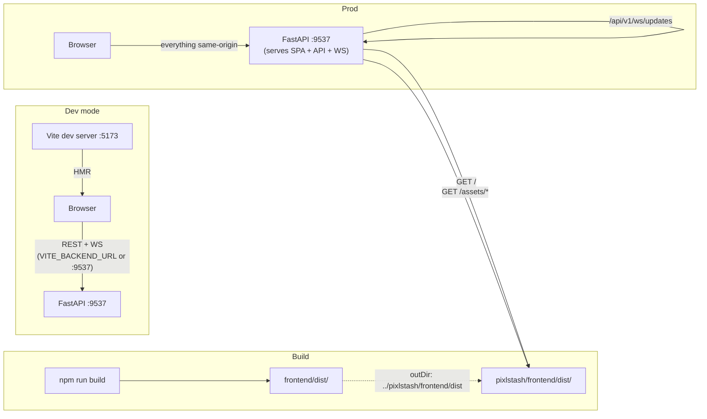
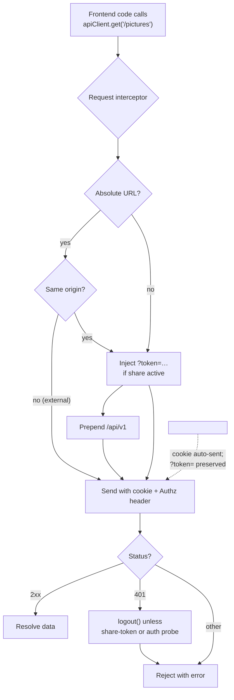

# PixlStash Integration Architecture

> Cross-cutting reference for the **boundary** between the FastAPI backend (`pixlstash/`) and the Vue 3 SPA (`frontend/`). Read alongside [backend_architecture.md](backend_architecture.md) and [frontend_architecture.md](frontend_architecture.md).
>
> Anything in this document is a contract — changing one side without updating the other will break the app.

---

## Table of Contents

1. [Single-Origin Model](#1-single-origin-model)
2. [API Surface & URL Prefix](#2-api-surface--url-prefix)
3. [API Client (`apiClient.js`)](#3-api-client-apiclientjs)
4. [Authentication & Session](#4-authentication--session)
5. [Share Tokens (Public Read-Only Access)](#5-share-tokens-public-read-only-access)
6. [CORS Policy](#6-cors-policy)
7. [WebSocket Channels](#7-websocket-channels)
8. [Real-Time Event Contract](#8-real-time-event-contract)
9. [Image & Thumbnail Serving](#9-image--thumbnail-serving)
10. [File Uploads (Import)](#10-file-uploads-import)
11. [Long-Running Operations](#11-long-running-operations)
12. [Configuration Sync](#12-configuration-sync)
13. [Error Handling Contract](#13-error-handling-contract)
14. [Build & Deployment Coupling](#14-build--deployment-coupling)
15. [Host vs Container Paths](#15-host-vs-container-paths)
16. [Versioning](#16-versioning)
17. [Integration Pitfalls](#17-integration-pitfalls)
18. [Integration Diagrams](#18-integration-diagrams)

---

## 1. Single-Origin Model

PixlStash is designed to be served from **one origin**: the FastAPI server hosts both the API and the bundled SPA. The frontend assumes this in many places:

- `deriveBackendUrl()` in [apiClient.js](../frontend/src/utils/apiClient.js) builds the API base URL from `window.location` — no hard-coded backend host.
- WebSocket URLs are derived from the same origin (`http:` → `ws:`, `https:` → `wss:`).
- Image `` URLs are same-origin relative or absolute to the page origin.
- Cookie-based auth depends on the SPA and API being same-origin.

**Override**: `VITE_BACKEND_URL` (build-time env var) can point the SPA at a different backend — used during local Vite development against a remote server.

---

## 2. API Surface & URL Prefix

- All REST endpoints live under **`/api/v1/`** (constant `API_V1_PREFIX` in [server.py](../pixlstash/server.py)).
- The `apiClient` request interceptor automatically prepends `/api/v1` to any relative URL that does not already start with it — frontend code can call `apiClient.get('/pictures')` and have it routed to `/api/v1/pictures`.
- WebSocket endpoints are **also under `/api/v1/`**: `/api/v1/ws/updates` and `/api/v1/ws/comfyui`.
- Auth endpoints follow the same rule: `POST /api/v1/login`, `POST /api/v1/logout`, `GET /api/v1/check-session`.
- Static assets are served at `/assets/*` (Vite bundle output) and the SPA shell at `/` (serves `frontend/dist/index.html`).

**Contract rule**: every new backend router must be mounted with `prefix=API_V1_PREFIX`. Every new frontend call must use a relative URL (the client adds the prefix).

---

## 3. API Client ([apiClient.js](../frontend/src/utils/apiClient.js))

Single shared **axios** instance with:

| Setting | Value | Rationale |
|---------|-------|-----------|
| `baseURL` | derived from `window.location` (or `VITE_BACKEND_URL`) | Same-origin assumption |
| `withCredentials: true` | always on | Required so the browser sends the JWT cookie |
| `timeout` | 60 000 ms | Many endpoints are slow (import, plugin runs) |
| Default `Content-Type` | `application/json` | Overridden for `multipart/form-data` uploads |

### Request interceptor

1. Skip absolute URLs to other origins (avoids leaking the share token to third-party hosts such as a local ComfyUI).
2. If a share token is active, inject `?token=<token>` as a query param.
3. Prepend `/api/v1` to any relative URL that doesn't already start with it.

### Response interceptor

On `401 Unauthorized`, the client calls `logout()` automatically — **except**:
- The probe endpoint `/users/me/auth` (used to test credentials without side-effects).
- Requests made under a share token (a 401 just means that endpoint is outside the token's scope).

All frontend code **must** route HTTP traffic through this client; bypassing it skips auth, share-token injection, and 401 handling. The only legitimate bypass is direct ``, which uses `appendShareToken()` to preserve the share token.

---

## 4. Authentication & Session

### Authentication modes

1. **Cookie session** (browser SPA): `POST /api/v1/login` with `{username, password}` returns a JWT in an **HttpOnly cookie**. The browser sends it automatically thanks to `withCredentials: true`.
2. **Bearer token** (programmatic clients): a `UserToken` (long-lived API token) passed as `Authorization: Bearer <token>`.
3. **Share token** (public read-only): a scoped `UserToken` passed as `?token=<token>` query param. See §5.

### Session bootstrap

On app mount, the SPA calls:

- `GET /api/v1/login` — determines whether registration is needed.
- `GET /api/v1/check-session` — validates the current cookie; on `401`, the SPA renders the login screen.
- `GET /api/v1/users/me/config` (or equivalent) — fetches the user's settings (`sessionContext` ref).

### Logout

`POST /api/v1/logout` clears the session cookie; the SPA wipes `isAuthenticated` and `sessionContext`.

### Reactive state

`apiClient.js` exports reactive refs that the rest of the SPA reads:

| Export | Type | Meaning |
|--------|------|---------|
| `isAuthenticated` | `Ref<boolean>` | True after successful login or `check-session` |
| `sessionContext` | `Ref<object \| null>` | Current user/scope/limits |
| `isReadOnly` | `ComputedRef<boolean>` | True when `sessionContext.scope === 'READ'` |

Components must respect `isReadOnly` for any mutating UI (hide edit/delete affordances when true).

---

## 5. Share Tokens (Public Read-Only Access)

- Activated via `activateShareToken(token)` when the SPA detects a `?token=` query param at boot.
- Stored in module-scope (not persisted) — refreshing without the query param exits share mode.
- Injected automatically into:
  - Every same-origin axios request (request interceptor).
  - Every `` / `<video src>` URL built through `appendShareToken(url)`.
- A share token is a `UserToken` with `scope=READ` and an optional `resource_type`/`resource_id` (picture set, character, project). The backend enforces scope per request; the SPA hides all write affordances when `isReadOnly` is true.
- Backend never logs the token; frontend never sends it cross-origin.

---

## 6. CORS Policy

Configured in [server.py](../pixlstash/server.py) (`CORSMiddleware`):

- `allow_origin_regex` always permits **`localhost`**, **`127.0.0.1`**, and the host's detected **LAN IP**, on any port and over `http` or `https`. This lets the Vite dev server (default `:5173`) and other dev clients talk to the backend without manual configuration.
- Additional explicit origins can be added through the server config `cors_origins` list.
- `allow_credentials=True` — required because the SPA uses cookie auth.
- `allow_methods=["*"]`, `allow_headers=["*"]`.

**Rule**: any new dev environment must satisfy the regex above or be added to `cors_origins`, otherwise cookies will be dropped.

---

## 7. WebSocket Channels

Two endpoints, both under the API prefix:

| Endpoint | Used by | Purpose |
|----------|---------|---------|
| `GET /api/v1/ws/updates` | [App.vue](../frontend/src/App.vue) | Vault-wide events (pictures, tags, characters, plugin progress) |
| `GET /api/v1/ws/comfyui?clientId=…` | [ComfyUiRunner.vue](../frontend/src/components/ComfyUiRunner.vue) | ComfyUI workflow execution stream |

### Lifecycle (`/ws/updates`)

1. Frontend opens the socket after auth succeeds.
2. On `open`, the SPA sends a `set_filters` message with the current view filters (selected character, set(s), search query). The backend uses these to scope which events the client receives.
3. The server pushes JSON events as state changes occur.
4. On `close`, the SPA auto-reconnects after 2 s (`updatesReconnectTimer`).

### Filter message format

```json
{
  "type": "set_filters",
  "selected_character": "<id|null>",
  "selected_set": "<id|null>",
  "selected_sets": ["<id>", ...],
  "search_query": "..."
}
```

When filters change in the UI, the SPA re-sends a `set_filters` message.

---

## 8. Real-Time Event Contract

The backend's [EventType](../pixlstash/event_types.py) enum names are **not** sent verbatim. Wire payloads use **snake_case** `type` strings. Both sides must agree on these strings — they are the integration contract.

| Wire `type` | Trigger | Payload fields | Frontend behaviour |
|-------------|---------|---------------|--------------------|
| `pictures_changed` | Picture metadata/score/quality updated | `picture_ids: number[]`, optional `fields: string[]` | Debounced sidebar refresh + grid version bump; for `LIKENESS_GROUPS` sort, dispatch a tag-update event instead. When `fields` is present and **none** of the named fields affect the SPA's current sort/filters (e.g. `["smart_score"]` under a date sort), the SPA skips the refresh entirely. Omit `fields` for changes that may affect any view (user edits, imports) so the SPA always refreshes. |
| `picture_imported` | New picture entered the vault (ComfyUI, watch folder, API) | `picture_ids: number[]` | If no upload is in progress, increment "pending external imports" pill; refresh grid when in the all-pictures view |
| `characters_changed` | Character created/updated/deleted or face reassigned | — | Refresh sidebar (character list) |
| `tags_changed` | Tags or tag predictions changed | `picture_ids: number[]` | Bump `wsTagUpdate` so affected grid cards re-render |
| `plugin_progress` | Image plugin run progress | `plugin`, `progress`, `total`, `picture_id` | Update `wsPluginProgress` for the plugin progress UI |

**Rules for adding a new event:**
1. Add the enum to `event_types.py`.
2. Use a snake_case wire `type` and document it here.
3. Always include enough context (typically `picture_ids`) so the SPA can do targeted updates rather than full reloads.
4. For a `pictures_changed` event raised by background work that only touches non-visible/non-sortable columns (embeddings, scores), tag it with `fields` (pass `{"picture_ids": [...], "fields": [...]}` to `notify`) so the SPA can skip the refresh under unaffected sorts. Map the field in `App.vue#pictureChangeFieldAffectsView`.
5. Update `App.vue#onmessage` to handle it.

**Backend filtering**: the server uses the client's last `set_filters` to decide whether to push an event. Events outside the client's current view are dropped server-side to reduce noise.

---

## 9. Image & Thumbnail Serving

Browser-native `` tags **cannot** use the axios interceptor, so the integration relies on:

- **Cookie auth** (sent automatically by the browser on same-origin GETs).
- **Share-token injection** via `appendShareToken(url)` — every component that builds an image URL for direct browser fetch must wrap it.

### Endpoint patterns

| URL | Purpose |
|-----|---------|
| `GET /api/v1/pictures/{id}/thumbnail` | Cached WebP thumbnail. Backend uses an async lock + LRU memory cache + on-disk `.pixlstash/` cache. |
| `POST /api/v1/pictures/thumbnails` | Batch thumbnail metadata (JSON). |
| `GET /api/v1/pictures/{id}/{ext}` | Original file (optionally watermarked). |

### Watermarking

The decision to watermark is made server-side per request based on `User.embed_watermark` and the token's scope. The frontend does **not** need to know whether a given URL will be watermarked, but it must regenerate URLs (cache-bust) when watermark settings change.

---

## 10. File Uploads (Import)

- **Endpoint**: `POST /api/v1/pictures/import` (multipart/form-data).
- **Content**: image files or `.zip` archives (extracted server-side).
- **Deduplication**: server computes `pixel_sha` (SHA-256 of decoded pixels) and skips duplicates.
- **Async**: the response includes a `task_id`. The frontend polls `GET /api/v1/pictures/import/{task_id}/status` for completion percentage.
- **Real-time**: as pictures are persisted, the backend also broadcasts `picture_imported` over the WebSocket. The SPA distinguishes its **own** upload (drives a progress dialog) from **external** imports (shown via the "pending external imports" pill).

**Contract**: the SPA sets `isUploadInProgress` for the duration of its own upload so that incoming `picture_imported` events don't double-count.

---

## 11. Long-Running Operations

Two complementary mechanisms; most workflows use both:

1. **Task-id polling** — for client-initiated operations with a clear end state (import, export, bulk score apply, plugin run on many pictures): the endpoint returns `{task_id}`; the SPA polls `…/{task_id}/status` until completion, then fetches the result (e.g. download the ZIP).
2. **WebSocket events** — for backend-initiated state changes (watch folder ingest, background quality/tag/embedding work, plugin progress): the SPA refreshes affected views from events without polling.

**Rule of thumb**:
- If the user triggered it and expects a result file → polling.
- If it changes vault state that other clients also need to see → WebSocket event.
- For UX (e.g. plugin progress bar), emit both: polling for the initiator and WS broadcasting for everyone else.

---

## 12. Configuration Sync

- All persistent user settings live on the `User` row (see [backend_architecture.md §6](backend_architecture.md#6-database-models)).
- Frontend fetches them once at boot into `sessionContext` and a local `configSnapshot` ref.
- Updates use `PATCH` against the user-config endpoint with **partial** payloads (only changed fields).
- The SPA applies updates **optimistically** to local refs and reconciles on response. Failed updates revert and surface a toast.
- Hidden tags, sort, columns, theme, watermark settings, smart-score penalised tags, etc. are all part of this object — keep the field names identical on both sides.

---

## 13. Error Handling Contract

| HTTP status | Frontend reaction |
|-------------|------------------|
| `2xx` | Use response data |
| `400`, `422` | Surface the response's `detail` field in a toast; do not log the user out |
| `401` | Auto-logout (see §3); SPA navigates to login. Suppressed for share-token sessions and the auth probe |
| `403` | Toast "permission denied"; component disables the action |
| `404` | Component-local "not found" state |
| `409` | Surface conflict details (used by import-dedup and rename operations) |
| `5xx` | Generic error toast; the user may retry |

Backend rule: errors must use FastAPI's `HTTPException(status_code, detail=...)` with a human-readable `detail`. Never return a `500` for an expected validation failure.

---

## 14. Build & Deployment Coupling

### Build output

[vite.config.js](../frontend/vite.config.js) writes the build to **`../pixlstash/frontend/dist`** — directly into the Python package. This is intentional: `pip install -e .` then ships the built SPA along with the backend.

### Serving order (in `_setup_routes`)

1. `/assets/*` is mounted as `StaticFiles(directory=…/frontend/dist/assets)`.
2. `/` returns `frontend/dist/index.html` (the SPA shell). If the dist directory is missing (e.g. a clean dev checkout), the root returns a small JSON status so the user sees a clear error.
3. All API routers are mounted under `/api/v1/`.
4. Other top-level routes are added explicitly for public sharing.

### Dev workflow

- Backend: `python -m pixlstash.server` (default port `9537`).
- Frontend: `npm run dev` inside [frontend/](../frontend/) (Vite at `:5173`, HMR enabled).
- CORS regex automatically permits `localhost:5173`.
- Cookies cross ports only if both sides agree on credentials (`withCredentials: true` + `allow_credentials=True`).

### Production workflow

- `npm run build` → `pixlstash/frontend/dist/`.
- Run `python -m pixlstash.server`; the SPA is served from the same origin as the API. No proxy needed.

**Pitfall**: forgetting to run `npm run build` before packaging leaves users with the JSON status fallback at `/`.

---

## 15. Host vs Container Paths

When the backend runs in Docker, filesystem paths in the database refer to **container paths**, but the user thinks in **host paths** (e.g. when picking watch folders or reference folders).

- Translation happens entirely backend-side via [utils/path_mapper.py](../pixlstash/utils/path_mapper.py) and [utils/host_path_utils.py](../pixlstash/utils/host_path_utils.py).
- `ImportFolder` / `ReferenceFolder` rows carry both `path` (container) and `host_path` (display).
- API responses include both values for these resources; the SPA must display `host_path` and only send a `host_path` (never a container path) when creating new folders. The backend resolves to a container path.
- The folder picker at `GET /api/v1/filesystem/browse` returns results in container-path space; the SPA presents them with their host equivalents.

The frontend itself should **never** transform paths — always trust the backend's translation.

---

## 16. Versioning

- A single source of truth for the version: the root `pyproject.toml`.
- The backend exposes it via `GET /version` (returns `version`, `install_type`, `docker_variant`).
- The frontend bakes it in at build time via `vite.config.js` (`__APP_VERSION__` reads `pyproject.toml`).
- The SPA can call `/version` at runtime to detect a backend upgrade and prompt the user to reload.

**Rule**: bump the version in `pyproject.toml` *before* building the frontend so the bundle reflects the actual release.

---

## 17. Integration Pitfalls

A focused list — read before changing anything that crosses the boundary.

1. **Don't add new routers without `prefix=API_V1_PREFIX`.** The interceptor expects every API call under `/api/v1`.
2. **Don't bypass `apiClient`.** Hand-rolled `fetch()` calls skip auth, share-token injection, and 401 handling.
3. **Always wrap browser-fetched image URLs in `appendShareToken()`.** Share mode silently breaks without it.
4. **Use snake_case wire `type` strings for events**, not the `EventType` enum name. Mismatched names manifest as a silently dead UI.
5. **Always include `picture_ids` in picture-related events** so the SPA can do targeted refresh — full reloads on every event will not scale.
6. **Optimistic UI must reconcile on failure.** Always revert local state if the PATCH errors out.
7. **Settings field names are a contract.** Renaming a `User` column requires a coordinated frontend change and an Alembic migration.
8. **CORS depends on cookies.** If you ever set `withCredentials: false` on the client or `allow_credentials=False` on the server, the SPA cannot log in.
9. **Image URLs from `` tags use cookie auth.** If you ever switch to header-only tokens for browser sessions, all `` URLs must become blob URLs fetched through `apiClient`.
10. **`frontend/dist/` is part of the Python package.** Add the build step to release automation; never commit a stale `dist/`.
11. **Host vs container paths**: do not let host paths leak into the database, and never display container paths in the UI.
12. **WebSocket reconnect is silent.** If the backend changes the filter schema, old clients will keep sending stale filters until they reload — version the filter message if you change it incompatibly.

---

## 18. Integration Diagrams

### 18.1 End-to-end request & event flow

```mermaid
sequenceDiagram
    autonumber
    participant U as User (Browser)
    participant SPA as Vue SPA
    participant AX as apiClient (axios)
    participant WS as WebSocket (/api/v1/ws/updates)
    participant API as FastAPI (/api/v1)
    participant V as Vault / Workers
    participant DB as SQLite

    U->>SPA: open app
    SPA->>AX: GET /check-session
    AX->>API: cookie + Bearer
    API-->>AX: 200 user context
    SPA->>WS: open connection
    SPA->>WS: { type: set_filters, ... }

    U->>SPA: upload images
    SPA->>AX: POST /pictures/import (multipart)
    AX->>API: forward
    API->>V: enqueue import + processing
    API-->>AX: { task_id }
    AX-->>SPA: task_id
    loop until done
        SPA->>AX: GET /pictures/import/{task_id}/status
        AX-->>SPA: { progress }
    end

    par Background pipeline
        V->>DB: write Picture, Quality, Tags, Embeddings
        V-->>API: emit events (snake_case type)
        API-->>WS: filter by client's set_filters
        WS-->>SPA: { type: pictures_changed, picture_ids: [...] }
        SPA->>SPA: refresh grid / sidebar
    end

    U->>SPA: open a picture
    SPA->>SPA: build 
    Note over SPA,API: Browser sends cookie automatically;<br/>share token appended via appendShareToken()
    API-->>SPA: image bytes (watermarked if applicable)
```

### 18.2 Origin & build coupling



### 18.3 Auth & share-token routing



---

*Last updated: 2026-05-20. Update this document whenever any integration contract (URL prefix, event names, auth mode, build output path, CORS policy, share-token mechanism, settings field names) changes.*
