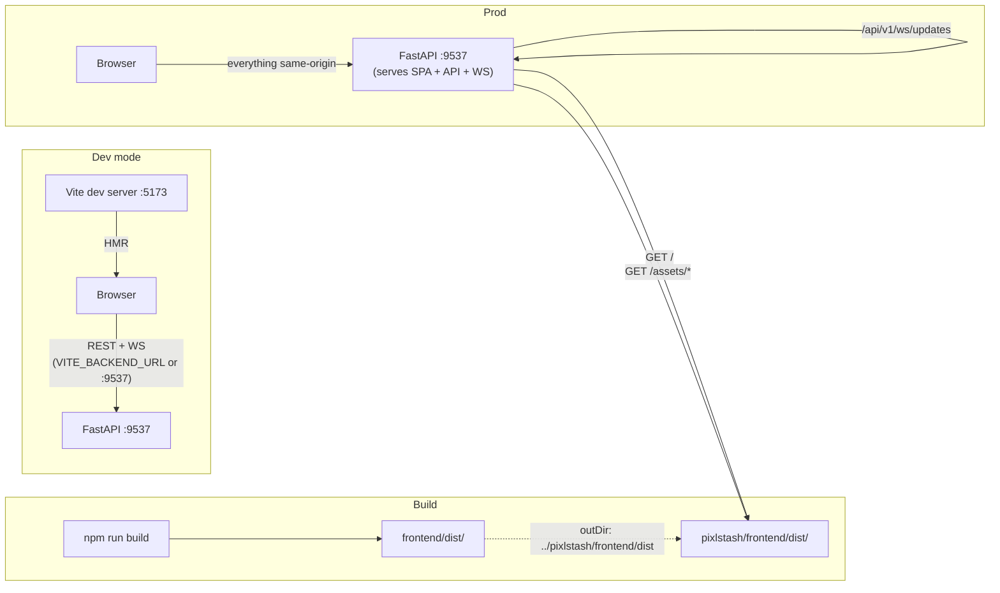
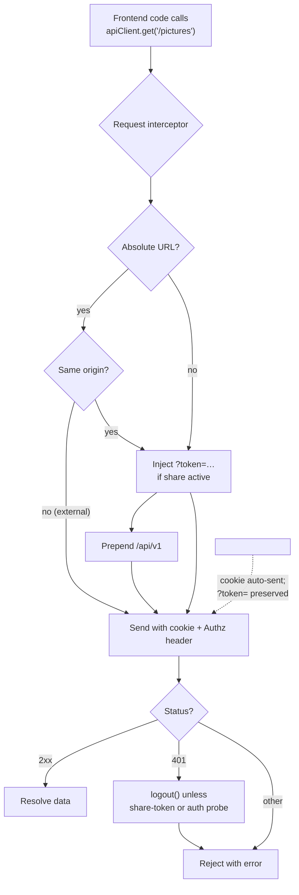

# PixlStash Integration Architecture

> Cross-cutting reference for the **boundary** between the FastAPI backend (`pixlstash/`) and the Vue 3 SPA (`frontend/`). Read alongside [backend_architecture.md](backend_architecture.md) and [frontend_architecture.md](frontend_architecture.md).
>
> Anything in this document is a contract — changing one side without updating the other will break the app.

---

## Table of Contents

1. [Single-Origin Model](#1-single-origin-model)
2. [API Surface & URL Prefix](#2-api-surface--url-prefix)
3. [API Client (`apiClient.js`)](#3-api-client-apiclientjs)
4. [Authentication & Session](#4-authentication--session)
5. [Share Tokens (Public Read-Only Access)](#5-share-tokens-public-read-only-access)
6. [CORS Policy](#6-cors-policy)
7. [WebSocket Channels](#7-websocket-channels)
8. [Real-Time Event Contract](#8-real-time-event-contract)
9. [Image & Thumbnail Serving](#9-image--thumbnail-serving)
10. [File Uploads (Import)](#10-file-uploads-import)
11. [Long-Running Operations](#11-long-running-operations)
12. [Configuration Sync](#12-configuration-sync)
13. [Error Handling Contract](#13-error-handling-contract)
14. [Build & Deployment Coupling](#14-build--deployment-coupling)
15. [Host vs Container Paths](#15-host-vs-container-paths)
16. [Versioning](#16-versioning)
17. [Integration Pitfalls](#17-integration-pitfalls)
18. [Integration Diagrams](#18-integration-diagrams)
19. [Duplicates Queue API (v1.9)](#19-duplicates-queue-api-v19)

---

## 1. Single-Origin Model

PixlStash is designed to be served from **one origin**: the FastAPI server hosts both the API and the bundled SPA. The frontend assumes this in many places:

- `deriveBackendUrl()` in [apiClient.js](../frontend/src/utils/apiClient.js) builds the API base URL from `window.location` — no hard-coded backend host.
- WebSocket URLs are derived from the same origin (`http:` → `ws:`, `https:` → `wss:`).
- Image `` URLs are same-origin relative or absolute to the page origin.
- Cookie-based auth depends on the SPA and API being same-origin.

**Override**: `VITE_BACKEND_URL` (build-time env var) can point the SPA at a different backend — used during local Vite development against a remote server.

---

## 2. API Surface & URL Prefix

- All REST endpoints live under **`/api/v1/`** (constant `API_V1_PREFIX` in [server.py](../pixlstash/server.py)).
- The `apiClient` request interceptor automatically prepends `/api/v1` to any relative URL that does not already start with it — frontend code can call `apiClient.get('/pictures')` and have it routed to `/api/v1/pictures`.
- WebSocket endpoints are **also under `/api/v1/`**: `/api/v1/ws/updates` and `/api/v1/ws/comfyui`.
- Auth endpoints follow the same rule: `POST /api/v1/login`, `POST /api/v1/logout`, `GET /api/v1/check-session`.
- Static assets are served at `/assets/*` (Vite bundle output) and the SPA shell at `/` (serves `frontend/dist/index.html`).

**Contract rule**: every new backend router must be mounted with `prefix=API_V1_PREFIX`. Every new frontend call must use a relative URL (the client adds the prefix).

---

## 3. API Client ([apiClient.js](../frontend/src/utils/apiClient.js))

Single shared **axios** instance with:

| Setting | Value | Rationale |
|---------|-------|-----------|
| `baseURL` | derived from `window.location` (or `VITE_BACKEND_URL`) | Same-origin assumption |
| `withCredentials: true` | always on | Required so the browser sends the JWT cookie |
| `timeout` | 60 000 ms | Many endpoints are slow (import, plugin runs) |
| Default `Content-Type` | `application/json` | Overridden for `multipart/form-data` uploads |

### Request interceptor

1. Skip absolute URLs to other origins (avoids leaking the share token to third-party hosts such as a local ComfyUI).
2. If a share token is active, inject `?token=<token>` as a query param.
3. On **mutating** requests (`POST`/`PUT`/`PATCH`/`DELETE`) inject the per-tab **`X-Client-Id`** header (the same-origin guard above applies, so it is never leaked off-origin). See §8.1.
4. Prepend `/api/v1` to any relative URL that doesn't already start with it.

### Response interceptor

On `401 Unauthorized`, the client calls `logout()` automatically — **except**:
- The probe endpoint `/users/me/auth` (used to test credentials without side-effects).
- Requests made under a share token (a 401 just means that endpoint is outside the token's scope).

All frontend code **must** route HTTP traffic through this client; bypassing it skips auth, share-token injection, and 401 handling. The only legitimate bypass is direct ``, which uses `appendShareToken()` to preserve the share token.

---

## 4. Authentication & Session

### Authentication modes

1. **Cookie session** (browser SPA): `POST /api/v1/login` with `{username, password}` returns a JWT in an **HttpOnly cookie**. The browser sends it automatically thanks to `withCredentials: true`.
2. **Bearer token** (programmatic clients): a `UserToken` (long-lived API token) passed as `Authorization: Bearer <token>`.
3. **Share token** (public read-only): a scoped `UserToken` passed as `?token=<token>` query param. See §5.

### Session bootstrap

On app mount, the SPA calls:

- `GET /api/v1/login` — determines whether registration is needed.
- `GET /api/v1/check-session` — validates the current cookie; on `401`, the SPA renders the login screen.
- `GET /api/v1/users/me/config` (or equivalent) — fetches the user's settings (`sessionContext` ref).

### Logout

`POST /api/v1/logout` clears the session cookie; the SPA wipes `isAuthenticated` and `sessionContext`.

### Reactive state

`apiClient.js` exports reactive refs that the rest of the SPA reads:

| Export | Type | Meaning |
|--------|------|---------|
| `isAuthenticated` | `Ref<boolean>` | True after successful login or `check-session` |
| `sessionContext` | `Ref<object \| null>` | Current user/scope/limits |
| `isReadOnly` | `ComputedRef<boolean>` | True when `sessionContext.scope === 'READ'` |

Components must respect `isReadOnly` for any mutating UI (hide edit/delete affordances when true).

---

## 5. Share Tokens (Public Read-Only Access)

- Activated via `activateShareToken(token)` when the SPA detects a `?token=` query param at boot.
- Stored in module-scope (not persisted) — refreshing without the query param exits share mode.
- Injected automatically into:
  - Every same-origin axios request (request interceptor).
  - Every `` / `<video src>` URL built through `appendShareToken(url)`.
- A share token is a `UserToken` with `scope=READ` and an optional `resource_type`/`resource_id` (picture set, character, project). The backend enforces scope per request; the SPA hides all write affordances when `isReadOnly` is true.
- Backend never logs the token; frontend never sends it cross-origin.

---

## 6. CORS Policy

Configured in [server.py](../pixlstash/server.py) (`CORSMiddleware`):

- `allow_origin_regex` always permits **`localhost`**, **`127.0.0.1`**, and the host's detected **LAN IP**, on any port and over `http` or `https`. This lets the Vite dev server (default `:5173`) and other dev clients talk to the backend without manual configuration.
- Additional explicit origins can be added through the server config `cors_origins` list.
- `allow_credentials=True` — required because the SPA uses cookie auth.
- `allow_methods=["*"]`, `allow_headers=["*"]`.

**Rule**: any new dev environment must satisfy the regex above or be added to `cors_origins`, otherwise cookies will be dropped.

---

## 7. WebSocket Channels

Two endpoints, both under the API prefix:

| Endpoint | Used by | Purpose |
|----------|---------|---------|
| `GET /api/v1/ws/updates` | [App.vue](../frontend/src/App.vue) | Vault-wide events (pictures, tags, characters, plugin progress) |
| `GET /api/v1/ws/comfyui?clientId=…` | [ComfyUiRunner.vue](../frontend/src/components/ComfyUiRunner.vue) | ComfyUI workflow execution stream |

### Lifecycle (`/ws/updates`)

1. Frontend opens the socket after auth succeeds.
2. On `open`, the SPA sends a `set_filters` message with the current view filters (selected character, set(s), search query). The backend uses these to scope which events the client receives.
3. The server pushes JSON events as state changes occur.
4. On `close`, the SPA auto-reconnects after 2 s (`updatesReconnectTimer`).

### Filter message format

```json
{
  "type": "set_filters",
  "client_id": "<opaque per-tab uuid>",
  "selected_character": "<id|null>",
  "selected_set": "<id|null>",
  "selected_sets": ["<id>", ...],
  "search_query": "..."
}
```

When filters change in the UI, the SPA re-sends a `set_filters` message.

`client_id` carries the tab's `X-Client-Id` over the socket because browsers cannot set custom headers on a WebSocket handshake. The server stores it on the per-client record (capped at 200 chars, ignored if longer). It is **forward-looking only** — for v1 the frontend matches the echoed `origin_client_id` against its own id locally, so the server does not yet need it to route events. See §8.1.

---

## 8. Real-Time Event Contract

The backend's [EventType](../pixlstash/event_types.py) enum names are **not** sent verbatim. Wire payloads use **snake_case** `type` strings. Both sides must agree on these strings — they are the integration contract.

### Uniform event envelope

`_broadcast_ws_event` ([server.py](../pixlstash/server.py)) stamps **every** picture/mutation event with the same origin-aware envelope so the SPA can decide *who* caused a change and *what* changed, and drive the grid by intent instead of doing a full reload on every event:

| Field | Type | Description |
|---|---|---|
| `type` | string | Wire type. Picture/mutation events: `picture_imported` \| `pictures_changed` \| `tags_changed` \| `descriptions_changed` \| `characters_changed` \| `plugin_progress`. Snapshot/restore events (carry snapshot/restore info rather than `picture_ids`): `snapshot_created` \| `snapshot_deleted` \| `restore_started` \| `restore_completed` \| `restore_failed`. |
| `event` | string | Backend `EventType.name`; diagnostic only, not part of the behavioural contract. |
| `source` | `"ui"` \| `"external"` | Coarse origin class. `"ui"` = an attributable owner action through the SPA; `"external"` = work that originated outside the UI (watch/reference folders, external API writes, background ML finishers, externally-run ComfyUI). Defaults to `"external"`. |
| `origin_client_id` | `string` \| `null` | The `X-Client-Id` of the originating tab, or `null` for background/external work. **The primary signal** — a tab recognises the echo of its own change by matching this against its own id. |
| `picture_ids` | `number[]` | Affected picture ids. |
| `fields` | `string[]` (optional) | Columns that changed (e.g. `["smart_score"]`); drives the silent-vs-sort-changed decision. Omitted for edits that may affect any view (user edits, imports). |
| `change_kind` | `"added"` \| `"updated"` \| `"removed"` (optional) | Set at the emit site where cheap (`removed` on deletes is free; `added` is implicit for `picture_imported`). **Omitted entirely when unset** — the SPA infers `added` for `picture_imported` and falls back to `updated` otherwise. |

Per-type payload specifics (all carry the envelope fields above):

| Wire `type` | Trigger | Type-specific fields | Frontend behaviour |
|-------------|---------|---------------|--------------------|
| `pictures_changed` | Picture metadata/score/quality updated | optional `fields: string[]` | Routed through the decision rule (§8.2). When `fields` is present and **none** of the named fields affect the SPA's current sort/filters (e.g. `["smart_score"]` under a date sort), a same-view change is applied silently or ignored. Omit `fields` for changes that may affect any view (user edits) so the SPA always reconciles. |
| `picture_imported` | New picture entered the vault (ComfyUI, watch folder, API) | — | Slick in-place insert for the initiating tab, targeted insert for a foreign owner tab, or the **"New pictures"** pill for external imports (§8.2). |
| `characters_changed` | Character created/updated/deleted or face reassigned | — | Refresh sidebar (character list) |
| `tags_changed` | Tags or tag predictions changed | `picture_ids: number[]` | Bump `wsTagUpdate` so affected grid cards re-render |
| `descriptions_changed` | Picture descriptions/captions changed | `picture_ids: number[]` | Refresh affected descriptions |
| `plugin_progress` | Image plugin run progress | `plugin`, `progress`, `total`, `picture_id` | Update `wsPluginProgress` for the plugin progress UI |
| `snapshot_created` / `snapshot_deleted` | Vault snapshot created or deleted | snapshot info (id, kind, …) | Refresh the snapshots panel |
| `restore_started` / `restore_completed` / `restore_failed` | Vault restore lifecycle | restore info | Drive the restore progress/result UI |

> **`source` migration:** the import emit's legacy value `"user"` is migrated to `"ui"`. During the transition the frontend (`normaliseSource`) accepts **both** — the real signal is the `origin_client_id` match, so accepting the legacy value just over-notifies (safe). Drop the legacy acceptance once both ends have shipped.

**Rules for adding a new event:**
1. Add the enum to `event_types.py`.
2. Use a snake_case wire `type` and document it here.
3. Always include enough context (`picture_ids`, and `change_kind` where cheap) so the SPA can do targeted updates rather than full reloads.
4. For a `pictures_changed` event raised by background work that only touches non-visible/non-sortable columns (embeddings, scores), tag it with `fields` (pass `{"picture_ids": [...], "fields": [...]}` to `notify`) so the SPA can skip the refresh under unaffected sorts. Map the field in `App.vue#pictureChangeFieldAffectsView`.
5. Mutating in-request emits must pass `source`/`origin_client_id` (and `change_kind`) into the event `data` dict — see §8.1.
6. Handle it via `useGridRealtimeSync` (picture events) or the remaining `App.vue` branches (tags/descriptions/characters/plugin).

**Backend filtering**: the server uses the client's last `set_filters` to decide whether to push an event. Events outside the client's current view are dropped server-side to reduce noise. The stream is **owner-only** — scoped/READ tokens may connect but receive nothing.

### 8.1 Client id & origin attribution

Each browser **tab** generates one opaque id (`crypto.randomUUID()`), persisted in `sessionStorage` (survives reload; in-memory fallback in private mode). It is:

- stored in `useWsStore` and mirrored into `apiClient.js` module scope (to dodge Pinia-init timing);
- sent on **every mutating HTTP request** as the `X-Client-Id` header (≤200 chars — an oversized value is **dropped, not truncated**, so a crafted long value can never collide with a legitimate short one);
- sent over the socket via `set_filters.client_id` (§7), because browsers can't set headers on a WS handshake.

The backend's `OriginClientMiddleware` captures the header into `request.state.origin_client_id` (and a contextvar). Mutating handlers thread it into the event `data` dict so `_broadcast_ws_event` echoes it back as `origin_client_id`, letting the originating tab suppress the reload for its own optimistic op.

**Security:** `X-Client-Id` is attacker-controllable and is used **only** for echo-matching — **never** for authorization or scoping. It is length-capped and not logged at INFO. The WS stream stays owner-only. See the security sign-off in [docs/reviews/feature-slick-grid-updates.md](reviews/feature-slick-grid-updates.md).

### 8.2 Frontend decision rule

The picture-event policy lives in [`useGridRealtimeSync.js`](../frontend/src/composables/useGridRealtimeSync.js) (App.vue keeps only socket lifecycle). For each picture event, in order:

1. **Own-origin echo** (`origin_client_id === myClientId`) → **suppress** (the optimistic local op already applied it). **Exception:** an `updated` event whose `fields` include a *server-computed* sort field (`smart_score`, `character_likeness`) that is also the **active sort** → single-card `refreshSmartScoreForImage`/`refreshGridImage` reconcile, never a reload (the optimistic guess can diverge from server truth).
2. **Foreign owner UI** (`source: "ui"`, different origin) → targeted op: `added` → insert at sorted position + highlight; `updated` → `refreshGridImage`/reposition, gated by `pictureChangeAffectsView(fields)` (ignored when the changed fields don't affect the current view); `removed` → `removeImagesById`.
3. **External** (`source: "external"`) →
   - `added` → the primary-coloured **"New pictures"** pill (never auto-inserts under the user);
   - `removed` → removed **silently** in place (never leave a 404-clickable card);
   - `updated` with `pictureChangeAffectsView(fields) === true` (would reorder the grid) → the sibling **"Sort order changed externally — click to refresh"** pill, instead of reshuffling under the user;
   - `updated` with known fields that are **invisible** to the current sort/filter → **ignored** (e.g. a background `smart_score` recompute under a date sort) to avoid a per-card `/metadata` + thumbnail **refetch storm** for values that aren't even displayed.
4. **Unrecognised shape** (e.g. a bulk sort/filter-defining change) → a rare, **logged** full-reload fallback.

**ComfyUI classification:** the **in-app** runner is **UI-initiated but async** — there is no optimistic client-side copy to suppress, because the generation completes server-side after the request returns. `routes/comfyui.py` therefore emits a **single** `picture_imported` with `source: "ui"` and **no origin echo** (`origin_client_id` omitted), so **every** owner tab — including the initiating one — performs a slick in-place insert via `handleForeignUi` rather than the originator suppressing its own echo. It does **not** fire a second `pictures_changed`/`CHANGED_PICTURES` broadcast; the field-scoped `Missing*Finder` events (smart_score/quality) emit their own targeted events later. Externally-run ComfyUI lands via the watch/reference finders, which stay `source: "external"`, origin `null` → the "New pictures" pill.

---

## 9. Image & Thumbnail Serving

Browser-native `` tags **cannot** use the axios interceptor, so the integration relies on:

- **Cookie auth** (sent automatically by the browser on same-origin GETs).
- **Share-token injection** via `appendShareToken(url)` — every component that builds an image URL for direct browser fetch must wrap it.

### Endpoint patterns

| URL | Purpose |
|-----|---------|
| `GET /api/v1/pictures/thumbnails/{id}.webp` | Cached WebP thumbnail. Backend uses an async lock + LRU memory cache + on-disk `.pixlstash/` cache. |
| `POST /api/v1/pictures/thumbnails` | Batch thumbnail metadata (JSON). |
| `GET /api/v1/pictures/{id}.{ext}` | Original file (optionally watermarked). |

### Watermarking

The decision to watermark is made server-side per request based on `User.embed_watermark` and the token's scope. The frontend does **not** need to know whether a given URL will be watermarked, but it must regenerate URLs (cache-bust) when watermark settings change.

---

## 10. File Uploads (Import)

- **Endpoint**: `POST /api/v1/pictures/import` (multipart/form-data).
- **Content**: image files or `.zip` archives (extracted server-side).
- **Deduplication**: server computes `pixel_sha` (SHA-256 of decoded pixels) and skips duplicates.
- **Async**: the response includes a `task_id`. The frontend polls `GET /api/v1/pictures/import/status?task_id=…` for completion percentage.
- **Real-time**: as pictures are persisted, the backend also broadcasts `picture_imported` over the WebSocket carrying the uniform envelope (§8). The SPA distinguishes its **own** upload (drives a progress dialog) from a **foreign owner tab** (slick insert) and from **external** imports (the "New pictures" pill) via `source`/`origin_client_id`.

**Contract**: the SPA sets `isUploadInProgress` for the duration of its own upload so that incoming `picture_imported` events don't double-count.

---

## 11. Long-Running Operations

Two complementary mechanisms; most workflows use both:

1. **Task-id polling** — for client-initiated operations with a clear end state (import, export, bulk score apply, plugin run on many pictures): the endpoint returns `{task_id}`; the SPA polls `…/status?task_id=…` until completion, then fetches the result (e.g. download the ZIP via `/pictures/export/download/{task_id}`).
2. **WebSocket events** — for backend-initiated state changes (watch folder ingest, background quality/tag/embedding work, plugin progress): the SPA refreshes affected views from events without polling.

**Rule of thumb**:
- If the user triggered it and expects a result file → polling.
- If it changes vault state that other clients also need to see → WebSocket event.
- For UX (e.g. plugin progress bar), emit both: polling for the initiator and WS broadcasting for everyone else.

### 11.1 Object detection (Segment) & bbox export

The **Segment** action runs Florence-2 object detection over the selected pictures and stores labelled boxes per picture (see [backend_architecture.md §6/§7](backend_architecture.md)). It follows the WebSocket-event branch of the rule above — it is a backend task, not a downloadable result.

- **Enqueue**: `POST /api/v1/pictures/detect` with body `{ "picture_ids": [int, …], "prompt": "optional phrase" }`. An empty/omitted `prompt` runs dense object detection; a non-empty phrase runs open-vocabulary grounding for that phrase. Scoped tokens have `picture_ids` filtered to their grant (deny-by-default; all-out-of-scope → 403). Returns `{ "status": "queued", "task_id", "picture_ids", "prompt" }`. Progress surfaces in the existing task-manager UI.
- **Completion**: the task fires a `pictures_changed` event (`{picture_ids, change_kind:"updated"}`) over the WebSocket; the SPA refreshes affected views.
- **Read**: `GET /api/v1/pictures/{id}/detections` returns a **bare JSON array** (object-scope enforced before any read):
  ```json
  [ { "id": 1, "picture_id": 42, "frame_index": 0, "detection_index": 0,
      "label": "dog", "bbox": [x1, y1, x2, y2], "score": null,
      "source": "florence2:od" } ]
  ```
  `bbox` is pixel `xyxy` in the **original** picture coordinate space (same convention as faces). `score` is `null` for Florence (it emits no per-box confidence). The overlay (`ImageOverlay.vue`) renders these as a toggleable layer next to the face-bbox layer.
- **Export sidecar** (`GET /api/v1/pictures/export?bbox_mode=…`, FULL exports only): writes a per-image `{stem}.json` into the ZIP. `bbox_mode=none` (default) writes nothing. Two formats:
  - `bbox_mode=coco-json` — a COCO-subset sidecar (pixel `xyxy`), written *alongside* the `.txt` caption. Boxes and `width`/`height` scale to match the exported image when a reduced `resolution` is selected.
    ```json
    {"image":"IMG_0001.jpg","width":1920,"height":1080,
     "schema":"pixlstash.detections/v1","bbox_format":"xyxy_px",
     "objects":[{"label":"dog","bbox":[x1,y1,x2,y2],"score":0.0}]}
    ```
  - `bbox_mode=ideogram-json` — an **Ideogram-4 structured-JSON caption** ([official schema](https://github.com/ideogram-oss/ideogram4/blob/main/docs/prompting.md)): this `{stem}.json` *is* the caption ai-toolkit consumes (set `caption_ext: json` in the dataset config). Boxes are **normalized `[y_min,x_min,y_max,x_max]` on a 0-1000 grid** (resolution-independent, so the `resolution` setting does not affect them). Each detection is a `type:"obj"` element with its label as `desc`; key order (`type, bbox, desc` / top-level order) is preserved because the model was trained on a fixed key order. The picture's caption becomes `high_level_description`; `style_description` is omitted (optional). The `.txt` caption is still written per `caption_mode`, so the user picks which one ai-toolkit reads via `caption_ext`.
    ```json
    {"high_level_description":"a dog on grass",
     "compositional_deconstruction":{"background":"",
       "elements":[{"type":"obj","bbox":[y_min,x_min,y_max,x_max],"desc":"dog"}]}}
    ```

### 11.2 Remix — "Generate variants" (v1.9)

Right-clicking a grid image offers **Generate variants…**, which runs one picture through the shipped ComfyUI engine. It follows the WebSocket branch of the rule above: the dialog submits, closes, and the app-wide `ComfyUiRunner` owns progress; the output arrives as a normal `picture_imported` event and is inserted in place (§8).

Two round trips, both scoped to the source picture (`PICTURE_SCOPED` in `ROUTE_POLICIES`):

- **Ask** `GET /api/v1/comfyui/pictures/{id}/recipe`. Answers whether the file carries a *replayable* recipe — the embedded API-format `prompt` chunk, never the UI `workflow` chunk — and pre-flights it against the user's ComfyUI:
  ```json
  {"available": true, "reason": null, "summary": "API Workflow · 12 nodes",
   "positive_prompt": "…", "seed": 12345, "models": ["…"], "loras": [],
   "node_count": 12,
   "node_classes": ["CheckpointLoaderSimple","CLIPTextEncode","KSampler","SaveImage"],
   "source_is_imported": true, "source_label": "Watched folder",
   "seed_inputs": [{"node_id":"3","class_type":"KSampler","field":"seed","value":1}],
   "preflight": {"ok": true, "checked": true, "missing_node_classes": [],
                 "missing_models": [], "missing_input_images": [],
                 "has_save_image": true, "unchecked_fields": 0}}
  ```
  `node_classes` (distinct `class_type`, sorted) and `source_is_imported` / `source_label` exist for the owner's **consent** decision, not for display polish — see the untrusted-graph note below. `node_classes` is read from the file, so unlike everything under `preflight` it is populated even when ComfyUI was unreachable.
  **Three distinct negative answers, and the SPA must not collapse them**, because they send the user to three different places:
  | Response | Meaning | UI |
  |---|---|---|
  | `available:false`, `reason:"no_prompt_chunk"` | Ordinary photo, A1111 output, stripped metadata, or a UI-graph-only file | Recipe mode disabled: "No executable workflow embedded" |
  | `available:false`, `reason:"no_seed_input"` | The graph has no seed to change, so a re-run would be byte-identical (and would be deduped on `pixel_sha`, emitting no event — the user would see nothing at all) | Recipe mode disabled, with that reason |
  | `preflight.ok:false` | Checked, and this ComfyUI cannot run it | Recipe mode disabled, naming the missing node types / models / input images |
  | `preflight.checked:false` | ComfyUI was unreachable — **the check did not run; this is NOT a pass** | Recipe mode stays *selectable* but is **refused by default**: the run needs an explicit acknowledgement (below) |

  `unchecked_fields > 0` means the check was partial (a field ComfyUI does not enumerate, or a `remote` combo it fills lazily) and must not read as a clean bill of health. It is **not** the same state as `checked:false` and must not be gated the same way.

- **Run** `POST /api/v1/comfyui/run_recipe` with `{picture_id, seed_mode, seed?, client_id?, stack?, allow_unchecked?}`, or `POST /api/v1/comfyui/run_i2i` for template mode (which now takes the same `seed_mode`/`seed` pair as `run_t2i`). Both return `{status, prompts:[{picture_id, prompt_id}]}`; the SPA passes `prompts` to `ComfyUiRunner` so its ComfyUI-WebSocket progress tracking picks the run up.

**The client never sends a graph.** `run_recipe` re-extracts the prompt chunk from the picture's file on every call. That keeps the picture-scoped authz declaration a complete access control for the endpoint, and it means a stale client cannot replay something the file no longer contains.

**But the graph is still untrusted input, and the contract reflects that** (review finding R3, CWE-829). It is authored by whoever made the image file; replaying it executes it on the owner's ComfyUI, bounded only by their installed node packs. The owner is the trust anchor, so the two sides split the job:

- **Server side.** `run_recipe` returns **400** when `preflight.checked` is false and the body carries no `allow_unchecked: true`. The refusal is enforced on the server, not only in the dialog — a UI-only gate is not a gate. `allow_unchecked` is accepted as `allow_unchecked` or `allowUnchecked`, matching the existing `client_id`/`clientId` pair, and an accepted override is logged with the node classes that ran.
- **Client side.** The SPA must render `node_classes` before the run button is usable, must send `allow_unchecked` **only** for a run the user explicitly acknowledged (never as a constant, never when `preflight.checked` is true), and must surface `source_is_imported` as a warning rather than a gate. See the `RemixDialog.vue` consent section in `frontend_architecture.md` for why the gate is deliberately narrow: an acknowledgement in front of a common state becomes a reflex and stops protecting the rare one.

**Seed ranges differ between the routes** — 32-bit for the template paths, 64-bit for replay (the shipped Flux2 Klein template's own `noise_seed` exceeds 2³²). The dialog caps its input at `Number.MAX_SAFE_INTEGER` regardless, because above 2⁵³ a JavaScript number cannot carry the value the user typed.

---

## 12. Configuration Sync

- All persistent user settings live on the `User` row (see [backend_architecture.md §6](backend_architecture.md#6-database-models)).
- Frontend fetches them once at boot into `sessionContext` and a local `configSnapshot` ref.
- Updates use `PATCH` against the user-config endpoint with **partial** payloads (only changed fields).
- The SPA applies updates **optimistically** to local refs and reconciles on response. Failed updates revert and surface a toast.
- Hidden tags, sort, columns, theme, watermark settings, smart-score penalised tags, etc. are all part of this object — keep the field names identical on both sides.

---

## 13. Error Handling Contract

| HTTP status | Frontend reaction |
|-------------|------------------|
| `2xx` | Use response data |
| `400`, `422` | Surface the response's `detail` field in a toast; do not log the user out |
| `401` | Auto-logout (see §3); SPA navigates to login. Suppressed for share-token sessions and the auth probe |
| `403` | Toast "permission denied"; component disables the action |
| `404` | Component-local "not found" state |
| `409` | Surface conflict details (used by import-dedup and rename operations) |
| `5xx` | Generic error toast; the user may retry |

Backend rule: errors must use FastAPI's `HTTPException(status_code, detail=...)` with a human-readable `detail`. Never return a `500` for an expected validation failure.

---

## 14. Build & Deployment Coupling

### Build output

[vite.config.js](../frontend/vite.config.js) writes the build to **`../pixlstash/frontend/dist`** — directly into the Python package. This is intentional: `pip install -e .` then ships the built SPA along with the backend.

### Serving order (in `_setup_routes`)

1. `/assets/*` is mounted as `StaticFiles(directory=…/frontend/dist/assets)`.
2. `/` returns `frontend/dist/index.html` (the SPA shell). If the dist directory is missing (e.g. a clean dev checkout), the root returns a small JSON status so the user sees a clear error.
3. All API routers are mounted under `/api/v1/`.
4. Other top-level routes are added explicitly for public sharing.

### Dev workflow

- Backend: `python -m pixlstash.app` (default port `9537`).
- Frontend: `npm run dev` inside [frontend/](../frontend/) (Vite at `:5173`, HMR enabled).
- CORS regex automatically permits `localhost:5173`.
- Cookies cross ports only if both sides agree on credentials (`withCredentials: true` + `allow_credentials=True`).

### Production workflow

- `npm run build` → `pixlstash/frontend/dist/`.
- Run `python -m pixlstash.app`; the SPA is served from the same origin as the API. No proxy needed.

**Pitfall**: forgetting to run `npm run build` before packaging leaves users with the JSON status fallback at `/`.

---

## 15. Host vs Container Paths

When the backend runs in Docker, filesystem paths in the database refer to **container paths**, but the user thinks in **host paths** (e.g. when picking watch folders or reference folders).

- Translation happens entirely backend-side via [utils/path_mapper.py](../pixlstash/utils/path_mapper.py) and [utils/host_path_utils.py](../pixlstash/utils/host_path_utils.py).
- `ImportFolder` / `ReferenceFolder` rows carry both `path` (container) and `host_path` (display).
- API responses include both values for these resources; the SPA must display `host_path` and only send a `host_path` (never a container path) when creating new folders. The backend resolves to a container path.
- The folder picker at `GET /api/v1/filesystem/browse` returns results in container-path space; the SPA presents them with their host equivalents.

The frontend itself should **never** transform paths — always trust the backend's translation.

---

## 16. Versioning

- A single source of truth for the version: the root `pyproject.toml`.
- The backend exposes it via `GET /version` (returns `version`, `install_type`, `docker_variant`).
- The frontend bakes it in at build time via `vite.config.js` (`__APP_VERSION__` reads `pyproject.toml`).
- The SPA can call `/version` at runtime to detect a backend upgrade and prompt the user to reload.

**Rule**: bump the version in `pyproject.toml` *before* building the frontend so the bundle reflects the actual release.

---

## 17. Integration Pitfalls

A focused list — read before changing anything that crosses the boundary.

1. **Don't add new routers without `prefix=API_V1_PREFIX`.** The interceptor expects every API call under `/api/v1`.
2. **Don't bypass `apiClient`.** Hand-rolled `fetch()` calls skip auth, share-token injection, and 401 handling.
3. **Always wrap browser-fetched image URLs in `appendShareToken()`.** Share mode silently breaks without it.
4. **Use snake_case wire `type` strings for events**, not the `EventType` enum name. Mismatched names manifest as a silently dead UI.
5. **Always include `picture_ids` in picture-related events** so the SPA can do targeted refresh — full reloads on every event will not scale.
6. **Optimistic UI must reconcile on failure.** Always revert local state if the PATCH errors out.
7. **Settings field names are a contract.** Renaming a `User` column requires a coordinated frontend change and an Alembic migration.
8. **CORS depends on cookies.** If you ever set `withCredentials: false` on the client or `allow_credentials=False` on the server, the SPA cannot log in.
9. **Image URLs from `` tags use cookie auth.** If you ever switch to header-only tokens for browser sessions, all `` URLs must become blob URLs fetched through `apiClient`.
10. **`frontend/dist/` is part of the Python package.** Add the build step to release automation; never commit a stale `dist/`.
11. **Host vs container paths**: do not let host paths leak into the database, and never display container paths in the UI.
12. **WebSocket reconnect is silent.** If the backend changes the filter schema, old clients will keep sending stale filters until they reload — version the filter message if you change it incompatibly.
13. **Delete-forever is a two-call flow and cannot be short-circuited.** `POST /pictures/scrapheap/delete-preview` returns a single-use `confirm_token` bound to that exact selection; `DELETE /pictures/scrapheap` refuses without it (400 missing, 409 spent/expired/wrong-selection) and destroys nothing on a refusal. A type-to-confirm dialog is a client control and proves nothing to the server — CORS admits any `localhost`/LAN-IP *port* with credentials (§6), so a page on another local port could otherwise drive the one irreversible endpoint. Clear the token after every attempt and re-run the preview to retry; never cache one.
14. **`X-Client-Id` / `origin_client_id` is for echo-matching only — never authorization.** It is attacker-controllable; any access decision based on it is a vulnerability. Every mutating in-request emit must carry `source`/`origin_client_id` in the event `data` dict, or the originating tab will full-reload on its own change.

---

## 18. Integration Diagrams

### 18.1 End-to-end request & event flow

```mermaid
sequenceDiagram
    autonumber
    participant U as User (Browser)
    participant SPA as Vue SPA
    participant AX as apiClient (axios)
    participant WS as WebSocket (/api/v1/ws/updates)
    participant API as FastAPI (/api/v1)
    participant V as Vault / Workers
    participant DB as SQLite

    U->>SPA: open app
    SPA->>AX: GET /check-session
    AX->>API: cookie + Bearer
    API-->>AX: 200 user context
    SPA->>WS: open connection
    SPA->>WS: { type: set_filters, ... }

    U->>SPA: upload images
    SPA->>AX: POST /pictures/import (multipart)
    AX->>API: forward
    API->>V: enqueue import + processing
    API-->>AX: { task_id }
    AX-->>SPA: task_id
    loop until done
        SPA->>AX: GET /pictures/import/status?task_id=…
        AX-->>SPA: { progress }
    end

    par Background pipeline
        V->>DB: write Picture, Quality, Tags, Embeddings
        V-->>API: emit events (snake_case type)
        API-->>WS: filter by client's set_filters
        WS-->>SPA: { type: pictures_changed, picture_ids: [...] }
        SPA->>SPA: refresh grid / sidebar
    end

    U->>SPA: open a picture
    SPA->>SPA: build <img src=/api/v1/pictures/{id}.{ext}>
    Note over SPA,API: Browser sends cookie automatically;<br/>share token appended via appendShareToken()
    API-->>SPA: image bytes (watermarked if applicable)
```

### 18.2 Origin & build coupling


```mermaid
flowchart LR
    subgraph DevTime["Dev mode"]
        Vite["Vite dev server :5173"] -- HMR --> Browser
        Browser -- "REST + WS<br/>(VITE_BACKEND_URL or :9537)" --> Backend9537["FastAPI :9537"]
    end

    subgraph BuildTime["Build"]
        NPM["npm run build"] --> Dist["frontend/dist/"]
        Dist -. "outDir: ../pixlstash/frontend/dist" .-> Packaged["pixlstash/frontend/dist/"]
    end

    subgraph Production["Prod"]
        UserBrowser[Browser] -- "everything same-origin" --> Single["FastAPI :9537<br/>(serves SPA + API + WS)"]
        Single -- "GET /" --> Packaged
        Single -- "GET /assets/*" --> Packaged
        Single -- "/api/v1/*" --> Single
        Single -- "/api/v1/ws/updates" --> Single
    end
```

### 18.3 Auth & share-token routing


```mermaid
flowchart TB
    Req["Frontend code calls<br/>apiClient.get('/pictures')"]
    Interceptor{"Request interceptor"}
    Abs{"Absolute URL?"}
    SameOrig{"Same origin?"}
    Inject["Inject ?token=…<br/>if share active"]
    Prefix["Prepend /api/v1"]
    Send["Send with cookie + Authz header"]
    Resp{"Status?"}
    OK["Resolve data"]
    Logout["logout() unless<br/>share-token or auth probe"]
    Throw["Reject with error"]

    Req --> Interceptor --> Abs
    Abs -- "yes" --> SameOrig
    SameOrig -- "yes" --> Inject
    SameOrig -- "no (external)" --> Send
    Abs -- "no" --> Inject --> Prefix --> Send
    Inject --> Send
    Send --> Resp
    Resp -- "2xx" --> OK
    Resp -- "401" --> Logout --> Throw
    Resp -- "other" --> Throw

    Browser["<img :src=appendShareToken(url)>"] -. "cookie auto-sent;<br/>?token= preserved" .-> Send
```

---

## 19. Duplicates Queue API (v1.9)

The contract behind the sidebar **Duplicates** destination. Every route is
`owner_only`; a share token gets 403 on all of them. Backend design is
`docs/backend_architecture.md` §22.

**Two rules the client must hold to.** The queue is *paged*, never fetched whole
(`GET /dedup/groups` returns `total` so a scrollbar can be sized without a second
request), and a group is addressed by its **`signature`**, never by an id. The
signature is a hash of the group's member content hashes, so it survives a rescan
and a re-import; a numeric id would not.

### `GET /dedup/policy`

No parameters. Renders the tier switches and the threshold slider so 0.90 and the
0.65 floor are never hardcoded twice.

```jsonc
{
  "defaults": { "near_enabled": false, "embedding_enabled": false,
                "threshold": 0.9, "min_group_size": 2, "max_group_size": 24 },
  "bounds": {
    "min_threshold": 0.65, "max_threshold": 0.99999,
    "tiers": ["exact", "near", "embedding"],
    "always_on_tiers": ["exact"],
    "tier_requires": { "exact": null, "near": "exact", "embedding": "near" },
    "scope_types": ["global", "project", "set", "character", "folder"],
    "verdicts": ["stacked", "keep_separate"],
    "max_page_size": 200
  }
}
```

`always_on_tiers` is why the exact switch renders disabled; `tier_requires` is why
enabling *embedding* must first enable *near*. Sending `embedding_enabled=true`
without `near_enabled` is a **400**, and a `threshold` below `min_threshold` is a
**422** — neither is silently corrected.

### `GET /dedup/groups`

Query: `near_enabled`, `embedding_enabled`, `threshold`, `scope_type`,
`scope_id`, `offset`, `limit` (≤ 200).

```jsonc
{
  "groups": [{
    "signature": "9f2c…",           // the id every verdict route takes
    "tier": "exact",                 // exact | near | embedding
    "confidence": 1.0,               // 1.0 for exact; else the WEAKEST pairwise link
    "member_count": 2,
    "cover_picture_id": 41,          // a preselection, never a silent decision
    "why": [                         // group evidence, BOTH directions
      { "text": "Identical file hash", "against": false },
      { "text": "Different resolution", "against": true }
    ],
    "created_at": "2026-07-29T09:00:00",
    "candidates": [{
      "picture_id": 41, "width": 6016, "height": 4016, "megapixels": 24.16,
      "size_bytes": 14800000, "format": "jpeg", "is_raw": false,
      "score": 4, "tag_count": 2,
      "created_at": "2026-05-12T14:22:00", "imported_at": "2026-05-13T08:00:00",
      "stack_id": null, "reference_folder_id": null,
      "file_path": null,             // non-null ONLY for reference-folder pictures
      "cover_score": 108.64,         // megapixels*4 + tags*3 + score*2 + 8 if RAW
      "why": [{ "text": "Highest resolution", "against": false }]
    }]
  }],
  "total": 128, "offset": 0, "limit": 20,
  "policy": { … }, "scope": { "scope_type": "global", "scope_id": null, "key": "global" },
  "scan": { "status": "running", "scanned_pictures": 79412, "total_pictures": 128412,
            "scanned_buckets": 210, "total_buckets": 940, "groups_found": 128,
            "error": null }
}
```

`scan` is the banner. `status` is `idle` when the scope has never been scanned —
that is not an error, the queue still shows what an earlier global scan found.
`file_path` is populated **only** for reference-folder pictures, where the user
manages the files; for a managed-library picture the path is an implementation
detail and the API returns `null`.

Render the `why` pills as reasons, not conclusions: `against: false` is the olive
check, `against: true` the red x. A group carrying red pills is the one that needs
Compare.

### `POST /dedup/counts`

Read-only despite the verb (a scope list does not fit a URL). Body:
`{ "policy": {…}, "scopes": [{ "scope_type": "set", "scope_id": "9" }] }`.

```jsonc
{
  "unresolved_groups": 128,                              // the sidebar badge
  "by_tier": { "exact": 96, "near": 30, "embedding": 2 },// INCLUDING disabled tiers
  "scopes": [{ "scope_type": "set", "scope_id": "9", "key": "set:9",
               "unresolved_groups": 4 }],
  "policy": { … }, "scan": { … }
}
```

`by_tier` deliberately reports tiers that are switched off, so a tier switch can
be labelled with what enabling it would add. A non-global scope without a
`scope_id` is a **400**.

### `POST /dedup/scan`

Body: `{ "policy": {…}, "scope": { "scope_type": "project", "scope_id": "3" } }`.
Returns the scan progress row **immediately** — the queue is opened while the
scan runs. Hashes are cached (computed on import), so a scoped scan only reads and
compares them. Tier 1 lands in milliseconds; tier 2 groups appear as each
candidate bucket finishes, so poll `GET /dedup/groups` and watch
`scan.scanned_buckets` rather than waiting for `status: "complete"`.

### Verdict routes

All three take `{ "signature": "9f2c…", "batch_id": "…" }`; `POST
/dedup/verdicts/stack` additionally takes `cover_picture_id` and
`excluded_picture_ids`. An unknown signature, a cover outside the group, or
excluding down to fewer than two members is a **400**. A member frozen by a locked
picture set is a **423** with the usual `pictures_locked` detail.

| Route | Effect |
|---|---|
| `POST /dedup/verdicts/stack` | Stacks the included members behind the cover and applies the metadata union. |
| `POST /dedup/verdicts/keep-separate` | Records that the group is not duplicates. Changes **no** picture row. |
| `POST /dedup/verdicts/reopen` | Returns a decided group to the queue. Does **not** unstack anything. |

`stack` and `keep-separate` return:

```jsonc
{ "signature": "9f2c…", "verdict": "stacked", "stack_id": 77,
  "cover_picture_id": 41, "picture_ids": [41, 42], "excluded_picture_ids": [],
  "batch_id": "a1b2…",
  "metadata_union": { "tags_added": 3, "scores_lifted": 1,
                      "characters_pending": 0, "membership_changed": true,
                      "best_score": 5 } }
```

`metadata_union` is what the action receipt should say. Stacking **unions** tags,
project membership and set membership onto every member and lifts every member to
the highest score; nothing is overwritten and nothing is deleted.

### `POST /dedup/auto-stack`

Body: `{ "scope": {…}, "dry_run": true, "batch_id": null, "limit": null }`.
**Defaults to `dry_run: true`**, which returns the counts the consent dialog shows
and writes nothing. Send `dry_run: false` to apply.

```jsonc
{ "batch_id": "a1b2…", "dry_run": false, "groups": 1204, "pictures": 2611,
  "scope": { … }, "results": [ /* one verdict object per group */ ],
  "failures": [ { "signature": "…", "error": "…" } ] }
```

Only the **exact** tier is eligible; near and embedding groups always go through
the queue no matter how confident they look. Every group in the run shares one
`batch_id`, so N stacks reverse with a single undo. `failures` is non-empty when a
group could not be stacked — one bad group never aborts the run, and the response
reports the partial result honestly rather than hiding it.

### Not in this API

There is **no deletion route** anywhere in v1.9. A stack is a grouping row plus a
cover pointer; dropping it restores the flat grid exactly. Any UI copy implying
files are removed would be wrong.

---

*Last updated: 2026-07-29. Update this document whenever any integration contract (URL prefix, event names, auth mode, build output path, CORS policy, share-token mechanism, settings field names) changes.*
